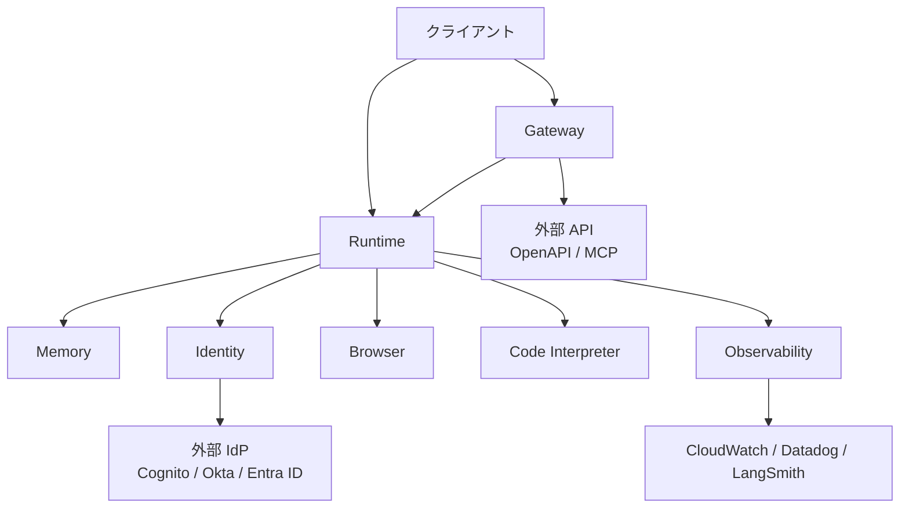
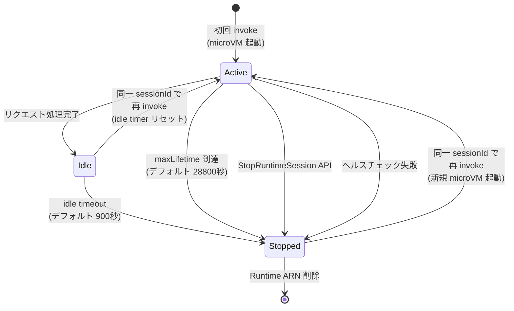

> 本記事は AWS公式ブログ「[Introducing Amazon Bedrock AgentCore: Securely deploy and operate AI agents at any scale](https://aws.amazon.com/blogs/aws/introducing-amazon-bedrock-agentcore-securely-deploy-and-operate-ai-agents-at-any-scale/)」(著者: Danilo Poccia、2025年7月16日公開、2025年10月13日 GA更新) の解説記事です。公式ブログおよび AWS ドキュメントの内容を整理・補足しています。
>
> 関連する Zenn 記事: [Bedrock AgentCore Runtimeで社内ヘルプデスクのセッション管理とコストを最適化する](https://zenn.dev/0h_n0/articles/6e0a4f321e18ab)

---

## ブログ概要

Amazon Bedrock AgentCore は、AIエージェントの本番運用に必要なインフラストラクチャを7つのマネージドサービスとして提供するプラットフォームである。AWS は「任意のフレームワーク・モデルで構築したエージェントを、セキュアにデプロイ・運用できる」と説明している。

AgentCore は2025年7月にプレビュー公開され、2025年10月13日に一般提供 (GA) が開始された。GA に伴い、VPC、AWS PrivateLink、CloudFormation、リソースタグ付けのサポートが追加されている。

対応フレームワークとして CrewAI、LangGraph、LlamaIndex、Strands Agents が公式に挙げられているが、AWS は「任意のフレームワークとモデルをサポートする」としている。

---

## 情報源

| 区分 | URL | 参照日 |
|------|-----|--------|
| 公式ブログ | [Introducing Amazon Bedrock AgentCore](https://aws.amazon.com/blogs/aws/introducing-amazon-bedrock-agentcore-securely-deploy-and-operate-ai-agents-at-any-scale/) | 2026-06-07 |
| 料金ページ | [AgentCore Pricing](https://aws.amazon.com/bedrock/agentcore/pricing/) | 2026-06-07 |
| ライフサイクル設定 | [Configure lifecycle settings](https://docs.aws.amazon.com/bedrock-agentcore/latest/devguide/runtime-lifecycle-settings.html) | 2026-06-07 |
| セッション分離 | [Use isolated sessions](https://docs.aws.amazon.com/bedrock-agentcore/latest/devguide/runtime-sessions.html) | 2026-06-07 |
| アーキテクチャ概要 | [How it works](https://docs.aws.amazon.com/bedrock-agentcore/latest/devguide/runtime-how-it-works.html) | 2026-06-07 |
| CloudFormation テンプレート | [Build AI agents with AgentCore using CloudFormation](https://aws.amazon.com/blogs/machine-learning/build-ai-agents-with-amazon-bedrock-agentcore-using-aws-cloudformation/) | 2026-06-07 |
| Terraform サンプル | [agentcore-samples (GitHub)](https://github.com/awslabs/amazon-bedrock-agentcore-samples/blob/main/04-infrastructure-as-code/terraform/README.md) | 2026-06-07 |

---

## 技術的背景 ── AIエージェント本番運用の課題

AIエージェントを本番環境で運用する場合、次のような課題が生じる。

**セッション分離とセキュリティ**: エージェントはユーザーの代わりにツールを実行し、機密データにアクセスする。ユーザー間でのデータ漏洩を防ぐために、セッション単位で実行環境を完全に分離する必要がある。従来のコンテナベース運用では、プロセスレベルの分離に留まり、カーネルやファイルシステムを共有するリスクがあった。

**ステートフルな推論**: エージェントはステートレスな関数とは異なり、対話の文脈を保持しながら複数ステップの推論を行う。セッション内でのコンテキスト保持と、セッション間での長期記憶の管理を両立させる仕組みが求められる。

**非決定的な振る舞いへの対応**: LLM の出力は確率的であり、同じ入力に対して異なるツール呼び出しが発生し得る。エージェントの振る舞いが非決定的であっても、セキュリティ境界は決定的に保証する必要がある。

**課金の粒度**: エージェントは外部 API の応答待ち (I/O wait) で長時間アイドルすることがある。従来の VM やコンテナベースの課金では、この待機時間にも課金が発生し、コスト効率が悪化する。

AgentCore はこれらの課題に対して、Firecracker microVM によるハードウェアレベルの分離、消費ベース課金 (I/O wait 無課金)、マネージドなメモリ管理サービスを組み合わせて対処するとしている。

---

## 実装アーキテクチャ ── 7つのサービス詳細

### サービス全体構成



### 各サービスの詳細

| # | サービス | 役割 | 主な機能 |
|---|---------|------|----------|
| 1 | **Runtime** | エージェント実行環境 | Firecracker microVM 分離、セッション管理、秒単位課金 (I/O wait 無料) |
| 2 | **Memory** | 記憶管理 | 短期記憶 (セッション内イベント)、長期記憶 (ユーザー嗜好・要約・セマンティック)、namespace 暗号化 |
| 3 | **Identity** | 認証・認可 | OAuth 2.0、API Key 管理、トークン Vault、Cognito / Okta / Entra ID 統合 |
| 4 | **Gateway** | API 変換 | 既存 API / Lambda をエージェントツールに変換、MCP / OpenAPI 対応、ツール検索 |
| 5 | **Observability** | 可観測性 | ステップバイステップ実行可視化、OpenTelemetry、CloudWatch / Datadog / LangSmith 連携 |
| 6 | **Browser** | Web ブラウジング | マネージド Web ブラウザインスタンス、エージェントによる自律的 Web 操作 |
| 7 | **Code Interpreter** | コード実行 | 分離された実行環境でエージェント生成コードを安全に実行 |

### Runtime のセッションライフサイクル

AgentCore Runtime では、各セッションが専用の Firecracker microVM で実行される。AWS は Firecracker を「AWS Lambda と Fargate を支える同一の仮想化技術」と説明しており、KVM ハイパーバイザーを利用してハードウェアレベルの分離を実現するとしている。



AWS ドキュメントによれば、セッションの状態遷移は以下の通りである。

**Active**: リクエスト処理中、コマンド実行中、またはバックグラウンドタスク実行中の状態。エージェントコードが `/ping` エンドポイントで "HealthyBusy" を返すことでバックグラウンド処理中であることを通知できる。

**Idle**: リクエスト処理が完了し、次の呼び出しを待機している状態。microVM はプロビジョニングされたままだが、CPU を消費していなければ CPU 課金は発生しない。

**Stopped**: microVM が終了し、メモリがサニタイズされた状態。同一 `runtimeSessionId` で再 invoke すると、新しい microVM がプロビジョニングされてセッションが再開される。セッションストレージを構成している場合、ファイルシステムデータは停止・再開サイクルをまたいで永続化される。

### ライフサイクル設定の詳細

AWS ドキュメントに記載されているライフサイクル設定のパラメータを以下に示す。

| パラメータ | 型 | 範囲 (秒) | デフォルト | 説明 |
|-----------|------|-----------|-----------|------|
| `idleRuntimeSessionTimeout` | Integer | 60 - 28,800 | 900 (15分) | アイドルセッションのタイムアウト。invoke のたびにリセットされる |
| `maxLifetime` | Integer | 60 - 28,800 | 28,800 (8時間) | microVM の最大存続時間。リセット不可 |

制約: `idleRuntimeSessionTimeout` <= `maxLifetime` である必要がある。

AWS ドキュメントに記載されたユースケース別推奨設定は以下の通りである。

| ユースケース | Idle Timeout | Max Lifetime | 理由 |
|-------------|-------------|-------------|------|
| インタラクティブチャット | 10-15分 | 2-4時間 | 応答性とリソース使用のバランス |
| バッチ処理 | 30分 | 8時間 | 長時間実行オペレーションへの対応 |
| 開発環境 | 5分 | 30分 | コスト最適化のための迅速なクリーンアップ |
| 本番 API | 15分 | 4時間 | 標準的な本番ワークロード |
| デモ・テスト | 2分 | 15分 | 一時的な使用のためのアグレッシブなクリーンアップ |

### Runtime API の使用例

AWS ドキュメントに記載されたセッション管理のコード例を以下に示す。

```python
import boto3
import json
import uuid

client = boto3.client('bedrock-agentcore', region_name='us-west-2')

# セッション ID の生成 (33文字以上推奨)
session_id = str(uuid.uuid4())

# 初回 invoke: 新しい microVM がプロビジョニングされる
response = client.invoke_agent_runtime(
    agentRuntimeArn='arn:aws:bedrock-agentcore:us-west-2:123456789012:runtime/my-agent',
    runtimeSessionId=session_id,
    payload=json.dumps({"prompt": "社内の有給休暇ポリシーを教えて"}).encode()
)

# 同一セッションへの後続 invoke: 既存 microVM を再利用、idle timer リセット
response2 = client.invoke_agent_runtime(
    agentRuntimeArn='arn:aws:bedrock-agentcore:us-west-2:123456789012:runtime/my-agent',
    runtimeSessionId=session_id,  # 同一 ID で microVM 再利用
    payload=json.dumps({"prompt": "申請方法も教えて"}).encode()
)
```

セッションヘッダーはプロトコルによって異なる。

| プロトコル | セッションヘッダー |
|-----------|-------------------|
| MCP | `Mcp-Session-Id` |
| HTTP | `X-Amzn-Bedrock-AgentCore-Runtime-Session-Id` |
| A2A | `X-Amzn-Bedrock-AgentCore-Runtime-Session-Id` |
| AG-UI | `X-Amzn-Bedrock-AgentCore-Runtime-Session-Id` |

### Memory API の使用例

AWS 公式ブログに記載された Memory 操作のコード例を以下に示す。

```python
from bedrock_agentcore.memory import MemoryClient

memory_client = MemoryClient(region_name="us-east-1")

# 短期記憶: セッション内のイベントを記録
memory_client.create_event(
    memory_id=memory.get("id"),
    actor_id="user-123",
    session_id="session-456",
    messages=[{"role": "user", "content": "有給休暇の残日数は?"}]
)

# 長期記憶: namespace ベースで検索
memories = memory_client.retrieve_memories(
    memory_id=memory.get("id"),
    namespace="/facts/user-123",
    query="有給休暇"
)
```

Memory サービスは短期記憶と長期記憶の2層で構成される。短期記憶は `create_event` / `list_events` でセッション内の対話履歴を管理する。長期記憶はユーザー嗜好 (preferences)、要約 (summarization)、セマンティックメモリの3つの組み込みポリシーを提供し、カスタムポリシーも定義可能である。データは namespace ベースで分割・暗号化されると AWS は説明している。

---

## Production Deployment Guide ── AgentCore ベースのヘルプデスク構成

### 構成パターン

社内ヘルプデスクを AgentCore で構築する場合のスケール別構成パターンを以下に示す。これらは公式ドキュメントの情報と料金体系に基づく設計例である。

| 項目 | Small | Medium | Large |
|------|-------|--------|-------|
| **ユーザー規模** | ~100名 | ~1,000名 | 5,000名以上 |
| **Runtime** | AgentCore Runtime | AgentCore Runtime | AgentCore Runtime |
| **モデル** | Claude 3.5 Haiku | Claude 3.5 Sonnet | Claude Sonnet 4 |
| **メモリ管理** | AgentCore Memory (短期のみ) | AgentCore Memory (短期 + 長期) | AgentCore Memory + ElastiCache |
| **セッション管理** | DynamoDB (セッション-ユーザーマッピング) | DynamoDB + AgentCore Memory | DynamoDB + AgentCore Memory |
| **認証** | AgentCore Identity + Cognito | AgentCore Identity + Okta | AgentCore Identity + Entra ID |
| **可観測性** | CloudWatch 標準 | AgentCore Observability + CloudWatch | AgentCore Observability + Datadog |
| **Idle Timeout** | 300秒 (5分) | 900秒 (15分) | 900秒 (15分) |
| **Max Lifetime** | 3,600秒 (1時間) | 14,400秒 (4時間) | 28,800秒 (8時間) |
| **ネットワーク** | PUBLIC | PUBLIC + VPC PrivateLink | VPC-only |
| **月額概算 (Runtime のみ)** | ~$50-150 | ~$500-1,500 | ~$3,000-10,000 |

**注意**: 月額概算は Runtime の CPU/メモリ料金のみの目安であり、Bedrock のモデル推論コスト、DynamoDB、CloudWatch 等の料金は含まれていない。実際のコストはセッション数、対話回数、エージェントの処理時間に大きく依存する。

### CloudFormation テンプレート

AWS は CloudFormation による AgentCore デプロイをサポートしている。以下は [AWS 公式ブログ](https://aws.amazon.com/blogs/machine-learning/build-ai-agents-with-amazon-bedrock-agentcore-using-aws-cloudformation/) とドキュメントに基づくテンプレート例である。

```yaml
AWSTemplateFormatVersion: '2010-09-09'
Description: AgentCore Helpdesk Runtime - CloudFormation Example

Parameters:
  AgentName:
    Type: String
    Default: helpdesk-agent
  IdleTimeout:
    Type: Number
    Default: 900
    MinValue: 60
    MaxValue: 28800
  MaxLifetime:
    Type: Number
    Default: 14400
    MinValue: 60
    MaxValue: 28800
  ContainerImageUri:
    Type: String
    Description: ECR repository URI for the agent container image
  NetworkMode:
    Type: String
    Default: PUBLIC
    AllowedValues:
      - PUBLIC

Resources:
  AgentRuntimeRole:
    Type: AWS::IAM::Role
    Properties:
      RoleName: !Sub '${AgentName}-runtime-role'
      AssumeRolePolicyDocument:
        Version: '2012-10-17'
        Statement:
          - Effect: Allow
            Principal:
              Service: bedrock-agentcore.amazonaws.com
            Action: sts:AssumeRole
      ManagedPolicyArns:
        - arn:aws:iam::aws:policy/AmazonBedrockFullAccess
      Policies:
        - PolicyName: AgentCoreRuntimePolicy
          PolicyDocument:
            Version: '2012-10-17'
            Statement:
              - Effect: Allow
                Action:
                  - bedrock:InvokeModel
                  - bedrock:InvokeModelWithResponseStream
                Resource: '*'
              - Effect: Allow
                Action:
                  - logs:CreateLogGroup
                  - logs:CreateLogStream
                  - logs:PutLogEvents
                Resource: !Sub 'arn:aws:logs:${AWS::Region}:${AWS::AccountId}:*'

  HelpdeskRuntime:
    Type: AWS::BedrockAgentCore::Runtime
    Properties:
      AgentRuntimeName: !Ref AgentName
      Description: Helpdesk agent with session isolation
      RoleArn: !GetAtt AgentRuntimeRole.Arn
      AgentRuntimeArtifact:
        ContainerConfiguration:
          ContainerUri: !Ref ContainerImageUri
      NetworkConfiguration:
        NetworkMode: !Ref NetworkMode
      LifecycleConfiguration:
        IdleRuntimeSessionTimeout: !Ref IdleTimeout
        MaxLifetime: !Ref MaxLifetime

Outputs:
  RuntimeArn:
    Value: !GetAtt HelpdeskRuntime.AgentRuntimeArn
    Description: ARN of the deployed AgentCore Runtime
```

**注意**: 上記テンプレートは公式ドキュメントの API パラメータに基づく構成例である。実際のデプロイでは、[公式サンプルリポジトリ](https://github.com/awslabs/amazon-bedrock-agentcore-samples/tree/main/04-infrastructure-as-code/cloudformation) の検証済みテンプレートを使用することを推奨する。

### Terraform HCL

AWS は IaC ツールとして AWS CDK を現時点で正式サポートしており、Terraform は「coming soon」としている (2026年6月時点)。ただし、[公式サンプルリポジトリ](https://github.com/awslabs/amazon-bedrock-agentcore-samples/tree/main/04-infrastructure-as-code/terraform) には Terraform サンプルが掲載されている。

以下はサンプルリポジトリの `basic-runtime` パターンに基づく構成例である。

```hcl
# provider.tf
terraform {
  required_version = ">= 1.5.0"
  required_providers {
    aws = {
      source  = "hashicorp/aws"
      version = ">= 5.60.0"
    }
  }
}

provider "aws" {
  region = var.aws_region
}

# variables.tf
variable "aws_region" {
  description = "AWS region for deployment"
  type        = string
  default     = "us-west-2"
}

variable "agent_name" {
  description = "Name of the AgentCore Runtime"
  type        = string
  default     = "helpdesk-agent"
}

variable "container_uri" {
  description = "ECR container image URI"
  type        = string
}

variable "idle_timeout" {
  description = "Idle session timeout in seconds"
  type        = number
  default     = 900

  validation {
    condition     = var.idle_timeout >= 60 && var.idle_timeout <= 28800
    error_message = "idle_timeout must be between 60 and 28800 seconds."
  }
}

variable "max_lifetime" {
  description = "Maximum microVM lifetime in seconds"
  type        = number
  default     = 14400

  validation {
    condition     = var.max_lifetime >= 60 && var.max_lifetime <= 28800
    error_message = "max_lifetime must be between 60 and 28800 seconds."
  }
}

# main.tf
resource "aws_iam_role" "agentcore_runtime" {
  name = "${var.agent_name}-runtime-role"

  assume_role_policy = jsonencode({
    Version = "2012-10-17"
    Statement = [
      {
        Effect = "Allow"
        Principal = {
          Service = "bedrock-agentcore.amazonaws.com"
        }
        Action = "sts:AssumeRole"
      }
    ]
  })
}

resource "aws_iam_role_policy" "bedrock_invoke" {
  name = "bedrock-invoke-policy"
  role = aws_iam_role.agentcore_runtime.id

  policy = jsonencode({
    Version = "2012-10-17"
    Statement = [
      {
        Effect = "Allow"
        Action = [
          "bedrock:InvokeModel",
          "bedrock:InvokeModelWithResponseStream"
        ]
        Resource = "*"
      }
    ]
  })
}

resource "aws_bedrockagentcore_agent_runtime" "helpdesk" {
  agent_runtime_name = var.agent_name
  description        = "Helpdesk agent with session isolation"
  role_arn           = aws_iam_role.agentcore_runtime.arn

  agent_runtime_artifact {
    container_configuration {
      container_uri = var.container_uri
    }
  }

  network_configuration {
    network_mode = "PUBLIC"
  }

  lifecycle_configuration {
    idle_runtime_session_timeout = var.idle_timeout
    max_lifetime                 = var.max_lifetime
  }

  depends_on = [
    aws_iam_role_policy.bedrock_invoke
  ]
}

# outputs.tf
output "runtime_arn" {
  value       = aws_bedrockagentcore_agent_runtime.helpdesk.arn
  description = "ARN of the deployed AgentCore Runtime"
}
```

**注意**: Terraform の AWS provider における AgentCore リソースタイプの正式名称は変更される可能性がある。最新の provider ドキュメントを確認すること。

### ライフサイクル設定の Python コード例

AWS ドキュメントに記載されたライフサイクル設定の作成・更新コードを以下に示す。

```python
import boto3

client = boto3.client('bedrock-agentcore-control', region_name='us-west-2')

# ヘルプデスク用: idle 15分、max 4時間
response = client.create_agent_runtime(
    agentRuntimeName='helpdesk-agent',
    agentRuntimeArtifact={
        'containerConfiguration': {
            'containerUri': '123456789012.dkr.ecr.us-west-2.amazonaws.com/helpdesk:latest'
        }
    },
    lifecycleConfiguration={
        'idleRuntimeSessionTimeout': 900,   # 15分
        'maxLifetime': 14400                # 4時間
    },
    networkConfiguration={'networkMode': 'PUBLIC'},
    roleArn='arn:aws:iam::123456789012:role/AgentRuntimeRole'
)
```

### CloudWatch 監視設定

AgentCore Observability は CloudWatch Application Signals と統合される。AWS ドキュメントによれば、以下のメトリクスが組み込みダッシュボードで提供される。

- セッション数
- レイテンシ (p50, p90, p99)
- セッション継続時間
- トークン使用量
- エラー率
- コンポーネント別レイテンシ・エラー分布

OpenTelemetry を通じて CloudWatch のほか Datadog、LangSmith、Langfuse への連携も可能である。

### コストチェックリスト (20項目以上)

AgentCore を本番運用する際のコスト最適化チェックリストを以下に示す。料金は [AWS 公式料金ページ](https://aws.amazon.com/bedrock/agentcore/pricing/) に基づく。

**Runtime コスト**

1. CPU 料金 ($0.0895/vCPU-hr) と想定同時セッション数からの月額概算を算出したか
2. メモリ料金 ($0.00945/GB-hr) と想定メモリ使用量からの月額概算を算出したか
3. I/O wait 時間の比率を見積もり、実効課金時間を算出したか (I/O wait 中は CPU 無課金)
4. `idleRuntimeSessionTimeout` を適切に設定し、不要な待機を削減したか
5. `maxLifetime` をワークロードに合わせて最適化したか (デフォルト 8時間は長すぎる場合がある)
6. 開発環境では短い timeout (5分 / 30分) を設定したか
7. コンテナイメージの ECR ストレージ料金を考慮したか
8. セッションストレージ (1GB/セッション、14日保持) の S3 料金を考慮したか

**Memory コスト**

9. 短期記憶のイベント数を見積もったか ($0.25/1,000 イベント)
10. 長期記憶のレコード数を見積もったか (組み込み: $0.75/1,000 レコード/月、セルフマネージド: $0.25/1,000 レコード/月)
11. メモリ検索の頻度を見積もったか ($0.50/1,000 検索)
12. 不要な長期記憶ポリシーを無効化したか

**Identity コスト**

13. 非 AWS リソースへのトークン / API Key リクエスト数を見積もったか ($0.010/1,000 リクエスト)
14. Runtime / Gateway 経由の Identity 利用は追加課金なしであることを確認したか

**Gateway コスト**

15. API 呼び出し回数を見積もったか ($0.005/1,000 呼び出し)
16. ツール検索 API の呼び出し回数を見積もったか ($0.025/1,000 呼び出し)
17. インデックス対象のツール数を確認したか ($0.02/100 ツール/月)

**Observability コスト**

18. CloudWatch のスパン・ログ・メトリクス取り込み料金を見積もったか (CloudWatch 標準料金)
19. サードパーティ連携 (Datadog 等) の追加コストを考慮したか

**Browser / Code Interpreter コスト**

20. Browser / Code Interpreter も Runtime と同一の CPU/メモリ料金 ($0.0895/vCPU-hr, $0.00945/GB-hr) であることを確認したか
21. Browser プロファイルの S3 ストレージ料金を考慮したか (2026年4月15日以降課金開始)

**全体最適化**

22. Free Tier クレジット ($200) の活用を検討したか
23. Bedrock モデル推論コスト (AgentCore 料金とは別) を合算した総コストを見積もったか
24. DynamoDB、ElastiCache 等の補助サービスコストを含めた Total Cost of Ownership を算出したか

---

## パフォーマンス最適化

### I/O Wait 無課金の影響

AgentCore Runtime の課金モデルにおいて最も特徴的な点は、I/O wait 中の CPU 無課金である。AWS は「エージェントが CPU を消費していない場合、CPU 課金は発生しない」と説明している。メモリについては「そのセッション内でその秒までに消費されたピークメモリに対して課金」としている。

これにより、以下のようなワークロードでコストメリットが生じる。

- **外部 API 応答待ち**: REST API 呼び出しのレスポンス待機中
- **LLM 推論待ち**: Bedrock モデルの推論結果を待機中
- **ユーザー入力待ち**: チャットでユーザーの次の発言を待機中 (Idle 状態)

ただし、制約もある。AWS は「他のバックグラウンドプロセスが動作していない場合」という条件を付けている。エージェントが `/ping` で "HealthyBusy" を返している間は Active 状態として扱われ、CPU 消費の有無にかかわらず課金が発生する可能性がある点に注意が必要である。

### コールドスタートの最小化

セッションが Stopped 状態から再開される場合、新しい microVM がプロビジョニングされるため、コールドスタートが発生する。AWS re:Post の技術記事「[Minimizing startup latency with Amazon Bedrock AgentCore Runtime](https://repost.aws/articles/ARCJIn3t7aRC2FxiRTV1SuCA/minimizing-startup-latency-with-amazon-bedrock-agentcore-runtime)」では、コールドスタートの最小化手法が解説されている。

主な最適化手法は以下の通りである。

1. **コンテナイメージの軽量化**: 不要な依存パッケージの除去
2. **Idle Timeout の適切な設定**: 短すぎるとコールドスタートが頻発し、長すぎるとリソースを浪費する
3. **初期化処理の最適化**: エントリポイントでの重い処理を遅延実行にする

### エンドポイントバージョニング

AgentCore Runtime はイミュータブルなバージョン管理をサポートしている。`CreateAgentRuntime` 時に V1 が自動作成され、設定更新のたびに新しいバージョンが作成される。DEFAULT エンドポイントは自動的に最新バージョンを参照するが、カスタムエンドポイントを作成することで dev / staging / prod 環境を分離し、ダウンタイムなしのバージョン切り替えが可能である。

AWS ドキュメントによれば、既存セッションの microVM はデプロイ時点のコードアセットを使い続け、新しいセッションのみ新バージョンを使用する。これにより、デプロイ中の既存ユーザーに影響を与えないローリングアップデートが実現される。

---

## 運用での学び

### セッション ID 設計

AWS ドキュメントでは、セッション ID について以下のガイダンスを提供している。

- **33文字以上のユニークな ID** を生成する (UUID v4 推奨)
- 関連する呼び出しには **同一のセッション ID** を使用する
- 異なるユーザー・異なる会話には **異なるセッション ID** を使用する

AWS は「AgentCore はセッションとユーザーのマッピングを強制しない」と明記しており、クライアントバックエンドでユーザーとセッション ID の関連付けを管理する必要がある。また、ユーザーあたりの最大セッション数の制御もクライアント側の責任である。

実用的なセッション ID の設計パターンとして、以下のような構造化 ID が考えられる。

```python
import uuid

# パターン1: UUID v4 (シンプル)
session_id = str(uuid.uuid4())
# 例: "a1b2c3d4-e5f6-7890-abcd-ef1234567890"

# パターン2: ユーザーID + 会話ID (デバッグしやすい)
session_id = f"user-{user_id}-conv-{uuid.uuid4().hex[:16]}"
# 例: "user-emp042-conv-a1b2c3d4e5f67890"
```

### Idle Timeout 設定の考慮事項

Idle Timeout の設定は、コスト最適化とユーザー体験のトレードオフである。

**短すぎる場合の問題**:
- ユーザーが少し離席しただけでセッションが終了する
- 再 invoke 時にコールドスタートが発生し、レイテンシが増加する
- エフェメラルなコンテキスト (ファイルシステム上のデータ等) が失われる

**長すぎる場合の問題**:
- Idle 状態でもメモリ課金が発生し続ける (ピークメモリベース)
- microVM リソースが長時間占有される

ヘルプデスク用途では、AWS ドキュメントの推奨に従い 10-15分 (600-900秒) が妥当と考えられる。業務時間中のピーク時には短め (600秒)、夜間バッチ処理では長め (1,800秒) といった動的な調整も `UpdateAgentRuntime` API で可能である。

### セッションストレージの活用

2026年3月に発表された Managed Session Storage (プレビュー) を使うと、セッションに最大 1GB のファイルシステム領域を永続化できる。データは 14日間のアイドル時間にわたって保持される。これにより、microVM が停止・再開されても、以前のファイル操作結果を引き継ぐことが可能になる。

---

## 学術研究との関連

AgentCore の設計思想は、AIエージェントの本番運用に関する学術的な議論と関連している。

**マルチエージェント安全性**: AgentCore Runtime のセッション分離は、マルチテナント環境でのエージェント安全性の課題に対処している。エージェントが非決定的に振る舞うことを前提として、ハードウェアレベルの分離を提供するアプローチは、ソフトウェアベースのサンドボックスよりも強い安全性保証を目指すものである。

**コンテキスト管理**: AgentCore Memory の短期記憶・長期記憶の2層構造は、認知科学における作業記憶 (working memory) と長期記憶 (long-term memory) の区分に対応している。namespace ベースのセマンティックメモリは、エージェントが過去の対話から学習し、パーソナライズされた応答を生成するための基盤を提供している。

**Firecracker microVM**: AgentCore が採用する Firecracker は、AWS が開発しオープンソース化した軽量仮想化技術であり、Lambda や Fargate にも使用されている。KVM ハイパーバイザーによるハードウェアレベルの分離を、最小限のリソースオーバーヘッドと高速な起動時間で実現するとされている。

---

## まとめ

Amazon Bedrock AgentCore は、AIエージェントの本番運用における主要な課題 (セッション分離、状態管理、認証、可観測性) に対して、7つのマネージドサービスを統合的に提供するプラットフォームである。

主要なポイントを整理する。

- **Runtime**: Firecracker microVM による per-session 分離と、I/O wait 無課金の消費ベース課金モデル
- **Memory**: 短期・長期の2層記憶管理と namespace 暗号化
- **Identity**: OAuth 2.0 / API Key を統一的に管理し、Cognito / Okta / Entra ID と統合
- **Gateway**: 既存 API を MCP / OpenAPI 経由でエージェントツールに変換
- **Observability**: OpenTelemetry ベースの可観測性と、CloudWatch / サードパーティ連携

制約・注意点としては、以下が挙げられる。

- VPC-only ネットワーク構成はドキュメント上「coming soon」の記載がある (GA 後に追加された可能性があるため、最新ドキュメントを確認すること)
- Terraform の正式サポートは「coming soon」である (CDK は利用可能)
- セッションとユーザーのマッピングはクライアント側の責任であり、AgentCore は強制しない
- メモリ課金はピークメモリベースであり、Idle 状態でもメモリ料金は発生し続ける
- Managed Session Storage は2026年6月時点でプレビュー段階であり、料金は TBD

本記事の内容は、2026年6月7日時点の公式ドキュメントに基づいている。AgentCore は GA 後も機能追加が続いており (2026年3月にStateful MCP、Session Storage 等)、最新情報は [AWS 公式ドキュメント](https://docs.aws.amazon.com/bedrock-agentcore/latest/devguide/what-is-bedrock-agentcore.html) を参照されたい。

---

## 参考文献

1. Danilo Poccia, "[Introducing Amazon Bedrock AgentCore: Securely deploy and operate AI agents at any scale](https://aws.amazon.com/blogs/aws/introducing-amazon-bedrock-agentcore-securely-deploy-and-operate-ai-agents-at-any-scale/)", AWS Blog, 2025-07-16 (updated 2025-10-13)
2. AWS, "[Amazon Bedrock AgentCore Pricing](https://aws.amazon.com/bedrock/agentcore/pricing/)"
3. AWS, "[Configure Amazon Bedrock AgentCore lifecycle settings](https://docs.aws.amazon.com/bedrock-agentcore/latest/devguide/runtime-lifecycle-settings.html)"
4. AWS, "[Use isolated sessions for agents](https://docs.aws.amazon.com/bedrock-agentcore/latest/devguide/runtime-sessions.html)"
5. AWS, "[How it works - Amazon Bedrock AgentCore](https://docs.aws.amazon.com/bedrock-agentcore/latest/devguide/runtime-how-it-works.html)"
6. AWS, "[Build AI agents with Amazon Bedrock AgentCore using AWS CloudFormation](https://aws.amazon.com/blogs/machine-learning/build-ai-agents-with-amazon-bedrock-agentcore-using-aws-cloudformation/)"
7. AWS, "[agentcore-samples - Infrastructure as Code](https://github.com/awslabs/amazon-bedrock-agentcore-samples/tree/main/04-infrastructure-as-code)"
8. AWS, "[Amazon Bedrock AgentCore Runtime now supports stateful MCP server features](https://aws.amazon.com/about-aws/whats-new/2026/03/amazon-bedrock-agentcore-runtime-stateful-mcp/)"
9. AWS, "[Minimizing startup latency with Amazon Bedrock AgentCore Runtime](https://repost.aws/articles/ARCJIn3t7aRC2FxiRTV1SuCA/minimizing-startup-latency-with-amazon-bedrock-agentcore-runtime)"
10. AWS, "[Security best practices for AgentCore Runtime](https://docs.aws.amazon.com/bedrock-agentcore/latest/devguide/runtime-security-best-practices.html)"
