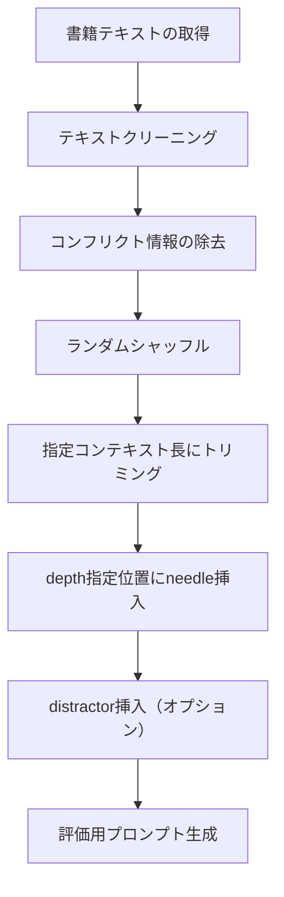
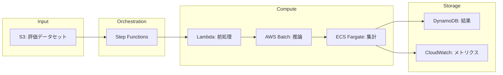

本記事は [https://proceedings.mlr.press/v267/modarressi25a.html](https://proceedings.mlr.press/v267/modarressi25a.html) の解説記事です。

## 論文概要

NoLiMa（No Literal Matching）は、LLMのロングコンテキスト処理能力をリテラルマッチングに頼らず評価するベンチマークである。著者らは、既存のNIAHテストが質問文とneedleの間に高い語彙的重複を持ち、モデルが表層的パターンマッチで問題を解ける点を問題視している。NoLiMaでは語彙的重複を意図的に最小化し、真の長文理解能力を測定する。128K+トークン対応を主張する13のLLMを評価した結果、32Kトークンで11モデルがショートコンテキストベースラインの50%以下に低下することが報告されている。

## 情報源

| 項目 | 内容 |
|------|------|
| 会議名 | ICML 2025 (42nd International Conference on Machine Learning) |
| 開催年 | 2025年（7月13-19日） |
| 掲載 | PMLR Volume 267, pp.44554-44570 |
| URL | [https://proceedings.mlr.press/v267/modarressi25a.html](https://proceedings.mlr.press/v267/modarressi25a.html) |
| 著者 | Ali Modarressi, Hanieh Deilamsalehy, Franck Dernoncourt, Trung Bui, Ryan A. Rossi, Seunghyun Yoon, Hinrich Schuetze |
| 所属 | Adobe Research, LMU Munich |
| コード | [https://github.com/adobe-research/NoLiMa](https://github.com/adobe-research/NoLiMa) |

## カンファレンス情報

ICMLは機械学習分野のトップカンファレンスの一つであり、2025年はバンクーバーで開催された。本論文はPMLR（Proceedings of Machine Learning Research）Volume 267に掲載されている。ICMLの採択率は例年25-30%程度であり、厳格な査読プロセスを経て採択された研究である。

## 技術的詳細

### 既存ベンチマークの限界

従来のNeedle-in-a-Haystack（NIAH）テストは以下の構造を持つ。

1. 長い無関係テキスト（haystack）の中にターゲット情報（needle）を挿入
2. needleに関する質問を提示し、モデルが正しく回答できるか評価

著者らは、このアプローチの根本的な問題点として**質問文とneedleの語彙的重複**を挙げている。例えば、質問が「The best thing to do in San Francisco is...」であり、needleが「The best thing to do in San Francisco is eat a sandwich...」のように、ほぼ同一のフレーズが含まれている場合、モデルは意味理解を行わずとも、Attention機構による表層的なトークンマッチングで正解に到達できる。

### NoLiMaの設計思想

NoLiMaの核心は、質問とneedleの間の**語彙的重複を意図的に最小化**する点にある。これにより、モデルは以下を行う必要がある。

- 質問の意味的内容を理解する
- haystack中から意味的に関連する箇所を特定する（リテラルマッチに頼れない）
- 推論によって正解を導出する

### 語彙的重複度の定義

著者らは質問 $q$ とneedle $n$ の間の語彙的重複度を以下のように定義している。

$$
\text{LexOverlap}(q, n) = \frac{|T(q) \cap T(n)|}{|T(q)|}
$$

ここで $T(\cdot)$ はストップワードを除去した後のトークン集合を表す。NoLiMaでは、この値が閾値以下となるように質問-needle対を設計している。従来のNIAHテストでは $\text{LexOverlap} \approx 0.8\text{--}1.0$ であるのに対し、NoLiMaでは $\text{LexOverlap} < 0.2$ を実現している。

### Needle挿入アルゴリズム

NoLiMaのhaystack構築は以下のプロセスで行われる。



needleの挿入位置は「depth」パラメータ（0.0-1.0）で制御される。depth=0.5はコンテキストの中央を意味する。挿入は文境界（改行位置）で行われ、テキストの自然さを維持する。

### 評価メトリクス

主要メトリクスはExact Match（EM）であり、モデルの出力がgold answerと完全一致するかを判定する。著者らは精度低下率を以下で定量化している。

$$
\text{Degradation}(L) = 1 - \frac{\text{Acc}(L)}{\text{Acc}(L_{\text{short}})}
$$

ここで $L$ は評価時のコンテキスト長、$L_{\text{short}}$ はショートコンテキスト（1K未満）でのベースライン精度である。

### Python実装例：NoLiMa風評価の構築

以下は、NoLiMaの評価パイプラインの概念的な実装例である（公式リポジトリのコード構造に基づく）。

```python
"""NoLiMa風ベンチマーク評価の実装例.

公式リポジトリ: https://github.com/adobe-research/NoLiMa
本コードはNoLiMaの設計思想に基づく簡易的な再実装であり、
研究利用時は公式実装を使用すること。
"""

from dataclasses import dataclass
from pathlib import Path
import hashlib
import json


@dataclass
class NeedleConfig:
    """Needle挿入の設定."""

    needle_text: str
    question: str
    gold_answer: str
    context_length: int  # トークン数
    depth: float  # 0.0-1.0の挿入位置


def compute_lexical_overlap(question: str, needle: str) -> float:
    """質問とneedleの語彙的重複度を計算する.

    Args:
        question: 質問テキスト
        needle: needle テキスト

    Returns:
        語彙的重複度（0.0-1.0）
    """
    stopwords = {"the", "a", "an", "is", "are", "was", "were", "in", "on",
                 "at", "to", "for", "of", "with", "by", "from", "and", "or"}

    q_tokens = set(question.lower().split()) - stopwords
    n_tokens = set(needle.lower().split()) - stopwords

    if not q_tokens:
        return 0.0
    return len(q_tokens & n_tokens) / len(q_tokens)


def validate_nolima_constraint(
    question: str,
    needle: str,
    max_overlap: float = 0.2
) -> bool:
    """NoLiMa制約（低語彙重複）を満たすか検証する.

    Args:
        question: 質問テキスト
        needle: needleテキスト
        max_overlap: 許容する最大重複度

    Returns:
        制約を満たす場合True
    """
    overlap = compute_lexical_overlap(question, needle)
    return overlap <= max_overlap


class BookHaystack:
    """書籍テキストを用いたhaystack生成クラス（公式実装の簡易版）."""

    def __init__(self, book_path: str) -> None:
        """Initialize with a book text file."""
        path = Path(book_path)
        if not path.exists():
            raise FileNotFoundError(f"Book not found: {book_path}")
        self.text = path.read_text(encoding="utf-8")

    def insert_needle(
        self, needle: str, context_length: int, depth: float = 0.5
    ) -> dict[str, str | int | float]:
        """指定depth位置にneedleを挿入する.

        Args:
            needle: 挿入するテキスト
            context_length: 目標コンテキスト長（トークン数）
            depth: 挿入位置（0.0=先頭, 1.0=末尾）

        Returns:
            挿入結果の辞書（text, actual_depth, token_count）
        """
        tokens = self.text.split()[:context_length]
        insert_pos = int(len(tokens) * depth)

        before = " ".join(tokens[:insert_pos])
        after = " ".join(tokens[insert_pos:])
        combined = f"{before}\n{needle}\n{after}"

        return {
            "text": combined,
            "actual_depth": insert_pos / len(tokens),
            "token_count": len(combined.split()),
        }


def run_nolima_evaluation(
    needle_configs: list[NeedleConfig],
    haystack: BookHaystack,
    model_fn=None,
) -> dict[int, float]:
    """NoLiMa評価を実行し、コンテキスト長ごとの平均精度を返す."""
    results: dict[int, list[float]] = {}

    for config in needle_configs:
        assert validate_nolima_constraint(config.question, config.needle_text)

        haystack_result = haystack.insert_needle(
            config.needle_text, config.context_length, config.depth
        )

        if model_fn is not None:
            prompt = (
                f"Answer based on the text below.\n\n"
                f"Text: {haystack_result['text']}\n\n"
                f"Question: {config.question}\nAnswer:"
            )
            response = model_fn(prompt)
            # Exact Match: gold_answerが応答に含まれるか判定
            score = 1.0 if config.gold_answer.lower() in response.lower() else 0.0
            results.setdefault(config.context_length, []).append(score)

    return {l: sum(s) / len(s) for l, s in results.items()}
```

## 実験結果

### 13モデルの比較

著者らは128K+トークンのコンテキスト長をサポートすると主張する13の主要LLMを評価している。以下は報告されている主要な結果である。

| モデル | Short (<1K) | 4K | 8K | 16K | 32K | 低下率(32K) |
|--------|-------------|-----|-----|------|------|------------|
| GPT-4o | 99.3% | ~95% | ~88% | ~78% | 69.7% | 29.8% |
| その他11モデル | - | - | - | - | <50%baseline | >50% |

（数値はFigure/Tableからの概算を含む。正確な値は論文Table 2を参照のこと。）

著者らの主要な発見は以下の通りである。

1. **32Kトークンで大幅な性能低下**: 13モデル中11モデルが、ショートコンテキストベースラインの50%以下に低下（論文より）
2. **GPT-4oの詳細分析**: 最も高性能なモデルでも99.3%から69.7%への低下が確認されている（約30ポイントの低下）
3. **推論強化モデルの限界**: Chain-of-Thought（CoT）プロンプティングなどの推論強化手法を適用しても、性能維持が困難であることが報告されている

### コンテキスト長と精度低下の関係

著者らの分析によれば、精度低下はコンテキスト長に対してほぼ単調に増加する。特に注目すべきは、多くのモデルが公称の最大コンテキスト長（128K）のわずか1/4（32K）の時点で実用的な精度を維持できていない点である。

この結果は、現在のLLMアーキテクチャにおけるAttention機構が、リテラルマッチの手がかりなしに長いコンテキストから関連情報を検索する能力に根本的な制約があることを示唆している。

## 実装のポイント：自社データでNoLiMa風評価を行う方法

自社のLLMアプリケーションでNoLiMa風の評価を実施する場合、以下のステップが推奨される。

### 1. 評価データセットの構築

```python
"""自社データでのNoLiMa風評価データセット構築例."""

from typing import Any


def create_nolima_style_qa(
    domain_knowledge: list[dict[str, str]],
    max_overlap: float = 0.2
) -> list[dict[str, Any]]:
    """ドメイン知識からNoLiMa風QAペアを生成する.

    Args:
        domain_knowledge: ドメイン知識のリスト
            各要素は {"fact": "...", "paraphrase_question": "..."} 形式
        max_overlap: 許容する最大語彙重複度

    Returns:
        制約を満たすQAペアのリスト
    """
    valid_pairs: list[dict[str, Any]] = []

    for item in domain_knowledge:
        fact = item["fact"]
        question = item["paraphrase_question"]

        overlap = compute_lexical_overlap(question, fact)
        if overlap <= max_overlap:
            valid_pairs.append({
                "needle": fact,
                "question": question,
                "overlap_score": overlap,
            })

    return valid_pairs
```

### 2. 公式ツールの活用

```bash
# 公式リポジトリのクローン
git clone https://github.com/adobe-research/NoLiMa.git
cd NoLiMa

# 依存関係のインストール
pip install -r requirements.txt

# データセットのダウンロード（HuggingFace Datasetsから取得）
bash data/download_NoLiMa_data.sh

# 評価の実行（vllmサーバーを起動した状態で）
cd evaluation/
./run_tests.sh
```

### 3. 評価結果の解釈

評価結果から実務上の意思決定を行う際は、以下の観点が重要である。

- **コンテキスト長の実効限界**: 公称128Kでも、NoLiMa評価で精度が50%を下回る地点を「実効限界」と見なす
- **タスク特性との照合**: 自社タスクがリテラルマッチで解決可能か、セマンティック推論を要するか判断する
- **チャンク戦略への示唆**: 実効限界を超えるドキュメントはRAGのチャンク分割が必須

## Production Deployment Guide

NoLiMa風のロングコンテキスト評価パイプラインをAWS上に構築するための実装パターンを示す。

### アーキテクチャ概要



### Small構成（月間評価100回以下）

- **推論**: Lambda + Bedrock API呼び出し
- **データ**: S3 + DynamoDB
- **オーケストレーション**: Step Functions
- **月額概算（2026年6月時点）**: $50-150/月

### Medium構成（月間評価1000回程度）

- **推論**: ECS Fargate + vLLMコンテナ（スポット利用）
- **データ**: S3 + Aurora Serverless v2
- **オーケストレーション**: Step Functions + EventBridge
- **月額概算（2026年6月時点）**: $500-1500/月

### Large構成（継続的評価・CI/CD統合）

- **推論**: EKS + GPU Node（g5.xlarge）+ Karpenter
- **データ**: S3 + Aurora + OpenSearch（結果検索用）
- **オーケストレーション**: Argo Workflows
- **月額概算（2026年6月時点）**: $3000-8000/月

### Terraformインフラコード（Small構成の主要リソース）

```hcl
# NoLiMa評価パイプライン - Small構成（抜粋）
# 2026年6月時点のAWSリソース定義

resource "aws_s3_bucket" "nolima_dataset" {
  bucket = "nolima-eval-dataset-${var.environment}"
  tags   = { Project = "nolima-evaluation" }
}

resource "aws_dynamodb_table" "eval_results" {
  name         = "nolima-eval-results-${var.environment}"
  billing_mode = "PAY_PER_REQUEST"
  hash_key     = "eval_id"
  range_key    = "model_context_length"

  attribute { name = "eval_id"               type = "S" }
  attribute { name = "model_context_length"  type = "S" }
}

resource "aws_lambda_function" "preprocess" {
  function_name = "nolima-preprocess-${var.environment}"
  runtime       = "python3.12"
  handler       = "handler.lambda_handler"
  timeout       = 300
  memory_size   = 1024
  role          = aws_iam_role.lambda_role.arn

  environment {
    variables = {
      DATASET_BUCKET = aws_s3_bucket.nolima_dataset.id
      RESULTS_TABLE  = aws_dynamodb_table.eval_results.name
    }
  }
}

resource "aws_sfn_state_machine" "eval_pipeline" {
  name     = "nolima-eval-pipeline-${var.environment}"
  role_arn = aws_iam_role.sfn_role.arn
  # PrepareDataset -> RunEvaluation (Bedrock) -> StoreResults (DynamoDB)
  definition = file("${path.module}/pipeline_definition.json")
}
```

### 運用・監視設定

```python
"""NoLiMa評価パイプラインの監視設定（主要部分）."""

from datetime import datetime, timezone

import boto3


def create_evaluation_alarm(
    model_name: str,
    context_length: int,
    threshold: float = 0.5,
    region: str = "ap-northeast-1",
) -> str:
    """精度低下アラームを作成する.

    Args:
        model_name: 評価対象モデル名
        context_length: コンテキスト長（トークン数）
        threshold: アラーム閾値（0.0-1.0）
        region: AWSリージョン

    Returns:
        作成されたアラーム名
    """
    cw = boto3.client("cloudwatch", region_name=region)
    alarm_name = f"nolima-accuracy-{model_name}-{context_length}"
    cw.put_metric_alarm(
        AlarmName=alarm_name,
        MetricName="Accuracy",
        Namespace="NoLiMa",
        Dimensions=[
            {"Name": "ModelName", "Value": model_name},
            {"Name": "ContextLength", "Value": str(context_length)},
        ],
        Statistic="Average",
        Period=86400,
        EvaluationPeriods=1,
        Threshold=threshold,
        ComparisonOperator="LessThanThreshold",
        AlarmActions=["arn:aws:sns:ap-northeast-1:ACCOUNT_ID:nolima-alerts"],
    )
    return alarm_name
```

推奨アラーム設定:
- 各モデル x コンテキスト長（4K, 8K, 16K, 32K）の組み合わせでアラームを作成
- 閾値はショートコンテキストベースラインの50%を基準とする
- CloudWatch Dashboardでコンテキスト長別の精度推移を可視化

### コスト最適化チェックリスト

以下は2026年6月時点の概算に基づくコスト最適化のガイドラインである。

| チェック項目 | Small | Medium | Large |
|------------|-------|--------|-------|
| Bedrock/APIコスト（入力トークン課金が支配的） | Savings Plans活用 | スポットインスタンス | Reserved + スポット混合 |
| S3ストレージ（haystack データ） | S3 Standard | S3 IA | Intelligent-Tiering |
| DynamoDB（結果格納） | On-demand | On-demand | Provisioned |
| コンピュート（前処理） | Lambda | Fargate Spot | EKS + Karpenter |
| ネットワーク転送 | VPC Endpoint | VPC Endpoint | PrivateLink |
| ログ保持 | 30日 | 90日 | 365日 |

**コスト削減のポイント**:
- 入力トークンの長さが支配的コスト要因（32Kトークン評価1回 ≈ 32K入力トークン + 数百出力トークン）
- バッチ評価をまとめて実行しAPI呼び出し回数を最適化
- 評価頻度の最適化（モデル更新時のみ全長評価、日次は代表的な長さのみ）
- haystackデータはキャッシュ可能（同一書籍の再利用）

## 実運用への応用

NoLiMaの知見は以下の実務シナリオに直接的な示唆を与える。

### RAGパイプラインへの影響

ロングコンテキストウィンドウを活用して「大量のドキュメントをそのままコンテキストに投入する」アプローチの限界が明確になった。著者らの結果は、セマンティック推論を要するクエリ（ユーザの質問と文書の表現が一致しないケース）では、32Kトークン程度でも信頼性が大幅に低下することを示している。

**実務上の推奨事項**:
- リテラルマッチが期待できないユースケースでは、チャンクサイズを8K-16K以下に制限する
- セマンティック検索（ベクトル検索）による事前絞り込みを維持する
- ロングコンテキストはリテラルマッチが有効なタスク（要約、翻訳等）で活用する

### モデル選定への影響

「128Kトークン対応」という仕様だけでモデルを選定するのではなく、自社タスクに即したNoLiMa風評価を実施し、実効的なコンテキスト長を把握することが推奨される。

## まとめ

NoLiMaは、LLMのロングコンテキスト能力に対する従来の楽観的な評価に根本的な疑問を投げかけるベンチマークである。語彙的重複を排除するというシンプルな設計変更により、現行モデルの実力が大幅に過大評価されていたことが明らかになった。著者らが示した「32Kトークンで11モデルが50%以下に低下」という結果は、ロングコンテキストを前提としたアプリケーション設計に再考を促すものである。実務においては、タスク特性（リテラルマッチの可否）に応じたコンテキスト長の選定とRAG戦略の組み合わせが重要となる。

## 参考文献

1. Modarressi, A., Deilamsalehy, H., Dernoncourt, F., Bui, T., Rossi, R. A., Yoon, S., & Schuetze, H. (2025). NoLiMa: Long-Context Evaluation Beyond Literal Matching. *Proceedings of the 42nd International Conference on Machine Learning (ICML)*, PMLR 267:44554-44570. [https://proceedings.mlr.press/v267/modarressi25a.html](https://proceedings.mlr.press/v267/modarressi25a.html)
2. Adobe Research. NoLiMa GitHub Repository. [https://github.com/adobe-research/NoLiMa](https://github.com/adobe-research/NoLiMa)
3. Kamradt, G. (2023). Needle in a Haystack - Pressure Testing LLMs. [https://github.com/gkamradt/LLMTest_NeedleInAHaystack](https://github.com/gkamradt/LLMTest_NeedleInAHaystack)
4. 関連Zenn記事: ロングコンテキストLLMの情報損失を制御する：精度・コスト・レイテンシ3軸設計. [https://zenn.dev/0h_n0/articles/8a16d9e097d803](https://zenn.dev/0h_n0/articles/8a16d9e097d803)

---

*本記事はAIによって生成された論文解説記事です。内容の正確性については原論文を参照してください。*
*AWSコスト試算は2026年6月時点の概算であり、最新の料金体系を確認してください。*
