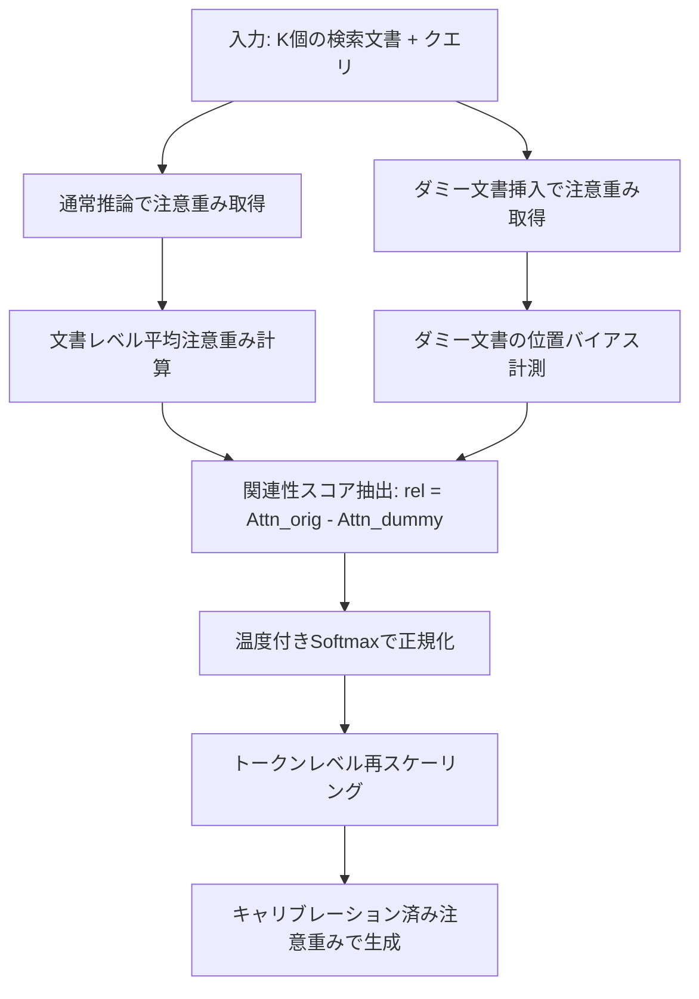
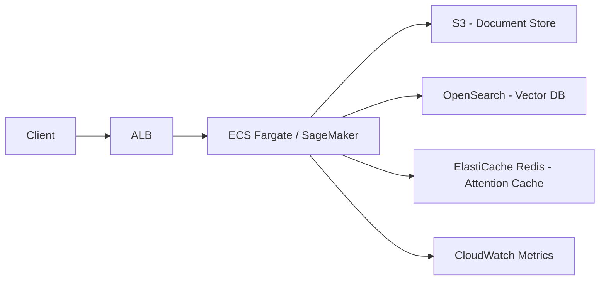

本記事は [https://arxiv.org/abs/2406.16008](https://arxiv.org/abs/2406.16008) の解説記事です。

## 論文概要（Abstract）

大規模言語モデル（LLM）は、長い入力コンテキストを処理するよう訓練されていても、入力の中間に位置する関連情報を適切に捉えることが困難である。本論文では、この「Lost in the Middle」問題がLLMの固有のU字型位置注意バイアスに起因することを明らかにし、推論時のキャリブレーション機構「Found-in-the-Middle」を提案している。この手法は追加学習を必要とせず、RAGタスクにおいて既存手法を最大15パーセンテージポイント上回る精度改善を達成したと報告されている。

## 情報源

| 項目 | 内容 |
|------|------|
| arXiv ID | [2406.16008](https://arxiv.org/abs/2406.16008) |
| タイトル | Found in the Middle: Calibrating Positional Attention Bias Improves Long Context Utilization |
| 著者 | Cheng-Yu Hsieh, Yung-Sung Chuang, Chun-Liang Li, Zifeng Wang, Long T. Le, Abhishek Kumar, James Glass, Alexander Ratner, Chen-Yu Lee, Ranjay Krishna, Tomas Pfister |
| 発表 | ACL Findings 2024 (June 2024) |
| 分野 | 自然言語処理、Long-Context LLM、Attention Mechanism |

## 背景と動機

LLMの長文処理能力はコンテキストウィンドウの拡張により向上してきたが、実務では「Lost in the Middle」と呼ばれる深刻な問題が存在する。これは、入力シーケンスの先頭と末尾に近い情報には高い注意が向けられる一方、中間部分の情報が事実上無視される現象である。

この問題はRAG（Retrieval-Augmented Generation）システムにおいて特に顕著であり、検索された文書の順序がモデルの回答品質を大きく左右してしまう。例えば、20件の検索文書を入力する場合、正解を含む文書が中間位置（10番目付近）に配置されると、先頭や末尾に配置した場合に比べて精度が著しく低下する。

著者らは、この問題の根本原因がアーキテクチャレベルの位置注意バイアスであることを実験的に示し、学習不要の推論時キャリブレーションによる解決を提案している。

## 主要な貢献

著者らの主要な貢献は以下の3点である。

- **U字型注意バイアスの定量的分析**: LLMの注意重みが入力位置に対してU字型のパターンを示すことを定量的に実証し、これが文書の内容的関連性とは無関係であることを証明した
- **線形分解モデルの提案**: 注意重みを「関連性成分」と「位置バイアス成分」に分解する線形モデルを提案し、ランク相関0.76でこの分解が妥当であることを検証した
- **Found-in-the-Middleキャリブレーション**: ダミー文書を用いた推論時キャリブレーション機構を提案し、追加学習なしでRAG精度を最大15ポイント改善した

## 技術的詳細

### U字型バイアスのメカニズム

著者らは、K個の文書を含むプロンプトに対する各文書の平均注意重みを以下のように定義している。

$$
\text{Attn}(x^{\text{doc}}, k) = \frac{1}{N_k} \sum_{i=1}^{N_k} \text{attn}(x_{k,i}^{\text{doc}})
$$

ここで、$x^{\text{doc}}$ は文書の内容、$k$ は文書の位置（1からKまで）、$N_k$ は文書$k$のトークン数、$\text{attn}(x_{k,i}^{\text{doc}})$ はデコーダ全層・全ヘッドにわたる平均注意重みである。

実験の結果、文書の内容をランダムにシャッフルしても位置に対するU字型パターンが維持されることが確認されており、このバイアスが内容非依存の構造的特性であることが示されている。

### キャリブレーション手法の数学的定式化

注意重みを関連性成分と位置バイアス成分に線形分解する。

$$
\text{Attn}(x^{\text{doc}}, k) = \text{rel}(x^{\text{doc}}) + \text{bias}(k) + \varepsilon
$$

ここで、$\text{rel}(x^{\text{doc}})$ は文書内容に基づく関連性スコア、$\text{bias}(k)$ は位置$k$に依存するバイアス項、$\varepsilon$ はノイズ項である。

位置バイアスを除去するため、内容的に無関連なダミー文書 $x^{\text{dum}}$ を同じ位置に挿入し、差分を取ることで関連性を抽出する。

$$
\text{rel}(x^{\text{doc}}) = \text{Attn}(x^{\text{doc}}, k) - \text{Attn}(x^{\text{dum}}, k) + \text{rel}(x^{\text{dum}})
$$

$\text{rel}(x^{\text{dum}})$ はダミー文書の関連性であり、全文書共通の定数として扱う。キャリブレーション後の注意重みは以下の再スケーリングにより計算される。

$$
\text{attn}_{\text{calibrated}}(x_{k,i}) = \frac{\alpha_k}{\text{Attn}_{\text{original}}(x^{\text{doc}}_k)} \cdot \text{attn}_{\text{original}}(x_{k,i}) \cdot C
$$

ここで、$\alpha_k = \text{Softmax}(\text{rel}(x^{\text{doc}}_k), t)$ は温度パラメータ$t = 5 \times 10^{-5}$によるソフトマックス正規化スコア、$C$ は正規化定数である。

### アルゴリズム

```python
import torch
import torch.nn.functional as F
from dataclasses import dataclass


@dataclass
class CalibrationConfig:
    """Found-in-the-Middle キャリブレーション設定."""

    temperature: float = 5e-5
    dummy_text: str = "N/A"
    num_documents: int = 20


def compute_document_attention(
    attention_weights: torch.Tensor,
    document_boundaries: list[tuple[int, int]],
) -> torch.Tensor:
    """各文書の平均注意重みを計算する.

    Args:
        attention_weights: デコーダ出力の注意重み [layers, heads, seq_len]
        document_boundaries: 各文書の(start, end)トークン位置リスト

    Returns:
        各文書の平均注意スコア [num_documents]
    """
    avg_attention = attention_weights.mean(dim=(0, 1))  # [seq_len]
    doc_attention = torch.zeros(len(document_boundaries))

    for k, (start, end) in enumerate(document_boundaries):
        doc_attention[k] = avg_attention[start:end].mean()

    return doc_attention


def calibrate_attention(
    original_attention: torch.Tensor,
    dummy_attention: torch.Tensor,
    config: CalibrationConfig,
) -> torch.Tensor:
    """位置バイアスを除去し、関連性ベースの注意重みを計算する.

    Args:
        original_attention: 元の文書レベル注意重み [num_documents]
        dummy_attention: ダミー文書挿入時の注意重み [num_documents]
        config: キャリブレーション設定

    Returns:
        キャリブレーション済み注意重み [num_documents]
    """
    # 関連性スコア = 元の注意 - 位置バイアス（ダミー注意）
    relevance = original_attention - dummy_attention

    # 温度付きソフトマックスで正規化 → トークンレベル再スケーリングに使用
    alpha = F.softmax(relevance / config.temperature, dim=0)
    calibrated = alpha / original_attention * original_attention.sum()

    return calibrated
```

### 処理フロー



## 実装のポイント

著者らの実装に関する重要な知見を以下にまとめる。

**推論時のみの手法**: Found-in-the-Middleは純粋な推論時キャリブレーションであり、モデルの再学習やファインチューニングは不要である。既存のLLMに対してそのまま適用可能な点が実用上の大きな利点である。

**ダミー文書の設計**: ダミー文書には「N/A」のような無関連テキストを使用する。ダミー文書を各位置に配置して注意重みを計測することで、位置のみに起因するバイアスパターンを分離する。

**温度パラメータ**: $t = 5 \times 10^{-5}$ という極めて小さい温度パラメータが使用されている。これにより関連性スコアの差が増幅され、最も関連性の高い文書に注意が集中する。

**計算コスト**: ダミー文書を用いた追加のフォワードパスが1回必要となる。K個の文書に対して2回のフォワードパス（通常 + ダミー）で済むため、計算オーバーヘッドは約2倍に留まる。

**モデル非依存**: Hugging Face Transformersパッケージ上で実装されており、Vicuna-7B-v1.5-16k（16kコンテキスト）およびTulu-2-7B（8kコンテキスト）の双方で有効性が確認されている。

## Production Deployment Guide

本セクションでは、Found-in-the-Middleキャリブレーションを本番RAGシステムに組み込む際のAWSインフラ構成を示す。コスト試算は2026年6月時点のap-northeast-1（東京リージョン）料金に基づく概算である。

### アーキテクチャ概要



### 構成パターン

| 構成 | ユースケース | 月額概算 | スループット |
|------|-------------|---------|-------------|
| Small | PoC・社内ツール（<100 req/day） | $800-1,200 | ~5 req/min |
| Medium | プロダクション（<10,000 req/day） | $3,500-5,000 | ~50 req/min |
| Large | 高トラフィック（>10,000 req/day） | $12,000-18,000 | ~200 req/min |

### Small構成（PoC向け）

- **推論**: SageMaker real-time endpoint (ml.g5.2xlarge x 1)
- **キャッシュ**: ElastiCache Redis (cache.t4g.micro)
- **検索**: OpenSearch Serverless (2 OCU)
- **ストレージ**: S3 Standard

**コスト内訳（月額概算）**:
- SageMaker ml.g5.2xlarge: ~$580（$0.802/h x 24h x 30日）
- ElastiCache cache.t4g.micro: ~$12
- OpenSearch Serverless 2 OCU: ~$175
- S3 + データ転送: ~$10
- **合計: 約$777/月**

### Large構成（高トラフィック向け）

- **推論**: SageMaker multi-model endpoint (ml.g5.12xlarge x 3, Auto Scaling)
- **キャッシュ**: ElastiCache Redis cluster (cache.r7g.large x 3ノード)
- **検索**: OpenSearch Managed (r6g.large.search x 3ノード)
- **ロードバランサ**: ALB + WAF
- **監視**: CloudWatch + X-Ray

### Terraform: Small構成（主要リソース）

```hcl
# small構成 - SageMaker + ElastiCache + OpenSearch Serverless
provider "aws" { region = "ap-northeast-1" }

resource "aws_sagemaker_model" "calibration_model" {
  name               = "found-in-middle-calibrator"
  execution_role_arn = aws_iam_role.sagemaker_role.arn

  primary_container {
    image          = "763104351884.dkr.ecr.ap-northeast-1.amazonaws.com/huggingface-pytorch-inference:2.1-transformers4.37-gpu-py310-cu121-ubuntu22.04"
    model_data_url = "s3://${aws_s3_bucket.model_artifacts.id}/model/model.tar.gz"
    environment = {
      HF_MODEL_ID         = "lmsys/vicuna-7b-v1.5-16k"
      CALIBRATION_ENABLED = "true"
      CALIBRATION_TEMP    = "5e-5"
    }
  }
}

resource "aws_sagemaker_endpoint_configuration" "small" {
  name = "fitm-endpoint-config-small"
  production_variants {
    variant_name           = "primary"
    model_name             = aws_sagemaker_model.calibration_model.name
    instance_type          = "ml.g5.2xlarge"
    initial_instance_count = 1
  }
}

resource "aws_elasticache_cluster" "bias_cache" {
  cluster_id      = "fitm-bias-cache"
  engine          = "redis"
  node_type       = "cache.t4g.micro"
  num_cache_nodes = 1
}

resource "aws_opensearchserverless_collection" "documents" {
  name = "fitm-documents"
  type = "VECTORSEARCH"
}
```

### Terraform: Large構成（主要リソースのみ抜粋）

```hcl
# large構成 - Auto Scaling + Redis Cluster + Managed OpenSearch
resource "aws_sagemaker_endpoint_configuration" "large" {
  name = "fitm-endpoint-config-large"

  production_variants {
    variant_name           = "primary"
    model_name             = aws_sagemaker_model.calibration_model.name
    instance_type          = "ml.g5.12xlarge"
    initial_instance_count = 3
  }
}

# Auto Scaling: 50 invocations/instance をターゲットに 3-10台でスケール
resource "aws_appautoscaling_target" "sagemaker" {
  max_capacity       = 10
  min_capacity       = 3
  resource_id        = "endpoint/${aws_sagemaker_endpoint.calibration_large.name}/variant/primary"
  scalable_dimension = "sagemaker:variant:DesiredInstanceCount"
  service_namespace  = "sagemaker"
}

# Redis Cluster (Multi-AZ, 自動フェイルオーバー)
resource "aws_elasticache_replication_group" "bias_cache_cluster" {
  replication_group_id       = "fitm-bias-cache-cluster"
  description                = "Found-in-the-Middle attention bias cache"
  node_type                  = "cache.r7g.large"
  num_cache_clusters         = 3
  automatic_failover_enabled = true
  multi_az_enabled           = true
}

# OpenSearch Managed (3 AZ, r6g.large x 3)
resource "aws_opensearch_domain" "documents" {
  domain_name    = "fitm-documents"
  engine_version = "OpenSearch_2.11"

  cluster_config {
    instance_type          = "r6g.large.search"
    instance_count         = 3
    zone_awareness_enabled = true
  }
}
```

### 運用・監視設定

#### CloudWatch アラーム & ダッシュボード

```hcl
resource "aws_cloudwatch_metric_alarm" "latency_p99" {
  alarm_name          = "fitm-latency-p99-high"
  comparison_operator = "GreaterThanThreshold"
  evaluation_periods  = 3
  metric_name         = "ModelLatency"
  namespace           = "AWS/SageMaker"
  period              = 60
  statistic           = "p99"
  threshold           = 30000  # 30秒超過で発報
  alarm_actions       = [aws_sns_topic.alerts.arn]
  dimensions          = { EndpointName = aws_sagemaker_endpoint.calibration.name }
}

resource "aws_cloudwatch_metric_alarm" "error_rate" {
  alarm_name          = "fitm-error-rate-high"
  comparison_operator = "GreaterThanThreshold"
  evaluation_periods  = 2
  metric_name         = "Invocation5XXErrors"
  namespace           = "AWS/SageMaker"
  period              = 300
  statistic           = "Sum"
  threshold           = 10
  alarm_actions       = [aws_sns_topic.alerts.arn]
  dimensions          = { EndpointName = aws_sagemaker_endpoint.calibration.name }
}
```

ダッシュボードには ModelLatency、Invocations、CalibrationGain、BiasRemovalRatio の4メトリクスをウィジェットとして配置する。

#### X-Ray トレーシング

X-Ray サンプリングルールで `/invocations` パスを5%サンプリングし、キャリブレーション推論のレイテンシ分布を可視化する。

#### カスタムメトリクス（アプリケーション側）

```python
import boto3
from datetime import datetime


def publish_calibration_metrics(
    calibration_gain: float,
    bias_removal_ratio: float,
    inference_latency_ms: float,
) -> None:
    """キャリブレーション品質メトリクスをCloudWatchに送信する.

    Args:
        calibration_gain: キャリブレーション前後の精度差
        bias_removal_ratio: 位置バイアス除去率（0-1）
        inference_latency_ms: 推論レイテンシ（ミリ秒）
    """
    cloudwatch = boto3.client("cloudwatch", region_name="ap-northeast-1")
    ts = datetime.utcnow()
    dims = [{"Name": "Environment", "Value": "production"}]

    cloudwatch.put_metric_data(
        Namespace="Custom/FITM",
        MetricData=[
            {"MetricName": "CalibrationGain", "Value": calibration_gain,
             "Unit": "Percent", "Timestamp": ts, "Dimensions": dims},
            {"MetricName": "BiasRemovalRatio", "Value": bias_removal_ratio,
             "Unit": "None", "Timestamp": ts, "Dimensions": dims},
            {"MetricName": "InferenceLatency", "Value": inference_latency_ms,
             "Unit": "Milliseconds", "Timestamp": ts, "Dimensions": dims},
        ],
    )
```

### コスト最適化チェックリスト

| 項目 | 対策 | 削減効果 |
|------|------|---------|
| バイアスキャッシュ | バイアスパターンをRedisにキャッシュしダミー推論省略 | 推論50% |
| Savings Plans | SageMaker 1年/3年コミット | 20-40% |
| 推論バッチ化 | 同時リクエストをバッチ処理（最大8/batch） | 4倍スループット |
| モデル量子化 | GPTQ/AWQ 4bit → 小型GPU利用可 | インスタンス50% |
| OpenSearch Serverless | 低トラフィック時に従量課金 | 固定費削減 |

**重要**: バイアスキャッシュは最も効果的な最適化である。$\text{bias}(k)$ はモデルとK（文書数）に対して固定のため、一度計測すれば全リクエストで再利用可能である。

## 実験結果

著者らは以下のベンチマークで評価を実施している。

**NaturalQuestions（K=20文書、Vicuna-7B）**:
- Vanilla attention（中間位置）: Recall@3 = 20.52
- Found-in-the-Middle: Recall@3 = 68.32（論文Table 1より）
- 既存手法（LongLLMLingua-rk）に対して最大15ポイントの改善

**SynthWikiベンチマーク**:
- Vanilla: 52.52
- Found-in-the-Middle: 59.25

**比較ベースライン**: Query generation ranking、LongLLMLingua-rk、Prompt reordering、Attention sorting等

**モデル横断評価**: Vicuna-7B-v1.5-16k（16kコンテキスト、32層、32ヘッド）とTulu-2-7B（8kコンテキスト、32層、32ヘッド）の双方で一貫した改善を確認している。

**線形分解の妥当性**: 注意重みの線形分解モデルはランク相関0.76を達成し、位置バイアスと関連性の分離が統計的に有意であることが検証されている。

## 実運用への応用

Found-in-the-Middleは以下のRAGシステムに直接適用可能である。

**検索文書の順序非依存化**: 従来のRAGでは検索スコアの高い文書を先頭に配置する工夫が必要だったが、本手法の適用により文書順序への依存度が大幅に低減される。

**コンテキストウィンドウの有効活用**: 中間部分の情報も適切に活用されるため、より多くの文書をコンテキストに含めることが実質的に可能となる。

**既存パイプラインへの統合**: 推論時のみの手法であるため、既存のLLMサービングインフラに後付けで組み込める。モデルの再学習や追加データは不要である。

**制約事項**: 追加のフォワードパスが必要なため、レイテンシが約2倍となる点には注意が必要である。ただし、バイアスパターンのキャッシュにより実質的なオーバーヘッドは軽減可能である。

## 関連研究

- **Lost in the Middle** (Liu et al., 2023): 中間位置の情報無視を最初に報告
- **LongLLMLingua** (Jiang et al., 2023): プロンプト圧縮による長文処理効率化
- **Attention Sink** (Xiao et al., 2024): 先頭トークンへの注意集中現象の分析
- **Position Interpolation** (Chen et al., 2023): コンテキスト長の外挿手法

Found-in-the-Middleは位置バイアスに直接介入する点で、並び替えや圧縮といった間接的アプローチとは異なる。

## まとめと今後の展望

本論文は「Lost in the Middle」問題の根本原因をU字型位置注意バイアスとして特定し、推論時キャリブレーションで解決する手法を提示した。追加学習不要・最大15ポイントの精度改善は実務上の価値が高い。

今後の展望として、大規模モデル（70B以上）への適用検証、マルチターン対話への拡張、Attention SinkやRoPEスケーリングとの組み合わせが考えられる。

## 参考文献

1. Hsieh, C.-Y., Chuang, Y.-S., Li, C.-L., Wang, Z., Le, L. T., Kumar, A., Glass, J., Ratner, A., Lee, C.-Y., Krishna, R., & Pfister, T. (2024). Found in the Middle: Calibrating Positional Attention Bias Improves Long Context Utilization. *ACL Findings 2024*. arXiv:2406.16008
2. Liu, N. F., Lin, K., Hewitt, J., Paranjape, A., Bevilacqua, M., Petroni, F., & Liang, P. (2023). Lost in the Middle: How Language Models Use Long Contexts. *TACL*.
3. Jiang, Z., Wu, Y., Luo, S., et al. (2023). LongLLMLingua: Accelerating and Enhancing LLMs in Long Context Scenarios via Prompt Compression.
4. Xiao, G., Tian, Y., Chen, B., Han, S., & Lewis, M. (2024). Efficient Streaming Language Models with Attention Sinks. *ICLR 2024*.
5. Chen, S., Wong, S., Chen, L., & Tian, Y. (2023). Extending Context Window of Large Language Models via Positional Interpolation.
