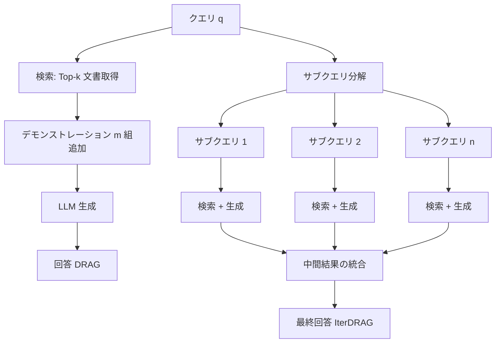
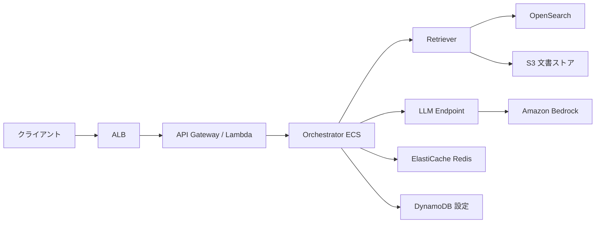

本記事は [https://arxiv.org/abs/2410.04343](https://arxiv.org/abs/2410.04343) の解説記事です。

## 論文概要

Zhenrui Yue, Honglei Zhuang, Aijun Bai らによる本論文は、知識集約型タスクにおいてテスト時計算量（inference compute）を拡大する際、単にコンテキストに投入する外部知識量を増やすだけでは性能が頭打ちになるという問題に取り組んでいる。著者らは、In-Context Learning（ICL）と反復的プロンプティング（iterative prompting）を組み合わせた推論スケーリング戦略として DRAG および IterDRAG を提案し、推論計算量を最適に配分した場合に RAG 性能がほぼ線形に改善されるスケーリング則を実証した。ベンチマークデータセットにおいて標準 RAG と比較して最大 58.9% の性能向上を達成したと報告されている（Table 1, Section 5）。本論文は ICLR 2025 に Oral として採択されている。

## 情報源

| 項目 | 内容 |
|------|------|
| タイトル | Inference Scaling for Long-Context Retrieval Augmented Generation |
| 著者 | Zhenrui Yue, Honglei Zhuang, Aijun Bai, Kai Hui, Rolf Jagerman, Hansi Zeng, Zhen Qin, Dong Wang, Xuanhui Wang, Michael Bendersky |
| 所属 | Google DeepMind |
| 発表 | ICLR 2025 (Oral) |
| arXiv | [2410.04343](https://arxiv.org/abs/2410.04343) |
| 最終改訂 | 2025年3月2日 (v2) |

## 背景と動機

大規模言語モデル（LLM）のコンテキストウィンドウが拡大し、Gemini 1.5 Flash のように 1M トークンを処理可能なモデルが登場したことで、RAG（Retrieval Augmented Generation）においてはより多くの文書を入力に含められるようになった。しかし著者らは、外部知識量の単純な増加がそのまま性能改善に結びつかない「コンテキスト拡張の収穫逓減」問題を指摘している。

従来の RAG パイプラインでは、検索文書数 $k$ を増やすことが唯一のスケーリング軸であったが、文書数が一定以上になると注意機構の分散やノイズの増加により精度が飽和する。一方、テスト時計算量のスケーリングは学習時スケーリング則（Chinchilla scaling laws 等）とは異なる研究領域であり、推論段階でどのように計算資源を配分すべきかについての体系的な知見は不足していた。

本研究の中心的な問いは以下の2点である:

1. RAG 性能は推論計算量の増大からどの程度恩恵を受けるか（最適配分時）
2. 与えられた計算予算に対して最適なテスト時計算配分を予測できるか

## 主要な貢献

著者らの貢献は以下の通りである:

- **DRAG（Demonstration-based RAG）の提案**: 検索文書に加え、ICL のデモンストレーション（質問-回答ペア）をコンテキストに含めることで、LLM が文脈情報の抽出方法を学習する戦略
- **IterDRAG（Iterative DRAG）の提案**: 複雑なクエリをサブクエリに分解し、反復的に検索・生成を行うことで推論ステップ数 $n$ を新たなスケーリング軸として追加する戦略
- **推論スケーリング則の実証**: 推論計算量の増加が（最適配分下で）RAG 性能にほぼ線形のゲインをもたらすことを実験的に示した
- **計算配分モデルの開発**: 推論パラメータ $(k, m, n)$ から RAG 性能を予測し、計算予算制約下での最適パラメータを同定する手法を構築。oracle 性能の 96.6% を達成（Table 2）
- **大規模実験による検証**: 複数のマルチホップ QA データセットで標準 RAG に対し最大 58.9% の改善を達成

## 技術的詳細

### 推論スケーリング則の数学的定式化

著者らはまず、計算予算 $L_{\max}$（最大有効コンテキスト長: 全イテレーションにわたる総入力トークン数）の下での最適性能を以下のように定義している:

$$
P^*(L_{\max}) := \max_{\theta \in \Theta} \left\{ \frac{1}{|\mathcal{X}|} \sum_i P(y_i, f(x_i; \theta)) \;\middle|\; \forall i,\; l(x_i; \theta) \leq L_{\max} \right\}
$$

ここで:
- $\mathcal{X}$: 評価データセット
- $y_i$: クエリ $x_i$ に対する正解
- $f(x_i; \theta)$: 推論パラメータ $\theta$ での生成結果
- $l(x_i; \theta)$: 有効コンテキスト長（全イテレーション合計の入力トークン数）
- $\theta = (k, m, n)^T$: 推論パラメータベクトル（検索文書数、デモンストレーション数、イテレーション数）

### 計算配分モデル（シグモイドスケーリング則）

性能予測には、以下のシグモイド逆変換に基づくモデルが用いられる:

$$
\sigma^{-1}(P(\theta)) \approx (a + b \odot i)^T \log(\theta) + c
$$

各変数の定義:
- $\sigma^{-1}$: ロジット変換（シグモイド逆関数）。性能が 1M トークン超で亜線形になる挙動を捉える
- $a, b, c$: 学習可能パラメータ（モデル・データセット依存）
- $i = (i_{\text{doc}}, i_{\text{shot}}, 0)^T$: 文書およびデモンストレーションの情報量指標
- $\theta = (k, m, n)^T$: 推論パラメータ
- $\odot$: アダマール積（要素積）

このモデルは、パラメータの対数スケールでの線形性を仮定しつつ、出力にシグモイド変換を適用することで [0, 1] 区間に制約された精度を自然にモデル化している。

**モデルの適合精度（Table 2 より）**:
- 決定係数: $R^2 = 0.903$
- 平均二乗誤差: $\text{MSE} = 0.085$
- ドメイン汎化時の oracle 比: 96.6%

### DRAG と IterDRAG の動作原理



**DRAG**: 検索文書 $k$ 件とデモンストレーション（質問-回答ペア）$m$ 組を単一の推論呼び出しで処理する。LLM は提示されたデモンストレーションから情報抽出パターンを学習し、大量の文書から関連情報を効率的に引き出す。

**IterDRAG**: 複雑なマルチホップクエリを $n$ 個のサブクエリに分解し、各サブクエリに対して独立に検索・生成を行う。各イテレーションで得られた中間結果を次のイテレーションの入力に組み込むことで、推論チェーンを構築する。これにより、合成性ギャップ（compositionality gap）を橋渡しする。

### スケーリング特性の比較

著者らの実験（Section 5）によると:
- **標準 RAG**: 約 $10^4$ トークンで性能が飽和（plateau）
- **DRAG**: 約 $10^5$ トークンまで効果的にスケール
- **IterDRAG**: 約 $10^6$ トークンまで継続的にスケール

### 実装例: 推論スケーリング戦略

以下は、本論文の DRAG および IterDRAG の推論スケーリング戦略を概念的に実装した Python コードである:

```python
"""推論スケーリング戦略の概念的実装.

本論文 (arXiv:2410.04343) の DRAG / IterDRAG を
再現するための参考コード。実際の論文実験は Gemini 1.5 Flash で実施。
"""

from dataclasses import dataclass
from typing import TypeAlias

import numpy as np

Document: TypeAlias = dict[str, str]
Demonstration: TypeAlias = dict[str, str]


@dataclass(frozen=True)
class InferenceConfig:
    """推論スケーリングパラメータ theta = (k, m, n).

    Attributes:
        k: 検索文書数
        m: デモンストレーション数 (ICL examples)
        n: イテレーション数 (IterDRAG 用)
    """

    k: int  # 検索文書数
    m: int  # デモンストレーション数
    n: int  # イテレーション数


def estimate_effective_context_length(
    config: InferenceConfig,
    avg_doc_tokens: int = 512,
    avg_demo_tokens: int = 256,
    query_tokens: int = 64,
) -> int:
    """有効コンテキスト長 l(x; theta) を推定する.

    Args:
        config: 推論パラメータ
        avg_doc_tokens: 文書あたりの平均トークン数
        avg_demo_tokens: デモンストレーションあたりの平均トークン数
        query_tokens: クエリのトークン数

    Returns:
        全イテレーションにわたる合計入力トークン数
    """
    per_iteration = (
        config.k * avg_doc_tokens
        + config.m * avg_demo_tokens
        + query_tokens
    )
    return per_iteration * config.n


def predict_performance(
    config: InferenceConfig,
    a: np.ndarray,
    b: np.ndarray,
    i_vec: np.ndarray,
    c: float,
) -> float:
    """計算配分モデルによる性能予測.

    sigma^{-1}(P(theta)) ≈ (a + b * i)^T log(theta) + c

    Args:
        config: 推論パラメータ theta = (k, m, n)
        a: 学習済み係数ベクトル (3,)
        b: 情報量係数ベクトル (3,)
        i_vec: 情報量指標 (i_doc, i_shot, 0)
        c: バイアス項

    Returns:
        予測精度 P(theta) in [0, 1]
    """
    theta = np.array([config.k, config.m, config.n], dtype=np.float64)
    # ゼロ除算回避: 最小値を 1 に
    theta = np.maximum(theta, 1.0)

    log_theta = np.log(theta)
    coeff = a + b * i_vec
    logit = coeff @ log_theta + c

    # シグモイド変換で [0, 1] に制約
    return float(1.0 / (1.0 + np.exp(-logit)))


def find_optimal_config(
    budget_tokens: int,
    a: np.ndarray,
    b: np.ndarray,
    i_vec: np.ndarray,
    c: float,
    k_candidates: list[int] | None = None,
    m_candidates: list[int] | None = None,
    n_candidates: list[int] | None = None,
) -> tuple[InferenceConfig, float]:
    """計算予算制約下での最適推論パラメータを探索する.

    P*(L_max) = max_{theta} P(theta) s.t. l(x; theta) <= L_max

    Args:
        budget_tokens: 最大有効コンテキスト長 L_max
        a, b, i_vec, c: 計算配分モデルのパラメータ
        k_candidates: 検索文書数の候補
        m_candidates: デモンストレーション数の候補
        n_candidates: イテレーション数の候補

    Returns:
        (最適推論パラメータ, 予測性能) のタプル
    """
    if k_candidates is None:
        k_candidates = [1, 2, 5, 10, 20, 50, 100, 200, 500, 1000]
    if m_candidates is None:
        m_candidates = [1, 2, 4, 8, 16, 32, 64, 128, 256]
    if n_candidates is None:
        n_candidates = [1, 2, 3, 4, 5]

    best_config = InferenceConfig(k=1, m=1, n=1)
    best_perf = 0.0

    for k in k_candidates:
        for m in m_candidates:
            for n in n_candidates:
                cfg = InferenceConfig(k=k, m=m, n=n)
                eff_len = estimate_effective_context_length(cfg)
                if eff_len > budget_tokens:
                    continue
                perf = predict_performance(cfg, a, b, i_vec, c)
                if perf > best_perf:
                    best_perf = perf
                    best_config = cfg

    return best_config, best_perf


# 使用例
if __name__ == "__main__":
    # 注: 以下の係数は論文の傾向を模した例示値であり、
    # 実際の論文で報告されたフィッティング値とは異なる
    a_example = np.array([0.3, 0.15, 0.1])
    b_example = np.array([0.05, 0.03, 0.0])
    i_example = np.array([0.8, 0.6, 0.0])  # (i_doc, i_shot, 0)
    c_example = -1.5

    # 128k トークン予算での最適配分探索
    opt_cfg, opt_perf = find_optimal_config(
        budget_tokens=128_000,
        a=a_example,
        b=b_example,
        i_vec=i_example,
        c=c_example,
    )
    print(f"最適構成: k={opt_cfg.k}, m={opt_cfg.m}, n={opt_cfg.n}")
    print(f"予測性能: {opt_perf:.3f}")
    print(
        f"有効コンテキスト長: "
        f"{estimate_effective_context_length(opt_cfg):,} tokens"
    )
```

## 実装のポイント

本論文の手法を実運用に適用する際の重要な考慮事項:

1. **有効コンテキスト長の制御**: 単純にトークン数を増やすのではなく、$(k, m, n)$ の組み合わせを予算内で最適化することが本質である。著者らの実験では $k \in [1, 1000]$, $m \in [1, 256]$, $n \leq 5$ の範囲が探索されている

2. **デモンストレーションの品質**: DRAG の有効性は、ICL で提供するデモンストレーションの品質に強く依存する。著者らは検索された文書を含むデモンストレーションを使用しており、単純な質問-回答ペアよりも文脈付きの例が効果的であると報告している

3. **IterDRAG のサブクエリ分解**: 複雑なマルチホップクエリに対しては、適切なサブクエリ分解が性能を左右する。LLM 自身にサブクエリ生成を委ねる self-decomposition が採用されている

4. **モデル依存性**: 実験は Gemini 1.5 Flash（1M コンテキストウィンドウ）で実施されており、計算配分モデルの係数 $(a, b, c)$ はモデル・データセット毎にフィッティングが必要である

5. **スケーリングの限界**: 1M トークンを超えると収穫逓減が顕著になる。実運用では 128k-1M トークンの範囲が費用対効果の高いスイートスポットと考えられる

## Production Deployment Guide

本節では、推論スケーリング RAG を AWS 上で本番展開するための構成パターンを示す。論文で報告された知見（最適計算配分、スケーリング特性）を踏まえた設計である。

### アーキテクチャ概要



### 構成パターン: Small / Medium / Large

| 構成 | 有効コンテキスト | パラメータ | 月額概算 (2026年6月時点) | ユースケース |
|------|----------------|-----------|------------------------|-------------|
| Small | ~32k tokens | k=10, m=4, n=1 | $800-1,200 | FAQ, 単純検索 |
| Medium | ~128k tokens | k=50, m=16, n=2 | $2,500-4,000 | 技術文書検索 |
| Large | ~1M tokens | k=200, m=64, n=4 | $8,000-15,000 | マルチホップ推論 |

注: コスト試算は 2026年6月時点の概算であり、Bedrock の料金改定により変動する。

### Terraform インフラコード

```hcl
# inference_scaling_rag/main.tf
# 推論スケーリング RAG インフラストラクチャ

terraform {
  required_version = ">= 1.5.0"
  required_providers {
    aws = {
      source  = "hashicorp/aws"
      version = "~> 5.0"
    }
  }
}

variable "environment" {
  type        = string
  description = "デプロイ環境 (dev/staging/prod)"
  default     = "dev"
}

variable "scaling_tier" {
  type        = string
  description = "推論スケーリング構成 (small/medium/large)"
  default     = "medium"
  validation {
    condition     = contains(["small", "medium", "large"], var.scaling_tier)
    error_message = "scaling_tier は small, medium, large のいずれか"
  }
}

locals {
  # 論文の知見に基づく推論パラメータ
  inference_configs = {
    small = {
      k = 10   # 検索文書数
      m = 4    # デモンストレーション数
      n = 1    # イテレーション数
      max_context_tokens = 32000
      ecs_cpu    = 1024
      ecs_memory = 4096
    }
    medium = {
      k = 50
      m = 16
      n = 2
      max_context_tokens = 128000
      ecs_cpu    = 2048
      ecs_memory = 8192
    }
    large = {
      k = 200
      m = 64
      n = 4
      max_context_tokens = 1000000
      ecs_cpu    = 4096
      ecs_memory = 16384
    }
  }

  config = local.inference_configs[var.scaling_tier]

  tags = {
    Project     = "inference-scaling-rag"
    Environment = var.environment
    Tier        = var.scaling_tier
  }
}

# --- VPC ---
module "vpc" {
  source  = "terraform-aws-modules/vpc/aws"
  version = "~> 5.0"

  name = "rag-${var.environment}"
  cidr = "10.0.0.0/16"

  azs             = ["ap-northeast-1a", "ap-northeast-1c"]
  private_subnets = ["10.0.1.0/24", "10.0.2.0/24"]
  public_subnets  = ["10.0.101.0/24", "10.0.102.0/24"]

  enable_nat_gateway = true
  single_nat_gateway = var.environment != "prod"

  tags = local.tags
}

# --- OpenSearch (検索エンジン) ---
resource "aws_opensearch_domain" "rag_retriever" {
  domain_name    = "rag-${var.environment}"
  engine_version = "OpenSearch_2.11"

  cluster_config {
    instance_type          = var.scaling_tier == "large" ? "r6g.2xlarge.search" : "r6g.large.search"
    instance_count         = var.scaling_tier == "large" ? 4 : 2
    zone_awareness_enabled = true
  }

  ebs_options {
    ebs_enabled = true
    volume_size = var.scaling_tier == "large" ? 500 : 100
    volume_type = "gp3"
  }

  tags = local.tags
}

# --- ElastiCache Redis (デモンストレーション・中間結果キャッシュ) ---
resource "aws_elasticache_replication_group" "demo_cache" {
  replication_group_id = "rag-demo-cache-${var.environment}"
  description          = "DRAG demonstration and IterDRAG intermediate result cache"

  engine               = "redis"
  engine_version       = "7.1"
  node_type            = var.scaling_tier == "large" ? "cache.r6g.xlarge" : "cache.r6g.large"
  num_cache_clusters   = 2
  port                 = 6379

  automatic_failover_enabled = true
  multi_az_enabled           = var.environment == "prod"

  tags = local.tags
}

# --- DynamoDB (推論パラメータ設定・計算配分モデル係数) ---
resource "aws_dynamodb_table" "inference_config" {
  name         = "rag-inference-config-${var.environment}"
  billing_mode = "PAY_PER_REQUEST"
  hash_key     = "config_id"

  attribute {
    name = "config_id"
    type = "S"
  }

  tags = local.tags
}

# --- ECS Cluster (Orchestrator) ---
resource "aws_ecs_cluster" "rag_orchestrator" {
  name = "rag-orchestrator-${var.environment}"

  setting {
    name  = "containerInsights"
    value = "enabled"
  }

  tags = local.tags
}

resource "aws_ecs_task_definition" "orchestrator" {
  family                   = "rag-orchestrator-${var.environment}"
  network_mode             = "awsvpc"
  requires_compatibilities = ["FARGATE"]
  cpu                      = local.config.ecs_cpu
  memory                   = local.config.ecs_memory

  container_definitions = jsonencode([
    {
      name  = "orchestrator"
      image = "${aws_ecr_repository.orchestrator.repository_url}:latest"
      portMappings = [{ containerPort = 8080 }]
      environment = [
        { name = "SCALING_TIER", value = var.scaling_tier },
        { name = "MAX_DOCS_K", value = tostring(local.config.k) },
        { name = "MAX_DEMOS_M", value = tostring(local.config.m) },
        { name = "MAX_ITERS_N", value = tostring(local.config.n) },
        { name = "MAX_CONTEXT_TOKENS", value = tostring(local.config.max_context_tokens) },
        { name = "OPENSEARCH_ENDPOINT", value = aws_opensearch_domain.rag_retriever.endpoint },
        { name = "REDIS_ENDPOINT", value = aws_elasticache_replication_group.demo_cache.primary_endpoint_address },
      ]
      logConfiguration = {
        logDriver = "awslogs"
        options = {
          "awslogs-group"         = "/ecs/rag-orchestrator-${var.environment}"
          "awslogs-region"        = "ap-northeast-1"
          "awslogs-stream-prefix" = "ecs"
        }
      }
    }
  ])

  tags = local.tags
}

resource "aws_ecr_repository" "orchestrator" {
  name = "rag-orchestrator-${var.environment}"
  tags = local.tags
}

# --- CloudWatch Alarms ---
resource "aws_cloudwatch_metric_alarm" "latency_p99" {
  alarm_name          = "rag-latency-p99-${var.environment}"
  comparison_operator = "GreaterThanThreshold"
  evaluation_periods  = 3
  metric_name         = "TargetResponseTime"
  namespace           = "AWS/ApplicationELB"
  period              = 60
  statistic           = "p99"
  threshold           = var.scaling_tier == "large" ? 30 : 10
  alarm_description   = "RAG orchestrator P99 latency exceeds threshold"

  tags = local.tags
}
```

### Orchestrator 実装パターン

```python
"""推論スケーリング RAG Orchestrator.

論文の計算配分モデルに基づき、クエリの複雑度に応じて
推論パラメータ (k, m, n) を動的に決定する。
"""

import asyncio
from dataclasses import dataclass
from enum import Enum
from typing import Any

import numpy as np


class QueryComplexity(Enum):
    """クエリ複雑度分類."""

    SIMPLE = "simple"       # 単一ホップ
    MODERATE = "moderate"   # 2ホップ
    COMPLEX = "complex"     # 3ホップ以上


@dataclass(frozen=True)
class ScalingConfig:
    """推論スケーリング構成."""

    k: int          # 検索文書数
    m: int          # デモンストレーション数
    n: int          # イテレーション数
    budget: int     # 最大トークン予算


class ComputeAllocator:
    """計算配分モデル.

    論文の sigmoidal scaling law に基づき、
    クエリ複雑度と計算予算から最適な (k, m, n) を決定する。
    """

    def __init__(
        self,
        model_coefficients: dict[str, np.ndarray],
        max_budget: int = 128_000,
    ) -> None:
        """初期化.

        Args:
            model_coefficients: フィッティング済み係数 {a, b, c, i}
            max_budget: 最大計算予算 (トークン数)
        """
        self.a = model_coefficients["a"]
        self.b = model_coefficients["b"]
        self.c = model_coefficients["c"]
        self.i_vec = model_coefficients["i"]
        self.max_budget = max_budget

    def classify_complexity(self, query: str) -> QueryComplexity:
        """クエリの複雑度を分類する.

        Args:
            query: ユーザークエリ

        Returns:
            推定されたクエリ複雑度
        """
        # 実運用では LLM ベースの分類器を使用
        hop_indicators = ["compared to", "difference between", "after", "then"]
        count = sum(1 for ind in hop_indicators if ind in query.lower())
        if count >= 2:
            return QueryComplexity.COMPLEX
        elif count >= 1:
            return QueryComplexity.MODERATE
        return QueryComplexity.SIMPLE

    def allocate(
        self,
        complexity: QueryComplexity,
        budget_override: int | None = None,
    ) -> ScalingConfig:
        """計算予算を最適に配分する.

        Args:
            complexity: クエリ複雑度
            budget_override: 予算の上書き (None でデフォルト使用)

        Returns:
            最適な推論スケーリング構成
        """
        budget = budget_override or self.max_budget

        # 複雑度に応じた配分戦略
        # 論文の知見: DRAG は短コンテキスト、IterDRAG は長コンテキストで有効
        configs = {
            QueryComplexity.SIMPLE: ScalingConfig(
                k=min(20, budget // 600),
                m=4,
                n=1,
                budget=budget,
            ),
            QueryComplexity.MODERATE: ScalingConfig(
                k=min(50, budget // 1200),
                m=16,
                n=2,
                budget=budget,
            ),
            QueryComplexity.COMPLEX: ScalingConfig(
                k=min(100, budget // 2400),
                m=32,
                n=4,
                budget=budget,
            ),
        }
        return configs[complexity]


class InferenceScalingRAG:
    """推論スケーリング RAG パイプライン.

    DRAG (単一イテレーション) と IterDRAG (複数イテレーション) を
    統合した推論エンジン。
    """

    def __init__(
        self,
        retriever: Any,
        llm_client: Any,
        allocator: ComputeAllocator,
    ) -> None:
        """初期化.

        Args:
            retriever: 文書検索エンジン (OpenSearch 等)
            llm_client: LLM API クライアント (Bedrock 等)
            allocator: 計算配分モデル
        """
        self.retriever = retriever
        self.llm = llm_client
        self.allocator = allocator

    async def query(self, user_query: str) -> dict[str, Any]:
        """推論スケーリング RAG によるクエリ処理.

        Args:
            user_query: ユーザークエリ

        Returns:
            回答と推論メタデータ
        """
        # Step 1: 複雑度分類と計算配分
        complexity = self.allocator.classify_complexity(user_query)
        config = self.allocator.allocate(complexity)

        # Step 2: DRAG or IterDRAG 実行
        if config.n == 1:
            result = await self._execute_drag(user_query, config)
        else:
            result = await self._execute_iter_drag(user_query, config)

        return {
            "answer": result,
            "config": {
                "k": config.k,
                "m": config.m,
                "n": config.n,
                "complexity": complexity.value,
            },
        }

    async def _execute_drag(
        self, query: str, config: ScalingConfig
    ) -> str:
        """DRAG: 単一イテレーションの推論.

        Args:
            query: ユーザークエリ
            config: 推論パラメータ

        Returns:
            生成された回答
        """
        # 検索
        documents = await self.retriever.search(query, top_k=config.k)
        # デモンストレーション取得 (キャッシュ活用)
        demos = await self._get_demonstrations(query, config.m)
        # プロンプト構築 & 生成
        prompt = self._build_drag_prompt(query, documents, demos)
        return await self.llm.generate(prompt)

    async def _execute_iter_drag(
        self, query: str, config: ScalingConfig
    ) -> str:
        """IterDRAG: 反復的推論.

        Args:
            query: ユーザークエリ
            config: 推論パラメータ

        Returns:
            最終回答
        """
        # サブクエリ分解
        sub_queries = await self._decompose_query(query, config.n)
        intermediate_results: list[str] = []

        for sub_q in sub_queries:
            docs = await self.retriever.search(sub_q, top_k=config.k)
            demos = await self._get_demonstrations(sub_q, config.m)
            # 前イテレーションの中間結果をコンテキストに含める
            prompt = self._build_iter_prompt(
                sub_q, docs, demos, intermediate_results
            )
            result = await self.llm.generate(prompt)
            intermediate_results.append(result)

        # 最終統合
        return await self._synthesize(query, intermediate_results)

    async def _decompose_query(
        self, query: str, n_steps: int
    ) -> list[str]:
        """クエリをサブクエリに分解する (LLM ベース).

        Args:
            query: 元のクエリ
            n_steps: 分解ステップ数

        Returns:
            サブクエリのリスト
        """
        prompt = (
            f"Decompose the following query into {n_steps} sequential "
            f"sub-queries that can be answered independently:\n\n"
            f"Query: {query}\n\n"
            f"Return exactly {n_steps} sub-queries, one per line."
        )
        response = await self.llm.generate(prompt)
        return [line.strip() for line in response.strip().split("\n")][:n_steps]

    async def _get_demonstrations(
        self, query: str, m: int
    ) -> list[dict[str, str]]:
        """デモンストレーション (ICL examples) を取得する."""
        # 実装ではキャッシュ (Redis) を活用
        return []  # Placeholder

    def _build_drag_prompt(
        self, query: str, docs: list[Any], demos: list[Any]
    ) -> str:
        """DRAG プロンプトを構築する."""
        return ""  # Placeholder

    def _build_iter_prompt(
        self, query: str, docs: list[Any], demos: list[Any],
        prev_results: list[str],
    ) -> str:
        """IterDRAG イテレーションプロンプトを構築する."""
        return ""  # Placeholder

    async def _synthesize(
        self, query: str, results: list[str]
    ) -> str:
        """中間結果を統合して最終回答を生成する."""
        return ""  # Placeholder
```

### 運用・監視設定

推論スケーリング RAG では、通常の RAG よりも監視すべきメトリクスが増える:

```python
"""CloudWatch カスタムメトリクス定義.

推論スケーリング固有の監視項目。
"""

CUSTOM_METRICS = {
    # スケーリング効率
    "EffectiveContextLength": {
        "unit": "Count",
        "description": "実際に使用された有効コンテキスト長 (tokens)",
    },
    "ScalingEfficiency": {
        "unit": "Percent",
        "description": "追加計算に対する精度向上率 (delta_perf / delta_tokens)",
    },
    "IterationCount": {
        "unit": "Count",
        "description": "IterDRAG のイテレーション実行数",
    },
    # 計算配分
    "AllocatedDocsK": {
        "unit": "Count",
        "description": "配分された検索文書数 k",
    },
    "AllocatedDemosM": {
        "unit": "Count",
        "description": "配分されたデモンストレーション数 m",
    },
    # コスト
    "InferenceTokenCost": {
        "unit": "None",
        "description": "推論あたりのトークンコスト (USD)",
    },
    "BudgetUtilization": {
        "unit": "Percent",
        "description": "計算予算の使用率 (actual / budget)",
    },
}
```

### コスト最適化チェックリスト

以下は推論スケーリング RAG を本番運用する際のコスト最適化項目である（2026年6月時点の概算に基づく）:

- [ ] **デモンストレーションキャッシュの導入**: 同一ドメインのクエリに対して ICL examples を Redis にキャッシュし、再計算を回避（キャッシュヒット率 60-80% で LLM 呼び出し 30-40% 削減を見込む）
- [ ] **段階的スケーリング**: 初回は Small 構成 (k=10, m=4, n=1) で応答し、品質スコアが閾値以下の場合のみ Medium/Large にエスカレーション
- [ ] **IterDRAG の早期終了**: 中間結果の信頼度が十分高い場合、残りのイテレーションをスキップ（平均 20-30% のトークン節約）
- [ ] **Bedrock Provisioned Throughput**: Large 構成で安定的なトラフィックがある場合、Provisioned Throughput でオンデマンド比 30-50% のコスト削減
- [ ] **文書チャンキング最適化**: 検索文書のチャンクサイズを 512 トークン前後に統一し、$k$ 文書あたりのトークン消費を予測可能にする
- [ ] **Spot/Fargate Spot の活用**: バッチ処理（非リアルタイム）の推論ジョブには Fargate Spot で 60-70% のコスト削減
- [ ] **計算配分モデルの定期再フィッティング**: モデル更新（Bedrock 新モデル追加等）時に係数 $(a, b, c)$ を再推定し、最適配分のドリフトを防止

## 実験結果

著者らは以下のデータセットで評価を実施している: Bamboogle, HotpotQA, MuSiQue, 2WikiMultiHopQA（各 1.2k サンプル）。ベースラインとして Zero-shot QA, Many-shot QA（デモンストレーションのみ）, Standard RAG（文書のみ）が用いられている。

主要な実験結果（Table 1, Section 5 より）:

- **128k トークン時**: DRAG は Bamboogle で 54.4%, HotpotQA で 52.2% の精度を達成。IterDRAG は Bamboogle で 68.8%, HotpotQA で 52.8%
- **5M トークン時**: IterDRAG は MuSiQue で 30.5%（ベースライン 16.8% 比 +81.5%）を達成
- **標準 RAG との比較**: 最適配分時に最大 58.9% の性能向上

スケーリング特性として、標準 RAG は約 $10^4$ トークンで性能が飽和するのに対し、DRAG は $10^5$ トークンまで、IterDRAG は $10^6$ トークンまで継続的にスケールすることが観察されている。

計算配分モデルの精度に関しては、$R^2 = 0.903$ でフィッティングされ、domain generalization（未知データセットへの汎化）で oracle 性能の 96.6% を達成している。ただし 1M トークンを超えるコンテキスト長への外挿では精度が低下すると報告されている。

## 実運用への応用

本論文の知見は、以下の実運用シナリオに応用可能である:

**1. 動的計算配分システム**: クエリの複雑度に応じて推論パラメータを動的に調整するアダプティブ RAG。単純なクエリには DRAG (n=1) で低コスト・低レイテンシ応答し、マルチホップクエリには IterDRAG で精度を優先する

**2. コスト最適化**: 計算配分モデルを用いて「精度目標 X% を達成する最小コスト構成」を自動決定する。SLA に基づいたコスト・精度トレードオフの最適化が可能

**3. マルチホップ質問応答**: 法務文書レビュー、特許調査、医療文献検索など、複数の情報源を横断した推論が必要なユースケースで IterDRAG が特に有効

**4. レイテンシ制約下での設計**: IterDRAG は反復的な LLM 呼び出しを伴うため、リアルタイム応答が求められるシナリオでは DRAG を選択し、バッチ処理では IterDRAG を活用する二段構えの設計が実用的

## 関連研究

本研究は以下の研究領域と密接に関連している:

- **テスト時計算量スケーリング**: OpenAI o1 (2024) や DeepSeek-R1 による推論時スケーリングの流れ。本論文は RAG 固有の推論スケーリングに焦点
- **長コンテキスト LLM**: Gemini 1.5 (1M tokens), Claude 3 (200k tokens) など。本論文はこれらの長コンテキスト能力を最大限活用するための配分戦略を提供
- **反復的検索拡張生成**: ITER-RETGEN (Shao et al., 2023), Self-RAG (Asai et al., 2023) など。IterDRAG はこれらの反復的手法にスケーリング則の視点を追加
- **RAG の計算効率化**: MacRAG (2025), Adaptive-RAG (2024) など、計算効率と精度のバランスを追求する後続研究

## まとめと今後の展望

本論文は、RAG における推論計算量のスケーリング則を初めて体系的に明らかにし、計算予算の最適配分により標準 RAG を大幅に上回る性能を達成できることを示した。DRAG と IterDRAG という2つの戦略は、それぞれ異なるコンテキスト長レンジで有効であり、クエリ複雑度に応じた使い分けが重要である。

今後の研究方向として:
- 1M トークン超での収穫逓減を緩和する手法の開発
- 計算配分モデルのモデル間・タスク間転移学習
- リアルタイム推論での IterDRAG のレイテンシ削減（並列サブクエリ処理等）
- エージェント型 RAG との統合による、より複雑な推論チェーンへの拡張

## 参考文献

1. Yue, Z., Zhuang, H., Bai, A., Hui, K., Jagerman, R., Zeng, H., Qin, Z., Wang, D., Wang, X., & Bendersky, M. (2025). Inference Scaling for Long-Context Retrieval Augmented Generation. *ICLR 2025*. [arXiv:2410.04343](https://arxiv.org/abs/2410.04343)
2. Shao, Z., Gong, Y., Shen, Y., Huang, M., Duan, N., & Chen, W. (2023). Enhancing Retrieval-Augmented Large Language Models with Iterative Retrieval-Generation Synergy. *EMNLP 2023*.
3. Asai, A., Wu, Z., Wang, Y., Sil, A., & Hajishirzi, H. (2023). Self-RAG: Learning to Retrieve, Generate, and Critique through Self-Reflection. *NeurIPS 2023*.
4. Hoffmann, J., Borgeaud, S., Mensch, A., et al. (2022). Training Compute-Optimal Large Language Models. *NeurIPS 2022*.

---

*本記事は AI によって生成されました。論文の解説・引用を目的としており、独自の実験は行っていません。*
