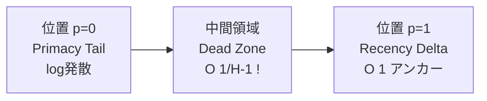

本記事は [https://arxiv.org/abs/2603.10123](https://arxiv.org/abs/2603.10123) の解説記事です。

## 論文概要

"Lost in the Middle at Birth: An Exact Theory of Transformer Position Bias" (Borun D Chowdhury, 2026年3月) は、大規模言語モデル (LLM) で広く観測されてきた「中間部分の情報が失われる」現象 (Lost in the Middle) の根本原因を理論的に解明した研究である。著者は、U字型の位置バイアスが学習やポジショナルエンコーディングの結果ではなく、Transformerアーキテクチャの初期化時点で既に構造的に存在することを厳密に証明している。マルチレイヤーの causal attention を Cesàro 行列の反復累乗としてモデル化し、連続極限における閉形式の影響密度関数を導出した。

## 情報源

| 項目 | 内容 |
|------|------|
| タイトル | Lost in the Middle at Birth: An Exact Theory of Transformer Position Bias |
| 著者 | Borun D Chowdhury |
| 発表日 | 2026年3月10日 |
| arXiv ID | 2603.10123 |
| URL | [https://arxiv.org/abs/2603.10123](https://arxiv.org/abs/2603.10123) |

## 背景と動機

2023年にLiuらが報告した "Lost in the Middle" 現象は、LLMがロングコンテキストの中間部分に配置された情報を正確に取得できない問題として広く知られている。この現象はプロンプト先頭と末尾の情報が優先的に参照されるU字型の性能カーブとして観測される。

従来の説明では、この現象は学習データの分布バイアスやポジショナルエンコーディング (RoPE等) の減衰特性に帰着されることが多かった。しかし、これらの説明は根本的な疑問に答えられていない。なぜ異なるアーキテクチャ・異なる学習データで同様のパターンが出現するのか。

著者はこの問いに対して、位置バイアスがアーキテクチャそのものに内在する構造的特性であり、重みの初期化やRoPEの有無に依存しないことを理論的に示している。これはRAGやロングコンテキスト処理の設計において極めて重要な含意を持つ。

## 主要な貢献

著者が主張する本論文の貢献は以下の通りである。

1. **理論的枠組みの確立**: マルチレイヤー causal attention を Cesàro 行列の反復累乗として定式化し、連続極限で閉形式の影響密度を導出
2. **U字型バイアスの3成分分解**: Primacy Tail（先頭優先）、Recency Delta（末尾優先）、Factorial Dead Zone（中間抑制）の3要素に分解して各々の数学的起源を特定
3. **学習前からの存在証明**: 未学習の Qwen2 および GPT-2 で Step 0 においてU字型バイアスが観測されることを実験的に確認
4. **RoPE非依存性**: ポジショナルエンコーディングの有無がバイアスのトポロジーに影響しないことの理論的・実験的証明
5. **標準的事前学習の限界**: 通常の事前学習ではこの「トポロジカルバレー」を克服できないという理論的帰結

## 技術的詳細

### Causal Attention の連続極限モデル

著者は長さ $N$ のシーケンスに対する causal attention を連続極限で解析している。位置 $i$ のトークンが位置 $j \leq i$ のトークンに払う注意を、初期化時（ランダム重み）の期待値として扱う。

Causal masking により、位置 $i$ のトークンは $j > i$ の情報にアクセスできない。この制約下で、各レイヤーの attention 行列の期待値は下三角行列となり、各行が均一な重み $1/i$ を持つ。これが Cesàro 行列 $C$ の定義に対応する。

### Cesàro 行列の定義と反復

Cesàro 行列 $C$ は $N \times N$ の下三角行列であり、その要素は以下で定義される:

$$
C_{ij} = \begin{cases} \frac{1}{i} & \text{if } j \leq i \\ 0 & \text{if } j > i \end{cases}
$$

ここで $i, j \in \{1, 2, \ldots, N\}$ である。

$H$ 層のTransformerにおいて、情報伝播は $C^H$（Cesàro 行列の $H$ 乗）によって近似される。著者はこの行列累乗の連続極限における漸近挙動を解析している。

連続極限では、位置を $p = i/N \in [0, 1]$ で正規化し、$N \to \infty$ における影響密度関数 $\rho_H(p)$ を導出する。この密度関数は、最終トークン（クエリ位置）から見たときに位置 $p$ の情報がどれだけ影響力を持つかを表す。

### Primacy Tail: 対数的勾配発散の導出

著者は、causal masking の構造から、影響密度が $p \to 0$（プロンプト先頭）で対数的に発散することを証明している:

$$
\rho_H(p) \sim \frac{(\log(1/p))^{H-1}}{(H-1)!} \quad \text{as } p \to 0^+
$$

ここで $H$ はネットワークの深さ（レイヤー数）である。

この発散は直感的には以下のように理解できる。先頭トークンは全ての後続トークンの attention の対象となるため、レイヤーを重ねるごとに「累積的な可視性」が指数的に増幅される。Cesàro 行列の反復において、先頭要素は常に全行の和に含まれるため、$H$ 回の反復で対数的蓄積が生じる。

### Recency Delta: O(1) アンカーの導出

Residual connection の存在により、最終トークン（位置 $p = 1$）には孤立した $O(1)$ のデルタ関数的な寄与が生じる。著者はこれを以下のように定式化している:

$$
\rho_H(p) = \rho_H^{\text{smooth}}(p) + \alpha_H \cdot \delta(p - 1)
$$

ここで $\alpha_H$ は $H$ に依存する $O(1)$ の定数、$\delta$ は Dirac のデルタ関数である。

Residual connection は各レイヤーの出力に入力を加算する ($x + \text{Attn}(x)$) ため、最終位置のトークンは自身への直接的な情報経路を $H$ 本持つ。これにより、深さによらず $O(1)$ の影響力が維持される。

### Factorial Dead Zone: O(1/(H-1)!) の証明スケッチ

最も重要な結果として、著者は中間領域 $p \in (\epsilon, 1-\epsilon)$ における影響密度が階乗的に抑制されることを証明している:

$$
\rho_H(p) = O\left(\frac{1}{(H-1)!}\right) \quad \text{for } p \in (\epsilon, 1-\epsilon)
$$

証明の要点は以下の通りである。Cesàro 行列の $H$ 乗の $(N, j)$ 成分（最終トークンから位置 $j$ への影響）は、連続極限で畳み込み積分として表現される。中間位置では、先頭のような対数的蓄積も末尾のようなデルタ的寄与もないため、影響は $H$ 回の平均化操作（Cesàro 平均）により $(H-1)!$ で割られる。

これは、$H$ 回の iterated Cesàro 平均が中間値を平滑化し、特異点（先頭・末尾）から離れた領域では影響力が急速に減衰することを意味する。実用的には、12層のTransformerで中間位置の影響力は先頭に対して $1/11! \approx 2.5 \times 10^{-8}$ のオーダーで抑制される。

### 影響密度の全体像

以上をまとめると、影響密度関数 $\rho_H(p)$ は以下の3成分の和として理解できる:



### Python による位置バイアス検証実装

以下は、未学習のTransformerで初期化時点の位置バイアスを検証するPythonコードである。

```python
"""
未学習Transformerにおける位置バイアスの検証.

初期化直後（Step 0）のモデルに対してプロンプトを与え、
各位置の情報がどの程度最終トークンに影響するかを可視化する。
"""

import torch
import numpy as np
import matplotlib.pyplot as plt
from transformers import AutoModelForCausalLM, AutoTokenizer


def compute_attention_influence(
    model_name: str,
    seq_length: int = 128,
    seed: int = 42,
) -> np.ndarray:
    """未学習モデルの最終トークンから各位置への attention 影響を計算する.

    Args:
        model_name: HuggingFace モデル名（初期化のみ使用）
        seq_length: 入力シーケンス長
        seed: 乱数シード

    Returns:
        shape (seq_length,) の影響度配列。最終トークンから見た
        各位置の平均 attention weight。
    """
    torch.manual_seed(seed)

    # 設定のみ使用し、重みはランダム初期化
    from transformers import AutoConfig

    config = AutoConfig.from_pretrained(model_name)
    model = AutoModelForCausalLM.from_config(config)
    model.eval()

    # ランダムトークンIDで入力を生成
    input_ids = torch.randint(0, config.vocab_size, (1, seq_length))

    with torch.no_grad():
        outputs = model(
            input_ids,
            output_attentions=True,
        )

    # 全レイヤー・全ヘッドの attention weights を取得
    # attentions: tuple of (batch, num_heads, seq_len, seq_len)
    attentions = outputs.attentions

    # 最終トークン位置から各位置への attention を集約
    # shape: (num_layers, num_heads, seq_length)
    last_token_attn = torch.stack(
        [layer_attn[0, :, -1, :] for layer_attn in attentions]
    )

    # 全レイヤー・全ヘッドで平均
    influence = last_token_attn.mean(dim=(0, 1)).numpy()

    return influence


def compute_cesaro_theoretical(
    seq_length: int,
    num_layers: int,
) -> np.ndarray:
    """Cesàro 行列の H 乗による理論的影響密度を計算する.

    Args:
        seq_length: シーケンス長 N
        num_layers: レイヤー数 H

    Returns:
        shape (seq_length,) の理論的影響度配列
    """
    # Cesàro 行列の構築
    C = np.zeros((seq_length, seq_length))
    for i in range(seq_length):
        for j in range(i + 1):
            C[i, j] = 1.0 / (i + 1)

    # H 乗を計算
    C_H = np.linalg.matrix_power(C, num_layers)

    # 最終行が最終トークンから各位置への影響
    influence = C_H[-1, :]

    return influence


def plot_position_bias(
    model_name: str = "gpt2",
    seq_length: int = 128,
    num_layers: int = 12,
) -> None:
    """位置バイアスを可視化する.

    Args:
        model_name: 検証対象のモデル名
        seq_length: シーケンス長
        num_layers: 理論計算のレイヤー数
    """
    # 実測値
    empirical = compute_attention_influence(model_name, seq_length)

    # 理論値
    theoretical = compute_cesaro_theoretical(seq_length, num_layers)

    # 正規化
    empirical = empirical / empirical.sum()
    theoretical = theoretical / theoretical.sum()

    positions = np.arange(seq_length) / seq_length

    fig, ax = plt.subplots(1, 1, figsize=(10, 5))
    ax.semilogy(positions, empirical, label="Empirical (random init)", alpha=0.7)
    ax.semilogy(positions, theoretical, label=f"Theory (Cesàro^{num_layers})", alpha=0.7)
    ax.set_xlabel("Normalized position p = i/N")
    ax.set_ylabel("Influence density (log scale)")
    ax.set_title("Position Bias at Initialization (Step 0)")
    ax.legend()
    ax.grid(True, alpha=0.3)
    plt.tight_layout()
    plt.savefig("position_bias_step0.png", dpi=150)
    plt.show()


if __name__ == "__main__":
    plot_position_bias(model_name="gpt2", seq_length=128, num_layers=12)
```

このコードは本論文の理論を直接検証するものではなく、著者の主張に基づいて未学習モデルでの位置バイアスを観察する実装例である。

## 実験結果

著者は理論的予測を以下の実験で検証している。

**実験設定**:
- 未学習（ランダム初期化）の Qwen2 および GPT-2 アーキテクチャを使用
- Step 0（学習前）の状態で位置バイアスを計測
- RoPE あり/なし の両条件で比較

**主要な結果**:
- 両アーキテクチャともに、Step 0 の時点で明確なU字型の位置バイアスが観測された
- RoPE の有無はバイアスの全体的なトポロジー（U字型形状）に影響を与えなかった
- 理論的予測（Primacy Tail の対数的発散、Dead Zone の階乗的抑制）と実験結果が定性的に一致

著者は「標準的な事前学習ではこのトポロジカルバレーを克服できない」と結論づけている。これは学習後のモデルでもU字型バイアスが残存する理由を構造的に説明するものである。

## 実装のポイント

本論文の理論的知見を実践に活かすための要点を整理する。

**位置バイアスの定量評価**:
- 自社モデルで Dead Zone の深さを計測し、情報配置戦略の根拠とする
- レイヤー数 $H$ が大きいほど中間抑制が強い ($1/(H-1)!$) ことを考慮し、深いモデルほど重要情報を先頭・末尾に配置する

**アーキテクチャレベルの対策**:
- Causal masking の緩和（bidirectional attention の部分的導入）により Primacy Tail の発散を抑制できる可能性がある
- Residual connection の構造変更により Recency Delta の強度を調整できる可能性がある
- ただし著者は「この研究はバイアスが克服不可能とも、RoPE修正が無意味とも主張していない」と明記している

**プロンプト設計への応用**:
- 理論が示す影響密度の形状に基づき、重要情報の最適配置位置を定量的に決定できる
- Dead Zone の幅はレイヤー数に依存するため、モデルのアーキテクチャ仕様から配置戦略を逆算可能

## 実運用への応用

本論文の知見は、RAGシステムやロングコンテキスト処理の設計に直接的な示唆を与える。

**RAGシステムにおけるチャンク配置**:
- 検索結果をプロンプトに挿入する際、最も関連度の高いチャンクを先頭または末尾に配置する戦略の理論的根拠となる
- 中間位置に配置されたチャンクは階乗的に影響力が抑制されるため、チャンク数が多い場合は分割クエリやマルチターン設計を検討する

**コンテキストウィンドウの設計**:
- 128Kトークン等のロングコンテキストを活用する場合、Dead Zone が広がることを前提とした情報構造設計が必要
- 重要情報を意図的に先頭に再掲する "重要情報のブックエンド配置" が有効

**ファインチューニング戦略**:
- 標準的な事前学習ではトポロジカルバレーを克服できないという著者の主張は、位置バイアス対策にはアーキテクチャ変更や特殊な学習手法が必要であることを示唆する

## 関連研究

本論文は以下の研究文脈に位置づけられる。

- **Liu et al. (2023)**: "Lost in the Middle" 現象の実験的報告。ロングコンテキストでの情報検索精度がU字型になることを初めて体系的に示した
- **RoPE / ALiBi**: 相対位置エンコーディングの各種提案。本論文は、これらの手法がバイアスのトポロジーそのものを変えないことを示している
- **Attention Sink (Xiao et al., 2024)**: 先頭トークンに attention が集中する現象の報告。本論文の Primacy Tail はこの現象の理論的説明を与える

## まとめと今後の展望

本論文は、Transformerの位置バイアスが学習の産物ではなくアーキテクチャの幾何学的性質であることを厳密に証明した。Cesàro 行列の反復累乗という明快な数学的枠組みにより、Primacy Tail（対数的発散）、Recency Delta（O(1)アンカー）、Factorial Dead Zone（階乗的抑制）の3成分に分解し、各々の起源を特定した。

今後の研究方向として、著者の枠組みを拡張した以下のテーマが考えられる:
- 非 causal（bidirectional）attention における対応する理論
- Mixture of Experts (MoE) アーキテクチャでの位置バイアス特性
- 理論に基づいた位置バイアス軽減アーキテクチャの設計

ロングコンテキスト LLM の実用化が進む中、位置バイアスの理論的理解は系統的な対策設計の基盤となる。

## 参考文献

1. Chowdhury, B. D. (2026). Lost in the Middle at Birth: An Exact Theory of Transformer Position Bias. arXiv:2603.10123. [https://arxiv.org/abs/2603.10123](https://arxiv.org/abs/2603.10123)
2. Liu, N. F., Lin, K., Hewitt, J., Paranjape, A., Bevilacqua, M., Petroni, F., & Liang, P. (2023). Lost in the Middle: How Language Models Use Long Contexts. arXiv:2307.03172.
3. Xiao, G., Tian, Y., Chen, B., Han, S., & Lewis, M. (2024). Efficient Streaming Language Models with Attention Sinks. arXiv:2309.17453.
4. Su, J., Lu, Y., Pan, S., Murtadha, A., Wen, B., & Liu, Y. (2021). RoFormer: Enhanced Transformer with Rotary Position Embedding. arXiv:2104.09864.

---

*本記事はAIによって生成された論文解説です。内容の正確性については原論文を参照してください。*
