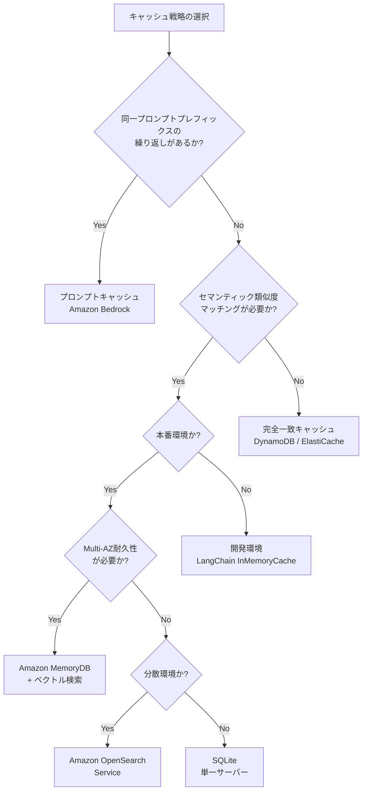
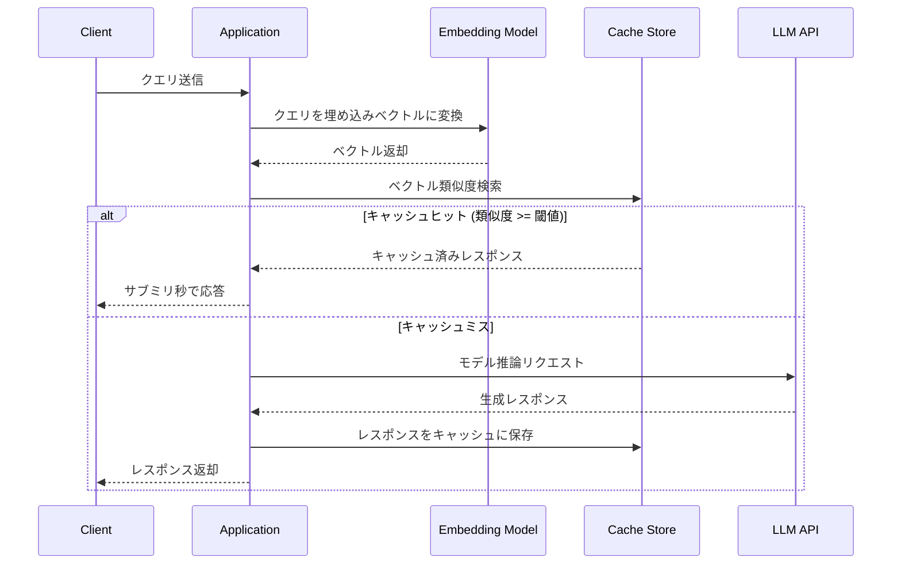

本記事は [Optimize LLM response costs and latency with effective caching](https://aws.amazon.com/blogs/database/optimize-llm-response-costs-and-latency-with-effective-caching/) の解説記事です。

## ブログ概要

AWSデータベースブログで公開された本記事は、LLMアプリケーションにおけるキャッシュ戦略の包括的ガイドである。著者らは、プロンプトキャッシュとリクエスト-レスポンスキャッシュの2つの主要アプローチを提示し、Amazon MemoryDB、SQLite、ElastiCache、OpenSearch、DynamoDB等を活用した4つの実装アーキテクチャを解説している。ブログの記載によると、適切なキャッシュ実装によりモデルサービングコスト最大90%削減、サブミリ秒の応答時間を実現できるとされている。

## 情報源

| 項目 | 内容 |
|------|------|
| 種別 | 企業テックブログ |
| URL | [AWS Database Blog](https://aws.amazon.com/blogs/database/optimize-llm-response-costs-and-latency-with-effective-caching/) |
| 組織 | Amazon Web Services |
| 著者 | Hanish Garg, Mike Kuentz, Parnab Basak |
| 発表日 | 2026年2月2日 |

## 技術的背景

### LLMキャッシュが求められる理由

LLMの商用運用において、コストとレイテンシは最も深刻な課題である。大規模言語モデルの推論コストはトークン単位で課金され、同一または類似のクエリが繰り返し発生する環境では、毎回モデルを呼び出すことは経済的に非効率である。

著者らは以下の問題を指摘している:

- **コスト**: 入力トークン数に比例する推論コストが、大量リクエスト処理時に急速に増大する
- **レイテンシ**: モデル推論には数百ミリ秒から数秒を要し、リアルタイムアプリケーションのUXを損なう
- **スケーラビリティ**: 同時接続数の増加に伴い、モデルのスループット上限がボトルネックとなる

これらの課題に対し、キャッシュは「同じ質問に対して同じ回答を再利用する」というシンプルな原理で根本的な解決を提供する。

### コスト構造の理解

LLM APIの課金は一般的に入力トークンと出力トークンで異なる単価が設定される。例えばAmazon Bedrockでは、モデルごとに1,000トークン単位の従量課金が適用される。プロンプトキャッシュにより入力トークンコストを最大90%削減できるとブログでは述べられている。

## 2つの主要キャッシュ戦略

### 1. プロンプトキャッシュ（Prompt Caching）

プロンプトキャッシュは、APIコール間で繰り返されるプロンプトプレフィックスを再利用する手法である。Amazon Bedrockを通じて提供され、以下のユースケースで特に有効とされている:

- **ドキュメントQ&A**: 長大なコンテキスト（契約書、マニュアル等）に対する繰り返し質問
- **コードアシスタント**: リポジトリ全体のコンテキストを保持した対話
- **長文チャット**: 会話履歴が蓄積されるマルチターン対話

プロンプトキャッシュの効果について、著者らは「推論レスポンスレイテンシを最大85%削減し、入力トークンコストを最大90%削減する」と述べている。

```python
from typing import Any

import boto3


def invoke_with_prompt_cache(
    model_id: str,
    system_prompt: str,
    user_message: str,
    cache_point_type: str = "default",
) -> dict[str, Any]:
    """Amazon Bedrockのプロンプトキャッシュを活用したモデル呼び出し.

    Args:
        model_id: Bedrockモデル識別子 (e.g., "anthropic.claude-3-5-sonnet-20241022-v2:0")
        system_prompt: キャッシュ対象のシステムプロンプト
        user_message: ユーザーからの入力メッセージ
        cache_point_type: キャッシュポイントの種別

    Returns:
        モデルからのレスポンス辞書
    """
    client = boto3.client("bedrock-runtime")

    response = client.converse(
        modelId=model_id,
        system=[
            {
                "text": system_prompt,
                "cachePoint": {"type": cache_point_type},
            }
        ],
        messages=[
            {
                "role": "user",
                "content": [{"text": user_message}],
            }
        ],
    )
    return response
```

### 2. リクエスト-レスポンスキャッシュ（Request-Response Caching）

完全なリクエストとその応答のペアを保存し、同一または意味的に類似したクエリに対してキャッシュから直接回答を返す手法である。このアプローチには2つのマッチング方式がある:

- **完全一致（Exact Match）**: クエリ文字列のハッシュによる高速検索
- **セマンティック一致（Semantic Match）**: 埋め込みベクトルによる意味的類似度検索

セマンティックキャッシュは、表現が異なるが意味が同じクエリ（例: 「東京の天気は？」と「東京の今日の気象状況を教えて」）に対しても同じキャッシュを返せる利点がある。ただし、埋め込み計算のオーバーヘッドが追加される点を著者らは指摘している。

## 実装アーキテクチャ

### 4つのキャッシュアーキテクチャ比較

| アーキテクチャ | 技術 | ユースケース | 永続性 | スケーラビリティ |
|---|---|---|---|---|
| インメモリ | Amazon MemoryDB | 本番環境のセマンティックキャッシュ | Multi-AZ耐久性 | 高 |
| エフェメラル | LangChain InMemoryCache | 開発・プロトタイピング | なし | 低 |
| ディスクベース | SQLite | 単一サーバーシナリオ | ファイルベース | 低 |
| 外部データベース | ElastiCache/Valkey, OpenSearch, DynamoDB | 分散環境の本番利用 | サービス依存 | 高 |

### Amazon MemoryDB によるセマンティックキャッシュ

Amazon MemoryDBはベクトル検索機能を持つインメモリデータベースであり、Multi-AZ構成による耐久性を備えている。著者らはこれを本番環境のセマンティックキャッシュ実装として推奨している。

```python
from dataclasses import dataclass
from typing import Any

import numpy as np


@dataclass
class CacheEntry:
    """セマンティックキャッシュのエントリ."""

    query: str
    embedding: np.ndarray
    response: str
    metadata: dict[str, Any]
    ttl_seconds: int = 3600


class SemanticCache:
    """MemoryDBベースのセマンティックキャッシュ実装.

    ベクトル検索により意味的に類似したクエリのキャッシュヒットを実現する。
    """

    def __init__(
        self,
        host: str,
        port: int = 6379,
        similarity_threshold: float = 0.95,
        index_name: str = "llm_cache_idx",
    ) -> None:
        """初期化.

        Args:
            host: MemoryDBエンドポイント
            port: 接続ポート
            similarity_threshold: コサイン類似度の閾値
            index_name: ベクトルインデックス名
        """
        import redis

        self.client = redis.Redis(host=host, port=port, ssl=True)
        self.similarity_threshold = similarity_threshold
        self.index_name = index_name

    def search(self, query_embedding: np.ndarray, top_k: int = 1) -> list[dict[str, Any]]:
        """ベクトル類似度検索によるキャッシュルックアップ.

        Args:
            query_embedding: クエリの埋め込みベクトル
            top_k: 返却する上位件数

        Returns:
            類似度の高いキャッシュエントリのリスト
        """
        from redis.commands.search.query import Query

        query = (
            Query(f"*=>[KNN {top_k} @embedding $vec AS score]")
            .sort_by("score")
            .return_fields("response", "query", "score")
            .dialect(2)
        )
        results = self.client.ft(self.index_name).search(
            query, query_params={"vec": query_embedding.tobytes()}
        )
        return [
            {
                "response": doc.response,
                "query": doc.query,
                "similarity": 1.0 - float(doc.score),
            }
            for doc in results.docs
            if (1.0 - float(doc.score)) >= self.similarity_threshold
        ]
```

### アーキテクチャ選択のデシジョンツリー



### セマンティックキャッシュの処理フロー



## Production Deployment Guide

### AWS実装パターン

著者らのブログで解説されたアーキテクチャを、実運用のスケール別に整理する。

#### Small構成（月間10万リクエスト未満）

単一リージョン、最小構成でのキャッシュ導入パターン。

```python
from dataclasses import dataclass, field
from enum import Enum


class CacheBackend(Enum):
    """キャッシュバックエンドの種別."""

    SQLITE = "sqlite"
    ELASTICACHE = "elasticache"
    MEMORYDB = "memorydb"
    DYNAMODB = "dynamodb"


@dataclass
class SmallDeploymentConfig:
    """Small構成のデプロイメント設定.

    月間10万リクエスト未満を想定。
    単一AZ、最小限のインスタンスサイズで運用コストを最小化する。
    """

    backend: CacheBackend = CacheBackend.ELASTICACHE
    node_type: str = "cache.t4g.micro"
    num_replicas: int = 0
    ttl_seconds: int = 3600
    max_connections: int = 50
    enable_encryption: bool = True
    tags: dict[str, str] = field(default_factory=lambda: {"Environment": "production", "Scale": "small"})
```

#### Medium構成（月間10万-1000万リクエスト）

Multi-AZ、リードレプリカによる読み取りスケーリング。

```python
@dataclass
class MediumDeploymentConfig:
    """Medium構成のデプロイメント設定.

    月間10万-1000万リクエストを想定。
    Multi-AZ構成でリードレプリカによる読み取り分散を行う。
    """

    backend: CacheBackend = CacheBackend.MEMORYDB
    node_type: str = "db.r7g.large"
    num_shards: int = 2
    num_replicas_per_shard: int = 1
    ttl_seconds: int = 7200
    max_connections: int = 500
    enable_vector_search: bool = True
    vector_dimensions: int = 1536
    similarity_metric: str = "COSINE"
    enable_multi_az: bool = True
```

#### Large構成（月間1000万リクエスト以上）

マルチレイヤーキャッシュ、グローバル分散、自動スケーリング。

```python
from dataclasses import dataclass, field


@dataclass
class MultiLayerCacheConfig:
    """マルチレイヤーキャッシュ構成.

    L1: アプリケーション内インメモリ（最速、容量小）
    L2: ElastiCache/MemoryDB（ミリ秒、中容量）
    L3: DynamoDB/OpenSearch（永続化、大容量）
    """

    # L1: プロセス内キャッシュ
    l1_max_items: int = 10000
    l1_ttl_seconds: int = 300

    # L2: 分散インメモリキャッシュ
    l2_backend: CacheBackend = CacheBackend.MEMORYDB
    l2_node_type: str = "db.r7g.xlarge"
    l2_num_shards: int = 4
    l2_num_replicas_per_shard: int = 2
    l2_ttl_seconds: int = 7200

    # L3: 永続キャッシュ
    l3_backend: CacheBackend = CacheBackend.DYNAMODB
    l3_read_capacity: int = 1000
    l3_write_capacity: int = 500
    l3_ttl_seconds: int = 86400

    # ベクトル検索設定
    vector_dimensions: int = 1536
    similarity_threshold: float = 0.92

    # 自動スケーリング
    auto_scaling_enabled: bool = True
    target_cpu_utilization: float = 70.0
    scale_in_cooldown: int = 300
    scale_out_cooldown: int = 60
```

### Terraformインフラコード

以下はMedium構成の主要リソース定義例である（2026年6月時点のプロバイダーバージョンに基づく概算構成）。

```hcl
# Amazon MemoryDB クラスター（セマンティックキャッシュ用）
resource "aws_memorydb_cluster" "llm_cache" {
  name                   = "llm-semantic-cache"
  node_type              = "db.r7g.large"
  num_shards             = 2
  num_replicas_per_shard = 1
  acl_name               = aws_memorydb_acl.llm_cache.name
  subnet_group_name      = aws_memorydb_subnet_group.llm_cache.name
  security_group_ids     = [aws_security_group.llm_cache.id]
  tls_enabled            = true
  engine_version         = "7.1"

  snapshot_retention_limit = 7
  maintenance_window       = "sun:05:00-sun:06:00"
  snapshot_window          = "03:00-04:00"

  tags = {
    Environment = "production"
    Purpose     = "llm-caching"
  }
}

# DynamoDB テーブル（TTLベースキャッシュ用）
resource "aws_dynamodb_table" "llm_cache_store" {
  name         = "llm-cache-responses"
  billing_mode = "PAY_PER_REQUEST"
  hash_key     = "cache_key"

  attribute {
    name = "cache_key"
    type = "S"
  }

  ttl {
    attribute_name = "expires_at"
    enabled        = true
  }

  point_in_time_recovery {
    enabled = true
  }

  tags = {
    Environment = "production"
    Purpose     = "llm-response-cache"
  }
}

# CloudWatch アラーム（キャッシュヒット率監視）
resource "aws_cloudwatch_metric_alarm" "cache_hit_rate_low" {
  alarm_name          = "llm-cache-hit-rate-below-60"
  comparison_operator = "LessThanThreshold"
  evaluation_periods  = 3
  threshold           = 60
  alarm_description   = "Cache hit rate dropped below 60% - review cache strategy"

  metric_name = "CacheHitRate"
  namespace   = "Custom/LLMCache"
  statistic   = "Average"
  period      = 300

  alarm_actions = [aws_sns_topic.alerts.arn]
}
```

### 運用・監視設定

キャッシュシステムの健全性を維持するために、以下のメトリクスの監視が重要である。

```python
from dataclasses import dataclass
from enum import Enum


class MetricSeverity(Enum):
    """アラート重要度."""

    INFO = "info"
    WARNING = "warning"
    CRITICAL = "critical"


@dataclass
class CacheMonitoringConfig:
    """キャッシュ監視設定.

    著者らが述べる「60%以上のシステムコールにキャッシュ適用」を
    運用指標として設定する。
    """

    # キャッシュヒット率
    hit_rate_warning_threshold: float = 60.0  # 著者推奨の最低ライン
    hit_rate_critical_threshold: float = 40.0

    # レイテンシ (ms)
    cache_lookup_p99_warning: float = 10.0
    cache_lookup_p99_critical: float = 50.0

    # メモリ使用率
    memory_usage_warning: float = 75.0
    memory_usage_critical: float = 90.0

    # エビクション率
    eviction_rate_warning: float = 5.0  # 1分あたりのエビクション数

    # 監視間隔
    check_interval_seconds: int = 60
    aggregation_period_seconds: int = 300


def build_cloudwatch_dashboard(config: CacheMonitoringConfig) -> dict:
    """CloudWatchダッシュボード定義を生成.

    Args:
        config: 監視設定

    Returns:
        CloudWatch Dashboard JSON構造
    """
    return {
        "widgets": [
            {
                "type": "metric",
                "properties": {
                    "title": "Cache Hit Rate",
                    "metrics": [["Custom/LLMCache", "CacheHitRate"]],
                    "annotations": {
                        "horizontal": [
                            {"value": config.hit_rate_warning_threshold, "label": "Warning"},
                            {"value": config.hit_rate_critical_threshold, "label": "Critical"},
                        ]
                    },
                    "period": config.aggregation_period_seconds,
                },
            },
            {
                "type": "metric",
                "properties": {
                    "title": "Cache Lookup Latency (p99)",
                    "metrics": [["Custom/LLMCache", "LookupLatencyP99"]],
                    "period": config.aggregation_period_seconds,
                },
            },
            {
                "type": "metric",
                "properties": {
                    "title": "Cost Savings",
                    "metrics": [
                        ["Custom/LLMCache", "TokensSaved"],
                        ["Custom/LLMCache", "EstimatedCostSaved"],
                    ],
                    "period": config.aggregation_period_seconds,
                },
            },
        ]
    }
```

### コスト最適化チェックリスト

以下は2026年6月時点のAWS東京リージョン概算価格に基づく試算である（実際の料金はAWS公式料金ページを参照のこと）。

| 構成 | 主要コスト要素 | 月額概算 | 損益分岐点 |
|------|--------------|---------|-----------|
| Small (ElastiCache t4g.micro) | インスタンス + データ転送 | $15-30 | 月5万リクエスト以上で黒字化 |
| Medium (MemoryDB r7g.large x2 shard) | インスタンス + スナップショット | $400-600 | 月50万リクエスト以上 |
| Large (マルチレイヤー) | MemoryDB + DynamoDB + 転送 | $1,500-3,000 | 月500万リクエスト以上 |

**コスト最適化のポイント**:

1. **キャッシュヒット率60%以上を維持する** - 著者らが述べるとおり、60%未満ではキャッシュインフラのコストが削減効果を上回る可能性がある
2. **TTLの適切な設定** - 短すぎるとヒット率低下、長すぎると陳腐化したレスポンスを返すリスク
3. **リザーブドインスタンスの活用** - 安定したワークロードには1年/3年RIで最大60%割引
4. **不要データの自動パージ** - DynamoDB TTLやMemoryDBのeviction policyで不要エントリを自動削除

## パフォーマンス最適化

### レイテンシ特性

著者らのブログによると、キャッシュヒット時にはサブミリ秒の応答時間を実現できるとされている。各レイヤーの典型的なレイテンシ特性を整理する:

| レイヤー | 読み取りレイテンシ | 備考 |
|---------|-----------------|------|
| L1 (プロセス内) | < 0.1ms | メモリ直接アクセス |
| L2 (MemoryDB/ElastiCache) | 0.5-2ms | ネットワークラウンドトリップ含む |
| L3 (DynamoDB) | 2-10ms | SSD永続化、結果整合性 |
| LLM推論 (Bedrock) | 500-5000ms | モデル・トークン数依存 |

キャッシュヒット時とミス時のレイテンシ差は2-3桁に達するため、ヒット率の改善が直接的なユーザー体験向上につながる。

### スループット最適化

- **コネクションプーリング**: MemoryDB/ElastiCacheへの接続をプールし、接続確立のオーバーヘッドを排除
- **パイプライニング**: 複数のキャッシュ操作をバッチ化して往復回数を削減
- **非同期書き込み**: キャッシュへの書き込みを非同期化し、レスポンス返却を遅延させない

```python
import asyncio
from typing import Any


class AsyncCacheWriter:
    """非同期キャッシュ書き込み.

    LLMレスポンス返却後に非同期でキャッシュに保存することで、
    ユーザーへのレイテンシを最小化する。
    """

    def __init__(self, cache_client: Any, max_queue_size: int = 1000) -> None:
        """初期化.

        Args:
            cache_client: キャッシュストアのクライアント
            max_queue_size: 書き込みキューの最大サイズ
        """
        self._cache = cache_client
        self._queue: asyncio.Queue[tuple[str, str, int]] = asyncio.Queue(
            maxsize=max_queue_size
        )
        self._running = False

    async def start(self) -> None:
        """バックグラウンド書き込みワーカーを起動."""
        self._running = True
        asyncio.create_task(self._writer_loop())

    async def enqueue(self, key: str, value: str, ttl: int = 3600) -> None:
        """キャッシュ書き込みをキューに追加.

        Args:
            key: キャッシュキー
            value: キャッシュ値
            ttl: 有効期限（秒）
        """
        await self._queue.put((key, value, ttl))

    async def _writer_loop(self) -> None:
        """書き込みキューを消費するワーカーループ."""
        while self._running:
            key, value, ttl = await self._queue.get()
            try:
                await self._cache.set(key, value, ex=ttl)
            except Exception:
                # 書き込み失敗はキャッシュミスとして許容
                pass
            finally:
                self._queue.task_done()
```

## 運用での学び

### キャッシュ無効化戦略

著者らは3つのキャッシュ無効化メカニズムを提示している:

1. **TTLベースの自動期限切れ**: 最もシンプルな手法。著者らは「ランダムに生成された時間ジッタを追加する」ことで、同時リフレッシュによるサンダリングハード問題を防止することを推奨している

2. **プロアクティブ無効化**: データ更新時に該当キャッシュを選択的に削除する。SQLiteではDELETE文、ValkeyではUNLINKコマンド、DynamoDBではDeleteItem APIを使用する

3. **プロアクティブ更新**: 期限切れ前に新データをプリロード・バッチリフレッシュする。スケジュールベースの更新により、キャッシュミスによるレイテンシスパイクを未然に防ぐ

### TTL設計の指針

TTLの設定は、データの鮮度要件とキャッシュヒット率のトレードオフである:

- **静的コンテンツ（FAQ、ドキュメント要約）**: TTL 24-72時間
- **準動的コンテンツ（ニュース要約、市場分析）**: TTL 1-6時間
- **動的コンテンツ（リアルタイムデータに基づく回答）**: TTL 5-30分

### ガードレールとセキュリティ

著者らはAmazon Bedrock Guardrailsの活用を推奨している。ブログの記載によると:

- **自動推論（Automated Reasoning）**: ハルシネーション検出で最大99%の精度を達成
- **マルチモーダルコンテンツ分析**: 有害なマルチモーダルコンテンツの最大88%をブロック可能
- **PII保護**: 個人情報を含むレスポンスのキャッシュ保存を防止

キャッシュに保存するレスポンスに対してもガードレールを適用することで、不適切な回答が永続化されるリスクを軽減できる。

### 60%閾値ルール

著者らは重要な実装判断基準として、「キャッシュがシステムコールの少なくとも60%に適用できない場合、その恩恵は追加される複雑性を上回らない可能性がある」と述べている。この閾値は以下の判断に用いるべきである:

- キャッシュ導入の是非判定（事前分析フェーズ）
- 運用中のキャッシュ戦略見直しトリガー
- アラート閾値の設定基準

## 学術研究との関連

セマンティックキャッシュの概念は、情報検索（Information Retrieval）分野における近似最近傍探索（Approximate Nearest Neighbor, ANN）の応用である。ベクトル空間における類似度検索は、HNSW（Hierarchical Navigable Small World）やIVF（Inverted File Index）等のインデックス構造により効率化されている。

また、LLMのプロンプトキャッシュは、KVキャッシュ（Key-Value Cache）の概念と密接に関連する。Transformerの自己注意機構において、過去のトークンに対するKey-Value行列を保持・再利用することで計算量を削減する手法は、学術的にはPagedAttention（vLLM）やRadixAttention（SGLang）等の研究で発展が続いている。

## まとめと実践への示唆

本ブログは、LLMアプリケーションにおけるキャッシュ戦略を体系的に整理した実践的ガイドである。著者らが提示する2つのキャッシュアプローチ（プロンプトキャッシュ、リクエスト-レスポンスキャッシュ）と4つのアーキテクチャパターンは、ワークロードの特性に応じた選択指針を提供している。特に「60%閾値ルール」は、キャッシュ導入の費用対効果を事前に評価するための実用的な基準として参考になる。実装にあたっては、まずクエリの繰り返しパターンを分析し、適切なキャッシュ戦略とアーキテクチャを選択することが推奨される。

## 参考文献

1. Garg, H., Kuentz, M., & Basak, P. (2026). "Optimize LLM response costs and latency with effective caching." AWS Database Blog. [https://aws.amazon.com/blogs/database/optimize-llm-response-costs-and-latency-with-effective-caching/](https://aws.amazon.com/blogs/database/optimize-llm-response-costs-and-latency-with-effective-caching/)
2. Amazon Web Services. "Amazon Bedrock Prompt Caching." AWS Documentation. [https://docs.aws.amazon.com/bedrock/latest/userguide/prompt-caching.html](https://docs.aws.amazon.com/bedrock/latest/userguide/prompt-caching.html)
3. Amazon Web Services. "Amazon MemoryDB for Redis." AWS Documentation. [https://docs.aws.amazon.com/memorydb/](https://docs.aws.amazon.com/memorydb/)
4. Amazon Web Services. "Amazon Bedrock Guardrails." AWS Documentation. [https://docs.aws.amazon.com/bedrock/latest/userguide/guardrails.html](https://docs.aws.amazon.com/bedrock/latest/userguide/guardrails.html)
5. Kwon, W. et al. (2023). "Efficient Memory Management for Large Language Model Serving with PagedAttention." SOSP 2023.
6. Zheng, L. et al. (2024). "SGLang: Efficient Execution of Structured Language Model Programs." arXiv:2312.07104.
