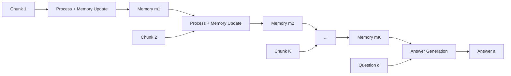

## 論文概要

本記事は [MemAgent (arXiv:2507.02259)](https://arxiv.org/abs/2507.02259) の解説記事です。

MemAgentは、LLMの固定コンテキストウィンドウの制約を超えて超長文ドキュメントを処理するためのエージェントフレームワークである。ドキュメントを固定長チャンクに分割し、各チャンクを逐次読み込みながら固定長の補助メモリパネルを上書き更新していく。訓練にはDAPO（Decoupled Advantage Policy Optimization）アルゴリズムを独立コンテキストの多会話生成に拡張した手法を採用し、強化学習の報酬信号によってメモリの取捨選択を最適化する。著者らの報告によれば、Qwen2.5-7Bベース（32Kウィンドウ）のモデルが3.5Mトークンの質問応答タスクに対応し、512K RULERテストで95%以上の精度を達成した。本論文はICLR 2026にOral論文として採択されている。

この記事は [Zenn記事: MemCtrlに学ぶ会話メモリRL制御でLLMエージェントのトークンコストを70%削減する](https://zenn.dev/0h_n0/articles/a88984a9983db1) の深掘りです。

## 情報源

- **arXiv ID**: 2507.02259
- **URL**: [https://arxiv.org/abs/2507.02259](https://arxiv.org/abs/2507.02259)
- **著者**: Hongli Yu, Tinghong Chen, Jiangtao Feng, Jiangjie Chen, Weinan Dai, Qiying Yu, Ya-Qin Zhang, Wei-Ying Ma, Jingjing Liu, Mingxuan Wang, Hao Zhou（ByteDance / Tsinghua University）
- **発表年**: 2025年7月（ICLR 2026 Oral採択）
- **分野**: cs.CL, cs.AI, cs.LG
- **コード**: [https://github.com/BytedTsinghua-SIA/MemAgent](https://github.com/BytedTsinghua-SIA/MemAgent)（Apache 2.0ライセンス）
- **モデル重み**: HuggingFace（BytedTsinghua-SIA/RL-MemoryAgent-7B, RL-MemoryAgent-14B）

## 背景と動機

現在のLLMはTransformerのSelf-Attentionに起因する$O(n^2)$の計算量制約を抱えている。コンテキストウィンドウを128Kや200Kに拡大する試みは進んでいるが、ウィンドウ長を超える入力には対応できず、長くなるほど性能が急激に劣化する「performance cliff」問題が存在する。

既存のアプローチには、Sparse/Linear Attentionなどアーキテクチャ改変手法（既存モデルとの互換性喪失）と、RAG（検索精度がボトルネックで文書全体の文脈保持が困難）がある。

MemAgentはこれらとは異なり、モデルアーキテクチャを変更せず、固定長メモリを介してドキュメントをストリーム処理する「エージェント」として再定義する。人間が長い文書を読む際にメモを取りながら読み進める行為に着想を得たアプローチである。

## 主要な貢献

- **固定長メモリによるストリーム処理**: モデルアーキテクチャ無変更で、固定長メモリ+チャンク逐次処理により32Kウィンドウを3.5Mトークン対応に拡張。計算量は$O(n)$。
- **Multi-Conv DAPO**: DAPOを(group, token)から(group, conversation, token)の3次元に拡張し、メモリ更新を含むトラジェクトリにRLVRを適用可能にした。
- **実用的な性能実証**: 7Bモデルで32Kから3.5Mトークンまでの外挿で性能劣化が限定的。512K RULERで95%以上の精度を報告。

## 技術的詳細

### アーキテクチャ: 固定長メモリによるチャンク逐次処理

MemAgentは入力ドキュメントを$K$個の固定長チャンク$\mathbf{c}^1, \mathbf{c}^2, \ldots, \mathbf{c}^K$に分割する（各チャンクは最大$N$トークン、論文ではデフォルト$N=5000$）。処理は2つのモジュールで構成される。

**コンテキスト処理モジュール**: 各ステップ$k$で、現在のチャンク$\mathbf{c}^k$と前ステップのメモリ$\mathbf{m}^{k-1}$を入力として、更新されたメモリ$\mathbf{m}^k$を生成する。

$$
\mathbf{m}^k = f_\theta(\mathbf{c}^k, \mathbf{m}^{k-1})
$$

メモリは固定長（論文では1024トークン）の自然言語テキストであり、entity-factペアなどの明示的なデータ構造ではなく、モデルが自由形式で情報を記述する。上書き戦略（overwrite strategy）により、各ステップで新しいメモリ状態を完全に再生成する。

**回答生成モジュール**: 全チャンクの処理完了後、最終メモリ$\mathbf{m}^K$と質問$\mathbf{q}$から回答$\mathbf{a}$を生成する。

$$
\mathbf{a} = g_\theta(\mathbf{q}, \mathbf{m}^K)
$$



この設計により、各ステップのコンテキストウィンドウサイズは$|\mathbf{q}| + |\mathbf{m}| + N + |\text{prompt}|$で一定となり、入力長全体に対して線形の計算量を実現する。

### 訓練手法: 多会話対応DAPO

MemAgentの訓練の核心は、メモリ更新操作を強化学習で最適化する点にある。メモリ更新は離散的なテキスト生成であり、微分不可能であるため、教師あり学習での直接的な勾配伝播が困難である。

著者らはDAPO（Decoupled Advantage Policy Optimization）アルゴリズムを多会話設定に拡張した。標準のDAPOでは各プロンプトに対して1つの応答をサンプリングするが、MemAgentでは1つのドキュメントに対して$K$回のメモリ更新会話と1回の回答生成会話が発生する。

**アドバンテージの計算**: グループ$i$内のサンプル$j$に対するアドバンテージは、最終回答の報酬$r_i$をグループ内で正規化して算出する。

$$
\hat{A}_{i,j,t} = r_i - \text{mean}(\{R_i\}_{i=1}^{G})
$$

ここで、$r_i$は最終回答に対するルールベースの検証可能報酬（exact match等）であり、$G$はグループサイズ（論文では16）である。重要な点は、この報酬がメモリ更新ステップを含む全てのトークンに遡及的に割り当てられることである。

**損失関数**: クリップされた重要度サンプリングによる方策勾配を用いる。

$$
\mathcal{J}_{\text{DAPO}}(\theta) = \mathbb{E}\left[\frac{1}{\sum |o_{i,j}|} \sum \left(\mathcal{C}_{i,j,t} - \beta D_{\text{KL}}(\pi_\theta \| \pi_{\text{ref}})\right)\right]
$$

ここで、$\mathcal{C}_{i,j,t}$はクリップされた方策比率とアドバンテージの積である。

$$
\mathcal{C}_{i,j,t} = \min\left(r_{i,j,t}(\theta)\hat{A}_{i,j,t},\; \text{clip}\left(r_{i,j,t}(\theta),\; 1-\varepsilon_{\text{low}},\; 1+\varepsilon_{\text{high}}\right)\hat{A}_{i,j,t}\right)
$$

各変数の意味は以下の通りである。
- $r_{i,j,t}(\theta) = \frac{\pi_\theta(a_t | s_t)}{\pi_{\text{old}}(a_t | s_t)}$: 方策比率（importance sampling ratio）
- $\varepsilon_{\text{low}}, \varepsilon_{\text{high}}$: 非対称クリップ閾値（DAPOの特徴で、正のアドバンテージに対してより大きなクリップ幅を許容）
- $\beta$: KLペナルティ係数（論文では$10^{-3}$）
- $|o_{i,j}|$: 会話$j$のトークン数

### DAPOの拡張ポイント

標準DAPOとの主な違いは次元の拡張にある。標準DAPOは(group, token)の2次元で損失を計算するが、Multi-Conv DAPOは(group, conversation, token)の3次元構造を持つ。各会話（メモリ更新ステップ + 回答生成）は独立したコンテキストで生成されるが、報酬は最終回答のみに基づいて全会話に遡及的に割り当てられる。これにより、質問に関係のある情報をメモリに保持し、不要な情報を破棄するメモリ管理方策が学習される。

## 実装のポイント

MemAgentの実装に関して、論文とGitHubリポジトリから読み取れる主要な技術的考慮事項を整理する。

**推論パイプライン**: 推論時はvLLM（バージョン0.8.2）を用いたサービングが推奨されている。7Bモデルの場合、FP16で約14GBのVRAMが必要であり、24GB以上のGPU（A10G, L4等）で動作する。14Bモデルはtensor parallelism=2での2GPU構成が必要である。

**メモリサイズと品質のトレードオフ**: 論文ではメモリサイズ1024トークンで訓練されている。メモリサイズを増やせばより多くの情報を保持できるが、各ステップのコンテキストウィンドウ消費量が増加し、処理可能なチャンク数（実効的な最大入力長）が減少する。

**チャンクサイズの選択**: チャンクサイズ$N$は情報の粒度と処理ステップ数のトレードオフである。$N$が小さいとステップ数が増え、メモリ更新の回数が増えるため情報損失リスクが高まる。$N$が大きいとコンテキストウィンドウの大部分をチャンクが占め、メモリに割ける容量が減少する。論文のデフォルト値$N=5000$は32Kウィンドウに対するバランス点である。

**訓練コスト**: HotpotQAの32,768サンプルを使用し、ロールアウトバッチサイズは7Bで128、14Bで256、AdamW（学習率$10^{-6}$）で訓練される。具体的なGPU時間は論文中に明記されていない。

## Production Deployment Guide

MemAgentはvLLMベースの推論サーバとして提供されており、OpenAI互換APIを通じてプロダクション環境にデプロイ可能である。以下にAWS上での構成パターンを示す。

### AWS実装パターン（コスト最適化重視）

MemAgent-7Bは約14GB（FP16）のVRAMを必要とするため、GPU搭載インスタンスが必須である。以下にトラフィック量別の推奨構成を示す。

**コスト試算の注意**: 以下は2026年6月時点のAWS ap-northeast-1（東京）リージョン料金に基づく概算値である。実際のコストはトラフィックパターン、リージョン、バースト使用量により変動する。最新料金は[AWS料金計算ツール](https://calculator.aws/)で確認を推奨する。

| 構成 | トラフィック | インフラ | GPU | 月額概算 |
|------|------------|---------|-----|---------|
| Small | ~100 req/日 | EC2 Spot (g5.xlarge) + ALB | A10G 24GB x1 | $200-400 |
| Medium | ~1,000 req/日 | ECS Fargate + ALB + Auto Scaling | A10G 24GB x1 | $800-1,500 |
| Large | 10,000+ req/日 | EKS + Karpenter + Spot優先 | A10G 24GB x2-4 | $3,000-6,000 |

**Small構成の内訳**:
- g5.xlarge Spot Instance: ~$0.35/hr（On-Demand $1.006/hrから約65%削減） x 730hr = ~$256/月
- ALB: ~$25/月
- CloudWatch + S3ログ: ~$10/月
- 夜間停止（12時間稼働）で更に50%削減可能

**コスト削減テクニック**:
- Spot Instances活用: g5系で最大65-70%削減（GPU Spotは汎用CPUほど割引率が高くない点に注意）
- Reserved Instances（1年）: On-Demandから最大40%削減
- 夜間・休日の自動停止: 稼働時間50%削減で月額半減
- INT8量子化: VRAMを半減させ、より安価なインスタンスを選択可能に

### Terraformインフラコード

**Small構成（EC2 Spot + vLLM）** -- 主要リソースの抜粋:

```hcl
# MemAgent Small構成 - EC2 Spot + vLLM
# 2026-06時点 ap-northeast-1, terraform >= 1.9, aws provider ~> 5.80

# VPC基盤（NAT Gateway不使用でコスト削減）
resource "aws_vpc" "memagent" {
  cidr_block           = "10.0.0.0/16"
  enable_dns_hostnames = true
  tags = { Name = "memagent-vpc", Project = "memagent" }
}

# IAMロール（最小権限: SSM + CloudWatch）
resource "aws_iam_role" "memagent_ec2" {
  name = "memagent-ec2-role"
  assume_role_policy = jsonencode({
    Version = "2012-10-17"
    Statement = [{
      Action = "sts:AssumeRole", Effect = "Allow",
      Principal = { Service = "ec2.amazonaws.com" }
    }]
  })
}

# EC2 Spot Instance（g5.xlarge = A10G 24GB）
resource "aws_spot_instance_request" "memagent" {
  ami           = "ami-0xxxxxxxx"  # Deep Learning AMI (Ubuntu)
  instance_type = "g5.xlarge"
  spot_type     = "persistent"

  root_block_device {
    volume_size = 100  # モデル重み + vLLM用
    volume_type = "gp3"
    encrypted   = true
  }

  user_data = base64encode(<<-EOF
    #!/bin/bash
    pip install vllm==0.8.2
    huggingface-cli download BytedTsinghua-SIA/RL-MemoryAgent-7B
    vllm serve BytedTsinghua-SIA/RL-MemoryAgent-7B \
      --host 0.0.0.0 --port 8000 \
      --gpu-memory-utilization 0.90 --max-model-len 32768
  EOF
  )
  tags = { Name = "memagent-spot", Project = "memagent" }
}
```

**Large構成（EKS + Karpenter + Spot）** -- 主要リソースの抜粋:

```hcl
module "eks" {
  source  = "terraform-aws-modules/eks/aws"
  version = "~> 20.31"
  cluster_name    = "memagent-cluster"
  cluster_version = "1.31"
}

# Karpenter NodePool（GPU Spot優先）
resource "kubectl_manifest" "karpenter_nodepool" {
  yaml_body = yamlencode({
    apiVersion = "karpenter.sh/v1"
    kind       = "NodePool"
    metadata   = { name = "memagent-gpu" }
    spec = {
      template.spec.requirements = [
        { key = "node.kubernetes.io/instance-type", operator = "In",
          values = ["g5.xlarge", "g5.2xlarge"] },
        { key = "karpenter.sh/capacity-type", operator = "In",
          values = ["spot", "on-demand"] },
      ]
      limits     = { cpu = "64", "nvidia.com/gpu" = "8" }
      disruption = { consolidationPolicy = "WhenEmptyOrUnderutilized",
                     consolidateAfter = "30s" }
    }
  })
}

# AWS Budgets（月額$5,000上限、80%でアラート）
resource "aws_budgets_budget" "memagent" {
  name = "memagent-monthly"
  budget_type = "COST"
  limit_amount = "5000"
  limit_unit = "USD"
  time_unit = "MONTHLY"
}
```

### 運用・監視設定

**CloudWatch Logs Insights クエリ**（レイテンシ分析）:

```
fields @timestamp, @message
| filter @message like /inference_complete/
| stats count() as request_count,
        avg(duration_ms) as avg_latency,
        pct(duration_ms, 95) as p95_latency,
        pct(duration_ms, 99) as p99_latency
  by bin(1h)
```

**CloudWatch アラーム + X-Ray + Cost Explorer設定（Python）**:

```python
import boto3
from aws_xray_sdk.core import xray_recorder, patch_all
from datetime import datetime, timedelta

# --- レイテンシ異常検知アラーム ---
cw = boto3.client("cloudwatch", region_name="ap-northeast-1")
cw.put_metric_alarm(
    AlarmName="memagent-latency-p99",
    Namespace="Custom/MemAgent",
    MetricName="InferenceLatencyMs",
    Statistic="p99",
    Period=300,
    EvaluationPeriods=3,
    Threshold=30000,  # 30秒（長文処理のため高めに設定）
    ComparisonOperator="GreaterThanThreshold",
    AlarmActions=["arn:aws:sns:ap-northeast-1:ACCOUNT:memagent-alerts"],
)

# --- X-Ray トレーシング ---
patch_all()  # boto3自動計装

@xray_recorder.capture("memagent_inference")
def run_memagent_inference(document: str, question: str) -> str:
    """MemAgent推論のトレーシング"""
    sub = xray_recorder.current_subsegment()
    sub.put_annotation("model", "MemAgent-7B")
    sub.put_metadata("num_chunks", len(document) // 5000 + 1)
    return call_vllm_api(document, question)

# --- 日次コストレポート ---
def daily_cost_report() -> None:
    """$100/日超過でSNS通知"""
    ce = boto3.client("ce", region_name="us-east-1")
    today = datetime.utcnow().strftime("%Y-%m-%d")
    yesterday = (datetime.utcnow() - timedelta(days=1)).strftime("%Y-%m-%d")
    resp = ce.get_cost_and_usage(
        TimePeriod={"Start": yesterday, "End": today},
        Granularity="DAILY", Metrics=["UnblendedCost"],
        Filter={"Tags": {"Key": "Project", "Values": ["memagent"]}},
        GroupBy=[{"Type": "DIMENSION", "Key": "SERVICE"}],
    )
    total = sum(
        float(g["Metrics"]["UnblendedCost"]["Amount"])
        for g in resp["ResultsByTime"][0]["Groups"]
    )
    if total > 100:
        boto3.client("sns", region_name="ap-northeast-1").publish(
            TopicArn="arn:aws:sns:ap-northeast-1:ACCOUNT:memagent-cost",
            Subject=f"MemAgent Cost Alert: ${total:.2f}/day",
            Message=f"Daily cost exceeded $100: ${total:.2f}",
        )
```

### コスト最適化チェックリスト

**アーキテクチャ選択**:
- [ ] トラフィック量に応じた構成を選択（~100 req/日: EC2 Spot、~1,000: ECS、10,000+: EKS）
- [ ] GPU要件の確認（7B: 24GB VRAM x1、14B: 24GB x2 tensor parallel）

**リソース最適化**:
- [ ] EC2: g5.xlarge Spot Instances優先（On-Demandから65-70%削減）
- [ ] Reserved Instances: 安定ワークロードには1年コミット（40%削減）
- [ ] Savings Plans: EC2 + Fargateの包括的な割引
- [ ] 夜間・休日の自動停止（EventBridge + Lambda）
- [ ] INT8量子化でVRAM要件を半減

**LLMコスト削減**:
- [ ] vLLMのcontinuous batchingでスループット最大化
- [ ] KVキャッシュのメモリ効率設定（gpu-memory-utilization: 0.90）
- [ ] 入力トークン数制限（不要な前処理テキストを除去）
- [ ] メモリサイズの最適化（1024トークンが論文デフォルト）

**監視・アラート**:
- [ ] AWS Budgets設定（月額上限 + 80%閾値アラート）
- [ ] CloudWatch アラーム（P99レイテンシ、GPU使用率）
- [ ] Cost Anomaly Detection有効化
- [ ] 日次コストレポート（Cost Explorer + SNS通知）

**リソース管理**:
- [ ] 未使用EBSボリュームの定期削除
- [ ] タグ戦略（Project, Environment, Owner）の統一
- [ ] EBSスナップショットのライフサイクルポリシー
- [ ] 開発環境の夜間自動停止（cron or EventBridge）
- [ ] Spot中断時の自動リカバリ設定

## 実験結果

著者らはRULER-HotpotQAベンチマークを中心に評価を行っている。以下は論文中の報告値である。

**RULER-HotpotQA（著者ら報告、論文Table 2相当）**:

| Model | 7K | 32K | 128K | 512K | 896K | 3.5M |
|-------|-----|------|------|------|------|------|
| Qwen2.5-14B-1M | 82.03% | 78.91% | 67.97% | 50.00% | 0.00% | -- |
| DS-Distill-Qwen-7B | 75.78% | 62.50% | 42.19% | 30.47% | 0.00% | -- |
| RL-MemAgent-7B | 82.03% | -- | -- | -- | -- | 71.09% |
| RL-MemAgent-14B | 83.59% | -- | -- | -- | -- | 78.12% |

RL-MemAgent-14Bは3.5Mトークンで78.12%を維持し、7K時（83.59%）からの劣化が約5.5ポイントに留まる。一方、Qwen2.5-14B-1Mは512Kで50%、896Kで0%まで低下する。

**Out-of-Domain RULERタスク**（論文Figure 6）: 訓練未使用の10種タスク（Needle-in-a-Haystack、Variable Tracking等）で、RL-MemAgent-14Bは512Kで平均95%以上を報告。

**Ablation（RL有無）**: 論文Figure 5より、RL訓練なし（SFTのみ）では長コンテキストで徐々に劣化するが、RL訓練後は全長で高性能を維持。RLによるメモリ管理方策の学習が性能の鍵であることを示唆している。

## 実運用への応用

MemAgentのアーキテクチャは、以下のような実務シナリオで応用可能性がある。

**大規模ドキュメント分析**: 法的文書や技術仕様書など、数百ページにわたる文書の質問応答システムに適用できる。RAGと異なり文書全体をストリーム処理するため、文書全体の文脈を考慮した回答が期待できる。ただし、逐次処理のため並列化が困難であり、レイテンシが入力長に比例して増加する点は留意が必要である。

**会話メモリ管理**: Zenn記事で解説されているMemCtrlと同様に、長期会話におけるメモリの効率的な管理に応用できる。MemAgentの上書き戦略は、会話の要約を固定長で維持する仕組みとして参考になる。

**コスト面の考慮**: 固定長メモリにより各ステップのコンテキストウィンドウが一定であるため、トークンコストの予測が容易である。ただし、長文入力ではチャンク数に比例してAPI呼び出し回数が増加する点を考慮する必要がある。また、key-value形式ではなく自由形式テキストによるメモリ表現は、複雑な関係知識（グラフ構造等）の保持には限界がある可能性が指摘できる。

## 関連研究

- **MemCtrl（Zenn記事の主題）**: 会話メモリ管理にRLを適用する点で共通するが、MemCtrlはマルチターン会話のコスト削減に焦点。MemAgentは単一ドキュメントの超長文処理に特化。
- **LongRoPE / YaRN**: RoPEの外挿性改善でコンテキスト長を拡張するが、メモリ機構は持たない。
- **ReadAgent (Google DeepMind, 2024)**: 逐次読み込み+要約蓄積のエージェント方式。MemAgentと類似するが、プロンプトエンジニアリングベースでRL最適化は行わない。
- **DAPO (ByteDance, 2025)**: MemAgentの訓練基盤。GRPOのエントロピー崩壊・訓練不安定性を解決する手法。

## まとめと今後の展望

MemAgentは、モデルアーキテクチャ無変更で固定長メモリとRLVRにより超長文処理を実現した。7Bモデルが32Kウィンドウのまま3.5Mトークンに対応でき、ICLR 2026 Oralに採択されている。

今後の方向として、メモリ更新の並列化、構造化メモリによる関係知識の保持改善、QA以外のタスクへの汎化が挙げられる。より小規模なモデルでの有効性検証も重要な課題である。

## 参考文献

- **arXiv**: [https://arxiv.org/abs/2507.02259](https://arxiv.org/abs/2507.02259)
- **Code**: [https://github.com/BytedTsinghua-SIA/MemAgent](https://github.com/BytedTsinghua-SIA/MemAgent)（Apache 2.0）
- **プロジェクトページ**: [https://memagent-sialab.github.io/](https://memagent-sialab.github.io/)
- **HuggingFace**: [BytedTsinghua-SIA/RL-MemoryAgent-7B](https://huggingface.co/BytedTsinghua-SIA/RL-MemoryAgent-7B)
- **OpenReview (ICLR 2026)**: [https://openreview.net/forum?id=k5nIOvYGCL](https://openreview.net/forum?id=k5nIOvYGCL)
- **DAPO**: [https://arxiv.org/abs/2503.14476](https://arxiv.org/abs/2503.14476)
- **Related Zenn article**: [https://zenn.dev/0h_n0/articles/a88984a9983db1](https://zenn.dev/0h_n0/articles/a88984a9983db1)
