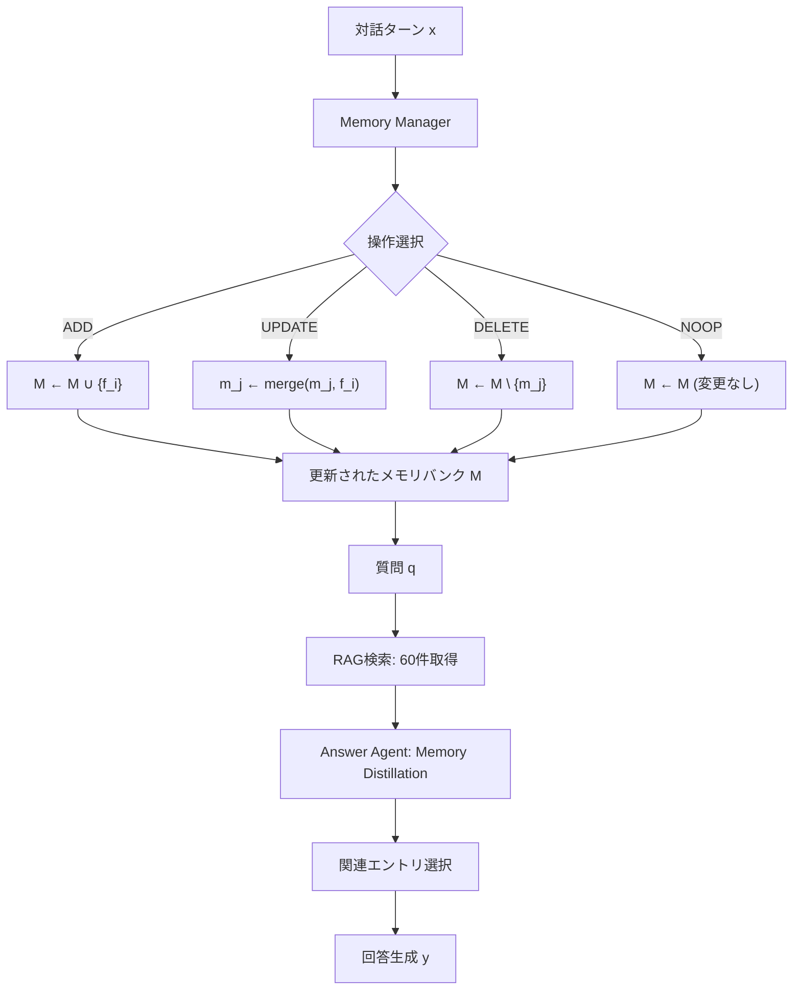

*本記事はAIによって生成されました。内容の正確性には配慮していますが、最新情報は原論文をご確認ください。*

## 論文概要

本記事は [Memory-R1 (arXiv:2508.19828)](https://arxiv.org/abs/2508.19828) の解説記事です。

Memory-R1は、LLMエージェントが外部メモリを**能動的に管理・活用する能力**を強化学習（RL）によって獲得するためのフレームワークである。LLMは本質的にステートレスであり、コンテキストウィンドウの制約から長期的な対話や複数セッションにまたがるタスクで情報を保持することが困難という根本的な課題がある。Memory-R1はこの問題に対し、ADD・UPDATE・DELETE・NOOPの4つの構造化されたメモリ操作を、GRPO（Group Relative Policy Optimization）によるRL訓練でLLM本体に学習させるアプローチを提案している。

著者らは、わずか152件のQAペアでの訓練にもかかわらず、LoCoMoベンチマークにおいてF1スコアで48%、BLEU-1で69%の相対的改善を達成したと報告している（論文Table 1より）。

## 関連Zenn記事

本記事は以下のZenn記事の1次情報解説です。

- [MemCtrlに学ぶ会話メモリRL制御でLLMエージェントのトークンコストを70%削減する](https://zenn.dev/0h_n0/articles/a88984a9983db1)

## 情報源

- **原論文**: [Memory-R1: Enhancing Large Language Model Agents to Manage and Utilize Memories via Reinforcement Learning](https://arxiv.org/abs/2508.19828)
- **著者**: Sikuan Yan, Xiufeng Yang, Zuchao Huang, Ercong Nie, Zifeng Ding, Zonggen Li, Xiaowen Ma, Jinhe Bi, Kristian Kersting, Jeff Z. Pan, Hinrich Schütze, Volker Tresp, Yunpu Ma
- **公開日**: 2025年8月（v5: 2026年1月14日改訂）
- **分類**: cs.CL, cs.MA
- **コード**: [GitHub](https://github.com/syr-cn/Memory-R1)（MITライセンス）

## 背景と動機

LLMは推論時にコンテキストウィンドウ内の情報のみを参照できるため、長期的な対話や複数セッションにわたるタスクにおいて、過去のやりとりを「記憶」する仕組みが必要になる。従来のアプローチでは、RAG（Retrieval-Augmented Generation）や外部メモリストアを用いてこの問題に対処してきたが、これらの手法には以下の課題があった。

第一に、従来のメモリ管理はヒューリスティックベースであり、「何を保存し、何を更新し、何を忘れるか」の判断に学習信号が伴わない。例えばMem0のような既存ツールは、バニラLLMに操作を選択させるが、その判断の正しさに対するフィードバックループが存在しない。第二に、RAGベースの検索は無差別に情報を取得するため、ノイズの多いコンテキストがモデルの推論精度を低下させる。第三に、これらの手法はメモリサイズの増大に伴いトークンコストが線形に増加し、長期運用でのスケーラビリティに問題がある。

Memory-R1はこれらの課題に対し、「メモリ操作そのものをLLMのRL訓練対象とする」という原理的に新しいアプローチを提案した。

## 主要な貢献

Memory-R1の主要な貢献は以下の3点にまとめられる。

1. **RLベースのメモリ管理フレームワーク**: ADD/UPDATE/DELETE/NOOPの4操作をLLM本体がGRPO/PPOで学習する初のフレームワークを提案。Memory ManagerとAnswer Agentの2エージェント構成により、メモリの書き込みと読み出しを分離して最適化する設計を採用した。

2. **最小限の訓練データでの高い汎化性能**: わずか152件のQAペアでの訓練で、LoCoMo・MSC・LongMemEvalの3ベンチマークにおいて既存手法を上回る性能を達成。さらに3Bから14Bまでの複数のモデルスケールで一貫した改善を示した。

3. **Answer Agent側のMemory Distillation**: RAGで取得した最大60件のメモリ候補から関連性の高いエントリのみを蒸留するメカニズムを導入。これにより、ノイズの多い検索結果をフィルタリングし、推論精度を向上させた。

## 技術的詳細

### アーキテクチャ

Memory-R1は**Memory Manager**と**Answer Agent**の2つの専門化されたエージェントで構成される。



**Memory Manager**は各対話ターンの後にメモリバンクを更新する。形式的には、ポリシー $\pi_\theta$ が現在の入力 $x$ と既存メモリ $M_{\text{old}}$ を条件として、操作 $o$ と更新内容 $m'$ を出力する。

$$
(o, m') \sim \pi_\theta(\cdot \mid x, M_{\text{old}})
$$

ここで $o \in \{\text{ADD}, \text{UPDATE}, \text{DELETE}, \text{NOOP}\}$ である。各操作の意味は以下の通りである。

- **ADD**: 新しい情報 $f_i$ をメモリに追加する。$M \leftarrow M \cup \{f_i\}$
- **UPDATE**: 既存エントリ $m_j$ を新情報 $f_i$ と統合する。$m_j \leftarrow \text{merge}(m_j, f_i)$
- **DELETE**: 矛盾する情報や古いエントリを削除する。$M \leftarrow M \setminus \{m_j\}$
- **NOOP**: メモリを変更しない。$M \leftarrow M$

**Answer Agent**は質問 $q$ に対し、まずRAGによりメモリバンクから最大60件の候補を検索し、Memory Distillationポリシーで関連エントリのみを選別した上で回答を生成する。

$$
y \sim \pi_{\text{ans}}(\cdot \mid q, M_{\text{ret}})
$$

### GRPOによる報酬設計

Memory-R1の訓練にはGRPO（Group Relative Policy Optimization）が用いられる。GRPOはPPOと異なり価値関数を必要とせず、グループ内の相対的な報酬によりアドバンテージを推定する。

具体的には、ある問題に対して $G$ 個の応答をサンプリングし、それぞれの報酬 $r_i$ からグループ相対アドバンテージを計算する。

$$
A_i = \frac{r_i - \text{mean}(\mathbf{r})}{\text{std}(\mathbf{r})}
$$

ここで $\mathbf{r} = \{r_1, r_2, \ldots, r_G\}$ はグループ内の報酬ベクトルである。さらに、ポリシーの過度な変化を防ぐためKLダイバージェンス正則化が加えられる。

$$
\mathcal{L} = \mathbb{E}\left[A_i \cdot \log \frac{\pi_\theta}{\pi_{\text{old}}}\right] - \beta \cdot D_{\text{KL}}[\pi_\theta \| \pi_{\text{ref}}]
$$

報酬関数は**成果ベース（outcome-driven）**の設計を採用しており、Memory ManagerとAnswer Agentの両方で、最終的な回答の正確性を報酬信号として使用する。

$$
R_{\text{answer}} = \text{EM}(y_{\text{pred}}, y_{\text{gold}})
$$

ここで $\text{EM}$ はExact Match（完全一致）を表す。この設計の重要な点は、メモリ操作の「良し悪し」を中間ステップではなく最終的なタスク性能で評価することであり、これによりメモリ管理戦略が下流タスクの成功に直接最適化される。

### 訓練の2段階分離

Memory ManagerとAnswer Agentは**別々に訓練**される。Memory Manager訓練時にはAnswer Agentを凍結し、逆もまた同様である。著者らはこの分離戦略について、スパース報酬下での学習の安定性を確保するために必要であると説明している。一方で、この分離がジョイント最適化を制約する可能性も認識しており、エンドツーエンドのマルチエージェントRLを今後の課題として挙げている。

## 実装のポイント

Memory-R1の実装に関して、著者らが報告している主要なポイントを整理する。

**訓練設定**: 4台のNVIDIA H100 GPU（各80GB）で訓練を実施。14Bモデルの場合は8台に拡張される。バッチサイズは128（GPUあたりマイクロバッチ2）、Actor学習率は $1 \times 10^{-6}$、Critic学習率は $1 \times 10^{-5}$ である（論文のTraining Detailsセクションより）。

**トークン長制限**: プロンプト最大4096トークン、応答最大2048トークンに設定されている。訓練時のデコーディング温度は $\tau = 1.0$（探索促進）、推論時は $\tau = 0$（貪欲デコーディング）である。

**データ効率**: LoCoMoデータセットの訓練セットはわずか152件のQAペア（検証81件、テスト1,307件）であり、この少量データで十分な性能改善を達成している点が注目に値する。

**Memory Distillation**: Answer Agentは検索された60件の候補メモリから関連性の高いエントリのみを選別する。この蒸留プロセスにより、論文Table 4によればF1スコアが40.95から45.02へと約10%改善されている。

**モデル対応**: LLaMA-3.1-8B、Qwen-2.5-7Bの他、3Bから14Bまでのスケールで一貫した効果が確認されている。コードはMITライセンスで公開されており、HuggingFace上にQwen2.5-7BおよびLlama-3.1-8Bのファインチューニング済み重みが公開されている。

## Production Deployment Guide

Memory-R1を本番環境に展開する際の設計指針と構成例を、論文の実験設定および公開リポジトリの情報に基づいて整理する。なお、以下の構成はMemory-R1の要件に基づく推定であり、実際の運用にあたっては個別の負荷テストとチューニングが必要である。

### 推奨AWSインフラ構成

Memory-R1の推論パイプラインは、Memory ManagerとAnswer Agentの2つのLLM推論エンドポイント、外部メモリバンク、およびRAG検索基盤の4コンポーネントで構成される。

| コンポーネント | AWSサービス | インスタンスタイプ | 用途 |
|---|---|---|---|
| Memory Manager推論 | Amazon SageMaker / ECS | ml.g5.2xlarge (1x A10G 24GB) | 7Bモデル推論。各対話ターン後にメモリ操作を決定 |
| Answer Agent推論 | Amazon SageMaker / ECS | ml.g5.2xlarge (1x A10G 24GB) | 7Bモデル推論。Memory Distillation + 回答生成 |
| メモリバンクストレージ | Amazon DynamoDB | オンデマンドキャパシティ | セッション別メモリエントリの永続化。ADD/UPDATE/DELETE操作のバックエンド |
| RAGベクトル検索 | Amazon OpenSearch Serverless | ベクトルエンジン構成 | メモリエントリの埋め込みインデックス。Answer Agentの60件候補検索 |
| キューイング | Amazon SQS | 標準キュー | Memory Manager → メモリバンク更新の非同期処理 |
| API Gateway | Amazon API Gateway + ALB | - | クライアント接続、レート制限、認証 |
| 監視 | Amazon CloudWatch | - | レイテンシ、メモリバンクサイズ、トークン使用量のメトリクス |

**注意**: 上記のインスタンスタイプは7Bモデルの推論を想定している。14Bモデルの場合はml.g5.4xlarge以上が必要になる。また、バッチ推論の場合はml.g5.12xlargeでスループットを優先する構成も考えられる。

### Terraformによるインフラ定義

以下は、メモリバンクストレージとRAG検索基盤の基本構成をTerraformで定義する例である。

```hcl
# Memory-R1 メモリバンク用 DynamoDB テーブル
resource "aws_dynamodb_table" "memory_bank" {
  name         = "memory-r1-memory-bank"
  billing_mode = "PAY_PER_REQUEST"
  hash_key     = "session_id"
  range_key    = "memory_id"

  attribute {
    name = "session_id"
    type = "S"
  }

  attribute {
    name = "memory_id"
    type = "S"
  }

  attribute {
    name = "updated_at"
    type = "N"
  }

  # セッション内のメモリを更新日時でソート可能にする
  local_secondary_index {
    name               = "updated-at-index"
    range_key          = "updated_at"
    projection_type    = "ALL"
  }

  # TTLでセッション期限切れメモリを自動削除
  ttl {
    attribute_name = "expires_at"
    enabled        = true
  }

  point_in_time_recovery {
    enabled = true
  }

  tags = {
    Service     = "memory-r1"
    Environment = "production"
  }
}

# SageMaker推論エンドポイント構成（Memory Manager）
resource "aws_sagemaker_endpoint_configuration" "memory_manager" {
  name = "memory-r1-manager-config"

  production_variants {
    variant_name           = "primary"
    model_name             = aws_sagemaker_model.memory_manager.name
    instance_type          = "ml.g5.2xlarge"
    initial_instance_count = 2
    # AutoScaling は別途 Application Auto Scaling で設定
  }
}

# SageMaker推論エンドポイント構成（Answer Agent）
resource "aws_sagemaker_endpoint_configuration" "answer_agent" {
  name = "memory-r1-answer-config"

  production_variants {
    variant_name           = "primary"
    model_name             = aws_sagemaker_model.answer_agent.name
    instance_type          = "ml.g5.2xlarge"
    initial_instance_count = 2
  }
}

# CloudWatch アラーム: メモリバンクサイズ監視
resource "aws_cloudwatch_metric_alarm" "memory_bank_size" {
  alarm_name          = "memory-r1-bank-size-high"
  comparison_operator = "GreaterThanThreshold"
  evaluation_periods  = 3
  metric_name         = "ItemCount"
  namespace           = "AWS/DynamoDB"
  period              = 300
  statistic           = "Average"
  threshold           = 100000
  alarm_description   = "メモリバンクのエントリ数が閾値を超過"

  dimensions = {
    TableName = aws_dynamodb_table.memory_bank.name
  }

  alarm_actions = [aws_sns_topic.alerts.arn]
}
```

### 監視設計

Memory-R1の運用で特に重要な監視メトリクスを以下に示す。

**メモリバンク関連メトリクス**:

| メトリクス | 閾値目安 | アラート条件 | 根拠 |
|---|---|---|---|
| セッション当たりメモリエントリ数 | 論文実験では数十〜数百件 | 1,000件超過 | メモリ肥大化はUPDATE/DELETE学習が不十分な兆候 |
| ADD/UPDATE/DELETE/NOOP操作比率 | 論文のケーススタディに基づく目安 | NOOPが90%超過 | Memory Managerが有効に機能していない可能性 |
| Memory Distillation後の選択率 | 60件中から選別 | 選択率5%未満 or 80%超過 | 検索品質またはDistillationの調整が必要 |

**推論パフォーマンスメトリクス**:

| メトリクス | 閾値目安 | アラート条件 |
|---|---|---|
| Memory Managerレイテンシ (p99) | 対話ターン間で許容可能な範囲 | 5秒超過 |
| Answer Agentレイテンシ (p99) | ユーザ体感に影響 | 10秒超過 |
| 1リクエスト当たりトークン消費量 | 論文結果から推定 | ベースラインの2倍超過 |

**CloudWatch Dashboardの構成例**:

```json
{
  "widgets": [
    {
      "type": "metric",
      "properties": {
        "title": "Memory Operations Distribution",
        "metrics": [
          ["MemoryR1", "AddCount", "Service", "MemoryManager"],
          ["MemoryR1", "UpdateCount", "Service", "MemoryManager"],
          ["MemoryR1", "DeleteCount", "Service", "MemoryManager"],
          ["MemoryR1", "NoopCount", "Service", "MemoryManager"]
        ],
        "period": 300,
        "stat": "Sum",
        "view": "timeSeries"
      }
    },
    {
      "type": "metric",
      "properties": {
        "title": "Memory Bank Size per Session",
        "metrics": [
          ["MemoryR1", "MemoryEntryCount", "Service", "MemoryBank"]
        ],
        "period": 60,
        "stat": "Average"
      }
    },
    {
      "type": "metric",
      "properties": {
        "title": "Inference Latency (p99)",
        "metrics": [
          ["MemoryR1", "Latency", "Agent", "MemoryManager", {"stat": "p99"}],
          ["MemoryR1", "Latency", "Agent", "AnswerAgent", {"stat": "p99"}]
        ],
        "period": 60
      }
    }
  ]
}
```

### デプロイチェックリスト

本番環境への展開前に確認すべき項目を以下に示す。

**モデル準備**:

- [ ] HuggingFaceからファインチューニング済み重みをダウンロード（Qwen2.5-7B or LLaMA-3.1-8B）
- [ ] Memory Manager用モデルとAnswer Agent用モデルをそれぞれSageMakerモデルアーティファクトに変換
- [ ] 推論コンテナイメージのビルドとECRへのプッシュ
- [ ] デコーディング温度 $\tau = 0$（貪欲デコーディング）の設定確認

**メモリバンク**:

- [ ] DynamoDBテーブルのスキーマ定義（session_id, memory_id, content, operation_history, updated_at, expires_at）
- [ ] TTL設定によるセッション期限切れメモリの自動クリーンアップ
- [ ] Point-in-Time Recovery有効化
- [ ] バックアップ戦略の策定

**RAG検索基盤**:

- [ ] 埋め込みモデルの選定とデプロイ（例: Sentence-BERT系）
- [ ] OpenSearch Serverlessのベクトルインデックス作成
- [ ] 検索候補数の上限設定（論文では60件）
- [ ] インデックス更新パイプライン（ADD/UPDATE/DELETE操作と同期）

**セキュリティ**:

- [ ] メモリバンクの暗号化（DynamoDB暗号化 at rest）
- [ ] VPCエンドポイント経由でのSageMaker/DynamoDB/OpenSearchアクセス
- [ ] IAMロールの最小権限設定
- [ ] PII検出とマスキングの仕組み（メモリに個人情報が保存される可能性への対処）

**負荷テスト**:

- [ ] 同時セッション数の目標値設定とスケーリングポリシーの検証
- [ ] メモリバンクサイズ増大時のRAG検索レイテンシの確認
- [ ] Memory Manager → メモリバンク更新 → RAGインデックス更新の遅延伝播の影響測定

## 実験結果

著者らが報告しているLoCoMoベンチマークでの主要な実験結果を以下にまとめる。

### メイン結果（論文Table 1より）

LLaMA-3.1-8Bをバックボーンとした場合のMemory-R1-GRPOと既存手法の比較を示す。

| 手法 | F1 | BLEU-1 | LLM-as-Judge |
|---|---|---|---|
| Mem0（ベースライン） | 30.41 | 22.22 | 45.68 |
| Memory-R1-PPO | 41.05 | 32.91 | 57.54 |
| Memory-R1-GRPO | **45.02** | **37.51** | **62.74** |

GRPOはPPOに対してもF1で約4ポイントの改善を示しており、価値関数を使わないグループ相対アドバンテージの推定がメモリ管理タスクに適していることが示唆される。Mem0ベースラインとの比較では、F1で48%、BLEU-1で69%、LLM-as-Judgeで37%の相対的改善を達成している。

Qwen-2.5-7Bバックボーンでも同様の傾向が確認されており、F1は43.14（Mem0の30.61から41%改善）、LLM-as-Judgeは61.51（Mem0の53.30から15%改善）と報告されている。

### Ablation（論文Table 2, Table 4より）

**Memory Managerの効果**（LLaMA-3.1-8B、Table 2より）:

| 構成 | F1 | BLEU-1 | LLM-as-Judge |
|---|---|---|---|
| ベースLLaMA（メモリなし） | 26.73 | 20.54 | 47.82 |
| +PPO訓練 | 32.55 | 24.60 | 59.37 |
| +GRPO訓練 | 33.05 | 24.91 | 59.91 |

**Memory Distillationの効果**（Table 4より）:

| 構成 | F1 | BLEU-1 | LLM-as-Judge |
|---|---|---|---|
| Distillationなし（60件全使用） | 40.95 | 34.37 | 60.14 |
| Distillationあり | **45.02** | **37.51** | **62.74** |

Memory Distillationにより、F1が約10%ポイント改善されている。これは、RAGの検索結果をそのまま入力するよりも、Answer Agentが関連エントリを選別する方が推論精度に寄与することを示している。

### Answer Agentのスケーリング効果

論文によれば、Answer AgentのF1改善幅はMemory Managerの品質に依存する。弱いMemory Manager使用時は+10.10ポイントの改善であったのに対し、GPT-4o-miniをMemory Managerとして使用した場合は+19.72ポイントの改善が得られたと報告されている。これは、メモリバンクの品質が下流の回答生成に直接影響することを示す重要な知見である。

## 実運用への応用

Memory-R1の知見を実運用のLLMエージェントに応用する際の主要な示唆を整理する。

**トークンコスト削減**: Memory-R1のUPDATE/DELETE操作によるメモリ圧縮は、長期対話エージェントのトークンコスト削減に直結する。論文のケーススタディでは、複数の犬の養子縁組情報を1つのUPDATE操作で統合する「統合的更新」の創発が観察されており、これは人間の記憶における「要約的記憶」に類似した効率的な情報圧縮と言える。

**少量データでの適応**: 152件のQAペアという少量の訓練データで有意な改善が得られた点は、特定ドメインへのメモリ管理の適応コストが低い可能性を示唆している。カスタマーサポートや医療対話など、ドメイン固有のメモリ管理が必要なシナリオにおいて、少量のアノテーションデータで効果的なメモリ戦略を学習できる可能性がある。

**矛盾情報の処理**: 論文のケーススタディでは、表面上矛盾するように見える情報（例: 「亀アレルギーがある」と「亀が好き」）をDELETEではなくUPDATEで感情的コンテキストを保持する行動が観察されている。これは、単純なルールベースの重複排除では捉えられない、文脈依存的なメモリ管理の必要性を示唆している。

ただし、著者ら自身が認めている通り、現時点の評価は対話中心のデータセットに限定されている。マルチモーダルデータや、対話以外のタスク（コード生成、長文要約など）への汎化性能は未検証であり、これらのドメインへの適用には追加の検証が必要である。

## 関連研究

Memory-R1と同時期に発表されたメモリ管理RLフレームワークとの比較を整理する。

**MemCtrl** ([arXiv:2601.20831](https://arxiv.org/abs/2601.20831)) は、MLLMをembodiedエージェントの能動的メモリコントローラとして使用するフレームワークである。学習可能なメモリヘッド$\mu$によるゲーティング機構を特徴とし、対話テキストではなく視覚的観察のメモリ管理を対象としている点でMemory-R1とは異なる。

**MemAgent** ([arXiv:2507.02259](https://arxiv.org/abs/2507.02259)) は、ByteDanceと清華大学の共同研究であり、固定長のメモリパネルを用いた「セグメント読み込み+メモリ更新」のワークフローを提案している。8Kコンテキストでの訓練から3.5Mトークンのタスクに汎化できる点が特徴であるが、メモリ操作はoverwrite戦略に限定されており、Memory-R1の4操作の柔軟性とは対照的である。

**Mem-$\alpha$** ([arXiv:2509.25911](https://arxiv.org/abs/2509.25911)) は、core・episodic・semanticの3層メモリアーキテクチャを持ち、30Kトークンの訓練から400Kトークン（13倍）に汎化する能力を示している。Memory-R1がflat structureのメモリバンクを使用するのに対し、Mem-$\alpha$は構造化されたメモリ階層を採用している点が主な違いである。

## まとめと今後の展望

Memory-R1は、LLMエージェントのメモリ管理をRLの訓練対象とすることで、ヒューリスティックベースの既存手法を大幅に上回る性能を示した。特に、成果ベースの報酬設計（Exact Match）とGRPOの組み合わせが、152件という少量の訓練データにおいても効果的なメモリ管理戦略の獲得を可能にしている点は注目に値する。

今後の課題として、著者らはMemory ManagerとAnswer Agentのエンドツーエンド共同訓練、マルチモーダルデータへの拡張、および対話以外のタスクへの汎化を挙げている。また、現在の2段階分離訓練を超えた、マルチエージェントRLによる統合的な最適化も有望な研究方向として示されている。メモリ管理RLの分野は2025年後半から急速に発展しており、Memory-R1はその重要な基盤研究として位置づけられる。

## 参考文献

1. Yan, S. et al. "Memory-R1: Enhancing Large Language Model Agents to Manage and Utilize Memories via Reinforcement Learning." arXiv:2508.19828 (2025). [https://arxiv.org/abs/2508.19828](https://arxiv.org/abs/2508.19828)
2. Dorbala, V. S. & Manocha, D. "MemCtrl: Using MLLMs as Active Memory Controllers on Embodied Agents." arXiv:2601.20831 (2026). [https://arxiv.org/abs/2601.20831](https://arxiv.org/abs/2601.20831)
3. BytedTsinghua-SIA. "MemAgent: Reshaping Long-Context LLM with Multi-Conv RL-based Memory Agent." arXiv:2507.02259 (2025). [https://arxiv.org/abs/2507.02259](https://arxiv.org/abs/2507.02259)
4. Wang, Y. et al. "Mem-alpha: Learning Memory Construction via Reinforcement Learning." arXiv:2509.25911 (2025). [https://arxiv.org/abs/2509.25911](https://arxiv.org/abs/2509.25911)
5. Shinn, N. et al. "GRPO: Group Relative Policy Optimization." DeepSeek-Math Technical Report (2024).
6. Memory-R1 GitHub Repository. [https://github.com/syr-cn/Memory-R1](https://github.com/syr-cn/Memory-R1) (MIT License)
7. HuggingFace Model Weights. [https://huggingface.co/papers/2508.19828](https://huggingface.co/papers/2508.19828)
