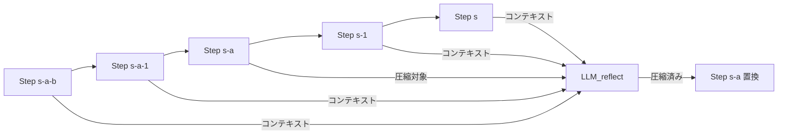

## 論文概要（Abstract）

本記事は [AgentDiet (arXiv:2509.23586)](https://arxiv.org/abs/2509.23586) の解説記事です。

AgentDietは、LLMベースのマルチターンエージェントシステムにおいて、実行時のトラジェクトリ（軌跡）に蓄積する無駄な情報を自動的に除去する手法である。著者らは、エージェントの軌跡には「不要情報（useless）」「冗長情報（redundant）」「期限切れ情報（expired）」の3種類の無駄が広く存在することを発見した。安価なLLMをリフレクションモジュールとして用い、スライディングウィンドウ方式で各ステップを圧縮することで、入力トークンを39.9-59.7%削減し、総計算コストを21.1-35.9%削減しつつ、タスク完了率を維持または改善したと報告されている。本論文はFSE 2026（ACM International Conference on the Foundations of Software Engineering）に採択されている。

この記事は [Zenn記事: MemCtrlに学ぶ会話メモリRL制御でLLMエージェントのトークンコストを70%削減する](https://zenn.dev/0h_n0/articles/a88984a9983db1) の深掘りです。Zenn記事ではRL報酬設計によるトークン効率化を扱っていますが、本記事では推論時の軌跡圧縮という補完的なアプローチを解説します。

## 情報源

- **arXiv ID**: 2509.23586
- **URL**: [https://arxiv.org/abs/2509.23586](https://arxiv.org/abs/2509.23586)
- **著者**: Yuan-An Xiao, Pengfei Gao, Chao Peng, Yingfei Xiong（北京大学, ByteDance, Tencent）
- **発表**: 2025年9月投稿、2026年3月改訂、FSE 2026採択（2026年7月7日発表予定、カナダ・モントリオール）
- **分野**: cs.SE, cs.AI

## 背景と動機（Background & Motivation）

LLMベースのエージェントシステムは、ソフトウェアエンジニアリングタスクにおいて目覚ましい成果を上げている。SWE-benchのようなベンチマークでは、エージェントがGitHubのIssueを自動修正するタスクに取り組み、数十ステップにわたるツール呼び出しと推論を繰り返す。しかし、この反復的な実行プロセスには根本的な効率問題がある。各ステップでエージェントに入力される「トラジェクトリ」（過去の全アクションとツール応答の履歴）は、ステップが進むにつれて累積的に増大する。

著者らの分析によれば、この蓄積された軌跡には大量の無駄が含まれている。例えば、ファイル検索の結果として返されたキャッシュファイルの内容（タスクに無関係）、同じファイルの編集内容がツール応答で重複表示される冗長情報、初期ステップで取得した検索結果がその後のコード変更で意味を失う期限切れ情報などである。これらの無駄は入力トークン数を不必要に増大させ、API呼び出しコストの増加だけでなく、LLMのコンテキストウィンドウを圧迫してタスク遂行能力の低下にもつながる。既存のプロダクションシステム（Cursor、Claude Code、Trae Agent等）もコンテキスト圧縮機能を備えているが、それらはコンテキストウィンドウが一杯になった場合のフォールバックとして受動的に適用されるにとどまっていた。AgentDietは、この問題に対して体系的かつ能動的なアプローチを提案する。

## 主要な貢献（Key Contributions）

- **トラジェクトリの無駄の体系的分類**: エージェント軌跡に含まれる無駄を「不要（useless）」「冗長（redundant）」「期限切れ（expired）」の3カテゴリに分類し、これらが広く存在することを実証した
- **推論時トラジェクトリ圧縮手法の提案**: 安価なリフレクションLLM（GPT-4o mini等）とスライディングウィンドウを組み合わせた実用的な圧縮アルゴリズムを設計し、エージェントのアーキテクチャ変更なしに適用可能にした
- **大規模実験による有効性の実証**: SWE-bench VerifiedとMulti-SWE-bench Flashの2ベンチマーク、Claude 4 SonnetとGemini 2.5 Proの2モデルで評価し、入力トークン39.9-59.7%削減と性能維持を確認した

## 技術的詳細（Technical Details）

### 3種類の無駄情報

AgentDietが対処する無駄情報の具体例を示す。

**不要情報（Useless）**: タスクに無関係なツール出力。例えば、リポジトリ構造を調べるために`find`コマンドを実行した際に返される`.pyc`ファイル、`__pycache__`ディレクトリ、`.git`内部ファイルなど。これらはタスク遂行に一切寄与しないが、数百トークンを消費する。

**冗長情報（Redundant）**: 既にコンテキストに存在する情報の重複。ファイル編集ツールが変更前後の全文を返す場合、変更箇所以外は既知の情報であり冗長である。論文中の具体例では、pytest-dev/pytestのIssue修正で、テスト出力1995トークンが259トークンに圧縮された事例が報告されている（Figure 2）。

**期限切れ情報（Expired）**: 初期ステップで取得したが、その後の操作で無効になった情報。例えば、ステップ3で取得したファイル内容がステップ15での編集で変更されている場合、ステップ3の内容は誤った情報源となる。

### リフレクションモジュールのアルゴリズム

AgentDietの中核は、安価なLLMを用いたリフレクションモジュールである。エージェントの実行と並行して、過去のステップを圧縮する。



アルゴリズムを形式的に記述する。エージェントがステップ$s$に到達した時点で、ステップ$s - a$を圧縮対象とする。リフレクションモジュールには、コンテキストとしてステップ$s - a - b$から$s$までの情報を提供する。

$$
\text{Reflect}(s) = \text{LLM}_{\text{reflect}}\left(\text{step}_{s-a}, \; \text{context}_{[s-a-b, s]}\right)
$$

ここで、
- $a$: 遅延パラメータ（デフォルト$a = 2$）。直近のステップを圧縮対象から除外し、まだ参照される可能性のある情報の誤削除を防ぐ
- $b$: コンテキストウィンドウサイズ（デフォルト$b = 1$）。圧縮対象ステップの前後の文脈を提供し、圧縮の質を向上させる
- $\theta$: トークン閾値（デフォルト$\theta = 500$）。この閾値以下のステップは圧縮をスキップし、オーバーヘッドを抑制する

圧縮の適用条件は以下の通りである。

$$
\text{Apply}(s_i) = 
\begin{cases}
\text{Reflect}(s_i) & \text{if } \text{len}(s_i) > \theta \\
s_i & \text{otherwise}
\end{cases}
$$

この設計には3つの重要な工学的判断がある。第一に、リフレクションLLMにはエージェント本体より安価なモデル（GPT-4o mini）を使用する。論文の報告によれば、GPT-4o miniはClaude 4 Sonnetの約12分の1のコストであり、圧縮の品質と費用のバランスが取れている。第二に、スライディングウィンドウにより、リフレクションLLMへの入力サイズを一定に保ち、コスト上限を制御できる。第三に、KVキャッシュとの互換性を考慮し、圧縮済みステップの前方は変更しないため、エージェントLLMのKVキャッシュが無効化されない。

### プロダクションシステムとの違い

既存のコンテキスト管理手法との比較を整理する。

| 手法 | 適用タイミング | 対象 | 圧縮方式 |
|------|--------------|------|---------|
| Cursor | コンテキスト上限到達時 | 全体 | 要約 |
| Claude Code | コンテキスト上限到達時 | 全体 | 圧縮 |
| Trae Agent | 各ツール応答 | 16KB超過分 | 切り捨て |
| LLMLingua-2 | 入力時 | 初期プロンプト | トークン分類器 |
| **AgentDiet** | **各ステップ実行後** | **過去ステップ** | **LLMリフレクション** |

AgentDietの特徴は、コンテキスト上限に達する前から能動的に圧縮を行う点、そして構造化された情報（コード、コマンド出力）の構造を保持しつつ圧縮する点にある。LLMLingua-2のようなトークンレベルの圧縮はコード中のテスト名を断片化してしまう問題があるが、LLMベースのリフレクションは意味を理解した上で情報を取捨選択できる。

## 実装のポイント（Implementation）

AgentDietの実装における重要な設計判断について述べる。

**リフレクションLLMの選択**: 著者らは4種類のLLMを比較している（論文Table 2）。Claude 3.5 Haikuは入力トークンを47.3%まで圧縮するが高コスト、DeepSeek v3は60.6%で安価だが圧縮率が低い。GPT-4o miniは58.6%の圧縮率とコスト効率のバランスで選択された。リフレクションLLMのコストはエージェント全体の5-10%に抑えられている。

**ハイパーパラメータの感度**: 閾値$\theta$は圧縮の精度に直結する。$\theta = 0$（全ステップ圧縮）ではPass%が62%に低下し、$\theta = 2000$（大きなステップのみ）では72.8%のトークンが残留する。$\theta = 500$が最適とされ、58.6%のトークン残留率でPass% 65%を達成した。遅延パラメータ$a$については、$a = 0$（即座圧縮）ではPass%が59%に低下する。これは直近の情報がまだ後続ステップで参照される可能性が高いためである。$a = 2$から$a = 3$の範囲が安定した性能を示す。

**並列実行による遅延緩和**: リフレクションモジュールはエージェントの実行と非同期で動作させることが可能である。ステップ$s$のエージェント処理と、ステップ$s - a$のリフレクションを並列実行することで、追加レイテンシを実質ゼロにできると著者らは提案している。ただし、この場合リフレクションモジュールが参照できるコンテキストが制限される点がトレードオフとなる。

## Production Deployment Guide

AgentDietはエージェントのアーキテクチャに依存しない推論時手法であるため、既存のLLMエージェントシステムに後付けで統合できる。以下では、AWS上にAgentDiet付きのコーディングエージェントをデプロイするパターンを示す。

### AWS実装パターン（コスト最適化重視）

**トラフィック量別の推奨構成**:

| 構成 | 想定規模 | アーキテクチャ | 月額概算 |
|------|---------|--------------|---------|
| Small | ~50タスク/日 | Lambda + Bedrock | $200-500 |
| Medium | ~200タスク/日 | ECS Fargate + Bedrock | $800-2,000 |
| Large | 1000+タスク/日 | EKS + Spot + Bedrock | $5,000-15,000 |

**注意**: 上記コスト試算は2026年6月時点のAWS ap-northeast-1（東京）リージョン料金に基づく概算値です。実際のコストはタスクの複雑さ（ステップ数）、使用するLLMモデル、トラフィックパターンにより変動します。最新料金は[AWS料金計算ツール](https://calculator.aws/)で確認してください。

**Small構成の詳細**:
- Lambda（エージェントオーケストレーション）: 256MB, 15分タイムアウト, ~$30/月
- Bedrock（エージェントLLM）: Claude 3.5 Sonnet, ~$300/月（50タスク x 平均40ステップ x 入力5000トークン/ステップ）
- Bedrock（リフレクションLLM）: Claude 3 Haiku, ~$15/月（圧縮対象ステップのみ、エージェントの5-10%）
- DynamoDB（タスク状態管理）: On-Demand, ~$5/月
- AgentDiet適用により、Bedrockエージェントコストを40-60%削減可能（$300 -> $120-180）

**コスト削減テクニック**:
- AgentDiet自体がコスト削減手法であり、リフレクションLLMのコスト（エージェントの5-10%）で入力トークン40-60%を削減
- Bedrock Batch APIを非同期タスクに使用することで追加50%削減
- Prompt Caching有効化でリフレクション未対象ステップのコスト削減（30-90%）
- Spot Instancesの活用（EKS構成時）で計算リソースコスト最大90%削減

### Terraformインフラコード

**Small構成（Serverless）** の主要リソース:

```hcl
# AgentDiet + Coding Agent - Small構成（抜粋）
# Lambda + Bedrock + DynamoDB

resource "aws_lambda_function" "agent_orchestrator" {
  function_name = "agentdiet-orchestrator"
  runtime       = "python3.13"
  handler       = "handler.lambda_handler"
  role          = aws_iam_role.agent_lambda.arn
  timeout       = 900  # 15分（エージェント実行に十分な時間）
  memory_size   = 256

  filename         = "lambda_package.zip"
  source_code_hash = filebase64sha256("lambda_package.zip")

  environment {
    variables = {
      AGENT_MODEL      = "anthropic.claude-3-5-sonnet-20241022-v2:0"
      REFLECT_MODEL    = "anthropic.claude-3-haiku-20240307-v1:0"
      DYNAMODB_TABLE   = aws_dynamodb_table.task_state.name
      AGENTDIET_DELAY  = "2"     # a=2
      AGENTDIET_WINDOW = "1"     # b=1
      AGENTDIET_THETA  = "500"   # theta=500
    }
  }

  tracing_config { mode = "Active" }
}

# DynamoDB: On-Demand + TTL（完了タスク7日で自動削除）
resource "aws_dynamodb_table" "task_state" {
  name         = "agentdiet-task-state"
  billing_mode = "PAY_PER_REQUEST"
  hash_key     = "task_id"

  attribute { name = "task_id"; type = "S" }
  server_side_encryption { enabled = true }
  ttl { attribute_name = "expires_at"; enabled = true }
}

# IAMロール: Bedrock InvokeModel + DynamoDB CRUD + CloudWatch Logs（最小権限）
```

**Large構成（Container）** のポイント:

```hcl
# EKS + Karpenter Spot優先オートスケーリング（抜粋）

module "eks" {
  source          = "terraform-aws-modules/eks/aws"
  version         = "~> 20.35"
  cluster_name    = "agentdiet-cluster"
  cluster_version = "1.32"
}

# Karpenter NodePool: Spot優先、m7i/m6i、アイドル60秒で回収
# Secrets Manager: エージェント/リフレクションモデル設定
# AWS Budgets: 月額$15,000上限、80%到達でアラート
```

### 運用・監視設定

**CloudWatch Logs Insights: トークン使用量監視クエリ**:

```
# 1時間あたりのトークン使用量（AgentDiet適用前後の比較）
fields @timestamp, task_id, original_tokens, reduced_tokens, reduction_rate
| filter @message like /agentdiet_reflect/
| stats avg(reduction_rate) as avg_reduction,
        sum(original_tokens) as total_original,
        sum(reduced_tokens) as total_reduced
  by bin(1h) as hour
| sort hour desc
```

**CloudWatch アラーム + X-Ray + Cost Explorer（Python）**:

```python
import boto3
from datetime import date, timedelta

cloudwatch = boto3.client("cloudwatch", region_name="ap-northeast-1")

def create_token_usage_alarm() -> None:
    """Bedrockトークン使用量のスパイク検知アラームを作成する。

    AgentDietが正常動作していればトークン使用量はベースラインの
    40-60%に抑制される。急増はリフレクションモジュールの障害を示唆。
    """
    cloudwatch.put_metric_alarm(
        AlarmName="agentdiet-token-spike",
        MetricName="InputTokenCount",
        Namespace="AgentDiet/Metrics",
        Statistic="Sum",
        Period=3600,
        EvaluationPeriods=2,
        Threshold=500000,
        ComparisonOperator="GreaterThanThreshold",
        AlarmActions=["arn:aws:sns:ap-northeast-1:ACCOUNT:agentdiet-alerts"],
    )

def daily_cost_report() -> dict:
    """日次コストレポートを取得し、閾値超過時にSNS通知する。"""
    ce = boto3.client("ce", region_name="us-east-1")
    today = date.today()
    response = ce.get_cost_and_usage(
        TimePeriod={"Start": str(today - timedelta(days=1)), "End": str(today)},
        Granularity="DAILY",
        Metrics=["UnblendedCost"],
        GroupBy=[{"Type": "DIMENSION", "Key": "SERVICE"}],
        Filter={"Tags": {"Key": "Project", "Values": ["agentdiet"]}},
    )
    costs = {
        g["Keys"][0]: float(g["Metrics"]["UnblendedCost"]["Amount"])
        for g in response["ResultsByTime"][0]["Groups"]
    }
    total = sum(costs.values())
    if total > 500:  # $500/日超過でSNSアラート
        boto3.client("sns", region_name="ap-northeast-1").publish(
            TopicArn="arn:aws:sns:ap-northeast-1:ACCOUNT:agentdiet-alerts",
            Subject=f"AgentDiet Daily Cost Alert: ${total:.2f}",
            Message=f"${total:.2f}/day\n" + "\n".join(f"  {k}: ${v:.2f}" for k, v in costs.items()),
        )
    return costs
```

### コスト最適化チェックリスト

**アーキテクチャ選択**:
- [ ] トラフィック量に応じた構成を選択（~50タスク/日: Serverless、~200: Hybrid、1000+: Container）
- [ ] リフレクションLLMにエージェントLLMより安価なモデルを使用

**リソース最適化**:
- [ ] EC2/EKS: Spot Instances優先（最大90%削減）
- [ ] Reserved Instances: 1年コミットで安定ワークロード対応
- [ ] Savings Plans: Compute Savings Plansでクロスリージョン対応
- [ ] Lambda: メモリサイズを256MB-512MBで最適化（タスク特性に応じて調整）
- [ ] EKS: Karpenterでアイドル時ノード自動回収（consolidateAfter: 60s）

**LLMコスト削減（AgentDiet固有）**:
- [ ] AgentDiet有効化（入力トークン40-60%削減）
- [ ] リフレクションLLMコストがエージェントの10%以下であることを確認
- [ ] Bedrock Batch APIを非リアルタイムタスクに使用（50%削減）
- [ ] Prompt Caching有効化（リフレクション未対象ステップで30-90%削減）
- [ ] 閾値$\theta$をタスク特性に応じて調整（デフォルト500）

**監視・アラート**:
- [ ] AWS Budgets設定（月額上限）
- [ ] CloudWatchアラーム: トークン使用量スパイク検知
- [ ] CloudWatchアラーム: Lambda実行時間異常検知
- [ ] Cost Anomaly Detection有効化
- [ ] 日次コストレポート自動送信

**リソース管理**:
- [ ] DynamoDB TTLで完了タスクの自動削除
- [ ] CloudWatch Logsの保持期間設定（30日）
- [ ] S3ライフサイクルポリシー（トラジェクトリログのアーカイブ）
- [ ] 開発環境の夜間・休日自動停止
- [ ] タグ戦略（Project, Environment, Cost-Center）

## 実験結果（Results）

著者らは、SWE-bench Verified（200インスタンス、Python）とMulti-SWE-bench Flash（300インスタンス、7言語）の2ベンチマークで評価を実施している。

**SWE-bench Verified（論文Table 4より）**:

| メトリクス | Claude 4 Sonnet (通常) | Claude 4 Sonnet (AgentDiet) | Gemini 2.5 Pro (通常) | Gemini 2.5 Pro (AgentDiet) |
|-----------|----------------------|---------------------------|---------------------|--------------------------|
| 入力トークン比 | 1.000 | 0.601 | 1.000 | 0.591 |
| コスト比 | 1.000 | 0.714 | 1.000 | 0.623 |
| Pass% | 64.5% | 66.5% | 50.5% | 52.0% |
| 平均ステップ数 | 39.62 | 39.95 | 37.98 | 37.44 |

**Multi-SWE-bench Flash（論文Table 4より）**:

| メトリクス | Claude 4 Sonnet (通常) | Claude 4 Sonnet (AgentDiet) | Gemini 2.5 Pro (通常) | Gemini 2.5 Pro (AgentDiet) |
|-----------|----------------------|---------------------------|---------------------|--------------------------|
| 入力トークン比 | 1.000 | 0.596 | 1.000 | 0.403 |
| コスト比 | 1.000 | 0.676 | 1.000 | 0.559 |
| Pass% | 40.0% | 39.0% | 21.7% | 22.7% |

注目すべき点として、AgentDietはトークンを削減するだけでなく、複数のケースでPass%がわずかに向上している。著者らはこれについて、無駄な情報の除去によりLLMが関連情報に集中できるようになった可能性を示唆している。Gemini 2.5 ProのMulti-SWE-bench Flashでは入力トークンが60%近く削減（0.403）されており、長いトラジェクトリほど圧縮効果が大きいことが示唆される。リフレクションモジュール自体のコストオーバーヘッドは、SWE-bench VerifiedでClaude使用時に7.4%、Gemini使用時に11.8%と報告されている。

## 実運用への応用（Practical Applications）

AgentDietの実運用における適用可能性を、Zenn記事で扱われているメモリ制御の文脈と対比して考察する。

**訓練時 vs. 推論時のアプローチの補完性**: Zenn記事で解説されているRL報酬によるトークン効率化は訓練時の手法であり、モデル自体が簡潔な推論を学習する。一方、AgentDietは推論時の手法であり、既存のモデルをそのまま使用してトラジェクトリを事後圧縮する。両者は排他的ではなく、組み合わせることでさらなるコスト削減が期待できる。例えば、RL訓練で簡潔な推論を生成するモデルに対してAgentDietを適用すれば、ツール応答の冗長性（モデル側では制御できない）も削減できる。

**プロダクション適用の容易さ**: AgentDietはモデルの再訓練を必要としないため、既存のエージェントシステムに即座に統合できる。リフレクションLLMとして安価なモデルを使用し、エージェントのオーケストレーション層にミドルウェアとして挿入するだけでよい。ただし、著者らの実験はソフトウェアエンジニアリングタスク（SWE-bench）に限定されており、Webブラウジング、モバイル操作、科学的推論など他のドメインでの有効性は未検証である点に注意が必要である。

**スケーリング特性**: 長いトラジェクトリほど圧縮効果が大きい（Gemini 2.5 ProのMulti-SWE-bench Flashで平均57ステップ、60%削減）。複雑なタスクでステップ数が増えるほどコスト削減の恩恵が拡大する特性は、プロダクション環境で特に有用である。

## 関連研究（Related Work）

- **LLMLingua-2** (Jiang et al., 2024): トークンレベルの分類器で不要トークンを除去する手法。初期プロンプトの圧縮には有効だが、コード構造を破壊する問題がある。AgentDietはLLMベースの意味理解による圧縮でこの問題を回避している
- **RECOMP** (Xu et al., 2023): RAGシステムの検索結果を圧縮する手法。AgentDietと同じくLLMベースの圧縮だが、対象がRAGの検索文書であり、マルチターンエージェントの軌跡は扱っていない
- **Selective Context** (Li et al., 2023): 自己情報量に基づく不要コンテキストの除去。静的な入力に対する手法であり、動的に変化するエージェント軌跡への適用は考慮されていない
- **WebAgent-R1** (2025): WebArenaでのRL訓練によるエージェント効率化。Zenn記事のテーマと近い訓練時アプローチであり、AgentDietの推論時アプローチとは補完的な関係にある

## まとめと今後の展望

AgentDietは、LLMエージェントのトラジェクトリに蓄積する3種類の無駄（不要・冗長・期限切れ）を、安価なリフレクションLLMで自動除去する推論時手法である。SWE-bench VerifiedとMulti-SWE-bench Flashにおいて、入力トークン39.9-59.7%の削減を達成しつつ、タスク完了率を維持している。

今後の展望として、著者らはリフレクションモジュールの並列実行によるレイテンシ解消、タスク特性に応じたハイパーパラメータの自動調整、およびカスタムモデルによるリフレクションコストの更なる削減を挙げている。また、ソフトウェアエンジニアリング以外のドメイン（Webナビゲーション、科学的推論等）での検証が今後の重要な課題である。

## 参考文献

- **arXiv**: [https://arxiv.org/abs/2509.23586](https://arxiv.org/abs/2509.23586)
- **FSE 2026 Conference**: [https://conf.researchr.org/details/fse-2026/fse-2026-research-papers/137/Reducing-Cost-of-LLM-Agents-with-Trajectory-Reduction](https://conf.researchr.org/details/fse-2026/fse-2026-research-papers/137/Reducing-Cost-of-LLM-Agents-with-Trajectory-Reduction)
- **Related Zenn article**: [https://zenn.dev/0h_n0/articles/a88984a9983db1](https://zenn.dev/0h_n0/articles/a88984a9983db1)

---

*本記事はAIによって生成されました。論文の内容は著者らの報告に基づいており、本記事の筆者が独自に実験・検証を行ったものではありません。*
