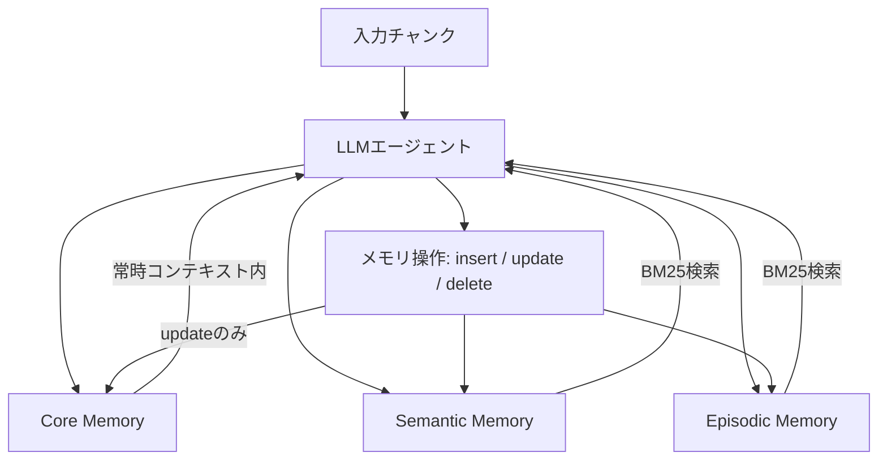

## 論文概要（Abstract）

本記事は [Mem-α (arXiv:2509.25911)](https://arxiv.org/abs/2509.25911) の解説記事です。

Mem-αは、LLMエージェントの外部メモリ構築方針を強化学習（RL）で最適化するフレームワークである。従来手法は事前定義ルールでメモリ更新を行っていたが、「何を保存するか」「どう構造化するか」の判断がタスクに適応できない問題があった。Mem-αは下流QA精度を報酬としてGRPO（Group Relative Policy Optimization）でメモリ操作方針を学習し、core・episodic・semanticの3層メモリ上で効果的なメモリ構築を実現する。著者らの報告によると、30Kトークン以下で訓練したエージェントが400Kトークン超（訓練長の13倍以上）に汎化する。

この記事は [Zenn記事: MemCtrlに学ぶ会話メモリRL制御でLLMエージェントのトークンコストを70%削減する](https://zenn.dev/0h_n0/articles/a88984a9983db1) の深掘りです。

## 情報源

- **arXiv ID**: 2509.25911
- **URL**: [https://arxiv.org/abs/2509.25911](https://arxiv.org/abs/2509.25911)
- **著者**: Yu Wang, Ryuichi Takanobu, Zhiqi Liang, et al.
- **発表年**: 2025
- **分野**: cs.AI, cs.LG, cs.MA

## 背景と動機（Background & Motivation）

LLMエージェントのコンテキスト窓には物理的な上限がある。長期対話や複数セッションにまたがるタスクでは過去の情報が失われるため、MemGPTやMemoryOS、Mem0などの外部メモリシステムが提案されてきた。これらはOS的なメモリ階層を導入し、エージェントが関数呼び出しでメモリを操作する設計を採る。

しかし従来手法には根本的な課題がある。メモリ更新ルール（何を保存し、何を削除するか）が事前定義のヒューリスティクスに依存しており、タスク特性に適応できない。著者らは、LLMが「何を」「どの形式で」「いつ」格納すべきかを自律判断する能力が不足していると指摘している。

Mem-αはメモリ構築を逐次的意思決定問題として定式化し、RLで最適化する。報酬が下流QA精度と直結しているため、メモリ操作が情報検索の成功に直接寄与するよう学習される。

## 主要な貢献（Key Contributions）

- **RLによるメモリ構築の最適化**: メモリ操作（insert/update/delete）を行動空間として定式化し、GRPOで方策を学習する枠組みを提案した。事前定義ルールに依存しない、データ駆動型のメモリ管理を実現している
- **多面的報酬関数の設計**: QA正答率（$r_1$）、ツール呼び出し形式の正しさ（$r_2$）、メモリ圧縮効率（$r_3$）、メモリ内容の意味的妥当性（$r_4$）の4成分からなる報酬関数を設計し、メモリの「質」と「効率」を同時に最適化する
- **長系列への汎化能力**: 30Kトークン以下の訓練データのみで、400Kトークン超の系列に対して性能を維持する汎化能力を実証した（論文Table 3より）。これはメモリ構築方針がトークン長に依存しない抽象的な戦略として学習されていることを示唆する

## 技術的詳細（Technical Details）

### メモリアーキテクチャ

Mem-αは、MemGPTの設計を基盤とした3層メモリアーキテクチャを採用している。



- **Core Memory**: 永続的な512トークンのサマリで、常にコンテキスト窓内に配置される。ユーザプロファイルなど高優先度情報を保持し、操作はupdateのみ
- **Semantic Memory**: 構造化された事実記述（例：「ユーザAはPythonを好む」）を格納。各エントリは独立して検索・更新・削除可能で、BM25検索で取得する
- **Episodic Memory**: 時系列順のイベント記録。タイムスタンプ付きで対話の流れや文脈依存情報を保持する

### RLによるメモリ操作の最適化

メモリ構築を逐次的意思決定として定式化する。入力テキストをチャンク単位で処理し、各ステップでエージェントはメモリ操作（insert/update/delete）を関数呼び出しとして生成する。

報酬関数は以下の4成分の線形結合で定義される（論文Section 3.2より）:

$$
r_t = r_1 + r_{2,t} + \beta r_3 + \gamma r_{4,t}
$$

ここで、

- $r_1$: 構築されたメモリを用いた下流QAの正答率。全チャンク処理後に一括で評価される
- $r_{2,t}$: ステップ$t$における関数呼び出しの形式的正しさ（成功=1、失敗=0）
- $r_3$: メモリ圧縮率。$r_3 = 1 - \frac{\text{memory\_length}}{\text{chunk\_length}}$ で定義され、冗長なメモリ格納にペナルティを課す
- $r_{4,t}$: ステップ$t$のメモリ操作内容の意味的妥当性。LMジャッジが評価する
- $\beta = 0.05$, $\gamma = 0.1$: ハイパーパラメータ（論文の実験設定より）

最適化にはGRPOを使用する。GRPOはPPOと異なりcritic（価値関数）を不要とし、同一プロンプトからの複数ロールアウト間の相対報酬でアドバンテージを推定する。構造化出力の最適化でも計算コストを抑制できる。

### 訓練データの設計

著者らは562インスタンスからなる訓練データを構築している。Accurate Retrieval（SQuAD、HotpotQA等）、Test-Time Learning（NLU、TREC-C等）、Long-Range Understanding（BookSum）の3カテゴリで構成され、各インスタンスはマルチターン対話形式のテキストチャンクとQA評価セットのペアである。

## 実装のポイント（Implementation）

著者らが報告している実装上の注意点を以下にまとめる。

**バックボーンモデルの選定**: 著者らはQwen3-4Bを選好している。4Bモデルの方が8Bよりも指示追従能力が高く、メモリ操作の関数呼び出し成功率が優れていたとされる。

**メモリ検索方式**: 現在の実装ではBM25検索を採用しベクトル検索は使用していない。著者ら自身が実環境ではChromaDB/Faiss等との統合が必要と述べている。

**報酬バランス**: アブレーション実験（論文Table 4）で$\gamma=0$にすると平均0.642から0.543へ低下する。ドメイン適応時は報酬重みの慎重な調整が求められる。

**計算コスト**: 32台のH100 GPU、3日間の訓練。学習率$1 \times 10^{-6}$、バッチサイズ32。

## Production Deployment Guide

### AWS実装パターン（コスト最適化重視）

Mem-αのメモリ管理パイプラインをAWS上で実装する場合の構成を示す。以下のコスト試算は2026年6月時点のap-northeast-1料金に基づく概算値であり、トラフィックパターンやデータ量により変動する。最新料金は [AWS Pricing Calculator](https://calculator.aws/) で確認されたい。

| 項目 | Small (~100 req/日) | Medium (~1000 req/日) | Large (10000+ req/日) |
|------|-------------------|---------------------|---------------------|
| 構成 | Lambda + Bedrock + OpenSearch Serverless | ECS Fargate + Bedrock + OpenSearch | EKS + Spot + OpenSearch + SageMaker |
| LLM推論 | Bedrock (Claude Haiku) | Bedrock (Claude Sonnet) | SageMaker Endpoint (Qwen3-4B) |
| ベクトルDB | OpenSearch Serverless | OpenSearch 2xlarge | OpenSearch 3ノードクラスタ |
| メモリストア | DynamoDB On-Demand | DynamoDB Provisioned | DynamoDB + ElastiCache |
| 月額概算 | $80-200 | $400-900 | $2,500-6,000 |

**コスト削減テクニック**:
- Bedrock Batch APIでメモリ圧縮処理を50%削減
- Prompt Cachingでcore memory参照コストを30-90%削減
- SageMaker Spot Instancesで推論コストを最大90%削減（バッチ処理限定）
- Reserved Instances/Savings Plansの1年コミットで最大72%削減

### Terraformインフラコード

#### Small構成（Serverless）

```hcl
# Mem-α Small構成: Lambda + Bedrock + OpenSearch Serverless
# 月額概算: $80-200 (2026年6月 ap-northeast-1基準)

terraform {
  required_version = ">= 1.9"
  required_providers {
    aws = { source = "hashicorp/aws", version = "~> 5.80" }
  }
}

provider "aws" { region = "ap-northeast-1" }

# --- IAM: 最小権限 ---
resource "aws_iam_role" "mem_alpha_lambda" {
  name = "mem-alpha-lambda-role"
  assume_role_policy = jsonencode({
    Version = "2012-10-17"
    Statement = [{
      Action = "sts:AssumeRole", Effect = "Allow"
      Principal = { Service = "lambda.amazonaws.com" }
    }]
  })
}

resource "aws_iam_role_policy" "lambda_policy" {
  name = "mem-alpha-lambda-policy"
  role = aws_iam_role.mem_alpha_lambda.id
  policy = jsonencode({
    Version = "2012-10-17"
    Statement = [
      { Effect = "Allow", Action = ["bedrock:InvokeModel"]
        Resource = "arn:aws:bedrock:ap-northeast-1::foundation-model/anthropic.claude-3-5-haiku-*" },
      { Effect = "Allow"
        Action = ["dynamodb:GetItem","dynamodb:PutItem","dynamodb:UpdateItem","dynamodb:DeleteItem","dynamodb:Query"]
        Resource = aws_dynamodb_table.memory_store.arn },
      { Effect = "Allow", Action = ["aoss:APIAccessAll"], Resource = "*" },
      { Effect = "Allow", Action = ["logs:CreateLogGroup","logs:CreateLogStream","logs:PutLogEvents"]
        Resource = "arn:aws:logs:*:*:*" }
    ]
  })
}

# --- DynamoDB: メモリ永続化 (On-Demand) ---
resource "aws_dynamodb_table" "memory_store" {
  name         = "mem-alpha-memory"
  billing_mode = "PAY_PER_REQUEST"
  hash_key     = "agent_id"
  range_key    = "memory_key"
  attribute { name = "agent_id", type = "S" }
  attribute { name = "memory_key", type = "S" }
  server_side_encryption { enabled = true }
  point_in_time_recovery { enabled = true }
  tags = { Project = "mem-alpha", Env = "production" }
}

# --- Lambda: メモリ操作エンジン ---
resource "aws_lambda_function" "memory_engine" {
  function_name    = "mem-alpha-engine"
  role             = aws_iam_role.mem_alpha_lambda.arn
  handler          = "handler.lambda_handler"
  runtime          = "python3.12"
  timeout          = 120
  memory_size      = 512
  filename         = "lambda_package.zip"
  source_code_hash = filebase64sha256("lambda_package.zip")
  environment {
    variables = {
      MEMORY_TABLE     = aws_dynamodb_table.memory_store.name
      BEDROCK_MODEL_ID = "anthropic.claude-3-5-haiku-20250929-v1:0"
      CORE_MEMORY_SIZE = "512"
    }
  }
  tracing_config { mode = "Active" }
}

# --- CloudWatch: コスト監視 ---
resource "aws_cloudwatch_metric_alarm" "bedrock_cost_spike" {
  alarm_name          = "mem-alpha-bedrock-token-spike"
  comparison_operator = "GreaterThanThreshold"
  evaluation_periods  = 1
  metric_name         = "InputTokenCount"
  namespace           = "AWS/Bedrock"
  period              = 3600
  statistic           = "Sum"
  threshold           = 100000
  alarm_actions       = []
  tags = { Project = "mem-alpha" }
}
```

#### Large構成（Container）

```hcl
# Mem-α Large構成: EKS + Karpenter + Spot
# 月額概算: $2,500-6,000 (2026年6月 ap-northeast-1基準)

module "eks" {
  source  = "terraform-aws-modules/eks/aws"
  version = "~> 20.31"
  cluster_name    = "mem-alpha-prod"
  cluster_version = "1.31"
  vpc_id     = module.vpc.vpc_id
  subnet_ids = module.vpc.private_subnets
  cluster_endpoint_public_access  = false
  cluster_endpoint_private_access = true
  cluster_addons = {
    coredns = { most_recent = true }, kube-proxy = { most_recent = true }
    vpc-cni = { most_recent = true }
  }
}

# Karpenter: Spot優先自動スケーリング
resource "kubectl_manifest" "karpenter_nodepool" {
  yaml_body = <<-YAML
    apiVersion: karpenter.sh/v1
    kind: NodePool
    metadata: { name: mem-alpha-pool }
    spec:
      template:
        spec:
          requirements:
            - key: karpenter.sh/capacity-type
              operator: In
              values: ["spot", "on-demand"]
            - key: node.kubernetes.io/instance-type
              operator: In
              values: ["m6i.xlarge","m6i.2xlarge","m7i.xlarge","m7i.2xlarge"]
          nodeClassRef: { group: karpenter.k8s.aws, kind: EC2NodeClass, name: default }
      limits: { cpu: "64", memory: "256Gi" }
      disruption: { consolidationPolicy: WhenEmptyOrUnderutilized, consolidateAfter: 30s }
  YAML
}

# AWS Budgets: 予算アラート
resource "aws_budgets_budget" "mem_alpha_monthly" {
  name = "mem-alpha-monthly"
  budget_type = "COST", limit_amount = "5000", limit_unit = "USD", time_unit = "MONTHLY"
  notification {
    comparison_operator = "GREATER_THAN", threshold = 80, threshold_type = "PERCENTAGE"
    notification_type = "FORECASTED", subscriber_email_addresses = ["ops@example.com"]
  }
}
```

### 運用・監視設定

#### CloudWatch Logs Insights クエリ

```
# メモリ操作のレイテンシ分析（P95/P99）
fields @timestamp, memory_operation, duration_ms
| filter memory_operation in ["insert", "update", "delete"]
| stats percentile(duration_ms, 95) as p95, percentile(duration_ms, 99) as p99
  by memory_operation

# Bedrockトークン使用量の異常検知（1時間単位）
fields @timestamp, input_tokens, output_tokens
| stats sum(input_tokens) as total_input, sum(output_tokens) as total_output by bin(1h)
| filter total_input > 100000
```

#### CloudWatchアラーム・X-Rayトレーシング

```python
import boto3
from aws_xray_sdk.core import xray_recorder, patch_all

patch_all()  # boto3自動計装

cloudwatch = boto3.client("cloudwatch", region_name="ap-northeast-1")

# Lambda実行時間の異常検知アラーム
cloudwatch.put_metric_alarm(
    AlarmName="mem-alpha-lambda-duration-high",
    MetricName="Duration", Namespace="AWS/Lambda",
    Dimensions=[{"Name": "FunctionName", "Value": "mem-alpha-engine"}],
    Statistic="p95", Period=300, EvaluationPeriods=3,
    Threshold=90000,  # 90秒超でアラート
    ComparisonOperator="GreaterThanThreshold",
    AlarmActions=["arn:aws:sns:ap-northeast-1:ACCOUNT:ops-alerts"],
)

@xray_recorder.capture("memory_operation")
def process_memory_operation(agent_id: str, operation: str, content: str) -> dict:
    """メモリ操作を実行しX-Rayでトレース"""
    subsegment = xray_recorder.current_subsegment()
    subsegment.put_annotation("agent_id", agent_id)
    subsegment.put_annotation("operation", operation)
    subsegment.put_metadata("content_length", len(content))
    return {"status": "ok"}
```

#### Cost Explorer日次レポート

Cost Explorer APIで`Project=mem-alpha`タグのサービス別日次コストを集計し、$100/日超過時にSNS通知を送信する構成を推奨する。`ce.get_cost_and_usage()`でUnblendedCostを取得し、閾値判定後`sns.publish()`で通知する。

### コスト最適化チェックリスト

**アーキテクチャ選択**: トラフィック100 req/日以下はServerless、1000超はHybrid（ECS Fargate）、10000超はContainer（EKS + Spot）を選択。

**リソース最適化**:
- [ ] EC2/EKSノード: Spot Instances優先（最大90%削減）
- [ ] OpenSearch: Reserved Instances 1年コミット（最大37%削減）
- [ ] Savings Plans: Compute Savings Plans検討（最大66%削減）
- [ ] Lambda: Power Tuningでメモリサイズ最適化（512MB推奨）
- [ ] ECS/EKS: Karpenterでアイドル時スケールダウン

**LLMコスト削減**:
- [ ] Bedrock Batch API: メモリ圧縮を非同期バッチ化（50%削減）
- [ ] Prompt Caching: core memory部分のキャッシュ有効化（30-90%削減）
- [ ] モデル使い分け: 単純操作はHaiku、複雑判断はSonnet
- [ ] トークン数制限: core memoryを512トークン以内に制約

**監視・アラート**: AWS Budgets（月額80%/100%通知）、CloudWatch（トークンスパイク検知）、Cost Anomaly Detection、日次Cost Explorerレポート。

**リソース管理**: 未使用OpenSearch削除、Project/Envタグ付与、DynamoDB TTL設定、開発環境夜間停止、S3ログ90日後Glacier移行。

## 実験結果（Results）

### ベンチマーク性能

著者らはMemoryAgentBenchの9データセット・112テストインスタンスで評価を行っている。以下は論文Table 1およびTable 2から抽出した主要結果である。

**検証データセットでの比較（論文Table 1より）**:

| 手法 | AR (検索) | TTL (学習) | LRU (長文理解) | 平均 | メモリサイズ |
|------|----------|-----------|--------------|------|------------|
| Qwen3-4B (ベース) | 0.338 | 0.381 | 0.130 | 0.389 | - |
| RAG-Top2 | 0.574 | 0.609 | - | 0.567 | - |
| GPT-4.1-mini | 0.426 | 0.519 | 0.246 | 0.517 | 10.8K tokens |
| Mem-α-4B | **0.786** | **0.658** | **0.187** | **0.642** | **7.9K tokens** |

Mem-α-4Bは4Bパラメータでありながら、GPT-4.1-miniを平均で上回り、メモリサイズも7.9Kトークンとロングコンテキスト手法（10.8K）よりコンパクトである。テストデータ（論文Table 2）ではSingle-Doc AR 0.740、Multi-Doc AR 0.680、Clinic150 TTL 0.730を達成している。

### 汎化能力とアブレーション

論文Table 3によると、30Kトークン以下で訓練されたMem-α-4Bが400Kトークン超でも性能を維持する。著者らはメモリ構築方針がトークン長に依存しない抽象戦略として学習されている証拠と解釈している。アブレーション（論文Table 4）では$\gamma=0$で平均0.642から0.543へ低下し、メモリ内容の質に対するフィードバックが不可欠であることが示されている。

## 実運用への応用（Practical Applications）

**長期対話エージェント**: カスタマーサポートや個人アシスタントで、core memoryにユーザプロファイル、semantic memoryに製品情報、episodic memoryに問い合わせ履歴を格納するメモリ戦略の学習に適用できる。

**マルチエージェントシステム**: Zenn記事のMemCtrlのようなRL制御メモリ管理と組み合わせ、エージェント間メモリ共有を最適化できる可能性がある。

ただし、著者らが認めている通り、現在はシミュレーション環境（BM25検索）での評価であり、実環境ではベクトルDB統合、レイテンシ、安全性の課題が残る。訓練データは562インスタンス・英語のみで、10エージェント以上のスケーラビリティも未検証である。

## 関連研究（Related Work）

- **MemGPT** (Packer et al., 2023): OS的メモリ階層をLLMに導入した先駆的研究。Mem-αのメモリ構造の基盤であり、事前定義ルールをRLで置き換えた点が差分
- **MemoryOS** (BAI-LAB, 2024): ヒートスコアで動的管理するシステム。EMNLP 2025 Oral採択
- **H-MEM** (2025): 意味的抽象度に基づく多層メモリ。EACL 2026採択
- **A-MEM** (2025): RLでなくエージェント内在能力に依存するメモリ管理

## まとめと今後の展望

Mem-αはメモリ構築をRLで学習する枠組みを確立し、4Bモデルで大規模ベースラインを上回る結果を報告している。30Kトークンから400K超への汎化能力は、メモリ管理が抽象的スキルとして獲得可能であることを示唆する。今後はベクトルDBとの統合、多言語対応、実環境での検証が課題である。Zenn記事のMemCtrlのようなトークンコスト最適化との組み合わせも有望と考えられる。

## 参考文献

- **arXiv**: [https://arxiv.org/abs/2509.25911](https://arxiv.org/abs/2509.25911) — Mem-α: Learning Memory Construction via Reinforcement Learning
- **Related Zenn article**: [https://zenn.dev/0h_n0/articles/a88984a9983db1](https://zenn.dev/0h_n0/articles/a88984a9983db1) — MemCtrlに学ぶ会話メモリRL制御でLLMエージェントのトークンコストを70%削減する
- **MemGPT**: [https://arxiv.org/abs/2310.08560](https://arxiv.org/abs/2310.08560) — MemGPT: Towards LLMs as Operating Systems
- **MemoryOS**: [https://github.com/BAI-LAB/MemoryOS](https://github.com/BAI-LAB/MemoryOS) — EMNLP 2025 Oral
- **MemoryAgentBench**: [https://arxiv.org/abs/2507.05257](https://arxiv.org/abs/2507.05257) — Evaluating Memory in LLM Agents via Incremental Multi-Turn Interactions
- **GRPO**: [https://arxiv.org/abs/2402.03300](https://arxiv.org/abs/2402.03300) — DeepSeekMath: Group Relative Policy Optimization
- **H-MEM**: [https://arxiv.org/abs/2507.22925](https://arxiv.org/abs/2507.22925) — Hierarchical Memory for High-Efficiency Long-Term Reasoning in LLM Agents
