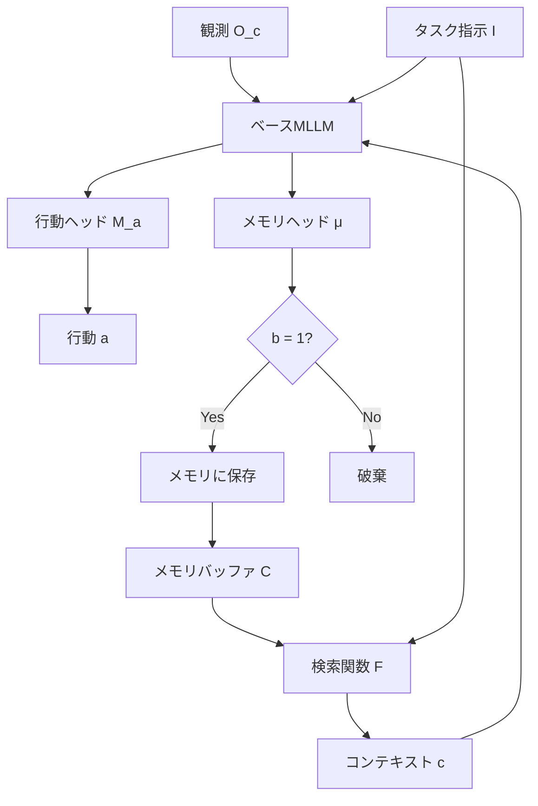

## 論文概要（Abstract）

本記事は [MemCtrl (arXiv:2601.20831)](https://arxiv.org/abs/2601.20831) の解説記事です。

MemCtrlは、マルチモーダル大規模言語モデル（MLLM）にメモリ管理機能を付加するフレームワークである。基盤モデルのコンテキストウィンドウが有限であるという制約に対し、訓練可能なメモリヘッド $\mu$ をゲート機構として導入し、エージェントの探索中にどの観測・リフレクションを保持・更新・破棄するかを動的に判断する。教師あり学習（オフライン）とオンラインRL（REINFORCE）の2方式で $\mu$ を訓練し、EmbodiedBenchベンチマーク上で平均約16%のタスク達成率向上を報告している。

この記事は [Zenn記事: MemCtrlに学ぶ会話メモリRL制御でLLMエージェントのトークンコストを70%削減する](https://zenn.dev/0h_n0/articles/a88984a9983db1) の深掘りです。

## 情報源

- **arXiv ID**: 2601.20831
- **URL**: [https://arxiv.org/abs/2601.20831](https://arxiv.org/abs/2601.20831)
- **著者**: Vishnu Sashank Dorbala, Dinesh Manocha（University of Maryland, College Park）
- **発表年**: 2026
- **分野**: cs.AI, cs.RO（Artificial Intelligence, Robotics）
- **ライセンス**: CC BY 4.0

## 背景と動機（Background & Motivation）

大規模言語モデルをエージェントとして利用する場合、コンテキストウィンドウの制約は避けられない課題である。RAG（Retrieval-Augmented Generation）やMemGPTのような既存手法はメモリを大規模なオフラインストレージとして扱う設計であり、リアルタイムかつ厳格なメモリ・計算資源制約のもとで動作するembodiedエージェントには不向きである。

特にembodied AI領域では、エージェントが探索しながら逐次的に観測を取得し、限られたコンテキスト内で意思決定を行う必要がある。全ての観測を蓄積するとノイズが増大しタスク性能が劣化する一方、過度な削減は将来必要な情報の喪失につながる。

著者らはこの問題を「オンラインメモリ管理」として定式化し、保持判断自体を学習可能にするアプローチを提案した。既存のMLLMを改変せずにメモリコントローラをプラグインとして付加する設計により、様々なベースモデルへの適用を可能にしている。

## 主要な貢献（Key Contributions）

- **訓練可能なメモリヘッド $\mu$ の導入**: MLLMの埋め込みからバイナリのメモリ保持判定を出力する3層MLPを設計し、メモリ管理を学習可能な意思決定問題として定式化した
- **教師あり学習とRL訓練の2方式の比較検証**: GPT-4oをエキスパートとして用いたオフライン教師あり学習と、タスク完了報酬に基づくオンラインRLの両方式を評価し、タスク特性による使い分けの知見を提供した
- **EmbodiedBenchでの大幅な性能向上**: 2つの低性能MLLMに $\mu$ を付加することで平均16%のタスク達成率向上を達成し、特に長い指示列・複雑な指示に対して20%以上の改善を報告した

## 技術的詳細（Technical Details）

### メモリヘッドの定式化

ベースラインのMLLMは観測 $\mathcal{O}_c$ と指示 $\mathcal{I}$ から行動 $a$ を出力する:

$$
a = \mathcal{M}(\mathcal{O}_c, \mathcal{I})
$$

MemCtrlでは、メモリコンテキスト $c$ を検索関数 $F$ で取得し、メモリヘッド $\mu$ が保持判定 $b$ を出力する:

$$
c = F(\mathcal{C}, \mathcal{I})
$$

$$
a = \mathcal{M}_a(\mathcal{O}_c, \mathcal{I}, c)
$$

$$
b = \mathcal{M}_\mu(\mathcal{O}_c, \mathcal{I}, c)
$$

ここで $b \in \{0, 1\}$ はバイナリ判定であり、メモリ $\mathcal{C}$ は以下のように更新される:

$$
\mathcal{C}' =
\begin{cases}
\mathcal{C} \cup \{(\mathcal{O}_c, a)\} & \text{if } b = 1 \\
\mathcal{C} & \text{otherwise}
\end{cases}
$$

各変数の定義:
- $\mathcal{O}_c$: 現在のステップにおける観測（視覚・テキスト情報）
- $\mathcal{I}$: タスク指示
- $\mathcal{C}$: メモリバッファ（過去の観測-行動ペアの集合）
- $c$: メモリから検索されたコンテキスト
- $b$: メモリ保持判定（1なら保存、0なら破棄）
- $\mathcal{M}_a$: 行動出力ヘッド
- $\mathcal{M}_\mu$: メモリ判定ヘッド（3層Linear MLP）

### 訓練方式1: オフライン教師あり学習

GPT-4oをエキスパートとして、各観測に対する保持/破棄のラベルを収集する。著者らの報告によると、GPT-4oのエキスパートとしての成功率はEB-ALFREDで56.3%、EB-Habitatで59.0%である（論文Section 4より）。損失関数はバイナリ交差エントロピーを用いる:

$$
\mathcal{L}(y, \hat{p}) = y \log(\hat{p}) + (1 - y) \log(1 - \hat{p})
$$

ここで $y$ はエキスパートラベル、$\hat{p}$ はメモリヘッドの出力確率である。最適化にはAdam（学習率 $1 \times 10^{-3}$）を使用する。

### 訓練方式2: オンラインRL（REINFORCE）

タスク完了を報酬とするオンラインRLでは、報酬関数を以下のように定義する:

$$
R(r, a) = r + \mathbf{1}_{a \in \mathcal{A}}
$$

ここで $r \in \{0, 1\}$ はバイナリのタスク完了報酬、$\mathbf{1}_{a \in \mathcal{A}}$ は有効行動に対するボーナスである。この報酬設計により、タスク達成とメモリ管理の両方を同時に最適化する。

### アーキテクチャ概要



メモリヘッド $\mu$ はベースMLLMの埋め込み空間から3層のLinear MLPでバイナリ出力に射影する構造であり、ベースMLLM自体の重みは一切変更しない。この設計により、異なるMLLMへの付け替えが容易となる。

## 実装のポイント（Implementation）

**プラグイン設計の利点**: メモリヘッド $\mu$ はベースMLLMとは独立した軽量モジュール（3層MLP）であるため、既存のMLLMデプロイメントに対して最小限の変更で導入できる。ベースモデルのファインチューニングが不要であり、モデル更新時にもメモリヘッドの再利用が可能である。

**ベースモデル選択**: 論文ではGemma-3-12B-ITとQwen2.5-VL-7B-Insを評価している。ベースラインの性能が低いモデル（Qwen2.5: EB-ALFRED 4.7%）ほど $\mu$ 付加による絶対改善幅が大きい傾向がある（論文Table 1より）。これは、性能が低いモデルほどメモリ管理の不備がボトルネックになっていることを示唆している。

**メモリ効率**: 著者らの報告では、$\mu$(RL)を付加したQwen2.5はEB-ALFREDで39.42%、EB-Habitatで27.56%のメモリ使用率であった（論文Table 3より）。全観測を保持する場合（100%）と比較して、大幅にメモリを削減しながら性能を向上させている。

**訓練コスト**: 教師あり学習方式ではGPT-4oのAPIコスト、オンラインRLではシミュレータ実行時間が主要コストとなる。

## Production Deployment Guide

### AWS実装パターン（コスト最適化重視）

MemCtrlのメモリヘッド $\mu$ はベースMLLMとは独立した3層MLPであるため、推論時のオーバーヘッドは小さい。以下にトラフィック量別のAWS構成を示す。

**コスト試算の注意事項**: 以下は2026年6月時点のAWS ap-northeast-1（東京）リージョン料金に基づく概算値である。実際のコストはトラフィックパターン、リージョン、バースト使用量により変動する。最新料金は[AWS料金計算ツール](https://calculator.aws/)で確認を推奨する。

| 項目 | Small (~100 req/日) | Medium (~1,000 req/日) | Large (10,000+ req/日) |
|------|-------------------|----------------------|----------------------|
| 構成 | Lambda + Bedrock + DynamoDB | ECS Fargate + Bedrock + ElastiCache | EKS + Karpenter + Spot + vLLM |
| MLLMホスティング | Bedrock (Claude/Llama) | Bedrock + SageMaker Endpoint | vLLM on GPU Spot (g5.xlarge) |
| メモリヘッド $\mu$ | Lambda内で推論 | Fargate sidecar | 同一Pod内コンテナ |
| メモリストア | DynamoDB On-Demand | ElastiCache (Redis) | Redis on EKS |
| 月額概算 | $50-150 | $400-900 | $2,500-6,000 |

**Small構成の内訳**: Lambda実行 ($5-15) + Bedrock API ($30-80) + DynamoDB ($5-20) + CloudWatch ($5-10) = $50-150/月

**Medium構成の内訳**: Fargate (0.5vCPU/1GB x 2タスク, $60-120) + Bedrock API ($200-500) + ElastiCache (cache.t3.micro, $15-30) + ALB ($20-30) = $400-900/月

**Large構成の内訳**: EKS コントロールプレーン ($75) + GPU Spot Instances (g5.xlarge x 2-4, $800-2,400) + Redis ($50-100) + NAT Gateway ($45) + その他 ($100-200) = $2,500-6,000/月

**コスト削減テクニック**:
- Spot Instancesの活用: g5.xlargeのSpot価格はOn-Demandの60-70%引き（変動あり）
- Bedrock Batch APIの利用: リアルタイム性が不要な場合、50%のコスト削減が可能
- Prompt Cachingの有効化: 同一プレフィックスの繰り返しリクエストで30-90%削減
- メモリヘッド $\mu$ の軽量性: 3層MLPのためCPU推論で十分、GPU不要

### Terraformインフラコード

**Small構成（Serverless）: Lambda + Bedrock + DynamoDB**

```hcl
# --- Small構成: MemCtrl Serverless (月額 $50-150) ---
terraform {
  required_version = ">= 1.9"
  required_providers {
    aws = { source = "hashicorp/aws", version = "~> 5.80" }
  }
}

provider "aws" { region = "ap-northeast-1" }

# DynamoDB: メモリストア (On-Demand, 低トラフィック時に最適)
resource "aws_dynamodb_table" "memory_store" {
  name         = "memctrl-memory-store"
  billing_mode = "PAY_PER_REQUEST"
  hash_key     = "session_id"
  range_key    = "step_id"
  attribute { name = "session_id"; type = "S" }
  attribute { name = "step_id"; type = "N" }
  ttl { attribute_name = "expires_at"; enabled = true }
  server_side_encryption { enabled = true }
}

# Lambda: メモリコントローラ + Bedrock呼び出し
resource "aws_lambda_function" "memctrl_handler" {
  function_name = "memctrl-handler"
  runtime       = "python3.12"
  handler       = "handler.lambda_handler"
  role          = aws_iam_role.lambda_role.arn
  timeout       = 120
  memory_size   = 512 # μ推論はCPUで十分
  filename      = "lambda_package.zip"
  environment {
    variables = {
      MEMORY_TABLE     = aws_dynamodb_table.memory_store.name
      BEDROCK_MODEL    = "anthropic.claude-sonnet-4-20250514"
      MEMORY_HEAD_PATH = "/opt/model/memory_head.pt"
    }
  }
  tracing_config { mode = "Active" }
}
```

**Large構成（Container）: EKS + Karpenter + Spot Instances**

```hcl
# --- Large構成: MemCtrl on EKS (月額 $2,500-6,000) ---
module "eks" {
  source          = "terraform-aws-modules/eks/aws"
  version         = "~> 20.31"
  cluster_name    = "memctrl-cluster"
  cluster_version = "1.31"
  vpc_id          = module.vpc.vpc_id
  subnet_ids      = module.vpc.private_subnets
}

# Karpenter: Spot優先GPU自動スケーリング
resource "kubectl_manifest" "karpenter_nodepool" {
  yaml_body = yamlencode({
    apiVersion = "karpenter.sh/v1"
    kind       = "NodePool"
    metadata   = { name = "memctrl-gpu" }
    spec = {
      template.spec = {
        requirements = [
          { key = "karpenter.sh/capacity-type", operator = "In", values = ["spot", "on-demand"] },
          { key = "node.kubernetes.io/instance-type", operator = "In", values = ["g5.xlarge", "g5.2xlarge"] },
        ]
      }
      limits     = { cpu = "64", memory = "256Gi" }
      disruption = { consolidationPolicy = "WhenEmptyOrUnderutilized", consolidateAfter = "30s" }
    }
  })
}

# AWS Budgets: 月額予算80%到達で通知
resource "aws_budgets_budget" "memctrl_monthly" {
  name         = "memctrl-monthly-budget"
  budget_type  = "COST"
  limit_amount = "6000"
  limit_unit   = "USD"
  time_unit    = "MONTHLY"
  notification {
    comparison_operator        = "GREATER_THAN"
    threshold                  = 80
    threshold_type             = "PERCENTAGE"
    notification_type          = "ACTUAL"
    subscriber_email_addresses = ["alerts@example.com"]
  }
}
```

### 運用・監視設定

**CloudWatch Logs Insights クエリ**

```
# メモリ保持率の時間帯別分析（コスト異常検知）
fields @timestamp, session_id, memory_decision, token_count
| filter memory_decision IN ["retain", "discard"]
| stats count(*) as total,
        sum(case when memory_decision = "retain" then 1 else 0 end) as retained,
        avg(token_count) as avg_tokens
  by bin(1h) as hour
| sort hour desc
```

**CloudWatch アラーム + X-Ray設定（Python boto3）**

```python
import boto3
from aws_xray_sdk.core import xray_recorder, patch_all

patch_all()  # boto3自動計装

cloudwatch = boto3.client("cloudwatch", region_name="ap-northeast-1")

# Bedrock トークン使用量スパイク検知
cloudwatch.put_metric_alarm(
    AlarmName="memctrl-bedrock-token-spike",
    MetricName="InputTokenCount",
    Namespace="AWS/Bedrock",
    Statistic="Sum",
    Period=3600,
    EvaluationPeriods=2,
    Threshold=500000,  # 1時間50万トークン超過で警告
    ComparisonOperator="GreaterThanThreshold",
    AlarmActions=["arn:aws:sns:ap-northeast-1:ACCOUNT:memctrl-alerts"],
)

@xray_recorder.capture("memory_head_inference")
def run_memory_head(observation: dict, context: list[dict]) -> bool:
    """メモリヘッドμの推論をトレーシング"""
    subsegment = xray_recorder.current_subsegment()
    subsegment.put_annotation("session_id", observation["session_id"])
    subsegment.put_metadata("context_size", len(context))
    decision = memory_head.predict(observation, context)
    return decision
```

**Cost Explorer 日次レポート（Python）**

```python
import boto3
from datetime import date, timedelta

ce = boto3.client("ce", region_name="us-east-1")

def get_daily_cost_report() -> dict:
    """Projectタグでフィルタした日次コスト取得"""
    today = date.today()
    response = ce.get_cost_and_usage(
        TimePeriod={"Start": str(today - timedelta(days=1)), "End": str(today)},
        Granularity="DAILY",
        Metrics=["UnblendedCost"],
        Filter={"Tags": {"Key": "Project", "Values": ["memctrl"]}},
        GroupBy=[{"Type": "DIMENSION", "Key": "SERVICE"}],
    )
    return response["ResultsByTime"][0]["Groups"]
```

### コスト最適化チェックリスト

**アーキテクチャ選択**
- [ ] トラフィック量に応じた構成選択（~100 req/日: Serverless, ~1000: Hybrid, 10000+: Container）
- [ ] メモリヘッド $\mu$ はCPU推論で十分か確認（3層MLPのためGPU不要が基本）
- [ ] ベースMLLMのホスティング方式選定（Bedrock API vs セルフホスト）

**リソース最適化**
- [ ] GPU Instances: Spot優先（g5.xlarge Spotで60-70%削減）
- [ ] Reserved Instances: 安定稼働部分は1年コミットで最大72%削減
- [ ] Savings Plans: Compute Savings Plansの検討
- [ ] Lambda: メモリサイズ最適化（Power Tuningで検証）
- [ ] ECS/EKS: Karpenter consolidationPolicy設定でアイドル時スケールダウン
- [ ] NAT Gateway: VPCエンドポイント利用で削減

**LLMコスト削減**
- [ ] Bedrock Batch API: 非リアルタイム処理で50%削減
- [ ] Prompt Caching有効化: 同一セッション内の繰り返しで30-90%削減
- [ ] モデル選択ロジック: 簡易タスクは軽量モデル、複雑タスクのみ大型モデル
- [ ] トークン数制限: メモリヘッド $\mu$ による不要観測の破棄でコンテキスト縮小
- [ ] メモリストアのTTL設定: 不要セッションの自動削除

**監視・アラート**
- [ ] AWS Budgets: 月額予算アラート設定（80%/100%到達時通知）
- [ ] CloudWatch アラーム: Bedrockトークン使用量・Lambda実行時間
- [ ] Cost Anomaly Detection: 異常コスト検知の有効化
- [ ] 日次コストレポート: Cost Explorer APIで自動取得・SNS通知

**リソース管理**
- [ ] 未使用リソース定期削除（未使用EBS, 古いLambdaバージョン）
- [ ] タグ戦略: Project/Env/Ownerタグの徹底
- [ ] DynamoDB TTL: セッション期限切れメモリの自動削除
- [ ] CloudWatch Logs: 保持期間設定（30日/90日）
- [ ] 開発環境: 夜間・休日のGPUインスタンス停止

## 実験結果（Results）

著者らはEmbodiedBenchベンチマークのEB-ALFREDサブセットとEB-Habitatサブセットで評価を行っている。EB-ALFREDはAI2-THORシミュレータ上の家庭内タスク（物体操作中心）、EB-Habitatはnavigationタスクを対象とする。

**主要結果（論文Table 1より）**:

| モデル | EB-ALFRED Avg | EB-Habitat Avg |
|--------|--------------|----------------|
| Gemma-3-12B-IT（ベースライン） | 25.6% | 23.0% |
| + $\mu$ Simple | 28.0% | 31.2% |
| + $\mu$ Offline Supervised | 32.2% | 31.8% |
| + $\mu$ Online RL | 27.8% | 33.8% |
| Qwen2.5-VL-7B-Ins（ベースライン） | 4.7% | 14.3% |
| + $\mu$ Simple | 9.6% | 21.4% |
| + $\mu$ Offline Supervised | 12.2% | 22.8% |
| + $\mu$ Online RL | 14.2% | 22.2% |

Gemma-3ではEB-Habitatにおいて $\mu$(RL)が+10.8ポイントの改善を示す一方、EB-ALFREDでは $\mu$(Supervised)が+6.6ポイントで優位となっている。一方、Qwen2.5ではEB-ALFREDにおいて $\mu$(RL)が+9.5ポイントと大きな改善を見せている。

**長い指示列への効果**: 論文の定性分析によると、Gemma-3の長い指示列に対する達成率は12%から26%（$\mu$(RL)付加時）に向上し、Qwen2.5では2%から24%へと大幅に改善されている。これは、長い指示列ほどメモリの冗長化がボトルネックとなるため、$\mu$ による選択的メモリ管理が有効に機能することを示唆する。

**メモリ効率（論文Table 3より）**: $\mu$(RL)付加時のメモリ使用率はEB-ALFREDで39.42%、EB-Habitatで27.56%であり、全観測保持（Complete: 100%）と比較して60-72%のメモリ削減を達成しながら、性能はCompleteを上回っている（Qwen2.5: EB-ALFRED 14.2% vs 7.8%）。

**無効行動の削減（論文Table 3より）**: $\mu$(RL)付加によりQwen2.5の無効行動数がEB-ALFREDで3.50から2.22に、EB-Habitatで3.0から1.36に減少しており、メモリ管理が意思決定品質にも寄与している。

## 実運用への応用（Practical Applications）

MemCtrlのプラグイン設計は実運用において複数の利点を持つ。メモリヘッド $\mu$ が3層MLPという軽量構造であるため、推論時の追加レイテンシは最小限に抑えられる。また、ベースMLLMの重みを変更しないため、モデルの更新やスケーリングに際して $\mu$ の再訓練のみで対応できる。

**適用可能なユースケース**:
- **ロボティクス**: 長時間ミッションでのメモリ制約下での意思決定（論文の主要対象）
- **対話エージェント**: 長期会話でのコンテキスト圧縮（Zenn記事での応用方向）
- **マルチホップ推論**: 複数ステップの情報を選択的に保持する検索タスク

**導入時の考慮点**:
- 新ドメインへの適用にはそのドメインのタスクデータで $\mu$ の訓練が必要
- 教師あり学習方式ではエキスパートモデルのAPIコストが発生する
- RL方式ではシミュレータのセットアップが前提
- 英語タスクのみの評価であり、多言語環境への汎化は未検証

## 関連研究（Related Work）

- **MemGPT** (Packer et al., 2023): OSの仮想メモリ管理にヒントを得た階層的メモリシステム。メインコンテキストと外部コンテキストの2層構造でメモリを管理するが、メモリ操作はルールベースであり学習による最適化は行わない。MemCtrlは学習ベースのメモリ判定を導入した点で差別化される
- **Memory-R1** (arXiv:2508.19828): PPO/GRPOでメモリ管理を最適化するRLフレームワーク。MemCtrlと類似のアプローチだが、Memory-R1はテキストQAタスク対象、MemCtrlはembodied（マルチモーダル）タスクに特化
- **Mem-$\alpha$** (arXiv:2509.25911): 3層メモリ構造（コア・エピソード・セマンティック）をRLで最適化。30kトークンで訓練して400k以上に汎化する能力を報告しており、MemCtrlの単純なバイナリ判定とは対照的な複雑な構造を採用

## まとめと今後の展望

MemCtrlは、MLLMに訓練可能なメモリヘッド $\mu$ を付加するという単純かつ効果的なアプローチにより、embodiedエージェントのタスク達成率を平均16%向上させた。特に長い指示列や複雑なタスクにおいて20%以上の改善が見られる点は実用上の価値が高い。

著者ら自身が述べている制約として、短いホライズンのタスクでは恩恵が小さいこと、RL訓練がスパース報酬のため非効率になりうること、sim-to-real転移の検証が未着手であることが挙げられる。今後はより複雑なメモリ操作の学習化や実ロボットへの展開が期待される。

## 参考文献

- **arXiv**: [https://arxiv.org/abs/2601.20831](https://arxiv.org/abs/2601.20831)
- **EmbodiedBench**: [https://embodiedbench.github.io/](https://embodiedbench.github.io/)
- **MemGPT**: [https://arxiv.org/abs/2310.08560](https://arxiv.org/abs/2310.08560)
- **Memory-R1**: [https://arxiv.org/abs/2508.19828](https://arxiv.org/abs/2508.19828)
- **Mem-$\alpha$**: [https://arxiv.org/abs/2509.25911](https://arxiv.org/abs/2509.25911)
- **Related Zenn article**: [https://zenn.dev/0h_n0/articles/a88984a9983db1](https://zenn.dev/0h_n0/articles/a88984a9983db1)
