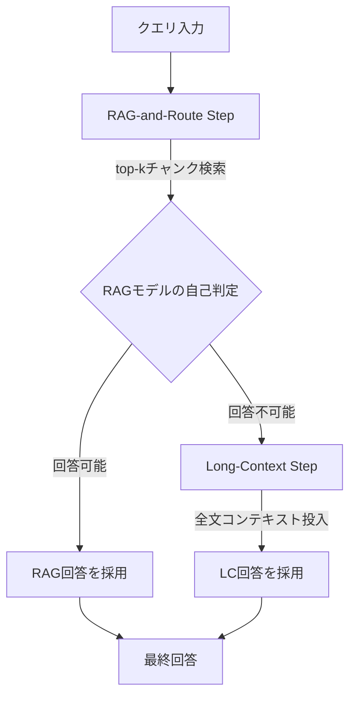

本記事は [https://arxiv.org/abs/2407.16833](https://arxiv.org/abs/2407.16833) の解説記事です。

## 論文概要

Retrieval Augmented Generation（RAG）とLong-Context（LC）LLMは、大量のテキストを処理するための二大アプローチとして知られる。著者らは、9つのデータセット・3つのモデル・2つのリトリーバーを用いた包括的ベンチマークにより、両者の性能差を体系的に分析している。その結果、RAGとLCの予測が63%のクエリで一致し、差異が10ポイント未満のケースが全体の70%を占めることが判明した。この知見に基づき、RAGの自己判定を用いてクエリをルーティングするSELF-ROUTE手法を提案し、LCと同等の性能を維持しながらトークン消費を38-62%削減することに成功している。

この記事は [Zenn記事: Context Engineering実践：1Mトークン時代の長いコンテキスト活用と判断フレームワーク](https://zenn.dev/0h_n0/articles/bc912a47640828) の深掘りです。

## 情報源

| 項目 | 内容 |
|------|------|
| 会議名 | EMNLP 2024 Industry Track |
| 開催年 | 2024年（11月12-16日、マイアミ） |
| arXiv | [2407.16833](https://arxiv.org/abs/2407.16833) |
| 著者 | Zhuowan Li, Cheng Li, Mingyang Zhang, Qiaozhu Mei, Michael Bendersky |
| 所属 | Google Research, University of Michigan |
| タイトル | Retrieval Augmented Generation or Long-Context LLMs? A Comprehensive Study and Hybrid Approach |

## カンファレンス情報

EMNLP（Empirical Methods in Natural Language Processing）は自然言語処理分野のトップカンファレンスの一つであり、ACL（Association for Computational Linguistics）が主催している。2024年はマイアミで開催された。本論文はIndustry Trackに採択されており、学術的貢献に加えて実用性が重視される査読プロセスを経ている。Industry Trackは実システムへの応用可能性や産業界での知見を評価する点が特徴である。

## 背景と動機

大規模言語モデルのコンテキスト長が拡張される中で、長文処理には二つのアプローチが共存している。

**RAG（Retrieval Augmented Generation）**: 関連するチャンクのみをリトリーバーで検索し、短いコンテキストで回答を生成する。入力トークン数を削減できるが、リトリーバーの検索精度に依存する。

**Long-Context（LC）**: 文書全体をコンテキストウィンドウに投入し、モデルが直接回答する。情報損失がないが、トークン消費とレイテンシが増大する。

著者らは、これら二つのアプローチが体系的に比較された研究が不足していることを指摘している。既存の研究はRAGまたはLCの一方に偏っており、両者を統一的なベンチマーク上で同一条件で比較した研究は限られていた。また、「RAGで十分なクエリ」と「LCが必要なクエリ」を自動的に判別できれば、コスト効率と精度を両立できるという仮説のもと、ハイブリッドアプローチの実現可能性を検証している。

## 技術的詳細

### 実験設計

著者らは以下の構成で包括的評価を実施している。

**モデル**:
- Gemini-1.5-Pro（コンテキスト長: 1Mトークン）
- GPT-4O（コンテキスト長: 128Kトークン）
- GPT-3.5-Turbo（コンテキスト長: 16Kトークン）

**リトリーバー**:
- Contriever: 教師なし事前学習ベースの密検索モデル
- Dragon: 指示付き微調整済み密検索モデル

**チャンク設定**: 300ワード、top-k=5（合計約1,500ワード）

**データセット（9種）**: NarrativeQA、Qasper、MultiFieldQA-en、HotpotQA、2WikiMultiHopQA、MuSiQue、QMSum、EN.QA（∞Bench）、EN.MC（∞Bench）

### RAG vs LC: 予測の一致度分析

著者らは各クエリについてRAGとLCの予測を比較し、以下の知見を報告している。

**予測一致率**: 全クエリの63%でRAGとLCの予測が一致する。つまり、過半数のクエリではリトリーバーが十分な情報を提供できている。

**性能差分布**: 70%のクエリでRAGとLCのスコア差が10ポイント未満である。大きな性能差が生じるのは少数のクエリに限定される。

この分析は、すべてのクエリにLCを適用するのは過剰であり、RAGで十分に回答可能なクエリを事前に分離できればコスト削減が可能であることを示唆している。

### RAGが失敗するケース

著者らはRAGがLCに劣後するクエリを分析し、以下の4カテゴリに分類している。

1. **マルチステップ推論**: 複数の文書にまたがる推論が必要で、単一チャンク検索では情報が不足するケース
2. **汎用的クエリ**: 検索キーワードが広範すぎて、リトリーバーが関連チャンクを特定できないケース
3. **複合的クエリ**: 複数の条件を同時に満たすチャンクの検索が困難なケース
4. **暗黙的理解**: 文書全体の文脈やトーンの理解が必要で、局所的なチャンクでは判断できないケース

### SELF-ROUTEアルゴリズム

SELF-ROUTEは上記の知見に基づき、RAGの自己判定を利用してクエリをルーティングする2段階手法である。



#### Step 1: RAG-and-Route（ルーティング判定）

クエリ $q$ と検索されたチャンク集合 $C = \{c_1, c_2, \ldots, c_k\}$ に対して、RAGモデル $M$ は以下の2つの選択肢から応答する。

$$
M(q, C) = \begin{cases}
a & \text{if } M \text{ judges } C \text{ sufficient to answer } q \\
\texttt{unanswerable} & \text{otherwise}
\end{cases}
$$

ここで $a$ はRAGによる回答、$\texttt{unanswerable}$ はRAGでは回答できないという自己判定を表す。モデルのプロンプトには「検索されたチャンクから回答できない場合は"unanswerable"と回答せよ」という指示が含まれる。

#### Step 2: Long-Context（フォールバック）

Step 1で $\texttt{unanswerable}$ と判定されたクエリのみが、全文コンテキスト $D$ を用いたLC推論に回される。

$$
\text{SELF-ROUTE}(q, C, D) = \begin{cases}
M_{\text{RAG}}(q, C) & \text{if } M_{\text{RAG}}(q, C) \neq \texttt{unanswerable} \\
M_{\text{LC}}(q, D) & \text{otherwise}
\end{cases}
$$

この方式の利点は、追加の分類器やルーターモデルを必要とせず、RAGモデル自身の判断を信頼する点にある。

### ルーティング判定の精度

著者らは各モデルのルーティング判定結果を報告している。

| モデル | RAG回答可能と判定 | LC回送 |
|--------|------------------|--------|
| Gemini-1.5-Pro | 76.78% | 23.22% |
| GPT-4O | 57.36% | 42.64% |
| GPT-3.5-Turbo | 61.15% | 38.85% |

Gemini-1.5-Proは最も積極的にRAGで回答する傾向があり、GPT-4Oはより慎重にLC回送を選択する傾向が見られる。この差異はモデルの自己判定能力（calibration）の違いに起因すると著者らは考察している。

## 実装のポイント

SELF-ROUTEを実装する際の技術的な留意事項を以下に示す。

**チャンクサイズ**: 著者らは300ワードのチャンクサイズを使用している。チャンクサイズが小さすぎると文脈が失われ、大きすぎるとノイズが増える。この論文の実験に基づけば、200-400ワード程度が妥当な範囲と考えられる。

**リトリーバーの選択**: ContrieverとDragonでは全体的な傾向に大きな差は見られなかったと著者らは報告している。ただし、ドメイン特化のリトリーバーを用いることでRAGの回答可能率を向上させ、LC回送を減らせる可能性がある。

**"unanswerable"判定の閾値**: SELF-ROUTEでは明示的な閾値は使わず、モデルの自然言語出力に「unanswerable」が含まれるかどうかで判定する。プロンプトエンジニアリングにより判定基準を調整できる。

**プロンプト設計**: RAGステップのプロンプトには「回答できない場合は'unanswerable'と答えよ」という指示を明確に含める必要がある。この指示の表現によって回答可能/不可能の判定分布が変わるため、実運用ではプロンプトの微調整が重要である。

```python
from dataclasses import dataclass
from enum import Enum


class RouteDecision(Enum):
    """ルーティング判定結果"""
    RAG = "rag"
    LONG_CONTEXT = "long_context"


@dataclass
class SelfRouteResult:
    """SELF-ROUTEの実行結果

    Attributes:
        answer: 最終回答
        decision: ルーティング判定結果
        rag_response: RAGステップの生応答
        tokens_used: 使用トークン数
    """
    answer: str
    decision: RouteDecision
    rag_response: str
    tokens_used: int


def self_route(
    query: str,
    chunks: list[str],
    full_document: str,
    rag_model: "LLMClient",
    lc_model: "LLMClient",
    unanswerable_keyword: str = "unanswerable",
) -> SelfRouteResult:
    """SELF-ROUTEアルゴリズムの実装

    Args:
        query: ユーザクエリ
        chunks: リトリーバーが検索したチャンク（top-k）
        full_document: 全文ドキュメント
        rag_model: RAGステップ用LLMクライアント
        lc_model: Long Contextステップ用LLMクライアント
        unanswerable_keyword: 回答不能を示すキーワード

    Returns:
        SelfRouteResult: ルーティング結果と最終回答
    """
    # Step 1: RAG-and-Route
    rag_prompt = (
        "以下の検索結果に基づいて質問に回答してください。\n"
        "検索結果から回答できない場合は 'unanswerable' とだけ回答してください。\n\n"
        f"検索結果:\n{'---'.join(chunks)}\n\n"
        f"質問: {query}"
    )
    rag_response = rag_model.generate(rag_prompt)

    if unanswerable_keyword.lower() not in rag_response.text.lower():
        return SelfRouteResult(
            answer=rag_response.text,
            decision=RouteDecision.RAG,
            rag_response=rag_response.text,
            tokens_used=rag_response.tokens_used,
        )

    # Step 2: Long-Context
    lc_prompt = (
        f"以下のドキュメント全体に基づいて質問に回答してください。\n\n"
        f"ドキュメント:\n{full_document}\n\n"
        f"質問: {query}"
    )
    lc_response = lc_model.generate(lc_prompt)

    return SelfRouteResult(
        answer=lc_response.text,
        decision=RouteDecision.LONG_CONTEXT,
        rag_response=rag_response.text,
        tokens_used=rag_response.tokens_used + lc_response.tokens_used,
    )
```

## Production Deployment Guide

SELF-ROUTEは実装が比較的シンプルであり、既存のRAGパイプラインへの統合が容易である。以下にAWS上でのデプロイ構成を示す。

### AWS実装パターン（コスト最適化重視）

SELF-ROUTEパイプラインのトラフィック量別推奨構成を示す。コスト試算は2026年6月時点のAWS ap-northeast-1（東京）リージョン料金に基づく概算値であり、実際のコストはトラフィックパターン、リージョン、バースト使用量により変動する。最新料金はAWS料金計算ツールで確認を推奨する。

| 構成 | トラフィック | アーキテクチャ | 月額概算 |
|------|-------------|---------------|---------|
| Small | ~100 req/日 | Lambda + Bedrock + OpenSearch Serverless | $80-200 |
| Medium | ~1,000 req/日 | ECS Fargate + Bedrock + OpenSearch | $400-900 |
| Large | 10,000+ req/日 | EKS + Karpenter + Bedrock Batch + OpenSearch | $2,500-6,000 |

**Small構成の内訳**:
- Lambda（RAGルーティング関数）: ~$5/月（100 req/日 x 30秒/req）
- Bedrock Claude Sonnet（RAGステップ）: ~$30/月（1,500トークン/req x 3,000 req/月）
- Bedrock Claude Sonnet（LCステップ、~25%回送）: ~$80/月（50Kトークン/req x 750 req/月）
- OpenSearch Serverless（ベクトル検索）: ~$50/月（0.5 OCU）
- DynamoDB（キャッシュ・ログ）: ~$5/月

**コスト削減テクニック**:
- SELF-ROUTEの最大の利点はLC呼び出し削減そのもの（38-62%トークン削減）
- Bedrock Batch APIで非同期処理可能なクエリを50%削減
- Prompt Caching有効化でシステムプロンプト部分を30-90%削減
- Spot Instances活用（EKS構成時）で最大90%削減
- Reserved Instances購入で最大72%削減

### Terraformインフラコード

#### Small構成（Serverless）: Lambda + Bedrock + OpenSearch Serverless

```hcl
# --- Small構成: SELF-ROUTE Serverless ---
# Lambda(ルーティング) + Bedrock(LLM) + OpenSearch Serverless(ベクトル検索)

terraform {
  required_version = ">= 1.9"
  required_providers {
    aws = {
      source  = "hashicorp/aws"
      version = "~> 5.80"
    }
  }
}

provider "aws" {
  region = "ap-northeast-1"
}

# --- IAMロール（最小権限原則） ---
resource "aws_iam_role" "self_route_lambda" {
  name = "self-route-lambda-role"
  assume_role_policy = jsonencode({
    Version = "2012-10-17"
    Statement = [{
      Action = "sts:AssumeRole"
      Effect = "Allow"
      Principal = { Service = "lambda.amazonaws.com" }
    }]
  })
}

resource "aws_iam_role_policy" "self_route_permissions" {
  name = "self-route-permissions"
  role = aws_iam_role.self_route_lambda.id
  policy = jsonencode({
    Version = "2012-10-17"
    Statement = [
      {
        # Bedrock: RAG/LCステップのモデル呼び出しのみ許可
        Effect   = "Allow"
        Action   = ["bedrock:InvokeModel"]
        Resource = "arn:aws:bedrock:ap-northeast-1::foundation-model/anthropic.claude-*"
      },
      {
        # OpenSearch Serverless: ベクトル検索のみ許可
        Effect   = "Allow"
        Action   = ["aoss:APIAccessAll"]
        Resource = "*"
      },
      {
        # DynamoDB: キャッシュテーブルの読み書きのみ
        Effect   = "Allow"
        Action   = ["dynamodb:GetItem", "dynamodb:PutItem", "dynamodb:Query"]
        Resource = aws_dynamodb_table.route_cache.arn
      },
      {
        # CloudWatch Logs
        Effect   = "Allow"
        Action   = ["logs:CreateLogGroup", "logs:CreateLogStream", "logs:PutLogEvents"]
        Resource = "arn:aws:logs:ap-northeast-1:*:*"
      }
    ]
  })
}

# --- Lambda関数（SELF-ROUTEルーティング） ---
resource "aws_lambda_function" "self_route" {
  function_name = "self-route-handler"
  runtime       = "python3.12"
  handler       = "handler.lambda_handler"
  role          = aws_iam_role.self_route_lambda.arn
  timeout       = 120  # LCステップで長時間かかる場合を考慮
  memory_size   = 512  # チャンク処理に十分なメモリ

  # X-Ray トレーシング有効化
  tracing_config {
    mode = "Active"
  }

  environment {
    variables = {
      ROUTE_CACHE_TABLE   = aws_dynamodb_table.route_cache.name
      OPENSEARCH_ENDPOINT = aws_opensearchserverless_collection.vectors.collection_endpoint
      RAG_MODEL_ID        = "anthropic.claude-sonnet-4-20250514-v1:0"
      LC_MODEL_ID         = "anthropic.claude-sonnet-4-20250514-v1:0"
      CHUNK_SIZE          = "300"
      TOP_K               = "5"
    }
  }

  filename = "lambda_package.zip"
}

# --- DynamoDB（ルーティングキャッシュ、On-Demandでコスト最適化） ---
resource "aws_dynamodb_table" "route_cache" {
  name         = "self-route-cache"
  billing_mode = "PAY_PER_REQUEST"  # On-Demand: 低トラフィック時のコスト最適化
  hash_key     = "query_hash"

  attribute {
    name = "query_hash"
    type = "S"
  }

  ttl {
    attribute_name = "expires_at"
    enabled        = true
  }

  # KMS暗号化
  server_side_encryption {
    enabled = true
  }
}

# --- CloudWatchアラーム（コスト異常検知） ---
resource "aws_cloudwatch_metric_alarm" "lambda_duration" {
  alarm_name          = "self-route-high-duration"
  comparison_operator = "GreaterThanThreshold"
  evaluation_periods  = 3
  metric_name         = "Duration"
  namespace           = "AWS/Lambda"
  period              = 300
  statistic           = "Average"
  threshold           = 60000  # 60秒超過でアラート
  alarm_description   = "SELF-ROUTE Lambda execution time exceeded 60s"

  dimensions = {
    FunctionName = aws_lambda_function.self_route.function_name
  }
}
```

#### Large構成（Container）: EKS + Karpenter + Spot Instances

```hcl
# --- Large構成: SELF-ROUTE Container ---
# EKS + Karpenter(Spot優先) + Bedrock Batch + OpenSearch Managed

module "eks" {
  source  = "terraform-aws-modules/eks/aws"
  version = "~> 20.31"

  cluster_name    = "self-route-cluster"
  cluster_version = "1.31"

  # コントロールプレーンのみ（ノードはKarpenterが管理）
  cluster_endpoint_public_access = false  # セキュリティ: パブリックアクセス無効化

  vpc_id     = module.vpc.vpc_id
  subnet_ids = module.vpc.private_subnets
}

# --- Karpenter Provisioner（Spot優先で最大90%コスト削減） ---
resource "kubectl_manifest" "karpenter_nodepool" {
  yaml_body = <<-YAML
    apiVersion: karpenter.sh/v1
    kind: NodePool
    metadata:
      name: self-route-pool
    spec:
      template:
        spec:
          requirements:
            - key: karpenter.sh/capacity-type
              operator: In
              values: ["spot", "on-demand"]  # Spot優先
            - key: node.kubernetes.io/instance-type
              operator: In
              values: ["m7i.xlarge", "m7i.2xlarge", "m6i.xlarge", "m6i.2xlarge"]
          nodeClassRef:
            group: karpenter.k8s.aws
            kind: EC2NodeClass
            name: default
      limits:
        cpu: "64"        # 最大64 vCPU
        memory: "256Gi"
      disruption:
        consolidationPolicy: WhenEmptyOrUnderutilized
        consolidateAfter: 30s
  YAML
}

# --- AWS Budgets（月額予算アラート） ---
resource "aws_budgets_budget" "self_route" {
  name         = "self-route-monthly"
  budget_type  = "COST"
  limit_amount = "5000"
  limit_unit   = "USD"
  time_unit    = "MONTHLY"

  notification {
    comparison_operator       = "GREATER_THAN"
    threshold                 = 80
    threshold_type            = "PERCENTAGE"
    notification_type         = "ACTUAL"
    subscriber_email_addresses = ["ops-team@example.com"]
  }

  notification {
    comparison_operator       = "GREATER_THAN"
    threshold                 = 100
    threshold_type            = "PERCENTAGE"
    notification_type         = "FORECASTED"
    subscriber_email_addresses = ["ops-team@example.com"]
  }
}

# --- Secrets Manager（Bedrock設定） ---
resource "aws_secretsmanager_secret" "bedrock_config" {
  name       = "self-route/bedrock-config"
  kms_key_id = aws_kms_key.self_route.arn
}
```

### 運用・監視設定

#### CloudWatch Logs Insights クエリ

```
# SELF-ROUTEルーティング比率の監視（1時間ごと）
fields @timestamp, route_decision, tokens_used
| stats count(*) as total,
        count_distinct(case when route_decision = 'rag' then @requestId end) as rag_count,
        count_distinct(case when route_decision = 'long_context' then @requestId end) as lc_count,
        avg(tokens_used) as avg_tokens
| eval rag_ratio = rag_count / total * 100
| eval lc_ratio = lc_count / total * 100

# レイテンシ分析（P95, P99）
fields @timestamp, duration_ms, route_decision
| stats percentile(duration_ms, 95) as p95,
        percentile(duration_ms, 99) as p99,
        avg(duration_ms) as avg_ms
  by route_decision
```

#### CloudWatch アラーム設定（Python）

```python
import boto3


def create_self_route_alarms(function_name: str, sns_topic_arn: str) -> None:
    """SELF-ROUTE用CloudWatchアラームを作成する

    Args:
        function_name: Lambda関数名
        sns_topic_arn: 通知先SNSトピックARN
    """
    cw = boto3.client("cloudwatch", region_name="ap-northeast-1")

    # Bedrockトークン使用量スパイク検知
    cw.put_metric_alarm(
        AlarmName="self-route-token-spike",
        MetricName="InputTokenCount",
        Namespace="AWS/Bedrock",
        Statistic="Sum",
        Period=3600,
        EvaluationPeriods=1,
        Threshold=500000,  # 1時間あたり50万トークン超過
        ComparisonOperator="GreaterThanThreshold",
        AlarmActions=[sns_topic_arn],
        AlarmDescription="Bedrock token usage spike detected in SELF-ROUTE pipeline",
    )

    # LC回送率の異常検知（RAG回答可能率が低下している場合）
    cw.put_metric_alarm(
        AlarmName="self-route-high-lc-ratio",
        MetricName="LCRouteCount",
        Namespace="SelfRoute",
        Statistic="Sum",
        Period=3600,
        EvaluationPeriods=2,
        Threshold=100,
        ComparisonOperator="GreaterThanThreshold",
        AlarmActions=[sns_topic_arn],
        AlarmDescription="LC route ratio abnormally high - check retriever quality",
    )
```

#### X-Ray トレーシング設定（Python）

```python
from aws_xray_sdk.core import xray_recorder, patch_all


# boto3自動計装
patch_all()


@xray_recorder.capture("self_route_handler")
def handle_query(query: str, document_id: str) -> dict:
    """SELF-ROUTEクエリハンドラ（X-Rayトレース付き）

    Args:
        query: ユーザクエリ
        document_id: 対象ドキュメントID

    Returns:
        ルーティング結果と回答を含む辞書
    """
    subsegment = xray_recorder.current_subsegment()
    subsegment.put_annotation("document_id", document_id)
    subsegment.put_annotation("query_length", len(query))

    # RAGステップ
    with xray_recorder.capture("rag_step") as rag_seg:
        chunks = retrieve_chunks(query, document_id, top_k=5)
        rag_response = invoke_rag_model(query, chunks)
        rag_seg.put_metadata("chunk_count", len(chunks))
        rag_seg.put_metadata("rag_tokens", rag_response["tokens_used"])

    # ルーティング判定
    route_decision = "rag" if "unanswerable" not in rag_response["text"].lower() else "long_context"
    subsegment.put_annotation("route_decision", route_decision)

    if route_decision == "long_context":
        with xray_recorder.capture("lc_step") as lc_seg:
            lc_response = invoke_lc_model(query, document_id)
            lc_seg.put_metadata("lc_tokens", lc_response["tokens_used"])
            return {"answer": lc_response["text"], "route": "long_context"}

    return {"answer": rag_response["text"], "route": "rag"}
```

#### Cost Explorer自動レポート（Python）

```python
import boto3
from datetime import datetime, timedelta


def daily_cost_report(sns_topic_arn: str) -> dict:
    """日次コストレポートを取得しSNS通知する

    Args:
        sns_topic_arn: 通知先SNSトピックARN

    Returns:
        コスト情報の辞書
    """
    ce = boto3.client("ce", region_name="us-east-1")
    sns = boto3.client("sns", region_name="ap-northeast-1")

    today = datetime.utcnow().strftime("%Y-%m-%d")
    yesterday = (datetime.utcnow() - timedelta(days=1)).strftime("%Y-%m-%d")

    response = ce.get_cost_and_usage(
        TimePeriod={"Start": yesterday, "End": today},
        Granularity="DAILY",
        Metrics=["UnblendedCost"],
        Filter={
            "Tags": {
                "Key": "Project",
                "Values": ["self-route"],
            }
        },
        GroupBy=[{"Type": "DIMENSION", "Key": "SERVICE"}],
    )

    total_cost = 0.0
    service_costs = {}
    for group in response["ResultsByTime"][0]["Groups"]:
        service = group["Keys"][0]
        cost = float(group["Metrics"]["UnblendedCost"]["Amount"])
        service_costs[service] = cost
        total_cost += cost

    # $100/日超過でアラート
    if total_cost > 100:
        sns.publish(
            TopicArn=sns_topic_arn,
            Subject="[ALERT] SELF-ROUTE daily cost exceeded $100",
            Message=f"Total: ${total_cost:.2f}\n" + "\n".join(
                f"  {svc}: ${c:.2f}" for svc, c in service_costs.items()
            ),
        )

    return {"total": total_cost, "services": service_costs}
```

### コスト最適化チェックリスト

**アーキテクチャ選択**:
- [ ] トラフィック量に応じた構成を選択（~100 req/日: Serverless、~1,000: Hybrid、10,000+: Container）
- [ ] SELF-ROUTEのRAG回答可能率を監視し、LC回送率が高すぎる場合はリトリーバーを改善

**リソース最適化**:
- [ ] EC2/EKSノード: Spot Instances優先（最大90%削減）
- [ ] Reserved Instances: 1年コミットで最大72%削減
- [ ] Savings Plans: Compute Savings Plansで柔軟な割引
- [ ] Lambda: メモリサイズを実測に基づき最適化（Power Tuning）
- [ ] ECS/EKS: アイドル時スケールダウン（Karpenter consolidation）

**LLMコスト削減**:
- [ ] SELF-ROUTEで38-62%のトークン消費削減を確認
- [ ] Bedrock Batch APIを非同期処理に適用（50%削減）
- [ ] Prompt Caching有効化（システムプロンプト部分30-90%削減）
- [ ] モデル選択ロジック: RAGステップにはHaikuクラス、LCステップにはSonnetクラスを使い分け
- [ ] max_tokensを適切に制限（不必要に長い回答を抑制）

**監視・アラート**:
- [ ] AWS Budgets: 月額予算アラート（80%/100%閾値）
- [ ] CloudWatch アラーム: トークン使用量、レイテンシ、エラー率
- [ ] Cost Anomaly Detection: 異常コスト自動検知
- [ ] 日次コストレポート: Cost Explorer API + SNS通知
- [ ] ルーティング比率ダッシュボード: RAG/LC比率の推移監視

**リソース管理**:
- [ ] 未使用OpenSearchインデックスの定期削除
- [ ] タグ戦略: Project/Environment/Ownerタグ必須
- [ ] DynamoDBキャッシュ: TTLによるライフサイクル管理
- [ ] 開発環境: 夜間・休日の自動停止（EventBridge Scheduler）
- [ ] ログ保持期間: CloudWatch Logsの保持期間を30日に制限

## 実験結果

### モデル別性能比較

著者らが報告した9データセット平均の性能を以下に示す（論文Table 1, Table 3より）。

| モデル | LC | RAG (Contriever) | SELF-ROUTE | LC対比トークン使用率 |
|--------|-----|------------------|------------|---------------------|
| Gemini-1.5-Pro | 49.70% | 37.33% | 46.41% | 38.39% |
| GPT-4O | 48.67% | 32.60% | 48.89% | 61.40% |
| GPT-3.5-Turbo | 32.07% | 30.33% | 35.32% | 38.85% |

注目すべき点として、GPT-4OのSELF-ROUTE（48.89%）はLCの48.67%をわずかに上回っている。これは、RAGが得意なクエリではRAGの方が正確に回答でき、LCでは冗長なコンテキストがノイズとなるケースが存在するためと著者らは分析している。

### コスト分析

SELF-ROUTEの最大の実用的メリットは、トークンコストの削減にある。

| モデル | LC全使用時のトークン量 | SELF-ROUTE時のトークン量 | 削減率 |
|--------|----------------------|------------------------|--------|
| Gemini-1.5-Pro | 100% | 38.39% | 61.61% |
| GPT-4O | 100% | 61.40% | 38.60% |
| GPT-3.5-Turbo | 100% | 38.85% | 61.15% |

Gemini-1.5-Proは76.78%のクエリをRAGで処理するため、トークン削減率が最も高い。GPT-4Oは慎重なルーティングにより削減率が相対的に低いが、それでも約39%のトークンを節約できる。

### タスク別結果の傾向

著者らの分析から、タスク種別による傾向が明らかになっている（論文Table 2, 4, 5, 6より）。

**RAGが有利なタスク**: 単一文書からの事実抽出型タスク（MultiFieldQA-en等）では、RAGがLCに匹敵する性能を示す。関連チャンクさえ正しく検索できれば、短いコンテキストで十分に回答可能である。

**LCが有利なタスク**: マルチホップ推論タスク（HotpotQA、2WikiMultiHopQA、MuSiQue）では、LCがRAGを一貫して上回る。複数の文書にまたがる推論には全文コンテキストが有効である。

**例外**: GPT-3.5-Turboは∞Bench（EN.QA）のように非常に長いコンテキスト（16Kトークン超）のタスクにおいて、LCよりRAGが優れる逆転現象が報告されている。これはGPT-3.5-Turboのコンテキスト長制限（16K）に起因し、全文投入時に情報を処理しきれないためと考えられる。

## 実運用への応用

SELF-ROUTEは以下のプロダクションシナリオで有効である。

**社内ドキュメント検索システム**: FAQやマニュアルからの単純な回答はRAGで即座に返し、複雑な業務プロセスに関する質問のみをLC処理に回す。著者らの結果に基づけば、問い合わせの60-77%はRAGで処理できる可能性がある。

**法律・契約書レビュー**: 特定条項の抽出はRAGで高速に処理し、契約全体の整合性チェックや複数条項にまたがる解釈はLCで処理する。

**コスト管理**: API課金ベースのLLMサービスでは、SELF-ROUTEにより38-62%のトークンコスト削減が期待できる。月額$10,000のLLM費用を$3,800-6,200に削減できる計算になる。

**段階的導入**: 既存のRAGシステムに「unanswerable」判定ロジックを追加するだけで導入可能であり、大規模なアーキテクチャ変更を必要としない点が実務上の利点である。

## 関連研究

**REPLUG (Shi et al., 2023)**: リトリーバーとLLMを協調的に学習させる手法であり、RAGの検索品質改善に焦点を当てている。SELF-ROUTEはリトリーバーの改善ではなく、RAGとLCの使い分けを最適化する点で異なるアプローチを取る。

**LongBench (Bai et al., 2024)**: 長文理解能力を評価するベンチマークであり、本論文の評価データセットの一部と重複している。LongBenchの知見はSELF-ROUTEの設計根拠を補強するものである。

**LOFT (Lee et al., 2024)**: Long-Context Frontiers Benchmarkとして、LCモデルの限界を探る評価フレームワークを提供している。RAGとLCの性能差がタスク依存であるという本論文の主張と整合する結果を報告している。

**Xu et al. (2024)**: RAGとLC LLMの比較研究であり、本論文と同時期に発表された関連研究である。ドメインやタスク特性による両者の優劣分析という点で相補的な知見を提供している。

## まとめ

著者らは、RAGとLCの予測が63%のクエリで一致するという実証分析に基づき、RAGの自己判定でクエリをルーティングするSELF-ROUTE手法を提案した。追加の分類器を必要とせず、RAGモデル自身の「unanswerable」判定を活用する点が設計上の特徴である。9データセット・3モデルでの実験により、LCと同等の性能を維持しながらトークン消費を38-62%削減できることが示されている。ルーティング判定の精度はモデルに依存し、Gemini-1.5-Proが最も積極的にRAGを活用する一方、GPT-4Oはより保守的な判定を行うという差異が報告されている。

実務的には、SELF-ROUTEは既存のRAGパイプラインに最小限の変更で統合可能であり、LLMのAPI費用を大幅に削減する手段として有望である。ただし、ルーティング判定の精度はプロンプト設計やリトリーバーの品質に依存するため、運用時にはモニタリングと継続的な改善が必要である。

## 参考文献

- **arXiv**: [https://arxiv.org/abs/2407.16833](https://arxiv.org/abs/2407.16833)
- **Conference**: EMNLP 2024 Industry Track
- **Related Zenn article**: [https://zenn.dev/0h_n0/articles/bc912a47640828](https://zenn.dev/0h_n0/articles/bc912a47640828)
- **REPLUG**: Shi et al., "REPLUG: Retrieval-Augmented Black-Box Language Models", 2023. [https://arxiv.org/abs/2301.12652](https://arxiv.org/abs/2301.12652)
- **LongBench**: Bai et al., "LongBench: A Bilingual, Multitask Benchmark for Long Context Understanding", 2024. [https://arxiv.org/abs/2308.14508](https://arxiv.org/abs/2308.14508)
- **LOFT**: Lee et al., "Can Long-Context Language Models Subsume Retrieval, RAG, SQL, and More?", 2024. [https://arxiv.org/abs/2406.13121](https://arxiv.org/abs/2406.13121)
