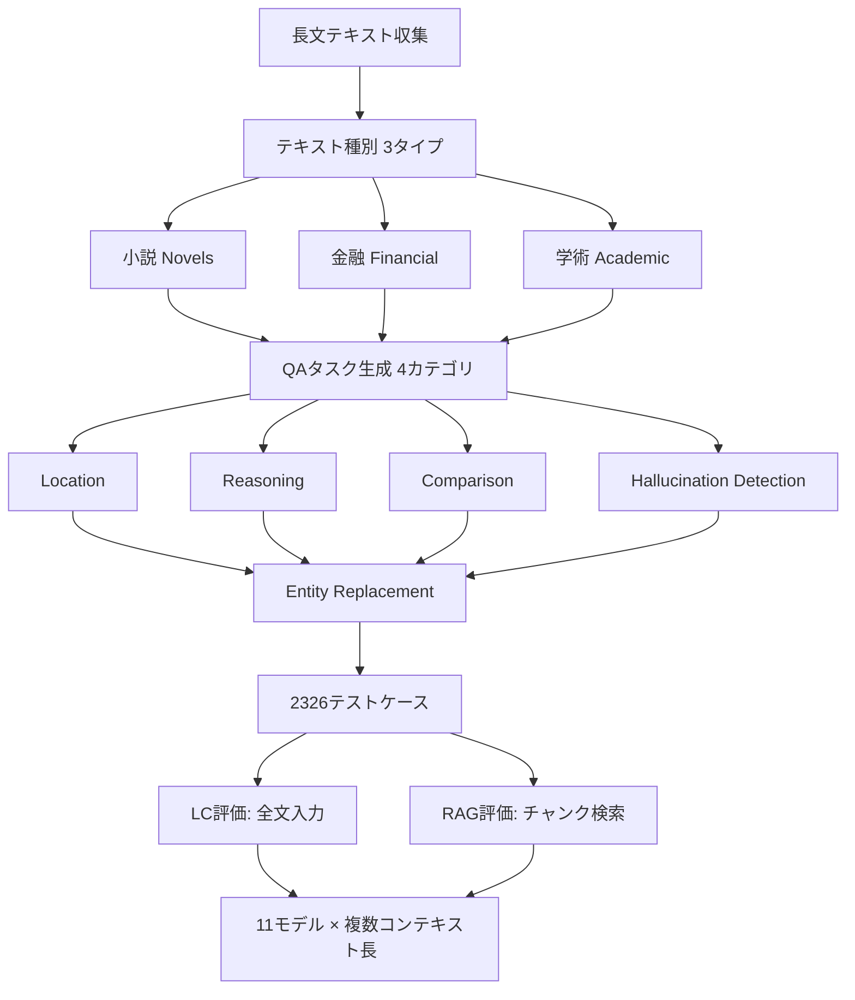
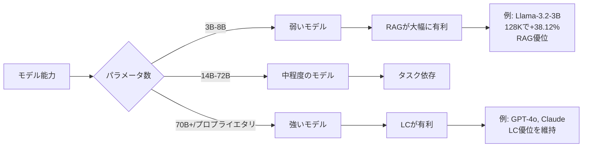
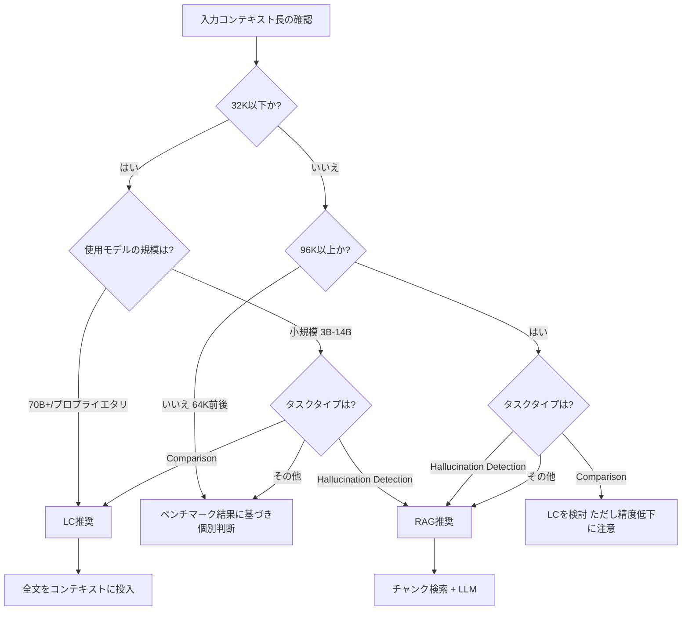

本記事は [https://proceedings.mlr.press/v267/li25dv.html](https://proceedings.mlr.press/v267/li25dv.html) の解説記事です。

## 論文概要

LaRA（Benchmarking Retrieval-Augmented Generation and Long-Context LLMs）は、RAG（Retrieval-Augmented Generation）とLC（Long-Context）LLMのどちらが優位であるかを体系的に比較評価したベンチマークである。著者らは2,326件のテストケースを構築し、4カテゴリのQAタスク（Location/Reasoning/Comparison/Hallucination Detection）と3種類の長文テキスト（小説/金融/学術）を組み合わせた評価を実施している。11のLLM（オープンソース7、プロプライエタリ4）を対象とした大規模実験の結果、RAGとLCの優劣は「モデル能力」「コンテキスト長」「タスクタイプ」の3要素の複合関数であり、どちらか一方が常に優れるという結論にはならないことが報告されている。

この記事は [Zenn記事: Context Engineering実践：1Mトークン時代の長いコンテキスト活用と判断フレームワーク](https://zenn.dev/0h_n0/articles/bc912a47640828) の深掘りです。

## 情報源

| 項目 | 内容 |
|------|------|
| 会議名 | ICML 2025 (42nd International Conference on Machine Learning) |
| 開催年 | 2025年 |
| URL | [https://proceedings.mlr.press/v267/li25dv.html](https://proceedings.mlr.press/v267/li25dv.html) |
| arXiv | [2502.09977](https://arxiv.org/abs/2502.09977) |
| 著者 | Kuan Li, Liwen Zhang, Yong Jiang, Pengjun Xie, Fei Huang, Shuai Wang, Minhao Cheng |
| 所属 | Alibaba Group, HKUST |
| コード | [https://github.com/Alibaba-NLP/LaRA](https://github.com/Alibaba-NLP/LaRA) |

## カンファレンス情報

ICMLは機械学習分野のトップカンファレンスの一つであり、NeurIPS・ICLRと並ぶ主要3会議の一角を占める。2025年はバンクーバーで開催されている。ICMLの採択率は例年25-30%程度であり、厳格な査読プロセスを経た研究が掲載される。本論文はPMLR（Proceedings of Machine Learning Research）Volume 267に収録されている。RAG vs Long Contextの議論はLLMの実運用において重要なテーマであり、ICMLでこのベンチマーク研究が採択されたことは、この問題の学術的重要性を示している。

## 技術的詳細

### ベンチマーク設計の全体像

LaRAベンチマークは、RAGとLCの公正な比較を実現するために以下の設計方針を採用している。

### テキスト種別と長さの制御

著者らは3種類の長文テキストを使用している。

- **小説（Novels）**: 文学作品からの長文。物語の文脈理解と登場人物の追跡が求められる
- **金融（Financial）**: 決算報告書やアニュアルレポート。数値データの正確な抽出と比較が求められる
- **学術（Academic）**: 学術論文の集合体。専門用語と論理的推論が求められる

各テキストは32K、64K、96K、128Kトークンの4段階のコンテキスト長に調整される。これにより、コンテキスト長の増大に伴うRAG/LC各手法の性能変化を系統的に測定できる。

### 4カテゴリのQAタスク

著者らは、QAタスクを情報アクセスパターンの観点から以下の4カテゴリに分類している。

| カテゴリ | 説明 | 情報アクセスの特性 |
|----------|------|-------------------|
| **Location** | テキスト中の特定の事実を検索 | 単一箇所からの情報抽出 |
| **Reasoning** | 複数の情報を組み合わせた推論 | 複数箇所の情報統合 |
| **Comparison** | 異なるセクション間の比較 | 離れた箇所の情報比較 |
| **Hallucination Detection** | テキストに含まれない情報の識別 | 全体を走査してのノイズ判定 |

この分類は、RAGとLCが各タスクに対して構造的に異なる強みを持つことを明らかにするための設計である。Comparisonタスクは文書の複数セクションにまたがる情報を統合する必要があるため、チャンク単位で情報を取得するRAGには本質的な不利がある。一方、Hallucination Detectionタスクでは、RAGによるフィルタリングがノイズ情報の除去に寄与する。

### Entity Replacement によるデータリーク防止

LaRAの重要な設計上の工夫がEntity Replacementである。LLMの事前学習データに評価テキストが含まれている場合、モデルは長文を読まずとも記憶から回答できてしまう。著者らはこの問題を以下のように対処している。

1. テキスト中の固有名詞（人名、地名、組織名等）を自動的に検出
2. 検出されたエンティティを架空の名称に置換
3. 対応するQAペアの正解も同様に更新

この手法により、LLMの事前学習データに含まれる知識が評価結果を汚染することを防いでいる。著者らはEntity Replacementの有無で精度を比較し、置換なしの場合に一部モデルで有意に高い精度が出ることを確認しており、この対策の必要性を実証している。

### RAG構成の詳細

著者らが採用したRAG構成は以下の通りである。

- **チャンキング**: 600トークン単位の固定長分割
- **検索件数**: $k = 5$（上位5チャンクを取得）
- **埋め込みモデル**: GTE-large-en-v1.5
- **検索手法**: ハイブリッドリトリーバル（密ベクトル検索 + BM25スパース検索）

最終的なRAGスコアは以下の式で算出される。

$$
\text{score}(q, c_i) = \alpha \cdot \text{sim}_{\text{dense}}(q, c_i) + (1 - \alpha) \cdot \text{score}_{\text{BM25}}(q, c_i)
$$

ここで、
- $q$: クエリ（質問文）
- $c_i$: $i$ 番目のチャンク
- $\text{sim}_{\text{dense}}(q, c_i)$: GTE-large-en-v1.5による密ベクトル類似度
- $\text{score}_{\text{BM25}}(q, c_i)$: BM25によるスパーススコア
- $\alpha$: 密ベクトルとスパース検索の重みバランスパラメータ

取得された上位 $k$ チャンクはプロンプトに連結され、LLMに入力される。LC評価では同じLLMに全文をそのまま入力する。この構成により、RAGとLCの差異が「情報アクセス方式の違い」のみに帰着される。

### 評価対象モデル

著者らは以下の11モデルを評価対象としている。

**オープンソース（7モデル）**:
- Llama-3.2-3B-Instruct
- Llama-3.1-8B-Instruct
- Llama-3.1-70B-Instruct
- Qwen-2.5-7B-Instruct
- Qwen-2.5-14B-Instruct
- Qwen-2.5-72B-Instruct
- Mistral-Large-Instruct-2407

**プロプライエタリ（4モデル）**:
- GPT-4o
- GPT-4o-mini
- Claude-3.5-Sonnet
- Gemini-1.5-Pro

モデルサイズは3Bから数百Bパラメータまで幅広く、モデル能力とRAG/LC選択の関係を分析可能な構成となっている。

## 実験結果

### コンテキスト長による逆転現象

著者らの報告における最も注目すべき知見は、コンテキスト長に依存してRAGとLCの優劣が逆転する現象である。

| コンテキスト長 | LC平均精度 | RAG平均精度 | 差分（LC - RAG） |
|---------------|-----------|------------|-----------------|
| 32K | 高 | やや低 | +2.4%（LC優位） |
| 64K | 中 | 中 | 拮抗 |
| 96K | やや低 | やや高 | RAG優位に傾斜 |
| 128K | 低 | 高 | -3.68%（RAG優位） |

著者らは、32Kコンテキストではデータ全体の割合が24.7%にすぎないにもかかわらずLC側が+2.4%の優位を示すのに対し、128Kコンテキストになるとこの関係が逆転しRAG側が-3.68%の優位を示すと報告している（論文Table 2より）。この逆転は、LCの処理能力がコンテキスト長の増大に伴い劣化する一方、RAGは検索対象の文書長によらず一定の検索品質を維持できることに起因すると考察されている。

### タスクカテゴリ別の結果

タスクカテゴリ別の分析では、RAGとLCに明確な得意・不得意のパターンが確認されている。

| タスクカテゴリ | LC - RAG差分 | 優位手法 | 理由 |
|---------------|-------------|---------|------|
| **Comparison** | +15.22% | LC | 複数セクションの情報統合が必要 |
| **Reasoning** | 拮抗 | 状況依存 | 推論の種類により変動 |
| **Location** | 拮抗 | 状況依存 | 単一情報検索で両者同程度 |
| **Hallucination Detection** | -22.36% | RAG | フィルタリングがノイズ削減に寄与 |

著者らは、Comparisonタスクでのこの大きなLC優位について次のように説明している。比較タスクでは文書の離れた位置に存在する複数の情報を対比する必要があるが、RAGは上位 $k$ チャンクのみを取得するため、比較に必要な情報の片方が取得漏れとなる確率が高い。一方、LCは文書全体にアクセスできるため、この種のタスクで構造的な優位を持つ。

Hallucination Detectionでのこの顕著なRAG優位（-22.36%）については、LCが全文を処理する際に大量のノイズ情報にさらされることでhallucination判定の精度が低下するのに対し、RAGは検索によりノイズ情報が除去された状態でモデルに入力されるため、より正確な判定が可能になると著者らは分析している。

### モデルサイズによる影響

著者らの報告では、モデルサイズがRAG/LC選択に対して大きな影響を及ぼすことが示されている。

特筆すべきは、Llama-3.2-3B-Instructにおける128Kコンテキストでの結果である。著者らは、このモデルでRAGがLCに対して+38.12%の精度向上を達成したと報告している（論文Table 3より）。3Bパラメータという小規模モデルでは、128Kトークンの全文処理が能力の限界を超えており、RAGによる情報フィルタリングが性能を大幅に引き上げる効果を持つことが示されている。

一方、GPT-4oやClaude-3.5-Sonnetといった大規模プロプライエタリモデルでは、128Kコンテキストにおいてもlcの性能低下が比較的小さく、複数タスクでLCの優位が維持される傾向にある。これは、大規模モデルが長文処理に対する十分な能力を持つため、RAGの情報フィルタリングによる利点よりもLCの全文アクセスによる利点が上回ることを示唆している。

### 「Lost in the Middle」現象の確認

著者らは、LCモデルにおける「Lost in the Middle」現象もLaRAベンチマーク上で確認している。正解情報がコンテキストの先頭や末尾に配置された場合と、中央付近に配置された場合で精度に差異が生じる。

$$
\text{Acc}_{\text{LC}}(d) = f(d) \quad \text{where } d \in [0, 1] \text{ is the answer depth}
$$

ここで $d$ は正解情報の相対的な位置（0.0が先頭、1.0が末尾）を表す。著者らは $d \approx 0.5$（中央付近）で精度が最も低下するU字型の傾向を報告しており、これは先行研究の知見と一致する。一方、RAGはチャンク検索により関連情報を抽出するため、原文における正解位置の影響を受けず、位置に対して平坦な精度分布を示すことが報告されている。

この結果は実運用上の含意が大きい。正解情報が文書中のどこに存在するか事前に予測できない場合、LCは位置依存の精度変動リスクを負う一方、RAGはこのリスクを回避できる。

## 実運用への応用

### 判断フローチャート

LaRAの知見を基に、著者らの実験結果を踏まえた実務的な判断フローを以下に整理する。

### 実務ガイドライン

LaRAの実験結果から導出される実務的なガイドラインを以下に整理する（著者らの議論に基づく）。

**RAGを選択すべき状況**:
- 使用モデルが小規模（3B-14B程度）である場合
- Hallucination耐性が重要な用途（ファクトチェック、コンプライアンス審査等）
- 入力コンテキストが96Kトークンを超える場合
- Comparisonタスク以外の用途

**LCを選択すべき状況**:
- 使用モデルが大規模（70B+またはGPT-4o/Claude等のプロプライエタリモデル）
- セクション間の比較・合成が必要な用途（例: 複数の決算報告書の対比分析）
- 入力コンテキストが32K以下の場合
- Comparisonタスクが中心の用途

**ハイブリッドアプローチの検討**:
- 著者らの結果は、単一手法の採用ではなく、タスク特性に応じた動的な切り替え（ルーティング）の有効性を示唆している。入力の性質（コンテキスト長、タスクタイプ）を分析し、RAGとLCを動的に選択するルーターの構築が実用的なアプローチとなる
- ただし、著者らは本論文ではルーティングの具体的な実装方法については踏み込んでおらず、これは今後の研究課題として位置付けられている

### Zenn記事との関連

Zenn記事「Context Engineering実践」では、1Mトークン時代における長いコンテキストの活用判断フレームワークが議論されている。LaRAの知見は、このフレームワークにおけるRAG vs LC判断の定量的根拠を提供する。特に、コンテキスト長の閾値（32K/128K）によるRAG/LCの優劣逆転、タスクタイプによる明確な得意・不得意パターン、モデルサイズに応じた最適戦略の変化といった知見は、Context Engineeringの実践において具体的な判断基準として活用できる。

## 関連研究

- **Self-Route (Zhu et al., EMNLP 2025)**: モデルの自己判断によりRAGとLCを動的にルーティングする手法。LaRAが問題の存在を実証したのに対し、Self-Routeは解決策の方向性を提示している。LaRAのベンチマーク上でSelf-Routeのようなルーティング手法を評価することは有用な今後の研究方向である

- **NoLiMa (Modarressi et al., ICML 2025)**: ロングコンテキスト能力を語彙的重複なしで評価するベンチマーク。LaRAがRAG vs LCの比較に焦点を当てるのに対し、NoLiMaはLC単体の能力評価に焦点を当てている。両ベンチマークは補完的な関係にあり、NoLiMaで高精度を示すモデルがLaRAにおいてもLC側の性能が高い傾向が示唆される

- **RULER (Hsieh et al., NeurIPS 2024)**: ロングコンテキストLLMの能力を多次元で評価するベンチマーク。LaRAと同様にNIAHを超えた評価を志向しているが、RULERはLC単体の能力評価であり、RAGとの比較は行っていない。LaRAはRULERの知見を拡張し、RAGという対立軸を導入した点に独自性がある

- **Lost in the Middle (Liu et al., TACL 2024)**: LCモデルが文書の中央付近の情報を見落とす傾向を報告した研究。LaRAの実験でもこの現象が確認されており、RAGがこの位置依存性を解消できることを定量的に示した点でLaRAは知見を拡張している

## まとめと今後の展望

LaRAは、RAG vs Long Contextという実務上重要な選択問題に対して、2,326テストケース・11モデルによる体系的なベンチマーク評価を提供した。著者らの主要な知見は、「RAGとLCのどちらが優れるか」という問いに対する答えが、モデルサイズ・コンテキスト長・タスクタイプの3変数に依存する複合関数であるという点に集約される。32Kでの+2.4% LC優位から128Kでの-3.68% RAG優位への逆転、Comparisonタスクでの+15.22% LC優位とHallucination Detectionでの-22.36% RAG優位という対照的な結果は、画一的な手法選択の危険性を定量的に示している。

今後の研究方向として、著者らは入力特性に応じたRAG/LCの動的ルーティング、チャンクサイズや検索件数 $k$ の最適化、マルチモーダル文書への拡張を挙げている。また、128Kを超えるさらに長いコンテキスト（1M+トークン）での評価は、現在のLLM開発トレンドを考慮すると重要な拡張方向である。

## 参考文献

- **Conference URL**: [https://proceedings.mlr.press/v267/li25dv.html](https://proceedings.mlr.press/v267/li25dv.html)
- **arXiv**: [https://arxiv.org/abs/2502.09977](https://arxiv.org/abs/2502.09977)
- **Code**: [https://github.com/Alibaba-NLP/LaRA](https://github.com/Alibaba-NLP/LaRA)
- **Related Zenn article**: [https://zenn.dev/0h_n0/articles/bc912a47640828](https://zenn.dev/0h_n0/articles/bc912a47640828)
