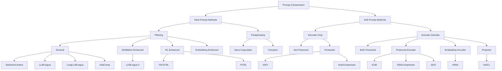

## 論文概要（Abstract）

LLMで複雑なタスクを処理する際、長大なプロンプトがメモリ使用量・推論コスト・レイテンシの増大を引き起こす。本サーベイ論文は、プロンプト圧縮手法を**Hard Prompt Methods**（自然言語テキストの直接操作）と**Soft Prompt Methods**（学習された連続ベクトル表現への変換）に体系化し、Attention最適化・PEFT・マルチモーダル統合・合成言語の4つの分析視点から横断的に考察している。著者らは、各手法の下流タスクへの適用事例を整理し、圧縮エンコーダの最適化やハイブリッド手法、マルチモーダル知見の活用を今後の研究方向として提示している。

この記事は [Zenn記事: Context Engineering実践：1Mトークン時代の長いコンテキスト活用と判断フレームワーク](https://zenn.dev/0h_n0/articles/bc912a47640828) の深掘りです。

> **注意**: 本記事はサーベイ論文の解説記事であり、筆者自身が実験を行ったものではありません。実験結果や性能比較は全て原論文からの引用です。

## 情報源

- **会議名**: NAACL 2025（Nations of the Americas Chapter of the ACL: Human Language Technologies）
- **年**: 2025
- **URL**: <https://aclanthology.org/2025.naacl-long.368/>
- **arXiv**: <https://arxiv.org/abs/2410.12388>
- **著者**: Zongqian Li, Yinhong Liu, Yixuan Su, Nigel Collier
- **ページ**: 7182-7195
- **DOI**: 10.18653/v1/2025.naacl-long.368
- **発表形式**: Selected Oral

## カンファレンス情報

NAACL（Nations of the Americas Chapter of the Association for Computational Linguistics）は、計算言語学・自然言語処理分野の主要国際会議である。ACL、EMNLPと並ぶトップカンファレンスの1つであり、とりわけ北米を中心とした言語技術研究が集まる。本論文はNAACL 2025のMain Conferenceに採択され、さらに**Selected Oral**に選出されている。Oral採択は全体の採択論文の中でもごく一部に限られ、高い評価を受けた研究であることを示す。

## 背景と動機

LLMの能力を最大限に引き出すには、In-Context Learning用のデモンストレーション、RAGで取得した外部文書、エージェントの行動履歴など、長大なプロンプトが必要になる場面が多い。しかし、プロンプト長の増大は以下の問題を引き起こす。

1. **メモリ使用量**: Self-Attentionの計算量は系列長 $n$ に対して $O(n^2)$ でスケールし、KVキャッシュもトークン数に比例して増大する
2. **推論コスト**: APIベースのLLMでは入力トークン数に応じた課金が発生し、長いプロンプトは直接的なコスト増に繋がる
3. **レイテンシ**: プロンプトのエンコーディング時間が増加し、リアルタイム応答が求められるアプリケーションで問題となる

Context Windowの拡大（Gemini 1.5の100万トークン等）は部分的な解決策だが、計算コストの根本的な削減にはならない。プロンプト圧縮は、情報の本質を保ちつつ入力長を削減することで、これらの課題に対処するアプローチである。

## 技術的詳細（Technical Details）

### プロンプト圧縮手法の全体分類

著者らは、プロンプト圧縮手法を以下のように体系化している。

### Hard Prompt Methods（直接的なテキスト操作）

Hard Prompt Methodsは、元のプロンプトのテキストを直接操作して圧縮する手法群である。出力は依然として自然言語であるため、追加の学習が不要で解釈可能性が高いという利点がある。大きく**Filtering**（不要なトークン・文の除去）と**Paraphrasing**（要約・言い換え）に分類される。

#### Filtering: General Approaches

**Selective Context** は、各トークンの自己情報量（self-information）を計算し、情報量の低いトークンを除去する手法である。SpaCyによる構文解析で名詞句等の句境界を特定し、句単位でフィルタリングを行う。

自己情報量は以下の式で定義される。

$$
I(x_i) = -\log_2 p(x_i \mid x_{<i})
$$

ここで、
- $x_i$: $i$番目のトークン
- $x_{<i}$: $i$番目より前のコンテキスト
- $p(x_i \mid x_{<i})$: 言語モデルによるトークンの条件付き確率

自己情報量が低いトークン（予測しやすいトークン）ほど冗長であるとみなし、削除対象とする。

**LLMLingua** は、小規模な言語モデル（GPT-2等）を用いてパープレキシティベースのトークン重要度スコアリングを行う。プロンプトを `{Instruction, Demonstrations, Question}` の構造に分解し、各部分に対して異なる圧縮率を適用する。著者らによれば、最大20倍の圧縮率を達成しつつ、下流タスクの性能を維持できると報告されている。数値や単位などのタスクに重要なトークンを保護するアルゴリズムも組み込まれている。

**LongLLMLingua** は、LLMLinguaを長文コンテキストに拡張した手法である。質問（Query）に条件付けたパープレキシティを使用することで、質問に関連性の高い情報を優先的に保持する。

#### Filtering: Distillation Enhanced

**LLMLingua-2** は、データ蒸留を活用してフィルタリング精度を向上させた手法である。大規模LLMの出力を教師データとして、どのトークンがタスク遂行に不可欠かを識別する分類器を訓練する。元のLLMLinguaがパープレキシティという間接的な指標を使用していたのに対し、LLMLingua-2はタスク固有の重要度を直接学習する点で異なる。

#### Filtering: RL Enhanced

**PCRL** と **TACO-RL** は、強化学習を用いてトークン選択を最適化する手法である。PCRLはモデル非依存的なトークン選択ポリシーを学習し、TACO-RLはタスク固有の圧縮ポリシーを強化学習で獲得する。報酬関数には、圧縮後のプロンプトで元のタスク性能をどの程度維持できるかが組み込まれている。

#### Paraphrasing

**Nano-Capsulator** は、プロンプト全体を流暢な自然言語の要約に変換する手法である。Vicuna-7Bをファインチューニングし、意味保存損失（semantic preservation loss）と下流タスクの有用性を最適化する報酬関数を組み合わせて学習する。Filtering手法と異なり、文法的に正しい圧縮テキストを生成するが、要約過程で情報の欠落が生じるリスクがある。

**CompAct** は、RAGコンテキストの圧縮に特化した手法であり、取得文書を簡潔に要約してからLLMに入力する。

### Soft Prompt Methods（学習ベースの圧縮表現）

Soft Prompt Methodsは、プロンプトの情報を少数の連続ベクトル（soft tokens）に圧縮する手法群である。自然言語ではなくモデルの埋め込み空間上のベクトルとして圧縮するため、Hard Prompt Methodsよりも高い圧縮率を達成できるが、追加の学習が必要であり、圧縮結果の解釈が困難である。

#### Decoder-Only アーキテクチャ

**GIST（Gist Tokens）** は、元のプロンプトの末尾に学習可能な特殊トークン（gist tokens）を追加し、これらのトークンが元のプロンプト全体の情報を保持するように学習する手法である。推論時には、gist tokensのみをLLMに入力する。著者らによれば、26倍の圧縮率を達成したと報告されている。ただし、ファインチューニングに使用したデータセットの長さに圧縮可能なプロンプト長が制約されるという制限がある。

**AutoCompressor** は、再帰的なアーキテクチャでプロンプトを処理する。長いプロンプトを複数のサブプロンプトに分割し、各サブプロンプトを逐次的に圧縮して「summary vectors」を生成する。著者らによれば、最大30,720トークンのプロンプトを処理可能であると報告されている。

圧縮の再帰プロセスは概念的に以下のように表現できる。

$$
\mathbf{s}_t = f_\theta(\mathbf{x}_t, \mathbf{s}_{t-1})
$$

ここで、
- $\mathbf{s}_t$: 時刻 $t$ でのsummary vector
- $\mathbf{x}_t$: $t$番目のサブプロンプト
- $f_\theta$: パラメータ $\theta$ を持つ圧縮関数
- $\mathbf{s}_{t-1}$: 前の時刻のsummary vector（初期値は零ベクトル）

最終的な $\mathbf{s}_T$ が元のプロンプト全体の圧縮表現となり、LLMへの入力として使用される。

#### Encoder-Decoder アーキテクチャ

**ICAE（In-Context Autoencoder）** は、コンテキスト（質問を除く部分）を32-128個の特殊トークンに圧縮するオートエンコーダである。エンコーダは学習するが、デコーダ（LLM本体）は凍結したまま使用する。著者らによれば、4-16倍の圧縮率を達成し、最大5,120トークンのコンテキストを処理可能であると報告されている。デコーダを凍結することで、LLMの追加ファインチューニングが不要になるという利点がある。

**500xCompressor** は、埋め込みではなくKey-Valueキャッシュの値をデコーダに供給する手法である。これにより6-480倍という極めて高い圧縮率を実現する。著者らによれば、未見のArxivQAデータで非圧縮時の62-73%の性能を維持したと報告されている。

**xRAG** は、凍結された埋め込みエンコーダ（SFR-Embedding-Mistral）と学習可能なアダプタを組み合わせ、RAGタスクに特化した圧縮を行う。取得文書を単一のトークンに圧縮するという極端なアプローチを採用している。

**UniICL** は、In-Context Learningのデモンストレーション部分のみを圧縮する手法である。エンコーダとデコーダは凍結し、間のプロジェクタのみを学習する。これにより学習パラメータ数を最小化している。

### 4つの分析視点

著者らは、上記の手法群を以下の4つの横断的な視点から分析している。

#### 1. Attention最適化

Soft Prompt圧縮は、Attention機構の最適化として捉えることができる。従来のSparse AttentionやSliding Window Attentionが全てのトークンを保持したまま注意パターンを制限するのに対し、Soft Prompt圧縮は2段階で動作する。

1. **圧縮段階**: 少数のトークンが元の全入力に対してAttentionを計算し、情報を集約
2. **生成段階**: 生成トークンは圧縮トークンのみに対してAttentionを計算

この2段階方式により、入力トークン数自体を削減できる点がSparse Attention等との本質的な違いである。

#### 2. Parameter-Efficient Fine-Tuning（PEFT）

Soft Prompt圧縮手法は、PEFTの枠組みと密接に関連している。ICAEはPrompt Tuning（学習可能な埋め込みの追加）に類似し、500xCompressorはPrefix Tuning（学習可能なKey-Value値の追加）に類似している。著者らは、Prefix Tuningに類似した手法はKey-Valueにより多くの情報を格納できるが、タスク固有の過学習リスクがあると指摘している。

#### 3. マルチモーダル統合

著者らは「圧縮されたテキストは、画像や音声と同様に新しいモダリティとみなすことができる」と主張している。画像エンコーダが画像を埋め込みに変換してLLMデコーダに入力する構造は、テキスト圧縮エンコーダがプロンプトを圧縮ベクトルに変換してLLMに入力する構造と並行関係にある。ただし、テキストは画像よりも情報密度が高く、圧縮時により高い精度が求められる点が異なる。

#### 4. 合成言語

圧縮トークンは、以下の3つの特徴を持つ「新しい言語」として定義できると著者らは述べている。

1. **情報の潜在表現へのエンコード**: 自然言語テキストを潜在空間のベクトルに変換する
2. **システム間の伝達可能性**: 圧縮表現を保存し、異なるLLM間で転送できる
3. **適応的評価**: 圧縮レベルに応じて出力を動的に調整できる

### Hard vs Soft の比較

| 観点 | Hard Prompt Methods | Soft Prompt Methods |
|------|-------------------|-------------------|
| **圧縮率** | 最大約20倍（LLMLingua） | 最大約480倍（500xCompressor） |
| **追加学習** | 不要（一部手法を除く） | 必要（エンコーダの学習） |
| **解釈可能性** | 高い（自然言語のまま） | 低い（連続ベクトル） |
| **汎化性能** | モデル非依存 | モデル依存（エンコーダが特定LLMに紐づく） |
| **圧縮品質** | 文法が崩れる可能性 | 情報の欠落が潜在的 |
| **推論オーバーヘッド** | 小さい | エンコーダの推論が必要 |
| **入力長制限** | 元のテキスト長に依存 | アーキテクチャにより制限あり |

## 実験結果・手法比較

著者らは、各手法を下流タスクでの性能比較を通じて評価している。以下は論文で言及されている代表的な手法の特徴比較である。

| 手法 | カテゴリ | 圧縮率 | 主な対象タスク | 学習要否 |
|------|---------|--------|--------------|---------|
| SelectiveContext | Hard/Filtering | 可変 | 汎用QA | 不要 |
| LLMLingua | Hard/Filtering | 最大20x | 汎用（Instruction, Demo, Question） | 不要 |
| LLMLingua-2 | Hard/Filtering (蒸留) | 可変 | 汎用 | 分類器の学習が必要 |
| TACO-RL | Hard/Filtering (RL) | 可変 | タスク固有 | RL学習が必要 |
| Nano-Capsulator | Hard/Paraphrasing | 可変 | 要約ベース圧縮 | ファインチューニング必要 |
| GIST | Soft/Decoder-Only | 26x | Instruction圧縮 | ファインチューニング必要 |
| AutoCompressor | Soft/Decoder-Only | 可変 | 長文コンテキスト（最大30,720トークン） | ファインチューニング必要 |
| ICAE | Soft/Encoder-Decoder | 4-16x | コンテキスト圧縮 | エンコーダ学習必要 |
| 500xCompressor | Soft/Encoder-Decoder | 6-480x | 極端な圧縮 | KV学習必要 |
| xRAG | Soft/Encoder-Decoder | 極高 | RAG文書圧縮 | アダプタ学習必要 |

著者らは、Hard Prompt Methods は学習不要で即座に適用できるが圧縮率に限界があり、Soft Prompt Methodsは高い圧縮率を達成できるが学習コストとモデル依存性のトレードオフがあると総括している。

## 下流タスクへの応用

著者らは、プロンプト圧縮の主な応用領域として以下を整理している。

### RAG（Retrieval-Augmented Generation）

RAGでは取得した外部文書がプロンプトの大部分を占めるため、圧縮の効果が大きい。xRAGは取得文書を単一トークンに圧縮してRAG性能を維持し、RECOMPは取得文書の要約的な圧縮を行い、CompActはRAGコンテキスト専用の圧縮手法を提供する。

### In-Context Learning

UniICLのように、デモンストレーション部分のみを圧縮する手法がある。デモンストレーションの数を増やしつつ、プロンプト長を制御できる点で有用である。

### エージェントシステム

LLMエージェントでは、API仕様書や行動履歴が長大なプロンプトとなる。プロンプト圧縮により、より多くのコンテキストを保持しつつコストを削減できる。Zenn記事で解説したContext Engineeringの観点では、圧縮手法の選択がコンテキスト設計の重要な要素となる。

### Context Engineeringとの関連

Zenn記事「Context Engineering実践」で議論されている長いコンテキストの活用において、プロンプト圧縮は以下のような判断基準で使い分けることが考えられる。

- **即座に適用したい場合**: Hard Prompt Methods（LLMLingua等）。追加学習不要で、既存のパイプラインに組み込みやすい
- **高い圧縮率が必要な場合**: Soft Prompt Methods（ICAE等）。ただしエンコーダの学習が前提
- **RAGパイプラインの場合**: xRAGやRECOMPなど、取得文書に特化した手法が有効
- **コスト最適化が主目的の場合**: 圧縮率とタスク性能のトレードオフを検証し、適切な手法を選択

## 今後の研究方向

著者らは、以下の3つの研究方向を提示している。

### 1. 圧縮エンコーダの最適化

現在のSoft Prompt手法は、デコーダと同規模のエンコーダを使用するケースが多い。著者らは、BERT規模（デコーダの1/10程度）のエンコーダで同等の圧縮品質を達成できる可能性を指摘している。また、QLoRA、DoRA、MoRA、LLaMA-Adapterなど、PEFTの最新手法をエンコーダ学習に適用することで、学習コストの削減が期待できると述べている。

### 2. ハイブリッド手法

Hard PromptとSoft Promptを組み合わせるハイブリッドアプローチが有望であると著者らは指摘している。例えば、まずHard Prompt手法で不要なトークンを除去し、次にSoft Prompt手法で残りのトークンを圧縮する2段階方式が考えられる。ただし、圧縮の順序が並列化を阻害するため、効率的なパイプライン設計が課題となる。

### 3. マルチモーダル知見の活用

Vision-Languageモデルで使用されるCross-Attention機構は、Soft Prompt圧縮ではまだ十分に探索されていないと著者らは指摘している。画像-テキストの整合学習（alignment training）の知見を、テキスト圧縮トークン-テキストの整合に応用できる可能性がある。

## 現状の課題

著者らは以下の課題も指摘している。

1. **エンコーダのモデル依存性**: Soft Prompt手法のエンコーダは特定のLLMに紐づいており、LLMの更新時にエンコーダの再学習が必要
2. **効率性の限界**: 圧縮処理自体の計算コストが、元のプロンプトをそのまま処理するコストと同程度になる場合がある。圧縮の恩恵は生成フェーズ（短い入力からの生成）でのみ得られるため、短い出力のタスクでは効果が限定的
3. **既存手法との比較不足**: Sliding Window AttentionやSparse Attentionなどの既存のAttention最適化手法との厳密な比較が不足していると著者らは指摘している

## 関連研究

- **LLMLingua系列**（Jiang et al., 2023; 2024）: パープレキシティベースのトークンフィルタリングを確立した一連の研究。LLMLingua、LongLLMLingua、LLMLingua-2と段階的に精度と適用範囲を拡大しており、Hard Prompt Methodsの代表的手法である
- **GIST / AutoCompressor**（Mu et al., 2024; Chevalier et al., 2023）: Soft Prompt Methodsの基盤となる研究。GISTはgist tokensの概念を導入し、AutoCompressorは再帰的な圧縮アーキテクチャを提案した
- **ICAE**（Ge et al., 2024）: In-Context Autoencoderは、デコーダを凍結したままエンコーダのみを学習する効率的なアプローチを提案し、Soft Prompt圧縮の実用性を向上させた

## まとめ

本サーベイ論文は、LLMのプロンプト圧縮手法をHard Prompt Methods（Filtering/Paraphrasing）とSoft Prompt Methods（Decoder-Only/Encoder-Decoder）に体系化し、Attention最適化・PEFT・マルチモーダル統合・合成言語の4つの視点から横断的に分析した。Hard Prompt手法は解釈可能性と即座の適用が可能である一方、Soft Prompt手法は圧縮率で優位にあるが学習コストを伴う。著者らは、圧縮エンコーダの小型化、ハイブリッド手法の開発、マルチモーダル知見の活用を今後の研究方向として提示しており、Context Engineeringの実践においてプロンプト圧縮の適切な選択がますます重要になることを示唆している。

## 参考文献

- **ACL Anthology**: <https://aclanthology.org/2025.naacl-long.368/>
- **arXiv**: <https://arxiv.org/abs/2410.12388>
- **GitHub**: <https://github.com/ZongqianLi/Prompt-Compression-Survey>
- **Related Zenn article**: <https://zenn.dev/0h_n0/articles/bc912a47640828>
