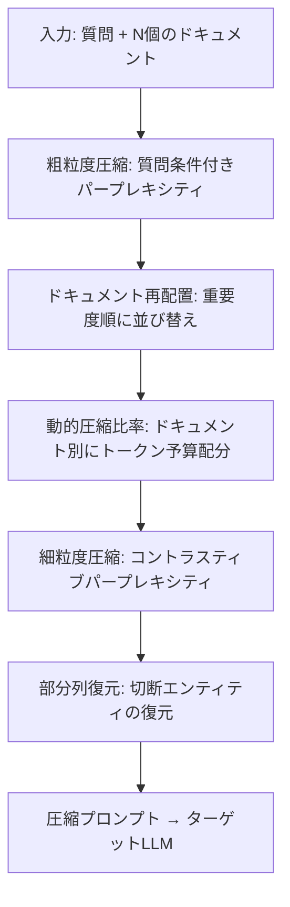

## 論文概要

本記事は[LongLLMLingua](https://arxiv.org/abs/2310.06839)（arXiv: 2310.06839）の解説記事です。

LongLLMLinguaは、長いコンテキストを扱うLLMのプロンプト圧縮手法であり、ACL 2024に採択されています。質問条件付きパープレキシティによる粗粒度圧縮、コントラスティブパープレキシティによる細粒度圧縮、ドキュメント再配置、動的圧縮比率の4つのコンポーネントで構成されます。著者らは、NaturalQuestionsで2倍圧縮時に77.2%の精度を達成し、埋め込みベースの検索（SBERT 72.5%）を上回ったと報告しています。最大4倍のトークン削減で21.4%の精度向上、LooGLEベンチマークで94%のコスト削減を実現しています。

この記事は [Zenn記事: Context Engineering実践：1Mトークン時代の長いコンテキスト活用と判断フレームワーク](https://zenn.dev/0h_n0/articles/bc912a47640828) の深掘りです。

## 情報源

- **arXiv ID**: 2310.06839
- **URL**: [arXiv:2310.06839](https://arxiv.org/abs/2310.06839)
- **著者**: Huiqiang Jiang, Qianhui Wu, Xufang Luo et al.（Microsoft Research、7名）
- **採択**: ACL 2024
- **分野**: Computation and Language (cs.CL)

## 背景と動機

LLMの長いコンテキスト処理には、3つの根本的な障壁が存在します。

**第一に、計算コストの問題です。** GPT-4やClaude等の商用LLMでは、入力トークン数に比例して推論コストが増大します。RAG（Retrieval-Augmented Generation）で多数のドキュメントを検索結果として渡す場合、数万〜数十万トークンに達することがあり、APIコストとレイテンシが実用上の制約となります。

**第二に、性能劣化の問題です。** コンテキスト長が増加すると、LLMの回答精度が低下する現象が観察されています。これは、関連情報がノイズとなる無関係情報に埋もれることに起因します。著者らは、単純にコンテキストを長くすることが必ずしも精度向上に寄与しないことを実験的に示しています。

**第三に、位置バイアス（Lost in the Middle）の問題です。** Liu et al. (2023) が報告した通り、LLMはプロンプトの先頭と末尾に配置された情報を重視し、中間部分の情報を取りこぼす傾向があります。これは、検索結果の並び順がそのまま回答精度に影響することを意味します。

LongLLMLinguaは、これら3つの障壁を質問認識型のプロンプト圧縮で同時に解決するアプローチです。

## 主要な貢献

1. **質問認識型の粗粒度・細粒度圧縮**: 質問条件付きパープレキシティとコントラスティブパープレキシティを組み合わせ、質問に関連するトークンを選択的に保持する2段階の圧縮手法を提案
2. **ドキュメント再配置と動的圧縮比率**: Lost in the Middle問題を緩和するドキュメント並び替えと、重要度に応じたドキュメント単位の圧縮率割り当てにより、限られたトークン予算で最大限の情報を保持
3. **後処理による部分列復元**: 圧縮により切断されたエンティティを最長部分文字列マッチングで復元し、圧縮の副作用を軽減

## 技術的詳細

### パイプライン全体像

LongLLMLinguaの処理パイプラインを以下に示します。



### Question-Aware Coarse-Grained Compression（質問認識型粗粒度圧縮）

粗粒度圧縮では、各ドキュメント $$x_k^{doc}$$ の重要度を質問 $$x^{que}$$ との関連性で評価します。具体的には、ドキュメントを条件として与えた場合の質問のパープレキシティを計算します。

$$
r_k = -\frac{1}{N_c} \sum_{i} \log p(x_i^{que,restrict} \mid x_k^{doc})
$$

ここで、各変数は以下を意味します。

- $$r_k$$: ドキュメント $$k$$ の重要度スコア（低いほど重要）
- $$N_c$$: 質問トークンの数
- $$x_i^{que,restrict}$$: 質問の $$i$$ 番目のトークン（restrictは質問部分のみのパープレキシティを計算することを示す）
- $$x_k^{doc}$$: $$k$$ 番目のドキュメント

直感的には、あるドキュメントが質問と関連している場合、そのドキュメントをコンテキストとして与えると質問文の予測が容易になる（パープレキシティが低下する）ため、$$r_k$$ が小さくなります。この手法は、埋め込みベースの類似度検索（SBERT等）よりも細やかな関連性評価が可能であると著者らは主張しています。実際、NaturalQuestionsでの検索性能では、LongLLMLinguaのパープレキシティベースのリランキングがSBERTのリランキングを上回ったと報告されています（Table 1）。

### Contrastive Perplexity for Fine-Grained Compression（コントラスティブパープレキシティによる細粒度圧縮）

細粒度圧縮では、各トークンの重要度をコントラスティブパープレキシティで評価します。

$$
s_i = \text{ppl}(x_i \mid x_{<i}) - \text{ppl}(x_i \mid x^{que}, x_{<i})
$$

各変数の意味は以下の通りです。

- $$s_i$$: トークン $$x_i$$ の重要度スコア
- $$\text{ppl}(x_i \mid x_{<i})$$: 質問なしの条件付きパープレキシティ
- $$\text{ppl}(x_i \mid x^{que}, x_{<i})$$: 質問を条件に加えたパープレキシティ

この差分は条件付き相互情報量（Conditional Pointwise Mutual Information）に相当します。質問が与えられたときにパープレキシティが大きく低下するトークン（すなわち $$s_i$$ が大きいトークン）は、質問と強く関連しているトークンであり、圧縮時に優先的に保持されます。質問なしのパープレキシティとの差分を取ることで、一般的に予測しやすいトークン（冠詞、前置詞等）は自然に排除されます。

### Document Reordering（ドキュメント再配置）

粗粒度圧縮で算出した重要度スコア $$r_k$$ に基づき、ドキュメントを重要度の高い順に並び替えます。これは、Liu et al. (2023) が報告した「Lost in the Middle」問題への対策です。LLMはプロンプトの先頭と末尾の情報を利用しやすい傾向があるため、重要なドキュメントをプロンプトの先頭に配置することで、情報の取りこぼしを抑制します。

### Dynamic Compression Ratios（動的圧縮比率）

全ドキュメントに一律の圧縮率を適用するのではなく、重要度に応じてドキュメントごとに異なる圧縮率を割り当てます。

$$
\tau_k = \max\left(\min\left(\left(1 - \frac{2I(r_k)}{K'}\right)\delta_\tau + \tau_{doc},\; 1\right),\; 0\right)
$$

各変数の意味は以下の通りです。

- $$\tau_k$$: ドキュメント $$k$$ の圧縮率（0に近いほど多くのトークンを保持）
- $$I(r_k)$$: 重要度スコアに基づくドキュメント $$k$$ のランク（0-indexed）
- $$K'$$: 保持するドキュメント数
- $$\delta_\tau$$: 圧縮率の変動幅を制御するハイパーパラメータ
- $$\tau_{doc}$$: ベースライン圧縮率

重要度の高いドキュメントには低い圧縮率（多くのトークンを残す）が割り当てられ、重要度の低いドキュメントは積極的に圧縮されます。これにより、固定トークン予算の中で質問に関連する情報の保持率を最大化します。

### Subsequence Recovery（部分列復元）

圧縮はトークン単位で行われるため、エンティティ名や数値が途中で切断される場合があります。LongLLMLinguaは後処理として、圧縮後のテキストに含まれる部分文字列と元テキストとの最長部分文字列マッチングを行い、切断されたエンティティを復元します。これにより、「Albert Ein」→「Albert Einstein」のような切断を修復し、下流タスクの精度劣化を防止します。

## 実装のポイント

### 圧縮用小型言語モデルの選択

LongLLMLinguaでは、プロンプト圧縮の判定に小型言語モデル（Small LM）を使用します。論文ではLLaMA-2-7B-Chatが採用されています。圧縮用モデルの選択基準として、（1）十分なテキスト理解能力を持つこと、（2）推論コストが低いこと、（3）ターゲットLLMとの互換性があることが挙げられます。7Bクラスのモデルはコストと性能のバランスが良く、著者らはこの規模で十分な圧縮品質が得られると報告しています。

### セグメントサイズ

論文では、ドキュメントを200トークン単位のセグメントに分割して処理しています。セグメントサイズが小さすぎると計算オーバーヘッドが増加し、大きすぎると粗粒度圧縮の粒度が粗くなります。著者らの実験では200トークンが妥当な設定とされていますが、ドメインやドキュメント長に応じた調整が必要です。

### 圧縮率のチューニング

圧縮率はタスクに依存します。NaturalQuestionsでは2倍圧縮（50%削減）で77.2%の精度を達成していますが、LongBenchでは3倍圧縮（約67%削減）でもオリジナルを上回る48.8のスコアを記録しています（Table 5）。実運用では、タスク固有のバリデーションセットで圧縮率と精度のトレードオフを評価し、許容精度を満たす最大圧縮率を探索することが推奨されます。

## Production Deployment Guide

LongLLMLinguaをプロダクション環境に導入する際のアーキテクチャとインフラ構成を解説します。

### AWS アーキテクチャ構成

| 項目 | Small（〜100 req/日） | Medium（〜10K req/日） | Large（〜1M req/日） |
|------|----------------------|----------------------|---------------------|
| **圧縮推論** | Lambda + SageMaker Serverless | SageMaker Real-time (ml.g5.xlarge) | EKS + Karpenter (GPU node pool) |
| **ターゲットLLM** | Bedrock (Claude/GPT) | Bedrock Provisioned Throughput | Bedrock + Self-hosted (vLLM on EKS) |
| **キャッシュ** | DynamoDB (TTL付き) | ElastiCache Redis Cluster | ElastiCache Redis + DynamoDB |
| **キュー** | SQS Standard | SQS FIFO + Dead Letter Queue | Amazon MSK (Kafka) |
| **モニタリング** | CloudWatch Logs | CloudWatch + X-Ray | CloudWatch + X-Ray + Grafana |
| **月額目安** | $50–200 | $2,000–5,000 | $15,000–50,000 |

### Terraform構成: Small規模（Lambda + Bedrock + DynamoDB）

```hcl
# main.tf - LongLLMLingua Small Architecture
terraform {
  required_version = ">= 1.5"
  required_providers {
    aws = {
      source  = "hashicorp/aws"
      version = "~> 5.0"
    }
  }

  backend "s3" {
    bucket = "longllmlingua-tfstate"
    key    = "small/terraform.tfstate"
    region = "ap-northeast-1"
  }
}

provider "aws" {
  region = "ap-northeast-1"

  default_tags {
    tags = {
      Project     = "longllmlingua"
      Environment = "production"
      ManagedBy   = "terraform"
    }
  }
}

# --- DynamoDB: 圧縮結果キャッシュ ---
resource "aws_dynamodb_table" "compression_cache" {
  name         = "longllmlingua-compression-cache"
  billing_mode = "PAY_PER_REQUEST"
  hash_key     = "prompt_hash"

  attribute {
    name = "prompt_hash"
    type = "S"
  }

  ttl {
    attribute_name = "expires_at"
    enabled        = true
  }

  point_in_time_recovery {
    enabled = true
  }
}

# --- IAM Role: Lambda実行ロール ---
resource "aws_iam_role" "lambda_exec" {
  name = "longllmlingua-lambda-exec"

  assume_role_policy = jsonencode({
    Version = "2012-10-17"
    Statement = [{
      Action = "sts:AssumeRole"
      Effect = "Allow"
      Principal = {
        Service = "lambda.amazonaws.com"
      }
    }]
  })
}

resource "aws_iam_role_policy" "lambda_policy" {
  name = "longllmlingua-lambda-policy"
  role = aws_iam_role.lambda_exec.id

  policy = jsonencode({
    Version = "2012-10-17"
    Statement = [
      {
        Effect = "Allow"
        Action = [
          "dynamodb:GetItem",
          "dynamodb:PutItem",
          "dynamodb:Query"
        ]
        Resource = aws_dynamodb_table.compression_cache.arn
      },
      {
        Effect = "Allow"
        Action = [
          "bedrock:InvokeModel"
        ]
        Resource = "arn:aws:bedrock:ap-northeast-1::foundation-model/*"
      },
      {
        Effect = "Allow"
        Action = [
          "sagemaker:InvokeEndpoint"
        ]
        Resource = aws_sagemaker_endpoint.compression_model.arn
      },
      {
        Effect = "Allow"
        Action = [
          "logs:CreateLogGroup",
          "logs:CreateLogStream",
          "logs:PutLogEvents"
        ]
        Resource = "arn:aws:logs:*:*:*"
      },
      {
        Effect = "Allow"
        Action = [
          "xray:PutTraceSegments",
          "xray:PutTelemetryRecords"
        ]
        Resource = "*"
      }
    ]
  })
}

# --- SageMaker Serverless: 圧縮モデルエンドポイント ---
resource "aws_sagemaker_model" "compression_model" {
  name               = "longllmlingua-compressor"
  execution_role_arn = aws_iam_role.sagemaker_exec.arn

  primary_container {
    image          = "763104351884.dkr.ecr.ap-northeast-1.amazonaws.com/huggingface-pytorch-inference:2.1-transformers4.36-gpu-py310-cu121-ubuntu20.04"
    model_data_url = "s3://longllmlingua-models/llama2-7b-chat/model.tar.gz"

    environment = {
      HF_MODEL_ID             = "meta-llama/Llama-2-7b-chat-hf"
      HF_TASK                 = "text-generation"
      SAGEMAKER_PROGRAM       = "inference.py"
      MAX_INPUT_LENGTH        = "4096"
      MAX_TOTAL_TOKENS        = "4096"
    }
  }
}

resource "aws_sagemaker_endpoint_configuration" "compression_endpoint_config" {
  name = "longllmlingua-compressor-config"

  production_variants {
    variant_name = "primary"
    model_name   = aws_sagemaker_model.compression_model.name

    serverless_config {
      max_concurrency   = 5
      memory_size_in_mb = 6144
    }
  }
}

resource "aws_sagemaker_endpoint" "compression_model" {
  name                 = "longllmlingua-compressor"
  endpoint_config_name = aws_sagemaker_endpoint_configuration.compression_endpoint_config.name
}

resource "aws_iam_role" "sagemaker_exec" {
  name = "longllmlingua-sagemaker-exec"

  assume_role_policy = jsonencode({
    Version = "2012-10-17"
    Statement = [{
      Action = "sts:AssumeRole"
      Effect = "Allow"
      Principal = {
        Service = "sagemaker.amazonaws.com"
      }
    }]
  })
}

resource "aws_iam_role_policy_attachment" "sagemaker_full" {
  role       = aws_iam_role.sagemaker_exec.name
  policy_arn = "arn:aws:iam::aws:policy/AmazonSageMakerFullAccess"
}

# --- Lambda: 圧縮パイプライン ---
resource "aws_lambda_function" "compressor" {
  function_name = "longllmlingua-compressor"
  role          = aws_iam_role.lambda_exec.arn
  handler       = "handler.lambda_handler"
  runtime       = "python3.12"
  timeout       = 300
  memory_size   = 512

  filename         = "lambda_package.zip"
  source_code_hash = filebase64sha256("lambda_package.zip")

  environment {
    variables = {
      CACHE_TABLE_NAME     = aws_dynamodb_table.compression_cache.name
      SAGEMAKER_ENDPOINT   = aws_sagemaker_endpoint.compression_model.name
      BEDROCK_MODEL_ID     = "anthropic.claude-sonnet-4-20250514"
      COMPRESSION_RATIO    = "0.5"
      LOG_LEVEL            = "INFO"
    }
  }

  tracing_config {
    mode = "Active"
  }
}

# --- API Gateway: REST API ---
resource "aws_apigatewayv2_api" "compressor_api" {
  name          = "longllmlingua-api"
  protocol_type = "HTTP"

  cors_configuration {
    allow_origins = ["https://app.example.com"]
    allow_methods = ["POST"]
    allow_headers = ["Content-Type", "Authorization"]
    max_age       = 3600
  }
}

resource "aws_apigatewayv2_integration" "lambda_integration" {
  api_id             = aws_apigatewayv2_api.compressor_api.id
  integration_type   = "AWS_PROXY"
  integration_uri    = aws_lambda_function.compressor.invoke_arn
  payload_format_version = "2.0"
}

resource "aws_apigatewayv2_route" "compress_route" {
  api_id    = aws_apigatewayv2_api.compressor_api.id
  route_key = "POST /compress"
  target    = "integrations/${aws_apigatewayv2_integration.lambda_integration.id}"
}

resource "aws_apigatewayv2_stage" "prod" {
  api_id      = aws_apigatewayv2_api.compressor_api.id
  name        = "prod"
  auto_deploy = true

  access_log_settings {
    destination_arn = aws_cloudwatch_log_group.api_logs.arn
    format = jsonencode({
      requestId      = "$context.requestId"
      ip             = "$context.identity.sourceIp"
      requestTime    = "$context.requestTime"
      httpMethod     = "$context.httpMethod"
      status         = "$context.status"
      latency        = "$context.integrationLatency"
    })
  }
}

resource "aws_cloudwatch_log_group" "api_logs" {
  name              = "/aws/apigateway/longllmlingua"
  retention_in_days = 30
}

output "api_endpoint" {
  value = "${aws_apigatewayv2_api.compressor_api.api_endpoint}/prod/compress"
}
```

### Terraform構成: Large規模（EKS + Karpenter）

```hcl
# eks.tf - LongLLMLingua Large Architecture
terraform {
  required_version = ">= 1.5"
  required_providers {
    aws = {
      source  = "hashicorp/aws"
      version = "~> 5.0"
    }
    helm = {
      source  = "hashicorp/helm"
      version = "~> 2.12"
    }
    kubectl = {
      source  = "gavinbunney/kubectl"
      version = "~> 1.14"
    }
  }
}

module "eks" {
  source  = "terraform-aws-modules/eks/aws"
  version = "~> 20.0"

  cluster_name    = "longllmlingua-prod"
  cluster_version = "1.30"

  vpc_id     = module.vpc.vpc_id
  subnet_ids = module.vpc.private_subnets

  cluster_endpoint_public_access = false

  cluster_addons = {
    coredns    = { most_recent = true }
    kube-proxy = { most_recent = true }
    vpc-cni    = { most_recent = true }
  }

  eks_managed_node_groups = {
    system = {
      instance_types = ["m6i.xlarge"]
      min_size       = 2
      max_size       = 4
      desired_size   = 2

      labels = {
        workload = "system"
      }
    }
  }

  tags = {
    "karpenter.sh/discovery" = "longllmlingua-prod"
  }
}

module "vpc" {
  source  = "terraform-aws-modules/vpc/aws"
  version = "~> 5.0"

  name = "longllmlingua-vpc"
  cidr = "10.0.0.0/16"

  azs             = ["ap-northeast-1a", "ap-northeast-1c", "ap-northeast-1d"]
  private_subnets = ["10.0.1.0/24", "10.0.2.0/24", "10.0.3.0/24"]
  public_subnets  = ["10.0.101.0/24", "10.0.102.0/24", "10.0.103.0/24"]

  enable_nat_gateway = true
  single_nat_gateway = false

  private_subnet_tags = {
    "karpenter.sh/discovery" = "longllmlingua-prod"
  }
}

# --- Karpenter: GPU Node Provisioning ---
resource "helm_release" "karpenter" {
  namespace  = "karpenter"
  name       = "karpenter"
  repository = "oci://public.ecr.aws/karpenter"
  chart      = "karpenter"
  version    = "0.37.0"

  create_namespace = true

  set {
    name  = "settings.clusterName"
    value = module.eks.cluster_name
  }

  set {
    name  = "settings.interruptionQueue"
    value = aws_sqs_queue.karpenter_interruption.name
  }
}

resource "aws_sqs_queue" "karpenter_interruption" {
  name                      = "longllmlingua-karpenter-interruption"
  message_retention_seconds = 300
  sqs_managed_sse_enabled   = true
}

resource "kubectl_manifest" "gpu_node_pool" {
  yaml_body = yamlencode({
    apiVersion = "karpenter.sh/v1beta1"
    kind       = "NodePool"
    metadata = {
      name = "gpu-compression"
    }
    spec = {
      template = {
        spec = {
          requirements = [
            {
              key      = "node.kubernetes.io/instance-type"
              operator = "In"
              values   = ["g5.xlarge", "g5.2xlarge", "g5.4xlarge"]
            },
            {
              key      = "karpenter.sh/capacity-type"
              operator = "In"
              values   = ["spot", "on-demand"]
            },
            {
              key      = "topology.kubernetes.io/zone"
              operator = "In"
              values   = ["ap-northeast-1a", "ap-northeast-1c"]
            }
          ]
          nodeClassRef = {
            apiVersion = "karpenter.k8s.aws/v1beta1"
            kind       = "EC2NodeClass"
            name       = "gpu-default"
          }
        }
      }
      limits = {
        cpu    = "128"
        memory = "512Gi"
      }
      disruption = {
        consolidationPolicy = "WhenUnderutilized"
        expireAfter         = "720h"
      }
    }
  })

  depends_on = [helm_release.karpenter]
}

resource "kubectl_manifest" "gpu_node_class" {
  yaml_body = yamlencode({
    apiVersion = "karpenter.k8s.aws/v1beta1"
    kind       = "EC2NodeClass"
    metadata = {
      name = "gpu-default"
    }
    spec = {
      amiFamily = "AL2"
      subnetSelectorTerms = [{
        tags = {
          "karpenter.sh/discovery" = "longllmlingua-prod"
        }
      }]
      securityGroupSelectorTerms = [{
        tags = {
          "karpenter.sh/discovery" = "longllmlingua-prod"
        }
      }]
      blockDeviceMappings = [{
        deviceName = "/dev/xvda"
        ebs = {
          volumeSize          = "100Gi"
          volumeType          = "gp3"
          encrypted           = true
          deleteOnTermination = true
        }
      }]
    }
  })

  depends_on = [helm_release.karpenter]
}
```

### セキュリティベストプラクティス

プロンプト圧縮サービスは入力テキストを処理するため、以下のセキュリティ対策が不可欠です。

1. **入力サニタイズ**: プロンプトインジェクション対策として、入力長の上限設定と不正パターンの検出を実施
2. **暗号化**: 転送時（TLS 1.3）および保存時（AES-256、AWS KMS管理キー）の暗号化を徹底
3. **IAM最小権限**: Lambda/EKSのIAMロールはリソース単位で最小限のアクションのみ許可
4. **VPCエンドポイント**: Bedrock、DynamoDB、SageMakerへのアクセスはVPCエンドポイント経由に限定し、インターネットへの露出を排除
5. **監査ログ**: CloudTrailでAPI呼び出しを全て記録し、異常検知をEventBridgeで通知

### CloudWatch / X-Ray / Cost Explorer モニタリング

```python
"""LongLLMLingua圧縮パイプラインのモニタリングモジュール."""

import json
import time
from dataclasses import dataclass, field

import boto3


@dataclass
class CompressionMetrics:
    """圧縮処理の計測メトリクス."""

    input_tokens: int = 0
    output_tokens: int = 0
    compression_ratio: float = 0.0
    compression_latency_ms: float = 0.0
    llm_latency_ms: float = 0.0
    cache_hit: bool = False


class CompressionMonitor:
    """CloudWatch / X-Ray へメトリクスとトレースを送信するモニタークラス."""

    NAMESPACE = "LongLLMLingua/Compression"

    def __init__(self, region: str = "ap-northeast-1") -> None:
        self._cw = boto3.client("cloudwatch", region_name=region)
        self._xray = boto3.client("xray", region_name=region)
        self._ce = boto3.client("ce", region_name=region)

    def put_compression_metrics(self, metrics: CompressionMetrics) -> None:
        """圧縮メトリクスをCloudWatchに送信する."""
        self._cw.put_metric_data(
            Namespace=self.NAMESPACE,
            MetricData=[
                {
                    "MetricName": "InputTokens",
                    "Value": metrics.input_tokens,
                    "Unit": "Count",
                },
                {
                    "MetricName": "OutputTokens",
                    "Value": metrics.output_tokens,
                    "Unit": "Count",
                },
                {
                    "MetricName": "CompressionRatio",
                    "Value": metrics.compression_ratio,
                    "Unit": "None",
                },
                {
                    "MetricName": "CompressionLatency",
                    "Value": metrics.compression_latency_ms,
                    "Unit": "Milliseconds",
                },
                {
                    "MetricName": "LLMLatency",
                    "Value": metrics.llm_latency_ms,
                    "Unit": "Milliseconds",
                },
                {
                    "MetricName": "CacheHit",
                    "Value": 1.0 if metrics.cache_hit else 0.0,
                    "Unit": "Count",
                },
            ],
        )

    def put_xray_segment(
        self,
        trace_id: str,
        segment_name: str,
        start_time: float,
        end_time: float,
        metadata: dict | None = None,
    ) -> None:
        """X-Rayにトレースセグメントを送信する."""
        segment = {
            "trace_id": trace_id,
            "id": f"{int(time.time() * 1000):016x}",
            "name": segment_name,
            "start_time": start_time,
            "end_time": end_time,
            "metadata": metadata or {},
        }
        self._xray.put_trace_segments(
            TraceSegmentDocuments=[json.dumps(segment)]
        )

    def get_daily_cost(self, days: int = 7) -> list[dict]:
        """Cost Explorerから直近N日間の日別コストを取得する."""
        from datetime import datetime, timedelta

        end = datetime.utcnow().strftime("%Y-%m-%d")
        start = (datetime.utcnow() - timedelta(days=days)).strftime("%Y-%m-%d")

        response = self._ce.get_cost_and_usage(
            TimePeriod={"Start": start, "End": end},
            Granularity="DAILY",
            Metrics=["UnblendedCost"],
            Filter={
                "Tags": {
                    "Key": "Project",
                    "Values": ["longllmlingua"],
                }
            },
        )
        return [
            {
                "date": r["TimePeriod"]["Start"],
                "cost_usd": float(
                    r["Total"]["UnblendedCost"]["Amount"]
                ),
            }
            for r in response["ResultsByTime"]
        ]

    def create_dashboard(self) -> str:
        """CloudWatchダッシュボードを作成する."""
        dashboard_body = {
            "widgets": [
                {
                    "type": "metric",
                    "properties": {
                        "title": "Compression Ratio (Avg)",
                        "metrics": [
                            [self.NAMESPACE, "CompressionRatio", {"stat": "Average"}]
                        ],
                        "period": 300,
                    },
                },
                {
                    "type": "metric",
                    "properties": {
                        "title": "Latency (p99)",
                        "metrics": [
                            [self.NAMESPACE, "CompressionLatency", {"stat": "p99"}],
                            [self.NAMESPACE, "LLMLatency", {"stat": "p99"}],
                        ],
                        "period": 300,
                    },
                },
                {
                    "type": "metric",
                    "properties": {
                        "title": "Token Throughput",
                        "metrics": [
                            [self.NAMESPACE, "InputTokens", {"stat": "Sum"}],
                            [self.NAMESPACE, "OutputTokens", {"stat": "Sum"}],
                        ],
                        "period": 300,
                    },
                },
                {
                    "type": "metric",
                    "properties": {
                        "title": "Cache Hit Rate",
                        "metrics": [
                            [self.NAMESPACE, "CacheHit", {"stat": "Average"}]
                        ],
                        "period": 300,
                    },
                },
            ]
        }
        self._cw.put_dashboard(
            DashboardName="LongLLMLingua-Production",
            DashboardBody=json.dumps(dashboard_body),
        )
        return "LongLLMLingua-Production"
```

### コスト最適化チェックリスト

プロンプト圧縮パイプラインのコスト最適化項目を以下に整理します。

**圧縮モデル（Small LM）関連**:

1. SageMaker Serverless推論を選択し、アイドル時のコストをゼロにする
2. Spot Instanceをg5系に適用し、オンデマンド比60-70%のコスト削減を狙う
3. モデル量子化（INT8/INT4）を適用し、必要GPU数を削減する
4. バッチ推論で複数ドキュメントの圧縮判定を一括処理する
5. 圧縮結果のキャッシュ（DynamoDB TTL付き）で同一プロンプトの再計算を排除する
6. セグメントサイズを200→300トークンに増やし、推論呼び出し回数を削減する（精度とのトレードオフを検証）

**ターゲットLLM関連**:

7. 圧縮率を2倍→4倍に引き上げ、入力トークン課金を75%削減する
8. Bedrock Provisioned Throughputで大量処理時の単価を下げる
9. Prompt Cachingと圧縮の併用で、圧縮後プロンプトのキャッシュヒット率を向上させる
10. バッチAPIの活用で非リアルタイム処理のコストを50%削減する
11. モデル選択の最適化（Claude Haiku等の小型モデルで十分なタスクを識別）

**インフラ関連**:

12. Lambda Arm64（Graviton）ランタイムで20%のコスト削減
13. DynamoDB On-demandからProvisionedへの移行（安定ワークロード時）
14. S3 Intelligent-Tieringでモデルアーティファクトのストレージコスト最適化
15. VPCエンドポイントでNAT Gateway経由のデータ転送コストを排除
16. CloudWatch Logsの保持期間を30日に設定し、古いログをS3に自動アーカイブ
17. リージョン選択の最適化（us-east-1はap-northeast-1より10-20%安価な場合がある）

**運用関連**:

18. 圧縮率と精度のA/Bテストを自動化し、コスト効率の良い設定を継続的に探索する
19. AWS Cost Anomaly Detectionでコストスパイクを自動検知する
20. Reserved InstanceまたはSavings Plansで長期利用コストを最大40%削減する
21. 不要なリソースの自動停止（開発環境の夜間・週末停止）
22. タグベースのコスト配分でプロジェクト・チーム別の支出を可視化する

## 実験結果

### NaturalQuestions（Table 1）

著者らが報告した2倍圧縮時の検索精度を以下に示します。

| 手法 | 精度 (%) |
|------|---------|
| BM25 | 53.7 |
| SBERT | 72.5 |
| LLMLingua | 39.7 |
| **LongLLMLingua** | **77.2** |

LongLLMLinguaは、質問条件付きの粗粒度圧縮により、埋め込みベースのSBERTを4.7ポイント上回っています。一方、質問を考慮しないLLMLinguaは39.7%にとどまっており、質問認識の有無が決定的な差を生んでいることが読み取れます。

### LongBench（Table 5）

3000トークンへの圧縮時の平均スコアを以下に示します。

| 手法 | 平均スコア | 圧縮倍率 |
|------|-----------|---------|
| Original (全文) | 44.0 | 1x |
| LLMLingua | 42.1 | 3x |
| **LongLLMLingua** | **48.8** | **3x** |

LongLLMLinguaは3倍圧縮にもかかわらず、圧縮なしのオリジナル（44.0）を4.8ポイント上回っています。これは、無関係な情報を除去することで、LLMの注意が関連情報に集中するためであると著者らは分析しています。

### Ablation Study

質問認識の有無による精度差を以下に示します（NaturalQuestions、2倍圧縮）。

| 設定 | 精度 (%) |
|------|---------|
| LongLLMLingua（全コンポーネント） | 77.2 |
| 質問認識なし | 42.1 |
| 差分 | -35.1 |

質問認識を除去すると精度が77.2%から42.1%へ35.1ポイント低下しており、質問条件付きパープレキシティがLongLLMLinguaの性能の核心であることが確認されます。

### 推論効率

著者らは、2倍〜6倍の圧縮率において1.4倍〜2.6倍のレイテンシ削減を報告しています。また、LooGLEベンチマークでは最大94%のAPIコスト削減を達成しています。ターゲットLLMにはGPT-3.5-TurboとLongChat-13B-16kが使用され、圧縮用の小型言語モデルにはLLaMA-2-7B-Chatが採用されています。

## 実運用への応用

LongLLMLinguaは以下のユースケースに適しています。

**RAGパイプラインへの統合**: 検索フェーズで取得した多数のドキュメントを、LLMに入力する前に圧縮します。検索の再現率を犠牲にせず、LLMの処理トークン数を削減できるため、コストとレイテンシの改善に直結します。特に、検索で20件以上のドキュメントを取得する場合に効果が顕著です。

**カスタマーサポートのコンテキスト要約**: 長い会話履歴や複数のナレッジベース記事を圧縮し、回答生成時のコンテキスト窓を効率的に利用します。サポートチケットの解決率を維持しつつ、LLM APIコストを削減できます。

**コード解析・レビュー**: 大規模コードベースの解析やPRレビューでは、関連ファイルが多数に及ぶ場合があります。質問（レビュー観点）に基づいて関連コードを選択的に圧縮することで、コンテキスト窓の制約を緩和できます。

導入時の注意点として、圧縮用小型モデルの推論コストが追加されるため、入力トークン数が少ない（数千トークン以下）場合は圧縮のオーバーヘッドが上回る可能性があります。一般的には1万トークン以上のコンテキストで圧縮の効果が発揮されます。

## 関連研究

LongLLMLinguaは、プロンプト圧縮の研究系譜に位置づけられます。

**LLMLingua**（Jiang et al., 2023）は、LongLLMLinguaの前身であり、Budget Controllerとトークンレベルの反復圧縮を提案しました。ただし、質問を考慮しない圧縮であったため、長いコンテキストでの性能に限界がありました。

**Selective Context**（Li et al., 2023）は、Self-Informationに基づくトークン選択でプロンプトを圧縮する手法です。情報量の低いトークンを除去するアプローチですが、質問との関連性は考慮されていません。

**RECOMP**（Xu et al., 2023）は、抽出型と抽象型の2つの圧縮器を訓練し、検索されたドキュメントを圧縮する手法です。教師あり学習による圧縮器の訓練が必要である点がLongLLMLinguaとの主要な違いです。

これらと比較して、LongLLMLinguaは訓練不要（既存の小型LMを利用）かつ質問認識型である点が特徴的です。

## まとめと今後の展望

LongLLMLinguaは、質問条件付きパープレキシティとコントラスティブパープレキシティの組み合わせにより、長いコンテキストのプロンプト圧縮で精度とコスト削減を両立する手法です。4倍圧縮で21.4%の精度向上、94%のコスト削減という結果は、実運用においてもインパクトのある数値です。

今後の展望として、（1）圧縮用モデルのさらなる小型化（3B以下）によるオーバーヘッド削減、（2）マルチモーダルコンテキストへの拡張、（3）ストリーミング入力に対する逐次的圧縮の実現が考えられます。Context Engineeringの観点では、圧縮とPrompt Cachingの併用、圧縮率の動的調整（タスク難度に応じた適応的圧縮）などの方向性が実用上重要になると考えられます。

## 参考文献

1. Jiang, H., Wu, Q., Luo, X., Li, D., Lin, C.-Y., Yang, Y., & Qiu, L. (2023). LongLLMLingua: Accelerating and Enhancing LLMs in Long Context Scenarios via Prompt Compression. *arXiv:2310.06839*. ACL 2024.
2. Jiang, H., Wu, Q., Lin, C.-Y., Yang, Y., & Qiu, L. (2023). LLMLingua: Compressing Prompts for Accelerated Inference of Large Language Models. *EMNLP 2023*.
3. Li, Y., Bubeck, S., Eldan, R., Del Giorno, A., Gunasekar, S., & Lee, Y. T. (2023). Textbooks Are All You Need II: phi-1.5 technical report. *arXiv:2309.05463*.
4. Xu, F., Shi, W., & Choi, E. (2023). RECOMP: Improving Retrieval-Augmented LMs with Compression and Selective Augmentation. *ICLR 2024*.
5. Liu, N. F., Lin, K., Hewitt, J., Paranjape, A., Bevilacqua, M., Petroni, F., & Liang, P. (2023). Lost in the Middle: How Language Models Use Long Contexts. *arXiv:2307.03172*.
6. Li, Y., Dong, F., Lu, Y., & Wang, D. (2023). Compressing Context to Enhance Inference Efficiency of Large Language Models. *EMNLP 2023*.
