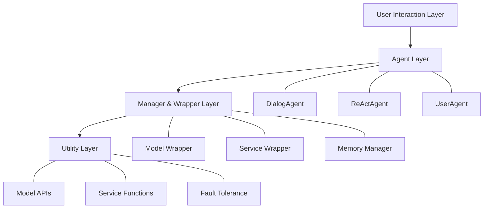
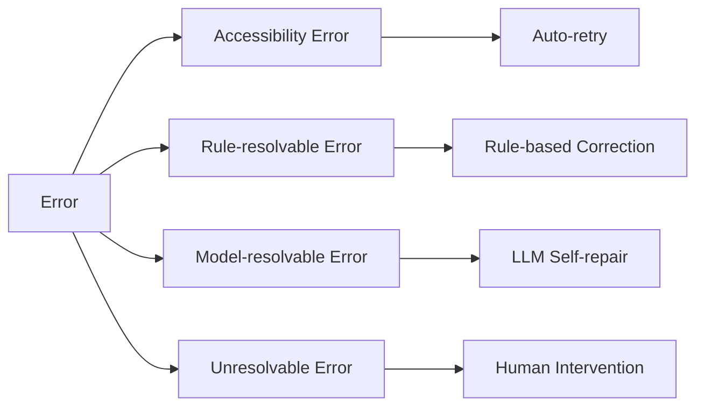

本記事は [AgentScope: A Flexible yet Robust Multi-Agent Platform](https://arxiv.org/abs/2402.14034) の解説記事です。

## 論文概要（Abstract）

AgentScopeは、LLMを活用したマルチエージェントアプリケーションの開発と運用を簡素化するために設計された、開発者中心のプラットフォームである。著者らは、メッセージ交換を中核的な通信機構とし、組み込みエージェント・サービス関数・ゼロコードワークステーション・自動プロンプトチューニングを提供することで、開発と運用の障壁を下げると報告している。耐障害性機構を多層的に備え、マルチモーダルデータ・ツール・外部知識の管理を体系的に支援する点が特徴である。

この記事は [Zenn記事: CrewAI本番運用の実践ガイド：テスト・チェックポイント・コスト制御の実装](https://zenn.dev/0h_n0/articles/123b708fa66ec6) の深掘りです。

## 情報源

- **arXiv ID**: 2402.14034
- **URL**: [https://arxiv.org/abs/2402.14034](https://arxiv.org/abs/2402.14034)
- **著者**: Dawei Gao, Zitao Li, Weirui Kuang et al.（Alibaba Group）
- **発表年**: 2024（v1: 2024年2月、v2: 2024年5月）
- **分野**: cs.MA（Multiagent Systems）, cs.AI（Artificial Intelligence）
- **GitHub**: [https://github.com/modelscope/agentscope](https://github.com/modelscope/agentscope)（26.6k stars, 2026年6月時点）

## 背景と動機（Background & Motivation）

LLMの急速な進歩に伴い、マルチエージェントアプリケーションへの関心が高まっている。しかし、単一エージェントの開発と異なり、マルチエージェントシステムには固有の課題がある。著者らは以下の4つを主要課題として挙げている。

第1に、**エージェント間の協調の複雑さ**である。複数のエージェントに異なるモデル・設定を割り当て、SOPや動的ワークフローを管理し、1対1・ブロードキャスト等の多様な通信パターンを扱う必要がある。第2に、**LLMの信頼性の問題**である。ハルシネーション・指示不遵守の問題が依然として存在し、ツール呼び出し時のエラーがシステム全体にカスケードする危険がある。第3に、**マルチモーダル・ツール統合の複雑さ**があり、画像・動画の生成と処理、外部ナレッジバンクの管理を体系的に扱う仕組みが必要である。第4に、**分散デプロイの障壁**があり、開発者に分散システムプログラミングの専門知識を要求する現状がある。

CrewAIをはじめとする既存のフレームワークも同様の課題に取り組んでいるが、AgentScopeは特に耐障害性と分散実行の容易さに注力している点で差別化を図っている。

## 主要な貢献（Key Contributions）

著者らは以下の貢献を報告している。

- **メッセージ交換ベースの通信機構**: Python辞書形式のメッセージ（`name`, `content`, `url`フィールド）にUUIDとタイムスタンプを付与し、トレーサビリティを確保
- **多層的な耐障害性**: サービス層のリトライ、ルールベース補正、LLMによる自己修復、エージェントレベルの批判機構を段階的に提供
- **Actorベース分散フレームワーク**: プレースホルダメッセージによるノンブロッキング通信で、静的グラフなしに自動並列化を実現
- **ゼロコードワークステーション**: ドラッグ&ドロップのDAGエディタでマルチエージェントアプリケーションを構築可能
- **統合的なマルチモーダル・RAG・ツール支援**: URLベースの遅延読み込み、ナレッジバンク、サービスツールキットを一体的に提供

## 技術的詳細（Technical Details）

### アーキテクチャ

AgentScopeは3層構造とユーザインタフェース層で構成される。以下にアーキテクチャの全体像を示す。



**Utility Layer（基盤層）** は、モデルAPI呼び出しとサービス関数を提供し、自律的なリトライ機構を内蔵する。**Manager & Wrapper Layer（管理層）** は、リソースとAPIを仲介し、デフォルトハンドラとカスタマイズ可能なインタフェースを併せ持つ。**Agent Layer（エージェント層）** は、ワークフロー構築の骨格であり、Pipeline抽象とMessage Hubによって複雑なエージェント間通信を簡潔に記述できる。

### Pipeline機構

Pipelineはエージェント間のメッセージ伝達パターンを抽象化し、反復的なコーディングを削減する。著者らは3種類のPipelineを定義している。

- **Sequential Pipeline**: エージェントが順番にメッセージを処理
- **Conditional Pipeline**: if-else・switchベースの条件分岐
- **Iterative Pipeline**: while-loop・for-loopによる繰り返し処理

これらは関数型・オブジェクト指向のどちらのスタイルでも利用できる。

### 耐障害性（Fault Tolerance）

AgentScopeの耐障害性は、エラーの性質に応じた4段階の分類と対応する処理機構から成る。



**Accessibility Error（アクセス障害）**: モデルのタイムアウトやネットワーク切断など、一時的なサービス不可。最大リトライ回数を設定したリトライ機構で自動復旧を試みる。

**Rule-resolvable Error（ルール解決可能エラー）**: LLM応答のフォーマット違反（JSONの括弧不足、不正な構造）。AgentScopeはデフォルトのルールセットを適用して括弧の補完やJSON抽出を行い、追加のAPI呼び出しコストなしに修正する。

**Model-resolvable Error（モデル解決可能エラー）**: 引数エラーや意味エラーなど、内容レベルの問題。LLMとの追加対話によって検出・回復する。開発者は`parse_func`、`fault_handler`、`max_retries`パラメータでカスタマイズ可能である。

**Unresolvable Error（解決不能エラー）**: APIキーの失効など、人間の介入が必要なケース。

この多層的な設計は、CrewAIの記事で触れたチェックポイント・リトライ戦略とも共通する考え方であり、マルチエージェントシステムの本番運用において不可欠な要素である。

### 分散実行：Actorモデル

AgentScopeの分散実行はActorモデルに基づいている。各エージェントは独立したActorとして動作し、メッセージの受信をトリガーとして計算を行う。

著者らが報告する重要な技術的貢献は**Placeholder Message（プレースホルダメッセージ）** である。分散環境では、あるエージェントの出力が別のエージェントの入力となるが、非同期実行のためにメッセージの実値が確定するまで待機するとブロッキングが発生する。プレースホルダメッセージは、実値の代わりに「後で値を取得するための情報」を保持し、メインプロセスをブロックせずに処理を継続できる。

```python
from agentscope.agents import DialogAgent
from agentscope.msghub import msghub

def setup_distributed_agents(
    agent_configs: list[dict],
) -> list[DialogAgent]:
    """分散エージェントを設定する

    Args:
        agent_configs: エージェント設定のリスト。
            各dictは name, model_config_name, sys_prompt を含む。

    Returns:
        設定済みエージェントのリスト
    """
    agents = []
    for config in agent_configs:
        agent = DialogAgent(
            name=config["name"],
            model_config_name=config["model_config_name"],
            sys_prompt=config["sys_prompt"],
        ).to_dist()  # .to_dist() で分散モードに切り替え
        agents.append(agent)
    return agents
```

上記のように、`.to_dist()` を呼ぶだけでローカルエージェントを分散エージェントに変換できる。著者らは、この設計により「単一の手続き型スタイルのPython関数内」で分散プログラミングが完結すると述べている。

### サービス関数とツール

AgentScopeはサービス関数（Service Functions）とツール（Tools）を明確に区別している。サービス関数は`ServiceResponse`を返すAPI群であり、ツールはサービス関数にLLM向けの機能説明と入力パラメータを付加したものである。

この分離は、LLMがサービス関数の機能を正確に理解できない場合や、APIキーのようなパラメータをLLMが充填できない場合に有効である。ReActパターンに基づく4段階のツール使用プロセス（関数準備 → 指示準備 → 反復推論 → 反復実行）を提供している。

## 実装のポイント（Implementation）

AgentScopeは`pip install agentscope`でインストールできる（Python 3.11+が必要、2026年6月時点のv2.0.1）。

```python
import agentscope
from agentscope.agents import DialogAgent, UserAgent

def run_simple_conversation() -> None:
    """AgentScopeを使った基本的な対話の例

    model_configsにはモデルのAPI設定を記述する。
    OpenAI互換のAPIであれば model_type: "openai_chat" を指定する。
    """
    agentscope.init(
        model_configs={
            "config_name": "my_model",
            "model_type": "openai_chat",
            "model_name": "gpt-4o",
            "api_key": "YOUR_API_KEY",
        }
    )
    user = UserAgent(name="User")
    assistant = DialogAgent(
        name="Assistant",
        model_config_name="my_model",
        sys_prompt="You are a helpful assistant.",
    )
    msg = user()
    while True:
        msg = assistant(msg)
        msg = user(msg)
```

CrewAIと比較すると、AgentScopeは以下の点で設計思想が異なる。

- **通信機構**: CrewAIはTask/Crew単位のオーケストレーション、AgentScopeはメッセージ交換ベース
- **耐障害性**: CrewAIは外部ライブラリ（tenacity等）に委任する傾向、AgentScopeは4段階のビルトイン機構
- **分散実行**: CrewAIはシングルプロセスが基本、AgentScopeはActorモデルによるネイティブ分散
- **ゼロコード**: AgentScopeはDAGベースのワークステーションを内蔵

## Production Deployment Guide

AgentScopeは公式リポジトリに実装コードとサンプルアプリケーションを提供しており、本番環境へのデプロイを想定した設計となっている。以下ではAWS上でマルチエージェントプラットフォームを運用するための構成パターンを示す。

なお、以下のコスト試算は2026年6月時点のAWS東京リージョン（ap-northeast-1）の公開料金に基づく概算値である。実際のコストはトラフィックパターン、リージョン、バースト使用量により変動するため、最新料金はAWS料金計算ツールで確認を推奨する。

### AWS実装パターン（コスト最適化重視）

| 項目 | Small (~100 req/日) | Medium (~1,000 req/日) | Large (10,000+ req/日) |
|------|---------------------|------------------------|------------------------|
| **構成** | Lambda + DynamoDB | ECS Fargate + ElastiCache | EKS + Karpenter + Spot |
| **コンピュート** | Lambda 512MB | Fargate 2vCPU/4GB x2 | EKS m5.xlarge x3 (Spot) |
| **状態管理** | DynamoDB On-Demand | ElastiCache r6g.medium | Redis on EKS + EBS |
| **LLM** | Bedrock API直接呼出 | Bedrock + Prompt Caching | Bedrock Batch + Caching |
| **月額概算** | $50-150 | $300-800 | $2,000-5,000 |
| **エージェント数** | 1-3 | 5-10 | 10-50+ |
| **耐障害性** | Lambda再試行 + DLQ | ECS自動復旧 + Circuit Breaker | Pod自動再起動 + HPA |

**コスト削減テクニック**:
- Spot Instancesの活用でEC2コストを最大90%削減（EKS Large構成）
- Reserved Instances（1年コミット）でオンデマンド比最大72%削減
- Bedrock Batch APIで非リアルタイム処理のコストを50%削減
- Prompt Caching有効化でトークンコストを30-90%削減

### Terraformインフラコード

**Small構成（Serverless: Lambda + DynamoDB）**

```hcl
# AgentScope Small構成 - Serverless
# 月額概算: $50-150（2026年6月時点、東京リージョン）

terraform {
  required_version = ">= 1.9"
  required_providers {
    aws = {
      source  = "hashicorp/aws"
      version = "~> 5.80"
    }
  }
}

provider "aws" {
  region = "ap-northeast-1"
}

# --- IAMロール（最小権限） ---
resource "aws_iam_role" "agentscope_lambda" {
  name = "agentscope-lambda-role"
  assume_role_policy = jsonencode({
    Version = "2012-10-17"
    Statement = [{
      Action = "sts:AssumeRole"
      Effect = "Allow"
      Principal = { Service = "lambda.amazonaws.com" }
    }]
  })
}

resource "aws_iam_role_policy" "lambda_policy" {
  name = "agentscope-lambda-policy"
  role = aws_iam_role.agentscope_lambda.id
  policy = jsonencode({
    Version = "2012-10-17"
    Statement = [
      {
        Effect   = "Allow"
        Action   = ["bedrock:InvokeModel", "bedrock:InvokeModelWithResponseStream"]
        Resource = "arn:aws:bedrock:ap-northeast-1::foundation-model/*"
      },
      {
        Effect   = "Allow"
        Action   = ["dynamodb:GetItem", "dynamodb:PutItem", "dynamodb:Query", "dynamodb:UpdateItem"]
        Resource = aws_dynamodb_table.agent_state.arn
      },
      {
        Effect   = "Allow"
        Action   = ["logs:CreateLogGroup", "logs:CreateLogStream", "logs:PutLogEvents"]
        Resource = "arn:aws:logs:ap-northeast-1:*:*"
      },
      {
        # X-Rayトレーシング用
        Effect   = "Allow"
        Action   = ["xray:PutTraceSegments", "xray:PutTelemetryRecords"]
        Resource = "*"
      }
    ]
  })
}

# --- DynamoDB（エージェント状態管理） ---
resource "aws_dynamodb_table" "agent_state" {
  name         = "agentscope-agent-state"
  billing_mode = "PAY_PER_REQUEST" # On-Demandでコスト最適化
  hash_key     = "session_id"
  range_key    = "agent_name"

  attribute {
    name = "session_id"
    type = "S"
  }
  attribute {
    name = "agent_name"
    type = "S"
  }

  ttl {
    attribute_name = "expires_at"
    enabled        = true # 古いセッションを自動削除
  }

  server_side_encryption {
    enabled = true # KMS暗号化
  }
}

# --- Lambda関数 ---
resource "aws_lambda_function" "agentscope" {
  function_name = "agentscope-handler"
  runtime       = "python3.12"
  handler       = "main.handler"
  role          = aws_iam_role.agentscope_lambda.arn
  timeout       = 300      # マルチエージェント処理は長時間
  memory_size   = 512      # AgentScope最小推奨メモリ

  filename         = "lambda_package.zip"
  source_code_hash = filebase64sha256("lambda_package.zip")

  environment {
    variables = {
      DYNAMODB_TABLE = aws_dynamodb_table.agent_state.name
      LOG_LEVEL      = "INFO"
    }
  }

  tracing_config {
    mode = "Active" # X-Ray有効化
  }
}

# --- CloudWatchアラーム（コスト監視） ---
resource "aws_cloudwatch_metric_alarm" "lambda_duration" {
  alarm_name          = "agentscope-lambda-duration-high"
  comparison_operator = "GreaterThanThreshold"
  evaluation_periods  = 3
  metric_name         = "Duration"
  namespace           = "AWS/Lambda"
  period              = 300
  statistic           = "Average"
  threshold           = 250000 # 250秒（タイムアウト300秒の83%）
  alarm_actions       = [] # SNS ARNを設定
  dimensions = {
    FunctionName = aws_lambda_function.agentscope.function_name
  }
}
```

**Large構成（Container: EKS + Karpenter + Spot）**

```hcl
# AgentScope Large構成 - EKS + Karpenter
# 月額概算: $2,000-5,000（2026年6月時点、東京リージョン）

module "eks" {
  source  = "terraform-aws-modules/eks/aws"
  version = "~> 20.30"

  cluster_name    = "agentscope-cluster"
  cluster_version = "1.31"

  vpc_id     = module.vpc.vpc_id
  subnet_ids = module.vpc.private_subnets

  cluster_endpoint_public_access = false # プライベートアクセスのみ

  eks_managed_node_groups = {
    # システムノード（On-Demand、常時稼働）
    system = {
      instance_types = ["m5.large"]
      min_size       = 1
      max_size       = 2
      desired_size   = 1
      labels = { "role" = "system" }
    }
  }
}

# --- Karpenter Provisioner（Spot優先） ---
resource "kubectl_manifest" "karpenter_nodepool" {
  yaml_body = <<-YAML
    apiVersion: karpenter.sh/v1
    kind: NodePool
    metadata:
      name: agentscope-agents
    spec:
      template:
        spec:
          requirements:
            - key: karpenter.sh/capacity-type
              operator: In
              values: ["spot", "on-demand"]  # Spot優先
            - key: node.kubernetes.io/instance-type
              operator: In
              values: ["m5.xlarge", "m5.2xlarge", "m6i.xlarge", "m6i.2xlarge"]
          nodeClassRef:
            group: karpenter.k8s.aws
            kind: EC2NodeClass
            name: default
      limits:
        cpu: "64"
        memory: "256Gi"
      disruption:
        consolidationPolicy: WhenEmptyOrUnderutilized
        consolidateAfter: 60s
  YAML
}

# --- Secrets Manager（LLM API設定） ---
resource "aws_secretsmanager_secret" "bedrock_config" {
  name       = "agentscope/bedrock-config"
  kms_key_id = aws_kms_key.agentscope.arn
}

# --- KMS暗号化キー ---
resource "aws_kms_key" "agentscope" {
  description         = "AgentScope encryption key"
  enable_key_rotation = true
}

# --- AWS Budgets（予算アラート） ---
resource "aws_budgets_budget" "monthly" {
  name         = "agentscope-monthly-budget"
  budget_type  = "COST"
  limit_amount = "5000"
  limit_unit   = "USD"
  time_unit    = "MONTHLY"

  notification {
    comparison_operator       = "GREATER_THAN"
    threshold                 = 80
    threshold_type            = "PERCENTAGE"
    notification_type         = "ACTUAL"
    subscriber_email_addresses = ["ops-team@example.com"]
  }
  notification {
    comparison_operator       = "GREATER_THAN"
    threshold                 = 100
    threshold_type            = "PERCENTAGE"
    notification_type         = "FORECASTED"
    subscriber_email_addresses = ["ops-team@example.com"]
  }
}
```

### 運用・監視設定

**CloudWatch Logs Insightsクエリ（コスト異常検知）**

```
fields @timestamp, @message
| filter @message like /bedrock/
| stats sum(token_count) as total_tokens by bin(1h)
| sort total_tokens desc
| limit 24
```

**CloudWatchアラーム設定（Python）**

```python
import boto3

def create_token_spike_alarm(
    function_name: str,
    sns_topic_arn: str,
    threshold: float = 100000,
) -> dict:
    """Bedrockトークン使用量スパイク検知アラームを作成する

    Args:
        function_name: 監視対象のLambda関数名
        sns_topic_arn: 通知先SNSトピックのARN
        threshold: トークン数の閾値（デフォルト: 100,000）

    Returns:
        CloudWatch APIのレスポンス
    """
    cw = boto3.client("cloudwatch", region_name="ap-northeast-1")
    return cw.put_metric_alarm(
        AlarmName=f"{function_name}-token-spike",
        MetricName="InputTokenCount",
        Namespace="AWS/Bedrock",
        Statistic="Sum",
        Period=3600,
        EvaluationPeriods=1,
        Threshold=threshold,
        ComparisonOperator="GreaterThanThreshold",
        AlarmActions=[sns_topic_arn],
    )
```

**X-Rayトレーシング設定（Python）**

```python
from aws_xray_sdk.core import xray_recorder, patch_all
import boto3

def init_xray_tracing(service_name: str = "agentscope") -> None:
    """X-Rayトレーシングを初期化する

    Args:
        service_name: X-Rayサービス名
    """
    xray_recorder.configure(service=service_name)
    patch_all()  # boto3等を自動計装

@xray_recorder.capture("agent_execution")
def execute_agent_task(
    session_id: str,
    agent_name: str,
    message: str,
) -> dict:
    """エージェントタスク実行をX-Rayでトレースする

    Args:
        session_id: セッション識別子
        agent_name: 実行するエージェント名
        message: 入力メッセージ

    Returns:
        エージェントの応答を含むdict
    """
    subsegment = xray_recorder.current_subsegment()
    subsegment.put_annotation("session_id", session_id)
    subsegment.put_annotation("agent_name", agent_name)
    subsegment.put_metadata("input_length", len(message))

    # AgentScope実行（省略）
    result = {"response": "..."}

    subsegment.put_metadata("output_length", len(result["response"]))
    return result
```

**Cost Explorer自動レポート（Python）**

```python
import boto3
from datetime import datetime, timedelta

def get_daily_cost_report(
    threshold_usd: float = 100.0,
    sns_topic_arn: str | None = None,
) -> dict:
    """日次コストレポートを取得し、閾値超過時にSNS通知する

    Args:
        threshold_usd: 日次コスト閾値（USD）
        sns_topic_arn: 通知先SNSトピックARN（Noneで通知なし）

    Returns:
        サービス別コスト内訳
    """
    ce = boto3.client("ce", region_name="us-east-1")
    today = datetime.utcnow().strftime("%Y-%m-%d")
    yesterday = (datetime.utcnow() - timedelta(days=1)).strftime("%Y-%m-%d")

    response = ce.get_cost_and_usage(
        TimePeriod={"Start": yesterday, "End": today},
        Granularity="DAILY",
        Metrics=["UnblendedCost"],
        Filter={
            "Tags": {
                "Key": "Project",
                "Values": ["agentscope"],
            }
        },
        GroupBy=[{"Type": "DIMENSION", "Key": "SERVICE"}],
    )

    total = sum(
        float(g["Metrics"]["UnblendedCost"]["Amount"])
        for r in response["ResultsByTime"]
        for g in r["Groups"]
    )

    if total > threshold_usd and sns_topic_arn:
        sns = boto3.client("sns", region_name="ap-northeast-1")
        sns.publish(
            TopicArn=sns_topic_arn,
            Subject=f"AgentScope daily cost alert: ${total:.2f}",
            Message=f"Daily cost ${total:.2f} exceeded threshold ${threshold_usd}",
        )

    return {"total_usd": total, "details": response["ResultsByTime"]}
```

### コスト最適化チェックリスト

**アーキテクチャ選択**

- [ ] トラフィック量を計測し、Small/Medium/Largeの適切な構成を選択
- [ ] 非リアルタイム処理はBatch API対応のServerless構成を優先
- [ ] マルチリージョン展開の必要性を検討

**リソース最適化**

- [ ] EC2/EKSノード: Spot Instancesを優先（Karpenterで自動管理）
- [ ] Reserved Instances: 安定稼働部分は1年コミットで最大72%削減
- [ ] Savings Plans: コンピュート全体でのコミットメント割引を検討
- [ ] Lambda: メモリサイズを128MB刻みで最適化（Power Tuning実施）
- [ ] ECS/EKS: アイドル時のスケールダウン設定（min_replicas=0検討）
- [ ] NAT Gateway: VPCエンドポイントでBedrock/DynamoDB通信をプライベート化

**LLMコスト削減**

- [ ] Bedrock Batch APIを非同期処理に適用（50%削減）
- [ ] Prompt Cachingを有効化（反復プロンプトで30-90%削減）
- [ ] タスク複雑度に応じたモデル選択ロジック（簡単なタスクにHaiku系を使用）
- [ ] 入力トークン数の上限設定（不要な長文入力の抑制）
- [ ] レスポンスキャッシュ（同一入力に対するDynamoDB/ElastiCacheキャッシュ）

**監視・アラート**

- [ ] AWS Budgets: 月次予算アラートを80%/100%で設定
- [ ] CloudWatch アラーム: Lambda実行時間・Bedrockトークン数に設定
- [ ] Cost Anomaly Detection: 機械学習ベースの異常検知を有効化
- [ ] 日次コストレポート: Cost Explorer APIで自動取得・SNS通知
- [ ] X-Ray: エージェント間通信のレイテンシ可視化

**リソース管理**

- [ ] 未使用リソース削除: 月次で未使用EBS/ENI/EIPを棚卸し
- [ ] タグ戦略: `Project=agentscope`, `Environment=prod/dev`を全リソースに付与
- [ ] ライフサイクルポリシー: CloudWatch Logsの保持期間を30日に設定
- [ ] 開発環境夜間停止: EventBridgeで平日夜間・週末のECS/EKSスケールダウン
- [ ] ECRイメージ: ライフサイクルポリシーで古いイメージを自動削除

## 実験結果（Results）

著者らは、AgentScopeの有効性を複数のアプリケーションを通じて検証している。論文中で報告されている主な評価は以下の通りである。

**対応アプリケーション**: 基本対話、グループ会話（メンション機能付き）、人狼ゲーム（ルールベースインタラクション）、分散デプロイメント、RAGコパイロット、Web検索エージェント、ReActエージェント（自然言語からSQLへの変換）、ワークステーションによるビジュアルアプリケーション構築の8種類を実装している。

**分散実行の効率**: プレースホルダメッセージによる自動並列化により、静的グラフを用いない動的な並列実行を実現している。著者らは、LLMの動的かつ予測困難な性質（対話状態に基づいて計算グラフが変化する）に適応する設計であると報告している。

**モデル互換性**: OpenAI、HuggingFace、ModelScope、FastChat、vLLM、Flask等の主要なモデルAPIと統合され、幅広い環境で動作することが確認されている。

**エージェントテンプレート**: DialogAgent、ReActAgent、ProgrammerAgent、TextToImageAgent等の8種類の事前構築済みエージェントが提供され、開発の迅速化に寄与している（論文Table参照）。

なお、他のフレームワーク（CrewAI、AutoGen等）との定量的なベンチマーク比較は論文中では提示されていない。

## 実運用への応用（Practical Applications）

CrewAIユーザーにとって、AgentScopeから得られる示唆は以下の通りである。

**耐障害性の設計パターン**: AgentScopeの4段階エラー分類（Accessibility → Rule-resolvable → Model-resolvable → Unresolvable）は、CrewAIの本番運用においてもリトライ戦略の設計指針となる。特にRule-resolvable Errorの概念は、LLM応答のパース失敗をAPI再呼び出しなしに修復するアプローチとして、CrewAIのカスタムパーサーにも応用できる。

**分散実行の検討**: CrewAIがシングルプロセスで動作する一方、AgentScopeのActorモデルは10エージェント以上の大規模システムで有利である。10,000 req/日を超える規模では、AgentScopeの分散機構またはCrewAI + Celery等の外部分散フレームワークの導入を検討する価値がある。

**マルチモーダル対応**: URLベースの遅延読み込みは、画像・動画を扱うマルチエージェントシステムで帯域幅とメモリを効率的に管理するパターンとして参考になる。

**ゼロコード開発との併用**: AgentScopeのDAGワークステーションは、プロトタイプの迅速な構築に適しており、CrewAIでのタスク設計の前段階としてワークフローの可視化に活用できる。

## 関連研究（Related Work）

- **AutoGen** (Wu et al., 2023): Microsoftが提案するマルチエージェント会話フレームワーク。会話プログラミングパラダイムを導入したが、AgentScopeはより体系的な耐障害性機構と分散実行支援で差別化している。
- **CrewAI** (Moura, 2023): ロールベースのエージェントオーケストレーションフレームワーク。Task/Crew抽象による直感的なAPI設計が特徴であり、本Zenn記事で本番運用パターンを詳述している。
- **LangChain / LangGraph** (Chase, 2022): LLMアプリケーション開発のためのフレームワーク。LangGraphはグラフベースのエージェントワークフローを提供し、AgentScopeのPipeline機構と類似の設計思想を持つ。
- **CAMEL** (Li et al., 2023): ロールプレイングによるエージェント間コミュニケーションを研究するフレームワーク。AgentScopeのMessage Hub機構と共通する設計要素がある。

## まとめと今後の展望

AgentScopeは、マルチエージェントシステムの開発における4つの主要課題（協調の複雑さ、LLMの信頼性、マルチモーダル統合、分散デプロイ）に対して、メッセージ交換ベースの統一的なプラットフォームで応えることを目指している。特に4段階の耐障害性機構とActorベースの分散実行は、本番運用において実用的な設計パターンを提供している。

2026年6月時点でGitHub上で26.6k starsを獲得し、v2.0.1がリリースされている。v2.0ではAgent Team、マルチテナンシー、権限管理等のプロダクション向け機能が追加されており、活発な開発が続いている。CrewAIや他のフレームワークと組み合わせて、各プロジェクトの要件に応じた技術選定を行うことが望ましい。

## 参考文献

- **arXiv**: [https://arxiv.org/abs/2402.14034](https://arxiv.org/abs/2402.14034)
- **Code**: [https://github.com/modelscope/agentscope](https://github.com/modelscope/agentscope)
- **Related Zenn article**: [https://zenn.dev/0h_n0/articles/123b708fa66ec6](https://zenn.dev/0h_n0/articles/123b708fa66ec6)

---

:::message
この記事はAI（Claude Code）により自動生成されました。内容の正確性については原論文もご確認ください。
:::
