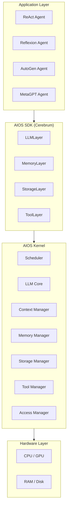

本記事は [AIOS: LLM Agent Operating System](https://arxiv.org/abs/2403.16971) の解説記事です。

## 論文概要（Abstract）

AIOSは、LLMベースのエージェントをOSのプロセスに見立て、スケジューリング・コンテキスト管理・メモリ管理・ストレージ管理・アクセス制御といったカーネルレベルの機能を提供するアーキテクチャである。著者らは、従来のエージェントフレームワークではLLMリソースの独占やリトライの非効率が課題であったと指摘し、AIOSカーネルによる一元管理でスループットが最大2.1倍向上したと報告している。本論文はCOLM 2025に採択されている。

この記事は [Zenn記事: CrewAI本番運用の実践ガイド：テスト・チェックポイント・コスト制御の実装](https://zenn.dev/0h_n0/articles/123b708fa66ec6) の深掘りです。

## 情報源

- **arXiv ID**: 2403.16971
- **URL**: [https://arxiv.org/abs/2403.16971](https://arxiv.org/abs/2403.16971)
- **著者**: Kai Mei, Xi Zhu, Wujiang Xu, Wenyue Hua et al.
- **発表年**: 2024（COLM 2025採択）
- **分野**: cs.AI, cs.OS
- **GitHub**: [https://github.com/agiresearch/AIOS](https://github.com/agiresearch/AIOS)（5.9k stars, 2026年1月時点でv0.3.0リリース）

## 背景と動機（Background & Motivation）

現在のLLMエージェントフレームワーク（LangChain、AutoGen、CrewAI等）では、各エージェントがLLMやツールといったシステムリソースに直接アクセスする。著者らは、この設計には以下の根本的な問題があると指摘している。

第一に、リソース独占の問題がある。あるエージェントがLLMにリクエストを大量送信すると、他のエージェントは待機を強いられる。第二に、GPUメモリ管理の非効率がある。プロンプトがテンソルに変換されGPUメモリにロードされる際、CUDAメモリの上限に達して例外が発生し、複数回のリトライが必要になる。

これはOSの歴史における「バッチ処理からタイムシェアリングへの進化」と類似した課題であり、AIOSはLLMエージェント向けのプロセス管理機構をカーネルレベルで提供することでこの問題に取り組んでいる。

CrewAIの`CheckpointConfig`がタスクレベルの状態保存（完了タスクのスキップと再開）を提供するのに対し、AIOSはLLM推論そのものの中間状態をスナップショットとして保存・復元する点で、抽象化のレイヤが異なる。CrewAIが「タスクの途中から再開」であれば、AIOSは「トークン生成の途中から再開」に相当する。

## 主要な貢献（Key Contributions）

- **LLMカーネルアーキテクチャ**: LLMインスタンスをCPUコアに見立て、OSカーネルと一体化したAIOSカーネルの設計
- **エージェントスケジューラ**: FIFO・Round Robinによるシステムコールレベルのスケジューリング機構
- **コンテキストスナップショット**: LLM推論の中間状態（ロジット・探索木）を保存・復元し、タイムスライスを実現
- **メモリ管理**: LRU-Kエビクションポリシーによるエージェントランタイムメモリの効率的管理
- **アクセス制御**: 特権グループベースのエージェント間データアクセス制御と、破壊的操作へのユーザ介入機構
- **AIOS SDK（Cerebrum）**: ReAct、Reflexion、AutoGen、MetaGPT等の既存フレームワークをAIOSカーネル上でシームレスに動作させるSDK

## 技術的詳細（Technical Details）

### AIOSカーネルアーキテクチャ

AIOSは3層アーキテクチャを採用している。



著者らはLLMインスタンスを「CPUコアに類似した"LLMコア"」と位置付けている。LLMAdapterクラスがOpenAI、Anthropic、Google、Groq、HuggingFace、vLLM、Ollama等のバックエンドに対する統一インタフェースを提供する。

### スケジューリングアルゴリズム

AIOSはエージェントからのシステムコールを集中キューで管理し、以下の2つのスケジューリング戦略を実装している。

**FIFO（First-In-First-Out）**: 到着順にシステムコールを処理する。実装は単純だが、長時間のLLM推論が後続リクエストの待機時間を増大させる。

エージェント $a_i$ のシステムコール $s_{i,j}$ の待機時間は以下で表される:

$$
W(s_{i,j}) = \sum_{k \in Q(s_{i,j})} T_{\text{exec}}(s_k)
$$

ここで、
- $W(s_{i,j})$: エージェント $a_i$ の $j$ 番目のシステムコールの待機時間
- $Q(s_{i,j})$: $s_{i,j}$ より前にキューに入っているシステムコールの集合
- $T_{\text{exec}}(s_k)$: システムコール $s_k$ の実行時間

**Round Robin（RR）**: タイムスライスで各システムコールに均等にLLMリソースを割り当てる。コンテキスト中断機構と組み合わせることで、LLM推論を途中で中断・再開できる。

RRにおけるエージェント $a_i$ の平均待機時間は:

$$
\bar{W}_{\text{RR}}(a_i) = \frac{1}{|S_i|} \sum_{j=1}^{|S_i|} \min\left(W_{\text{FIFO}}(s_{i,j}),\; (n-1) \cdot \Delta t\right)
$$

ここで、
- $|S_i|$: エージェント $a_i$ のシステムコール総数
- $n$: 同時実行中のエージェント数
- $\Delta t$: タイムスライスの長さ

### コンテキストスナップショット機構

Round Robinスケジューリングを実現するには、LLM推論を途中で中断・再開する仕組みが必要になる。著者らは2つのアプローチを提案している。

**テキストベーススナップショット**（閉ソースモデル向け）: ストリーミングレスポンスを途中でキャプチャし、再開時に既生成テキストをプロンプトに連結して推論を継続する。

**ロジットベーススナップショット**（オープンソースモデル向け）: ビームサーチの中間探索木構造を保存する。ビーム幅 $b=1$（グリーディサーチ）の場合を例にとると、トークン位置 $t$ で中断された際に状態ベクトル $\mathbf{h}_t$ と生成済みトークン列 $[y_1, \ldots, y_t]$ をスナップショットとして保存し、再開時に $y_{t+1}$ から生成を継続する。冗長な再計算を排除できるため、テキストベースより効率的である。

### メモリ管理: LRU-Kエビクション

エージェントのランタイムメモリ（会話ログ、ツール実行結果等）はRAM上で管理される。メモリ使用量が割当ブロックの80%を超過すると、LRU-Kエビクションが発動する。

$$
\text{score}(m) = \begin{cases}
-\infty & \text{if } \text{access\_count}(m) < K \\
t_{\text{now}} - t_K(m) & \text{otherwise}
\end{cases}
$$

ここで、
- $m$: メモリアイテム
- $K$: LRU-Kのパラメータ（直近K回のアクセスを考慮）
- $t_K(m)$: アイテム $m$ のK回前のアクセス時刻
- $\text{access\_count}(m)$: アイテム $m$ の総アクセス回数

スコアが最大のアイテム（最も長くアクセスされていないもの）からディスクへ転送される。K回未満のアクセスしかないアイテムは最優先でエビクションされる。

## 実装のポイント（Implementation）

AIOS SDK（Cerebrum）を使用したエージェント定義の基本構造を以下に示す。

```python
from cerebrum.llm.layer import LLMLayer
from cerebrum.memory.layer import MemoryLayer
from cerebrum.storage.layer import StorageLayer
from cerebrum.tool.layer import ToolLayer


def create_aios_client(
    llm_name: str = "gpt-4o-mini",
    llm_backend: str = "openai",
    memory_limit: int = 104_857_600,
    storage_root: str = "root",
) -> "AIOSClient":
    """AIOSカーネルに接続するクライアントを構築する。

    Args:
        llm_name: 使用するLLMモデル名
        llm_backend: LLMバックエンド（openai, anthropic, vllm等）
        memory_limit: メモリ上限（バイト単位、デフォルト100MB）
        storage_root: ストレージルートディレクトリ

    Returns:
        構成済みのAIOSクライアント
    """
    client = AIOSClient()
    client.add_llm_layer(
        LLMLayer(llm_name=llm_name, llm_backend=llm_backend)
    ).add_storage_layer(
        StorageLayer(root_dir=storage_root)
    ).add_memory_layer(
        MemoryLayer(memory_limit=memory_limit)
    ).add_tool_layer(
        ToolLayer()
    )
    return client
```

エージェントの定義は `config.json` と `entry.py` で構成される。`config.json` にエージェントのメタデータと使用ツールを記述し、`entry.py` にロジックを実装する。カーネル起動は `bash runtime/launch_kernel.sh` で行い、エージェント実行は `run-agent --mode local --agent_path <path> --task <task>` で行う。

**CrewAIの`from_checkpoint`との比較**: CrewAIは `CheckpointConfig(restore_from="path/to/checkpoint.json")` を `crew.kickoff()` に渡すことで、完了済みタスクをスキップして未完了タスクから再開する。一方、AIOSのコンテキストスナップショットはLLM推論のトークンレベルで中断・再開を行う。CrewAIがアプリケーション層のチェックポイント、AIOSがカーネル層のコンテキストスイッチという位置付けであり、両者は補完的に利用できる。

## Production Deployment Guide

AIOSカーネルをプロダクション環境にデプロイする際のAWS構成を解説する。AIOSはuvicornサーバとして起動し、エージェントからのシステムコールをHTTP APIで受け付けるため、コンテナ化との親和性が高い。

> 以下のコスト試算は2026年6月時点のAWS ap-northeast-1（東京）リージョンにおける概算値です。実際のコストはトラフィックパターン、リージョン、バースト使用量により変動します。最新料金は [AWS料金計算ツール](https://calculator.aws/) で確認してください。

### AWS実装パターン（コスト最適化重視）

| 項目 | Small (~100 req/日) | Medium (~1,000 req/日) | Large (10,000+ req/日) |
|------|---------------------|------------------------|------------------------|
| **コンピュート** | Lambda + API Gateway | ECS Fargate (2 vCPU, 4GB) | EKS + Karpenter + Spot |
| **LLM** | Bedrock (Claude Haiku) | Bedrock (Claude Sonnet) | vLLM on g5.xlarge Spot |
| **状態管理** | DynamoDB On-Demand | DynamoDB Provisioned + DAX | ElastiCache Redis + S3 |
| **スケジューラキュー** | SQS Standard | SQS FIFO | Amazon MQ (RabbitMQ) |
| **コンテキスト保存** | S3 Standard | S3 + EFS | EFS + NVMe (ローカル) |
| **月額概算** | $50-150 | $300-800 | $2,000-5,000 |

**Small構成の内訳**: Lambda ($5-15) + API Gateway ($3-10) + DynamoDB ($5-25) + S3 ($1-3) + Bedrock トークン費 ($30-100) = 合計 $50-150/月

**Medium構成の内訳**: ECS Fargate ($50-120) + ALB ($20-30) + DynamoDB Provisioned ($30-60) + DAX ($50-80) + EFS ($10-20) + Bedrock ($100-400) = 合計 $300-800/月

**Large構成の内訳**: EKS コントロールプレーン ($73) + g5.xlarge Spot x2-4台 ($300-800) + ElastiCache ($150-300) + S3/EFS ($30-50) + データ転送 ($50-100) + ALB ($30-50) = 合計 $2,000-5,000/月。Spot Instancesの活用でオンデマンド比最大90%のコスト削減が可能。

**コスト削減テクニック**:
- Spot Instances: g5.xlarge のオンデマンド $1.006/h に対しSpot $0.30-0.40/h（約60-70%削減）
- Reserved Instances: 1年全前払いで最大72%削減
- Bedrock Batch API: 非同期バッチ処理で50%削減
- Prompt Caching: Bedrock のプロンプトキャッシュ有効化で30-90%削減

### Terraformインフラコード

**Small構成（Serverless）: Lambda + DynamoDB**

```hcl
# --- Small構成: AIOS Agent Gateway (Serverless) ---
# コスト目安: $50-150/月

terraform {
  required_version = ">= 1.9"
  required_providers {
    aws = { source = "hashicorp/aws", version = "~> 5.80" }
  }
}

provider "aws" {
  region = "ap-northeast-1"
}

# --- DynamoDB: エージェント状態・コンテキスト保存 ---
resource "aws_dynamodb_table" "agent_state" {
  name         = "aios-agent-state"
  billing_mode = "PAY_PER_REQUEST" # On-Demand: 低トラフィック時にコスト最適
  hash_key     = "agent_id"
  range_key    = "snapshot_ts"

  attribute {
    name = "agent_id"
    type = "S"
  }
  attribute {
    name = "snapshot_ts"
    type = "N"
  }

  ttl {
    attribute_name = "expires_at"
    enabled        = true # 古いスナップショット自動削除でコスト削減
  }

  server_side_encryption {
    enabled = true # KMS暗号化
  }

  point_in_time_recovery {
    enabled = true
  }
}

# --- IAMロール: 最小権限の原則 ---
resource "aws_iam_role" "lambda_aios" {
  name = "aios-lambda-role"
  assume_role_policy = jsonencode({
    Version = "2012-10-17"
    Statement = [{
      Action = "sts:AssumeRole"
      Effect = "Allow"
      Principal = { Service = "lambda.amazonaws.com" }
    }]
  })
}

resource "aws_iam_role_policy" "lambda_aios_policy" {
  name = "aios-lambda-policy"
  role = aws_iam_role.lambda_aios.id
  policy = jsonencode({
    Version = "2012-10-17"
    Statement = [
      {
        Effect   = "Allow"
        Action   = ["dynamodb:GetItem", "dynamodb:PutItem", "dynamodb:Query", "dynamodb:UpdateItem"]
        Resource = aws_dynamodb_table.agent_state.arn
      },
      {
        Effect   = "Allow"
        Action   = ["bedrock:InvokeModel", "bedrock:InvokeModelWithResponseStream"]
        Resource = "arn:aws:bedrock:ap-northeast-1::foundation-model/*"
      },
      {
        Effect   = "Allow"
        Action   = ["logs:CreateLogGroup", "logs:CreateLogStream", "logs:PutLogEvents"]
        Resource = "arn:aws:logs:ap-northeast-1:*:*"
      }
    ]
  })
}

# --- Lambda関数: AIOSエージェントゲートウェイ ---
resource "aws_lambda_function" "aios_gateway" {
  function_name = "aios-agent-gateway"
  runtime       = "python3.11"
  handler       = "handler.lambda_handler"
  role          = aws_iam_role.lambda_aios.arn
  timeout       = 300 # LLM推論のため5分に設定
  memory_size   = 1024

  filename         = "lambda_package.zip"
  source_code_hash = filebase64sha256("lambda_package.zip")

  environment {
    variables = {
      DYNAMODB_TABLE  = aws_dynamodb_table.agent_state.name
      LLM_BACKEND     = "bedrock"
      SCHEDULER_TYPE  = "fifo"
      MEMORY_LIMIT_MB = "512"
    }
  }

  tracing_config {
    mode = "Active" # X-Ray有効化
  }
}

# --- CloudWatchアラーム: コスト監視 ---
resource "aws_cloudwatch_metric_alarm" "lambda_cost" {
  alarm_name          = "aios-lambda-high-invocations"
  comparison_operator = "GreaterThanThreshold"
  evaluation_periods  = 1
  metric_name         = "Invocations"
  namespace           = "AWS/Lambda"
  period              = 86400
  statistic           = "Sum"
  threshold           = 1000 # 日次1000回超過でアラート
  alarm_description   = "AIOS Lambda invocations exceeded daily threshold"

  dimensions = {
    FunctionName = aws_lambda_function.aios_gateway.function_name
  }
}
```

**Large構成（Container）: EKS + Karpenter + Spot Instances**

```hcl
# --- Large構成: AIOS Kernel on EKS ---
# コスト目安: $2,000-5,000/月（Spot活用時）

module "eks" {
  source  = "terraform-aws-modules/eks/aws"
  version = "~> 20.31"

  cluster_name    = "aios-kernel-cluster"
  cluster_version = "1.31"

  vpc_id     = module.vpc.vpc_id
  subnet_ids = module.vpc.private_subnets

  cluster_endpoint_public_access = false # プライベートアクセスのみ

  eks_managed_node_groups = {
    system = {
      instance_types = ["m7i.large"]
      min_size       = 1
      max_size       = 3
      desired_size   = 2
      capacity_type  = "ON_DEMAND" # システムノードは安定性重視
    }
  }
}

# --- Karpenter: GPUワーカーの自動スケーリング ---
resource "kubectl_manifest" "karpenter_nodepool" {
  yaml_body = yamlencode({
    apiVersion = "karpenter.sh/v1"
    kind       = "NodePool"
    metadata   = { name = "aios-gpu-pool" }
    spec = {
      template = {
        spec = {
          requirements = [
            { key = "karpenter.sh/capacity-type", operator = "In", values = ["spot", "on-demand"] },
            { key = "node.kubernetes.io/instance-type", operator = "In", values = ["g5.xlarge", "g5.2xlarge"] },
          ]
          nodeClassRef = { name = "default" }
        }
      }
      limits   = { cpu = "64", memory = "256Gi" }
      disruption = {
        consolidationPolicy = "WhenEmptyOrUnderutilized"
        consolidateAfter    = "30s"
      }
    }
  })
}

# --- Secrets Manager: API キー管理 ---
resource "aws_secretsmanager_secret" "aios_config" {
  name        = "aios/kernel-config"
  description = "AIOS Kernel API keys and configuration"
  kms_key_id  = aws_kms_key.aios.arn
}

# --- AWS Budgets: 月次予算アラート ---
resource "aws_budgets_budget" "aios_monthly" {
  name         = "aios-monthly-budget"
  budget_type  = "COST"
  limit_amount = "5000"
  limit_unit   = "USD"
  time_unit    = "MONTHLY"

  notification {
    comparison_operator       = "GREATER_THAN"
    threshold                 = 80
    threshold_type            = "PERCENTAGE"
    notification_type         = "ACTUAL"
    subscriber_email_addresses = ["ops-team@example.com"]
  }

  notification {
    comparison_operator       = "GREATER_THAN"
    threshold                 = 100
    threshold_type            = "PERCENTAGE"
    notification_type         = "FORECASTED"
    subscriber_email_addresses = ["ops-team@example.com"]
  }
}
```

### 運用・監視設定

**CloudWatch Logs Insights: コスト異常検知**

```
fields @timestamp, agent_id, tokens_used, latency_ms
| filter tokens_used > 0
| stats sum(tokens_used) as total_tokens,
        avg(latency_ms) as avg_latency,
        percentile(latency_ms, 95) as p95_latency,
        percentile(latency_ms, 99) as p99_latency
  by bin(1h) as hour
| sort hour desc
```

**CloudWatch アラーム設定（Python）**

```python
import boto3


def create_aios_alarms(function_name: str, sns_topic_arn: str) -> None:
    """AIOSカーネル用のCloudWatchアラームを作成する。

    Args:
        function_name: Lambda関数名またはECSサービス名
        sns_topic_arn: 通知先SNSトピックARN
    """
    cw = boto3.client("cloudwatch", region_name="ap-northeast-1")

    # Bedrock トークン使用量スパイク検知
    cw.put_metric_alarm(
        AlarmName=f"aios-{function_name}-token-spike",
        MetricName="InputTokenCount",
        Namespace="AWS/Bedrock",
        Statistic="Sum",
        Period=3600,
        EvaluationPeriods=1,
        Threshold=100_000,
        ComparisonOperator="GreaterThanThreshold",
        AlarmActions=[sns_topic_arn],
    )

    # Lambda/ECS 実行時間異常検知
    cw.put_metric_alarm(
        AlarmName=f"aios-{function_name}-high-duration",
        MetricName="Duration",
        Namespace="AWS/Lambda",
        Statistic="p99",
        Period=300,
        EvaluationPeriods=3,
        Threshold=280_000,  # 280秒（タイムアウト300秒の93%）
        ComparisonOperator="GreaterThanThreshold",
        AlarmActions=[sns_topic_arn],
    )
```

**X-Ray トレーシング設定（Python）**

```python
from aws_xray_sdk.core import xray_recorder, patch_all


def init_xray_tracing(service_name: str = "aios-kernel") -> None:
    """X-Rayトレーシングを初期化する。

    Args:
        service_name: X-Rayに表示されるサービス名
    """
    xray_recorder.configure(service=service_name)
    patch_all()  # boto3, requests等を自動計装


@xray_recorder.capture("schedule_agent_call")
def schedule_agent_call(agent_id: str, syscall_type: str) -> dict:
    """エージェントのシステムコールをスケジュールし、X-Rayでトレースする。

    Args:
        agent_id: エージェント識別子
        syscall_type: システムコール種別（llm_invoke, tool_call等）

    Returns:
        スケジューリング結果
    """
    subsegment = xray_recorder.current_subsegment()
    subsegment.put_annotation("agent_id", agent_id)
    subsegment.put_annotation("syscall_type", syscall_type)
    subsegment.put_metadata("scheduler", {"type": "fifo", "queue_depth": 10})
    return {"status": "scheduled", "agent_id": agent_id}
```

**Cost Explorer 日次レポート（Python）**

```python
import datetime
import boto3


def get_daily_aios_cost(sns_topic_arn: str, threshold: float = 100.0) -> dict:
    """AIOS関連サービスの日次コストを取得し、閾値超過時にSNS通知する。

    Args:
        sns_topic_arn: 通知先SNSトピックARN
        threshold: アラート閾値（USD/日）

    Returns:
        サービス別コスト辞書
    """
    ce = boto3.client("ce", region_name="us-east-1")
    today = datetime.date.today()
    yesterday = today - datetime.timedelta(days=1)

    response = ce.get_cost_and_usage(
        TimePeriod={"Start": str(yesterday), "End": str(today)},
        Granularity="DAILY",
        Metrics=["UnblendedCost"],
        Filter={
            "Tags": {
                "Key": "Project",
                "Values": ["aios-kernel"],
            }
        },
        GroupBy=[{"Type": "DIMENSION", "Key": "SERVICE"}],
    )

    costs: dict[str, float] = {}
    total = 0.0
    for group in response["ResultsByTime"][0]["Groups"]:
        service = group["Keys"][0]
        amount = float(group["Metrics"]["UnblendedCost"]["Amount"])
        costs[service] = amount
        total += amount

    if total > threshold:
        sns = boto3.client("sns", region_name="ap-northeast-1")
        sns.publish(
            TopicArn=sns_topic_arn,
            Subject=f"AIOS Daily Cost Alert: ${total:.2f}",
            Message=f"Daily cost exceeded ${threshold}: ${total:.2f}\n{costs}",
        )

    return costs
```

### コスト最適化チェックリスト

**アーキテクチャ選択**
- [ ] トラフィック100 req/日未満ならServerless（Lambda）を選択
- [ ] 1,000 req/日前後ならHybrid（ECS Fargate）を選択
- [ ] 10,000 req/日超ならContainer（EKS）を選択
- [ ] GPUが不要な場合はBedrock APIを優先

**リソース最適化**
- [ ] GPU インスタンスはSpot Instances優先（g5.xlarge Spot: ~$0.35/h）
- [ ] Reserved Instances: 1年全前払いで最大72%削減を検討
- [ ] Savings Plans: Compute Savings Plansで柔軟に割引適用
- [ ] Lambda: メモリサイズをPower Tuningで最適化（1024MB推奨）
- [ ] ECS/EKS: Karpenter consolidationPolicyでアイドル時スケールダウン
- [ ] NAT Gateway不使用: VPCエンドポイントでS3/DynamoDBアクセス

**LLMコスト削減**
- [ ] Bedrock Batch API: 非リアルタイム処理は50%割引のバッチ利用
- [ ] Prompt Caching: 繰り返しプロンプトのキャッシュで30-90%削減
- [ ] モデル選択ロジック: 簡単なタスクはHaiku、複雑なタスクはSonnetを動的切替
- [ ] トークン数制限: max_tokensを必要最小限に設定
- [ ] コンテキストスナップショット: 中断・再開で再計算コストを排除

**監視・アラート**
- [ ] AWS Budgets: 月次予算 + 80%/100%アラート設定
- [ ] CloudWatch アラーム: トークン使用量・レイテンシ異常検知
- [ ] Cost Anomaly Detection: ML ベースの異常検知有効化
- [ ] 日次コストレポート: Cost Explorer API + SNS通知
- [ ] X-Ray: リクエストトレーシングでボトルネック特定

**リソース管理**
- [ ] 未使用リソース削除: 月次でTrusted Advisor確認
- [ ] タグ戦略: `Project=aios-kernel`, `Environment=prod/dev` 必須
- [ ] S3ライフサイクルポリシー: 30日後Glacier移行、90日後削除
- [ ] DynamoDB TTL: 古いスナップショットを自動削除
- [ ] 開発環境夜間停止: EventBridgeスケジュールでECS/EKSスケールイン

## 実験結果（Results）

著者らは3つのリサーチクエスチョンに基づき実験を行っている。

**RQ1: エージェント性能への影響**（論文Table 1より）

| ベンチマーク | フレームワーク | AIOS未使用 | AIOS使用 | 変化 |
|-------------|--------------|-----------|---------|------|
| HumanEval | ReAct | 48.8% | 50.6% | +1.8% |
| HumanEval | Reflexion | 50.6% | 51.8% | +1.2% |
| MINT (Code) | ReAct | 29.4% | 30.1% | +0.7% |
| GAIA | Autogen | 7.3% | 9.7% | +2.4% |
| SWE-Bench-Lite | Reflexion | 4.7% | 5.1% | +0.4% |

著者らは、AIOSの導入によってエージェント性能が低下することはなく、一部ケースではプロンプト最適化やコンフリクト解消機構により性能向上が見られたと報告している。

**RQ2: 実行効率**（論文Figure 6-7より）: Llama-3.1-8bでReflexionエージェントを実行した場合、AIOSのスケジューリングにより**スループットが2.1倍に向上**した。これは、スケジューラがGPUメモリにロード不可能なプロンプトを事前に排除し、不要なリトライを防止した効果であると著者らは分析している。

**RQ3: スケーラビリティ**（論文Figure 8-9より）: 同時実行エージェント数を250から2,000まで増加させた実験で、AIOSは実行時間・待機時間ともにエージェント数に対してほぼ線形の関係を維持した。AIOS未使用時との差はエージェント数の増加とともに拡大しており、高負荷環境での優位性が示されている。

## 実運用への応用（Practical Applications）

AIOSのアーキテクチャは、CrewAIやAutoGenでマルチエージェントシステムを本番運用する際の以下の課題に直接対応する。

**リソース競合の解消**: 複数のCrewが並行実行される環境で、LLM APIのレート制限に達する問題をスケジューラレベルで管理できる。CrewAIの `max_rpm` 設定がアプリケーション層の対策であるのに対し、AIOSはカーネル層で全エージェントのリクエストを一元的にスケジューリングする。

**障害復旧の高速化**: コンテキストスナップショットにより、LLM推論の中間状態が保存されるため、ノード障害時にトークンレベルで復旧できる。CrewAIの `CheckpointConfig` によるタスクレベル再開と組み合わせることで、多層的なフォールトトレランスが実現可能になる。

**コスト最適化**: Round Robinスケジューリングにより、GPUリソースの利用率を均一化し、Spot Instancesの突然のリクレームにもコンテキスト保存で対応できる。

## 関連研究（Related Work）

- **AgentScope (Gao et al., 2024)**: マルチエージェント通信プラットフォーム。エージェント間メッセージングに焦点を当てており、AIOSのようなカーネルレベルのリソース管理は提供しない。
- **AutoGen (Wu et al., 2023)**: 会話駆動型のマルチエージェントフレームワーク。AIOSはAutoGenで作成されたエージェントをそのまま取り込める互換性を持つ。
- **OS-Copilot (Wu et al., 2024)**: OS操作を自動化する汎用エージェント。OSの「上で」動作するエージェントであり、OSの「中に」組み込まれるAIOSとはアプローチが異なる。
- **MemGPT (Packer et al., 2023)**: LLMのコンテキスト窓をOS仮想メモリに見立てたメモリ管理手法。AIOSのメモリマネージャはMemGPTの概念を包含しつつ、スケジューリング・アクセス制御と統合している。

## まとめと今後の展望

AIOSは、LLMエージェントの実行環境をOSカーネルとして再設計する試みであり、スケジューリング・コンテキスト管理・メモリ管理・アクセス制御を統合的に提供する。著者らは性能を維持しつつ最大2.1倍のスループット向上とスケーラビリティの確保を達成したと報告している。CrewAIのようなアプリケーション層フレームワークと補完的に利用することで、本番環境でのマルチエージェントシステムの信頼性とコスト効率を向上させる可能性がある。今後は、分散カーネルやGPUメモリの仮想化、エージェント間のより細粒度なアクセス制御などが研究課題として挙げられている。

## 参考文献

- **arXiv**: [https://arxiv.org/abs/2403.16971](https://arxiv.org/abs/2403.16971)
- **Code**: [https://github.com/agiresearch/AIOS](https://github.com/agiresearch/AIOS)
- **AIOS SDK (Cerebrum)**: [https://github.com/agiresearch/Cerebrum](https://github.com/agiresearch/Cerebrum)
- **COLM 2025**: [https://openreview.net/forum?id=L4HHkCDz2x](https://openreview.net/forum?id=L4HHkCDz2x)
- **Related Zenn article**: [https://zenn.dev/0h_n0/articles/123b708fa66ec6](https://zenn.dev/0h_n0/articles/123b708fa66ec6)

---

*本記事はAI（Claude）によって自動生成されました。論文の内容に基づいて記述していますが、解釈の誤りがある可能性があります。正確な情報は原論文を参照してください。*
