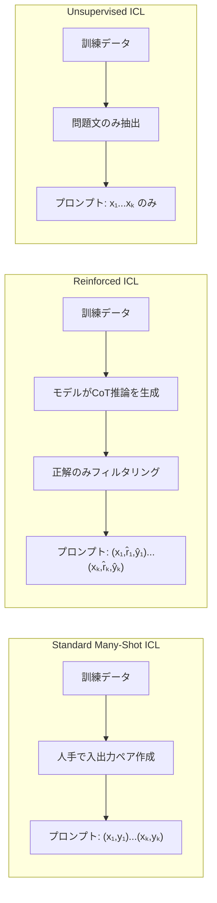

## 論文概要（Abstract）

本記事は [Many-Shot In-Context Learning](https://arxiv.org/abs/2404.11018)（arXiv: 2404.11018）の解説記事です。

著者らは、Gemini 1.5 Proの100万トークンコンテキストウィンドウを活用し、数百から数千のデモンストレーション例をプロンプトに含める**Many-Shot In-Context Learning**を提案している。機械翻訳、要約、計画、コード検証、数学推論、質問応答など多様なタスクで評価を行い、従来のFew-Shot ICL（数例〜数十例）を大幅に上回る性能を報告している。加えて、人手によるデモンストレーションを不要にするReinforced ICLとUnsupervised ICLの2つの変種を提案し、特定タスクではFine-Tuningに匹敵する精度を達成したと述べている。NeurIPS 2024 Spotlightとして採択された。

この記事は [Zenn記事: Context Engineering実践：1Mトークン時代の長いコンテキスト活用と判断フレームワーク](https://zenn.dev/0h_n0/articles/bc912a47640828) の深掘りです。

## 情報源

- **arXiv ID**: 2404.11018
- **URL**: [https://arxiv.org/abs/2404.11018](https://arxiv.org/abs/2404.11018)
- **著者**: Rishabh Agarwal, Avi Singh, Lei M. Zhang, Bernd Bohnet et al.（Google DeepMind）
- **発表年**: 2024（NeurIPS 2024 Spotlight）
- **分野**: cs.CL, cs.LG

## 背景と動機（Background & Motivation）

Few-Shot ICLはGPT-3（Brown et al., 2020）以降、LLM活用の標準手法として定着した。しかし、プロンプトに含められる例数はコンテキストウィンドウの制約により数例から数十例に限定されていた。この制約のもとでは、タスクの多様性を十分にカバーできず、分布外の入力に対してロバスト性が低下する問題があった。

2024年に入り、Gemini 1.5 Pro（100万トークン）、GPT-4-Turbo（128Kトークン）、Claude 3 Opus（200Kトークン）など、長コンテキストモデルが登場した。著者らは「コンテキストウィンドウの拡大により、ICLの例数を桁違いに増やせるようになった今、Few-Shotの経験則はそのまま成り立つのか」という問いを立てている。従来のスケーリング則がモデルパラメータとデータ量に注目していたのに対し、本研究はIn-Context Examplesの数というスケーリング軸を体系的に調査した点に意義がある。

## 主要な貢献（Key Contributions）

- **貢献1**: 数百〜数千例のMany-Shot ICLが、多数のタスクでFew-Shotを大幅に上回り、一部タスクでFine-Tuningに匹敵することを実証
- **貢献2**: 人手のデモンストレーションを不要にするReinforced ICL（モデル生成のChain-of-Thought推論をフィルタリング）とUnsupervised ICL（問題文のみ、解答なし）を提案
- **貢献3**: Many-Shot ICLが事前学習バイアス（ラベル反転実験）を克服できることを示し、ICLの学習メカニズムに関する知見を提供

## 技術的詳細（Technical Details）

### Many-Shot ICLの定式化

標準的なICLでは、$k$個のデモンストレーション例 $(x_1, y_1), \ldots, (x_k, y_k)$ をプロンプトに含め、テスト入力 $x_\text{test}$ に対する出力を以下の条件付き確率で生成する：

$$
p(y_\text{test} \mid x_\text{test}, x_1, y_1, \ldots, x_k, y_k; \theta)
$$

ここで $\theta$ はモデルパラメータ（固定）、$k$ はデモンストレーション数を表す。Few-Shotでは $k \leq 30$ 程度であったのに対し、Many-Shotでは $k$ を数百〜数千に拡大する。著者らは、$k$ の増加に伴う性能変化が多くのタスクで対数的（log-linear）に向上すると報告している。

### Reinforced ICLのアルゴリズム

人手によるデモンストレーション作成のコストを回避するため、著者らはReinforced ICLを提案している。手順は以下のとおりである：

1. 訓練セットの各問題 $x_i$ に対し、モデル自身にChain-of-Thought推論付きの解答 $(\hat{r}_i, \hat{y}_i)$ を生成させる
2. 生成された解答 $\hat{y}_i$ を正解 $y_i$ と照合し、正解のもののみをフィルタリングする
3. フィルタリングされた $(x_i, \hat{r}_i, \hat{y}_i)$ のペアをデモンストレーションとして使用する

$$
\mathcal{D}_\text{reinforced} = \{(x_i, \hat{r}_i, \hat{y}_i) \mid \hat{y}_i = y_i, \; i = 1, \ldots, N\}
$$

著者らは、Big-Bench HardにおいてReinforced ICLが人手によるCoTデモンストレーションを上回る83%の精度を達成したと報告している（論文Figure 7より、人手CoTベースラインは72.1%）。

### Unsupervised ICL

Unsupervised ICLでは、さらにラベル $y_i$ も不要とし、問題文 $x_i$ のみをプロンプトに含める：

$$
p(y_\text{test} \mid x_\text{test}, x_1, x_2, \ldots, x_k; \theta)
$$

著者らは、MATH（数学推論）においてUnsupervised ICLが人手デモンストレーション付きICLと同等の性能を示したと報告している。これはモデルが問題の分布自体を推定し、適切な解答パターンを内部的に活性化できることを示唆している。

### 性能スケーリングの挙動

著者らの実験では、多くのタスクで性能が例数 $k$ に対して対数的に向上する傾向が観察されている。ただし、いくつかの注意点がある：

- 性能向上は無限に続くわけではなく、タスクごとに飽和点が存在する（論文Figure 2-4より）
- MATHでは約125例、GPQAでは125例、Big-Bench Hardでは約100例で性能がほぼ飽和する
- Parityタスク（非NLPタスク）では8192例まで単調に向上
- **NLL（負の対数尤度）は下流タスク性能の信頼できる予測指標ではない**と著者らは指摘している

### 3つのICLバリアントのフロー



## 実装のポイント（Implementation）

### KV Cachingの重要性

Many-Shot ICLでは数千例のデモンストレーションを毎回プロンプトに含めるため、推論コストが大きな懸念事項となる。著者らはKV Cachingにより、デモンストレーション部分の計算を初回のみに限定し、2回目以降はキャッシュを再利用することで推論時間が線形にスケールすると述べている。Gemini 1.5 Proでは最大100万トークンのコンテキストに対してKV Cachingが適用可能である。

### デモンストレーション選択と順序

著者らは、デモンストレーションの選択と順序に関して以下の知見を報告している：

- 例数が十分に多い場合（数百例以上）、個々の例の品質よりも全体の多様性が重要
- Reinforced ICLでは正解フィルタリングにより品質を担保しつつ、量を確保できる
- デモンストレーションの順序に対する感度はFew-Shotよりも低い（多数の例が平均化効果をもたらす）

### Prompt Cachingとの連携

実運用ではAnthropic Prompt CachingやGoogle Context Cachingを活用し、デモンストレーション部分をキャッシュすることでコストを50-90%削減できる。固定のデモンストレーションプール（数百〜数千例）をキャッシュし、テスト入力のみを変更する構成が有効である。

## 実験結果（Results）

### タスク別性能比較（論文Table 1, Figure 2-7より）

| タスク | Few-Shot (最良) | Many-Shot | 改善 |
|--------|---------------|-----------|------|
| 機械翻訳 Bemba (FLORES-200) | --- | 997-shot | 15.3%相対改善 |
| 計画 (PDDL) | 37%成功 | 62%成功 | +25pt |
| Big-Bench Hard (Reinforced) | 72.1% (人手CoT) | 83% | +10.9pt |
| MATH 500 | --- | ~125-shot飽和 | --- |
| GPQA diamond | --- | 125-shot飽和 | --- |

### モデル間比較

著者らは、同一タスクにおけるフロンティアモデル間の比較も行っている。Gemini 1.5 Proが100万トークンの長コンテキストにより数千例のMany-Shotを扱える一方、GPT-4-Turbo（128K）やClaude-3-Opus（200K）は物理的に含められる例数に制約がある。注目すべきは、小型のGemini 1.5 Flashが十分な例数のもとでClaude-3-OpusやGPT-4-Turboを上回るケースが報告されている点である。

### 事前学習バイアスの克服

著者らは、ラベルを意図的に反転させた実験（例: ポジティブ文を「ネガティブ」とラベル付け）を行い、Few-Shot（数例）では事前学習バイアスに支配されるのに対し、Many-Shot（数百例以上）ではバイアスを克服できることを示している。これはMany-Shot ICLが単なるパターンマッチングではなく、コンテキスト内でタスク固有の関数を学習していることを示唆する。

### 非NLPタスクでの検証

著者らは、64次元の線形分類タスクにおいてMany-Shot ICLがk-NN分類器に近い性能を達成し、20桁のParityタスクではGPT-2 Mediumを上回る精度を報告している。これらの結果は、ICLの能力が自然言語タスクに限定されないことを示す。

## 実運用への応用（Practical Applications）

Many-Shot ICLは、以下のユースケースで実用的な選択肢となる：

1. **分類・ラベリング**: 数百例のラベル付きデータをプロンプトに含め、Fine-Tuningなしで高精度分類。金融文書の感情分析（Financial PhraseBank）では、著者らがMany-Shotの有効性を確認している
2. **低リソース言語翻訳**: FLORES-200ベンチマークのBemba語やKurdish語など、学習データが限られる言語対での翻訳品質向上
3. **構造化データ抽出**: 多数の入出力例により、複雑なスキーマへの変換パターンを学習。JSON/XML出力の一貫性が向上する
4. **コード検証**: GSM8Kでのコード検証タスクにおいて、多数の正例・誤例をデモンストレーションとして含めることで検証精度が向上

Reinforced ICLは、正解ラベルさえあれば人手の推論過程が不要なため、既存のラベル付きデータセットを直接活用できる利点がある。

## 関連研究（Related Work）

- **GPT-3のFew-Shot ICL（Brown et al., 2020）**: ICLの概念を確立した基盤研究。本論文はFew-Shotからスケーリングの限界を探る拡張
- **Chain-of-Thought Prompting（Wei et al., 2022）**: 推論過程の明示化。Reinforced ICLはCoTの自動生成とフィルタリングを組み合わせた手法として位置づけられる
- **Lost in the Middle（Liu et al., 2023）**: ロングコンテキストにおける情報検索のU字型バイアスを指摘。Many-Shotでの例の順序依存性と関連
- **RAFT（Zhang et al., 2024）**: RAGとFine-Tuningの統合。Many-Shot ICLはRAGの代替手段としても検討される

## まとめと今後の展望

Many-Shot ICLは、ロングコンテキストモデルの登場によりICLのスケーリング特性を根本的に変えた。Few-Shotの経験則がMany-Shotに外挿できない領域が多数存在し、タスクごとの最適例数の探索が重要であることが示された。Reinforced ICLとUnsupervised ICLにより人手アノテーションへの依存度を低減できる点は、Fine-Tuningとの比較における大きな利点である。今後は、Prompt Cachingの発展とコンテキストウィンドウの更なる拡大により、Many-Shot ICLの実用性がさらに高まると考えられる。

## Production Deployment Guide

### AWS実装パターン

| 規模 | 月間リクエスト | 推奨構成 | 月額コスト |
|------|--------------|---------|-----------|
| **Small** | ~5,000 | Lambda + Bedrock + DynamoDB | $50-150 |
| **Medium** | ~50,000 | ECS Fargate + ElastiCache + Bedrock | $300-800 |
| **Large** | 500,000+ | EKS + Karpenter + Spot + Bedrock | $2,000-5,000 |

上記は2026年6月時点のAWS ap-northeast-1料金概算。最新は [AWS料金計算ツール](https://calculator.aws/) で確認。Many-Shot ICLでは入力トークン数が数十万に達するため、Prompt Cachingの適用が原価に直結する。

### Small構成: Terraform（Lambda + Bedrock + DynamoDB）

```hcl
terraform {
  required_version = ">= 1.6"
  required_providers {
    aws = { source = "hashicorp/aws", version = "~> 5.0" }
  }
}

variable "project" { default = "many-shot-icl" }

resource "aws_dynamodb_table" "demo_store" {
  name         = "${var.project}-demos"
  billing_mode = "PAY_PER_REQUEST"
  hash_key     = "task_id"
  range_key    = "example_id"

  attribute { name = "task_id";    type = "S" }
  attribute { name = "example_id"; type = "S" }

  ttl { attribute_name = "expire_at"; enabled = true }
  point_in_time_recovery { enabled = true }
}

resource "aws_lambda_function" "many_shot_icl" {
  filename      = "many_shot_icl.zip"
  function_name = "${var.project}-invoke"
  role          = aws_iam_role.lambda_role.arn
  handler       = "handler.lambda_handler"
  runtime       = "python3.12"
  timeout       = 300
  memory_size   = 1024

  environment {
    variables = {
      MODEL_ID       = "anthropic.claude-sonnet-4-20250514-v1:0"
      DYNAMODB_TABLE = aws_dynamodb_table.demo_store.name
      MAX_EXAMPLES   = "500"
    }
  }
}

resource "aws_iam_role" "lambda_role" {
  name = "${var.project}-lambda"
  assume_role_policy = jsonencode({
    Version = "2012-10-17"
    Statement = [{
      Action    = "sts:AssumeRole"
      Effect    = "Allow"
      Principal = { Service = "lambda.amazonaws.com" }
    }]
  })
}

resource "aws_iam_role_policy" "lambda_policy" {
  name = "${var.project}-policy"
  role = aws_iam_role.lambda_role.id
  policy = jsonencode({
    Version = "2012-10-17"
    Statement = [
      {
        Effect   = "Allow"
        Action   = ["bedrock:InvokeModel"]
        Resource = "arn:aws:bedrock:*::foundation-model/*"
      },
      {
        Effect   = "Allow"
        Action   = ["dynamodb:GetItem", "dynamodb:Query", "dynamodb:BatchGetItem"]
        Resource = aws_dynamodb_table.demo_store.arn
      }
    ]
  })
}
```

### Large構成: Terraform（EKS + Karpenter + Spot）

```hcl
module "eks" {
  source  = "terraform-aws-modules/eks/aws"
  version = "~> 20.0"

  cluster_name    = "${var.project}-cluster"
  cluster_version = "1.30"
  vpc_id          = module.vpc.vpc_id
  subnet_ids      = module.vpc.private_subnets

  cluster_endpoint_public_access = false

  eks_managed_node_groups = {
    system = {
      instance_types = ["m7i.large"]
      min_size = 2; max_size = 4; desired_size = 2
    }
  }
}

resource "kubectl_manifest" "karpenter_nodepool" {
  yaml_body = yamlencode({
    apiVersion = "karpenter.sh/v1"
    kind       = "NodePool"
    metadata   = { name = "many-shot-workers" }
    spec = {
      template = {
        spec = {
          requirements = [
            { key = "karpenter.sh/capacity-type", operator = "In",
              values = ["spot", "on-demand"] },
            { key = "node.kubernetes.io/instance-type", operator = "In",
              values = ["m7i.xlarge", "m7i.2xlarge", "m6i.xlarge"] },
          ]
          nodeClassRef = { group = "karpenter.k8s.aws",
                           kind = "EC2NodeClass", name = "default" }
        }
      }
      limits     = { cpu = "128", memory = "512Gi" }
      disruption = { consolidationPolicy = "WhenEmptyOrUnderutilized",
                     consolidateAfter = "30s" }
    }
  })
}
```

### Security Best Practices

- **暗号化**: DynamoDBでAWS KMS暗号化を有効化。デモンストレーション例に機密データが含まれる場合はカスタムKMSキーを使用
- **ネットワーク分離**: BedrockへのアクセスをVPCエンドポイント経由に限定
- **IAM最小権限**: `bedrock:InvokeModel`と対象テーブルの読み取りのみに制限
- **プロンプトインジェクション対策**: デモンストレーション例の入力をサニタイズし、システム指示の挿入を防止
- **監査ログ**: CloudTrailでBedrock API呼び出しを記録

### CloudWatch / X-Ray モニタリングコード

```python
"""Many-Shot ICL推論のモニタリング"""
import time
import json
import boto3
from aws_xray_sdk.core import xray_recorder, patch_all

patch_all()
cloudwatch = boto3.client("cloudwatch")
NAMESPACE = "ManyShotICL"


def put_inference_metrics(
    task_id: str, num_examples: int,
    input_tokens: int, output_tokens: int,
    latency_ms: float, cache_hit: bool,
) -> None:
    """推論メトリクスをCloudWatchに送信する。"""
    dims = [{"Name": "TaskId", "Value": task_id},
            {"Name": "CacheHit", "Value": str(cache_hit)}]
    cloudwatch.put_metric_data(Namespace=NAMESPACE, MetricData=[
        {"MetricName": "InferenceLatencyMs", "Value": latency_ms,
         "Unit": "Milliseconds", "Dimensions": dims},
        {"MetricName": "InputTokens", "Value": input_tokens,
         "Unit": "Count", "Dimensions": dims},
        {"MetricName": "NumExamples", "Value": num_examples,
         "Unit": "Count", "Dimensions": dims},
    ])


@xray_recorder.capture("many_shot_inference")
def invoke_many_shot(
    client: "boto3.client", model_id: str,
    system_prompt: str, demonstrations: list[dict], query: str,
) -> dict:
    """Many-Shot ICL推論を実行しメトリクスを記録する。"""
    subsegment = xray_recorder.current_subsegment()
    subsegment.put_annotation("num_examples", len(demonstrations))
    start = time.perf_counter()

    messages = []
    for demo in demonstrations:
        messages.append({"role": "user", "content": demo["input"]})
        messages.append({"role": "assistant", "content": demo["output"]})
    messages.append({"role": "user", "content": query})

    response = client.invoke_model(
        modelId=model_id,
        body=json.dumps({
            "anthropic_version": "bedrock-2023-05-31",
            "max_tokens": 4096, "system": system_prompt,
            "messages": messages,
        }),
    )
    result = json.loads(response["body"].read())
    latency_ms = (time.perf_counter() - start) * 1000

    put_inference_metrics(
        task_id="default", num_examples=len(demonstrations),
        input_tokens=result.get("usage", {}).get("input_tokens", 0),
        output_tokens=result.get("usage", {}).get("output_tokens", 0),
        latency_ms=latency_ms, cache_hit=False,
    )
    return result
```

### Cost Explorerコード

```python
"""Many-Shot ICLのコスト見積もり"""
def estimate_many_shot_cost(
    num_examples: int, avg_tokens_per_example: int,
    queries_per_month: int,
    input_price: float = 3.0,   # $/MTok
    output_price: float = 15.0, # $/MTok
    cache_hit_rate: float = 0.0,
    cache_read_price: float = 0.30, # $/MTok
) -> dict:
    """月間コストを見積もる。"""
    demo_tokens = num_examples * avg_tokens_per_example
    total_input = demo_tokens + 500  # 平均クエリ長
    output_tokens = 1000

    uncached = total_input * (1 - cache_hit_rate)
    cached = total_input * cache_hit_rate

    cost_per_query = (
        uncached * input_price / 1_000_000
        + cached * cache_read_price / 1_000_000
        + output_tokens * output_price / 1_000_000
    )
    return {
        "demo_tokens": demo_tokens,
        "cost_per_query_usd": round(cost_per_query, 4),
        "monthly_cost_usd": round(cost_per_query * queries_per_month, 2),
        "cache_savings_pct": round(
            cache_hit_rate * (1 - cache_read_price / input_price) * 100, 1),
    }
```

### コスト最適化チェックリスト

- [ ] Prompt Cachingを有効化（デモンストレーション部分をキャッシュ対象に指定）
- [ ] キャッシュヒット率を計測し目標90%以上を設定
- [ ] デモンストレーション例数の飽和点を事前検証（タスク別に100-500例で十分な場合が多い）
- [ ] 不要な例の除去（重複・低品質例のフィルタリング）
- [ ] 入力トークン数のモニタリングアラーム設定（予算超過防止）
- [ ] Bedrock Provisioned Throughputの検討（月間50,000リクエスト以上）
- [ ] Spot Instance活用（EKS構成でKarpenterのspot優先設定）
- [ ] DynamoDB TTL設定（不要なデモンストレーションの自動削除）
- [ ] CloudWatch Logsの保持期間設定（90日推奨、長期はS3へ）
- [ ] Lambda Powertools導入（構造化ログ+メトリクス自動収集）
- [ ] AWS Budgets設定（月額予算の80%/100%で通知）
- [ ] デモンストレーション例のトークン数最適化（冗長な例の要約）
- [ ] バッチ推論の活用（リアルタイム性が不要な場合）
- [ ] リージョン選択の最適化（us-east-1がBedrock最安の場合あり）
- [ ] 出力トークン上限の適切な設定（max_tokensを必要最小限に）
- [ ] モデル選択の最適化（タスクによってはHaikuで十分）
- [ ] Reinforced ICLの活用（人手アノテーション費用の削減）
- [ ] デモンストレーション例のバージョン管理（S3+DynamoDB）
- [ ] リクエストレート制限の設定（API Gateway throttling）
- [ ] コスト配賦タグの設定（チーム/プロジェクト別コスト追跡）
- [ ] 週次コストレビューの実施（Cost Explorerダッシュボード確認）

## 参考文献

- **arXiv**: [https://arxiv.org/abs/2404.11018](https://arxiv.org/abs/2404.11018)
- **Related Zenn article**: [https://zenn.dev/0h_n0/articles/bc912a47640828](https://zenn.dev/0h_n0/articles/bc912a47640828)
