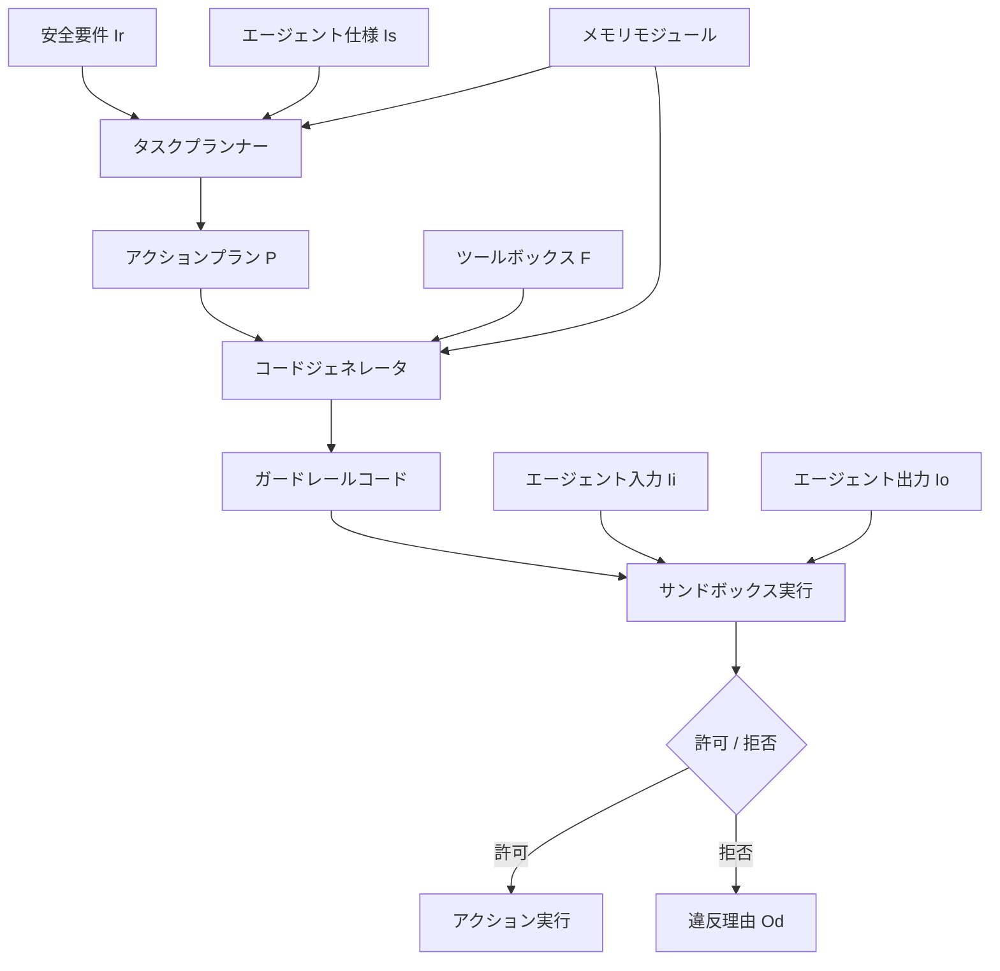

本記事は [GuardAgent: Safeguard LLM Agents by a Guard Agent via Knowledge-Enabled Reasoning](https://arxiv.org/abs/2406.09187) の解説記事です。

## 論文概要（Abstract）

LLMエージェントの急速な発展に伴い、エージェントが実行するアクションの安全性を保証する課題が浮上している。著者らはGuardAgentを提案し、ターゲットエージェントの入出力が安全要件を満たすかを動的に検証するガードエージェントフレームワークを構築した。GuardAgentは安全要件からタスクプランを生成し、そのプランを実行可能なガードレールコードに変換してサンドボックス内で実行する。著者らは医療アクセス制御（EICU-AC）とWebエージェント安全ポリシー（Mind2Web-SC）の2つの新規ベンチマークを提案し、それぞれ98%超、83%超のガードレール精度を達成したと報告している。本論文はICML 2025に採択された。

この記事は [Zenn記事: CrewAI本番運用の実践ガイド：テスト・チェックポイント・コスト制御の実装](https://zenn.dev/0h_n0/articles/123b708fa66ec6) の深掘りです。

## 情報源

- **arXiv ID**: 2406.09187
- **URL**: [https://arxiv.org/abs/2406.09187](https://arxiv.org/abs/2406.09187)
- **著者**: Zhen Xiang, Linzhi Zheng, Yanjie Li, et al.
- **発表年**: 2024（ICML 2025採択）
- **分野**: cs.LG, cs.AI
- **コード**: [https://github.com/guardagent/code](https://github.com/guardagent/code)

## 背景と動機（Background & Motivation）

従来のLLMガードレールは、テキスト生成における有害コンテンツの検出に焦点を当てていた。LlamaGuardのようなモデルベースのモデレーションは、暴力・差別・犯罪といったカテゴリ単位でテキストを分類する方式であり、テキストLLMの出力に対しては有効に機能する。しかしこのアプローチには本質的な限界がある。分類カテゴリはあらかじめ定義されており、「看護師ロールがvitalperiodicテーブルのpatientunitstayidカラムにアクセスしてよいか」といった粒度の細かいドメイン固有ルールを扱えない。

LLMエージェントでは問題の性質が根本的に異なる。エージェントはデータベースへのアクセス、Webブラウジング、APIコール等のアクションを実行する。そのため安全性の検証は単なるテキスト分類ではなく、「特定のユーザロールに対して特定のデータベースカラムへのアクセスを許可するか」「年齢制限のあるWebサービスの購入を阻止するか」「運転免許を持たないユーザのレンタカー予約を阻止するか」といった、タスク固有かつ粒度の細かい安全要件の検証が必要になる。さらに、同一カラム名が複数テーブルに存在する場合（例: `patientunitstayid` が `patient` テーブルと `vitalperiodic` テーブルの両方に存在）、自然言語による判定ではテーブル間の区別が曖昧になり誤判定が発生する。

CrewAIではタスクごとにguardrailパラメータを設定できる。関数ベースのガードレールはPython関数で決定的な検証ロジックを記述し、`(True, result)` または `(False, "Error Message")` を返す。LLMベースのガードレールは自然言語の記述に基づいてエージェントのLLMが出力を評価する。両者を組み合わせたハイブリッドアプローチも可能である。しかしこれらはタスク単位の事後検証であり、検証ロジックをタスク設計者が事前に記述する必要がある。エージェント数やタスク数が増加すると、各タスクに適切なガードレール関数を手書きするメンテナンスコストが増大し、新たなエージェントや安全要件に対して汎用的に適用することは難しい。GuardAgentはこの課題に対し、ターゲットエージェントの実装を変更せずに外部から安全性を検証する「エージェントによるエージェントの監視」というアプローチを提案した。安全要件を自然言語で与えるだけで検証コードを自動生成する点が、CrewAIの手動ガードレール定義と根本的に異なる。

## 主要な貢献（Key Contributions）

- **初のガードエージェントフレームワーク**: LLMエージェントの安全性を外部から動的に検証する汎用フレームワークを提案。ターゲットエージェントの実装変更が不要
- **知識ベース推論パイプライン**: タスクプラン生成、コード生成、サンドボックス実行の3段階パイプラインにより、自然言語の安全要件を決定的に検証可能なコードに変換
- **メモリモジュール**: 過去のガードレール事例を記憶し、類似入力に対して適切なプラン・コード生成を支援するin-context learning機構
- **2つの新規ベンチマーク**: 医療アクセス制御（EICU-AC、316例）とWeb安全ポリシー（Mind2Web-SC、200例）。臨床医の検証を含む高品質なデータセット

## 技術的詳細（Technical Details）

### GuardAgentアーキテクチャ

GuardAgentは非侵襲的な並列システムとして設計されている。ターゲットエージェントの入力 $I_i$、出力ログ $I_o$、安全要件 $I_r$、ターゲットエージェント仕様 $I_s$ を受け取り、許可/拒否のバイナリ判定 $O_l$ と違反理由の説明 $O_d$ を出力する。



### タスクプラン生成

タスクプラン生成では、メモリから $k$ 個のデモンストレーションを検索し、LLMに4段階の必須プラン構造を生成させる。

$$
P = \text{LLM}(I_p, I_s, I_r, D_1, \ldots, D_k, I_i, I_o)
$$

ここで、
- $I_p$: プランニング指示
- $D_1, \ldots, D_k$: メモリから取得した $k$ 個のデモンストレーション
- $P$: 生成されたアクションプラン

必須の4段階構造は以下の通り:

1. **安全要件のキーワード要約**: ガードリクエストから重要な制約を抽出
2. **関連ルールのフィルタリング**: 現在の入出力に適用すべきルールを特定
3. **エージェント出力の要約**: 検証対象のアクション・データを整理
4. **コード比較方式の指定**: ルールと出力をどのように比較するかを決定

デモンストレーションの検索にはレーベンシュタイン距離を用いる。現在の入力 $I_i$ と出力 $I_o$ を連結した文字列に対し、メモリ内の各事例との編集距離を計算し、最も類似度の高い $k$ 個を選択する。

### コード生成とサンドボックス実行

アクションプランをもとに、実行可能なPythonコードを生成する。

$$
\text{Code} = \text{LLM}(F, D_1, \ldots, D_k, I_i, I_o, P)
$$

ここで $F$ はツールボックス（呼び出し可能な関数群）を表す。ツールボックスには `CheckAccess`（アクセス権限検証）、`CheckRules`（ルール適合検証）等の関数が含まれ、ユーザが追加の関数をアップロードすることも可能である。

コード生成においては、LLMが関数を幻覚（hallucinate）しないよう、利用可能な関数の明示的な仕様を提供する設計が重要である。著者らはツールボックス内の各関数について、引数の型、戻り値の型、振る舞いの説明をプロンプトに含めている。これにより、LLMは存在しない関数を呼び出すコードを生成するリスクを抑制できる。

生成されたコードはサンドボックス環境（Python実行環境）で実行され、ラベル $O_l$（許可/拒否）と詳細な違反説明 $O_d$ を返す。コード実行でエラーが発生した場合、デバッグメカニズムによりLLMがエラーメッセージを参照してコードを修正し再実行する。このコードベースのアプローチの利点は決定性にある。同一入力に対して常に同一の判定結果を返すため、LLMの自然言語判定に見られる確率的な揺らぎ（同じ質問でも回答が変わる問題）を排除できる。論文ではケーススタディとして、同名カラムの権限判定において自然言語ベースのModel-Guarding-Agentが誤判定する一方、GuardAgentはデータ構造への変換により正確に判定した事例が報告されている。

また興味深い知見として、著者らはLLMに出力形式を制限しない実験も行い、68%のケースでLLMが自発的にコードベースのガードレールを生成したと報告している。これはLLM自体が構造化された検証にはコード生成が適切であると判断する傾向を示唆している。

### メモリモジュール

メモリはタプル $[I_i, I_o, P, \text{Code}]$ を保持する。初期状態では手動で作成されたシードデモンストレーションが格納され、運用を通じて蓄積されていく。著者らの実験（論文Table 1）では、1-3ショットのデモンストレーションで十分な性能が得られたと報告している。

```python
from dataclasses import dataclass, field
from typing import Callable


@dataclass
class GuardMemory:
    """GuardAgentのメモリモジュール

    過去のガードレール事例を保持し、
    類似入力に対するデモンストレーション検索を提供する。

    Attributes:
        entries: メモリエントリのリスト
    """

    entries: list[dict[str, str]] = field(default_factory=list)

    def add(
        self,
        agent_input: str,
        agent_output: str,
        plan: str,
        code: str,
    ) -> None:
        """新しいガードレール事例をメモリに追加する

        Args:
            agent_input: ターゲットエージェントへの入力
            agent_output: ターゲットエージェントの出力ログ
            plan: 生成されたアクションプラン
            code: 生成されたガードレールコード
        """
        self.entries.append({
            "input": agent_input,
            "output": agent_output,
            "plan": plan,
            "code": code,
        })

    def retrieve(self, query: str, k: int = 3) -> list[dict[str, str]]:
        """レーベンシュタイン距離で最も類似したk個の事例を検索

        Args:
            query: 検索クエリ（入力+出力の連結文字列）
            k: 返却するデモンストレーション数

        Returns:
            類似度の高い順にソートされたk個のメモリエントリ
        """
        scored: list[tuple[int, dict[str, str]]] = []
        for entry in self.entries:
            ref = entry["input"] + entry["output"]
            dist = _levenshtein(query, ref)
            scored.append((dist, entry))
        scored.sort(key=lambda x: x[0])
        return [entry for _, entry in scored[:k]]


def _levenshtein(s1: str, s2: str) -> int:
    """2つの文字列間のレーベンシュタイン距離を計算

    Args:
        s1: 文字列1
        s2: 文字列2

    Returns:
        編集距離
    """
    if len(s1) < len(s2):
        return _levenshtein(s2, s1)
    if len(s2) == 0:
        return len(s1)
    prev_row = list(range(len(s2) + 1))
    for i, c1 in enumerate(s1):
        curr_row = [i + 1]
        for j, c2 in enumerate(s2):
            cost = 0 if c1 == c2 else 1
            curr_row.append(min(
                curr_row[j] + 1,
                prev_row[j + 1] + 1,
                prev_row[j] + cost,
            ))
        prev_row = curr_row
    return prev_row[-1]
```

## 実装のポイント（Implementation）

GuardAgentの公式実装（[GitHub](https://github.com/guardagent/code)）は、`guardagent.py` をコアとして `prompts_guard.py`（プロンプトテンプレート）、`tools.py`/`toolset_high.py`（ツールボックス）で構成される。`main.py` から `--agent ehr` または `--agent seeact` を指定し、`--llm` でバックボーンLLM、`--num_shots` でデモンストレーション数（1-3）を制御する。

CrewAIのguardrailパラメータとの設計思想の違いを整理する。CrewAIの関数ベースガードレールは `(bool, result)` を返すPython関数をタスクごとに定義し、タスク完了後に出力を検証する事後チェック機構である。検証ロジックは開発者が事前に書き、失敗時はリトライ回数とリトライメッセージをカスタマイズできる。一方GuardAgentは、安全要件を自然言語で与えるだけでタスクプラン生成からコード生成、実行までを自動化する。ツールボックスとメモリにより新たなエージェントへの適用が容易で、CrewAIの「開発者がガードレール関数を手書きする」アプローチに対して「安全要件の記述だけで検証コードが自動生成される」アプローチを取る。

ただし両者は排他的ではなく、相補的に利用できる。例えばCrewAIのguardrailパラメータにGuardAgentのパイプラインを呼び出すラッパー関数を設定すれば、CrewAIのリトライ機構とGuardAgentの自動コード生成を組み合わせることが可能である。

実装上の注意点として、サンドボックス環境の分離が挙げられる。生成されたコードが任意のPythonを実行するため、ファイルシステムアクセスやネットワーク通信を制限した実行環境が必須となる。AWS上で運用する場合、Lambda Layer（Small構成）やFirecracker MicroVM（Large構成）による分離が有効である。

## Production Deployment Guide

GuardAgentのガードレールパイプラインをAWS上にデプロイする構成を示す。ターゲットエージェントの入出力を受け取り、タスクプラン生成、コード生成、サンドボックス実行の3段階を実行するシステムである。

**コスト試算は2026年6月時点のAWS ap-northeast-1（東京）リージョン料金に基づく概算値である。実際のコストはトラフィックパターン、リージョン、バースト使用量により変動する。最新料金はAWS料金計算ツールで確認を推奨する。**

### AWS実装パターン（コスト最適化重視）

| 項目 | Small (~100 req/日) | Medium (~1,000 req/日) | Large (10,000+ req/日) |
|------|-------------------|----------------------|----------------------|
| **コンピュート** | Lambda (512MB, 60s) | ECS Fargate (1vCPU, 2GB) | EKS + Spot (m5.xlarge) |
| **LLM** | Bedrock Claude Sonnet | Bedrock Claude Sonnet | Bedrock Claude Sonnet + Batch API |
| **サンドボックス** | Lambda Layer (Python) | Fargate Sidecar | Firecracker MicroVM |
| **メモリDB** | DynamoDB On-Demand | DynamoDB Provisioned | ElastiCache Redis + DynamoDB |
| **キュー** | --- | SQS Standard | SQS FIFO + Dead Letter |
| **監視** | CloudWatch Basic | CloudWatch + X-Ray | CloudWatch + X-Ray + Grafana |
| **月額概算** | $50-150 | $400-800 | $2,500-5,000 |

**Small構成の内訳**: Lambda実行 $5-15、Bedrock API $30-80（1リクエストあたり約3,000入力トークン + 1,500出力トークン）、DynamoDB $3-5、CloudWatch $5-10。

**コスト削減テクニック**:
- Bedrock Batch APIで非同期処理可能なリクエストを50%削減
- Prompt Cachingでメモリ検索のシステムプロンプトを30-90%削減
- Spot Instancesで推論ワーカーのコストを最大90%削減（Large構成）
- Reserved Instancesの1年コミットでベースラインノードを最大72%削減

### Terraformインフラコード

**Small構成（Serverless）**: Lambda + Bedrock + DynamoDB

```hcl
# GuardAgent Small構成 - Serverless
# Lambda + Bedrock + DynamoDB

terraform {
  required_version = ">= 1.9"
  required_providers {
    aws = { source = "hashicorp/aws", version = "~> 5.80" }
  }
}

provider "aws" { region = "ap-northeast-1" }

# --- IAM ---
resource "aws_iam_role" "guard_lambda" {
  name = "guard-agent-lambda-role"
  assume_role_policy = jsonencode({
    Version = "2012-10-17"
    Statement = [{
      Action = "sts:AssumeRole"
      Effect = "Allow"
      Principal = { Service = "lambda.amazonaws.com" }
    }]
  })
}

resource "aws_iam_role_policy" "guard_lambda" {
  name = "guard-agent-lambda-policy"
  role = aws_iam_role.guard_lambda.id
  policy = jsonencode({
    Version = "2012-10-17"
    Statement = [
      {
        # Bedrock InvokeModel - 最小権限
        Effect   = "Allow"
        Action   = ["bedrock:InvokeModel"]
        Resource = "arn:aws:bedrock:ap-northeast-1::foundation-model/anthropic.claude-sonnet-*"
      },
      {
        # DynamoDB - メモリモジュール用
        Effect   = "Allow"
        Action   = ["dynamodb:GetItem", "dynamodb:PutItem", "dynamodb:Query"]
        Resource = aws_dynamodb_table.guard_memory.arn
      },
      {
        # CloudWatch Logs
        Effect   = "Allow"
        Action   = ["logs:CreateLogGroup", "logs:CreateLogStream", "logs:PutLogEvents"]
        Resource = "arn:aws:logs:ap-northeast-1:*:*"
      }
    ]
  })
}

# --- DynamoDB (メモリモジュール) ---
resource "aws_dynamodb_table" "guard_memory" {
  name         = "guard-agent-memory"
  billing_mode = "PAY_PER_REQUEST" # On-Demand でコスト最適化
  hash_key     = "agent_type"
  range_key    = "entry_id"

  attribute {
    name = "agent_type"
    type = "S"
  }
  attribute {
    name = "entry_id"
    type = "S"
  }

  server_side_encryption { enabled = true } # KMS暗号化
  point_in_time_recovery { enabled = true }
}

# --- Lambda (ガードレールパイプライン) ---
resource "aws_lambda_function" "guard_agent" {
  function_name = "guard-agent-pipeline"
  runtime       = "python3.12"
  handler       = "handler.lambda_handler"
  role          = aws_iam_role.guard_lambda.arn
  timeout       = 60
  memory_size   = 512
  filename      = "lambda.zip"

  environment {
    variables = {
      MEMORY_TABLE = aws_dynamodb_table.guard_memory.name
      MODEL_ID     = "anthropic.claude-sonnet-4-20250514"
      NUM_SHOTS    = "3"
    }
  }

  tracing_config { mode = "Active" } # X-Ray有効化
}

# --- CloudWatch アラーム (コスト監視) ---
resource "aws_cloudwatch_metric_alarm" "lambda_duration" {
  alarm_name          = "guard-agent-duration-high"
  comparison_operator = "GreaterThanThreshold"
  evaluation_periods  = 3
  metric_name         = "Duration"
  namespace           = "AWS/Lambda"
  period              = 300
  statistic           = "Average"
  threshold           = 45000 # 45秒
  alarm_actions       = [] # SNS ARNを設定
  dimensions = {
    FunctionName = aws_lambda_function.guard_agent.function_name
  }
}
```

**Large構成（Container）**: EKS + Karpenter + Spot Instances

```hcl
# GuardAgent Large構成 - EKS + Spot
# 10,000+ req/日向け

module "eks" {
  source          = "terraform-aws-modules/eks/aws"
  version         = "~> 20.31"
  cluster_name    = "guard-agent-cluster"
  cluster_version = "1.31"

  vpc_id     = module.vpc.vpc_id
  subnet_ids = module.vpc.private_subnets

  cluster_endpoint_public_access = false # プライベートアクセスのみ

  eks_managed_node_groups = {
    system = {
      instance_types = ["m5.large"]
      min_size       = 1
      max_size       = 2
      desired_size   = 1
      capacity_type  = "ON_DEMAND" # システムノードはオンデマンド
    }
  }
}

# --- Karpenter (Spot優先オートスケーリング) ---
resource "kubectl_manifest" "karpenter_nodepool" {
  yaml_body = yamlencode({
    apiVersion = "karpenter.sh/v1"
    kind       = "NodePool"
    metadata   = { name = "guard-workers" }
    spec = {
      template = {
        spec = {
          requirements = [
            { key = "karpenter.sh/capacity-type", operator = "In", values = ["spot", "on-demand"] },
            { key = "node.kubernetes.io/instance-type", operator = "In",
              values = ["m5.xlarge", "m5a.xlarge", "m6i.xlarge"] },
          ]
          nodeClassRef = { name = "default" }
        }
      }
      limits   = { cpu = "64", memory = "256Gi" }
      disruption = {
        consolidationPolicy = "WhenEmptyOrUnderutilized"
        consolidateAfter    = "30s"
      }
    }
  })
}

# --- Secrets Manager (Bedrock設定) ---
resource "aws_secretsmanager_secret" "bedrock_config" {
  name                    = "guard-agent/bedrock-config"
  recovery_window_in_days = 7
}

# --- AWS Budgets (予算アラート) ---
resource "aws_budgets_budget" "guard_monthly" {
  name         = "guard-agent-monthly"
  budget_type  = "COST"
  limit_amount = "5000"
  limit_unit   = "USD"
  time_unit    = "MONTHLY"

  notification {
    comparison_operator       = "GREATER_THAN"
    threshold                 = 80
    threshold_type            = "PERCENTAGE"
    notification_type         = "ACTUAL"
    subscriber_email_addresses = ["alert@example.com"]
  }
}
```

### 運用・監視設定

**CloudWatch Logs Insights クエリ** -- コスト異常検知:

```
fields @timestamp, @message
| filter @message like /bedrock/
| stats sum(input_tokens) as total_input, sum(output_tokens) as total_output by bin(1h)
| sort @timestamp desc
```

**CloudWatch Logs Insights クエリ** -- レイテンシ分析:

```
fields @timestamp, duration_ms
| stats avg(duration_ms) as avg_latency,
        pct(duration_ms, 95) as p95,
        pct(duration_ms, 99) as p99
  by bin(5m)
| sort @timestamp desc
```

**CloudWatch アラーム設定（Python boto3）**:

```python
import boto3


def create_token_alarm(
    alarm_name: str = "bedrock-token-spike",
    threshold: float = 100000.0,
    sns_topic_arn: str = "",
) -> dict:
    """Bedrockトークン使用量スパイク検知アラームを作成する

    Args:
        alarm_name: アラーム名
        threshold: 1時間あたりのトークン閾値
        sns_topic_arn: 通知先SNSトピックARN

    Returns:
        CloudWatch APIレスポンス
    """
    cw = boto3.client("cloudwatch", region_name="ap-northeast-1")
    return cw.put_metric_alarm(
        AlarmName=alarm_name,
        MetricName="InputTokenCount",
        Namespace="AWS/Bedrock",
        Statistic="Sum",
        Period=3600,
        EvaluationPeriods=1,
        Threshold=threshold,
        ComparisonOperator="GreaterThanThreshold",
        AlarmActions=[sns_topic_arn] if sns_topic_arn else [],
    )
```

**X-Ray トレーシング設定（Python boto3）**:

```python
from aws_xray_sdk.core import xray_recorder, patch_all


def init_tracing(service_name: str = "guard-agent") -> None:
    """X-Rayトレーシングを初期化しboto3を自動計装する

    Args:
        service_name: X-Rayで表示されるサービス名
    """
    xray_recorder.configure(service=service_name)
    patch_all()  # boto3, requests等を自動計装


def trace_guard_step(step_name: str, agent_type: str) -> None:
    """ガードレールパイプラインの各ステップにアノテーションを付与する

    Args:
        step_name: ステップ名（plan/codegen/execute）
        agent_type: ターゲットエージェント種別
    """
    segment = xray_recorder.current_subsegment()
    if segment:
        segment.put_annotation("guard_step", step_name)
        segment.put_annotation("agent_type", agent_type)
        segment.put_metadata("pipeline", {"step": step_name})
```

**Cost Explorer 日次レポート（Python boto3）**:

```python
from datetime import date, timedelta

import boto3


def get_daily_cost_report() -> dict[str, float]:
    """前日のサービス別コストを取得する

    Returns:
        サービス名をキー、コスト（USD）を値とする辞書
    """
    ce = boto3.client("ce", region_name="ap-northeast-1")
    yesterday = (date.today() - timedelta(days=1)).isoformat()
    today = date.today().isoformat()
    resp = ce.get_cost_and_usage(
        TimePeriod={"Start": yesterday, "End": today},
        Granularity="DAILY",
        Metrics=["BlendedCost"],
        Filter={
            "Or": [
                {"Dimensions": {"Key": "SERVICE", "Values": ["Amazon Bedrock"]}},
                {"Dimensions": {"Key": "SERVICE", "Values": ["AWS Lambda"]}},
                {"Dimensions": {"Key": "SERVICE", "Values": ["Amazon EKS"]}},
            ]
        },
        GroupBy=[{"Type": "DIMENSION", "Key": "SERVICE"}],
    )
    costs: dict[str, float] = {}
    for group in resp["ResultsByTime"][0].get("Groups", []):
        svc = group["Keys"][0]
        amt = float(group["Metrics"]["BlendedCost"]["Amount"])
        costs[svc] = amt
    return costs
```

### コスト最適化チェックリスト

**アーキテクチャ選択**:
- [ ] トラフィック量に応じた構成を選択（~100: Serverless / ~1,000: Hybrid / 10,000+: Container）
- [ ] サンドボックス実行方式を決定（Lambda Layer / Fargate Sidecar / Firecracker）

**リソース最適化**:
- [ ] EC2/EKSワーカー: Spot Instances優先（最大90%削減）
- [ ] ベースラインノード: Reserved Instances 1年コミット（最大72%削減）
- [ ] Savings Plans: Compute Savings Plans検討
- [ ] Lambda: メモリサイズを512MB-1024MBで最適化（Power Tuning実施）
- [ ] ECS/EKS: Karpenterで未使用ノード自動統合（consolidateAfter: 30s）

**LLMコスト削減**:
- [ ] Bedrock Batch API: 非リアルタイム処理を非同期化（50%削減）
- [ ] Prompt Caching: メモリデモンストレーション部分をキャッシュ（30-90%削減）
- [ ] モデル選択ロジック: 単純ルールはHaikuクラス、複雑な推論はSonnetクラスに振り分け
- [ ] トークン数制限: 入力のプリフィルタリングで不要情報を除去
- [ ] レスポンスキャッシュ: 同一入出力パターンはDynamoDBからキャッシュ返却

**監視・アラート**:
- [ ] AWS Budgets: 月額予算アラート（80%/100%で通知）
- [ ] CloudWatch アラーム: トークンスパイク、Lambda実行時間異常
- [ ] Cost Anomaly Detection: 自動検知有効化
- [ ] 日次コストレポート: Cost Explorer API + SNS通知
- [ ] X-Rayトレーシング: 全パイプラインステップの計測

**リソース管理**:
- [ ] 未使用リソース: 週次で未使用Lambda/ECSタスク/DynamoDBテーブルを棚卸し
- [ ] タグ戦略: `Project=guard-agent`, `Environment=prod/dev`, `CostCenter=xxx` を全リソースに付与
- [ ] ライフサイクルポリシー: CloudWatch Logs保持期間を90日に設定
- [ ] 開発環境: 夜間・週末のEKSノード自動停止（Karpenter TTL設定）
- [ ] DynamoDB: TTL設定で古いメモリエントリを自動削除（180日）

## 実験結果（Results）

著者らは2つのベンチマークで評価を行っている（論文Table 1より）。

**EICU-ACベンチマーク**（医療アクセス制御、316例）:

| コアLLM | 手法 | LPA | EA | FRA |
|---------|------|-----|----|----|
| LlamaGuard3-8B | LlamaGuard | 50.3% | n.a. | 100% |
| Llama3-70B | Hardcoded Rules | 82.0% | 2.5% | 29.2% |
| Llama3-70B | Model-Guarding-Agent | 92.1% | 41.4% | 100% |
| Llama3-70B | GuardAgent | 98.4% | 96.9% | 100% |
| GPT-4 | GuardAgent | 98.7% | 97.5% | 100% |

**Mind2Web-SCベンチマーク**（Web安全ポリシー、200例）:

| コアLLM | 手法 | LPA | EA |
|---------|------|-----|----|
| Llama3.3-70B | Model-Guarding-Agent | 80.5% | 60.0% |
| Llama3.3-70B | GuardAgent | 93.0% | 94.0% |
| GPT-4 | Model-Guarding-Agent | 82.5% | 65.0% |
| GPT-4 | GuardAgent | 90.0% | 80.0% |

LPA（Label Prediction Accuracy）は許可/拒否の全体精度、EA（Explanation Accuracy）は違反理由の特定精度、FRA（Final Response Accuracy）はターゲットエージェントのタスク性能への影響を示す。

注目すべき点として、Hardcoded Rules方式はFRAが3.2%-71.0%に低下する（論文Table 1より）。安全ルールをエージェントのシステムプロンプトに直接埋め込むと、本来のタスク遂行能力が大幅に劣化するためである。GuardAgentは非侵襲的設計により、全構成でFRA 100%を維持している。

アブレーション実験（論文Table 2より）では、ツールボックスとメモリを除去した場合、LPAが98.7%から90.8%に低下したが、GuardAgentは自律的に代替関数を定義して部分的に補償したと報告されている。

## 実運用への応用（Practical Applications）

GuardAgentのアプローチは、マルチエージェントシステムの安全性確保に直接応用できる。CrewAIでCrewを構成する場合、各タスクのguardrailパラメータに関数ベースの検証を設定することは可能だが、タスク数が増加するとメンテナンスコストが増大する。GuardAgentのように安全要件を自然言語で定義し検証コードを自動生成する仕組みは、大規模なエージェントワークフローにおいて運用負荷を軽減する。

医療情報システムでは、HIPAA準拠のアクセス制御をGuardAgentパターンで実装できる。患者データへのアクセスリクエストに対し、ユーザロールとデータカラムの権限マトリクスをコードで検証する。Webエージェントでは、年齢制限・地域制限・資格要件等のビジネスルールを自然言語で記述し、エージェントの操作を事前検証する用途が想定される。

レイテンシの観点では、タスクプラン生成とコード生成で2回のLLM呼び出しが必要となるため、リアルタイム性が要求される場面ではメモリモジュールのキャッシュ活用やモデルサイズの使い分けが重要になる。

## 関連研究（Related Work）

- **LlamaGuard** (Meta, 2023): LLMの入出力をカテゴリ別に分類するモデレーションシステム。テキストの有害性検出に特化しており、エージェントのアクションレベルの安全性検証には対応していない。論文の実験ではLPA 50.3%とランダム近い精度にとどまった
- **ShieldAgent** (2025, arXiv:2503.22738): 検証可能な安全ポリシー推論を行うエージェント。GuardAgentのコード生成アプローチと同様に、安全ルールの形式的検証を目指す後続研究
- **AgentGuardian** (2025, arXiv:2601.10440): AIエージェントの行動を制御するアクセス制御ポリシーを学習するフレームワーク。GuardAgentが学習不要（in-context learning）であるのに対し、ポリシーモデルの訓練が必要
- **Hardcoded Safety Rules**: ターゲットエージェントのシステムプロンプトに安全ルールを直接埋め込む手法。論文の実験ではタスク性能（FRA）が3.2%-71.0%に低下し、実用性に課題がある

## まとめと今後の展望

GuardAgentは、LLMエージェントの安全性を外部から動的に検証する初のガードエージェントフレームワークである。タスクプラン生成、コード生成、サンドボックス実行の3段階パイプラインにより、自然言語の安全要件を決定的な検証コードに変換する。EICU-ACで98%超、Mind2Web-SCで83%-93%のガードレール精度を達成し、ターゲットエージェントのタスク性能を一切劣化させない非侵襲的設計が特徴である。

今後の研究方向として、著者らはツールボックスの自動設計、高度な推論戦略の導入、自律走行や金融エージェントへの拡張を挙げている。CrewAI等のマルチエージェントフレームワークと組み合わせることで、エージェントワークフロー全体の安全性ガバナンスを実現する道が開けると考えられる。

## 参考文献

- **arXiv**: [https://arxiv.org/abs/2406.09187](https://arxiv.org/abs/2406.09187)
- **Code**: [https://github.com/guardagent/code](https://github.com/guardagent/code)
- **Related Zenn article**: [https://zenn.dev/0h_n0/articles/123b708fa66ec6](https://zenn.dev/0h_n0/articles/123b708fa66ec6)

---

*本記事はClaude Opus 4.6により自動生成されました。論文の内容に基づいていますが、解釈の正確性については原論文を参照してください。*
