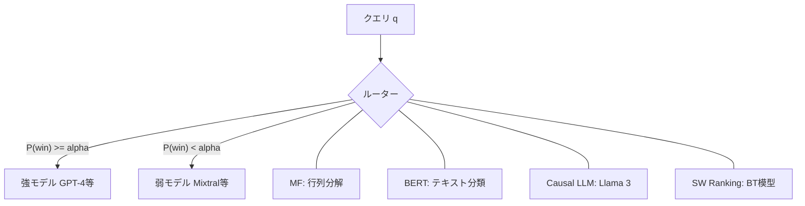

本記事は [RouteLLM: Learning to Route LLMs with Preference Data](https://arxiv.org/abs/2406.18665) の解説記事です。

## 論文概要（Abstract）

RouteLLMは、クエリの複雑さに応じて高性能（高コスト）なLLMと軽量（低コスト）なLLMを動的に切り替えるルーターモデルのフレームワークである。著者らは、Chatbot Arenaの人間選好データを活用して4種のルーターアーキテクチャを学習し、MT-Benchにおいてコストを85%以上削減しつつGPT-4の性能の95%を維持できると報告している（論文Table 6より）。さらに、学習済みルーターが未知のモデルペアにも転移可能であることを示した。ICLR 2025に採択されている。

この記事は [Zenn記事: CrewAI本番運用の実践ガイド：テスト・チェックポイント・コスト制御の実装](https://zenn.dev/0h_n0/articles/123b708fa66ec6) の深掘りです。

## 情報源

- **arXiv ID**: 2406.18665
- **URL**: [https://arxiv.org/abs/2406.18665](https://arxiv.org/abs/2406.18665)
- **著者**: Isaac Ong, Amjad Almahairi, Vincent Wu et al.（lm-sys / UC Berkeley）
- **発表年**: 2024（ICLR 2025採択）
- **分野**: cs.CL, cs.LG
- **GitHub**: [https://github.com/lm-sys/RouteLLM](https://github.com/lm-sys/RouteLLM)

## 背景と動機（Background & Motivation）

LLMのデプロイにおいて、高性能モデル（GPT-4等）は高品質な応答を返すが1Mトークンあたり$24.7と高額であり、軽量モデル（Mixtral-8x7B等）は$0.24/1Mトークンと安価だが複雑なタスクでは品質が劣る。両者の価格差は約100倍に及ぶ。全クエリを高性能モデルに送る方式ではコストが膨大となり、逆に全て軽量モデルに送ると品質が低下する。著者らは「Larger models tend to be more capable but come at a higher cost, while smaller models tend to be less capable but cheaper to serve」と述べ、この二律背反がLLMデプロイの根本的な課題であると位置づけている。

この課題はCrewAIのようなマルチエージェントシステムで特に深刻である。Zenn記事で紹介されている`max_rpm`（APIレート制限）、`max_iter`（反復上限）、`max_execution_time`（実行時間制限）はコスト制御のための静的パラメータであり、全てのクエリに一律の制約を課す。しかし、実際のクエリの難易度は大きく異なる。単純な挨拶や定型的な質問に高性能モデルを使うのは過剰投資であり、複雑な推論タスクに軽量モデルを使うのは品質の妥協である。RouteLLMはこのギャップを埋め、クエリ単位でモデルを動的に切り替えることで、品質を維持しながらコストを大幅に削減する仕組みを提供する。

著者らは、報酬モデリングとルーティングの本質的な違いを強調している。報酬モデルはLLM生成後に応答品質を事後評価するのに対し、ルーティングは応答を見る前にクエリのみからモデルを事前選択する必要がある。著者らは「Reward modeling evaluates response quality post-LLM generation, whereas routing requires the router to select the appropriate model before seeing the response」と明確に区別しており、この事前判定という制約がルーティング問題を技術的に困難にしている。

従来のアプローチとしては、FrugalGPTのようなカスケード方式（安価なモデルから順に試し、品質が不十分なら次のモデルへ）やLLM-BLENDERのようなアンサンブル方式（全モデルの出力を統合）があるが、いずれも複数モデルの推論が必要でコスト効率が悪い。RouteLLMは1回のルーティング判定で適切なモデルを選択するため、追加の推論コストが極めて小さい。

## 主要な貢献（Key Contributions）

- **4種のルーターアーキテクチャ**: Matrix Factorization（MF）、BERT分類器、Causal LLM分類器、Similarity-Weighted（SW）Rankingを提案し、それぞれの特性を比較
- **Chatbot Arenaデータの活用**: 80,000件の人間選好バトルデータからルーターを学習。64モデルを10段階のEloティアに分類
- **データ拡張手法**: Golden-labeled（MMLU検証セット約1,500件）とLLM-judge-labeled（GPT-4ジャッジによる約120,000件、コスト約$700）の2手法でout-of-domain性能を改善
- **コスト削減効果**: MT-Benchで3.66倍のコスト削減（品質95%維持）、MMLUで1.41倍、GSM8Kで1.49倍（論文Table 6より）
- **モデル間転移**: GPT-4/Mixtralペアで学習したルーターがClaude 3 Opus/Llama 3 8Bペアにも転移可能（論文Table 5より）

## 技術的詳細（Technical Details）

### 問題定式化

RouteLLMは、クエリ $q$ に対して強モデル $M_s$ と弱モデル $M_w$ のいずれに転送するかを決定する二値ルーティング関数 $R_{\mathrm{bin}}^{\alpha}$ を学習する。

$$
R_{\mathrm{bin}}^{\alpha}(q) = \begin{cases} M_s & \text{if } P_\theta(\text{win}_s \mid q) \geq \alpha \\ M_w & \text{otherwise} \end{cases}
$$

ここで、
- $P_\theta(\text{win}_s \mid q)$: クエリ $q$ に対して強モデルが弱モデルに勝つ確率（ルーターの出力）
- $\alpha \in [0, 1]$: コストと品質のトレードオフを制御する閾値パラメータ
- $\theta$: ルーターの学習パラメータ

学習は選好データに対する最尤推定で行う:

$$
\max_\theta \sum_{(q, l_{ij}) \in \mathcal{D}} \log P_\theta(l_{ij} \mid q)
$$

ここで $l_{ij}$ はモデル $i$ がモデル $j$ に対して勝つ/負けるのラベルである。

### 評価指標

**Performance Gap Recovered（PGR）**: ルーターの性能を弱モデルと強モデルの差分で正規化した指標。

$$
\mathrm{PGR} = \frac{r(\text{router}) - r(M_w)}{r(M_s) - r(M_w)}
$$

**Call-Performance Threshold（CPT(x%)）**: PGR $x$% を達成するために必要な強モデルへの呼び出し割合。

### 4つのルーターアーキテクチャ



#### 1. Matrix Factorization（MF）

推薦システムの協調フィルタリングから着想を得たアーキテクチャである。クエリとモデルの埋め込みの双線形スコアリング関数を学習する:

$$
P(\text{win} \mid q) = \sigma\bigl(s(M_w, q) - s(M_l, q)\bigr)
$$

$$
s(M, q) = \mathbf{w}_2^\top \bigl(\mathbf{v}_m \odot (\mathbf{W}_1^\top \mathbf{v}_q + \mathbf{b})\bigr)
$$

ここで、
- $\mathbf{v}_m \in \mathbb{R}^d$: モデル埋め込み（各モデルティアに対応）
- $\mathbf{v}_q \in \mathbb{R}^{d_e}$: クエリ埋め込み（OpenAI text-embedding-3-smallで生成）
- $\mathbf{W}_1 \in \mathbb{R}^{d_e \times d}$: クエリ埋め込みをモデル埋め込み空間に射影する行列
- $\mathbf{b} \in \mathbb{R}^d$: バイアス項
- $\mathbf{w}_2 \in \mathbb{R}^d$: 最終スコアへの線形変換
- $\odot$: 要素積（Hadamard積）
- $\sigma$: シグモイド関数

スコア関数 $s(M, q)$ はモデル埋め込みとクエリ埋め込みの要素積を取ることで、「このクエリに対してこのモデルがどの程度適しているか」を表現する。勝つモデルと負けるモデルのスコア差をシグモイドに通すことで勝率に変換する。学習リソースは8GB GPUで約10エポック、バッチサイズ64と軽量であり、推論速度は155 req/sに達する。

#### 2. BERT分類器

BERT-baseの[CLS]トークン埋め込みを用いた標準的なテキスト分類アプローチである:

$$
P_\theta(\text{win} \mid q) = \sigma(\mathbf{W} \mathbf{h}_{\text{CLS}} + b)
$$

ここで $\mathbf{h}_{\text{CLS}} \in \mathbb{R}^{768}$ はBERT-baseの[CLS]トークンの最終層出力である。全パラメータのファインチューニングを行い、2x L4 24GB GPUで学習する。推論速度は69.6 req/sで、MFルーターに比べて遅いが、クエリの文脈をより深く理解できる可能性がある。

#### 3. Causal LLM分類器

Llama 3 8Bをベースとし、指示追従パラダイムでルーティングを行う。比較ラベル（「強モデルが勝つ」「弱モデルが勝つ」）を語彙に追加し、これらのラベルトークンに対するsoftmax確率で勝率を計算する。8x A100 80GB GPUで約2,000ステップの学習が必要であり、4つのルーターの中で最も計算リソースを要する。推論速度は42.5 req/sだが、GSM8Kのような数学的推論タスクでは他のルーターを上回る性能を示す。

#### 4. Similarity-Weighted（SW）Ranking

唯一の学習不要ルーターである。テスト時にBradley-Terryモデルを動的に解く。

$$
\omega_i = \gamma^{1 + S(q, \hat{q}_i)}
$$

ここで、
- $S(q, \hat{q}_i)$: テストクエリ $q$ と学習サンプルのクエリ $\hat{q}_i$ の間のコサイン類似度
- $\gamma > 1$: 減衰パラメータ（類似度が高いサンプルほど大きな重みを付与）
- $\omega_i$: サンプル $i$ に対する重み

各学習サンプルに対して類似度ベースの重み $\omega_i$ を計算し、重み付きBradley-Terry係数 $\xi$ をテスト時に最適化問題として求める。学習フェーズが不要なため即座にデプロイ可能だが、推論時に全学習サンプルとの類似度計算が必要となるため、コストは$37.36/1Mリクエストと4ルーター中最も高い（論文Table 7より）。

### 学習データ

#### Chatbot Arenaデータセット

Chatbot Arenaは、ユーザーが2つの匿名LLMの応答を比較して優劣を判定するオンラインプラットフォームである。著者らはここから80,000件の人間選好バトルデータを取得し、前処理後65,000件のペアワイズ比較を使用している。64モデルをEloスコアで10ティアに分類し、ティア0-1を強モデル（GPT-4各バリアント、Claude、Mistral-Medium等）、ティア2を弱モデル（Claude 2.0、Mixtral-8x7B、GPT-3.5-Turbo等）と定義している。言語分布は英語81%、中国語3.1%、ロシア語2.2%であり、英語中心のデータとなっている。

#### データ拡張手法

著者らは、Chatbot Arenaデータのみでは学術ベンチマークとの分布の乖離（ベンチマーク-データセット類似度: MT-Bench 0.6078、MMLU 0.4823）があることを指摘し、2つのデータ拡張手法を提案している。

**Golden-labeled（$\mathcal{D}_{\text{gold}}$）**: MMLUの検証セットから約1,500問を使用し、正解ラベルに基づいてモデル応答のペアワイズ比較ラベルを自動生成する。学習データの2%未満の追加でありながら、MMLUでのAPGRを14-20%改善する高効率な手法である。

**LLM-judge-labeled（$\mathcal{D}_{\text{judge}}$）**: GPT-4をジャッジとして約120,000件のサンプルを生成する。Nectarデータセットから既存のGPT-4応答を利用し、弱モデル（Mixtral-8x7B）の応答をオンデマンドで生成してペアワイズ比較を行う。生成コストは約$700 USDであり、MT-BenchでのAPGRを50-60%改善する。

## 実装のポイント（Implementation）

### インストールと基本利用

```python
# pip install "routellm[serve,eval]"

from routellm.controller import Controller
from typing import Optional

def create_router(
    router_type: str = "mf",
    strong_model: str = "gpt-4-1106-preview",
    weak_model: str = "anyscale/mistralai/Mixtral-8x7B-Instruct-v0.1",
    threshold: float = 0.1159,
) -> Controller:
    """RouteLLMルーターを初期化する。

    Args:
        router_type: ルーターの種類（mf, sw_ranking, bert, causal_llm）
        strong_model: 強モデルの識別子
        weak_model: 弱モデルの識別子
        threshold: ルーティング閾値（0に近いほど強モデルを多用）

    Returns:
        初期化済みのControllerインスタンス
    """
    client = Controller(
        routers=[router_type],
        strong_model=strong_model,
        weak_model=weak_model,
    )
    return client


def route_query(
    client: Controller,
    query: str,
    router_type: str = "mf",
    threshold: float = 0.1159,
) -> Optional[str]:
    """クエリをルーティングして応答を取得する。

    Args:
        client: RouteLLMのControllerインスタンス
        query: ユーザークエリ
        router_type: ルーターの種類
        threshold: ルーティング閾値

    Returns:
        モデルの応答テキスト
    """
    response = client.chat.completions.create(
        model=f"router-{router_type}-{threshold}",
        messages=[{"role": "user", "content": query}],
    )
    return response.choices[0].message.content
```

### 閾値のキャリブレーション

閾値 $\alpha$ はコスト-品質トレードオフを制御する。`python -m routellm.calibrate_threshold --routers mf --strong-model-pct 0.5` で、強モデルの使用率50%に対応する閾値を算出できる。LiteLLM互換のため、Anthropic、Bedrock、Together AI等のバックエンドにも対応している。

### ルーターの推論コスト

ルーターの推論オーバーヘッドはLLM推論に比べて微小である（論文Table 7より）。MFルーターは155 req/s、コスト$1.42/1Mリクエストで、GPT-4推論コストの0.01%未満に相当する。

## Production Deployment Guide

RouteLLMのルーティングロジックをAWS上にデプロイし、コスト最適化されたLLM推論基盤を構築するためのガイドである。コスト試算は2026年6月時点のAWS ap-northeast-1（東京）リージョン料金に基づく概算値であり、実際のコストはトラフィックパターン、リージョン、バースト使用量により変動する。最新料金はAWS料金計算ツールでの確認を推奨する。

### AWS実装パターン（コスト最適化重視）

RouteLLMのルーティング層は軽量であるため、トラフィック規模に応じて以下3構成を推奨する。

| 項目 | Small (~100 req/日) | Medium (~1,000 req/日) | Large (10,000+ req/日) |
|------|-------------------|----------------------|----------------------|
| **構成** | Lambda + Bedrock | ECS Fargate + Bedrock | EKS + Karpenter + Bedrock |
| **ルーター** | Lambda (512MB, 30s) | Fargate (0.5vCPU, 1GB) | EKS Pod (GPU: g5.xlarge Spot) |
| **LLM** | Bedrock (Claude Sonnet / Haiku) | Bedrock (Claude Sonnet / Haiku) | Bedrock Provisioned + Spot GPU |
| **キャッシュ** | DynamoDB | ElastiCache Redis | ElastiCache Redis Cluster |
| **月額概算** | $50-150 | $300-800 | $2,000-5,000 |

**Small構成の内訳**: Lambda実行($5-15) + Bedrock Claude Haiku 4.5 $1/1M入力トークン($20-60) + DynamoDB On-Demand($5-10) + API Gateway($3-10) + CloudWatch($5-10)。MFルーターはCPUのみで動作するためLambdaで十分である。

**Large構成の内訳**: EKS Control Plane($75) + g5.xlarge Spot($200-400、オンデマンド比最大70%削減) + Bedrock Provisioned Throughput($1,200-3,000) + ElastiCache($150-300) + ALB($30-50) + 監視($50-100)。Causal LLMルーターやBERTルーターはGPU推論が推奨される。

**コスト削減テクニック**:
- Spot Instances活用でGPUインスタンスを最大70-90%削減
- Bedrock Batch API使用で非リアルタイム処理を50%削減
- Prompt Caching有効化で繰り返しプレフィックスのトークンコストを最大90%削減
- Reserved Instances / Savings Plans（1年コミット）で最大72%削減

### Terraformインフラコード

#### Small構成（Serverless）

```hcl
# RouteLLM Small構成: Lambda + Bedrock + DynamoDB
# コスト最適化: NAT Gateway不使用、Bedrock VPCエンドポイント経由

terraform {
  required_version = ">= 1.5"
  required_providers {
    aws = { source = "hashicorp/aws", version = "~> 5.0" }
  }
}

provider "aws" {
  region = "ap-northeast-1"
}

# --- IAMロール（最小権限） ---
resource "aws_iam_role" "router_lambda" {
  name = "routellm-router-lambda"
  assume_role_policy = jsonencode({
    Version = "2012-10-17"
    Statement = [{
      Action = "sts:AssumeRole"
      Effect = "Allow"
      Principal = { Service = "lambda.amazonaws.com" }
    }]
  })
}

resource "aws_iam_role_policy" "router_lambda" {
  name = "routellm-router-policy"
  role = aws_iam_role.router_lambda.id
  policy = jsonencode({
    Version = "2012-10-17"
    Statement = [
      {
        Effect = "Allow"
        Action = [
          "bedrock:InvokeModel",     # Bedrock推論のみ許可
          "bedrock:InvokeModelWithResponseStream"
        ]
        Resource = "arn:aws:bedrock:ap-northeast-1::foundation-model/*"
      },
      {
        Effect = "Allow"
        Action = [
          "dynamodb:GetItem",        # ルーティングキャッシュ読み書き
          "dynamodb:PutItem",
          "dynamodb:Query"
        ]
        Resource = aws_dynamodb_table.routing_cache.arn
      },
      {
        Effect   = "Allow"
        Action   = ["logs:CreateLogGroup", "logs:CreateLogStream", "logs:PutLogEvents"]
        Resource = "arn:aws:logs:ap-northeast-1:*:*"
      }
    ]
  })
}

# --- DynamoDB（On-Demand、コスト効率重視） ---
resource "aws_dynamodb_table" "routing_cache" {
  name         = "routellm-routing-cache"
  billing_mode = "PAY_PER_REQUEST"  # On-Demand: 低トラフィック時コスト最小
  hash_key     = "query_hash"

  attribute {
    name = "query_hash"
    type = "S"
  }

  ttl {
    attribute_name = "ttl"
    enabled        = true           # キャッシュ自動削除でストレージコスト削減
  }

  server_side_encryption {
    enabled = true                  # KMS暗号化
  }
}

# --- Lambda関数 ---
resource "aws_lambda_function" "router" {
  function_name = "routellm-router"
  runtime       = "python3.12"
  handler       = "handler.lambda_handler"
  role          = aws_iam_role.router_lambda.arn
  memory_size   = 512               # MFルーターはCPUのみ、512MBで十分
  timeout       = 30
  filename      = "lambda_package.zip"

  environment {
    variables = {
      ROUTER_TYPE      = "mf"
      ROUTING_THRESHOLD = "0.1159"
      STRONG_MODEL     = "anthropic.claude-sonnet-4-20250514"
      WEAK_MODEL       = "anthropic.claude-haiku-4-20250414"
      CACHE_TABLE      = aws_dynamodb_table.routing_cache.name
    }
  }

  tracing_config {
    mode = "Active"                 # X-Ray有効化
  }
}

# --- CloudWatchアラーム（コスト監視） ---
resource "aws_cloudwatch_metric_alarm" "lambda_duration" {
  alarm_name          = "routellm-lambda-duration-high"
  comparison_operator = "GreaterThanThreshold"
  evaluation_periods  = 3
  metric_name         = "Duration"
  namespace           = "AWS/Lambda"
  period              = 300
  statistic           = "p95"
  threshold           = 25000      # 25秒超過でアラート
  alarm_actions       = []         # SNSトピックARNを設定

  dimensions = {
    FunctionName = aws_lambda_function.router.function_name
  }
}
```

#### Large構成（Container）

```hcl
# RouteLLM Large構成: EKS + Karpenter + Spot Instances
# コスト最適化: Spot優先、Karpenter自動スケーリング

module "eks" {
  source  = "terraform-aws-modules/eks/aws"
  version = "~> 21.0"              # 2026年6月時点最新安定版

  cluster_name    = "routellm-cluster"
  cluster_version = "1.32"

  vpc_id     = module.vpc.vpc_id
  subnet_ids = module.vpc.private_subnets

  cluster_endpoint_public_access = false  # プライベートアクセスのみ

  eks_managed_node_groups = {
    system = {
      instance_types = ["m7i.large"]
      min_size       = 2
      max_size       = 3
      desired_size   = 2
      labels         = { "role" = "system" }
    }
  }
}

# --- Karpenter Provisioner（Spot優先） ---
resource "kubectl_manifest" "karpenter_nodepool" {
  yaml_body = yamlencode({
    apiVersion = "karpenter.sh/v1"
    kind       = "NodePool"
    metadata   = { name = "routellm-gpu" }
    spec = {
      template = {
        spec = {
          requirements = [
            { key = "karpenter.sh/capacity-type", operator = "In", values = ["spot", "on-demand"] },
            { key = "node.kubernetes.io/instance-type", operator = "In",
              values = ["g5.xlarge", "g5.2xlarge"] },  # GPU Spot
          ]
          nodeClassRef = { name = "default" }
        }
      }
      limits   = { cpu = "64", memory = "256Gi" }
      disruption = {
        consolidationPolicy = "WhenEmptyOrUnderutilized"
        consolidateAfter    = "30s"
      }
    }
  })
}

# --- Secrets Manager（Bedrockアクセスキー等） ---
resource "aws_secretsmanager_secret" "bedrock_config" {
  name                    = "routellm/bedrock-config"
  recovery_window_in_days = 7
}

# --- AWS Budgets（月額上限アラート） ---
resource "aws_budgets_budget" "monthly" {
  name         = "routellm-monthly-budget"
  budget_type  = "COST"
  limit_amount = "5000"
  limit_unit   = "USD"
  time_unit    = "MONTHLY"

  notification {
    comparison_operator       = "GREATER_THAN"
    threshold                 = 80        # 80%到達で通知
    threshold_type            = "PERCENTAGE"
    notification_type         = "ACTUAL"
    subscriber_email_addresses = ["ops-team@example.com"]
  }
}
```

### 運用・監視設定

#### CloudWatch Logs Insights クエリ

```
# コスト異常検知: 1時間あたりのルーティング先別リクエスト数
fields @timestamp, route_decision, model_used
| stats count(*) as request_count by bin(1h), model_used
| filter model_used = "strong"
| sort request_count desc

# レイテンシ分析: P95/P99
fields @timestamp, duration_ms, route_decision
| stats percentile(duration_ms, 95) as p95,
        percentile(duration_ms, 99) as p99
  by bin(5m)
```

#### CloudWatch アラーム設定

```python
import boto3
from typing import Any

def create_token_usage_alarm(
    cloudwatch: Any,
    function_name: str,
    threshold: float = 100000,
) -> dict:
    """Bedrockトークン使用量スパイク検知アラームを作成する。

    Args:
        cloudwatch: boto3 CloudWatchクライアント
        function_name: Lambda関数名
        threshold: トークン数の閾値

    Returns:
        作成されたアラームのレスポンス
    """
    return cloudwatch.put_metric_alarm(
        AlarmName=f"{function_name}-token-spike",
        MetricName="InputTokenCount",
        Namespace="AWS/Bedrock",
        Statistic="Sum",
        Period=3600,
        EvaluationPeriods=1,
        Threshold=threshold,
        ComparisonOperator="GreaterThanThreshold",
        AlarmActions=[],  # SNSトピックARNを設定
    )
```

#### X-Ray トレーシング設定

```python
from aws_xray_sdk.core import xray_recorder, patch_all
from aws_xray_sdk.core.models.subsegment import Subsegment
import boto3

# boto3自動計装
patch_all()

def trace_routing_decision(
    query: str,
    router_type: str,
    decision: str,
    confidence: float,
) -> None:
    """ルーティング判定をX-Rayトレースに記録する。

    Args:
        query: 入力クエリ（先頭100文字のみ記録）
        router_type: 使用したルーターの種類
        decision: ルーティング先（strong/weak）
        confidence: ルーターの信頼度スコア
    """
    subsegment: Subsegment = xray_recorder.begin_subsegment("routing_decision")
    subsegment.put_annotation("router_type", router_type)
    subsegment.put_annotation("decision", decision)
    subsegment.put_metadata("confidence", confidence)
    subsegment.put_metadata("query_preview", query[:100])
    xray_recorder.end_subsegment()
```

#### Cost Explorer自動レポート

```python
import boto3
from datetime import datetime, timedelta
from typing import Any

def get_daily_cost_report(
    ce_client: Any,
    date: datetime,
) -> dict[str, float]:
    """日次コストレポートを取得し、Bedrock/Lambda/EKSのコストを抽出する。

    Args:
        ce_client: boto3 Cost Explorerクライアント
        date: レポート対象日

    Returns:
        サービス別コストの辞書
    """
    start = date.strftime("%Y-%m-%d")
    end = (date + timedelta(days=1)).strftime("%Y-%m-%d")
    response = ce_client.get_cost_and_usage(
        TimePeriod={"Start": start, "End": end},
        Granularity="DAILY",
        Metrics=["UnblendedCost"],
        GroupBy=[{"Type": "DIMENSION", "Key": "SERVICE"}],
    )
    costs: dict[str, float] = {}
    for group in response["ResultsByTime"][0]["Groups"]:
        service = group["Keys"][0]
        amount = float(group["Metrics"]["UnblendedCost"]["Amount"])
        if any(k in service for k in ["Bedrock", "Lambda", "EKS"]):
            costs[service] = amount
    # $100/日超過でSNS通知をトリガー（呼び出し側で実装）
    return costs
```

### コスト最適化チェックリスト

**アーキテクチャ選択**:
- [ ] トラフィック量に応じた構成を選択（~100 req/日: Serverless、~1,000: Hybrid、10,000+: Container）
- [ ] MFルーターはCPUのみで動作するため、GPU不要な構成ではLambdaを優先
- [ ] Bedrock VPCエンドポイント経由でNAT Gatewayコストを削減

**リソース最適化**:
- [ ] EC2/EKS: Spot Instances優先（g5.xlarge Spotで最大70-90%削減）
- [ ] Reserved Instances: 1年コミットで最大72%削減
- [ ] Savings Plans: Compute Savings Plansの検討
- [ ] Lambda: メモリサイズ最適化（Power Tuningで検証）
- [ ] ECS/EKS: Karpenter consolidationPolicyでアイドル時自動スケールダウン
- [ ] ElastiCache: Reserved Nodesの検討（長期運用時）

**LLMコスト削減**:
- [ ] Bedrock Batch API使用（非リアルタイム処理で50%削減）
- [ ] Prompt Caching有効化（繰り返しプレフィックスで最大90%削減）
- [ ] RouteLLMルーター閾値チューニング（calibrate_thresholdで最適値算出）
- [ ] トークン数制限（max_tokens設定で出力トークン上限を設定）
- [ ] DynamoDBキャッシュによる同一クエリの再ルーティング回避

**監視・アラート**:
- [ ] AWS Budgets設定（月額上限の80%到達で通知）
- [ ] CloudWatch アラーム（Lambda実行時間、Bedrockトークン使用量）
- [ ] Cost Anomaly Detection有効化（異常支出の自動検知）
- [ ] 日次コストレポート（Cost Explorer API + SNS通知）
- [ ] X-Rayトレーシング（ルーティング判定のレイテンシ可視化）

**リソース管理**:
- [ ] 未使用リソース定期削除（Trusted Advisorで検出）
- [ ] タグ戦略（Project/Environment/CostCenterタグの統一）
- [ ] DynamoDB TTLによるキャッシュ自動削除
- [ ] CloudWatch Logsのライフサイクルポリシー（30日保持）
- [ ] 開発環境の夜間・休日自動停止（EventBridge + Lambda）

## 実験結果（Results）

著者らは、MT-Bench、MMLU、GSM8Kの3ベンチマークで評価を行っている。強モデルをGPT-4、弱モデルをMixtral-8x7Bとして設定している。

### 主要結果の要約

| ベンチマーク | 最良ルーター | CPT(50%) | CPT(80%) | APGR | コスト削減倍率 |
|------------|------------|----------|----------|------|------------|
| MT-Bench | MF (augmented) | 13.40% | 31.31% | 0.802 | 3.66x |
| MMLU | Causal LLM (augmented) | 35.49% | - | 0.600 | 1.41x |
| GSM8K | Causal LLM (augmented) | 33.64% | - | 0.622 | 1.49x |

（論文Table 1-3, Table 6より）

### MT-Benchの結果

MT-BenchはChatbot Arenaのデータ分布と最も類似度が高く（0.6078）、ルーターが最も良い性能を発揮するベンチマークである。MFルーターがデータ拡張（$\mathcal{D}_{\text{arena}} + \mathcal{D}_{\text{judge}}$）により、CPT(50%)=13.40%を達成している。これは、強モデルへの呼び出しをわずか13.4%に抑えてもPGR 50%（弱モデルと強モデルの性能差の半分を回復）を維持できることを意味する。ランダムルーティングと比較してAPGRが60.4%向上しており、コスト面ではGPT-4のみの利用と比較して3.66倍の削減（品質95%維持）を達成している。

Chatbot Arenaデータのみ（$\mathcal{D}_{\text{arena}}$）で学習した場合、SW Rankingが最も良い性能（APGR=0.610）を示す一方、BERTやCausal LLMはランダムに近い性能に留まる。これはデータ量の少なさ（65,000件）がパラメータ数の多いモデルの学習には不十分であることを示唆している。

### ベンチマーク間の差異

MMLUやGSM8Kでは、Chatbot Arenaデータのみでの学習ではすべてのルーターがランダム以下の性能を示す。これは、Chatbot Arenaの会話的なクエリ分布と、多肢選択問題（MMLU）や数学的推論（GSM8K）の分布の乖離が原因である。データ拡張によりこの分布ミスマッチが緩和され、MMLUではわずか1,500件のゴールデンラベル追加（学習データの2%未満）でAPGRが14-20%改善している。

### モデル間転移

モデル間転移実験（論文Table 5より）では、GPT-4/Mixtralペアで学習したMFルーターがClaude 3 Opus/Llama 3 8Bペアに対してもランダム比42.2%のAPGR改善（CPT(50%)=30.48%、APGR=0.703）を示している。著者らは、ルーターがモデル固有の特性ではなくクエリの本質的な難易度を学習していると解釈しており、再学習なしでのモデルペア変更が実用上可能であることを示している。

## 実運用への応用（Practical Applications）

RouteLLMのルーティング戦略は、CrewAIのようなマルチエージェントフレームワークと自然に統合できる。Zenn記事で解説されているCrewAIの`max_rpm`や`max_execution_time`による静的コスト制御に加え、RouteLLMによる動的モデル選択を組み合わせることで、エージェントごとにコスト-品質のバランスを動的に調整可能である。

具体的には、オーケストレーターエージェント（計画立案・タスク分配）には強モデルを固定し、ワーカーエージェント（情報収集・データ処理等）のLLM呼び出しにRouteLLMルーターを挟む構成が考えられる。CrewAIの`llm`パラメータにRouteLLMのControllerを渡すことで、タスクの複雑さに応じて自動的にモデルが切り替わる。単純な情報抽出やフォーマット変換はHaikuクラスの軽量モデルへ、複雑な推論や判断を要するタスクはSonnetやOpusクラスの高性能モデルへルーティングされる。

ルーターの推論コストはMFルーターで$1.42/1Mリクエスト（論文Table 7より）と極めて低く、ルーティング層の追加によるオーバーヘッドはLLM推論コストに比べて無視できる水準である。ルーター推論のレイテンシも50ms未満であり、ユーザー体感への影響は最小限である。

本番環境での運用においては、以下の点に注意が必要である。第一に、閾値 $\alpha$ をモニタリングデータに基づいて定期的に再キャリブレーションすること。トラフィックパターンの変化やモデルのアップデートにより最適な閾値は変動する。第二に、RouteLLMの学習データはChatbot Arenaの会話ドメインが中心であるため、特殊な業務ドメイン（医療、法務等）ではドメイン固有のデータ拡張が性能向上に有効である。第三に、2026年現在のRouteLLMは二値ルーティング（2モデル間）に限定されているが、実際のプロダクション環境ではSmall/Medium/Largeの3段階以上のルーティングが求められることが多く、マルチモデルルーティングへの拡張は今後の課題である。

## 関連研究（Related Work）

- **FrugalGPT** (Chen et al., 2023): 複数LLMをカスケード接続し、順次問い合わせて品質が十分な最初の応答を採用する手法。RouteLLMはクエリごとに1回のルーティング判定で済むため、レイテンシ面で優位である。
- **Hybrid-LLM** (Ding et al., 2024): BARTScoreから合成ラベルを生成しBERT分類器を学習する手法。RouteLLMは人間選好データと複数のルーターアーキテクチャを用いることで、より頑健な汎化性能を達成している。
- **LLM-BLENDER** (Jiang et al., 2023): 複数LLMの出力をアンサンブルするが、全モデルの推論が必要でコスト削減にはならない。RouteLLMは事前にモデルを選択するため、1モデル分の推論コストで済む。

## まとめと今後の展望

RouteLLMは、Chatbot Arenaの人間選好データを活用したLLMルーティングにより、MT-Benchで3.66倍のコスト削減を品質95%維持で達成している。4つのルーターアーキテクチャのうちMFルーターが総合的に優れた性能を示し、未知のモデルペアへの転移も可能である。

今後の研究方向として、著者らは二値ルーティングからマルチモデルルーティングへの拡張を挙げている。また、CrewAIのようなマルチエージェントシステムにおけるエージェント単位のルーティング最適化や、オンライン学習によるリアルタイムの閾値調整も有望な応用領域である。

## 参考文献

- **arXiv**: [https://arxiv.org/abs/2406.18665](https://arxiv.org/abs/2406.18665)
- **Code**: [https://github.com/lm-sys/RouteLLM](https://github.com/lm-sys/RouteLLM)
- **LMSYS Blog**: [https://www.lmsys.org/blog/2024-07-01-routellm/](https://www.lmsys.org/blog/2024-07-01-routellm/)
- **Related Zenn article**: [https://zenn.dev/0h_n0/articles/123b708fa66ec6](https://zenn.dev/0h_n0/articles/123b708fa66ec6)

---

*本記事はAIによって自動生成されたものです。論文の内容は著者らの報告に基づいており、記事作成者が独自に実験を行ったものではありません。*
