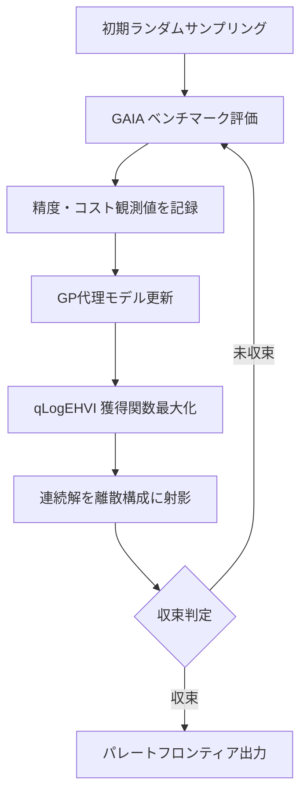

本記事は [MALBO: Optimizing LLM-Based Multi-Agent Teams via Multi-Objective Bayesian Optimization](https://arxiv.org/abs/2511.11788) の解説記事です。

## 論文概要（Abstract）

MALBOは、LLMベースのマルチエージェントシステムにおけるモデル割当を多目的最適化問題として定式化するフレームワークである。$M$個のLLMと$N$個のエージェント役割がある場合、可能な構成は$M^N$通りに達する。著者らは、タスク精度と推論コストのトレードオフをパレートフロンティアとして探索するため、独立なガウス過程代理モデルとExpected Hypervolume Improvement（EHVI）獲得関数に基づく多目的ベイズ最適化（MOBO）を採用した。著者らは、ランダム探索と比較して45%以上のコスト削減を達成し、均質構成に対して最大65.8%のコスト削減を報告している（論文Section 5）。

この記事は [Zenn記事: CrewAI本番運用の実践ガイド：テスト・チェックポイント・コスト制御の実装](https://zenn.dev/0h_n0/articles/123b708fa66ec6) の深掘りです。

## 情報源

- **arXiv ID**: 2511.11788
- **URL**: [https://arxiv.org/abs/2511.11788](https://arxiv.org/abs/2511.11788)
- **著者**: Antonio Sabbatella（University of Milano-Bicocca、修士論文）
- **発表年**: 2025年11月
- **分野**: cs.MA（マルチエージェントシステム）、cs.AI（人工知能）
- **ライセンス**: CC BY-SA 4.0

## 背景と動機（Background & Motivation）

LLMベースのマルチエージェントシステムでは、各エージェントにどのモデルを割り当てるかが精度とコストの両面で決定的に重要である。CrewAIのような実用的なフレームワークでは、3〜4エージェント構成が推奨され、`max_rpm`や`max_tokens_per_minute`でコスト制御を行うが、モデル選択自体は人手のヒューリスティックに依存している。

9種のLLMと4つのエージェント役割がある場合、組合せは$9^4 = 6{,}561$通りとなる。さらに、各構成の評価にはベンチマークタスクの実行が必要であり、1回の評価に数ドルのAPI費用がかかる。この「高コストなブラックボックス評価」と「精度・コスト間のトレードオフ」という2つの障壁が、体系的な最適化を困難にしていた。MALBOは、この問題をサンプル効率の高いベイズ最適化で解決する手法を提案している。

## 主要な貢献（Key Contributions）

- **多目的最適化としての定式化**: マルチエージェントLLMのモデル割当問題を、タスク精度とコストの2目的最適化問題として初めて体系的に定式化した
- **連続特徴空間への緩和**: 離散的なモデル選択空間を連続特徴空間$\mathbb{R}^{N \times D}$に埋め込み、ガウス過程による効率的な探索を可能にした
- **パレートフロンティアの自動探索**: qLogEHVI獲得関数により、限られた評価回数で精度-コストのパレート最適解集合を同定した
- **エージェント役割感度の発見**: Managerエージェントがモデル品質に最も敏感であり、Searchエージェントは低コストモデルで代替可能であることをデータ駆動で示した

## 技術的詳細（Technical Details）

### フレームワーク全体像

MALBOの最適化ループを以下に示す。



### 多目的最適化の定式化

著者らは、チーム構成$\mathbf{x}$を連続特徴空間の点として表現する。$M$個のLLMそれぞれを$D$次元の特徴ベクトルで表し、$N$個のエージェントへの割当を以下のように定式化している。

$$
\mathbf{x} = [\mathbf{l}_1, \mathbf{l}_2, \ldots, \mathbf{l}_N] \in \mathbb{R}^{N \times D}
$$

ここで、
- $\mathbf{l}_i \in \mathbb{R}^D$: エージェント$i$に割り当てるLLMの特徴ベクトル
- $D$: 各LLMの能力・コスト特徴の次元数
- $N$: エージェント役割の数

ブラックボックス目的関数$f: \mathcal{X} \to \mathbb{R}^2$は以下の2目的を出力する。

$$
f(\mathbf{x}) = \begin{pmatrix} f_{\text{acc}}(\mathbf{x}) \\ f_{\text{cost}}(\mathbf{x}) \end{pmatrix}
$$

ここで$f_{\text{acc}}$はタスク精度（最大化）、$f_{\text{cost}}$は推論コスト（最小化）である。

### ガウス過程代理モデル

各目的関数に対して独立なガウス過程（GP）を構築する。$n$回の評価データ$\mathcal{D}_n = \{(\mathbf{x}_i, y_i)\}_{i=1}^{n}$が与えられたとき、新しい構成$\mathbf{x}_*$に対する事後分布は以下のとおりである。

$$
p(f_* \mid \mathbf{x}_*, \mathcal{D}_n) = \mathcal{N}\left(\mu_n(\mathbf{x}_*),\; \sigma_n^2(\mathbf{x}_*)\right)
$$

$$
\mu_n(\mathbf{x}_*) = \mathbf{k}_*^T (\mathbf{K} + \sigma_\epsilon^2 \mathbf{I})^{-1} \mathbf{y}
$$

$$
\sigma_n^2(\mathbf{x}_*) = k(\mathbf{x}_*, \mathbf{x}_*) - \mathbf{k}_*^T (\mathbf{K} + \sigma_\epsilon^2 \mathbf{I})^{-1} \mathbf{k}_*
$$

ここで、
- $\mu_n(\mathbf{x}_*)$: 事後平均（精度またはコストの予測値）
- $\sigma_n^2(\mathbf{x}_*)$: 事後分散（予測の不確実性）
- $\mathbf{K}$: カーネル行列、$[\mathbf{K}]_{ij} = k(\mathbf{x}_i, \mathbf{x}_j)$
- $\mathbf{k}_*$: 新点と既存点間のカーネルベクトル
- $\sigma_\epsilon^2$: 観測ノイズの分散

GP代理モデルにより、未評価の構成に対する精度・コストの予測と不確実性の定量化が可能になる。

### 獲得関数: qLogEHVI

次に評価する構成の選択には、q-Log Expected Hypervolume Improvement（qLogEHVI）獲得関数を使用する。これは、現在のパレートフロンティア$\mathcal{P}_n$に対するハイパーボリューム改善の期待値を最大化する。

$$
\alpha_{\text{qEHVI}}(\mathbf{X}_q) = \mathbb{E}\left[\text{HV}\left(\mathcal{P}_n \cup \{f(\mathbf{x}) \mid \mathbf{x} \in \mathbf{X}_q\}\right) - \text{HV}(\mathcal{P}_n)\right]
$$

ここで、
- $\text{HV}(\mathcal{P})$: パレートフロンティア$\mathcal{P}$が支配する領域のハイパーボリューム
- $\mathbf{X}_q$: 同時に評価する$q$個の候補構成のバッチ
- qLogEHVI: 数値安定性のため対数変換を適用した変種

次の候補は以下のように決定される。

$$
\mathbf{x}_{n+1} = \arg\max_{\mathbf{x} \in \mathcal{X}} \alpha(\mathbf{x} \mid \mathcal{D}_n)
$$

### 連続解の離散射影

連続特徴空間で得られた最適解を、実際に利用可能なLLMに射影する関数$\pi$を定義する。

$$
\pi(\mathbf{l}_i^*) = \arg\min_{\mathbf{l}_j \in \mathbf{L}} \|\mathbf{l}_i^* - \mathbf{l}_j\|_2
$$

ここで$\mathbf{L} \in \mathbb{R}^{M \times D}$は利用可能なLLMの特徴行列である。この射影により、連続最適化の解が実行可能な離散構成に変換される。

## 実装のポイント（Implementation）

MALBOをCrewAIのようなマルチエージェントフレームワークに適用する際の要点を以下に示す。

```python
from dataclasses import dataclass
from typing import TypeAlias

import numpy as np

ModelName: TypeAlias = str


@dataclass(frozen=True)
class LLMFeature:
    """LLMの特徴ベクトル表現

    Attributes:
        name: モデル識別名
        capability: 能力スコア（ベンチマーク由来）
        cost_per_1k_input: 入力1Kトークンあたりコスト（USD）
        cost_per_1k_output: 出力1Kトークンあたりコスト（USD）
        context_window: コンテキスト長
    """
    name: ModelName
    capability: float
    cost_per_1k_input: float
    cost_per_1k_output: float
    context_window: int

    def to_vector(self) -> np.ndarray:
        """特徴空間への埋め込みベクトルを返す"""
        return np.array([
            self.capability,
            self.cost_per_1k_input,
            self.cost_per_1k_output,
            np.log2(self.context_window),
        ])


def project_to_nearest_model(
    continuous_vector: np.ndarray,
    model_pool: list[LLMFeature],
) -> LLMFeature:
    """連続特徴空間の点を最近傍のLLMに射影する

    Args:
        continuous_vector: GP最適化で得られた連続ベクトル
        model_pool: 利用可能なLLMのリスト

    Returns:
        最近傍のLLMFeature
    """
    distances = [
        np.linalg.norm(continuous_vector - m.to_vector())
        for m in model_pool
    ]
    return model_pool[int(np.argmin(distances))]
```

著者らの実験では、Managerエージェント（タスク計画・分解を担当）がモデル品質に最も敏感であり、高性能モデルを割り当てる必要がある一方、Searchエージェント（情報検索）は比較的低コストなモデルでも性能を維持できることが示されている。CrewAIの`max_rpm`制限と組み合わせることで、MALBOの最適構成をそのまま本番環境に反映できる。

## Production Deployment Guide

MALBOの知見を活用し、コスト最適化されたマルチエージェントシステムをAWS上に構築する際の実践ガイドを示す。

> **注意**: 以下のコスト試算は2026年6月時点のAWS ap-northeast-1（東京）リージョンの概算値です。実際のコストはトラフィックパターン、リージョン、バースト使用量により変動します。最新料金は[AWS料金計算ツール](https://calculator.aws.amazon.com/)で確認してください。

### AWS実装パターン（コスト最適化重視）

MALBOの示すモデルルーティング戦略をAWS Bedrockのインテリジェントプロンプトルーティングと組み合わせる構成を提示する。

| 項目 | Small (~100 req/日) | Medium (~1,000 req/日) | Large (10,000+ req/日) |
|------|---------------------|------------------------|------------------------|
| **コンピュート** | Lambda (512MB) | ECS Fargate (1vCPU/2GB) | EKS + Spot (m6i.xlarge) |
| **LLM基盤** | Bedrock (On-Demand) | Bedrock (Provisioned) | Bedrock + SageMaker Endpoint |
| **ルーティング** | Lambda内ルーティング | Bedrock Intelligent Routing | カスタムルーター (EKS Pod) |
| **状態管理** | DynamoDB (On-Demand) | DynamoDB (Provisioned) | DynamoDB + ElastiCache |
| **監視** | CloudWatch基本 | CloudWatch + X-Ray | CloudWatch + X-Ray + Grafana |
| **月額概算** | $80-180 | $400-900 | $2,500-5,500 |

**コスト削減テクニック**:
- Spot Instances活用: EKSワーカーノードで最大90%削減
- Reserved Instances: Fargate/EC2の1年コミットで最大72%削減
- Bedrock Batch API: 非同期処理で50%削減
- Prompt Caching: 繰り返しプロンプトで30-90%削減
- Bedrock Intelligent Prompt Routing: 同一モデルファミリー内の自動ルーティングで最大30%削減

MALBOの知見に基づくモデル選択戦略の核心は、エージェント役割ごとにモデルクラスを分けることにある。

| エージェント役割 | 推奨モデルクラス | Bedrockモデル例 | コスト感度 |
|-----------------|-----------------|----------------|-----------|
| Manager（計画・分解） | Large | Claude Sonnet 4.6 | 高（品質優先） |
| Analyzer（分析） | Medium | Claude Haiku 4.5 | 中 |
| Search（検索） | Small | Amazon Nova Micro | 低（コスト優先） |
| Formatter（整形） | Small | Amazon Nova Micro | 低（コスト優先） |

### Terraformインフラコード

#### Small構成（Serverless: Lambda + Bedrock + DynamoDB）

```hcl
# --- Small構成: マルチエージェントLLMシステム ---
# MALBOベースのモデルルーティング + Serverless

terraform {
  required_version = ">= 1.9"
  required_providers {
    aws = { source = "hashicorp/aws", version = "~> 5.80" }
  }
}

provider "aws" {
  region = "ap-northeast-1"
}

# IAMロール（最小権限）
resource "aws_iam_role" "agent_lambda" {
  name = "malbo-agent-lambda-role"
  assume_role_policy = jsonencode({
    Version = "2012-10-17"
    Statement = [{
      Action = "sts:AssumeRole"
      Effect = "Allow"
      Principal = { Service = "lambda.amazonaws.com" }
    }]
  })
}

resource "aws_iam_role_policy" "bedrock_invoke" {
  name = "bedrock-invoke"
  role = aws_iam_role.agent_lambda.id
  policy = jsonencode({
    Version = "2012-10-17"
    Statement = [
      {
        Effect = "Allow"
        Action = [
          "bedrock:InvokeModel",
          "bedrock:InvokeModelWithResponseStream"
        ]
        # モデルルーティング: Manager用大型 + Search用小型
        Resource = [
          "arn:aws:bedrock:ap-northeast-1::foundation-model/anthropic.claude-sonnet-4-6*",
          "arn:aws:bedrock:ap-northeast-1::foundation-model/amazon.nova-micro*"
        ]
      },
      {
        Effect   = "Allow"
        Action   = ["dynamodb:PutItem", "dynamodb:GetItem", "dynamodb:Query"]
        Resource = aws_dynamodb_table.agent_state.arn
      },
      {
        Effect   = "Allow"
        Action   = ["logs:CreateLogGroup", "logs:CreateLogStream", "logs:PutLogEvents"]
        Resource = "arn:aws:logs:ap-northeast-1:*:*"
      }
    ]
  })
}

# DynamoDB（エージェント状態管理、On-Demand）
resource "aws_dynamodb_table" "agent_state" {
  name         = "malbo-agent-state"
  billing_mode = "PAY_PER_REQUEST"
  hash_key     = "session_id"
  range_key    = "agent_role"

  attribute {
    name = "session_id"
    type = "S"
  }
  attribute {
    name = "agent_role"
    type = "S"
  }

  server_side_encryption { enabled = true }
  point_in_time_recovery { enabled = true }
}

# Lambda関数（マルチエージェントオーケストレータ）
resource "aws_lambda_function" "orchestrator" {
  function_name = "malbo-orchestrator"
  runtime       = "python3.13"
  handler       = "handler.lambda_handler"
  role          = aws_iam_role.agent_lambda.arn
  timeout       = 300
  memory_size   = 512
  filename      = "lambda.zip"

  environment {
    variables = {
      MANAGER_MODEL  = "anthropic.claude-sonnet-4-6-20260514-v1:0"
      SEARCH_MODEL   = "amazon.nova-micro-v1:0"
      STATE_TABLE    = aws_dynamodb_table.agent_state.name
    }
  }

  tracing_config { mode = "Active" }  # X-Ray有効化
}

# CloudWatchアラーム（コスト異常検知）
resource "aws_cloudwatch_metric_alarm" "lambda_cost" {
  alarm_name          = "malbo-lambda-duration-high"
  comparison_operator = "GreaterThanThreshold"
  evaluation_periods  = 3
  metric_name         = "Duration"
  namespace           = "AWS/Lambda"
  period              = 300
  statistic           = "Average"
  threshold           = 60000  # 60秒超過で警告
  alarm_actions       = []     # SNSトピックARNを設定

  dimensions = {
    FunctionName = aws_lambda_function.orchestrator.function_name
  }
}
```

#### Large構成（Container: EKS + Karpenter + Spot）

```hcl
# --- Large構成: EKS + Karpenter + Spot Instances ---

module "eks" {
  source  = "terraform-aws-modules/eks/aws"
  version = "~> 20.31"

  cluster_name    = "malbo-agents"
  cluster_version = "1.32"

  vpc_id     = module.vpc.vpc_id
  subnet_ids = module.vpc.private_subnets

  # コスト最適化: パブリックアクセス最小化
  cluster_endpoint_public_access  = true
  cluster_endpoint_private_access = true

  eks_managed_node_groups = {
    system = {
      instance_types = ["m6i.large"]
      min_size       = 1
      max_size       = 2
      desired_size   = 1
    }
  }
}

# Karpenter Provisioner（Spot優先で最大90%コスト削減）
resource "kubectl_manifest" "karpenter_nodepool" {
  yaml_body = yamlencode({
    apiVersion = "karpenter.sh/v1"
    kind       = "NodePool"
    metadata   = { name = "malbo-agents" }
    spec = {
      template = {
        spec = {
          requirements = [
            { key = "karpenter.sh/capacity-type", operator = "In", values = ["spot", "on-demand"] },
            { key = "node.kubernetes.io/instance-type", operator = "In",
              values = ["m6i.xlarge", "m6i.2xlarge", "m7i.xlarge", "m7i.2xlarge"] },
          ]
          nodeClassRef = { group = "karpenter.k8s.aws", kind = "EC2NodeClass", name = "default" }
        }
      }
      limits   = { cpu = "64", memory = "256Gi" }
      disruption = {
        consolidationPolicy = "WhenEmptyOrUnderutilized"
        consolidateAfter    = "60s"
      }
    }
  })
}

# Secrets Manager（Bedrock設定）
resource "aws_secretsmanager_secret" "model_config" {
  name                    = "malbo/model-routing-config"
  recovery_window_in_days = 7
}

resource "aws_secretsmanager_secret_version" "model_config" {
  secret_id = aws_secretsmanager_secret.model_config.id
  secret_string = jsonencode({
    manager_model  = "anthropic.claude-sonnet-4-6-20260514-v1:0"
    analyzer_model = "anthropic.claude-haiku-4-5-20260514-v1:0"
    search_model   = "amazon.nova-micro-v1:0"
    format_model   = "amazon.nova-micro-v1:0"
  })
}

# AWS Budgets（月額予算アラート）
resource "aws_budgets_budget" "monthly" {
  name         = "malbo-monthly-budget"
  budget_type  = "COST"
  limit_amount = "5000"
  limit_unit   = "USD"
  time_unit    = "MONTHLY"

  notification {
    comparison_operator       = "GREATER_THAN"
    threshold                 = 80
    threshold_type            = "PERCENTAGE"
    notification_type         = "FORECASTED"
    subscriber_email_addresses = ["ops-team@example.com"]
  }
}
```

### 運用・監視設定

**CloudWatch Logs Insights クエリ**（コスト異常検知）:

```
# 1時間あたりのBedrock トークン使用量
fields @timestamp, @message
| filter @message like /inputTokens/
| stats sum(inputTokens) as total_input, sum(outputTokens) as total_output by bin(1h) as hour
| sort hour desc
```

**CloudWatch Logs Insights クエリ**（レイテンシ分析）:

```
# P95/P99 レイテンシ
fields @timestamp, duration_ms, agent_role
| stats percentile(duration_ms, 95) as p95, percentile(duration_ms, 99) as p99 by agent_role
```

**CloudWatch アラーム設定（Python）**:

```python
import boto3


def create_bedrock_token_alarm(sns_topic_arn: str) -> dict:
    """Bedrockトークン使用量のスパイク検知アラームを作成する

    Args:
        sns_topic_arn: 通知先のSNSトピックARN

    Returns:
        CloudWatch APIレスポンス
    """
    cw = boto3.client("cloudwatch", region_name="ap-northeast-1")
    return cw.put_metric_alarm(
        AlarmName="malbo-bedrock-token-spike",
        MetricName="InputTokenCount",
        Namespace="AWS/Bedrock",
        Statistic="Sum",
        Period=3600,
        EvaluationPeriods=2,
        Threshold=500_000,
        ComparisonOperator="GreaterThanThreshold",
        AlarmActions=[sns_topic_arn],
    )
```

**X-Ray トレーシング設定（Python）**:

```python
from aws_xray_sdk.core import xray_recorder, patch_all

# boto3自動計装
patch_all()


def trace_agent_call(agent_role: str, model_id: str) -> None:
    """エージェント呼び出しにX-Rayアノテーションを付与する

    Args:
        agent_role: エージェントの役割名
        model_id: 使用するBedrockモデルID
    """
    segment = xray_recorder.current_segment()
    segment.put_annotation("agent_role", agent_role)
    segment.put_annotation("model_id", model_id)
    segment.put_metadata("routing_strategy", "malbo_pareto", "agent_config")
```

**Cost Explorer 日次レポート（Python）**:

```python
from datetime import date, timedelta

import boto3


def get_daily_bedrock_cost(target_date: date | None = None) -> dict:
    """日次Bedrockコストを取得し、閾値超過時にSNS通知する

    Args:
        target_date: 対象日（デフォルト: 前日）

    Returns:
        サービス別コストの辞書
    """
    if target_date is None:
        target_date = date.today() - timedelta(days=1)

    ce = boto3.client("ce", region_name="us-east-1")
    resp = ce.get_cost_and_usage(
        TimePeriod={
            "Start": target_date.isoformat(),
            "End": (target_date + timedelta(days=1)).isoformat(),
        },
        Granularity="DAILY",
        Metrics=["UnblendedCost"],
        Filter={
            "Dimensions": {
                "Key": "SERVICE",
                "Values": ["Amazon Bedrock", "AWS Lambda", "Amazon EKS"],
            }
        },
        GroupBy=[{"Type": "DIMENSION", "Key": "SERVICE"}],
    )

    costs: dict[str, float] = {}
    for group in resp["ResultsByTime"][0]["Groups"]:
        service = group["Keys"][0]
        amount = float(group["Metrics"]["UnblendedCost"]["Amount"])
        costs[service] = amount

    total = sum(costs.values())
    if total > 100.0:
        sns = boto3.client("sns", region_name="ap-northeast-1")
        sns.publish(
            TopicArn="arn:aws:sns:ap-northeast-1:123456789012:cost-alert",
            Subject=f"MALBO日次コスト警告: ${total:.2f}",
            Message=f"日次コスト合計が$100を超過: {costs}",
        )

    return costs
```

### コスト最適化チェックリスト

**アーキテクチャ選択**:
- [ ] トラフィック量に応じた構成を選択（~100 req/日: Serverless、~1,000: Hybrid、10,000+: Container）
- [ ] MALBOのパレート最適解に基づくモデル割当を適用

**リソース最適化**:
- [ ] EC2/EKSワーカーノード: Spot Instances優先（最大90%削減）
- [ ] Reserved Instances: 1年コミットで安定ワークロードを削減（最大72%）
- [ ] Savings Plans: Compute Savings Plansで柔軟に削減
- [ ] Lambda: Power Tuningでメモリサイズを最適化
- [ ] ECS/EKS: Karpenterでアイドル時自動スケールダウン
- [ ] NAT Gateway: VPCエンドポイント活用で削減

**LLMコスト削減**:
- [ ] Bedrock Batch API: 非同期処理可能なタスクで50%削減
- [ ] Prompt Caching: 繰り返しシステムプロンプトで30-90%削減
- [ ] モデル選択ロジック: MALBOの役割別モデル割当を実装（Manager=Large、Search=Small）
- [ ] トークン数制限: `max_tokens`を役割ごとに設定
- [ ] Bedrock Intelligent Prompt Routing: 同一ファミリー内の自動ルーティングで最大30%削減

**監視・アラート**:
- [ ] AWS Budgets: 月額予算の80%で予測アラート設定
- [ ] CloudWatch アラーム: Bedrockトークン使用量・Lambda実行時間の異常検知
- [ ] Cost Anomaly Detection: ML ベースの異常検知を有効化
- [ ] 日次コストレポート: Cost Explorer APIで自動取得・SNS通知
- [ ] X-Rayトレーシング: エージェント間のレイテンシ・ボトルネック可視化

**リソース管理**:
- [ ] 未使用リソース削除: Trusted Advisorで定期確認
- [ ] タグ戦略: `project=malbo`, `agent_role=manager`等で全リソースにタグ付与
- [ ] ライフサイクルポリシー: CloudWatch Logsの保持期間を30日に設定
- [ ] 開発環境夜間停止: EventBridgeスケジュールで非営業時間に停止
- [ ] ECRイメージクリーンアップ: ライフサイクルポリシーで古いイメージを自動削除

## 実験結果（Results）

著者らはGAIAベンチマークの10タスクサブセットを用いて9種のLLMで評価を行っている。使用モデルはMeta Llama 3.1 8B/3.3 70B、Mistral 7B、GPT-OSS 20B/120B、Qwen3 32B/Coder 30B、Claude 3.5 Haiku、DeepSeek-V3、Amazon Nova Microである。

主な結果は以下のとおりである（論文Section 5）。

| 比較対象 | コスト削減率 | 精度維持 |
|---------|------------|---------|
| ランダム探索 vs MOBO最適化 | 45%以上 | 同等の平均精度 |
| 均質構成 vs 異質最適構成 | 最大65.8% | 最大精度を維持 |

著者らは、パレートフロンティアの進化過程において、初期ランダムサンプリングからベイズ最適化ループを経て収束的にフロンティアが改善されることを報告している。最終的なパレート解集合には、以下の3つのアーキタイプが含まれる。

1. **コスト最適化・最大精度型**: 重要なエージェント（Manager）に高性能モデル、補助エージェントに低コストモデルを配置
2. **バランス型**: 中規模モデルを均等に分配し、精度とコストを両立
3. **最小コスト型**: 低コストモデル中心の構成で、許容可能な精度を維持

推論コストの計算は$\text{Total Cost} = (\text{Input Tokens} \times \text{Price}_{\text{in}}) + (\text{Output Tokens} \times \text{Price}_{\text{out}})$に基づく。著者らは、トークン単価だけでは真の運用コストを捉えられないと指摘しており、モデルごとのトークン効率の違いを考慮する必要があることを強調している。

## 実運用への応用（Practical Applications）

MALBOの知見はCrewAIユーザーにとって直接的に有用である。Zenn記事「[CrewAI本番運用の実践ガイド](https://zenn.dev/0h_n0/articles/123b708fa66ec6)」で述べた3〜4エージェント構成の推奨に加え、MALBOは各エージェントにどのモデルを割り当てるべきかをデータ駆動で決定する手法を提供する。

具体的な適用方針は以下のとおりである。

- **段階的なモデル割当**: 全エージェントに同一モデルを使う均質構成から脱却し、MALBOのパレート解に基づく異質構成に移行する。これにより最大65.8%のコスト削減が可能である
- **Managerエージェントの優先投資**: タスク分解・計画を担うManagerには高性能モデルを割り当て、情報検索や整形など定型的なタスクを担うエージェントには低コストモデルを使用する
- **評価コストの管理**: MALBOは少数の評価（サンプル効率の高いベイズ最適化）でパレートフロンティアを同定できるため、本番環境でのA/Bテストコストを抑えられる
- **動的ルーティングとの併用**: AWS Bedrock Intelligent Prompt Routingと組み合わせ、静的なモデル割当と動的なクエリルーティングの2層構成でコストを最小化する

## 関連研究（Related Work）

- **RouteLLM** (Ong et al., 2024; arXiv:2406.18665): 人間の選好データを用いてstrong/weakモデル間のルーティングを学習する手法。MALBOが多目的最適化でパレートフロンティア全体を探索するのに対し、RouteLLMは二値分類ベースのルーティングに特化している
- **AutoMix** (Aggarwal & Madaan et al., 2024; arXiv:2310.12963): 小型モデルの出力信頼度をPOMDPで判定し、必要に応じて大型モデルにエスカレーションする手法。NeurIPS 2024ポスター採択。コスト50%以上削減を報告しているが、単一タスクのモデル切替に限定される
- **BAMAS** (2025; arXiv:2511.21572): 整数線形計画法でLLM選択を最適化し、強化学習でエージェント間トポロジーを決定する手法。コスト86%削減を報告しているが、MALBOのようなパレートフロンティア探索は行わず単一目的最適化である

## まとめと今後の展望

MALBOは、マルチエージェントLLMシステムのモデル割当を多目的ベイズ最適化で自動化する手法であり、精度とコストのパレートフロンティアを効率的に同定する。著者らは45%以上のコスト削減と最大65.8%の異質構成優位性を報告しており、手動のモデル選択に代わるデータ駆動のアプローチとして有望である。

今後の研究方向として、著者らはレイテンシやハルシネーション率など追加目的の導入、複数情報源の統合、動的なエージェント構成の適応を挙げている。現時点では10タスクの限定評価であるため、より大規模なベンチマークでの検証が課題として残る。

## 参考文献

- **arXiv**: [https://arxiv.org/abs/2511.11788](https://arxiv.org/abs/2511.11788)
- **RouteLLM**: [https://arxiv.org/abs/2406.18665](https://arxiv.org/abs/2406.18665)
- **AutoMix**: [https://arxiv.org/abs/2310.12963](https://arxiv.org/abs/2310.12963)
- **BAMAS**: [https://arxiv.org/abs/2511.21572](https://arxiv.org/abs/2511.21572)
- **BoTorch Multi-Objective**: [https://botorch.org/docs/multi_objective](https://botorch.org/docs/multi_objective)
- **Related Zenn article**: [https://zenn.dev/0h_n0/articles/123b708fa66ec6](https://zenn.dev/0h_n0/articles/123b708fa66ec6)

---

*本記事はClaude Opus 4.6により自動生成されました。論文の解釈に誤りがある場合はコメントでご指摘ください。*
