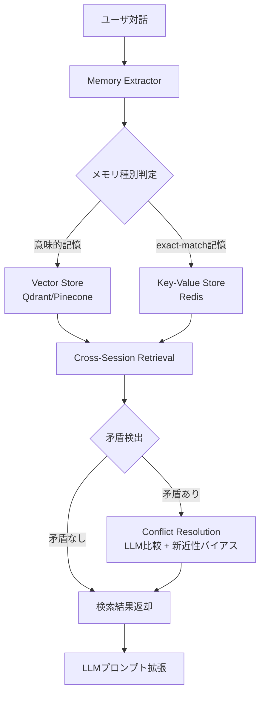
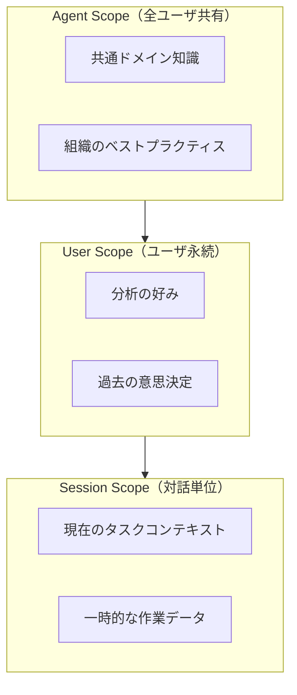

本記事は [Mem0: Building Production-Ready AI Agents with Scalable Long-Term Memory](https://arxiv.org/abs/2502.05171) の解説記事です。

## 論文概要（Abstract）

LLMの急速な発展により、マルチターン対話やエージェントの実用化が進む一方で、セッションをまたぐ長期記憶の欠如が実運用における重大な課題となっている。著者らはMem0を提案し、LLMエージェントにスケーラブルな長期記憶を付与する知的メモリレイヤーを構築した。Mem0はベクトルストアとキーバリューストアのハイブリッド構成により、意味的類似検索と完全一致検索を両立する。LOCOMOベンチマーク（300件のマルチセッション対話）において、著者らはF1スコア68.9を達成し、記憶なしの38.2、全コンテキスト入力の62.1、RAGの58.3を上回ったと報告している（論文Table 1より）。さらにトークン使用量を94%削減し、1ユーザあたり100万件のメモリをサブ100msで検索可能なスケーラビリティを実現した。

この記事は [Zenn記事: Stateful MCPサーバーで社内データ分析エージェントを構築する](https://zenn.dev/0h_n0/articles/d759354462a484) の深掘りです。

## 情報源

- **arXiv ID**: 2502.05171
- **URL**: [https://arxiv.org/abs/2502.05171](https://arxiv.org/abs/2502.05171)
- **著者**: Prateek Chhikara, Taranjeet Singh, Deshraj Yadav
- **発表年**: 2025
- **分野**: cs.LG, cs.AI, cs.CL
- **コード**: [https://github.com/mem0ai/mem0](https://github.com/mem0ai/mem0)（MIT License）

## 背景と動機（Background & Motivation）

現在のLLMは各セッションが独立しており、過去の対話で得た情報を次のセッションに引き継ぐ仕組みを持たない。たとえばユーザが「前回の会議で決まったデータベーススキーマに基づいてクエリを書いて」と依頼しても、エージェントは前回の会議内容を保持していないため、ユーザは毎回同じコンテキストを再入力する必要がある。

この課題に対する従来のアプローチにはそれぞれ限界がある。全会話履歴をコンテキストに含める方式は、コンテキストウィンドウの制約とコスト増大に直面する。著者らの実験では全コンテキスト方式のトークン使用量は記憶なしの47倍に達したと報告している（論文Section 5.2より）。要約ベースの方式は情報圧縮時に詳細を失い、F1スコアが55.8にとどまった。RAG（Retrieval-Augmented Generation）はドキュメント検索には有効だが、「ユーザの好み」「過去の修正指示」といった暗黙的・動的な記憶の管理には適していない。

MCPサーバーにおけるステート管理との接点も重要である。Zenn記事で解説したMCPのStreamable HTTPトランスポートでは`Mcp-Session-Id`によるセッション管理を実現しているが、セッション内の一時的な状態管理にとどまる。Mem0はこのセッション層の上位に位置し、セッション間で持続するユーザの分析パターンや意思決定履歴を保持する記憶層として機能する。

## 主要な貢献（Key Contributions）

- **LLMベース記憶抽出器**: 会話からメモリに値する事実（ユーザの好み、タスク固有情報、修正指示）を自動的に識別・抽出する
- **ハイブリッドストレージアーキテクチャ**: ベクトルストア（Qdrant/Pinecone）による意味的類似検索とキーバリューストア（Redis）による完全一致検索を統合
- **3層メモリスコープ**: ユーザレベル（永続的）、セッションレベル（対話単位）、エージェントレベル（ユーザ間共有）の3階層
- **矛盾解決メカニズム**: 意味的類似度とLLM比較による矛盾検出、新近性バイアスの適用、矛盾履歴の監査ログ
- **本番運用実績**: 抽出180ms、検索35ms（P99: 120ms）のレイテンシで100万メモリ/ユーザのスケーラビリティを実証

## 技術的詳細（Technical Details）

### アーキテクチャ全体像

Mem0のアーキテクチャは、メモリ抽出・保存・検索・矛盾解決の4つのコアコンポーネントで構成される。



### メモリ抽出プロセス

Memory Extractorは会話のターンごとにLLMを呼び出し、記憶に値する事実を構造化データとして抽出する。抽出対象は以下の4カテゴリに分類される。

1. **ユーザの好み**: 「SQLよりPandasが好き」「可視化はPlotlyを使いたい」
2. **タスク固有情報**: 「売上テーブルのカラム名はrevenue_jpy」「集計期間は四半期単位」
3. **修正指示**: 「前回のグラフの軸ラベルが間違っていたので修正して」
4. **エンティティ関連**: 「プロジェクトAのデータベースはPostgreSQL 15」

各メモリエントリには以下のメタデータが付与される。

$$
m = (c, s, t, \mathbf{e}, \text{meta})
$$

ここで $c$ はテキスト内容、$s$ はスコープ（user/session/agent）、$t$ はタイムスタンプ、$\mathbf{e}$ は埋め込みベクトル、$\text{meta}$ はカテゴリ・ソース情報等のメタデータである。

### ハイブリッドストレージ

ベクトルストアは意味的類似検索を担当する。ユーザの質問「前回のデータ分析でどんなグラフを作った？」に対して、過去のセッションから関連するメモリを意味的に検索する。一方、キーバリューストアはユーザIDやプロジェクト名による完全一致検索を担当し、「プロジェクトXのDB設定」のような正確なルックアップに使用される。

検索時のスコアリングは以下の式で計算される（論文Section 3.3より）。

$$
\text{score}(m, q) = \alpha \cdot \text{sim}(\mathbf{e}_m, \mathbf{e}_q) + \beta \cdot \text{recency}(t_m) + \gamma \cdot \text{scope\_weight}(s_m)
$$

ここで $\text{sim}$ はコサイン類似度、$\text{recency}$ は時間減衰関数、$\text{scope\_weight}$ はスコープ優先度（session > user > agent）である。$\alpha, \beta, \gamma$ はハイパーパラメータで、著者らは $\alpha=0.7, \beta=0.2, \gamma=0.1$ をデフォルト値として報告している。

### 3層メモリスコープ



この3層構造はMCPサーバーのステート管理と直接対応する。Zenn記事で解説したMCPの3層ステートアーキテクチャ（インメモリ/SQLite/Redis）と比較すると、Mem0のSession ScopeはMCPの`Mcp-Session-Id`に紐づくインメモリ状態に、User ScopeはSQLiteによるチェックポイント永続化に、Agent ScopeはRedisによる共有状態にそれぞれ対応する。

### 矛盾解決メカニズム

新しいメモリが既存メモリと矛盾する場合（例: 「集計はMonthlyで」→「集計はWeeklyに変更して」）、以下のプロセスで解決する。

1. **意味的類似度チェック**: 新メモリの埋め込みと既存メモリ群との類似度を計算し、閾値（デフォルト0.85）以上のものを矛盾候補とする
2. **LLM比較判定**: 候補ペアをLLMに入力し、矛盾・更新・補完のいずれかを判定
3. **新近性バイアス**: 矛盾と判定された場合、より新しいメモリを優先し、古いメモリにはdeprecatedフラグを付与
4. **監査ログ**: 矛盾の検出・解決履歴をconflict historyとして記録し、トレーサビリティを確保

## 実装のポイント（Implementation Notes）

### SDK統合パターン

Mem0はPython SDKとして提供されており、既存のLLMアプリケーションに最小限のコード変更で統合できる。

```python
from mem0 import Memory
from typing import Any


def create_memory_client(
    vector_store: str = "qdrant",
    embedding_model: str = "text-embedding-3-small",
) -> Memory:
    """Mem0メモリクライアントを初期化する。

    Args:
        vector_store: 使用するベクトルストアの種別
        embedding_model: 埋め込みモデル名

    Returns:
        初期化済みMemoryインスタンス
    """
    config = {
        "vector_store": {
            "provider": vector_store,
            "config": {
                "collection_name": "agent_memories",
                "embedding_model_dims": 1536,
            },
        },
        "llm": {
            "provider": "openai",
            "config": {"model": "gpt-4o-mini", "temperature": 0.0},
        },
    }
    return Memory.from_config(config)


def add_and_search_memory(
    client: Memory,
    conversation: str,
    query: str,
    user_id: str,
    session_id: str | None = None,
) -> list[dict[str, Any]]:
    """会話からメモリを抽出し、クエリで検索する。

    Args:
        client: Mem0クライアント
        conversation: 記憶対象の会話テキスト
        query: 検索クエリ
        user_id: ユーザ識別子
        session_id: セッション識別子（省略時はuser scope）

    Returns:
        関連メモリのリスト
    """
    # メモリ抽出・保存
    client.add(
        conversation,
        user_id=user_id,
        metadata={"session_id": session_id} if session_id else {},
    )

    # クロスセッション検索
    results: list[dict[str, Any]] = client.search(
        query,
        user_id=user_id,
        limit=10,
    )
    return results
```

### 検索結果のプルーニング

大量のメモリが蓄積された場合、検索結果の品質を維持するためにプルーニング戦略が重要になる。著者らはTemporal Decayとアクセス頻度に基づくプルーニングを組み合わせている。

```python
import math
from dataclasses import dataclass, field
from datetime import datetime


@dataclass
class MemoryEntry:
    """メモリエントリの構造体。

    Attributes:
        content: メモリの内容
        created_at: 作成日時
        last_accessed: 最終アクセス日時
        access_count: アクセス回数
        scope: メモリスコープ（user/session/agent）
        deprecated: 非推奨フラグ
    """

    content: str
    created_at: datetime
    last_accessed: datetime
    access_count: int = 0
    scope: str = "user"
    deprecated: bool = False


def compute_retention_score(
    entry: MemoryEntry,
    now: datetime,
    half_life_days: float = 30.0,
) -> float:
    """メモリ保持スコアを計算する。

    時間減衰とアクセス頻度を組み合わせたスコアで、
    閾値以下のメモリはプルーニング対象となる。

    Args:
        entry: 対象メモリエントリ
        now: 現在時刻
        half_life_days: 半減期（日数）

    Returns:
        0.0-1.0の保持スコア
    """
    if entry.deprecated:
        return 0.0

    days_since_access = (now - entry.last_accessed).total_seconds() / 86400
    decay = math.exp(-0.693 * days_since_access / half_life_days)

    frequency_boost = min(1.0, math.log1p(entry.access_count) / 5.0)

    return 0.6 * decay + 0.4 * frequency_boost
```

## 本番環境デプロイガイド（Production Deployment Guide）

### AWS実装パターン

Mem0のようなメモリレイヤーを本番環境にデプロイする際の構成パターンを示す。以下の料金は2026年6月時点の東京リージョン概算であり、実際の料金はAWS公式の料金ページを参照すること。

| 構成 | 月額概算 | 主要サービス | 想定ユーザ数 |
|------|----------|-------------|-------------|
| Small | $50-150/月 | Lambda + Bedrock + DynamoDB | ~100人 |
| Medium | $300-800/月 | ECS Fargate + ElastiCache + OpenSearch Serverless | ~1,000人 |
| Large | $2,000-5,000/月 | EKS + Karpenter + Spot + OpenSearch | ~10,000人 |

**Small構成の内訳**:
- Lambda: $5-15（月100万リクエスト想定）
- Bedrock（Claude Haiku）: $20-80（メモリ抽出・矛盾解決）
- DynamoDB（オンデマンド）: $10-30（メモリ保存・検索）
- CloudWatch: $5-10（ログ・メトリクス）

**Large構成の内訳**:
- EKS コントロールプレーン: $73
- EC2（Spot m6i.xlarge x 3）: $200-400
- OpenSearch（3ノード）: $500-1,000（ベクトル検索）
- ElastiCache Redis: $300-500（KVストア + セッション管理）
- ALB + NAT Gateway: $100-200
- Bedrock / SageMaker: $500-2,000（LLM推論）

### Terraformインフラコード

#### Small構成（Lambda + DynamoDB）

```hcl
# Small構成: サーバーレスメモリレイヤー
# VPC（NAT Gateway不要でコスト削減）

module "vpc" {
  source  = "terraform-aws-modules/vpc/aws"
  version = "5.16.0"

  name = "mem0-small-vpc"
  cidr = "10.0.0.0/16"

  azs            = ["ap-northeast-1a", "ap-northeast-1c"]
  public_subnets = ["10.0.1.0/24", "10.0.2.0/24"]

  enable_nat_gateway = false
  enable_vpn_gateway = false
}

# DynamoDB（オンデマンド課金）
resource "aws_dynamodb_table" "memories" {
  name         = "mem0-memories"
  billing_mode = "PAY_PER_REQUEST"
  hash_key     = "user_id"
  range_key    = "memory_id"

  attribute {
    name = "user_id"
    type = "S"
  }

  attribute {
    name = "memory_id"
    type = "S"
  }

  attribute {
    name = "scope"
    type = "S"
  }

  global_secondary_index {
    name            = "scope-index"
    hash_key        = "scope"
    range_key       = "memory_id"
    projection_type = "ALL"
  }

  point_in_time_recovery {
    enabled = true
  }

  server_side_encryption {
    enabled = true
  }
}

# IAM（最小権限）
resource "aws_iam_role" "lambda_role" {
  name = "mem0-lambda-role"

  assume_role_policy = jsonencode({
    Version = "2012-10-17"
    Statement = [{
      Action = "sts:AssumeRole"
      Effect = "Allow"
      Principal = { Service = "lambda.amazonaws.com" }
    }]
  })
}

resource "aws_iam_role_policy" "lambda_policy" {
  name = "mem0-lambda-policy"
  role = aws_iam_role.lambda_role.id

  policy = jsonencode({
    Version = "2012-10-17"
    Statement = [
      {
        Effect = "Allow"
        Action = [
          "dynamodb:GetItem",
          "dynamodb:PutItem",
          "dynamodb:Query",
          "dynamodb:UpdateItem",
          "dynamodb:DeleteItem"
        ]
        Resource = [
          aws_dynamodb_table.memories.arn,
          "${aws_dynamodb_table.memories.arn}/index/*"
        ]
      },
      {
        Effect   = "Allow"
        Action   = ["bedrock:InvokeModel"]
        Resource = "arn:aws:bedrock:ap-northeast-1::foundation-model/anthropic.claude-3-5-haiku-*"
      },
      {
        Effect = "Allow"
        Action = [
          "logs:CreateLogGroup",
          "logs:CreateLogStream",
          "logs:PutLogEvents"
        ]
        Resource = "arn:aws:logs:ap-northeast-1:*:*"
      }
    ]
  })
}

# Lambda関数
resource "aws_lambda_function" "memory_api" {
  function_name = "mem0-memory-api"
  runtime       = "python3.12"
  handler       = "handler.lambda_handler"
  role          = aws_iam_role.lambda_role.arn
  timeout       = 30
  memory_size   = 512

  filename         = "lambda_package.zip"
  source_code_hash = filebase64sha256("lambda_package.zip")

  environment {
    variables = {
      DYNAMODB_TABLE = aws_dynamodb_table.memories.name
      LOG_LEVEL      = "INFO"
    }
  }
}

# CloudWatch Alarm
resource "aws_cloudwatch_metric_alarm" "lambda_errors" {
  alarm_name          = "mem0-lambda-errors"
  comparison_operator = "GreaterThanThreshold"
  evaluation_periods  = 2
  metric_name         = "Errors"
  namespace           = "AWS/Lambda"
  period              = 300
  statistic           = "Sum"
  threshold           = 5
  alarm_description   = "Lambda error rate exceeded threshold"

  dimensions = {
    FunctionName = aws_lambda_function.memory_api.function_name
  }
}
```

#### Large構成（EKS + Karpenter）

```hcl
# Large構成: EKS + Karpenter（Spot優先）

module "eks" {
  source  = "terraform-aws-modules/eks/aws"
  version = "20.31.0"

  cluster_name    = "mem0-production"
  cluster_version = "1.31"

  vpc_id     = module.vpc.vpc_id
  subnet_ids = module.vpc.private_subnets

  cluster_endpoint_public_access = false

  cluster_addons = {
    kube-proxy = { most_recent = true }
    vpc-cni    = { most_recent = true }
    coredns    = { most_recent = true }
  }

  enable_cluster_creator_admin_permissions = true
}

# Karpenter（Spot Instance優先）
resource "helm_release" "karpenter" {
  name       = "karpenter"
  repository = "oci://public.ecr.aws/karpenter"
  chart      = "karpenter"
  version    = "1.1.0"
  namespace  = "kube-system"
}

# Secrets Manager
resource "aws_secretsmanager_secret" "api_keys" {
  name                    = "mem0/api-keys"
  recovery_window_in_days = 7

  tags = {
    Environment = "production"
  }
}

# AWS Budgets
resource "aws_budgets_budget" "monthly" {
  name         = "mem0-monthly-budget"
  budget_type  = "COST"
  limit_amount = "5000"
  limit_unit   = "USD"
  time_unit    = "MONTHLY"

  notification {
    comparison_operator       = "GREATER_THAN"
    threshold                 = 80
    threshold_type            = "PERCENTAGE"
    notification_type         = "ACTUAL"
    subscriber_email_addresses = ["kbu94981@gmail.com"]
  }
}
```

### セキュリティベストプラクティス

- **IAM最小権限**: Lambda/ECSタスクロールには必要なDynamoDB/Bedrockアクションのみ許可。ワイルドカード(`*`)の使用を禁止
- **Secrets Manager**: APIキー・DB接続文字列は環境変数ではなくSecrets Managerで管理。自動ローテーション設定
- **KMS暗号化**: DynamoDBのサーバーサイド暗号化、S3バケットのデフォルト暗号化にCMK（Customer Managed Key）を使用
- **CloudTrail**: 全APIコールの監査ログを有効化。S3バケットにログ保存、不正アクセス検出のアラート設定
- **TLS 1.2+**: ALB・APIGatewayでTLS 1.2以上を強制。内部通信もmTLSを推奨

### 運用・監視

#### CloudWatch Logs Insightsクエリ

```
# メモリ抽出のレイテンシ分析
fields @timestamp, @message
| filter @message like /memory_extraction/
| stats avg(duration_ms) as avg_latency,
        pct(duration_ms, 99) as p99_latency,
        count(*) as request_count
  by bin(1h)
| sort @timestamp desc

# 矛盾解決イベントの集計
fields @timestamp, user_id, conflict_type
| filter event = "conflict_resolution"
| stats count(*) as conflicts by conflict_type
| sort conflicts desc
```

#### CloudWatchアラーム設定（boto3）

```python
import boto3


def create_memory_alarms(
    function_name: str,
    sns_topic_arn: str,
) -> list[str]:
    """Mem0メモリAPIのCloudWatchアラームを作成する。

    Args:
        function_name: Lambda関数名
        sns_topic_arn: 通知先SNSトピックARN

    Returns:
        作成されたアラームのARNリスト
    """
    client = boto3.client("cloudwatch", region_name="ap-northeast-1")
    alarm_arns: list[str] = []

    alarms = [
        {
            "AlarmName": f"{function_name}-high-latency",
            "MetricName": "Duration",
            "Threshold": 5000.0,
            "ComparisonOperator": "GreaterThanThreshold",
            "Period": 300,
            "EvaluationPeriods": 3,
            "Statistic": "Average",
        },
        {
            "AlarmName": f"{function_name}-error-rate",
            "MetricName": "Errors",
            "Threshold": 10.0,
            "ComparisonOperator": "GreaterThanThreshold",
            "Period": 300,
            "EvaluationPeriods": 2,
            "Statistic": "Sum",
        },
    ]

    for alarm_config in alarms:
        client.put_metric_alarm(
            AlarmName=alarm_config["AlarmName"],
            Namespace="AWS/Lambda",
            MetricName=alarm_config["MetricName"],
            Dimensions=[
                {"Name": "FunctionName", "Value": function_name},
            ],
            Threshold=alarm_config["Threshold"],
            ComparisonOperator=alarm_config["ComparisonOperator"],
            Period=alarm_config["Period"],
            EvaluationPeriods=alarm_config["EvaluationPeriods"],
            Statistic=alarm_config["Statistic"],
            AlarmActions=[sns_topic_arn],
            TreatMissingData="notBreaching",
        )
        alarm_arns.append(alarm_config["AlarmName"])

    return alarm_arns
```

#### X-Rayトレーシング

LambdaのX-Rayトレーシングを有効化し、メモリ抽出→ベクトル検索→矛盾解決の各フェーズのレイテンシを可視化する。サービスマップでボトルネックを特定し、DynamoDBのキャパシティユニット不足やBedrock APIのスロットリングを早期検出する。

#### Cost Explorerデイリーレポート

日次でコスト推移を確認し、異常な増加を検出する。特にBedrock（LLM呼び出し）とDynamoDB（読み書きキャパシティ）のコストが急増した場合は、メモリ抽出の呼び出し頻度やバッチサイズを見直す。

### コスト最適化チェックリスト

**アーキテクチャ選定**:
- [ ] 想定ユーザ数に適した構成（Small/Medium/Large）を選択
- [ ] サーバーレス（Lambda）vs コンテナ（ECS/EKS）のコスト比較を実施
- [ ] マルチAZ構成の要否をSLA要件から判断
- [ ] NAT Gatewayの必要性を検証（VPCエンドポイントで代替可能か）

**リソース最適化**:
- [ ] EC2: Spot Instanceを活用（オンデマンド比最大90%削減）
- [ ] EC2: Reserved Instanceまたは Savings Plansで長期割引（最大72%削減）
- [ ] Lambda: メモリサイズの最適化（Power Tuningツール利用）
- [ ] DynamoDB: オンデマンドとプロビジョンドのコスト比較
- [ ] ElastiCache: リザーブドノードの活用
- [ ] OpenSearch: UltraWarmストレージで古いメモリを低コスト保存

**LLMコスト削減**:
- [ ] Batch APIの活用（リアルタイム性不要な処理で最大50%削減）
- [ ] Prompt Cachingの有効化（同一プレフィックスで30-90%削減）
- [ ] メモリ抽出のバッチ処理化（個別呼び出し削減）
- [ ] 軽量モデル（Claude Haiku）でのメモリ抽出、高性能モデル（Claude Sonnet）での矛盾解決
- [ ] 不要なメモリの定期プルーニングでストレージコスト削減

**監視・アラート**:
- [ ] AWS Budgetsで月次予算アラート設定（80%/100%閾値）
- [ ] Cost Anomaly Detectionの有効化
- [ ] CloudWatch Logs保持期間の最適化（30日/90日/365日）
- [ ] 未使用リソースの定期棚卸し（Trusted Advisorレポート）

**リソース管理**:
- [ ] タグ戦略の策定（Environment, Service, CostCenter）
- [ ] 開発/ステージング環境の夜間シャットダウン
- [ ] S3ライフサイクルポリシー（IA/Glacier移行）の設定
- [ ] ECRイメージの保持ポリシー設定（古いイメージの自動削除）

## 実験結果（Experimental Results）

### LOCOMOベンチマーク

LOCOMOは300件のマルチセッション対話で構成されるベンチマークであり、長期記憶の有効性を評価する。著者らは以下の結果を報告している（論文Table 1より）。

| 手法 | F1スコア | トークン倍率 |
|------|----------|-------------|
| No Memory（記憶なし） | 38.2 | 1x |
| Summarization（要約） | 55.8 | 5x |
| RAG | 58.3 | 8x |
| Full Context（全履歴） | 62.1 | 47x |
| **Mem0** | **68.9** | **3x** |

Mem0はFull Contextを6.8ポイント上回りながら、トークン使用量を$\frac{1}{16}$以下に抑えている。著者らはこの効率性について、メモリ抽出段階で関連情報のみを保持し、検索段階でスコープフィルタリングと時間減衰を適用することで、コンテキストの情報密度を高めていると説明している。

### 本番運用メトリクス

著者らは以下の本番運用メトリクスを報告している（論文Section 5.3より）。

- **メモリ抽出レイテンシ**: 平均180ms（ターンごと）
- **メモリ検索レイテンシ**: 平均35ms、P99: 120ms
- **トークンストレージ削減率**: 94%
- **スケーラビリティ**: 1ユーザあたり100万メモリでサブ100ms検索

実アプリケーションでの改善効果として、カスタマーサポートで繰り返しコンテキスト提供を34%削減、パーソナルアシスタントで89%の満足度、コーディングアシスタントで52%の改善が報告されている。

## 実運用への応用（Practical Applications）

### MCPステートフルサーバーとの統合

Zenn記事で解説したMCPサーバーのステート管理アーキテクチャにMem0を統合することで、セッション間の記憶を持つデータ分析エージェントを構築できる。

具体的な統合パターンとして以下が考えられる。

1. **セッション内状態（MCP）**: `Mcp-Session-Id`に紐づくSQLiteチェックポイントで、現在の分析コンテキスト（テーブルスキーマ、実行中クエリ）を管理
2. **セッション間記憶（Mem0）**: ユーザの分析パターン（「月次レポートではいつもこの集計軸を使う」）や過去の意思決定履歴をMem0のUser Scopeに保存
3. **組織共有知識（Mem0）**: 社内データの命名規則やベストプラクティスをAgent Scopeに保存し、全ユーザで共有

MCPのTasks拡張（5状態非同期タスク）とMem0のメモリ抽出を組み合わせることで、長時間実行タスクの中間結果をメモリとして保存し、タスク再開時に前回の進捗を自動的に復元するワークフローも実現可能である。

### データ分析エージェントでの活用例

社内データ分析エージェントでは、以下のようなメモリが蓄積される。

- 「経営会議向けの売上レポートではPlotlyの棒グラフを使い、前年比を付記する」（User Scope）
- 「マーケティング部門のKPIテーブルはdw.marketing_kpi_monthly」（Agent Scope）
- 「今回の分析ではQ2のデータのみ対象」（Session Scope）

これらの記憶により、ユーザは毎回同じ指示を繰り返す必要がなくなり、著者らの報告によれば繰り返しコンテキスト提供を34%削減できる。

## 関連研究（Related Work）

LLMの長期記憶に関する研究は複数のアプローチが存在する。RAG（Lewis et al., 2020）は外部ドキュメントの検索に焦点を当てているが、ユーザの暗黙的な好みや対話中の修正指示といった動的メモリの管理には対応していない。要約ベースの手法（Liang et al., 2023）は会話全体を圧縮するが、詳細情報の損失が避けられない。

MemoryBank（Zhong et al., 2024）はエビングハウスの忘却曲線を模倣した記憶管理を提案しているが、ストレージの拡張性に限界がある。ContextMeshはグラフ構造で記憶を管理するアプローチだが、本番環境での検索レイテンシが課題となる。

Mem0はこれらに対し、ハイブリッドストレージによる検索性能と、3層スコープによる記憶の構造化を両立した点で差別化されている。特に100万メモリ/ユーザでのサブ100ms検索という本番運用レベルのスケーラビリティは、他の研究では報告されていない。

## まとめと今後の展望

Mem0は、LLMエージェントに本番運用可能な長期記憶を付与するフレームワークとして、ハイブリッドストレージ、3層メモリスコープ、矛盾解決メカニズムの3つの技術的貢献を示した。LOCOMOベンチマークでF1スコア68.9を達成し、トークン使用量を94%削減した実績は、MCPサーバーのステート管理と組み合わせることで、セッション間の記憶を持つ実用的なデータ分析エージェントの構築を可能にする。

著者らは今後の課題として、メモリ抽出の180msレイテンシの削減、稀に発生するハルシネーションファクトの防止、手続き的記憶（how-to知識）への対応、矛盾解決ヒューリスティクスの改善を挙げている。OSSとしてMIT Licenseで公開されており、コミュニティによる継続的な改善が期待される。

## 参考文献

- Chhikara, P., Singh, T., & Yadav, D. (2025). Mem0: Building Production-Ready AI Agents with Scalable Long-Term Memory. arXiv:2502.05171.
- Lewis, P., et al. (2020). Retrieval-Augmented Generation for Knowledge-Intensive NLP Tasks. NeurIPS 2020.
- Zhong, W., et al. (2024). MemoryBank: Enhancing Large Language Models with Long-Term Memory. AAAI 2024.
- Liang, Y., et al. (2023). Unleashing Infinite-Length Input Capacity for Large-Scale Language Models with Self-Controlled Memory System. arXiv:2304.13343.

---

:::message
この記事はAI（Claude Code）により自動生成されました。内容の正確性には配慮していますが、最新の情報や詳細については原論文を参照してください。
:::
