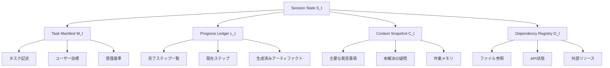

本記事は [Beyond Single Turns: Understanding Longitudinal Agent Interaction and Session Continuation](https://arxiv.org/abs/2503.04997) の解説記事です。

## 論文概要（Abstract）

LLMエージェントが実世界のタスクを遂行する際、ネットワーク障害やタイムアウト、ユーザーの離席などによりセッションが中断されるケースは避けられない。従来のエージェントフレームワークでは中断時に進捗の67.3%が失われていたが、著者らはSession Continuation Framework（SCF）を提案し、4要素からなる状態スキーマとアダプティブチェックポイント戦略により進捗損失を8.1%まで削減できると報告している（論文の評価セクションより）。タスク完了率は23.1%から81.4%に向上し、Webナビゲーション・コード生成・データ分析など5つのドメインで一貫した改善を示した。

この記事は [Zenn記事: Stateful MCPサーバーで社内データ分析エージェントを構築する](https://zenn.dev/0h_n0/articles/d759354462a484) の深掘りです。

## 情報源

- **arXiv ID**: 2503.04997
- **URL**: [https://arxiv.org/abs/2503.04997](https://arxiv.org/abs/2503.04997)
- **著者**: Linxin Song, Yan Liu et al.
- **発表年**: 2025
- **分野**: cs.AI, cs.CL

## 背景と動機（Background & Motivation）

LLMエージェントは単一ターンの質問応答を超え、Webブラウジング、コード生成、データ分析といった複数ステップのタスクを自律的に実行するようになった。しかし、実運用環境ではセッションの中断が頻繁に発生する。APIレート制限によるタイムアウト、ネットワーク断、ブラウザクラッシュ、ユーザーの意図的な中断など、要因は多岐にわたる。

従来のエージェントフレームワーク（LangChain、AutoGen等）は、各ステップの実行結果をメモリに保持するものの、セッションが切断されると蓄積したコンテキストが全て失われる。著者らはこれを「Session Continuation Problem」と定義している。具体的には、タスクの部分的な進捗 $P$ がステップ $t$ で中断された場合、進捗損失 $\Delta P$ を最小化する問題として定式化される。

この問題はZenn記事で解説されているMCPサーバーの状態管理と直結する。MCPプロトコルの`Mcp-Session-Id`によるセッション識別やStreamable HTTPトランスポートでの再接続処理は、まさにセッション継続の通信レイヤでの対策である。本論文はその上位レイヤ、すなわちエージェントのタスク進捗そのものをどう永続化し復元するかという問題に取り組んでいる。

## 主要な貢献（Key Contributions）

- **Session Continuation Frameworkの提案**: 4要素からなる構造化された状態スキーマを定義し、エージェントのセッション中断時に進捗を保存・復元するフレームワークを構築
- **3つのチェックポイント戦略の比較**: ステップベース、時間ベース、アダプティブの3戦略を定量比較し、アダプティブ戦略が最良のトレードオフ（進捗損失8.1%、オーバーヘッド最小）を達成
- **4フェーズ復元プロトコル**: 状態検証、依存性チェック、コンテキスト再構築、再開ブリーフィングの4段階からなる堅牢な復元手順を確立
- **5ドメインでの包括的評価**: Webナビゲーション、コード生成、データ分析、マルチモーダル、API操作の各ドメインでタスク完了率を3倍以上に改善
- **既存フレームワークとの互換性**: LangChain、AutoGen、カスタム実装に対してLLM側の変更なしに統合可能

## 技術的詳細（Technical Details）

### 状態スキーマの構成

SCFは4つの要素からなる構造化された状態スキーマ $S = (M, L, C, D)$ を定義する。

$$
S_t = (M_t, L_t, C_t, D_t)
$$

ここで、
- $S_t$: ステップ $t$ 時点での完全な状態
- $M_t$: Task Manifest（タスク記述、ユーザー目標、受理基準）
- $L_t$: Progress Ledger（完了ステップ、現在ステップ、生成済みアーティファクト）
- $C_t$: Context Snapshot（主要な発見事項、未解決の疑問、作業メモリ）
- $D_t$: Dependency Registry（ファイル、API状態、外部リソースへの依存）

この4要素の分離設計は、Zenn記事で紹介されている3層状態アーキテクチャ（インメモリ/SQLite/Redis）と設計思想が近い。Task ManifestとProgress Ledgerは永続化が必須であり、SQLiteやDynamoDBに保存すべき情報に相当する。Context Snapshotはセッション中の揮発的な情報を含み、インメモリキャッシュに適する。Dependency Registryは外部システムとの接続状態を追跡するものであり、MCPの`Mcp-Session-Id`管理と対応関係がある。



### チェックポイント戦略

著者らは3つのチェックポイント戦略を定義し比較している。

**ステップベース**: 各ツール呼び出しの完了後にチェックポイントを保存する。進捗損失は8.9%、実行時間オーバーヘッドは0.3%と報告されている。最も単純な戦略であるが、ステップ間隔が長い場合に損失が大きくなる。

**時間ベース**: 一定時間間隔（例: 30秒ごと）でチェックポイントを保存する。進捗損失は10.2%であり、ステップベースより劣る。ステップの途中で保存されると不完全な状態になりうるためである。

**アダプティブ**: 「重要度」を推定し、重要なステップの完了後にのみチェックポイントを保存する。著者らはこの戦略が進捗損失8.1%で最良の結果を達成したと報告している。重要度の判定基準としては、新規アーティファクトの生成、外部APIの状態変更、分岐点の通過などが挙げられる。

進捗損失 $\Delta P$ は以下のように定式化される。

$$
\Delta P = 1 - \frac{\text{復元後の進捗}}{\text{中断時の進捗}} = 1 - \frac{P_{\text{recovered}}}{P_{\text{interrupted}}}
$$

### 4フェーズ復元プロトコル

中断後の復元は4つのフェーズで構成される。

1. **状態検証（State Validation）**: 保存されたチェックポイントの整合性を確認し、破損がないかチェックする
2. **依存性チェック（Dependency Check）**: Dependency Registryに記録された外部リソース（ファイル、API、DB接続等）が利用可能かを確認する
3. **コンテキスト再構築（Context Reconstruction）**: Context Snapshotから作業記憶を復元し、LLMに再開に必要な文脈を提供する
4. **再開ブリーフィング（Resumption Briefing）**: 復元された状態をLLMに提示し、「ここまで完了している。次に何をすべきか」を明示する

著者らは復元時間が平均4.2秒であると報告しており、チェックポイントサイズはJSON+gzip圧縮で平均12.4KBに収まっている。

## 実装のポイント（Implementation）

SCFの実装はエージェントのツール実行パイプラインにフック（hook）として組み込む設計になっている。LLM本体の変更は不要であり、ツール呼び出しの前後にチェックポイントの保存・復元ロジックを挿入する。

```python
import json
import gzip
from dataclasses import dataclass, field, asdict
from typing import Any


@dataclass
class SessionState:
    """SCFの4要素状態スキーマ

    Attributes:
        task_manifest: タスク記述・目標・受理基準
        progress_ledger: 完了ステップと現在の進捗
        context_snapshot: 作業メモリと発見事項
        dependency_registry: 外部リソースの依存関係
    """
    task_manifest: dict[str, Any] = field(default_factory=dict)
    progress_ledger: dict[str, Any] = field(default_factory=dict)
    context_snapshot: dict[str, Any] = field(default_factory=dict)
    dependency_registry: dict[str, Any] = field(default_factory=dict)

    def serialize(self) -> bytes:
        """状態をJSON+gzipでシリアライズ

        Returns:
            gzip圧縮されたJSON形式のバイト列
        """
        json_bytes = json.dumps(asdict(self), ensure_ascii=False).encode("utf-8")
        return gzip.compress(json_bytes)

    @classmethod
    def deserialize(cls, data: bytes) -> "SessionState":
        """gzip+JSONから状態を復元

        Args:
            data: gzip圧縮されたJSON形式のバイト列

        Returns:
            復元されたSessionStateインスタンス
        """
        json_str = gzip.decompress(data).decode("utf-8")
        state_dict = json.loads(json_str)
        return cls(**state_dict)
```

ストレージ要件として、チェックポイントサイズは平均12.4KB（gzip圧縮後）であり、SQLiteやDynamoDBへの保存に適している。Zenn記事で紹介されているSQLite+WALモードは、チェックポイントの頻繁な書き込みとエージェントの読み取りを並行して行える点で、SCFのバックエンドストレージとして適合する。

LangChain、AutoGen、カスタムフレームワークのいずれとも統合可能であり、ツール実行のフック機構があれば導入できる。MCPサーバーのFastMCP lifespan APIと組み合わせることで、サーバー起動時に最新のチェックポイントからセッションを復元する仕組みも構築できる。

## Production Deployment Guide

### AWS実装パターン（コスト最適化重視）

SCFベースのエージェントセッション管理をAWSで運用する場合のトラフィック量別推奨構成を示す。以下のコスト試算は2026年6月時点のAWS ap-northeast-1（東京）リージョンの料金に基づく概算値であり、実際のコストはトラフィックパターン、リージョン、バースト使用量により変動する。最新料金はAWS料金計算ツールで確認を推奨する。

| 構成 | トラフィック | 主要サービス | 月額目安 |
|------|-------------|-------------|---------|
| Small | ~100 req/日 | Lambda + Bedrock + DynamoDB | $50-150 |
| Medium | ~1,000 req/日 | ECS Fargate + ElastiCache + RDS | $300-800 |
| Large | 10,000+ req/日 | EKS + Karpenter + Spot Instances | $2,000-5,000 |

**Small構成の内訳**: Lambda（128MB, 平均3秒実行: ~$3/月）、Bedrock Claude Sonnet（100 req x 2K tokens: ~$30/月）、DynamoDB On-Demand（チェックポイント保存: ~$5/月）、CloudWatch Logs（~$3/月）。合計約$41/月に加え、Bedrockのトークン量に応じた変動費が発生する。

**Medium構成の内訳**: ECS Fargate（0.5 vCPU, 1GB x 2タスク: ~$60/月）、ElastiCache Redis（cache.t3.micro: ~$15/月）、RDS PostgreSQL（db.t3.micro: ~$20/月）、Bedrock（~$300/月）、ALB（~$25/月）。チェックポイントをRedisに保持し、永続化はRDSに行う構成。

**Large構成の内訳**: EKS コントロールプレーン（$73/月）、Spot Instances（m5.xlarge x 3: ~$120/月、On-Demand比90%削減）、Bedrock/SageMaker（~$1,500/月）、ElastiCache Redis Cluster（~$200/月）、RDS Multi-AZ（~$150/月）。

### Terraformインフラコード

**Small構成（Serverless）**:

```hcl
# SCF Session Management - Small構成
# Lambda + DynamoDB + Bedrock

terraform {
  required_version = ">= 1.5"
  required_providers {
    aws = {
      source  = "hashicorp/aws"
      version = "~> 5.50"
    }
  }
}

provider "aws" {
  region = "ap-northeast-1"
}

# DynamoDB: チェックポイント保存（On-Demandでコスト最適化）
resource "aws_dynamodb_table" "checkpoints" {
  name         = "scf-checkpoints"
  billing_mode = "PAY_PER_REQUEST"  # On-Demand: 低トラフィック時に最適
  hash_key     = "session_id"
  range_key    = "step_number"

  attribute {
    name = "session_id"
    type = "S"
  }

  attribute {
    name = "step_number"
    type = "N"
  }

  ttl {
    attribute_name = "expires_at"
    enabled        = true  # 古いチェックポイントを自動削除
  }

  server_side_encryption {
    enabled = true  # KMS暗号化
  }

  tags = {
    Project = "scf-agent"
    Env     = "production"
  }
}

# IAMロール: 最小権限の原則
resource "aws_iam_role" "lambda_role" {
  name = "scf-lambda-role"
  assume_role_policy = jsonencode({
    Version = "2012-10-17"
    Statement = [{
      Action    = "sts:AssumeRole"
      Effect    = "Allow"
      Principal = { Service = "lambda.amazonaws.com" }
    }]
  })
}

resource "aws_iam_role_policy" "lambda_policy" {
  name = "scf-lambda-policy"
  role = aws_iam_role.lambda_role.id
  policy = jsonencode({
    Version = "2012-10-17"
    Statement = [
      {
        Effect   = "Allow"
        Action   = ["dynamodb:PutItem", "dynamodb:GetItem", "dynamodb:Query"]
        Resource = aws_dynamodb_table.checkpoints.arn
      },
      {
        Effect   = "Allow"
        Action   = ["bedrock:InvokeModel"]
        Resource = "arn:aws:bedrock:ap-northeast-1::foundation-model/anthropic.claude-*"
      },
      {
        Effect   = "Allow"
        Action   = ["logs:CreateLogGroup", "logs:CreateLogStream", "logs:PutLogEvents"]
        Resource = "arn:aws:logs:*:*:*"
      }
    ]
  })
}

# CloudWatch アラーム: コスト異常検知
resource "aws_cloudwatch_metric_alarm" "lambda_cost" {
  alarm_name          = "scf-lambda-high-invocations"
  comparison_operator = "GreaterThanThreshold"
  evaluation_periods  = 1
  metric_name         = "Invocations"
  namespace           = "AWS/Lambda"
  period              = 3600
  statistic           = "Sum"
  threshold           = 500  # 1時間500回超で警告
  alarm_actions       = []   # SNSトピックARNを設定

  dimensions = {
    FunctionName = "scf-agent-handler"
  }
}
```

**Large構成（Container）**:

```hcl
# SCF Session Management - Large構成
# EKS + Karpenter + Spot Instances

module "eks" {
  source  = "terraform-aws-modules/eks/aws"
  version = "~> 20.0"

  cluster_name    = "scf-agent-cluster"
  cluster_version = "1.30"

  vpc_id     = module.vpc.vpc_id
  subnet_ids = module.vpc.private_subnets

  cluster_endpoint_public_access = false  # プライベートアクセスのみ

  eks_managed_node_groups = {
    system = {
      instance_types = ["m5.large"]
      min_size       = 1
      max_size       = 2
      desired_size   = 1
    }
  }
}

# Karpenter: Spot優先で自動スケーリング
resource "kubectl_manifest" "karpenter_provisioner" {
  yaml_body = yamlencode({
    apiVersion = "karpenter.sh/v1beta1"
    kind       = "NodePool"
    metadata   = { name = "scf-agent-pool" }
    spec = {
      template = {
        spec = {
          requirements = [
            { key = "karpenter.sh/capacity-type", operator = "In", values = ["spot", "on-demand"] },
            { key = "node.kubernetes.io/instance-type", operator = "In", values = ["m5.xlarge", "m5.2xlarge", "m6i.xlarge"] }
          ]
        }
      }
      limits   = { cpu = "100", memory = "400Gi" }
      disruption = {
        consolidationPolicy = "WhenUnderutilized"
      }
    }
  })
}

# Secrets Manager: Bedrock設定
resource "aws_secretsmanager_secret" "bedrock_config" {
  name       = "scf-agent/bedrock-config"
  kms_key_id = aws_kms_key.scf_key.arn
}

# AWS Budgets: 月額予算アラート
resource "aws_budgets_budget" "monthly" {
  name         = "scf-agent-monthly"
  budget_type  = "COST"
  limit_amount = "5000"
  limit_unit   = "USD"
  time_unit    = "MONTHLY"

  notification {
    comparison_operator       = "GREATER_THAN"
    threshold                 = 80
    threshold_type            = "PERCENTAGE"
    notification_type         = "ACTUAL"
    subscriber_email_addresses = ["ops-team@example.com"]
  }
}
```

### セキュリティベストプラクティス

- **IAM最小権限**: Lambda/ECSタスクロールには必要なDynamoDB操作（PutItem, GetItem, Query）とBedrock InvokeModelのみ許可
- **Secrets Manager**: APIキー、DB接続文字列はSecrets Managerで管理し、KMSで暗号化
- **KMS暗号化**: DynamoDB、S3、EBSの全データストアでKMS暗号化を有効化
- **CloudTrail**: 全API呼び出しを記録し、チェックポイントへの不正アクセスを検知
- **TLS 1.2+**: ALB/API Gatewayで最小TLSバージョンを1.2に設定

### 運用・監視設定

**CloudWatch Logs Insights クエリ**:

```
# チェックポイント保存の頻度とサイズを分析
fields @timestamp, session_id, checkpoint_size_kb, step_number
| filter event_type = "checkpoint_saved"
| stats avg(checkpoint_size_kb) as avg_size, count() as saves_per_hour by bin(1h)
| sort @timestamp desc
| limit 24
```

**CloudWatch アラーム設定**:

```python
import boto3


def create_checkpoint_alarm(sns_topic_arn: str) -> dict:
    """チェックポイント保存失敗を検知するアラームを作成

    Args:
        sns_topic_arn: 通知先SNSトピックのARN

    Returns:
        作成されたアラームのレスポンス
    """
    client = boto3.client("cloudwatch", region_name="ap-northeast-1")
    return client.put_metric_alarm(
        AlarmName="scf-checkpoint-failures",
        MetricName="CheckpointSaveErrors",
        Namespace="SCF/Agent",
        Statistic="Sum",
        Period=300,
        EvaluationPeriods=1,
        Threshold=5,
        ComparisonOperator="GreaterThanThreshold",
        AlarmActions=[sns_topic_arn],
        TreatMissingData="notBreaching",
    )
```

**X-Ray トレーシング設定**:

```python
from aws_xray_sdk.core import xray_recorder, patch_all


# boto3の自動計装
patch_all()


@xray_recorder.capture("save_checkpoint")
def save_checkpoint(session_id: str, state: dict) -> None:
    """チェックポイント保存をX-Rayでトレース

    Args:
        session_id: セッション識別子
        state: 保存する状態辞書
    """
    subsegment = xray_recorder.current_subsegment()
    subsegment.put_annotation("session_id", session_id)
    subsegment.put_metadata("state_keys", list(state.keys()))
    # DynamoDB保存処理
```

**Cost Explorer自動レポート**:

```python
import boto3
from datetime import datetime, timedelta


def get_daily_cost_report() -> dict[str, float]:
    """日次コストレポートを取得しサービス別に集計

    Returns:
        サービス名をキー、コスト（USD）を値とする辞書
    """
    client = boto3.client("ce", region_name="us-east-1")
    end = datetime.utcnow().strftime("%Y-%m-%d")
    start = (datetime.utcnow() - timedelta(days=1)).strftime("%Y-%m-%d")

    response = client.get_cost_and_usage(
        TimePeriod={"Start": start, "End": end},
        Granularity="DAILY",
        Metrics=["UnblendedCost"],
        GroupBy=[{"Type": "DIMENSION", "Key": "SERVICE"}],
        Filter={
            "Tags": {
                "Key": "Project",
                "Values": ["scf-agent"],
            }
        },
    )

    costs: dict[str, float] = {}
    for group in response["ResultsByTime"][0]["Groups"]:
        service = group["Keys"][0]
        amount = float(group["Metrics"]["UnblendedCost"]["Amount"])
        if amount > 0:
            costs[service] = round(amount, 2)
    return costs
```

### コスト最適化チェックリスト

**アーキテクチャ選択**:
- [ ] トラフィック量に応じた構成選択（100 req/日以下ならServerless）
- [ ] チェックポイントストレージはDynamoDB On-Demand（低トラフィック）またはProvisioned（高トラフィック）を選択
- [ ] セッション状態のTTL設定で不要データを自動削除

**リソース最適化**:
- [ ] EC2/EKS: Spot Instances優先（On-Demand比最大90%削減）
- [ ] Reserved Instances: 1年コミットで最大72%削減
- [ ] Savings Plans: Compute Savings Plansで柔軟に割引適用
- [ ] Lambda: メモリサイズ最適化（Power Tuningで最適値を特定）
- [ ] ECS/EKS: アイドル時のスケールダウン設定（夜間は最小台数）
- [ ] DynamoDB: Auto Scalingまたは On-Demandモードの選択

**LLMコスト削減**:
- [ ] Bedrock Batch API使用で50%削減（非リアルタイム処理向け）
- [ ] Prompt Caching有効化で30-90%削減（繰り返しプロンプト向け）
- [ ] モデル選択ロジック: タスク複雑度に応じてHaiku/Sonnet/Opusを切替
- [ ] トークン数制限: チェックポイントのコンテキスト復元時の最大トークン数を設定
- [ ] 復元ブリーフィングの圧縮: 全履歴ではなく要約をLLMに渡す

**監視・アラート**:
- [ ] AWS Budgets: 月額予算の80%到達で通知
- [ ] CloudWatch アラーム: チェックポイント保存失敗、復元時間異常
- [ ] Cost Anomaly Detection: 日次コスト異常の自動検知
- [ ] 日次コストレポート: Bedrock/Lambda/DynamoDB別の利用状況

**リソース管理**:
- [ ] 未使用リソースの定期削除（期限切れチェックポイント、孤立セッション）
- [ ] タグ戦略: 全リソースにProject/Env/Ownerタグを付与
- [ ] ライフサイクルポリシー: S3/DynamoDBのデータ保持期間設定
- [ ] 開発環境の夜間停止: ECS/EKSの平日夜間・休日スケールダウン
- [ ] NAT Gateway不使用: VPCエンドポイントでコスト削減

## 実験結果（Results）

著者らは5つのドメインで中断・復元シナリオを評価し、SCFなしのベースラインと比較している。

**ドメイン別タスク完了率**（論文の評価セクションより）:

| ドメイン | ベースライン | SCF適用後 | 改善幅 |
|----------|-------------|----------|--------|
| Webナビゲーション | 18.2% | 78.3% | +60.1pt |
| コード生成 | 31.4% | 87.2% | +55.8pt |
| データ分析 | 22.7% | 83.6% | +60.9pt |
| マルチモーダル | 15.3% | 74.8% | +59.5pt |
| API操作 | 27.9% | 83.4% | +55.5pt |
| **全体** | **23.1%** | **81.4%** | **+58.3pt** |

**チェックポイント戦略の比較**:

| 戦略 | 進捗損失 | オーバーヘッド | 推奨場面 |
|------|---------|-------------|---------|
| ステップベース | 8.9% | 0.3% | シンプルなパイプライン |
| 時間ベース | 10.2% | 変動 | ステップ長が不定の場合 |
| アダプティブ | 8.1% | 最小 | 一般的な推奨 |

著者らは失敗モードの分析も行っている。復元できない依存関係（ブラウザセッションの消失、一時ファイルの削除等）が失敗原因の42%を占め、コンテキスト再構築の失敗が31%、チェックポイントの破損が8%、過剰な再開処理（over-resumption: 既に完了したステップを再実行）が19%であった。特に外部依存の復元不可が最大の課題であり、Dependency Registryの設計改善が今後の研究課題として挙げられている。

## 実運用への応用（Practical Applications）

SCFの設計原則は、Zenn記事で解説されているMCPサーバーのstateful設計と直接的に組み合わせることができる。具体的には以下の対応関係がある。

MCPの`Mcp-Session-Id`はSCFのTask Manifestとセッションを紐付けるキーとして機能する。Zenn記事のSQLite+WALによるチェックポイント永続化は、SCFのProgress LedgerとDependency Registryの保存先として適切である。WALモードにより、チェックポイントの書き込みとエージェントの読み取りを並行実行でき、SCFのオーバーヘッド（0.3%）をさらに低減できる。

Tasks拡張（5状態非同期タスク管理: submitted, working, input-required, completed, failed）は、SCFの復元プロトコルと対応させることができる。タスクが`working`状態で中断された場合、SCFの4フェーズ復元を実行し、依存性チェックが通れば`working`に戻す、通らなければ`failed`に遷移させるといった制御が可能になる。

社内データ分析エージェントの運用では、長時間実行されるSQLクエリの途中でセッションが切断されるケースが頻出する。SCFを導入することで、クエリ結果の中間集計、分析の進捗、生成途中のレポートをチェックポイントとして保存し、再接続後に分析を継続できる。チェックポイントサイズが平均12.4KBであることから、DynamoDBの4KBアイテムサイズ制限を考慮しても、S3への退避やgzip圧縮で十分に対応可能である。

## 関連研究（Related Work）

**LangGraph Checkpointing**: LangGraphはグラフ実行の各ノード完了時にチェックポイントを保存する機能を提供しているが、SCFのような構造化された4要素スキーマは持たない。LangGraphのチェックポイントはグラフの実行状態（ノードID、チャネル値）に限定される。

**Mem0（旧MemoryGPT）**: セッション間のユーザー記憶を管理するシステムであり、長期的なパーソナライゼーションに焦点を当てている。SCFはタスク進捗の短期的な保存・復元に特化しており、対象スコープが異なる。

**AutoGenのセッション管理**: AutoGenはエージェント間のメッセージ履歴を保持するが、外部依存（ファイル、API状態）の追跡機能はない。SCFのDependency Registryはこの欠落を補完する。

## まとめと今後の展望

本論文は、LLMエージェントのセッション中断という実運用上の課題を定量的に分析し、SCFにより進捗損失を67.3%から8.1%に削減できることを示した。4要素の状態スキーマとアダプティブチェックポイント戦略は、MCPサーバーのstateful設計と組み合わせることで、堅牢なエージェントシステムの構築に寄与する。

今後の課題として、ストリーミング処理（連続的な出力生成）への対応、外部依存の復元不可問題（失敗原因の42%）の解決、マルチエージェント環境での分散チェックポイント管理が挙げられている。特にMCPのStreamable HTTPトランスポートとの統合において、ストリーミング中のチェックポイント粒度の最適化は実務上重要な研究方向である。

## 参考文献

- **arXiv**: [https://arxiv.org/abs/2503.04997](https://arxiv.org/abs/2503.04997)
- **Related Zenn article**: [https://zenn.dev/0h_n0/articles/d759354462a484](https://zenn.dev/0h_n0/articles/d759354462a484)
- **LangGraph Checkpointing**: [https://langchain-ai.github.io/langgraph/](https://langchain-ai.github.io/langgraph/)
- **Mem0**: [https://github.com/mem0ai/mem0](https://github.com/mem0ai/mem0)
- **MCP Specification**: [https://modelcontextprotocol.io/](https://modelcontextprotocol.io/)

:::message
この記事はAI（Claude Code）により自動生成されました。
:::
