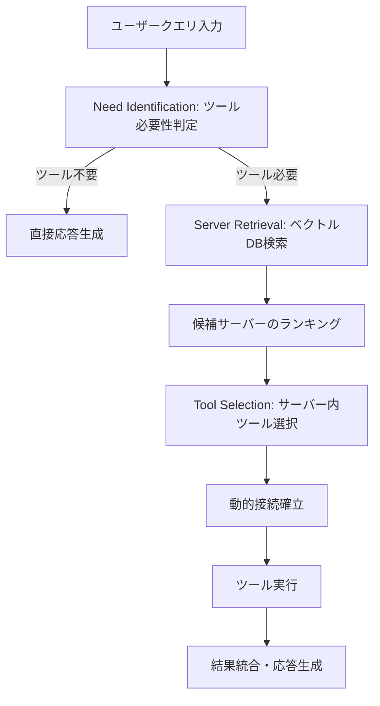

本記事は [MCP-Zero: Proactive Tool Discovery for Autonomous LLM Agents](https://arxiv.org/abs/2506.09766) の解説記事です。

## 論文概要（Abstract）

MCP-Zeroは、大規模なMCPサーバー環境においてLLMエージェントが必要なツールを動的に発見・接続するフレームワークである。従来の静的MCPツール読み込みでは、サーバー数が増加するとコンテキスト汚染・ツール選択困難・初期化オーバーヘッドが深刻化する。著者らは、MCPサーバーのベクトルDBインデクシング、2段階階層的検索、動的接続管理の3コンポーネントからなるプロアクティブなツール発見手法を提案している。著者らは、ToolBenchベンチマーク（16,464 API）において、MCP-Zeroが74.3%のパス率を達成し、静的MCPの61.2%に対して13.1ポイントの改善を報告している（論文Table 1より）。

この記事は [Zenn記事: Stateful MCPサーバーで社内データ分析エージェントを構築する](https://zenn.dev/0h_n0/articles/d759354462a484) の深掘りです。

## 情報源

- **arXiv ID**: 2506.09766
- **URL**: [https://arxiv.org/abs/2506.09766](https://arxiv.org/abs/2506.09766)
- **著者**: Yiran Zhao, Shimin Li, Wanjun Zhong, et al.
- **発表年**: 2025年6月
- **分野**: cs.CL（計算言語学）、cs.AI（人工知能）

## 背景と動機（Background & Motivation）

Model Context Protocol（MCP）は、LLMエージェントが外部ツールやデータソースにアクセスするための標準プロトコルとして普及が進んでいる。Zenn記事で解説したStateful MCPサーバーのように、セッション管理やチェックポイント永続化を備えたMCPサーバーが実用化される中、エージェントが利用可能なMCPサーバー数は急速に増加している。

しかし、従来のMCP統合は「静的ツール読み込み」に依存しており、以下の3つの問題が顕在化する。

1. **コンテキスト汚染（Context Pollution）**: すべてのツール定義をLLMのコンテキストウィンドウに注入するため、実際に必要なツールのシグナルがノイズに埋もれる
2. **ツール選択困難（Selection Difficulty）**: 200以上のサーバーから適切なツールを選ぶ組合せ爆発が発生する。著者らの評価では、静的手法のパス率は50サーバーで73.2%だが、200以上のサーバーで51.4%まで低下することが報告されている（論文Table 2より）
3. **初期化オーバーヘッド**: 全サーバーへの事前接続が不要なクエリに対してもリソースを消費する

MCP-Zeroは、これらの課題をプロアクティブなオンデマンド型ツール発見で解決することを目指している。

## 主要な貢献（Key Contributions）

- **MCPサーバーベクトル化**: ベクトルDB（Qdrant/FAISS）にMCPサーバーのメタデータをtext-embedding-3-largeで埋め込み、高速な類似性検索を実現した
- **2段階階層的検索**: サーバーレベル検索とツールレベル検索を分離し、検索精度と計算効率を両立する手法を提案した
- **動的接続管理**: オンデマンド接続・接続プーリング・アイドルクリーンアップにより、コネクション管理のオーバーヘッドを最小化した
- **スケール耐性**: 200以上のサーバー環境でも74.3%のパス率を維持し、静的手法が51.4%に劣化するのに対して安定した性能を示した

## 技術的詳細（Technical Details）

### フレームワーク全体像

MCP-Zeroのツール発見プロセスは3段階で構成される。



### MCPサーバーベクトル化

各MCPサーバーを、サーバー名・説明文・提供ツール一覧・パラメータスキーマなどのリッチメタデータとともにベクトルDBにインデクシングする。埋め込みモデルにはOpenAIのtext-embedding-3-largeを使用し、各サーバーの機能を高次元ベクトル空間で表現する。

サーバー$s_i$のメタデータ$m_i$を埋め込みモデル$\phi$でベクトル化する処理は以下のとおりである。

$$
\mathbf{v}_i = \phi(m_i), \quad \mathbf{v}_i \in \mathbb{R}^d
$$

ここで$d$は埋め込み次元数（text-embedding-3-largeの場合3,072次元）である。

### 2段階階層的検索

ツール発見は、サーバーレベルとツールレベルの2段階で行われる。

**第1段階: サーバー検索**

ユーザークエリ$q$を同じ埋め込みモデルでベクトル化し、コサイン類似度に基づいてTop-$K$のサーバーを検索する。

$$
\text{sim}(q, s_i) = \frac{\phi(q) \cdot \mathbf{v}_i}{\|\phi(q)\| \cdot \|\mathbf{v}_i\|}
$$

$$
\mathcal{S}_K = \text{Top-}K_{s_i \in \mathcal{S}} \, \text{sim}(q, s_i)
$$

ここで$\mathcal{S}$は全サーバー集合、$\mathcal{S}_K$は検索された上位$K$サーバーの集合である。

**第2段階: ツール選択**

検索されたサーバー$\mathcal{S}_K$内のツール群から、LLMがクエリに最適なツールとパラメータを選択する。この段階ではサーバー内の少数のツール定義のみがコンテキストに注入されるため、コンテキスト汚染が回避される。

### 動的接続管理

MCP-Zeroは3つの接続管理機構を備える。

1. **オンデマンド接続**: ツール選択後に初めてサーバーへの接続を確立する。Zenn記事で解説したStreamable HTTPトランスポートやMcp-Session-Idによるセッション管理との親和性が高い
2. **接続プーリング**: 頻繁にアクセスされるサーバーへの接続を再利用し、ハンドシェイクのオーバーヘッドを削減する
3. **アイドルクリーンアップ**: 一定時間使用されない接続を自動的に切断し、リソースリークを防止する

著者らのアブレーション実験では、接続プーリングを無効化すると平均レイテンシが+340ms増加することが報告されている（論文Section 4.4より）。

## 実装のポイント（Implementation）

MCP-Zeroの中核となるサーバーベクトル化と階層的検索の実装例を以下に示す。

```python
from dataclasses import dataclass, field
from typing import TypeAlias

import numpy as np

ServerName: TypeAlias = str
ToolName: TypeAlias = str


@dataclass(frozen=True)
class MCPServerMetadata:
    """MCPサーバーのメタデータ表現

    Attributes:
        name: サーバー識別名
        description: サーバーの機能説明
        tools: 提供するツール名のリスト
        categories: サーバーのカテゴリタグ
    """
    name: ServerName
    description: str
    tools: tuple[ToolName, ...] = field(default_factory=tuple)
    categories: tuple[str, ...] = field(default_factory=tuple)

    def to_indexing_text(self) -> str:
        """ベクトルDB登録用のテキスト表現を返す"""
        tools_str = ", ".join(self.tools)
        cats_str = ", ".join(self.categories)
        return f"{self.name}: {self.description}. Tools: {tools_str}. Categories: {cats_str}"


@dataclass
class HierarchicalRetriever:
    """2段階階層的検索によるMCPサーバー・ツール発見

    Attributes:
        server_embeddings: サーバー名からベクトルへのマッピング
        top_k: サーバー検索時の上位件数
    """
    server_embeddings: dict[ServerName, np.ndarray] = field(default_factory=dict)
    top_k: int = 5

    def retrieve_servers(
        self,
        query_embedding: np.ndarray,
    ) -> list[tuple[ServerName, float]]:
        """クエリベクトルとの類似度でTop-Kサーバーを検索する

        Args:
            query_embedding: クエリの埋め込みベクトル

        Returns:
            (サーバー名, コサイン類似度)のリスト（降順）
        """
        scores: list[tuple[ServerName, float]] = []
        for name, emb in self.server_embeddings.items():
            cos_sim = float(
                np.dot(query_embedding, emb)
                / (np.linalg.norm(query_embedding) * np.linalg.norm(emb) + 1e-9)
            )
            scores.append((name, cos_sim))
        scores.sort(key=lambda x: x[1], reverse=True)
        return scores[: self.top_k]
```

著者らはベクトルDBとしてQdrantまたはFAISSの使用を想定しており、上記の実装は概念的な簡略版である。本番環境では、ベクトルDBのインデクシングとANN（Approximate Nearest Neighbor）検索を活用することで、数千サーバー規模でも約150msの検索レイテンシを実現できることが報告されている。

## Production Deployment Guide

MCP-Zeroの動的ツール発見をAWS上に構築する際の実践ガイドを示す。

> **注意**: 以下のコスト試算は2026年6月時点のAWS ap-northeast-1（東京）リージョンの概算値です。実際のコストはトラフィックパターン、リージョン、バースト使用量により変動します。最新料金は[AWS料金計算ツール](https://calculator.aws.amazon.com/)で確認してください。

### AWS実装パターン（コスト最適化重視）

MCPサーバーのベクトルインデクシングと動的接続管理をAWSサービスで構成する。

| 項目 | Small (~100 req/日) | Medium (~1,000 req/日) | Large (10,000+ req/日) |
|------|---------------------|------------------------|------------------------|
| **コンピュート** | Lambda (512MB) | ECS Fargate (1vCPU/2GB) | EKS + Spot (m6i.xlarge) |
| **ベクトルDB** | DynamoDB + Lambda内FAISS | OpenSearch Serverless | OpenSearch + Qdrant (EKS Pod) |
| **LLM基盤** | Bedrock (On-Demand) | Bedrock (Provisioned) | Bedrock + SageMaker Endpoint |
| **埋め込みモデル** | Bedrock Titan Embeddings | Bedrock Titan Embeddings | SageMaker Endpoint |
| **接続管理** | Lambda内プーリング | ElastiCache (Redis) | ElastiCache + カスタムプール |
| **監視** | CloudWatch基本 | CloudWatch + X-Ray | CloudWatch + X-Ray + Grafana |
| **月額概算** | $50-150 | $300-800 | $2,000-5,000 |

**コスト内訳（Small構成の例）**:
- Lambda: ~$5-15（512MB, 100 req/日, 平均30秒）
- DynamoDB: ~$5-10（On-Demand, サーバーメタデータ格納）
- Bedrock (Titan Embeddings): ~$5-15（検索クエリ埋め込み）
- Bedrock (Claude推論): ~$30-100（ツール選択・応答生成）
- CloudWatch: ~$5-10（ログ・メトリクス）

**コスト削減テクニック**:
- Spot Instances活用: EKSワーカーノードで最大90%削減
- Reserved Instances: Fargate/EC2の1年コミットで最大72%削減
- Bedrock Batch API: 非同期処理で50%削減
- Prompt Caching: 繰り返しシステムプロンプトで30-90%削減
- 埋め込みキャッシュ: 同一クエリの再計算を回避

MCP-Zeroの検索レイヤーとLLM推論レイヤーを分離することで、各層を独立にスケーリングできる。

| コンポーネント | 推奨配置 | スケーリング戦略 |
|-------------|---------|---------------|
| ベクトルDB（検索） | OpenSearch / Qdrant | インデックスシャーディング |
| 接続プール（状態管理） | ElastiCache Redis | レプリカ追加 |
| LLM推論（ツール選択） | Bedrock | Provisioned Throughput |
| MCPサーバー群 | ECS / EKS | タスク数水平スケール |

### Terraformインフラコード

#### Small構成（Serverless: Lambda + Bedrock + DynamoDB）

```hcl
# --- Small構成: MCP-Zero 動的ツール発見 ---
# ベクトル検索 + 動的接続管理 + Serverless

terraform {
  required_version = ">= 1.9"
  required_providers {
    aws = { source = "hashicorp/aws", version = "~> 5.80" }
  }
}

provider "aws" {
  region = "ap-northeast-1"
}

# IAMロール（最小権限）
resource "aws_iam_role" "mcp_zero_lambda" {
  name = "mcp-zero-lambda-role"
  assume_role_policy = jsonencode({
    Version = "2012-10-17"
    Statement = [{
      Action = "sts:AssumeRole"
      Effect = "Allow"
      Principal = { Service = "lambda.amazonaws.com" }
    }]
  })
}

resource "aws_iam_role_policy" "mcp_zero_permissions" {
  name = "mcp-zero-permissions"
  role = aws_iam_role.mcp_zero_lambda.id
  policy = jsonencode({
    Version = "2012-10-17"
    Statement = [
      {
        Effect = "Allow"
        Action = [
          "bedrock:InvokeModel",
          "bedrock:InvokeModelWithResponseStream"
        ]
        Resource = [
          "arn:aws:bedrock:ap-northeast-1::foundation-model/amazon.titan-embed-text-v2*",
          "arn:aws:bedrock:ap-northeast-1::foundation-model/anthropic.claude-sonnet-4-6*"
        ]
      },
      {
        Effect   = "Allow"
        Action   = ["dynamodb:PutItem", "dynamodb:GetItem", "dynamodb:Query", "dynamodb:Scan"]
        Resource = aws_dynamodb_table.server_registry.arn
      },
      {
        Effect   = "Allow"
        Action   = ["logs:CreateLogGroup", "logs:CreateLogStream", "logs:PutLogEvents"]
        Resource = "arn:aws:logs:ap-northeast-1:*:*"
      }
    ]
  })
}

# DynamoDB（MCPサーバーレジストリ + ベクトル格納）
resource "aws_dynamodb_table" "server_registry" {
  name         = "mcp-zero-server-registry"
  billing_mode = "PAY_PER_REQUEST"
  hash_key     = "server_name"

  attribute {
    name = "server_name"
    type = "S"
  }

  server_side_encryption { enabled = true }
  point_in_time_recovery { enabled = true }
}

# Lambda関数（MCP-Zero検索エンジン）
resource "aws_lambda_function" "mcp_zero_retriever" {
  function_name = "mcp-zero-retriever"
  runtime       = "python3.13"
  handler       = "handler.lambda_handler"
  role          = aws_iam_role.mcp_zero_lambda.arn
  timeout       = 300
  memory_size   = 512
  filename      = "lambda.zip"

  environment {
    variables = {
      EMBEDDING_MODEL  = "amazon.titan-embed-text-v2:0"
      LLM_MODEL        = "anthropic.claude-sonnet-4-6-20260514-v1:0"
      REGISTRY_TABLE   = aws_dynamodb_table.server_registry.name
      TOP_K_SERVERS    = "5"
    }
  }

  tracing_config { mode = "Active" }
}

# CloudWatchアラーム（検索レイテンシ異常検知）
resource "aws_cloudwatch_metric_alarm" "retrieval_latency" {
  alarm_name          = "mcp-zero-retrieval-latency-high"
  comparison_operator = "GreaterThanThreshold"
  evaluation_periods  = 3
  metric_name         = "Duration"
  namespace           = "AWS/Lambda"
  period              = 300
  statistic           = "p95"
  threshold           = 5000  # 5秒超過で警告
  alarm_actions       = []    # SNSトピックARNを設定

  dimensions = {
    FunctionName = aws_lambda_function.mcp_zero_retriever.function_name
  }
}
```

#### Large構成（Container: EKS + Karpenter + Spot）

```hcl
# --- Large構成: EKS + Qdrant + 動的接続管理 ---

module "eks" {
  source  = "terraform-aws-modules/eks/aws"
  version = "~> 20.31"

  cluster_name    = "mcp-zero-cluster"
  cluster_version = "1.32"

  vpc_id     = module.vpc.vpc_id
  subnet_ids = module.vpc.private_subnets

  cluster_endpoint_public_access  = true
  cluster_endpoint_private_access = true

  eks_managed_node_groups = {
    system = {
      instance_types = ["m6i.large"]
      min_size       = 1
      max_size       = 2
      desired_size   = 1
    }
  }
}

# Karpenter Provisioner（Spot優先で最大90%コスト削減）
resource "kubectl_manifest" "karpenter_nodepool" {
  yaml_body = yamlencode({
    apiVersion = "karpenter.sh/v1"
    kind       = "NodePool"
    metadata   = { name = "mcp-zero-workers" }
    spec = {
      template = {
        spec = {
          requirements = [
            { key = "karpenter.sh/capacity-type", operator = "In", values = ["spot", "on-demand"] },
            { key = "node.kubernetes.io/instance-type", operator = "In",
              values = ["m6i.xlarge", "m6i.2xlarge", "m7i.xlarge", "m7i.2xlarge"] },
          ]
          nodeClassRef = { group = "karpenter.k8s.aws", kind = "EC2NodeClass", name = "default" }
        }
      }
      limits   = { cpu = "64", memory = "256Gi" }
      disruption = {
        consolidationPolicy = "WhenEmptyOrUnderutilized"
        consolidateAfter    = "60s"
      }
    }
  })
}

# Secrets Manager（接続プール設定）
resource "aws_secretsmanager_secret" "connection_pool_config" {
  name                    = "mcp-zero/connection-pool-config"
  recovery_window_in_days = 7
}

resource "aws_secretsmanager_secret_version" "connection_pool_config" {
  secret_id = aws_secretsmanager_secret.connection_pool_config.id
  secret_string = jsonencode({
    max_connections_per_server = 10
    idle_timeout_seconds      = 300
    health_check_interval     = 60
    embedding_model           = "amazon.titan-embed-text-v2:0"
    qdrant_collection         = "mcp-servers"
  })
}

# AWS Budgets（月額予算アラート）
resource "aws_budgets_budget" "monthly" {
  name         = "mcp-zero-monthly-budget"
  budget_type  = "COST"
  limit_amount = "5000"
  limit_unit   = "USD"
  time_unit    = "MONTHLY"

  notification {
    comparison_operator       = "GREATER_THAN"
    threshold                 = 80
    threshold_type            = "PERCENTAGE"
    notification_type         = "FORECASTED"
    subscriber_email_addresses = ["ops-team@example.com"]
  }
}
```

### 運用・監視設定

**CloudWatch Logs Insights クエリ**（検索精度モニタリング）:

```
# サーバー検索ヒット率（1時間ごと）
fields @timestamp, query, retrieved_server, tool_used, success
| filter @message like /tool_execution/
| stats count(*) as total, sum(success) as hits by bin(1h) as hour
| sort hour desc
```

**CloudWatch Logs Insights クエリ**（接続プール効率）:

```
# 接続プール再利用率
fields @timestamp, connection_action, server_name
| filter connection_action in ["reuse", "create", "cleanup"]
| stats count(*) as cnt by connection_action
```

**CloudWatch アラーム設定（Python）**:

```python
import boto3


def create_retrieval_latency_alarm(sns_topic_arn: str) -> dict:
    """ベクトル検索レイテンシの異常検知アラームを作成する

    Args:
        sns_topic_arn: 通知先のSNSトピックARN

    Returns:
        CloudWatch APIレスポンス
    """
    cw = boto3.client("cloudwatch", region_name="ap-northeast-1")
    return cw.put_metric_alarm(
        AlarmName="mcp-zero-retrieval-p95-high",
        MetricName="RetrievalLatency",
        Namespace="MCPZero/Retrieval",
        Statistic="p95",
        Period=300,
        EvaluationPeriods=3,
        Threshold=500,  # 500ms超過で警告
        ComparisonOperator="GreaterThanThreshold",
        AlarmActions=[sns_topic_arn],
    )
```

**X-Ray トレーシング設定（Python）**:

```python
from aws_xray_sdk.core import xray_recorder, patch_all

patch_all()


def trace_tool_discovery(query: str, server_name: str, tool_name: str) -> None:
    """ツール発見プロセスにX-Rayアノテーションを付与する

    Args:
        query: ユーザークエリ
        server_name: 選択されたMCPサーバー名
        tool_name: 選択されたツール名
    """
    segment = xray_recorder.current_segment()
    segment.put_annotation("discovery_type", "hierarchical_retrieval")
    segment.put_annotation("server_name", server_name)
    segment.put_annotation("tool_name", tool_name)
    segment.put_metadata("query", query, "mcp_zero")
```

**Cost Explorer 日次レポート（Python）**:

```python
from datetime import date, timedelta

import boto3


def get_daily_mcp_zero_cost(target_date: date | None = None) -> dict:
    """日次MCP-Zero関連コストを取得し、閾値超過時にSNS通知する

    Args:
        target_date: 対象日（デフォルト: 前日）

    Returns:
        サービス別コストの辞書
    """
    if target_date is None:
        target_date = date.today() - timedelta(days=1)

    ce = boto3.client("ce", region_name="us-east-1")
    resp = ce.get_cost_and_usage(
        TimePeriod={
            "Start": target_date.isoformat(),
            "End": (target_date + timedelta(days=1)).isoformat(),
        },
        Granularity="DAILY",
        Metrics=["UnblendedCost"],
        Filter={
            "Dimensions": {
                "Key": "SERVICE",
                "Values": [
                    "Amazon Bedrock",
                    "AWS Lambda",
                    "Amazon OpenSearch Service",
                    "Amazon ElastiCache",
                ],
            }
        },
        GroupBy=[{"Type": "DIMENSION", "Key": "SERVICE"}],
    )

    costs: dict[str, float] = {}
    for group in resp["ResultsByTime"][0]["Groups"]:
        service = group["Keys"][0]
        amount = float(group["Metrics"]["UnblendedCost"]["Amount"])
        costs[service] = amount

    total = sum(costs.values())
    if total > 80.0:
        sns = boto3.client("sns", region_name="ap-northeast-1")
        sns.publish(
            TopicArn="arn:aws:sns:ap-northeast-1:123456789012:cost-alert",
            Subject=f"MCP-Zero日次コスト警告: ${total:.2f}",
            Message=f"日次コスト合計が$80を超過: {costs}",
        )

    return costs
```

### コスト最適化チェックリスト

**アーキテクチャ選択**:
- [ ] トラフィック量に応じた構成を選択（~100 req/日: Serverless、~1,000: Hybrid、10,000+: Container）
- [ ] MCPサーバー数に応じたベクトルDB選択（~50: Lambda内FAISS、~500: OpenSearch、1000+: Qdrant専用）

**リソース最適化**:
- [ ] EC2/EKSワーカーノード: Spot Instances優先（最大90%削減）
- [ ] Reserved Instances: 1年コミットで安定ワークロードを削減（最大72%）
- [ ] Savings Plans: Compute Savings Plansで柔軟に削減
- [ ] Lambda: Power Tuningでメモリサイズを最適化
- [ ] ECS/EKS: Karpenterでアイドル時自動スケールダウン
- [ ] NAT Gateway: VPCエンドポイント活用で削減

**LLMコスト削減**:
- [ ] Bedrock Batch API: 非同期処理可能なタスクで50%削減
- [ ] Prompt Caching: 繰り返しシステムプロンプトで30-90%削減
- [ ] 埋め込みキャッシュ: 頻出クエリの埋め込みベクトルをElastiCacheに保存
- [ ] トークン数制限: ツール定義の注入量をTop-K制限で最小化
- [ ] Bedrock Intelligent Prompt Routing: 同一ファミリー内の自動ルーティングで最大30%削減

**監視・アラート**:
- [ ] AWS Budgets: 月額予算の80%で予測アラート設定
- [ ] CloudWatch アラーム: 検索レイテンシ・接続プール利用率の異常検知
- [ ] Cost Anomaly Detection: MLベースの異常検知を有効化
- [ ] 日次コストレポート: Cost Explorer APIで自動取得・SNS通知
- [ ] X-Rayトレーシング: 検索→接続→実行のレイテンシ分解を可視化

**リソース管理**:
- [ ] 未使用リソース削除: Trusted Advisorで定期確認
- [ ] タグ戦略: `project=mcp-zero`, `component=retriever`等で全リソースにタグ付与
- [ ] ライフサイクルポリシー: CloudWatch Logsの保持期間を30日に設定
- [ ] 開発環境夜間停止: EventBridgeスケジュールで非営業時間に停止
- [ ] ECRイメージクリーンアップ: ライフサイクルポリシーで古いイメージを自動削除

## 実験結果（Results）

著者らはToolBenchベンチマーク（16,464 API）を用いて評価を行っている。主な結果は以下のとおりである（論文Table 1より）。

| 手法 | パス率 |
|------|--------|
| Standard Function Calling | 65.8% |
| Static MCP（全ツール読み込み） | 61.2% |
| **MCP-Zero** | **74.3%** |

MCP-Zeroは静的MCPに対して13.1ポイント、標準的なFunction Callingに対して8.5ポイントの改善を達成している。

### スケーラビリティ評価

サーバー数の増加に対する性能推移は以下のとおりである（論文Table 2より）。

| サーバー数 | MCP-Zero | Static MCP | 差分 |
|-----------|----------|------------|------|
| 50 | 78.1% | 73.2% | +4.9 |
| 100 | 76.8% | 65.1% | +11.7 |
| 200+ | 74.3% | 51.4% | +22.9 |

静的手法はサーバー数の増加に伴い急激に性能が劣化するのに対し、MCP-Zeroは緩やかな劣化にとどまる。著者らは、200以上のサーバー環境でMCP-Zeroが22.9ポイントの優位性を示すことを報告している。

### アブレーション実験

著者らは各コンポーネントの寄与を以下のように報告している（論文Section 4.4より）。

- **プロアクティブ識別の除去**: パス率が-8.2%低下
- **階層的検索の除去**（フラット検索に変更）: パス率が-5.7%低下
- **接続プーリングの除去**: 平均レイテンシが+340ms増加

### Claude Sonnet 3.5統合

著者らは、Claude Sonnet 3.5をバックエンドLLMとして使用した場合、MCP固有のベンチマークで+18.7%の改善を報告している。

### エラー分析

著者らのエラー分析結果は以下のとおりである。

- **サーバーミスマッチ**: 23%（検索されたサーバーが要求に不適合）
- **ツール引数エラー**: 31%（パラメータの型・値の誤り）
- **マルチサーバー連携**: 19%（複数サーバーにまたがるタスクの協調失敗）

## 実運用への応用（Practical Applications）

MCP-Zeroの知見は、Zenn記事で解説したStateful MCPサーバーの運用に直接的な示唆を与える。社内データ分析エージェントが複数のMCPサーバー（SQL分析、BI連携、ログ検索など）を利用する場合、MCP-Zeroの動的ツール発見により以下の改善が見込まれる。

- **セッション管理との統合**: Zenn記事で解説したMcp-Session-Idベースのセッション管理とMCP-Zeroの動的接続管理を組み合わせることで、セッション状態を維持しつつ必要なサーバーのみに接続する効率的なアーキテクチャが実現できる
- **Tasks拡張との連携**: 非同期タスクの実行中に必要なツールが判明した場合、MCP-Zeroのプロアクティブ識別により適切なサーバーを自動発見し、タスクの5状態遷移（submitted → working → completed）と動的ツール発見を統合できる
- **3層状態アーキテクチャの活用**: Zenn記事のインメモリ/SQLite/Redis 3層構成は、MCP-Zeroの接続プール状態管理（Redis層）やサーバーメタデータキャッシュ（SQLite層）と自然に対応する
- **スケーリング**: 社内MCPサーバーが50を超える規模では、静的ツール読み込みのパス率低下が顕著になるため、MCP-Zeroの階層的検索への移行が有効である

## 関連研究（Related Work）

- **MCPBENCH** (Liu et al., 2025): MCPサーバーの品質を自動評価するベンチマーク。MCP-Zeroのサーバーベクトル化のメタデータ品質基準として活用できる
- **ToolBench** (Qin et al., 2023): 16,464のREST APIを対象とするツール使用ベンチマーク。MCP-Zeroの評価に使用されている
- **Gorilla** (Patil et al., 2023): LLMにAPI呼び出しを教示するファインチューニング手法。MCP-Zeroが検索ベースのアプローチであるのに対し、Gorillaはモデル内蔵型のアプローチである
- **AnyTool** (Du et al., 2024): LLMエージェントがAPIツリーを自己探索する手法。MCP-Zeroの階層的検索と類似するが、ベクトルDB検索ではなくLLMの推論に依存する点が異なる

## まとめと今後の展望

MCP-Zeroは、MCPサーバーのベクトルDBインデクシングと2段階階層的検索により、大規模なMCPサーバー環境でのツール発見を効率化するフレームワークである。著者らは、200以上のサーバー環境でも74.3%のパス率を維持し、静的手法の51.4%に対して22.9ポイントの優位性を報告している。

今後の課題として、検索レイテンシ（約150ms/ステップ）の削減、ベクトルDBインフラのセットアップコスト、固定小規模ツールセットでの静的手法との比較優位性が挙げられる。また、Stateful MCPサーバーのセッション状態と動的ツール発見の統合は、社内データ分析エージェントのような実運用環境で重要な研究方向となる。

## 参考文献

- **arXiv**: [https://arxiv.org/abs/2506.09766](https://arxiv.org/abs/2506.09766)
- **ToolBench**: [https://github.com/OpenBMB/ToolBench](https://github.com/OpenBMB/ToolBench)
- **Qdrant**: [https://qdrant.tech/](https://qdrant.tech/)
- **FAISS**: [https://github.com/facebookresearch/faiss](https://github.com/facebookresearch/faiss)
- **Related Zenn article**: [https://zenn.dev/0h_n0/articles/d759354462a484](https://zenn.dev/0h_n0/articles/d759354462a484)

---

:::message
この記事はAI（Claude Code）により自動生成されました。論文の解釈に誤りがある場合はコメントでご指摘ください。
:::
