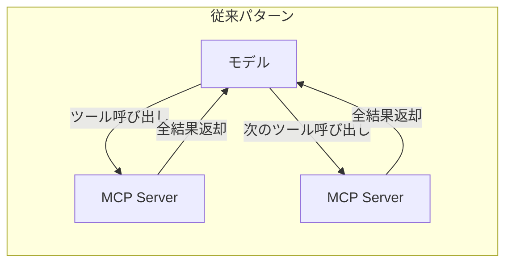
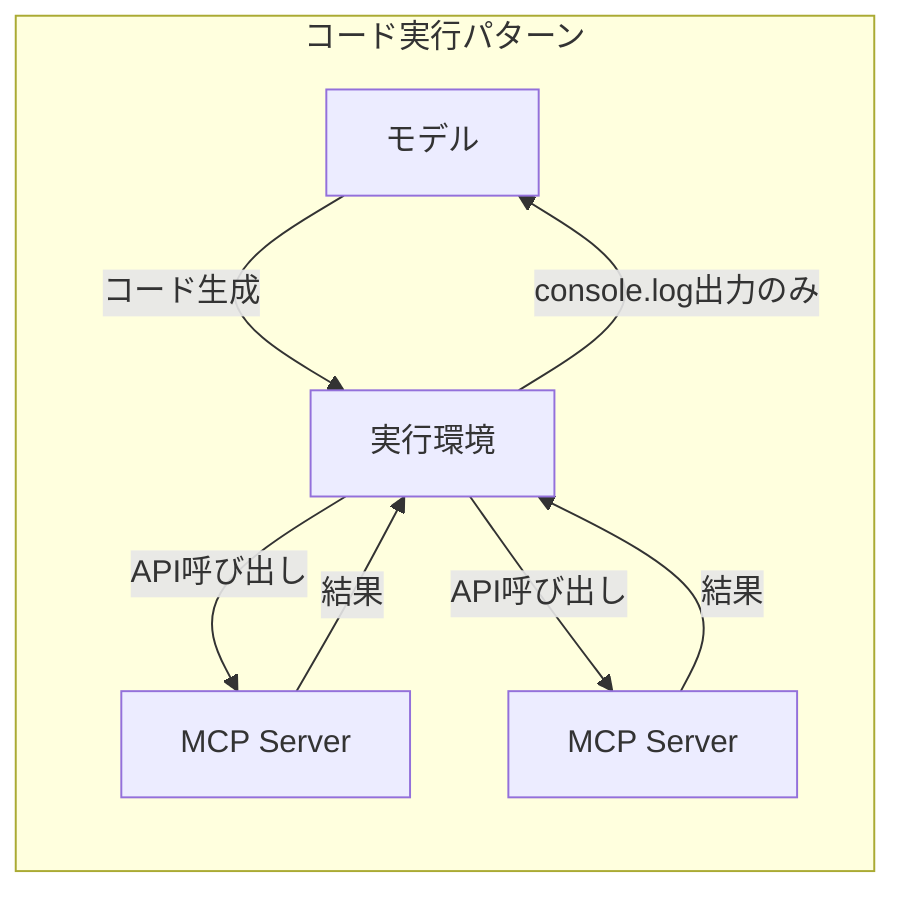

## ブログ概要

本記事は[Anthropic Engineering Blog: Code execution with MCP](https://www.anthropic.com/engineering/code-execution-with-mcp)の解説記事です。

Anthropicのエンジニアリングチームは、MCP（Model Context Protocol）を利用したAIエージェント構築において、従来のツール直接呼び出しパターンからコード実行パターンへ移行することで、トークン使用量を150,000トークンから2,000トークンへと98.7%削減できることを報告している。本記事では、ツール定義のプログレッシブディスクロージャ、コード実行環境でのデータ処理、状態永続化とスキルの蓄積、データプライバシー保護の4つの柱からなるアーキテクチャを技術的に解説する。

この記事は [Zenn記事: Stateful MCPサーバーで社内データ分析エージェントを構築する](https://zenn.dev/0h_n0/articles/d759354462a484) の深掘りです。

## 情報源

- **種別**: 企業テックブログ（Anthropic Engineering Blog）
- **URL**: [Code execution with MCP: building more efficient AI agents](https://www.anthropic.com/engineering/code-execution-with-mcp)
- **組織**: Anthropic
- **公開時期**: 2025年

## 技術的背景

### MCPスケーリングの課題

MCP（Model Context Protocol）の公開以降、数千のMCPサーバーが構築されている。エージェントが数十のMCPサーバーにまたがる数百のツールに接続する状況では、2つの深刻な問題が発生する。

**ツール定義のオーバーロード**: 全ツールの定義をコンテキストウィンドウに事前ロードすると、実際のタスクに使えるコンテキスト容量が圧迫される。例えば50個のMCPサーバーに各20ツールが定義されている場合、ツール定義だけで数万トークンを消費する。

**中間結果のコンテキスト汚染**: 従来のツール呼び出しパターンでは、各ツールの出力がそのままモデルのコンテキストに挿入される。例えば2時間の会議録音の文字起こしをGoogle Driveから取得してSalesforceに転記する場合、約50,000トークンの中間データがコンテキストを通過する。10,000行のスプレッドシートのフィルタリングでも、全行がコンテキストに入った後にモデルが条件判定を行うため、トークン消費が膨大になる。

これらの問題は、Zenn記事で扱ったStateful MCPサーバーの状態管理とも密接に関連する。セッション管理やタスクの非同期処理により状態を保持する設計は、コンテキストウィンドウへの負荷軽減という同じ課題に対するサーバー側のアプローチである。

## 実装アーキテクチャ

### 従来パターンとコード実行パターンの比較

Anthropicのエンジニアリングチームは、従来のツール直接呼び出しとコード実行パターンを以下のように対比している。





コード実行パターンでは、モデルが生成したコードが実行環境内でMCPサーバーと直接やり取りし、中間結果は実行環境に留まる。モデルのコンテキストには`console.log`等で明示的に出力された最終結果のみが返却される。

### ファイルシステムベースのツール構造

Anthropicの提案するファイル構造では、各MCPサーバーのツールをTypeScriptファイルとして整理する。

```
servers/
├── google-drive/
│   ├── getDocument.ts
│   ├── getSheet.ts
│   └── index.ts
├── salesforce/
│   ├── updateRecord.ts
│   ├── queryRecords.ts
│   └── index.ts
└── slack/
    ├── getChannelHistory.ts
    ├── sendMessage.ts
    └── index.ts
```

各ツールファイルは型付きインターフェースとドキュメントを備える。

```typescript
// ./servers/google-drive/getDocument.ts
import { callMCPTool } from "../../../client.js";

interface GetDocumentInput {
  /** Google DriveのドキュメントID */
  documentId: string;
}

interface GetDocumentResponse {
  /** ドキュメントのテキスト内容 */
  content: string;
}

/**
 * Google Driveからドキュメントを取得する
 * @param input - ドキュメントIDを含む入力パラメータ
 * @returns ドキュメントのテキスト内容
 */
export async function getDocument(
  input: GetDocumentInput
): Promise<GetDocumentResponse> {
  return callMCPTool<GetDocumentResponse>(
    "google_drive__get_document",
    input
  );
}
```

この設計により、モデルはファイルシステムをナビゲートしてツール定義をオンデマンドで読み取ることができる。Anthropicのエンジニアリングチームは「モデルはファイルシステムのナビゲートに長けている。ツールをファイルシステム上のコードとして提示することで、モデルは全定義を事前に読み込むのではなくオンデマンドで読み取ることができる」と報告している。

### プログレッシブディスクロージャ

ツール定義の段階的開示には2つのアプローチが提示されている。

1. **ファイルシステムナビゲーション**: ディレクトリ一覧 → 必要なサーバーのindex.ts読み取り → 個別ツールファイル読み取り
2. **検索ツール**: `search_tools`ツールに`detail_level`パラメータを設け、「名前のみ」「名前+説明」「スキーマを含む完全定義」の3段階で情報量を制御

$$
\text{Context Reduction} = 1 - \frac{\text{必要なツール定義のトークン数}}{\text{全ツール定義のトークン数}}
$$

50サーバー x 20ツールの環境で実際に使用するツールが5個の場合、ツール定義だけで $1 - \frac{5}{1000} = 99.5\%$ のコンテキスト削減が期待できる。

## Production Deployment Guide

### AWS実装パターン

MCPコード実行パターンをAWS上で本番運用する際の構成を規模別に示す。

| 構成 | 月額目安 | コンピュート | ストレージ | LLM | ユースケース |
|------|----------|-------------|-----------|-----|-------------|
| Small | $50-150 | Lambda (1024MB, 15min timeout) | DynamoDB (on-demand) | Bedrock Claude | 個人/PoC、1日100リクエスト未満 |
| Medium | $300-800 | ECS Fargate (2vCPU, 4GB) | ElastiCache Redis + DynamoDB | Bedrock Claude | チーム利用、1日1,000リクエスト |
| Large | $2,000-5,000 | EKS + Karpenter (Spot優先) | ElastiCache Cluster + Aurora | Bedrock Claude + 外部API | 全社基盤、1日10,000リクエスト以上 |

> **注意**: 上記は2026年6月時点の東京リージョン概算です。実際のコストはリクエスト量・LLMモデル選択・データ量により変動します。

**Small構成の内訳**:
- Lambda: $5-15/月（100万リクエスト無料枠含む）
- DynamoDB: $5-10/月（on-demand、25GB無料枠含む）
- Bedrock Claude: $30-100/月（入出力トークン量依存）
- CloudWatch: $5-10/月（ログ・メトリクス）

### Terraformインフラコード

#### Small構成: Lambda + DynamoDB

```hcl
# main.tf - Small構成（NAT Gateway不要）
terraform {
  required_version = ">= 1.5"
  required_providers {
    aws = {
      source  = "hashicorp/aws"
      version = "~> 5.50"
    }
  }
}

provider "aws" {
  region = "ap-northeast-1"
}

# VPC（NAT Gatewayなし、コスト最小化）
module "vpc" {
  source  = "terraform-aws-modules/vpc/aws"
  version = "~> 5.8"

  name = "mcp-code-exec-small"
  cidr = "10.0.0.0/16"

  azs            = ["ap-northeast-1a", "ap-northeast-1c"]
  public_subnets = ["10.0.1.0/24", "10.0.2.0/24"]

  enable_nat_gateway = false
  enable_dns_support = true
}

# IAM Role（最小権限）
resource "aws_iam_role" "lambda_exec" {
  name = "mcp-code-exec-lambda"
  assume_role_policy = jsonencode({
    Version = "2012-10-17"
    Statement = [{
      Action = "sts:AssumeRole"
      Effect = "Allow"
      Principal = { Service = "lambda.amazonaws.com" }
    }]
  })
}

resource "aws_iam_role_policy" "lambda_dynamodb" {
  name = "dynamodb-access"
  role = aws_iam_role.lambda_exec.id
  policy = jsonencode({
    Version = "2012-10-17"
    Statement = [{
      Effect = "Allow"
      Action = [
        "dynamodb:GetItem",
        "dynamodb:PutItem",
        "dynamodb:Query",
        "dynamodb:UpdateItem"
      ]
      Resource = aws_dynamodb_table.sessions.arn
    }]
  })
}

# DynamoDB（on-demand、セッション管理用）
resource "aws_dynamodb_table" "sessions" {
  name         = "mcp-code-exec-sessions"
  billing_mode = "PAY_PER_REQUEST"
  hash_key     = "session_id"

  attribute {
    name = "session_id"
    type = "S"
  }

  ttl {
    attribute_name = "expires_at"
    enabled        = true
  }
}

# CloudWatch Alarm
resource "aws_cloudwatch_metric_alarm" "lambda_errors" {
  alarm_name          = "mcp-code-exec-errors"
  comparison_operator = "GreaterThanThreshold"
  evaluation_periods  = 2
  metric_name         = "Errors"
  namespace           = "AWS/Lambda"
  period              = 300
  statistic           = "Sum"
  threshold           = 5
  alarm_description   = "Lambda error rate exceeded"
  alarm_actions       = [aws_sns_topic.alerts.arn]

  dimensions = {
    FunctionName = aws_lambda_function.mcp_executor.function_name
  }
}
```

#### Large構成: EKS + Karpenter

```hcl
# main.tf - Large構成（EKS + Karpenter + Spot優先）
module "eks" {
  source  = "terraform-aws-modules/eks/aws"
  version = "~> 20.8"

  cluster_name    = "mcp-code-exec-prod"
  cluster_version = "1.30"

  vpc_id     = module.vpc.vpc_id
  subnet_ids = module.vpc.private_subnets

  cluster_endpoint_public_access = false

  # Secrets Manager統合
  cluster_encryption_config = {
    provider_key_arn = aws_kms_key.eks.arn
    resources        = ["secrets"]
  }
}

# Karpenter（Spot Instance優先）
resource "helm_release" "karpenter" {
  name       = "karpenter"
  repository = "oci://public.ecr.aws/karpenter"
  chart      = "karpenter"
  version    = "1.1.0"
  namespace  = "kube-system"
}

# Secrets Manager（APIキー管理）
resource "aws_secretsmanager_secret" "mcp_api_keys" {
  name       = "mcp-code-exec/api-keys"
  kms_key_id = aws_kms_key.secrets.arn
}

# AWS Budgets（コスト超過アラート）
resource "aws_budgets_budget" "monthly" {
  name         = "mcp-code-exec-monthly"
  budget_type  = "COST"
  limit_amount = "5000"
  limit_unit   = "USD"
  time_unit    = "MONTHLY"

  notification {
    comparison_operator       = "GREATER_THAN"
    threshold                 = 80
    threshold_type            = "PERCENTAGE"
    notification_type         = "ACTUAL"
    subscriber_email_addresses = ["ops-team@example.com"]
  }
}
```

### セキュリティベストプラクティス

MCPコード実行パターンでは、エージェントが生成したコードを実行するため、従来のツール呼び出しよりも厳格なセキュリティが求められる。

- **IAM最小権限**: 各Lambda/コンテナに必要最小限のIAMポリシーのみ付与（上記Terraform例参照）
- **Secrets Manager**: APIキー・認証情報はSecrets Managerで管理し、環境変数への直接埋め込みを禁止
- **KMS暗号化**: DynamoDBテーブル・S3バケット・EBSボリュームをKMSカスタマーマネージドキーで暗号化
- **CloudTrail**: 全API呼び出しを記録し、異常検知の基盤とする
- **TLS 1.2+**: MCPサーバー間通信を含む全通信をTLS 1.2以上で暗号化

### 運用・監視

#### CloudWatch Logs Insightsクエリ

```
# エラー率の時系列分析
fields @timestamp, @message
| filter @message like /ERROR/
| stats count(*) as error_count by bin(5m)
| sort @timestamp desc
```

#### CloudWatchアラーム設定（Python boto3）

```python
import boto3
from typing import Any

def create_token_usage_alarm(
    function_name: str,
    threshold: float = 10000.0
) -> dict[str, Any]:
    """
    トークン使用量の異常検知アラームを作成する。

    Args:
        function_name: 監視対象のLambda関数名
        threshold: アラーム発火の閾値（トークン数）

    Returns:
        CloudWatch APIのレスポンス
    """
    cloudwatch = boto3.client("cloudwatch", region_name="ap-northeast-1")
    return cloudwatch.put_metric_alarm(
        AlarmName=f"{function_name}-token-usage-high",
        ComparisonOperator="GreaterThanThreshold",
        EvaluationPeriods=3,
        MetricName="TokenUsage",
        Namespace="MCP/CodeExecution",
        Period=300,
        Statistic="Average",
        Threshold=threshold,
        AlarmDescription="MCP code execution token usage exceeded threshold",
        ActionsEnabled=True,
        AlarmActions=[
            f"arn:aws:sns:ap-northeast-1:123456789012:{function_name}-alerts"
        ],
    )
```

#### X-Ray トレーシング

AWS X-Rayを有効化し、MCPツール呼び出しごとのレイテンシを可視化する。コード実行パターンでは、1回のコード実行内で複数のMCPツールを呼び出すため、個々のツール呼び出しのレイテンシ分布を把握することが運用上重要となる。

#### Cost Explorer日次レポート

Bedrock APIの使用量を日次で監視し、コード実行パターン導入前後のトークン消費量を比較する。98.7%削減が実際の運用でも達成されているかを継続的に検証する。

### コスト最適化チェックリスト

**アーキテクチャ選択**:
- [ ] リクエスト量に応じた構成選択（Small/Medium/Large）
- [ ] Lambda vs Fargate のコスト比較検証済み
- [ ] マルチAZ構成の必要性を検討済み

**リソース最適化**:
- [ ] Spot Instance活用（EKS Karpenter設定でSpot優先、最大90%削減）
- [ ] Reserved Instances検討（Fargate/EC2、1年で最大72%削減）
- [ ] Lambda メモリサイズの最適化（Power Tuning実施済み）
- [ ] DynamoDB Auto Scaling設定済み（Provisioned Mode移行検討含む）

**LLMコスト削減**:
- [ ] Batch API活用（非リアルタイム処理で最大50%削減）
- [ ] Prompt Caching有効化（Bedrock対応モデルで30-90%削減）
- [ ] コード実行パターン導入によるトークン削減効果の計測
- [ ] 不要なツール定義のコンテキスト除外（プログレッシブディスクロージャ）
- [ ] 中間結果のコンテキスト排除の検証

**監視・アラート**:
- [ ] AWS Budgets設定済み（月額上限の80%でアラート）
- [ ] Cost Explorer日次レポート有効化
- [ ] トークン使用量のカスタムメトリクス設定済み
- [ ] 異常検知アラーム設定済み（上記CloudWatch例参照）

**リソース管理**:
- [ ] 不要リソースの定期棚卸し（月次）
- [ ] ログ保持期間の最適化（CloudWatch Logs、30日以上はS3 Glacier）
- [ ] DynamoDB TTL設定によるセッションデータ自動削除
- [ ] ECRイメージのライフサイクルポリシー設定済み

## パフォーマンス最適化

### 98.7%トークン削減の内訳

Anthropicのエンジニアリングチームは、具体的なシナリオで以下の削減効果を報告している。

| シナリオ | 従来パターン | コード実行 | 削減率 |
|---------|-------------|-----------|-------|
| ドキュメント転記 | 150,000 tokens | 2,000 tokens | 98.7% |
| 会議録音文字起こし処理 | 50,000+ tokens | 数百 tokens | 99%以上 |
| 10,000行スプレッドシートフィルタ | 全行コンテキスト投入 | 5行のみ返却 | 大幅削減 |

トークン削減の主要因は以下の3点である。

1. **中間データの隔離**: 実行環境内でデータを処理し、最終結果のみをモデルに返却
2. **ツール定義の遅延読み込み**: プログレッシブディスクロージャにより使用ツールの定義のみをロード
3. **制御フローのコード化**: ループ・条件分岐をコードで記述し、モデルの推論ステップを削減

### レイテンシ改善

トークン削減はコスト面だけでなく、「最初のトークンまでの時間（Time to First Token）」の短縮にも寄与する。コンテキストウィンドウに投入されるトークン量が減少するため、モデルの推論開始が早まる。また、複数ツール呼び出しを1回のコード実行にまとめることで、モデルとの往復回数（ラウンドトリップ）も削減される。

## 運用での学び

### サンドボックスとセキュリティ

Anthropicのエンジニアリングチームは、コード実行パターンの導入にはトレードオフがあることを明示している。「エージェントが生成したコードの実行には、適切なサンドボックス、リソース制限、モニタリングを備えたセキュアな実行環境が必要であり、これらのインフラ要件は直接ツール呼び出しにはない運用オーバーヘッドとセキュリティ上の考慮事項を追加する」と報告している。

### データプライバシー: PII トークナイゼーション

コード実行パターンの重要な副次的効果として、データプライバシーの向上がある。実行環境内で処理される中間データはモデルのコンテキストを通過しないため、個人情報（PII）がモデルに露出するリスクが低減する。

Anthropicは、MCPクライアントがデータを傍受してトークナイズする仕組みを示している。実際のメールアドレスや電話番号はGoogle SheetsからSalesforceへ直接流れるが、モデルが受け取るのは`[EMAIL_1]`、`[PHONE_1]`のようなトークンのみである。エンジニアリングチームは「確定的なセキュリティルールにより、データの流入先と流出先を制御できる」と報告している。

### スキル蓄積による継続的改善

コード実行環境のワークスペースにファイルを書き込むことで、実行間で状態を永続化できる。さらに、頻繁に使用するコードパターンを「スキル」として保存し、`SKILL.md`ファイルを添付することで、モデルが参照・再利用可能な構造化スキルとなる。これは、Zenn記事で扱ったSQLiteによるチェックポイント永続化と同様の思想であり、エージェントの状態を跨いで知識を蓄積するアプローチである。

## 学術研究との関連

MCPのツール定義オーバーロード問題は、学術研究においても「ツール検索（Tool Retrieval）」として活発に研究されている領域である。多数のツールから関連するものを効率的に選択する問題は、情報検索の古典的課題と共通する構造を持つ。Anthropicが提案するプログレッシブディスクロージャは、この問題に対する実用的なアプローチの一つである。

また、Cloudflareが類似のアプローチを「Code Mode」として実装・検証しており、コード実行によるMCPエージェント効率化の有効性が複数の組織で独立に確認されている点は注目に値する。

## まとめと実践への示唆

Anthropicが提案するMCPコード実行パターンは、トークン使用量の98.7%削減という大幅な効率改善を実現する。ただし、サンドボックス環境の構築・運用というインフラ面のオーバーヘッドが伴うため、導入判断にはツール呼び出し頻度とデータ量に基づくコスト・ベネフィット分析が必要である。Zenn記事で紹介したStateful MCPサーバーの状態管理手法と組み合わせることで、大規模な社内データ分析基盤において、トークン効率とデータプライバシーの両方を確保したエージェントアーキテクチャを構築できる。

## 参考文献

1. Anthropic Engineering Blog, "Code execution with MCP: building more efficient AI agents", 2025. [https://www.anthropic.com/engineering/code-execution-with-mcp](https://www.anthropic.com/engineering/code-execution-with-mcp)
2. Model Context Protocol Specification. [https://modelcontextprotocol.io/](https://modelcontextprotocol.io/)
3. Cloudflare, "Code Mode" - MCP code execution validation.
4. Zenn記事「Stateful MCPサーバーで社内データ分析エージェントを構築する」 [https://zenn.dev/0h_n0/articles/d759354462a484](https://zenn.dev/0h_n0/articles/d759354462a484)

:::message
この記事はAI（Claude Code）により自動生成されました。内容の正確性は保証されません。詳細は必ず原文を参照してください。
:::
