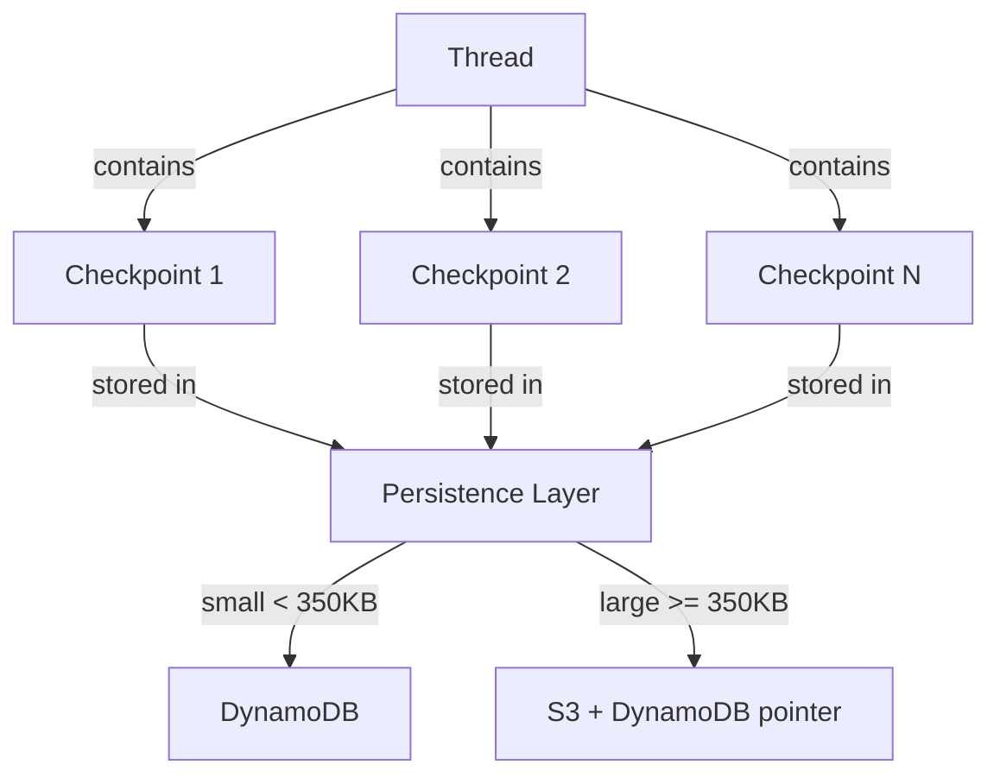

本記事は [Build durable AI agents with LangGraph and Amazon DynamoDB](https://aws.amazon.com/blogs/database/build-durable-ai-agents-with-langgraph-and-amazon-dynamodb/) の解説記事です。

## ブログ概要

AWS Database Blogで公開されたこの記事は、LangGraphで構築したAIエージェントのチェックポイント（状態スナップショット）をAmazon DynamoDBに永続化する手法を解説している。LangGraphのグラフベースワークフローにおいて、各ステップの状態を`DynamoDBSaver`で保存することで、障害からの復旧、human-in-the-loop、長期会話セッションの継続を実現する。350KB未満のチェックポイントはDynamoDBに直接保存し、350KB以上の大規模チェックポイントはS3にオフロードする二層構成により、コスト効率と信頼性を両立させている。

この記事は [Zenn記事: Stateful MCPサーバーで社内データ分析エージェントを構築する](https://zenn.dev/0h_n0/articles/d759354462a484) の深掘りです。

## 情報源

- **URL**: [https://aws.amazon.com/blogs/database/build-durable-ai-agents-with-langgraph-and-amazon-dynamodb/](https://aws.amazon.com/blogs/database/build-durable-ai-agents-with-langgraph-and-amazon-dynamodb/)
- **組織**: AWS Database Blog
- **発表時期**: 2025-2026年
- **関連技術**: LangGraph 1.0（2025年11月リリース）、Amazon DynamoDB、Amazon S3

## 技術的背景

AIエージェントが実用性を持つには、単一リクエストの処理を超えた「状態の持続性」が不可欠である。人間のオペレータが承認を挟むhuman-in-the-loop、ネットワーク障害からの自動復旧、数時間にわたる会話セッションの継続 --- これらはすべて、エージェントの中間状態を永続化するチェックポイント機構に依存する。

Zenn記事では、MCPサーバーにおける状態管理として`Mcp-Session-Id`によるセッション管理、SQLite+WALによるチェックポイント永続化、3層ステートアーキテクチャ（インメモリ / SQLite / Redis）を解説している。本記事で紹介するAWSブログは、LangGraphフレームワークにおいて同様の課題をDynamoDBで解決するアプローチであり、「グラフの各ステップで状態をスナップショットとして保存する」という設計思想はMCPの`Mcp-Session-Id`ベースのセッション管理と共通している。

LangGraph 1.0は2025年11月にリリースされ、耐障害実行（durable execution）、human-in-the-loop、包括的メモリ管理、LangSmithによるデバッグ機能を備えたフレームワークとして位置づけられている。開発時は`InMemorySaver`で手軽にプロトタイピングし、本番環境では`DynamoDBSaver`に切り替えるだけでワークフローロジックを変更せずに永続化を実現できる点が特徴である。

## 実装アーキテクチャ

### LangGraphの3つのコアコンセプト

AWSブログでは、LangGraphのチェックポイント機構を理解するための3つの概念が紹介されている。



1. **Thread（スレッド）**: チェックポイントのシーケンスを識別する一意のIDである。各会話やワークフロー実行が1つのスレッドに対応し、Zenn記事の`Mcp-Session-Id`と概念的に等価である。
2. **Checkpoint（チェックポイント）**: グラフの各super-step（ノードの実行単位）で取得される状態スナップショットである。ノードの入出力、グラフの現在位置、メタデータが含まれる。
3. **Persistence Layer（永続化層）**: チェックポイントの保存先を抽象化するレイヤーである。`InMemorySaver`、`SqliteSaver`、`DynamoDBSaver`などが提供されており、同一インターフェースで切り替え可能である。

### DynamoDBSaverの二層保存戦略

`DynamoDBSaver`は、チェックポイントのサイズに応じて保存先を自動的に切り替える。

- **小規模チェックポイント（350KB未満）**: DynamoDBのItemとして直接保存。パーティションキー（PK: String型）とソートキー（SK: String型）でThread IDとCheckpoint IDを管理する。
- **大規模チェックポイント（350KB以上）**: 状態本体をS3にアップロードし、DynamoDBにはS3オブジェクトへの参照ポインタのみを保存する。取得時はDynamoDBからメタデータを取得し、大規模ペイロードはS3から透過的にロードされる。

DynamoDBのItem上限は400KBであるため、350KBを閾値としたオフロードは実用的な設計判断である。

```python
from langgraph.checkpoint.dynamodb import DynamoDBSaver

def create_dynamodb_saver(
    table_name: str,
    region_name: str = "ap-northeast-1",
    ttl_days: int = 30,
) -> DynamoDBSaver:
    """DynamoDBSaverを構成する。

    Args:
        table_name: DynamoDBテーブル名
        region_name: AWSリージョン
        ttl_days: チェックポイントの有効期間（日）

    Returns:
        構成済みのDynamoDBSaverインスタンス
    """
    s3_offload_config = {
        "bucket_name": f"{table_name}-checkpoints",
        "key_prefix": "langgraph/checkpoints/",
    }
    return DynamoDBSaver(
        table_name=table_name,
        region_name=region_name,
        ttl_seconds=86400 * ttl_days,
        enable_checkpoint_compression=True,
        s3_offload_config=s3_offload_config,
    )
```

### InMemorySaverからの移行

AWSブログでは、開発環境から本番環境への移行がワークフローロジックの変更なしに行えることが強調されている。

```python
from langgraph.graph import StateGraph
from langgraph.checkpoint.memory import InMemorySaver

def build_agent_graph(checkpointer: InMemorySaver | DynamoDBSaver) -> StateGraph:
    """エージェントグラフを構築する。

    チェックポインタの種類に関係なく同一のグラフ定義を使用できる。

    Args:
        checkpointer: チェックポイント永続化の実装

    Returns:
        コンパイル済みのStateGraph
    """
    graph = StateGraph(state_schema=AgentState)
    # ノード定義、エッジ定義は省略
    return graph.compile(checkpointer=checkpointer)


# 開発環境
dev_graph = build_agent_graph(checkpointer=InMemorySaver())

# 本番環境
prod_saver = create_dynamodb_saver(table_name="agent-checkpoints")
prod_graph = build_agent_graph(checkpointer=prod_saver)
```

この設計は、Zenn記事で紹介されている3層ステートアーキテクチャ（インメモリ / SQLite / Redis）と同様に、永続化層の抽象化によってアプリケーションロジックとストレージの結合を排除している。

## 本番環境デプロイガイド

### AWS実装パターン

LangGraphエージェントをAWSで運用する場合、規模に応じて以下の構成が考えられる。料金は2026年6月時点の東京リージョン概算であり、実際の費用はワークロードによって大きく変動する。

| 構成 | 月額目安 | コンポーネント | 想定ワークロード |
|------|---------|---------------|----------------|
| Small | $50-150 | Lambda + Bedrock + DynamoDB (On-Demand) | 日次バッチ、1日100リクエスト未満 |
| Medium | $300-800 | ECS Fargate + ElastiCache + DynamoDB (Provisioned) | リアルタイム応答、1日1,000リクエスト |
| Large | $2,000-5,000 | EKS + Karpenter (Spot優先) + ElastiCache Cluster | 高頻度、マルチテナント |

**Small構成の内訳例**: Lambda実行($5-15) + Bedrock Claude Sonnet呼び出し($20-80) + DynamoDB On-Demand($5-20) + S3($1-5) + CloudWatch($5-10)

**Medium構成の内訳例**: ECS Fargate 2タスク($60-120) + Bedrock ($100-400) + DynamoDB Provisioned($30-60) + ElastiCache t3.small($50-80) + ALB($20-30) + CloudWatch($15-30)

**Large構成の内訳例**: EKS コントロールプレーン($74) + EC2 Spot (m5.xlarge x3, $200-500) + Bedrock ($800-2,500) + DynamoDB ($100-300) + ElastiCache r6g.large Cluster($400-600) + ALB + WAF($80-150)

### Terraformインフラコード

#### Small構成（Lambda + DynamoDB）

```hcl
# Small構成: Lambda + DynamoDB (On-Demand)
# terraform-aws-modules を使用

terraform {
  required_version = ">= 1.5"
  required_providers {
    aws = {
      source  = "hashicorp/aws"
      version = "~> 5.50"
    }
  }
}

provider "aws" {
  region = "ap-northeast-1"
}

# --- VPC (NAT Gateway なし、コスト削減) ---
module "vpc" {
  source  = "terraform-aws-modules/vpc/aws"
  version = "~> 5.8"

  name = "langgraph-agent-vpc"
  cidr = "10.0.0.0/16"

  azs            = ["ap-northeast-1a", "ap-northeast-1c"]
  public_subnets = ["10.0.1.0/24", "10.0.2.0/24"]

  enable_nat_gateway = false
  enable_vpn_gateway = false

  tags = {
    Environment = "production"
    Project     = "langgraph-agent"
  }
}

# --- DynamoDB (On-Demand) ---
resource "aws_dynamodb_table" "checkpoints" {
  name         = "langgraph-checkpoints"
  billing_mode = "PAY_PER_REQUEST"
  hash_key     = "PK"
  range_key    = "SK"

  attribute {
    name = "PK"
    type = "S"
  }

  attribute {
    name = "SK"
    type = "S"
  }

  ttl {
    attribute_name = "ttl"
    enabled        = true
  }

  point_in_time_recovery {
    enabled = true
  }

  server_side_encryption {
    enabled     = true
    kms_key_arn = aws_kms_key.dynamodb.arn
  }

  tags = {
    Environment = "production"
  }
}

# --- KMS 暗号化キー ---
resource "aws_kms_key" "dynamodb" {
  description             = "KMS key for DynamoDB checkpoint encryption"
  deletion_window_in_days = 7
  enable_key_rotation     = true
}

# --- IAM Role (最小権限) ---
resource "aws_iam_role" "lambda_agent" {
  name = "langgraph-agent-lambda-role"

  assume_role_policy = jsonencode({
    Version = "2012-10-17"
    Statement = [{
      Action = "sts:AssumeRole"
      Effect = "Allow"
      Principal = { Service = "lambda.amazonaws.com" }
    }]
  })
}

resource "aws_iam_role_policy" "lambda_dynamodb" {
  name = "dynamodb-checkpoint-access"
  role = aws_iam_role.lambda_agent.id

  policy = jsonencode({
    Version = "2012-10-17"
    Statement = [
      {
        Effect = "Allow"
        Action = [
          "dynamodb:GetItem",
          "dynamodb:PutItem",
          "dynamodb:Query",
          "dynamodb:BatchGetItem",
          "dynamodb:BatchWriteItem"
        ]
        Resource = aws_dynamodb_table.checkpoints.arn
      },
      {
        Effect = "Allow"
        Action = [
          "s3:PutObject",
          "s3:GetObject",
          "s3:DeleteObject"
        ]
        Resource = "${aws_s3_bucket.checkpoints.arn}/*"
      },
      {
        Effect   = "Allow"
        Action   = ["bedrock:InvokeModel"]
        Resource = "arn:aws:bedrock:ap-northeast-1::foundation-model/anthropic.claude-*"
      }
    ]
  })
}

# --- S3 (チェックポイントオフロード) ---
resource "aws_s3_bucket" "checkpoints" {
  bucket = "langgraph-checkpoints-${data.aws_caller_identity.current.account_id}"
}

resource "aws_s3_bucket_server_side_encryption_configuration" "checkpoints" {
  bucket = aws_s3_bucket.checkpoints.id

  rule {
    apply_server_side_encryption_by_default {
      sse_algorithm     = "aws:kms"
      kms_master_key_id = aws_kms_key.dynamodb.arn
    }
  }
}

data "aws_caller_identity" "current" {}

# --- CloudWatch Alarm ---
resource "aws_cloudwatch_metric_alarm" "lambda_errors" {
  alarm_name          = "langgraph-agent-lambda-errors"
  comparison_operator = "GreaterThanThreshold"
  evaluation_periods  = 2
  metric_name         = "Errors"
  namespace           = "AWS/Lambda"
  period              = 300
  statistic           = "Sum"
  threshold           = 5
  alarm_description   = "Lambda agent error rate exceeded threshold"

  dimensions = {
    FunctionName = "langgraph-agent"
  }
}
```

#### Large構成（EKS + Karpenter）

```hcl
# Large構成: EKS + Karpenter (Spot優先)
module "eks" {
  source  = "terraform-aws-modules/eks/aws"
  version = "~> 20.8"

  cluster_name    = "langgraph-agent-cluster"
  cluster_version = "1.30"

  vpc_id     = module.vpc.vpc_id
  subnet_ids = module.vpc.private_subnets

  cluster_endpoint_public_access = false

  # Secrets Manager 統合
  cluster_encryption_config = {
    provider_key_arn = aws_kms_key.eks.arn
    resources        = ["secrets"]
  }

  eks_managed_node_groups = {
    system = {
      instance_types = ["m5.large"]
      min_size       = 2
      max_size       = 3
      desired_size   = 2
    }
  }
}

# --- Karpenter (Spot 優先) ---
resource "kubectl_manifest" "karpenter_nodepool" {
  yaml_body = yamlencode({
    apiVersion = "karpenter.sh/v1"
    kind       = "NodePool"
    metadata   = { name = "langgraph-agents" }
    spec = {
      template = {
        spec = {
          requirements = [
            { key = "karpenter.sh/capacity-type", operator = "In", values = ["spot", "on-demand"] },
            { key = "node.kubernetes.io/instance-type", operator = "In", values = ["m5.xlarge", "m5.2xlarge", "m6i.xlarge"] },
          ]
        }
      }
      disruption = {
        consolidationPolicy = "WhenEmpty"
        consolidateAfter    = "30s"
      }
    }
  })
}

# --- AWS Budgets ---
resource "aws_budgets_budget" "monthly" {
  name         = "langgraph-agent-monthly"
  budget_type  = "COST"
  limit_amount = "5000"
  limit_unit   = "USD"
  time_unit    = "MONTHLY"

  notification {
    comparison_operator       = "GREATER_THAN"
    threshold                 = 80
    threshold_type            = "PERCENTAGE"
    notification_type         = "ACTUAL"
    subscriber_email_addresses = ["alerts@example.com"]
  }
}
```

### セキュリティベストプラクティス

本番環境でLangGraphエージェントを運用する際のセキュリティ要件を整理する。

- **IAM最小権限**: DynamoDBには`GetItem`, `PutItem`, `Query`, `BatchGetItem`, `BatchWriteItem`のみ許可。S3には`PutObject`, `GetObject`, `DeleteObject`のみ許可（上記Terraformコード参照）
- **Secrets Manager**: APIキーやデータベース認証情報はSecrets Managerで管理し、Lambda環境変数やK8s Secretに直接記載しない
- **KMS暗号化**: DynamoDBテーブル、S3バケットともにKMSカスタマーマネージドキーで暗号化。キーローテーションを有効化する
- **CloudTrail**: DynamoDBとS3へのアクセスをCloudTrailで監査証跡として記録
- **通信暗号化**: TLS 1.2以上を強制。VPCエンドポイントを使用してDynamoDB/S3へのアクセスをVPC内に閉じる

### 運用・監視

#### CloudWatch Logs Insightsクエリ

チェックポイント操作のレイテンシ分析やエラー調査に使用する。

```
# チェックポイント書き込みの P99 レイテンシ
fields @timestamp, @message
| filter @message like /checkpoint_write/
| stats pct(duration_ms, 99) as p99_latency by bin(1h)
| sort @timestamp desc

# S3 オフロード発生頻度
fields @timestamp, checkpoint_size_kb
| filter @message like /s3_offload/
| stats count() as offload_count, avg(checkpoint_size_kb) as avg_size by bin(1d)
```

#### CloudWatch Alarmの設定

```python
import boto3


def create_checkpoint_alarms(
    table_name: str,
    sns_topic_arn: str,
    region: str = "ap-northeast-1",
) -> list[str]:
    """チェックポイント関連のCloudWatchアラームを作成する。

    Args:
        table_name: 監視対象のDynamoDBテーブル名
        sns_topic_arn: 通知先のSNSトピックARN
        region: AWSリージョン

    Returns:
        作成されたアラーム名のリスト
    """
    client = boto3.client("cloudwatch", region_name=region)
    alarms: list[str] = []

    # DynamoDB スロットリングアラーム
    alarm_name = f"{table_name}-write-throttle"
    client.put_metric_alarm(
        AlarmName=alarm_name,
        MetricName="WriteThrottleEvents",
        Namespace="AWS/DynamoDB",
        Statistic="Sum",
        Period=300,
        EvaluationPeriods=2,
        Threshold=10,
        ComparisonOperator="GreaterThanThreshold",
        Dimensions=[{"Name": "TableName", "Value": table_name}],
        AlarmActions=[sns_topic_arn],
    )
    alarms.append(alarm_name)

    # DynamoDB レイテンシアラーム
    latency_alarm = f"{table_name}-latency-p99"
    client.put_metric_alarm(
        AlarmName=latency_alarm,
        MetricName="SuccessfulRequestLatency",
        Namespace="AWS/DynamoDB",
        ExtendedStatistic="p99",
        Period=300,
        EvaluationPeriods=3,
        Threshold=100,
        ComparisonOperator="GreaterThanThreshold",
        Dimensions=[
            {"Name": "TableName", "Value": table_name},
            {"Name": "Operation", "Value": "PutItem"},
        ],
        AlarmActions=[sns_topic_arn],
    )
    alarms.append(latency_alarm)

    return alarms
```

#### X-Ray トレーシング

LangGraphの各ノード実行にX-Rayセグメントを付与することで、チェックポイント書き込みのボトルネックを可視化できる。

```python
from aws_xray_sdk.core import xray_recorder


@xray_recorder.capture("checkpoint_write")
def save_checkpoint_with_tracing(
    saver: DynamoDBSaver,
    config: dict,
    state: dict,
) -> None:
    """X-Rayトレーシング付きでチェックポイントを保存する。

    Args:
        saver: DynamoDBSaverインスタンス
        config: LangGraphの実行コンフィグ
        state: 保存する状態
    """
    subsegment = xray_recorder.current_subsegment()
    if subsegment:
        subsegment.put_annotation("thread_id", config.get("configurable", {}).get("thread_id", ""))
    saver.put(config, state)
```

### コスト最適化チェックリスト

#### アーキテクチャ選択

- [ ] ワークロードの特性（バッチ / リアルタイム / 混在）に応じた構成を選択する
- [ ] Small構成（Lambda）で開始し、必要に応じてスケールアップする
- [ ] マルチリージョン構成が本当に必要か検討する（不要なら単一リージョン）

#### リソース最適化

- [ ] EKS/ECSの場合、Spotインスタンスを積極的に活用する（On-Demand比で最大90%削減）
- [ ] DynamoDBはワークロードが予測可能ならProvisioned Capacity + Reserved Capacity（最大72%削減）を検討する
- [ ] ElastiCacheはReserved Nodes（1年 / 3年）を検討する
- [ ] Lambda のメモリ設定を AWS Lambda Power Tuning で最適化する
- [ ] 不要なNAT Gatewayを削除し、VPCエンドポイントで代替する

#### LLMコスト削減

- [ ] Amazon Bedrock Batch API を活用する（リアルタイム不要なタスクで最大50%削減）
- [ ] Prompt Cachingを有効化する（繰り返しプロンプトで30-90%削減）
- [ ] 軽量タスクにはClaude Haikuなど小型モデルを使用する
- [ ] 入力プロンプトの最適化でトークン数を削減する
- [ ] RouteLLM等のルーティング機構で動的にモデルを切り替える

#### 監視・アラート

- [ ] AWS Budgetsで月額予算アラートを設定する（80%、100%、120%の3段階）
- [ ] Cost Explorerの日次レポートを有効化する
- [ ] DynamoDBの消費キャパシティをCloudWatchで監視する
- [ ] S3のストレージ使用量にライフサイクルポリシーを設定する
- [ ] LLM APIコールの単価をカスタムメトリクスとして記録する

#### リソース管理

- [ ] チェックポイントのTTLを適切に設定する（`ttl_seconds`パラメータ）
- [ ] `enable_checkpoint_compression=True`で圧縮を有効化し、書き込みコストを削減する
- [ ] S3オフロードバケットにライフサイクルルールを設定する（Glacier移行 / 削除）
- [ ] 未使用のDynamoDBテーブルやS3バケットを定期的にクリーンアップする
- [ ] CloudWatch Logsの保持期間を適切に設定する（90日推奨）

## パフォーマンス最適化

AWSブログで紹介されている`DynamoDBSaver`の主要な最適化オプションを整理する。

**チェックポイント圧縮**: `enable_checkpoint_compression=True`を設定すると、チェックポイントデータが圧縮されてDynamoDBに保存される。これによりWriteCapacityUnit（WCU）の消費が削減され、DynamoDBの書き込みコストが低下する。エージェントの状態にテキストデータが多い場合、圧縮率は高くなる傾向がある。

**TTL管理**: `ttl_seconds`パラメータにより、古いチェックポイントをDynamoDBのTTL機能で自動削除できる。例えば30日（`86400 * 30 = 2,592,000`秒）を設定すると、30日を超えたチェックポイントが自動的に削除される。TTL削除はバックグラウンドで非同期に行われるため、読み取り/書き込み性能に影響を与えない。

**S3オフロード閾値**: 350KB以上のチェックポイントは自動的にS3にオフロードされるが、これはDynamoDBの400KB Item上限に対する安全マージンである。大規模なエージェント状態（例えば長大な会話履歴やツール実行結果を含む場合）では、S3オフロードの頻度が高まるため、S3のレイテンシ（通常10-50ms）がチェックポイント書き込みの律速になる可能性がある。

## 運用での学び

### 移行パス

AWSブログが強調しているのは、`InMemorySaver`から`DynamoDBSaver`への移行が**ワークフローロジックの変更なし**に行える点である。これはLangGraphがCheckpointerインターフェースを抽象化しているためであり、テスト環境では`InMemorySaver`、ステージング環境では`SqliteSaver`、本番環境では`DynamoDBSaver`と段階的に移行する戦略が取れる。

### コスト管理

DynamoDBのOn-Demandモードは予測不能なワークロードに適しているが、安定したトラフィックパターンが確立されたらProvisioned Capacityへの切り替えとReserved Capacityの購入（最大72%割引）を検討すべきである。また、TTLによる自動削除とS3のライフサイクルポリシーを組み合わせることで、蓄積されるチェックポイントデータのストレージコストを抑制できる。

### Amazon Bedrock AgentCore Runtimeとの統合

AWSブログでは、LangGraphがAmazon Bedrock AgentCore Runtimeと統合可能であることにも言及されている。AgentCore Runtimeはエージェントのデプロイ、スケーリング、モニタリングを統合的に管理するマネージドサービスであり、`DynamoDBSaver`と組み合わせることでフルマネージドな耐障害性エージェント基盤を構築できる。

## 学術研究との関連

チェックポイント永続化によるエージェントの耐障害性確保は、分散システム研究における「状態の一貫性保証」の応用と捉えることができる。LangGraphのThread/Checkpoint構造は、データベースにおけるWAL（Write-Ahead Logging）やイベントソーシングパターンと類似しており、Zenn記事で解説されているSQLite+WALによるチェックポイント永続化と設計思想を共有している。

また、エージェントのメモリ管理という観点では、Mem0プロジェクト（2024年、Memory Layer for AI Agents）が長期記憶・短期記憶・エピソード記憶の階層化を提案しており、LangGraphのチェックポイントは主に短期記憶とエピソード記憶に対応する。Zenn記事の3層ステートアーキテクチャ（インメモリ / SQLite / Redis）も同様の階層構造を採用しており、エージェントの状態管理における共通の設計パターンが見て取れる。

## まとめと実践への示唆

AWSブログで紹介された`DynamoDBSaver`は、LangGraphエージェントの本番運用における信頼性を大幅に向上させる実践的なソリューションである。350KBを閾値としたDynamoDB/S3の二層保存、TTLによる自動クリーンアップ、圧縮によるコスト削減は、プロダクション環境で必要となる工夫が網羅されている。Zenn記事のMCPセッション管理やSQLite+WAL永続化と組み合わせて理解することで、AIエージェントにおける状態管理の全体像を把握できるだろう。

## 参考文献

1. [Build durable AI agents with LangGraph and Amazon DynamoDB](https://aws.amazon.com/blogs/database/build-durable-ai-agents-with-langgraph-and-amazon-dynamodb/) - AWS Database Blog
2. [LangGraph Documentation](https://langchain-ai.github.io/langgraph/) - LangChain
3. [Zenn記事: Stateful MCPサーバーで社内データ分析エージェントを構築する](https://zenn.dev/0h_n0/articles/d759354462a484)
4. [Amazon DynamoDB Developer Guide](https://docs.aws.amazon.com/amazondynamodb/latest/developerguide/) - AWS
5. [Mem0: Memory Layer for AI Agents](https://github.com/mem0ai/mem0) - Mem0 Project

:::message
この記事はAI（Claude Code）により自動生成されました。内容の正確性には配慮していますが、最新情報は情報源の原文をご確認ください。
:::
