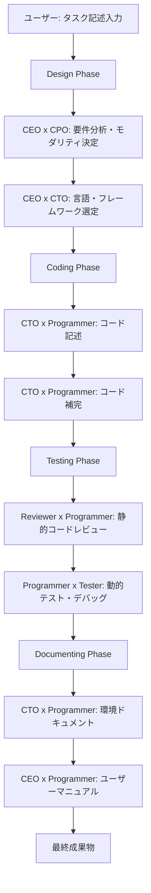
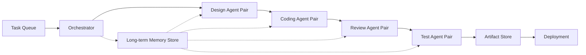

本記事は [Communicative Agents for Software Development](https://arxiv.org/abs/2307.07924) の解説記事です。

## 論文概要（Abstract）

ChatDevは、LLM駆動の複数エージェントが自然言語コミュニケーションを通じてソフトウェア開発の全工程を自動実行するフレームワークである。各エージェントには専門的ロール（CEO、CTO、Programmer等）が割り当てられ、ChatChainと呼ばれる逐次フェーズ構成に従い、設計・コーディング・テスト・ドキュメンテーションの各段階を協調的に遂行する。著者らは、自然言語がシステム設計に、プログラミング言語がデバッグにそれぞれ有効であることを実証し、言語的コミュニケーションがマルチエージェント協調の統一的な橋渡しとなることを示している。

この記事は [Zenn記事: Claude Code Hooks x Routines x Workflowで開発自動化パイプラインを構築する](https://zenn.dev/0h_n0/articles/3a4fdda1d5c743) の深掘りです。

## 情報源

- **arXiv ID**: 2307.07924
- **URL**: [https://arxiv.org/abs/2307.07924](https://arxiv.org/abs/2307.07924)
- **著者**: Chen Qian, Wei Liu, Hongzhang Liu, Nuo Chen, Yufan Dang, Jiahao Li, Cheng Yang, Weize Chen, Yusheng Su, Xin Cong, Juyuan Xu, Dahai Li, Zhiyuan Liu, Maosong Sun
- **所属**: Tsinghua University (清華大学)
- **発表年**: 2023年7月（ACL 2024採択）
- **分野**: cs.SE, cs.CL, cs.MA

## 背景と動機（Background & Motivation）

ソフトウェア開発は、設計・コーディング・テスト・ドキュメンテーションなど多様なスキルを持つメンバーの協力を必要とする複雑なタスクである。従来のアプローチでは、各フェーズに個別のディープラーニングモデルを適用しており、フェーズ間の技術的一貫性が損なわれていた。

Zenn記事で解説したClaude Code Hooks x Routines x Workflowのような開発自動化パイプラインは、単一のLLMエージェントがフック・ルーティン・ワークフローを組み合わせてタスクを逐次実行する設計である。これに対しChatDevは、複数のLLMエージェントがそれぞれ異なるロールを担い、ターン制の対話を通じてタスクを解決するマルチエージェント協調アプローチを採用している。

ChatDevの動機は以下の3点に集約される。

1. **統一的インターフェース**: 自然言語を全フェーズの共通コミュニケーション媒体とすることで、フェーズ間の技術的断絶を解消する
2. **ロール特化**: 人間のソフトウェア開発チームのように、各エージェントに専門的ロールを割り当て、分業と協調を実現する
3. **コミュニケーション駆動**: エージェント間の対話自体をタスク遂行の手段とし、明示的なオーケストレーション層を不要にする

## 主要な貢献（Key Contributions）

- **ChatChainアーキテクチャ**: ウォーターフォールモデルを模倣した逐次フェーズ構成により、ソフトウェア開発のEnd-to-Endプロセスをマルチエージェント対話で自動化した
- **Inception Prompting**: ロール定義・タスク記述・通信規約を統合したプロンプト設計により、エージェント間の一貫した協調を実現した
- **Communicative Dehallucination**: コードレビューとThought Instructions（思考プロセスの明示的記述）を通じて、LLMのハリュシネーションを低減する機構を導入した
- **短期・長期メモリ**: フェーズ内の対話履歴（短期メモリ）とフェーズ間の解決策伝搬（長期メモリ）を分離し、効率的なコンテキスト管理を実現した
- **大規模評価**: 1,200件のソフトウェアタスクで評価し、88%の実行可能率とGPT-4評価で77.08%の優位率を達成した

## 技術的詳細（Technical Details）

### ChatChain設計

ChatChainは、ソフトウェア開発プロセスを4つのフェーズと複数のサブタスクに分解する逐次実行フレームワークである。各サブタスクでは、2つのエージェントがInstructor（指示者）とAssistant（実行者）のペアとして対話を行う。



各サブタスクの終了条件は以下のいずれかである。

- コード修正が2回連続で変化しなくなった場合
- 通信ラウンドが10回に到達した場合

### ロール定義

ChatDevは7種の専門ロールを定義し、各ロールにドメイン知識と行動規範をシステムプロンプトとして注入する。

| ロール | 責務 | 主な対話相手 |
|---|---|---|
| CEO | ビジネス要件の分析、タスクの方向性決定 | CPO, CTO, Programmer |
| CPO | 製品仕様の策定、ユーザー視点の要件管理 | CEO |
| CTO | 技術アーキテクチャの決定、コーディング標準の制定 | Programmer |
| Programmer | コードの記述・修正・デバッグ | CTO, Reviewer, Tester |
| Code Reviewer | コード品質のレビュー、バグ発見 | Programmer |
| Tester | テストケースの作成・実行、機能検証 | Programmer |
| Art Designer | GUI画像の生成（言語非依存タスク） | CEO |

### 通信プロトコル: Inception Prompting

エージェント間の通信には、Inception Promptingと呼ばれるプロンプト構成を用いる。各サブタスク開始時に、Instructor/Assistantの両ロールに以下の構造化されたシステムプロンプトが注入される。

$$
\text{Prompt} = \text{RoleDesc}(\text{self}) \oplus \text{RoleDesc}(\text{peer}) \oplus \text{TaskDesc} \oplus \text{Protocol} \oplus \text{Constraints}
$$

ここで各コンポーネントは以下の機能を持つ。

- **RoleDesc(self)**: 自身のロール名・責務・専門知識の記述
- **RoleDesc(peer)**: 対話相手のロール情報（相互理解のため）
- **TaskDesc**: 現在のサブタスクの目標と期待される出力
- **Protocol**: 通信規約（ターン制、終了条件、出力形式）
- **Constraints**: 制約条件（コード長制限、使用禁止ライブラリ等）

サブタスクの完了は `<INFO>` タグによって通知される。Assistantが解決策を `<INFO> solution </INFO>` 形式で出力すると、そのサブタスクは完了し次のフェーズに遷移する。

### コードレビュー機構とThought Instructions

Testing PhaseのCode Review段階では、Reviewerがコードの静的解析を行い、問題を発見するとProgrammerに修正を指示する。著者らは、この段階でThought Instructions（思考指示）を導入し、Programmerに修正前の思考プロセスを明示的に記述させることでハリュシネーションを低減している。

具体的には、Programmerは以下の形式でコード修正を行う。

```
[Thought] バグの根本原因は何か、修正によって副作用は発生しないか
[Action] 具体的なコード変更
[Verification] 変更後のコードが仕様を満たすことの確認
```

著者らの分析によると、Code Review段階で発見される問題の分布は以下のとおりである。

- **Method Not Implemented**: 34.85%（最多）
- **Module Not Imported**: 主要な問題カテゴリ
- **Potential Infinite Loop**: ランタイムエラーの原因

### メモリ機構: 短期メモリと長期メモリ

ChatDevは2層のメモリ機構を備える。

**短期メモリ（Short-term Memory）**: 現在のサブタスク内の対話履歴を保持する。Instructor-Assistantのターン制メッセージがそのまま対話コンテキストとして利用される。

**長期メモリ（Long-term Memory）**: フェーズ間のコンテキスト共有を担う。全対話履歴ではなく、各サブタスクの最終解決策（コード、設計文書等）のみを後続フェーズに伝搬する。

$$
\text{Context}_{n+1} = \text{SystemPrompt}_{n+1} \oplus \bigoplus_{i=1}^{n} \text{Solution}_i
$$

この設計により、コンテキスト長の肥大化を防ぎつつフェーズ間の情報連携を実現している。

## 実装のポイント（Implementation）

ChatDevのInstructor-Assistantペア対話とChatChain制御の中核実装を以下に示す。

```python
from dataclasses import dataclass, field
from typing import Protocol

from openai import OpenAI


class LLMClient(Protocol):
    """LLMクライアントのインターフェース"""

    def chat(self, messages: list[dict[str, str]]) -> str: ...


@dataclass(frozen=True)
class RoleConfig:
    """エージェントのロール設定

    Attributes:
        name: ロール名（CEO, CTO, Programmer等）
        description: ロールの責務記述
        constraints: 行動制約のリスト
    """
    name: str
    description: str
    constraints: tuple[str, ...] = field(default_factory=tuple)


@dataclass(frozen=True)
class SubTask:
    """ChatChainの1サブタスク定義

    Attributes:
        phase: 所属フェーズ名
        instructor_role: Instructorのロール設定
        assistant_role: Assistantのロール設定
        task_description: タスク記述
        max_rounds: 最大通信ラウンド数
    """
    phase: str
    instructor_role: RoleConfig
    assistant_role: RoleConfig
    task_description: str
    max_rounds: int = 10


def build_inception_prompt(
    self_role: RoleConfig,
    peer_role: RoleConfig,
    task_desc: str,
    phase_solutions: list[str],
) -> str:
    """Inception Promptingに基づくシステムプロンプトを構築する

    Args:
        self_role: 自身のロール設定
        peer_role: 対話相手のロール設定
        task_desc: 現在のサブタスクの説明
        phase_solutions: 先行フェーズの解決策リスト（長期メモリ）

    Returns:
        構造化されたシステムプロンプト文字列
    """
    context = "\n".join(phase_solutions) if phase_solutions else "N/A"
    return (
        f"You are {self_role.name}. {self_role.description}\n"
        f"Your collaborator is {peer_role.name}: {peer_role.description}\n"
        f"Task: {task_desc}\n"
        f"Previous phase outputs:\n{context}\n"
        f"Constraints: {', '.join(self_role.constraints)}\n"
        "When the task is complete, output the solution wrapped in <INFO> tags."
    )


INFO_TAG = "<INFO>"


def run_subtask(
    client: LLMClient,
    subtask: SubTask,
    phase_solutions: list[str],
) -> str:
    """Instructor-Assistantペアによるサブタスク実行

    ターン制対話を最大max_roundsまで繰り返し、
    <INFO>タグが検出されるか、2回連続で同一応答の場合に終了する。

    Args:
        client: LLMクライアント
        subtask: 実行するサブタスク
        phase_solutions: 先行フェーズの解決策リスト

    Returns:
        サブタスクの解決策文字列
    """
    instructor_prompt = build_inception_prompt(
        subtask.instructor_role,
        subtask.assistant_role,
        subtask.task_description,
        phase_solutions,
    )
    assistant_prompt = build_inception_prompt(
        subtask.assistant_role,
        subtask.instructor_role,
        subtask.task_description,
        phase_solutions,
    )

    instructor_messages: list[dict[str, str]] = [
        {"role": "system", "content": instructor_prompt},
    ]
    assistant_messages: list[dict[str, str]] = [
        {"role": "system", "content": assistant_prompt},
    ]

    prev_response = ""
    unchanged_count = 0

    for _round in range(subtask.max_rounds):
        # Instructor generates instruction
        instr_response = client.chat(instructor_messages)
        instructor_messages.append({"role": "assistant", "content": instr_response})
        assistant_messages.append({"role": "user", "content": instr_response})

        # Assistant generates solution
        asst_response = client.chat(assistant_messages)
        assistant_messages.append({"role": "assistant", "content": asst_response})
        instructor_messages.append({"role": "user", "content": asst_response})

        # Termination: INFO tag detected
        if INFO_TAG in asst_response:
            start = asst_response.index(INFO_TAG) + len(INFO_TAG)
            end = asst_response.index("</INFO>") if "</INFO>" in asst_response else len(asst_response)
            return asst_response[start:end].strip()

        # Termination: no change in 2 consecutive rounds
        if asst_response == prev_response:
            unchanged_count += 1
            if unchanged_count >= 2:
                return asst_response
        else:
            unchanged_count = 0
        prev_response = asst_response

    return prev_response


def run_chat_chain(
    client: LLMClient,
    subtasks: list[SubTask],
) -> dict[str, str]:
    """ChatChain全体を逐次実行する

    Args:
        client: LLMクライアント
        subtasks: サブタスクのリスト（実行順）

    Returns:
        フェーズ名から解決策へのマッピング
    """
    phase_solutions: list[str] = []
    results: dict[str, str] = {}

    for subtask in subtasks:
        solution = run_subtask(client, subtask, phase_solutions)
        phase_solutions.append(f"[{subtask.phase}] {solution}")
        results[f"{subtask.phase}:{subtask.instructor_role.name}-{subtask.assistant_role.name}"] = solution

    return results
```

## Production Deployment Guide

ChatDevのアーキテクチャを本番環境に適用する際の実装パターンを示す。Claude Code HooksやRoutinesと組み合わせたマルチエージェントパイプラインの構築例を解説する。

### アーキテクチャ設計



### ChatChainオーケストレーター実装

```python
"""ChatDev-inspired multi-agent pipeline orchestrator.

Production-grade implementation with retry, timeout, and observability.
"""

import asyncio
import hashlib
import json
import time
from dataclasses import dataclass, field
from enum import Enum, auto
from typing import Any

import structlog

logger = structlog.get_logger()


class PhaseStatus(Enum):
    """サブタスクの実行状態"""
    PENDING = auto()
    RUNNING = auto()
    COMPLETED = auto()
    FAILED = auto()
    RETRYING = auto()


@dataclass
class PhaseResult:
    """サブタスクの実行結果

    Attributes:
        phase_name: フェーズ名
        status: 実行状態
        solution: 生成された解決策
        rounds_used: 消費した対話ラウンド数
        duration_ms: 実行時間（ミリ秒）
        cost_usd: API呼び出しコスト（USD）
    """
    phase_name: str
    status: PhaseStatus
    solution: str = ""
    rounds_used: int = 0
    duration_ms: float = 0.0
    cost_usd: float = 0.0


@dataclass
class PipelineConfig:
    """パイプライン全体の設定

    Attributes:
        max_retries: フェーズ失敗時の最大リトライ回数
        timeout_seconds: 1サブタスクのタイムアウト秒数
        max_rounds_per_subtask: サブタスクあたりの最大対話ラウンド数
        model: 使用するLLMモデル名
    """
    max_retries: int = 3
    timeout_seconds: float = 300.0
    max_rounds_per_subtask: int = 10
    model: str = "claude-sonnet-4-20250514"


@dataclass
class LongTermMemory:
    """フェーズ間の解決策を保持する長期メモリ

    ChatDevの設計に従い、全対話ではなく各フェーズの最終解決策のみを保持する。
    """
    _store: dict[str, str] = field(default_factory=dict)

    def store(self, phase_name: str, solution: str) -> None:
        """解決策を保存する"""
        self._store[phase_name] = solution

    def get_context(self) -> str:
        """全フェーズの解決策をコンテキスト文字列として返す"""
        if not self._store:
            return "No previous phase outputs."
        parts = [f"[{name}]\n{sol}" for name, sol in self._store.items()]
        return "\n---\n".join(parts)

    def get_solution(self, phase_name: str) -> str | None:
        """特定フェーズの解決策を取得する"""
        return self._store.get(phase_name)


def compute_solution_hash(solution: str) -> str:
    """解決策のハッシュ値を計算し、変化検出に用いる"""
    return hashlib.sha256(solution.encode()).hexdigest()[:16]


async def run_agent_pair(
    instructor_prompt: str,
    assistant_prompt: str,
    config: PipelineConfig,
) -> tuple[str, int]:
    """Instructor-Assistantペア対話を非同期で実行する

    Args:
        instructor_prompt: Instructorのシステムプロンプト
        assistant_prompt: Assistantのシステムプロンプト
        config: パイプライン設定

    Returns:
        (解決策文字列, 消費ラウンド数)のタプル

    Raises:
        asyncio.TimeoutError: タイムアウト超過時
    """
    # NOTE: 実際のLLM呼び出しはここで実装する
    # 以下はインターフェース定義としてのスケルトン
    raise NotImplementedError(
        "Implement with your LLM client (e.g., Anthropic SDK async client)"
    )


async def run_pipeline(
    task_description: str,
    config: PipelineConfig | None = None,
) -> list[PhaseResult]:
    """ChatDev-inspiredパイプラインを実行する

    Args:
        task_description: ユーザーのタスク記述
        config: パイプライン設定（省略時はデフォルト）

    Returns:
        各フェーズの実行結果リスト
    """
    if config is None:
        config = PipelineConfig()

    memory = LongTermMemory()
    results: list[PhaseResult] = []

    phases = [
        ("design", "CEO", "CTO", "Analyze requirements and choose architecture"),
        ("coding", "CTO", "Programmer", "Implement the solution"),
        ("review", "Reviewer", "Programmer", "Review code and fix issues"),
        ("testing", "Tester", "Programmer", "Write and run tests"),
        ("documentation", "CTO", "Programmer", "Generate documentation"),
    ]

    for phase_name, instructor_role, assistant_role, phase_goal in phases:
        start_time = time.monotonic()
        task_with_context = (
            f"Original task: {task_description}\n"
            f"Phase goal: {phase_goal}\n"
            f"Previous outputs:\n{memory.get_context()}"
        )

        for attempt in range(config.max_retries):
            try:
                solution, rounds = await asyncio.wait_for(
                    run_agent_pair(
                        instructor_prompt=f"You are {instructor_role}. {task_with_context}",
                        assistant_prompt=f"You are {assistant_role}. {task_with_context}",
                        config=config,
                    ),
                    timeout=config.timeout_seconds,
                )
                elapsed = (time.monotonic() - start_time) * 1000
                memory.store(phase_name, solution)
                result = PhaseResult(
                    phase_name=phase_name,
                    status=PhaseStatus.COMPLETED,
                    solution=solution,
                    rounds_used=rounds,
                    duration_ms=elapsed,
                )
                results.append(result)
                logger.info(
                    "phase_completed",
                    phase=phase_name,
                    rounds=rounds,
                    duration_ms=elapsed,
                )
                break
            except asyncio.TimeoutError:
                logger.warning(
                    "phase_timeout",
                    phase=phase_name,
                    attempt=attempt + 1,
                )
                if attempt == config.max_retries - 1:
                    results.append(PhaseResult(
                        phase_name=phase_name,
                        status=PhaseStatus.FAILED,
                        duration_ms=(time.monotonic() - start_time) * 1000,
                    ))
            except Exception as exc:
                logger.error(
                    "phase_error",
                    phase=phase_name,
                    error_type=type(exc).__name__,
                    error_message=str(exc),
                )
                if attempt == config.max_retries - 1:
                    results.append(PhaseResult(
                        phase_name=phase_name,
                        status=PhaseStatus.FAILED,
                        duration_ms=(time.monotonic() - start_time) * 1000,
                    ))

    return results
```

### Claude Code Hooksとの統合例

ChatDevのChatChain構造は、Claude Code Hooksのpre/post実行フックと自然に対応する。以下に統合パターンを示す。

```json
{
  "hooks": {
    "pre-commit": {
      "command": "python -m chatdev_pipeline.review --phase static-review",
      "description": "ChatDev-style code review before commit"
    },
    "post-tool-use": {
      "command": "python -m chatdev_pipeline.verify --phase dynamic-test",
      "description": "Dynamic testing after code generation"
    }
  }
}
```

```python
"""Claude Code Hook integration for ChatDev-style review pipeline.

pre-commitフックとしてコードレビューフェーズを実行し、
Thought Instructions形式で問題を報告する。
"""

import json
import sys
from pathlib import Path


def review_with_thought_instructions(file_path: Path) -> dict[str, Any]:
    """Thought Instructions形式でコードレビューを実行する

    ChatDevのReviewerロールを模倣し、
    [Thought] -> [Issue] -> [Suggestion] の形式で問題を構造化する。

    Args:
        file_path: レビュー対象ファイルのパス

    Returns:
        レビュー結果の辞書
    """
    # Thought Instructions: 修正前に思考プロセスを明示化
    review_prompt = f"""You are Code Reviewer. Review the following code.
For each issue found, respond in this format:
[Thought] What is the root cause of this issue?
[Issue] Description of the problem
[Suggestion] How to fix it

File: {file_path}
"""
    # LLM呼び出しは省略（実装時にAnthropic SDKを使用）
    return {"file": str(file_path), "issues": [], "prompt_used": review_prompt}


if __name__ == "__main__":
    if len(sys.argv) < 2:
        print("Usage: python -m chatdev_pipeline.review <file_path>", file=sys.stderr)
        sys.exit(1)

    target = Path(sys.argv[1])
    result = review_with_thought_instructions(target)
    print(json.dumps(result, indent=2))
```

### デプロイメント構成

本番環境でのChatDevパイプライン運用には、以下の構成を推奨する。

| コンポーネント | 技術選定 | 役割 |
|---|---|---|
| タスクキュー | Redis Streams / SQS | サブタスクのスケジューリング |
| オーケストレーター | Python asyncio + structlog | ChatChain制御・可観測性 |
| LLMクライアント | Anthropic SDK (async) | エージェント対話の実行 |
| 長期メモリ | PostgreSQL / Redis | フェーズ間解決策の永続化 |
| アーティファクトストア | S3 / GCS | 生成コード・ドキュメントの保存 |
| 監視 | Prometheus + Grafana | ラウンド数・コスト・レイテンシ |

## 実験結果（Experimental Results）

### 評価設定

著者らは、5カテゴリ（ゲーム、Webアプリ、ツール、データ分析、チャットボット）から構成される1,200件のソフトウェアタスクでChatDevを評価している。

### 主要な結果

| 指標 | ChatDev | GPT-Engineer | MetaGPT |
|---|---|---|---|
| 実行可能率 | **0.8800** (88%) | - | - |
| 品質スコア | **0.3953** | 0.1419 | 0.1523 |
| GPT-4評価での優位率 | **77.08%** | - | - |
| 人間評価での優位率 | **90.16%** | - | - |

著者らは以下の知見を報告している。

- **コスト効率**: 平均コストは約$0.30/タスクと報告されている（GPT-3.5-Turbo使用時）
- **対話効率**: サブタスクあたり限られたラウンド数で解決に至る
- **Code Reviewの効果**: Code Reviewフェーズを除去すると品質スコアが有意に低下する。特にMethod Not Implementedエラー（34.85%）の検出に効果的である

### アブレーション結果

Code Review段階の除去実験では、以下の影響が確認されている。

- ソフトウェア品質スコアの有意な低下
- 特に未実装メソッドやインポート漏れの検出が困難になる
- 動的テスト段階での手戻り増加

## 実運用への応用（Practical Applications）

### Claude Code Hooks/Routinesとの対応関係

ChatDevのアーキテクチャは、Zenn記事で解説したClaude Code Hooks x Routines x Workflowの設計と以下のように対応する。

| ChatDev概念 | Claude Code対応 | 説明 |
|---|---|---|
| ChatChain | Workflow/Routine | 逐次フェーズ実行 |
| ロール定義 | System Prompt | エージェントの専門化 |
| Inception Prompting | Hook設定 + Context | コンテキスト注入 |
| 短期メモリ | セッション内会話 | タスク内の対話履歴 |
| 長期メモリ | ファイルシステム/DB | フェーズ間の成果物伝搬 |
| Code Review | pre-commit Hook | コミット前の品質検査 |
| `<INFO>`タグ | Routine完了条件 | タスク終了の明示的通知 |

### 適用シナリオ

1. **CI/CDパイプライン内レビュー**: PRごとにDesign Review + Code Review + Test Generationの3フェーズを自動実行
2. **Issue-to-PR自動化**: GitHub Issueの記述からChatChain形式でコード生成・テスト・ドキュメント作成を一括実行
3. **インシデント対応**: SREロールとProgrammerロールのペアによる障害原因分析と修正パッチ生成

## 関連研究（Related Work）

### MetaGPT (Hong et al., 2023)

[MetaGPT](https://arxiv.org/abs/2308.00352)は、Standard Operating Procedures（SOP）をマルチエージェント協調に組み込むフレームワークである。ChatDevがターン制の自然言語対話を通じてタスクを解決するのに対し、MetaGPTは各エージェントに構造化された成果物（要件定義書、設計図、フローチャート等）の生成を強制する。MetaGPTのアプローチは中間成果物の品質を保証しやすいが、ChatDevのターン制対話は柔軟な問題解決を可能にする利点がある。

### SWE-agent (Yang et al., 2024)

[SWE-agent](https://arxiv.org/abs/2405.15793)は、Princeton大学が開発したAgent-Computer Interface（ACI）を通じて単一LLMエージェントがGitHub Issueを自動修正するシステムである。SWE-benchで12.5%のpass@1を達成している。ChatDevがマルチエージェント協調による新規開発に焦点を当てるのに対し、SWE-agentは既存コードベースのバグ修正に特化している。

### Experiential Co-Learning (Qian et al., 2023)

[ECL](https://arxiv.org/abs/2312.17025)はChatDevの拡張であり、過去のタスク実行軌跡から「ショートカット経験」を抽出し、将来のタスク実行に活用するフレームワークである。3つのモジュールで構成される。

1. **Co-Tracking**: Instructor-Assistantの対話軌跡を有向グラフ $\mathcal{G} = (\mathcal{N}, \mathcal{E})$ として記録
2. **Co-Memorizing**: 非隣接ノード間で情報利得閾値 $\varepsilon$ を超えるショートカットを抽出し、経験プールに保存
3. **Co-Reasoning**: 新規タスク実行時にFew-shot例として経験を検索・注入

ECLにより、品質スコアが0.4267から0.7304へ71%向上し、実行可能率も88%から96.5%に改善したことが報告されている。

## まとめと今後の展望

ChatDevは、マルチエージェントLLMシステムによるEnd-to-Endソフトウェア開発自動化の先駆的研究である。ChatChainによる逐次フェーズ構成、Inception Promptingによるロールベース協調、Thought Instructionsによるハリュシネーション低減という3つの設計原則は、2026年現在のAI開発ツール（Claude Code、Cursor、GitHub Copilot Workspace等）にも影響を与えている。

**今後の課題として著者らが挙げている点**:

- **複雑タスクへの拡張**: 現状は比較的単純なソフトウェアに限定される
- **コンテキスト長制限**: 大規模プロジェクトでは長期メモリの効率的な圧縮が必要
- **人間監督の統合**: 完全自動化と人間レビューのバランス
- **ハリュシネーション**: Thought InstructionsとCode Reviewで低減しているが完全排除には至っていない

ECLに見られるように、経験蓄積型の学習機構がこれらの課題の解決策として有望であり、マルチエージェントシステムの継続的改善に向けた研究が活発に進められている。

## 参考文献

1. Qian, C., Liu, W., Liu, H., et al. (2024). "Communicative Agents for Software Development." ACL 2024. [arXiv:2307.07924](https://arxiv.org/abs/2307.07924)
2. Hong, S., et al. (2023). "MetaGPT: Meta Programming for A Multi-Agent Collaborative Framework." [arXiv:2308.00352](https://arxiv.org/abs/2308.00352)
3. Yang, J., Jimenez, C.E., Wettig, A., et al. (2024). "SWE-agent: Agent-Computer Interfaces Enable Automated Software Engineering." NeurIPS 2024. [arXiv:2405.15793](https://arxiv.org/abs/2405.15793)
4. Qian, C., Dang, Y., Li, J., et al. (2023). "Experiential Co-Learning of Software-Developing Agents." [arXiv:2312.17025](https://arxiv.org/abs/2312.17025)
5. OpenBMB/ChatDev GitHub Repository. [https://github.com/OpenBMB/ChatDev](https://github.com/OpenBMB/ChatDev)
