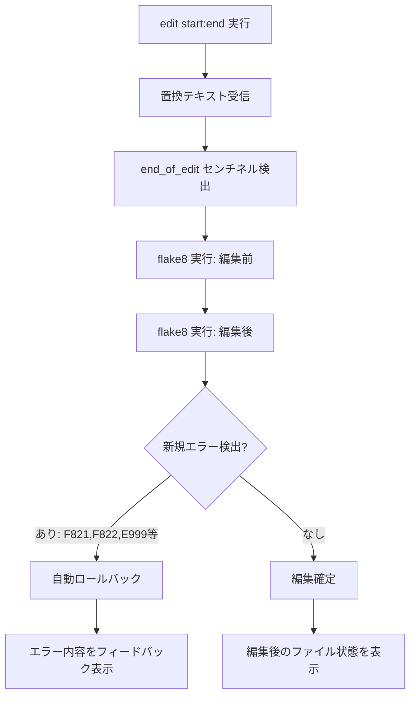
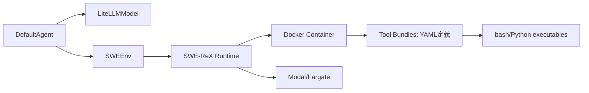

本記事は [SWE-agent: Agent-Computer Interfaces Enable Automated Software Engineering](https://arxiv.org/abs/2405.15793) の解説記事です。

## 論文概要（Abstract）

SWE-agentは、LMエージェントがソフトウェアエンジニアリングタスクを自律的に遂行するための専用インタフェース「ACI（Agent-Computer Interface）」を提案・評価した研究である。著者らは、人間がIDEの恩恵を受けるのと同様に、LMエージェントにも専用に設計されたインタフェースが必要であると主張している。SWE-bench（2,294件の実GitHub Issue）においてGPT-4oで12.5%の解決率を達成し、汎用ターミナルアクセスのみの手法（1.96%）に対して約6.4倍の性能向上を実現したと報告されている。さらにHumanEvalFixベンチマークでは87.7%のpass@1を達成し、非エージェント手法を大幅に上回った（論文Table 1, Table 2より）。

この記事は [Zenn記事: Claude Code Hooks×Routines×Workflowで開発自動化パイプラインを構築する](https://zenn.dev/0h_n0/articles/3a4fdda1d5c743) の深掘りです。

## 情報源

- **arXiv ID**: 2405.15793
- **URL**: [https://arxiv.org/abs/2405.15793](https://arxiv.org/abs/2405.15793)
- **著者**: John Yang, Carlos E. Jimenez, Alexander Wettig, Kilian Lieret, Shunyu Yao, Karthik Narasimhan, Ofir Press
- **所属**: Princeton University, Princeton Language and Intelligence (PLI)
- **発表年**: 2024年5月（NeurIPS 2024採択）
- **分野**: cs.SE（ソフトウェアエンジニアリング）、cs.CL（計算言語学）、cs.AI（人工知能）

## 背景と動機（Background & Motivation）

ソフトウェアエンジニアリングの自動化は、LLMの能力向上に伴い急速に進展している。GitHub Copilotのようなコード補完ツールは広く普及したが、「Issue を読み、リポジトリを調査し、修正コードを書いてテストする」という一連のワークフローを自律的に遂行するエージェントの実現は依然として困難であった。

従来のアプローチでは、LMエージェントに汎用のbashシェルアクセスを与え、任意のコマンドを実行させる方式が主流であった。しかし著者らは、この方式には以下の根本的な問題があると指摘している。

1. **出力の肥大化**: `cat`や`grep -rn`の無制限出力がコンテキストウィンドウを圧迫する
2. **状態管理の困難**: エージェントが「現在どのファイルのどの位置にいるか」を毎ターン再構築する必要がある
3. **不可逆な破壊操作**: 構文エラーを含む編集が蓄積し、回復不能な状態に陥る
4. **コマンド体系の複雑さ**: bash の膨大なオプション体系がLMにとって認知負荷となる

これはHCI（Human-Computer Interaction）における「ユーザインタフェース設計がタスク遂行効率を決定する」という知見と本質的に同一の問題であり、著者らはLMエージェント向けのインタフェース設計を「ACI: Agent-Computer Interface」として体系化することを提案している。

## 主要な貢献（Key Contributions）

- **ACI概念の形式化**: LMエージェント向けインタフェース設計を独立した研究領域として位置づけ、4つの設計原則を体系化した
- **カスタムコマンド体系**: ファイル閲覧・編集・検索・ナビゲーションのための専用コマンドセットを設計した
- **大規模評価**: SWE-bench（2,294タスク）とHumanEvalFix（164タスク）で性能を検証し、ACI有無の影響を定量化した
- **アブレーション分析**: 各コンポーネント（editコマンド、linterフィードバック、ウィンドウ表示）の寄与を個別に検証した
- **オープンソース公開**: コード・データ・デモを [swe-agent.com](https://swe-agent.com) で公開し、後続研究の基盤を提供した

## 技術的詳細（Technical Details）

### ACI設計原則

著者らは、エージェントとコンピュータ間のインタフェース設計において以下の4原則を提唱している。

| 原則 | 説明 | SWE-agentでの実装例 |
|------|------|---------------------|
| Actions should be simple | コマンドは少ないオプションで簡潔に記述可能であるべき | `open <path> [line]`のような1-2引数の設計 |
| Feedback should be informative and concise | フィードバックは有益かつ簡潔に制限すべき | 100行ウィンドウ + 行番号常時表示 |
| Hard guardrails prevent unrecoverable states | 不可逆な状態遷移をハードウェア的に防止すべき | 構文エラー検出時の自動ロールバック |
| Soft guardrails promote best practices | ベストプラクティスを促進するソフトな制約を設けるべき | linter警告の即時フィードバック |

### カスタムコマンド体系

SWE-agentは以下のコマンドセットを提供する。

```
# ファイル閲覧
open <path> [line_number]    # ファイルを100行ウィンドウで開く
goto <line_number>           # 指定行にジャンプ（行を1/6位置に配置）
scroll_down                  # 100行下にスクロール（2行オーバーラップ）
scroll_up                    # 100行上にスクロール（2行オーバーラップ）

# 検索
search_file <term> [path]    # ファイル内テキスト検索
search_dir <term> [dir]      # ディレクトリ横断検索（最大100ファイル制限）
find_file <name> [dir]       # ファイル名検索

# 編集
edit <start_line>:<end_line>  # 指定範囲を置換（end_of_editセンチネルで終了）
create <path>                 # 新規ファイル作成

# 制御
submit                        # 解答提出（<<SWE_AGENT_SUBMISSION>>センチネル発行）
```

### ファイルビューア設計

ファイルビューアはACIの中核コンポーネントであり、以下の仕様で設計されている。

```
[File: /path/to/file.py (247 lines total)]
(this is the beginning of the file)
  1| import os
  2| import sys
  3| from typing import List, Optional
  4|
  5| class FileProcessor:
  6|     """Process files with configurable options."""
...
100| # End of visible window
(100 more lines below)
```

**設計上の決定**:
- **固定100行ウィンドウ**: コンテキスト消費を予測可能に制限する
- **2行オーバーラップ**: ページ間の文脈を維持する
- **行番号常時表示**: editコマンドでの範囲指定を正確にする
- **ファイルメタ情報**: 総行数と相対位置を常に表示する

### Edit-with-Lint機構

editコマンドの実行フローは以下のとおりである。



この機構により、構文的に不正な編集が蓄積して回復不能になる事態を防止している。著者らは、この「ハードガードレール」がエージェントの性能に大きく寄与していることをアブレーション実験で確認している。

### エージェント実行ループ

SWE-agentの推論ループは5フェーズで構成される。

1. **Render**: 履歴をプロセッサで整形（古い観測の切り詰め、キャッシュマーカ適用）
2. **Call**: LiteLLM経由でモデルを呼び出し、累積コストを追跡
3. **Parse**: レスポンスからthoughtとaction（bashコマンドまたは関数呼び出し）を抽出
4. **Validate**: `bash -n`による構文チェック、ブロックリストコマンドの拒否
5. **Execute**: SWE-ReXランタイムにコマンド送信、出力キャプチャ、状態更新

終了条件は4種類: `submit`コマンド成功、`exit`による自発的終了、コスト上限超過、コンテキストオーバーフロー。すべてのエラー状態では「autosubmit」（部分成果の提出）が発動し、ハード失敗を回避する。

### 実行アーキテクチャ



各タスクはDockerコンテナ内で隔離実行される。ターン間でPythonオブジェクトは永続化されず、状態は環境変数・ディスクファイル・`_state`コマンドのJSON出力を通じてプロンプトに注入される。最大50ステップまで実行可能で、平均的な解決には20-35ステップを要すると報告されている。

## 実装のポイント（Implementation Details）

### Docker隔離環境

各SWE-benchタスクに対して個別のDockerコンテナが起動される。コンテナ内にはリポジトリのクローンとテスト環境が事前構築されており、エージェントの操作がホスト環境に影響しない設計となっている。

### コスト構造

著者らは、GPT-4oを使用した場合のタスクあたり平均コストを$2.51と報告している。これは約20-35ステップの推論ループにおけるAPI呼び出しコストの合計である。

### Tool Bundles

SWE-agentのコマンドはYAMLファイルで定義され、各コマンドに対応するbash/Pythonスクリプトとドキュメントがバンドルされている。この設計により、新しいコマンドの追加やカスタマイズが容易である。

```yaml
# Tool Bundle定義例（概念的な構造）
name: edit
description: "Replace lines in the currently open file"
signature: "edit <start_line>:<end_line>"
docstring: |
  Replaces lines between start_line and end_line (inclusive)
  with the text you provide. Automatically validates syntax.
end_marker: "end_of_edit"
```

### 状態管理

ターン間で永続化されるのは環境変数、ディスク上のファイル、および`_state`コマンドの出力のみである。Pythonオブジェクトやメモリ上の状態は各ターンでリセットされる。この設計は再現性と堅牢性を確保するためのものである。

## Production Deployment Guide

SWE-agentの設計原則を自社のコーディングエージェントやCI/CDパイプラインに適用する際の実装ガイドを示す。

### ACI設計パターンの実装

SWE-agentのACI設計原則は、Claude CodeのHooksや自作エージェントに直接応用可能である。以下に各原則の実装パターンを示す。

#### 原則1: シンプルなアクション設計

```python
from dataclasses import dataclass
from typing import Optional


@dataclass
class FileViewerConfig:
    """ACI原則に基づくファイルビューア設定."""

    window_size: int = 100
    overlap: int = 2
    show_line_numbers: bool = True


class ACIFileViewer:
    """SWE-agent流100行ウィンドウビューア.

    ACI原則 'Actions should be simple' に従い、
    コマンドは最大2つの位置引数のみ受け付ける。
    """

    def __init__(self, config: Optional[FileViewerConfig] = None) -> None:
        self.config = config or FileViewerConfig()
        self._current_file: Optional[str] = None
        self._current_line: int = 0
        self._lines: list[str] = []

    def open(self, path: str, line: int = 1) -> str:
        """ファイルを開き、指定行を含むウィンドウを表示.

        Args:
            path: ファイルパス
            line: 表示開始行（デフォルト: 1）

        Returns:
            フォーマット済みウィンドウ出力
        """
        with open(path, encoding="utf-8") as f:
            self._lines = f.readlines()
        self._current_file = path
        self._current_line = max(1, line)
        return self._render_window()

    def scroll_down(self) -> str:
        """100行下にスクロール（2行オーバーラップ維持）."""
        self._current_line += self.config.window_size - self.config.overlap
        return self._render_window()

    def scroll_up(self) -> str:
        """100行上にスクロール（2行オーバーラップ維持）."""
        self._current_line -= self.config.window_size - self.config.overlap
        self._current_line = max(1, self._current_line)
        return self._render_window()

    def _render_window(self) -> str:
        """現在位置から100行ウィンドウをレンダリング."""
        total = len(self._lines)
        start = self._current_line - 1
        end = min(start + self.config.window_size, total)
        header = f"[File: {self._current_file} ({total} lines total)]"
        lines_output = []
        for i in range(start, end):
            lines_output.append(f"{i + 1:>4}| {self._lines[i].rstrip()}")
        remaining = total - end
        footer = (
            f"({remaining} more lines below)"
            if remaining > 0
            else "(this is the end of the file)"
        )
        return f"{header}\n" + "\n".join(lines_output) + f"\n{footer}"
```

#### 原則3: ハードガードレール（Edit-with-Lint）

```python
import subprocess
import tempfile
from pathlib import Path


class GuardedEditor:
    """構文エラー時に自動ロールバックするエディタ.

    ACI原則 'Hard guardrails should prevent unrecoverable states' の実装。
    """

    def __init__(self, linter_cmd: str = "ruff check --select=E999,F821,F822") -> None:
        self._linter_cmd = linter_cmd

    def edit(
        self, file_path: str, start_line: int, end_line: int, new_content: str
    ) -> dict[str, str | bool]:
        """範囲指定編集を実行し、構文エラー時にロールバック.

        Args:
            file_path: 対象ファイルパス
            start_line: 編集開始行（1-indexed）
            end_line: 編集終了行（inclusive）
            new_content: 置換テキスト

        Returns:
            success: 編集成否, message: フィードバック, content: 編集後内容
        """
        path = Path(file_path)
        original = path.read_text(encoding="utf-8")
        lines = original.splitlines(keepends=True)
        # 編集前のlinterエラーを取得
        pre_errors = self._run_linter(file_path)
        # 編集適用
        new_lines = new_content.splitlines(keepends=True)
        lines[start_line - 1 : end_line] = new_lines
        edited_content = "".join(lines)
        # 一時ファイルに書き出してlinter実行
        with tempfile.NamedTemporaryFile(
            mode="w", suffix=".py", delete=False, encoding="utf-8"
        ) as tmp:
            tmp.write(edited_content)
            tmp_path = tmp.name
        post_errors = self._run_linter(tmp_path)
        Path(tmp_path).unlink()
        # 新規エラーの検出
        new_errors = post_errors - pre_errors
        if new_errors:
            # ロールバック: 元のファイルを復元
            return {
                "success": False,
                "message": f"Edit rejected. New errors: {new_errors}",
                "content": original,
            }
        # 編集確定
        path.write_text(edited_content, encoding="utf-8")
        return {
            "success": True,
            "message": "Edit applied successfully.",
            "content": edited_content,
        }

    def _run_linter(self, file_path: str) -> set[str]:
        """linterを実行し、エラーセットを返す."""
        result = subprocess.run(
            self._linter_cmd.split() + [file_path],
            capture_output=True,
            text=True,
        )
        errors = set()
        for line in result.stdout.splitlines():
            if ":" in line:
                errors.add(line.strip())
        return errors
```

#### CI/CDパイプラインへの統合

SWE-agentのACI原則を既存のCI/CDパイプライン（GitHub Actions等）に統合する際の設計パターンを示す。

```yaml
# .github/workflows/agent-assisted-fix.yml
# SWE-agent原則をGitHub Actionsで実現する概念的ワークフロー
name: Agent-Assisted Issue Fix
on:
  issues:
    types: [labeled]

jobs:
  agent-fix:
    if: contains(github.event.label.name, 'agent-fix')
    runs-on: ubuntu-latest
    steps:
      - uses: actions/checkout@v4

      # ACI原則: ハードガードレール（Dockerコンテナ隔離）
      - name: Run agent in isolated container
        run: |
          docker run --rm \
            -v ${{ github.workspace }}:/workspace \
            --network=none \
            agent-runner:latest \
            --issue "${{ github.event.issue.number }}" \
            --max-steps 50 \
            --cost-limit 5.00

      # ACI原則: フィードバックの簡潔化
      - name: Validate changes with linter
        run: |
          ruff check --select=E999,F821,F822 . || {
            echo "::error::Agent introduced syntax errors"
            git checkout .
            exit 1
          }

      - name: Run test suite
        run: pytest --tb=short -q
```

#### Claude Code Hooksとの対応関係

SWE-agentのACI設計原則は、Claude Code Hooksの設計思想と密接に対応している。

| SWE-agent ACI原則 | Claude Code Hooks対応 |
|---|---|
| Simple actions | Hooks は単一イベントに対する単一アクションとして定義 |
| Informative feedback | Hook 実行結果がエージェントのコンテキストにフィードバック |
| Hard guardrails | pre-commit hook による構文チェック強制 |
| Soft guardrails | post-edit hook でのlint警告通知 |

この対応関係から、SWE-agentの研究知見はClaude CodeのHooks設計に直接応用可能であり、Zenn記事で解説したパイプライン構築の理論的基盤を提供している。

## 実験結果（Experimental Results）

### SWE-bench本体

SWE-bench（2,294タスク: 実際のGitHub Issue修正）における結果を以下に示す。

| システム | モデル | % Resolved |
|---------|--------|-----------|
| SWE-agent | GPT-4o | 12.5% |
| SWE-agent | Claude 3 Opus | 10.54% |
| RAG + GPT-4o（非エージェント） | GPT-4o | 4.80% |
| OpenHands（ACI無し） | GPT-4o | 1.96% |

著者らは、ACI有りのSWE-agent（12.5%）とACI無しのベースライン（1.96%）を比較することで、インタフェース設計が解決率を約6.4倍向上させることを示している（論文Table 1より）。

### SWE-bench Lite

より厳選された300タスクのSWE-bench Liteでは、GPT-4oを使用したSWE-agentが18.0%の解決率を達成している。

### HumanEvalFix

HumanEvalFix（164タスク: バグ修正）における結果を以下に示す。

| 手法 | モデル | pass@1 (Python) |
|------|--------|-----------------|
| SWE-agent | GPT-4 Turbo | 87.7% |
| GPT-4（非エージェント） | GPT-4 | 47.0% |
| CodeLlama-instruct-13B | CodeLlama | 29.2% |
| WaveCoder-DS-6.7B | WaveCoder | 57.9% |

著者らは、SWE-agentが1-shotデモンストレーション付きで87.7%を達成し、非エージェント手法を大幅に上回ったと報告している（論文Table 2より）。ただし、この評価ではテストデータセット内のバグ修正成功例を1つデモンストレーションとして提供している点に注意が必要である。

### アブレーション分析

SWE-bench Liteにおける各コンポーネントの寄与を検証したアブレーション結果を示す。

| 構成 | % Resolved | 変化 |
|------|-----------|------|
| Full SWE-agent（全コンポーネント有り） | 18.0% | baseline |
| editコマンド + linter除去 | 10.3% | -7.7pt |
| linterフィードバックのみ除去 | 約14% | -4pt |
| ウィンドウ表示除去（cat使用） | 約12% | -6pt |

この結果から、以下の知見が得られる。

1. **editコマンドとlinterの組み合わせ**が最も大きな寄与を持ち、除去すると約43%の性能低下が発生する
2. **ウィンドウ表示**の除去はコンテキストの肥大化を招き、約33%の性能低下につながる
3. **linterフィードバック単体**でも約22%の性能低下が確認される

これらの結果は、ACI設計の各要素が相補的に機能していることを示唆している。

## 実運用への応用（Practical Applications）

### 開発自動化パイプラインへの示唆

SWE-agentの知見は、Zenn記事で解説したClaude Code Hooks × Routines × Workflowによる開発自動化パイプラインに以下の示唆を与える。

1. **コマンド設計の簡潔化**: エージェントに提供するツールは引数を最小限にし、ドキュメントを簡潔にすべきである
2. **即時フィードバック**: 編集後のlinter実行やテスト実行を自動化し、エージェントに即座にフィードバックを返すべきである
3. **ガードレールの設置**: 構文エラーの自動検出・ロールバック機構により、エージェントの暴走を防止すべきである
4. **コンテキスト管理**: 出力サイズを制限し、エージェントのコンテキストウィンドウを効率的に活用すべきである

### 後続研究の発展

SWE-agentの発表以降、SWE-benchのスコアは急速に向上している。2024年8月時点でトップスコアは45.20%（Gru）であったが、2025-2026年にはClaude Opus 4.5 + Live-SWE-agentが79.2%（SWE-bench Verified）を達成するに至っている。この急速な進歩は、ACI設計の改善とLLM能力の向上の相乗効果によるものと考えられる。

## 関連研究（Related Work）

### CodeAct（Wang et al., 2024）

CodeAct は LMエージェントのアクション空間をPythonコード生成に統一するアプローチを提案している。SWE-agentがドメイン特化コマンドを設計するのに対し、CodeActはコード自体をアクション表現とする点で対照的であるが、「エージェントにとって使いやすいインタフェース」という目標は共通している。

### OpenHands（Wang et al., 2024）

OpenHands（旧OpenDevinProject）は、汎用的なソフトウェア開発エージェントプラットフォームである。SWE-agentの結果と比較して、ACI無しのOpenHands（GPT-4o）は1.96%の解決率にとどまっており、インタフェース設計の重要性を裏付けている。

### Agentless（Xia et al., 2024）

Agentlessは、エージェント的な反復ループを用いずに、局所化→修正→検証の3段階パイプラインでバグ修正を行う手法である。SWE-bench Liteで27.3%を達成し、エージェント方式とは異なるアプローチで同等以上の性能を示した点で注目される。

### Claude Code

Anthropic社のClaude Codeは、SWE-agentの知見を商用プロダクトに昇華した事例といえる。Hooks（イベント駆動の自動処理）、Routines（定期的な自動実行）、Workflow（複数ステップの自動化）は、SWE-agentのACI設計原則を実践的に体現している。

## まとめと今後の展望

SWE-agentは、LMエージェント向けインタフェース設計を「ACI: Agent-Computer Interface」として体系化し、その設計原則が自動ソフトウェアエンジニアリングの性能を決定的に左右することを実証した。汎用bashアクセスに対して約6.4倍の性能向上（1.96% → 12.5%）という結果は、「LMの能力向上だけでなく、LMとコンピュータの間のインタフェース設計が鍵である」という重要な洞察を提供している。

今後の研究方向として著者らは以下を挙げている。

1. **複数試行の統合**: 現在のpass@1評価から、複数試行の自動選択・統合への拡張
2. **コンテキスト長制約の緩和**: より長いコンテキストウィンドウを活用したACI設計の再検討
3. **ACI汎化性の検証**: ソフトウェアエンジニアリング以外のドメイン（データ分析、インフラ運用等）へのACI概念の適用
4. **人間設計からの脱却**: エージェント自身がACIを学習・最適化する可能性

NeurIPS 2024に採択された本研究は、後続のコーディングエージェント研究の理論的基盤となっており、Claude Code Hooksを含む実用ツールの設計に直接的な影響を与えている。

## 参考文献

1. Yang, J., Jimenez, C. E., Wettig, A., Lieret, K., Yao, S., Narasimhan, K., & Press, O. (2024). SWE-agent: Agent-Computer Interfaces Enable Automated Software Engineering. *NeurIPS 2024*. [https://arxiv.org/abs/2405.15793](https://arxiv.org/abs/2405.15793)
2. Jimenez, C. E., Yang, J., Wettig, A., Yao, S., Peri, K., Press, O., & Narasimhan, K. (2024). SWE-bench: Can Language Models Resolve Real-World GitHub Issues? *ICLR 2024*. [https://arxiv.org/abs/2310.06770](https://arxiv.org/abs/2310.06770)
3. Wang, X., et al. (2024). OpenHands: An Open Platform for AI Software Developers as Generalist Agents. [https://arxiv.org/abs/2407.16741](https://arxiv.org/abs/2407.16741)
4. Xia, C. S., et al. (2024). Agentless: Demystifying LLM-based Software Engineering Agents. [https://arxiv.org/abs/2407.01489](https://arxiv.org/abs/2407.01489)
5. Wang, X., et al. (2024). Executable Code Actions Elicit Better LLM Agents. *ICML 2024*. [https://arxiv.org/abs/2402.01030](https://arxiv.org/abs/2402.01030)
