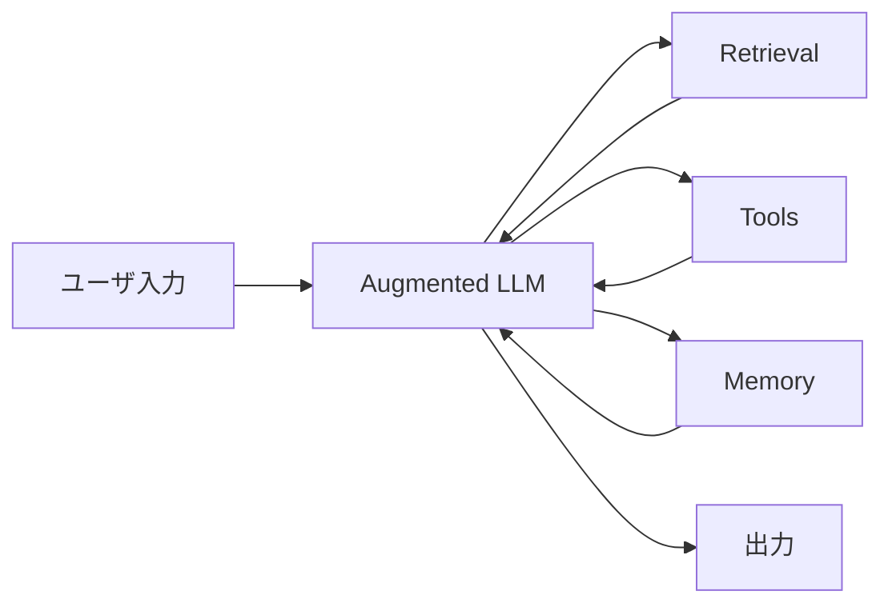
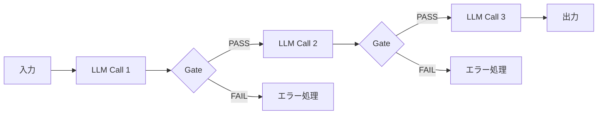
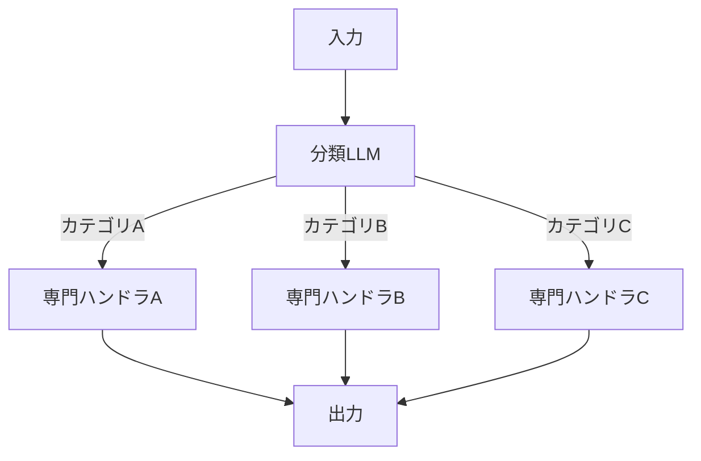
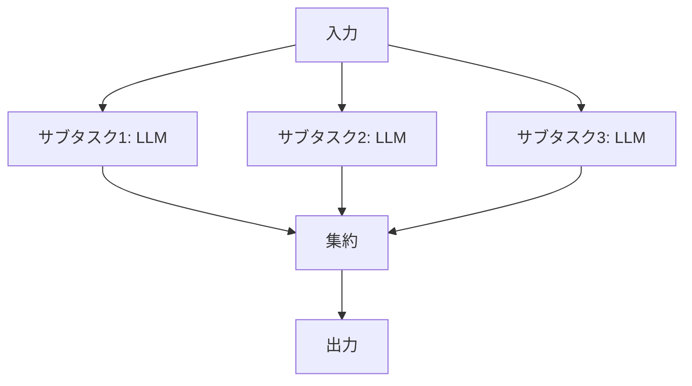
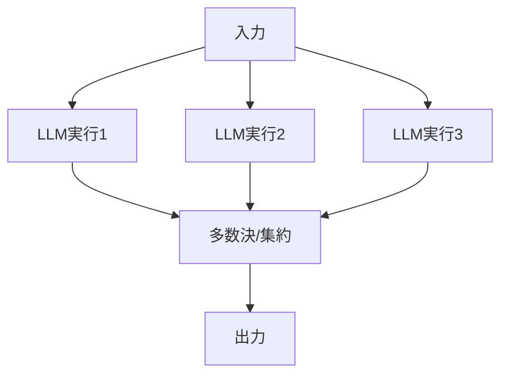
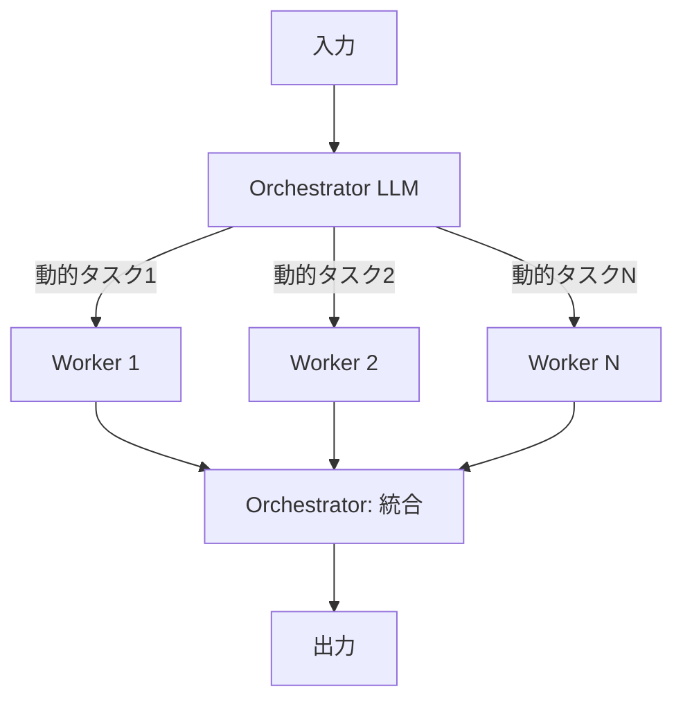
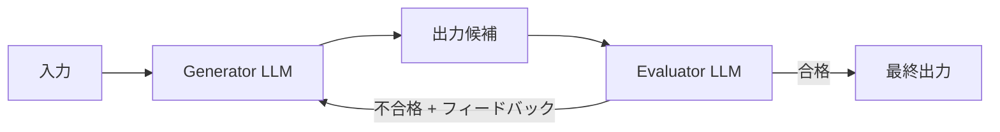
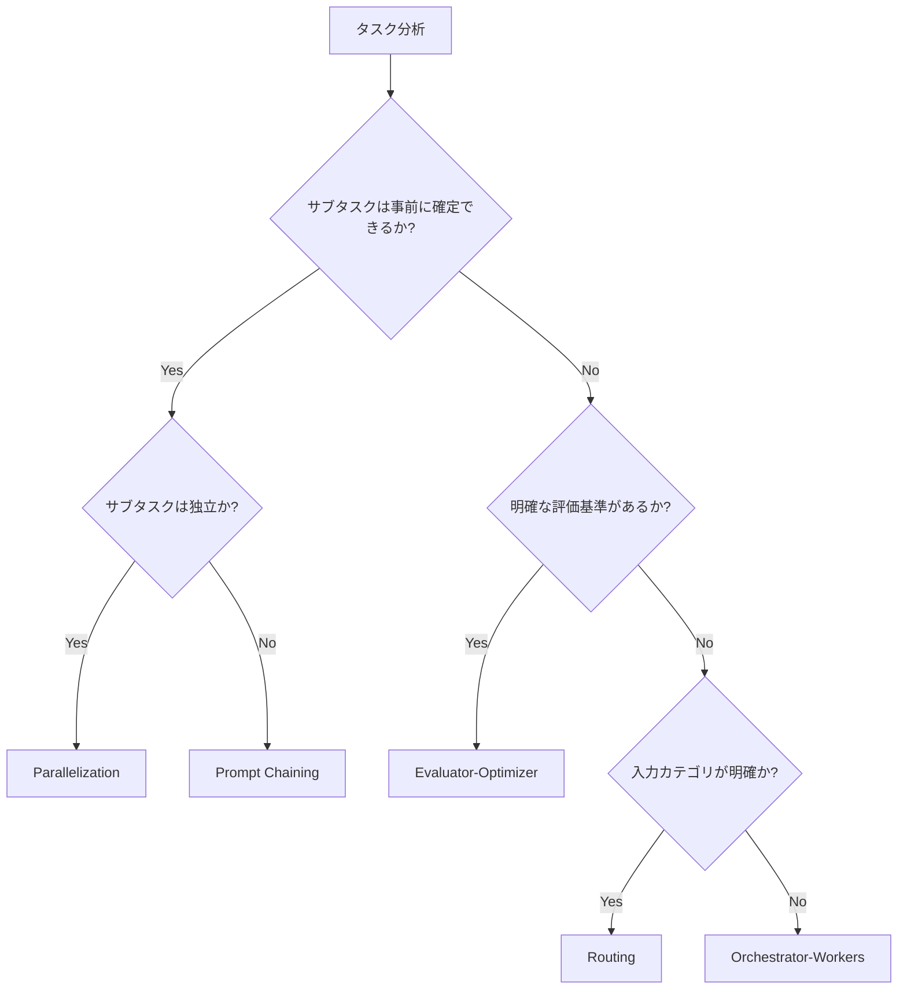

本記事は [https://www.anthropic.com/research/building-effective-agents](https://www.anthropic.com/research/building-effective-agents) の解説記事です。

## ブログ概要

Anthropicは2024年12月19日、AIエージェント構築に関する包括的ガイド「Building Effective Agents」を公開した。著者Erik S.とBarry Zhangは、LLMを用いたシステムを**ワークフロー**と**エージェント**に分類し、開発者が段階的に複雑さを導入するための5つの設計パターンを体系化している。

本ブログの核心的主張は「最も成功した実装は、複雑なフレームワークではなく、シンプルで組み合わせ可能なパターンを使用している」という点にある。著者らは、開発自動化パイプラインの構築においても、まず単一のLLMコールを最適化し、成果向上が実証された場合にのみ複雑さを追加すべきだと報告している。

この記事は [Zenn記事: Claude Code Hooks x Routines x Workflowで開発自動化パイプラインを構築する](https://zenn.dev/0h_n0/articles/3a4fdda1d5c743) の関連1次情報です。Claude Code Hooks/Routines/Workflowの設計思想がAnthropicのエージェント設計原則にどう対応するかを理解する手がかりとして参照されたい。

## 情報源

- **種別**: 企業テックブログ（Anthropic Research）
- **URL**: [https://www.anthropic.com/research/building-effective-agents](https://www.anthropic.com/research/building-effective-agents)
- **組織**: Anthropic
- **著者**: Erik S., Barry Zhang
- **発表日**: 2024年12月19日

## 技術的背景

### Augmented LLM: エージェントの基本構成要素

著者らはエージェントシステムの最小構成要素として「Augmented LLM」を提唱している。これは素のLLMに以下の3つの能力を付加したものである：

1. **Retrieval（検索）**: 外部知識ベースへのクエリ生成と結果取得
2. **Tools（ツール）**: 外部システムへのアクション実行
3. **Memory（記憶）**: コンテキストを跨いだ情報保持



著者らは、現代のLLMが能動的に検索クエリを生成し、適切なツールを選択し、必要な情報を保持できるようになったことが、エージェントシステムの実現を可能にしたと報告している。

### Workflows vs. Agents: 根本的区分

著者らはLLMベースのシステムを2つのカテゴリに明確に区分している：

| 観点 | Workflows | Agents |
|------|-----------|--------|
| 制御主体 | 事前定義されたコードパス | LLM自身 |
| 実行フロー | 静的（コンパイル時に確定） | 動的（実行時に決定） |
| 予測可能性 | 高い | 低い |
| 適用場面 | 定型タスク | 開放的問題 |
| コスト/レイテンシ | 予測可能 | 可変 |

この区分は、開発自動化パイプラインの設計において重要な意味を持つ。CI/CDパイプラインのように手順が固定的な場面ではWorkflowsが適し、コードレビューやバグ修正のように状況に応じた判断が必要な場面ではAgentsが適する。

## 実装アーキテクチャ: 5つの設計パターン

### パターン1: Prompt Chaining（逐次連鎖）

タスクを固定的なサブタスクの列に分解し、各ステップのLLM出力を次のステップへの入力とするパターンである。各ステップ間にプログラム的な検証ゲート（gate）を配置し、品質を担保する。



**設計原則**: 各サブタスクは前のステップの出力を処理するため、タスク全体の正確性をステップ単位で検証できる。ゲートの存在により、下流への不正な入力伝播を防止する。

**適用場面**:
- マーケティングコピー生成後の多言語翻訳
- ドキュメントのアウトライン生成後の本文執筆
- コード生成後のレビュー・修正

**開発自動化での応用**: Claude Code Hooksにおけるpre-commit hookの設計は、このPrompt Chainingパターンの具体的実装と見なせる。コード変更→フォーマットチェック→コミットという連鎖において、ゲートがfrontmatterバリデーション等の役割を果たす。

### パターン2: Routing（振り分け）

入力を分類し、専門的な下流ハンドラに振り分けるパターンである。関心の分離を実現し、各ハンドラをタスク特化で最適化できる。



**設計原則**: ルーティング層がトラフィックの振り分けを担当し、各ハンドラは自身が担当するカテゴリに特化したプロンプトとツールを持つ。これにより、単一の汎用プロンプトよりも高い品質を実現する。

**適用場面**:
- カスタマーサポートクエリの振り分け（一般質問/返金処理/技術的問題）
- 難易度に応じたモデルサイズの選択（簡単なクエリ→小型モデル、複雑なクエリ→大型モデル）
- コンテンツ種別に応じた処理パイプラインの分岐

**開発自動化での応用**: Claude Code内でのタスク振り分け（記事生成/コードレビュー/テスト実行）は、Routingパターンの実装例である。入力されたコマンドやコンテキストに基づき、適切なスキルやエージェントに処理が委任される。

### パターン3: Parallelization（並列処理）

LLMタスクを同時に実行し、結果を集約するパターンである。著者らは2つのサブパターンを提示している：

**Sectioning（分割実行）**: 独立したサブタスクを並列に実行する。



**Voting（投票実行）**: 同一タスクを複数回実行し、多数決や集約で信頼性を確保する。



**設計原則**: Sectioningはレイテンシ削減に有効であり、Votingは高リスクな判断の信頼性向上に有効である。両者は排他的ではなく、組み合わせて使用できる。

**適用場面**:
- コンテンツモデレーション（複数の安全性基準を同時チェック）
- コードの脆弱性レビュー（複数の観点から同時検査）
- 多観点評価（技術的正確性/可読性/保守性を同時に評価）

**開発自動化での応用**: 記事生成パイプラインにおけるスニペットレビューは、各コードブロックを独立に検証するSectioningの実装例である。複数のスニペットを並列に`claude -p`で検証し、結果を集約する。

### パターン4: Orchestrator-Workers（指揮者-作業者）

中央のLLM（オーケストレーター）がタスクを動的に分解し、ワーカーLLMに委任、結果を統合するパターンである。Parallelizationとの違いは、サブタスクの内容が入力に応じて動的に決定される点にある。



**設計原則**: オーケストレーターは全体の計画を立て、各ワーカーの出力を監視・統合する。ワーカーの数や内容は実行時に決定されるため、事前に予測不能な複雑さに対応できる。

**適用場面**:
- マルチファイルにまたがるコード変更（変更対象ファイルが入力に依存）
- 複数ソースからの情報検索と統合（検索クエリが動的に決定）
- 大規模リファクタリング（影響範囲が実行時に判明）

**開発自動化での応用**: Claude Code WorkflowにおけるRoutinesは、Orchestrator-Workersパターンの一形態と見なせる。RoutineがOrchestrator役を担い、各ステップで実行すべきタスクを動的に決定し、必要なツールやサブエージェントに委任する。

### パターン5: Evaluator-Optimizer（評価者-最適化者）

1つのLLMが応答を生成し、別のLLMが評価とフィードバックを提供するイテレーティブなパターンである。



**設計原則**: 明確な評価基準が存在し、反復的な改善が測定可能な場面で有効である。Evaluatorは具体的なフィードバック（何が問題で、どう改善すべきか）を返す必要がある。

**適用場面**:
- 文学翻訳（ニュアンスの正確性を反復的に改善）
- 複雑な多段階リサーチタスク（情報の網羅性を段階的に向上）
- コード品質の反復的改善（レビュー指摘→修正→再レビュー）

**開発自動化での応用**: Zenn記事パイプラインにおけるレビュー→修正のサイクルは、Evaluator-Optimizerパターンの直接的な実装である。`review_zenn_article.sh`がEvaluator、記事の修正プロセスがOptimizerに対応する。

## Production Deployment Guide

本セクションでは、著者らが提示するエージェント設計パターンを実際の開発自動化パイプラインに適用する際の実装指針を解説する。

### パターン選択のデシジョンツリー

著者らは「複雑さの追加は成果向上が実証された場合のみ」と明確に述べている。以下に、パイプラインのタスク特性に基づくパターン選択の判断基準を示す。



### 実装原則の適用

著者らが提示する3つの実装原則を、開発自動化の文脈で具体化する。

#### 1. Simplicity（シンプルな設計）

```python
# BAD: 不必要に複雑なマルチエージェント設計
class ArticleGenerationPipeline:
    def __init__(self):
        self.research_agent = Agent(model="claude-sonnet-4")
        self.writing_agent = Agent(model="claude-sonnet-4")
        self.review_agent = Agent(model="claude-sonnet-4")
        self.format_agent = Agent(model="claude-sonnet-4")
        self.orchestrator = Orchestrator(
            agents=[self.research_agent, self.writing_agent,
                    self.review_agent, self.format_agent]
        )

# GOOD: 単一LLMコール + 検索 + 構造化出力
class ArticleGenerationSimple:
    def generate(self, keyword: str) -> Article:
        """単一のLLMコールで記事生成。
        検索結果をコンテキストに含め、
        構造化出力で品質を担保する。"""
        context = self.search(keyword)
        return self.llm.generate(
            prompt=self.template,
            context=context,
            output_schema=ArticleSchema,
        )
```

著者らは「最適化された単一LLMコール + 検索 + コンテキスト内例示から開始」することを推奨している。記事生成であれば、まず1回のLLMコールで十分な品質が出るかを検証し、不足がある場合にのみパターンを導入すべきである。

#### 2. Transparency（計画ステップの明示）

エージェントが内部でどのような判断を行っているかを可視化することが信頼性に直結する。

```python
import logging
from dataclasses import dataclass
from typing import Literal

logger = logging.getLogger(__name__)

@dataclass
class PlanStep:
    """エージェントの計画ステップを明示的に記録するデータクラス。"""
    action: str
    reasoning: str
    status: Literal["pending", "running", "completed", "failed"]

class TransparentAgent:
    """計画ステップを明示するエージェント実装。"""

    def execute(self, task: str) -> dict:
        # Step 1: 計画の生成と記録
        plan = self.generate_plan(task)
        logger.info(
            "plan_generated",
            extra={"steps": [s.action for s in plan.steps]}
        )

        # Step 2: 各ステップの実行と状態遷移の記録
        results = []
        for step in plan.steps:
            step.status = "running"
            logger.info("step_started", extra={"action": step.action})
            result = self.execute_step(step)
            step.status = "completed" if result.success else "failed"
            logger.info(
                "step_completed",
                extra={
                    "action": step.action,
                    "status": step.status,
                    "duration_ms": result.duration_ms,
                }
            )
            results.append(result)

        return {"plan": plan, "results": results}
```

開発自動化パイプラインでは、各フェーズ（リサーチ→記事生成→レビュー→コミット）の遷移とその判断根拠をログとして記録することで、デバッグ可能性を確保する。

#### 3. Agent-Computer Interface (ACI) の設計

著者らはツール設計に特別な注意を払うべきだと報告している。以下に具体的なガイドラインを実装例で示す。

```python
from typing import Annotated
from pydantic import BaseModel, Field

class FileEditTool(BaseModel):
    """ファイル編集ツールのACI設計例。

    著者らの推奨事項を適用:
    - 絶対パス必須（相対パスエラーの防止 = ポカヨケ原則）
    - 操作の明示的な制約
    - エッジケースの事前定義
    """
    file_path: Annotated[str, Field(
        description="編集対象ファイルの絶対パス。"
                    "相対パスは受け付けない。"
                    "例: /home/user/project/src/main.py"
    )]
    old_string: Annotated[str, Field(
        description="置換対象の文字列。ファイル内で一意である必要がある。"
                    "一意でない場合はエラーを返す。"
    )]
    new_string: Annotated[str, Field(
        description="置換後の文字列。old_stringと異なる必要がある。"
    )]
```

著者らが言及する「ポカヨケ原則」とは、ツール設計において誤用を構造的に不可能にすることを指す。例として、Anthropicは開発中にディレクトリ変更後の相対パスエラーを発見し、絶対パスの強制に切り替えたと報告している。

### Hooks/Routines/Workflowとの対応関係

Claude Code Hooks/Routines/Workflow機能は、本ブログの設計パターンを具体化したプロダクト実装と位置づけられる。

| Claude Code機能 | 対応パターン | 役割 |
|----------------|-------------|------|
| Hooks (pre-commit等) | Prompt Chaining内のGate | 品質ゲートとして連鎖の中間検証を担当 |
| Routines (定期実行) | Orchestrator-Workers | 定期的にタスクを分解し実行を委任 |
| Workflow (マルチステップ) | Prompt Chaining / Orchestrator-Workers | ステップ間の遷移とタスク委任を管理 |
| Skills (特化機能) | Routingの下流ハンドラ | 特定カテゴリに特化した処理を提供 |

### エラーハンドリングとフォールバック戦略

著者らは明示的に述べていないが、プロダクション環境では各パターンにフォールバック戦略が必要である。ブログの「simplicity」原則に基づき、以下の段階的フォールバックを推奨する。

```python
import time
from dataclasses import dataclass

@dataclass
class RetryConfig:
    max_retries: int = 3
    base_delay: float = 1.0
    max_delay: float = 60.0

class ResilientPipeline:
    """フォールバック付きパイプライン実装。"""

    def __init__(self, config: RetryConfig):
        self.config = config

    def execute_with_fallback(self, task: str) -> str:
        """段階的フォールバック: Agent → Workflow → Single LLM。"""
        strategies = [
            ("orchestrator_workers", self._run_orchestrator),
            ("prompt_chaining", self._run_chain),
            ("single_llm", self._run_single),
        ]

        for name, strategy in strategies:
            try:
                return self._retry(strategy, task)
            except Exception as e:
                logger.warning(
                    "strategy_failed",
                    extra={"strategy": name, "error": str(e)}
                )
                continue

        raise RuntimeError("All strategies exhausted")

    def _retry(self, fn, task: str) -> str:
        """指数バックオフ + ジッタによるリトライ。"""
        for attempt in range(self.config.max_retries):
            try:
                return fn(task)
            except Exception:
                if attempt == self.config.max_retries - 1:
                    raise
                delay = min(
                    self.config.base_delay * (2 ** attempt),
                    self.config.max_delay
                )
                time.sleep(delay)
        raise RuntimeError("Unreachable")
```

### コスト・レイテンシのトレードオフ

著者らは「エージェントはレイテンシとコストをトレードオフにして、より高い性能を実現する」と報告している。開発自動化パイプラインでは、以下の指標でトレードオフを管理する。

| パターン | 相対コスト | 相対レイテンシ | 適用判断基準 |
|---------|-----------|--------------|-------------|
| Single LLM | 1x | 1x | 品質が十分な場合 |
| Prompt Chaining | 2-5x | 2-5x | 段階的検証が必要な場合 |
| Parallelization | 3-5x | 1-2x | レイテンシ重視で独立タスクがある場合 |
| Orchestrator-Workers | 3-10x | 2-5x | 動的タスク分解が必要な場合 |
| Evaluator-Optimizer | 2-10x | 3-10x | 品質基準が明確で反復改善が有効な場合 |

## パフォーマンス最適化

### フレームワークに関する著者らの見解

著者らはClaude Agent SDK、AWS Strands Agents SDK、Rivet、Vellum等の既存フレームワークについて言及し、「初期開発を簡素化するが、基盤メカニクスを隠蔽する抽象レイヤーを生む」と報告している。推奨事項として以下を挙げている：

1. **LLM APIを直接使用することから始める**: フレームワークの抽象化に依存せず、基本的な挙動を理解する
2. **フレームワークのコードを理解する**: 使用する場合は内部実装を把握する
3. **プロダクションシステムでは抽象化を減らす**: 本番環境ではフレームワーク依存を最小化する

### ツール最適化のガイドライン

著者らはツール設計（ACI）について以下の最適化ガイドラインを提示している：

**フォーマットの自然さ**: LLMの訓練データに自然に出現するフォーマットを使用する。例えば、コードを扱うツールではJSON形式よりMarkdown形式の方が自然である。

```python
# BAD: LLMにとって不自然なフォーマット
tool_input = {
    "code": "def hello():\\n    print(\\"world\\")",
    "line_start": 1,
    "line_end": 2
}

# GOOD: 訓練データに近い自然なフォーマット
tool_input = """
```python
def hello():
    print("world")
```
File: src/main.py, Lines: 1-2
"""
```

**フォーマットオーバーヘッドの最小化**: LLMが行番号のカウントやエスケープ処理に注意を割く必要がないよう設計する。

**例示とエッジケースの定義**: ツールの説明に具体的な使用例と境界条件を含める。

### 計測すべきメトリクス

プロダクション環境でのエージェントシステムは以下のメトリクスで監視すべきである：

- **タスク成功率**: エンドツーエンドでの目的達成率
- **ステップ数**: 目的達成までのLLMコール回数
- **総トークン消費量**: コストに直結する指標
- **レイテンシ（P50/P95/P99）**: ユーザ体験に影響する応答時間
- **ツールコールエラー率**: ACI設計の品質指標

## 運用での学び

### プロダクション事例: カスタマーサポート

著者らはカスタマーサポートを「エージェントの自然な適用先」として紹介している。その理由は以下の通りである：

1. **会話とアクションの統合**: ユーザとの対話中にシステム操作（顧客データ参照、返金処理、チケット更新）を実行
2. **ツール統合が容易**: 既存の業務システムAPIをツールとして定義可能
3. **成功指標が明確**: 問題解決率で評価でき、一部企業は「解決あたり課金」モデルを採用

### プロダクション事例: コーディングエージェント

著者らはコーディングエージェントが特に有効である理由を「自動テストによる検証が可能」な点に帰している。エージェントはテスト結果をフィードバックとして反復的にコードを改善できる。Anthropic自身のSWE-bench実装が実際のGitHub issueを解決していると報告している。

### 開発自動化パイプラインへの適用教訓

著者らの報告を開発自動化の文脈に照らし合わせると、以下の教訓が導出される：

1. **段階的導入**: 単一LLMコール→Prompt Chaining→必要に応じてOrchestrator-Workersへ段階的に複雑化する
2. **ゲート設計の重要性**: 各ステップ間の検証ゲートが、エラーの下流伝播を防止する（frontmatterバリデーション、スニペットレビュー等）
3. **透明性の確保**: パイプラインの各フェーズの実行状態と判断根拠をログに記録し、デバッグ可能性を担保する
4. **ツール設計への投資**: プロンプト最適化と同等の注意をツール定義（ACI）に払う

## 学術研究との関連

本ブログで提示されるパターンは、以下の学術研究との接点を持つ：

- **Multi-Agent Systems (MAS)**: Orchestrator-Workersパターンは、分散AIにおけるマルチエージェント協調の実用的簡素化と位置づけられる。Park et al. (2023) "Generative Agents" における社会シミュレーションのエージェント協調と設計思想を共有する。
- **Chain-of-Thought (CoT)**: Prompt ChainingはCoT推論の外部化・構造化と解釈できる。Wei et al. (2022) のChain-of-Thought Promptingを、複数LLMコールに分割して明示的な検証点を挿入した形態である。
- **Constitutional AI**: Evaluator-Optimizerパターンは、Bai et al. (2022) のConstitutional AIにおける自己批判・改善ループと構造的に類似している。
- **ReAct Framework**: Yao et al. (2022) のReActは、推論（Reasoning）と行動（Acting）を交互に行うフレームワークであり、本ブログのAugmented LLMの概念と直接対応する。

著者らのアプローチの特徴は、これらの学術的知見を「プロダクション適用可能な設計パターン」として再構成し、実装上のトレードオフを明示した点にある。

## まとめ

Anthropicの「Building Effective Agents」は、LLMベースのエージェントシステム設計における実践的ガイドラインを提供している。本記事の要点を整理する：

1. **ワークフローとエージェントの区分**: 制御の主体（コード vs LLM）による明確な分類
2. **5つの設計パターン**: Prompt Chaining、Routing、Parallelization、Orchestrator-Workers、Evaluator-Optimizerの段階的な複雑さ
3. **Simplicity原則**: 最適化された単一LLMコールから開始し、実証された改善がある場合のみ複雑さを追加
4. **ACI設計**: ツールのインターフェース設計にプロンプト最適化と同等の注意を払う
5. **段階的導入**: フレームワークに依存せず、基本コンポーネントの理解から始める

開発自動化パイプラインの設計者にとって、本ブログは「どのパターンをいつ使うか」の判断基準を提供するものである。Claude Code Hooks/Routines/Workflowの各機能がこれらのパターンのどれに対応するかを理解することで、より効果的なパイプライン設計が可能になる。

## 参考文献

- Anthropic. "Building Effective Agents." 2024-12-19. [https://www.anthropic.com/research/building-effective-agents](https://www.anthropic.com/research/building-effective-agents)
- Bai, Y. et al. "Constitutional AI: Harmlessness from AI Feedback." arXiv:2212.08073, 2022.
- Park, J.S. et al. "Generative Agents: Interactive Simulacra of Human Behavior." UIST 2023.
- Wei, J. et al. "Chain-of-Thought Prompting Elicits Reasoning in Large Language Models." NeurIPS 2022.
- Yao, S. et al. "ReAct: Synergizing Reasoning and Acting in Language Models." ICLR 2023.
