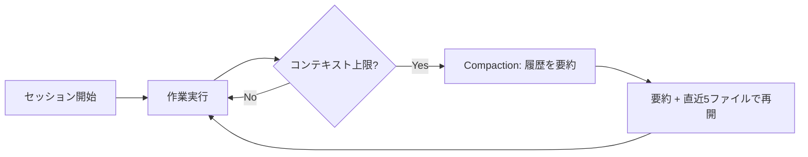
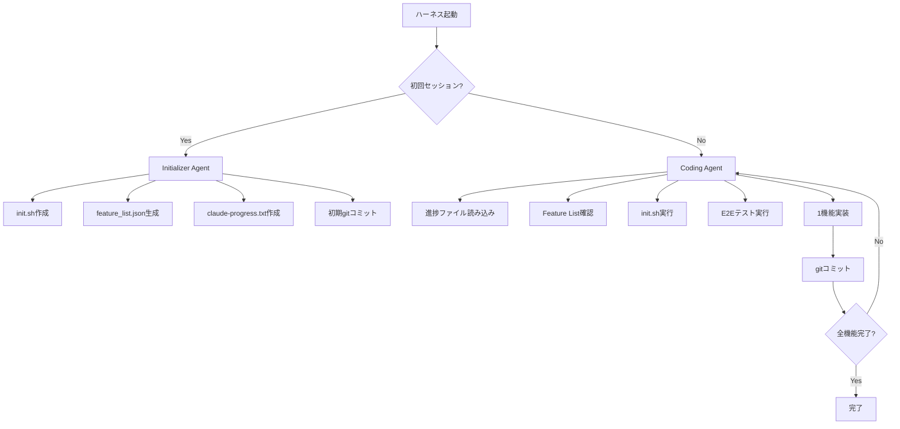
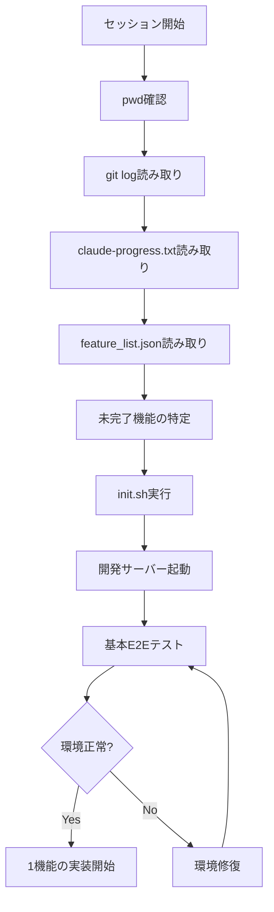

## ブログ概要

本記事は [Effective harnesses for long-running agents](https://www.anthropic.com/engineering/effective-harnesses-for-long-running-agents) の解説記事です。

Anthropicのエンジニアリングチームは、AIエージェントが複数のコンテキストウィンドウにまたがって長時間稼働する際に一貫した進捗を維持するためのハーネス設計パターンを公開した。著者のJustin Youngらは、「シフト制のエンジニアのように、新しいエンジニア（コンテキストウィンドウ）は前のシフトで何が起きたか記憶がない」という核心的課題を提示し、Initializer AgentとCoding Agentの2部構成ソリューション、構造化Feature List管理、失敗モード対策を体系的に解説している。

この記事は [Zenn記事: Claude Code Hooks x Routines x Workflowで開発自動化パイプラインを構築する](https://zenn.dev/0h_n0/articles/3a4fdda1d5c743) の深掘りです。

## 情報源

- **種別**: 企業テックブログ（Anthropic Engineering Blog）
- **URL**: [Effective harnesses for long-running agents](https://www.anthropic.com/engineering/effective-harnesses-for-long-running-agents)
- **組織**: Anthropic
- **著者**: Justin Young, David Hershey, Prithvi Rajasakeran, Jeremy Hadfield, Naia Bouscal, Michael Tingley他
- **公開日**: 2025年11月26日
- **関連リポジトリ**: [anthropics/claude-quickstarts/autonomous-coding](https://github.com/anthropics/claude-quickstarts/tree/main/autonomous-coding)

## 技術的背景

### コンテキストウィンドウの壁

大規模言語モデル（LLM）を基盤としたAIエージェントは、単一のコンテキストウィンドウ内であれば高い性能を発揮する。しかし、実用的なアプリケーション開発のように数時間から数日にわたる作業では、1つのコンテキストウィンドウに収まらない。著者らは、Claude Opus 4.5のようなフロンティアモデルであっても、長時間タスクで以下の典型的な失敗パターンに陥ると報告している。

1. **アプリケーション全体の同時実装**: 1つのセッションで全機能を一度に実装しようとし、品質が低下する
2. **早期完了宣言**: 実装途中にもかかわらずプロジェクトが完了したと判断する
3. **状態の喪失**: コンテキストウィンドウが切り替わった際に、前のセッションの進捗が失われる

### Compactionの限界

Claude Agent SDKには「compaction」と呼ばれる機能が実装されている。これはコンテキストウィンドウの上限に近づいた際に、過去のメッセージ履歴を要約して圧縮し、新しいコンテキストウィンドウで作業を継続する仕組みである。



Anthropicのエンジニアリングブログでは、compactionは長期的なコヒーレンス向上の「最初のレバー」として機能するものの、単独では不十分であると述べられている。具体的には、compactionによる要約は高忠実度であるが、アーキテクチャ上の決定や未解決バグの詳細が要約過程で欠落する可能性がある。著者らは、明示的な状態文書化（progress file、git history）でcompactionを補完するアプローチを提案している。

### ソフトウェアエンジニアリングからの着想

著者らの解決策は、ソフトウェアエンジニアリングにおけるシフト制勤務のベストプラクティスに着想を得ている。シフト交代時に引き継ぎ文書を作成するように、各コンテキストウィンドウ（シフト）が終了時に状態を文書化し、次のセッションがその文書を読み込んで作業を継続する。この「外部メモリ」としてのファイルシステムとgit履歴が、コンテキストウィンドウ間のブリッジとなる。

## 実装アーキテクチャ

### 2部構成エージェント

Anthropicが提案するハーネスは、同一のシステムプロンプト・ツール・インフラを共有しつつ、初回ユーザープロンプトのみが異なる2種類のエージェントで構成される。



#### Initializer Agent（初回セッション）

Initializer Agentは環境セットアップに特化する。アプリケーション仕様（`app_spec.txt`）を読み込み、以下の成果物を生成する。

| 成果物 | 役割 |
|--------|------|
| `init.sh` | 開発サーバー起動スクリプト（npm install, npm run dev等） |
| `feature_list.json` | 200以上のテストケースを含む機能一覧（JSON形式） |
| `claude-progress.txt` | セッション間の進捗メモ |
| 初期gitコミット | ベースラインファイル群のスナップショット |

著者らのclaude.aiクローン実験では、Initializer Agentが200以上の機能を持つfeature_list.jsonを生成したと報告されている。初回セッションは数分を要するが、この投資が後続セッションの効率を大幅に向上させる。

#### Coding Agent（後続セッション）

後続セッションで起動されるCoding Agentは、以下のプロトコルに従って増分的に進捗を積み重ねる。

1. `pwd`実行で作業ディレクトリを確認
2. gitログと`claude-progress.txt`を読み取り、直近の作業状況を把握
3. `feature_list.json`を読み込み、未完了の最優先機能を特定
4. `init.sh`を実行して開発サーバーを起動
5. 基本的なE2Eテストを実行して環境の健全性を検証
6. 選択した1機能の実装に着手
7. 実装完了後、自己検証を行い`feature_list.json`の`passes`フィールドを更新
8. gitコミットで進捗を永続化

**1セッション1機能の原則**が重要である。著者らは、1つのセッションで複数機能を同時に実装しようとすると、コンテキストが枯渇して中途半端な実装が残る問題を指摘している。

### Feature List管理

Feature Listは本ハーネスの中核的な状態管理機構である。著者らはMarkdownではなくJSON形式を採用しており、その理由として「JSONはMarkdownに比べて不適切な変更が起きにくい」と説明している。

```json
{
  "category": "functional",
  "description": "New chat button creates a fresh conversation",
  "steps": [
    "Navigate to main interface",
    "Click the 'New Chat' button",
    "Verify a new conversation is created",
    "Check that chat area shows welcome state",
    "Verify conversation appears in sidebar"
  ],
  "passes": false
}
```

各機能エントリは以下のフィールドを持つ。

| フィールド | 型 | 説明 |
|-----------|------|------|
| `category` | string | 機能カテゴリ（functional, ui, integrationなど） |
| `description` | string | 機能の説明文 |
| `steps` | string[] | 検証手順のリスト |
| `passes` | boolean | テスト通過状態（エージェントが変更可能な唯一のフィールド） |

**「テストの削除・編集は許容されない」** という制約が明示的にシステムプロンプトに記述される。エージェントが変更できるのは`passes`フィールドのみであり、テスト定義そのものの改変は禁止されている。これにより、エージェントが実装の困難さを回避するためにテスト自体を緩和する行為を防止する。

### セッション初期化フロー

Coding Agentの各セッション開始時のフローを詳細に示す。



このフローの設計意図は、各セッションが「白紙の状態」から開始されることを前提に、外部に永続化された状態情報を順序立てて読み込む点にある。gitログにより直近の変更履歴を、progress fileにより高レベルの進捗状況を、feature listにより残作業の全体像を把握する。この3層の状態復元が、compactionだけでは失われがちな文脈を補完する。

### テスト戦略

著者らはPuppeteer MCPサーバーによるブラウザ自動化を用いたE2Eテストを採用している。エージェントは人間ユーザーと同様にUIを操作し、機能の動作を視覚的・機能的に検証する。

**テストの制約**として、著者らはビジョン機能とブラウザ自動化ツールの制限により、特定のバグ（例: Puppeteerから不可視なネイティブalertモーダル）の検出が困難であることを認めている。この制約は、E2Eテストの信頼性に影響するため、将来的にはテスト専用エージェントの導入が検討されている。

## Production Deployment Guide

### AWS実装パターン

長時間稼働エージェントのハーネスをAWS上で本番運用する際の構成を規模別に示す。ハーネスの特性として、各セッションが独立したコンピュートリソースで実行され、Feature ListやProgress Fileはオブジェクトストレージまたはデータベースに永続化される。

| 構成 | 月額目安 | コンピュート | 状態管理 | オーケストレーション | ユースケース |
|------|----------|-------------|----------|---------------------|-------------|
| Small | $100-300 | ECS Fargate (2vCPU, 4GB, Spot) | S3 + DynamoDB | Step Functions | 個人/PoC、1日10セッション未満 |
| Medium | $500-1,500 | ECS Fargate (4vCPU, 8GB) | ElastiCache Redis + S3 | Step Functions + EventBridge | チーム利用、1日50セッション |
| Large | $3,000-8,000 | EKS + Karpenter (Spot優先) | ElastiCache Cluster + Aurora + S3 | Step Functions + SQS + EventBridge | 全社基盤、1日200セッション以上 |

> **注意**: 上記は2026年6月時点の東京リージョン概算です。実際のコストはセッション数・LLMモデル選択・Feature List規模により変動します。

**Small構成の内訳**:
- ECS Fargate Spot: $20-50/月（セッション実行時間依存、Spot利用で最大70%削減）
- S3: $1-5/月（Feature List, Progress File, git bundle保存）
- DynamoDB: $5-10/月（セッション管理・ロック制御）
- Bedrock Claude / Anthropic API: $50-200/月（入出力トークン量依存）
- CloudWatch: $5-10/月（ログ・メトリクス）
- Step Functions: $5-10/月（セッションオーケストレーション）

### Terraformインフラコード

#### Small構成: ECS Fargate + Step Functions

```hcl
# main.tf - Small構成（長時間稼働エージェントハーネス）
terraform {
  required_version = ">= 1.5"
  required_providers {
    aws = { source = "hashicorp/aws", version = "~> 5.50" }
  }
}

provider "aws" { region = "ap-northeast-1" }

# VPC（Single NAT Gateway）
module "vpc" {
  source  = "terraform-aws-modules/vpc/aws"
  version = "~> 5.8"
  name    = "agent-harness-small"
  cidr    = "10.0.0.0/16"
  azs             = ["ap-northeast-1a", "ap-northeast-1c"]
  private_subnets = ["10.0.1.0/24", "10.0.2.0/24"]
  public_subnets  = ["10.0.101.0/24", "10.0.102.0/24"]
  enable_nat_gateway = true
  single_nat_gateway = true
}

# S3（Feature List / Progress File / git bundle保存、バージョニング有効）
resource "aws_s3_bucket" "agent_state" {
  bucket = "agent-harness-state-${data.aws_caller_identity.current.account_id}"
}

# DynamoDB（セッション管理・排他ロック、TTL付き）
resource "aws_dynamodb_table" "sessions" {
  name         = "agent-harness-sessions"
  billing_mode = "PAY_PER_REQUEST"
  hash_key     = "project_id"
  range_key    = "session_id"
  attribute { name = "project_id"; type = "S" }
  attribute { name = "session_id"; type = "S" }
  ttl { attribute_name = "expires_at"; enabled = true }
}

# ECS Cluster（Fargate Spot優先: weight 4、Fargate: weight 1）
resource "aws_ecs_cluster" "harness" {
  name = "agent-harness"
  setting { name = "containerInsights"; value = "enabled" }
}

# IAM Role（ECSタスク用、S3 + DynamoDB最小権限）
resource "aws_iam_role" "task_exec" {
  name = "agent-harness-task-exec"
  assume_role_policy = jsonencode({
    Version = "2012-10-17"
    Statement = [{ Action = "sts:AssumeRole", Effect = "Allow",
      Principal = { Service = "ecs-tasks.amazonaws.com" } }]
  })
}

# CloudWatch Alarm（セッション失敗率 > 3/5min でアラート）
resource "aws_cloudwatch_metric_alarm" "session_failures" {
  alarm_name          = "agent-harness-session-failures"
  comparison_operator = "GreaterThanThreshold"
  evaluation_periods  = 2
  metric_name         = "SessionFailures"
  namespace           = "AgentHarness"
  period              = 300
  statistic           = "Sum"
  threshold           = 3
  alarm_actions       = [aws_sns_topic.alerts.arn]
}
```

#### Large構成: EKS + Karpenter + SQS

Large構成ではEKS + Karpenter（Spot Instance優先）でコンピュートを管理し、SQS + DLQでセッション実行キューを構成する。状態管理にはAurora Serverless v2（PostgreSQL）を使用し、Feature ListとセッションメタデータをRDB上で管理する。Secrets ManagerでAPIキーを暗号管理し、AWS Budgets（月額上限80%でアラート）でコスト超過を防止する。

### 運用・監視

#### 監視メトリクス

`AgentHarness`名前空間に以下のカスタムメトリクスを送信し、CloudWatch Logs InsightsとX-Rayで可視化する。

| メトリクス名 | 単位 | 説明 | アラーム閾値例 |
|-------------|------|------|--------------|
| `FeaturesCompleted` | Count | セッションで完了した機能数 | - |
| `CompletionRate` | Percent | 全機能に対する完了率 | < 1%/日で低下警告 |
| `SessionDuration` | Seconds | セッション所要時間 | > 1800s で長時間警告 |
| `SessionFailures` | Count | セッション失敗数 | > 3/5min でアラート |

X-Rayではセッション内の各フェーズ（初期化・機能実装・テスト実行・コミット）のレイテンシ分布を把握し、ボトルネック特定に活用する。

### コスト最適化チェックリスト

**アーキテクチャ選択**:
- [ ] セッション頻度に応じた構成選択（Small/Medium/Large）
- [ ] Fargate vs EKS のコスト比較検証済み
- [ ] セッション並列度の上限設定済み

**コンピュートリソース最適化**:
- [ ] Fargate Spot活用（最大70%削減、セッション中断時はStep Functionsで再試行）
- [ ] EKS Karpenter Spot Instance設定（Large構成、最大90%削減）
- [ ] タスクサイズの最適化（CPU/メモリの実使用量に基づく調整）
- [ ] アイドルタイム削減（セッション間の待機時間最小化）

**LLMコスト削減**:
- [ ] Prompt Caching有効化（システムプロンプトの再利用で30-90%削減）
- [ ] Batch API活用（非リアルタイム処理で最大50%削減）
- [ ] Feature List読み込み時のトークン最適化（差分のみ読み込み）
- [ ] Compaction閾値の調整（早すぎるcompactionは情報損失、遅すぎるとトークン浪費）
- [ ] 1セッション1機能の原則遵守（コンテキスト枯渇によるセッション無駄を防止）

**状態管理コスト**:
- [ ] S3ライフサイクルポリシー設定（古いProgress Fileを30日後にGlacier移行）
- [ ] DynamoDB TTL設定によるセッションデータ自動削除
- [ ] Feature List差分圧縮（全体更新ではなく差分更新でS3書き込み削減）

**監視・アラート**:
- [ ] AWS Budgets設定済み（月額上限の80%でアラート）
- [ ] Cost Explorer日次レポート有効化
- [ ] セッション完了率のカスタムメトリクス設定済み
- [ ] 失敗セッションの自動検知と通知設定済み
- [ ] Feature完了速度の低下検知アラーム設定済み

**リソース管理**:
- [ ] 不要リソースの定期棚卸し（月次）
- [ ] CloudWatch Logsの保持期間最適化（30日以上はS3 Glacier）
- [ ] ECRイメージのライフサイクルポリシー設定済み
- [ ] 完了プロジェクトのリソース自動クリーンアップ
- [ ] DLQメッセージの定期確認と対応フロー整備

## パフォーマンス最適化

### コンテキスト効率の最大化

長時間稼働エージェントでは、限られたコンテキストウィンドウ内でいかに効率的に情報を利用するかが性能を決定する。著者らが報告している設計判断の根拠を分析する。

**JSON vs Markdownの選択**: Feature ListにJSON形式を採用した理由は、構造化データとしての整合性維持にある。Markdownではエージェントがテスト定義の文言を意図せず変更する可能性があるが、JSONスキーマでは`passes`フィールド以外の変更をバリデーションで検出しやすい。これはプログラマティックな整合性チェックを可能にする設計判断である。

**外部状態の3層構造**: git履歴（変更の時系列）、progress file（高レベルの進捗）、feature list（残作業の詳細）の3層を使い分けることで、セッション開始時の状態復元にかかるトークン数を最適化している。全情報をフラットに読み込むのではなく、必要に応じて詳細度を変える設計である。

**1セッション1機能の制約**: この制約はコンテキスト枯渇を防ぐだけでなく、gitコミットの粒度を適切に保つ効果もある。1機能ごとにコミットされるため、問題発生時のロールバックが容易になる。

### セッション実行時間の特性

著者らのリポジトリ（autonomous-coding）のドキュメントによると、典型的なセッション実行時間は以下の通りである。

- **初回セッション（Initializer）**: 数分（200テストケースの生成）
- **後続セッション（Coding）**: 5-15分/イテレーション
- **全機能完了**: 200機能に対して複数時間の総実行時間

1セッション5-15分という粒度は、Fargate Spot/EKS Spot Instanceの中断リスク管理の観点からも合理的である。

## 運用での学び

### 失敗モード分析

著者らは長時間稼働エージェントの運用で観測した4つの失敗モードと、それぞれに対するInitializer Agent / Coding Agentでの対策を体系化している。

| 失敗モード | 症状 | Initializer Agentでの対策 | Coding Agentでの対策 |
|-----------|------|--------------------------|---------------------|
| 早期完了宣言 | 実装途中でプロジェクト完了と判断 | Feature Listファイルを作成し、全機能を列挙 | Feature Listを読み込み、未完了機能がある限り作業継続 |
| 未文書化状態 | セッション間で進捗が失われる | git初期化とprogress file作成 | セッション開始時にprogress読み取り、終了時にgit commit |
| 早期機能完了宣言 | 不十分な実装でpassedとマーク | Feature Listに詳細な検証手順を記述 | マーク前に徹底した自己検証を実行 |
| 環境実行混乱 | 開発サーバーの起動方法が不明 | init.shスクリプトを作成 | セッション開始時にinit.shを読み取り・実行 |

**早期完了宣言**は最も深刻な失敗モードである。エージェントが「十分にできた」と判断してしまうと、残りの機能が一切実装されない。Feature Listという外部的な完了基準を設けることで、エージェントの主観的判断ではなく客観的なチェックリストに基づいて完了を判定する。

**未文書化状態**はcompactionとの相互作用で悪化する。compactionにより過去のコンテキストが要約される際、セッション固有の実装詳細（デバッグで試した方法、却下した設計案など）が失われる。progress fileにこれらの情報を明示的に記録することで、compaction後でも重要な文脈が保持される。

### 将来の展望

著者らは、今後の方向性として以下を挙げている。

- **マルチエージェントアーキテクチャの評価**: 単一エージェントの逐次実行と比較した並列エージェントの効果
- **専門化エージェントの導入**: テスト専用、品質保証専用、コードクリーンアップ専用のエージェント
- **Web開発以外への汎化**: 科学研究、金融モデリングなど他ドメインへの適用

## 学術研究との関連

### エージェントのコンテキスト管理に関する研究

長時間稼働エージェントのコンテキスト管理問題は、学術研究でも活発に議論されている。

**Retrieval-Augmented Generation（RAG）との類似性**: 本ハーネスのFeature List/Progress File読み込みは、RAGにおける外部知識の取得と構造的に類似している。RAGが外部知識ベースから関連情報を取得してコンテキストに注入するのに対し、本ハーネスは外部の状態ファイルから進捗情報を取得してセッション開始時のコンテキストに注入する。

**Plan-and-Execute型エージェント**: Feature Listは事前に計画（Plan）を策定し、各セッションで1ステップずつ実行（Execute）するパターンに対応する。学術研究では、ReAct（Reasoning and Acting）やPlan-and-Solve Promptingなど、エージェントの計画・実行サイクルに関する多数の手法が提案されている。本ハーネスの特徴は、計画をJSON形式で外部永続化し、複数セッションにまたがって維持する点にある。

**Memory-Augmented LLM**: 本ハーネスのprogress fileとgit historyは、LLMに外部記憶を付与するMemory-Augmented Architectureの実用的な実装例と位置づけられる。学術研究では、MemGPTのような明示的なメモリ管理システムが提案されており、本ハーネスのアプローチはファイルシステムとバージョン管理をメモリストアとして活用する点で、よりソフトウェアエンジニアリング寄りの実装である。

**Compactionの学術的位置づけ**: コンテキスト圧縮は文書要約と類似した問題設定であり、忠実度と情報量のトレードオフが存在する。著者らが「compaction単独では不十分」と報告している点は、自動要約の情報損失が下流タスクの性能に影響するという既知の課題と整合する。

## まとめ

Anthropicが公開した長時間稼働エージェントのハーネス設計パターンは、以下の知見を提供している。

1. **2部構成アーキテクチャ**: Initializer AgentとCoding Agentの役割分離により、環境セットアップと増分的開発を明確に分離する
2. **構造化Feature List**: JSON形式の機能一覧で「テストの削除・編集は許容されない」制約を課し、エージェントの早期完了宣言を防止する
3. **外部状態の3層管理**: git history、progress file、feature listの3層で、compactionだけでは失われるコンテキストを補完する
4. **1セッション1機能の原則**: コンテキスト枯渇を防ぎ、gitコミットの粒度を適切に保つ
5. **失敗モードの体系化**: 4つの失敗モードを特定し、各モードに対するInitializer/Coding Agentレベルの対策を提示する

本ハーネスの設計思想は、LLMの能力（コード生成・推論）とソフトウェアエンジニアリングの成熟したプラクティス（バージョン管理・テスト駆動開発・引き継ぎ文書化）を組み合わせるものである。Zenn記事で解説したClaude Code Hooksによる開発自動化パイプラインを設計する際にも、Feature Listベースの進捗管理やセッション間状態永続化のパターンは直接的に応用可能である。

## 参考文献

- [Effective harnesses for long-running agents - Anthropic Engineering Blog](https://www.anthropic.com/engineering/effective-harnesses-for-long-running-agents)
- [anthropics/claude-quickstarts/autonomous-coding - GitHub](https://github.com/anthropics/claude-quickstarts/tree/main/autonomous-coding)
- [Building agents with the Claude Agent SDK - Anthropic Engineering Blog](https://www.anthropic.com/engineering/building-agents-with-the-claude-agent-sdk)
- [Automatic context compaction - Claude Cookbook](https://platform.claude.com/cookbook/tool-use-automatic-context-compaction)
- [Effective context engineering for AI agents - Anthropic Engineering Blog](https://www.anthropic.com/engineering/effective-context-engineering-for-ai-agents)
- [Zenn記事: Claude Code Hooks x Routines x Workflowで開発自動化パイプラインを構築する](https://zenn.dev/0h_n0/articles/3a4fdda1d5c743)
