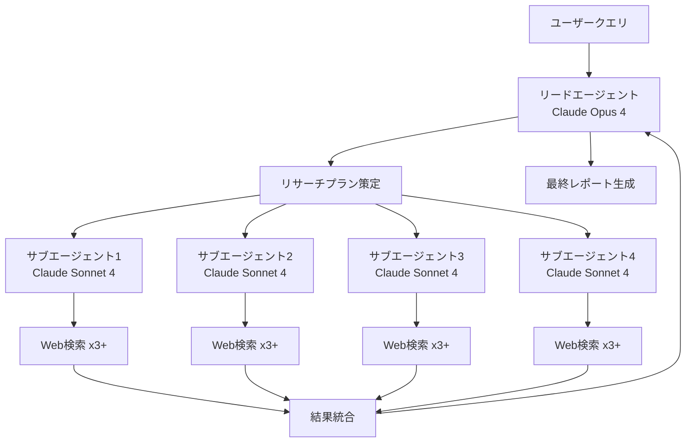
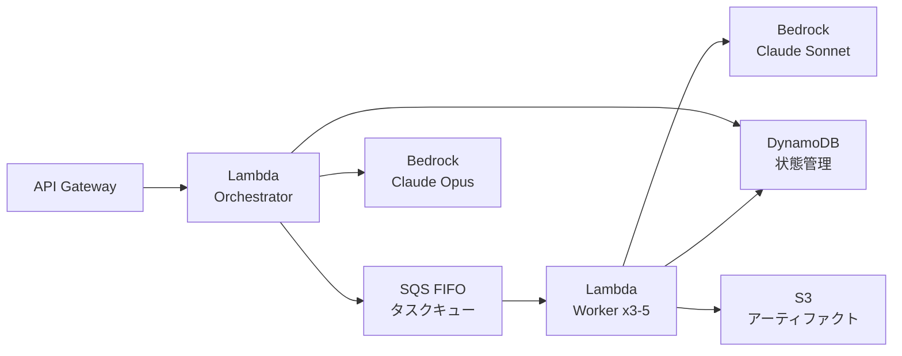
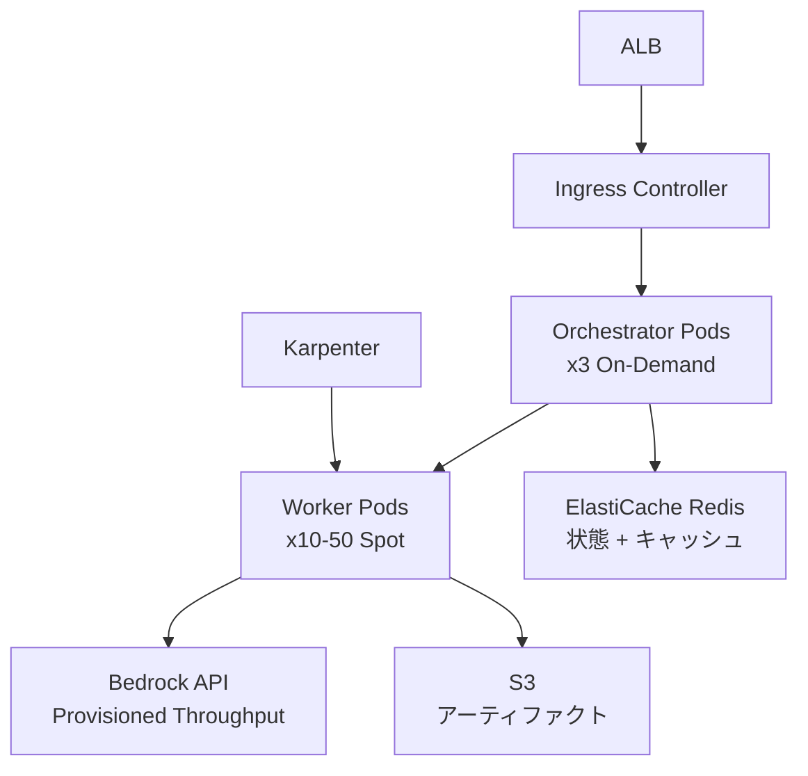

# Anthropicのマルチエージェントリサーチシステム設計解説

## ブログ概要

本記事は [https://www.anthropic.com/engineering/multi-agent-research-system](https://www.anthropic.com/engineering/multi-agent-research-system) の解説記事です。

Anthropicのエンジニアリングチーム（Jeremy Hadfield, Barry Zhang, Kenneth Lien, Florian Scholz, Jeremy Fox, Daniel Ford）が2025年6月に公開した本ブログ記事では、同社のマルチエージェントリサーチシステムの設計と構築プロセスが詳述されている。Orchestrator-Worker型アーキテクチャを採用し、リードエージェントが複数のサブエージェントを並列に制御する構成により、単一エージェントと比較して内部評価で90.2%の性能向上を達成したと報告されている。本解説では、同システムの設計原則、8つのプロンプトエンジニアリング手法、評価手法、本番環境での課題と解決策を技術的に整理する。

---

## 情報源

| 項目 | 内容 |
|------|------|
| タイトル | How we built our multi-agent research system |
| 著者 | Jeremy Hadfield, Barry Zhang, Kenneth Lien, Florian Scholz, Jeremy Fox, Daniel Ford |
| 組織 | Anthropic |
| 公開日 | 2025年6月13日 |
| URL | [https://www.anthropic.com/engineering/multi-agent-research-system](https://www.anthropic.com/engineering/multi-agent-research-system) |
| 種別 | エンジニアリングブログ |

---

## 技術的背景

### マルチエージェントシステムの動機

LLMを用いたリサーチタスクでは、単一エージェントに全検索・分析・統合を任せると、コンテキストウィンドウの圧迫、探索範囲の制約、エラー伝播といった問題が生じる。ブログ記事によると、単一エージェントはチャットの約4倍のトークンを消費するが、マルチエージェントでは約15倍に達する。しかし、トークン使用量がブラウジング性能の分散の80%を説明するという知見から、計算資源の投入が性能に直結することが示されている。

著者らは、モデルのアップグレード（Claude Sonnet 4への移行）がトークン予算を倍増させるよりも大きなゲインをもたらすと報告しており、モデル品質とトークン量の両面からのアプローチが重要であることを示唆している。

### Orchestrator-Workerパターンの選択

分散システムの設計パターンとして、ピアツーピア型、階層型、パイプライン型など複数の選択肢がある中で、著者らはOrchestrator-Worker（リーダー-フォロワー）パターンを採用した。これは、リサーチタスクが本質的に「分割→並列探索→統合」という構造を持つためであり、リードエージェントがタスク分解と結果統合の責務を負い、サブエージェントが独立した探索を実行する。

---

## 実装アーキテクチャ

### 全体構成



### リードエージェントの役割

リードエージェント（Claude Opus 4）は以下の責務を担う:

1. **クエリ分析**: ユーザーの質問を解析し、必要な調査範囲を特定
2. **リサーチプラン策定**: Extended Thinkingモードを用いて調査計画を立案
3. **サブエージェント生成**: タスクの複雑さに応じて3-5のサブエージェントを並列生成
4. **結果統合**: 各サブエージェントからの報告を集約し、矛盾検出・品質評価を実施
5. **最終レポート生成**: 引用付きの構造化レポートを出力

### サブエージェントの設計

サブエージェント（Claude Sonnet 4）は「インテリジェントフィルター」として機能する。各サブエージェントは:

- 独立したコンテキストウィンドウで動作
- 3つ以上のツールを同時に呼び出す（Parallel Tool Calling）
- Interleaved Thinkingでツール結果を評価し、追加調査の要否を判断
- ファイルシステムへのアーティファクト出力（リードエージェントへのトークン転送を削減）

### 状態管理

200Kトークンのコンテキスト制限に対処するため、以下の戦略が採用されている:

- **チェックポイント**: リードエージェントがリサーチプランを外部メモリに永続化
- **フェーズ要約**: 完了したフェーズを要約し、必要な情報のみ保持
- **クリーンコンテキスト生成**: 新規サブエージェントにはハンドオフ情報のみを渡す

---

## Production Deployment Guide

ブログ記事で報告されたマルチエージェントアーキテクチャをAWS上にデプロイする場合の構成を、トラフィック量別に示す。

### トラフィック量別AWS構成

| 構成 | 月間リクエスト | 同時実行数 | 月額コスト目安 | 主要サービス |
|------|--------------|-----------|--------------|-------------|
| Small | ~1,000 | 1-3 | $50-150 | Lambda + Bedrock + SQS + DynamoDB |
| Medium | ~10,000 | 5-20 | $300-800 | ECS Fargate + Bedrock + ElastiCache |
| Large | ~100,000+ | 50-200 | $2,000-5,000 | EKS + Karpenter + Spot Instances |

### Small構成: Lambda + Bedrock + SQS + DynamoDB

サーバーレス構成で、低トラフィック時のコスト効率に優れる。



**コスト内訳（2026年6月 東京リージョン概算）**:

| サービス | 単価 | 月間使用量 | 月額 |
|---------|------|-----------|------|
| Lambda (Orchestrator) | $0.0000166/GB-s | 1,000回 x 60s x 1GB | ~$1.0 |
| Lambda (Worker) | $0.0000166/GB-s | 4,000回 x 30s x 512MB | ~$1.0 |
| Bedrock Opus 4 Input | $15/1M tokens | 500K tokens x 1,000 | ~$7.5 |
| Bedrock Opus 4 Output | $75/1M tokens | 200K tokens x 1,000 | ~$15.0 |
| Bedrock Sonnet 4 Input | $3/1M tokens | 2M tokens x 1,000 | ~$6.0 |
| Bedrock Sonnet 4 Output | $15/1M tokens | 800K tokens x 1,000 | ~$12.0 |
| SQS FIFO | $0.00050/リクエスト | 20,000リクエスト | ~$10.0 |
| DynamoDB (On-Demand) | $1.25/100万WCU | 5,000 WCU | ~$6.25 |
| API Gateway | $4.25/100万リクエスト | 1,000リクエスト | ~$0.01 |
| **合計** | | | **~$59** |

#### Terraform: Small構成

```hcl
# main.tf - Small構成 (Lambda + Bedrock + SQS + DynamoDB)

terraform {
  required_version = ">= 1.5"
  required_providers {
    aws = {
      source  = "hashicorp/aws"
      version = "~> 5.50"
    }
  }
}

provider "aws" {
  region = "ap-northeast-1"
}

# --- DynamoDB: 状態管理テーブル ---
resource "aws_dynamodb_table" "agent_state" {
  name         = "multi-agent-state"
  billing_mode = "PAY_PER_REQUEST"
  hash_key     = "session_id"
  range_key    = "checkpoint_id"

  attribute {
    name = "session_id"
    type = "S"
  }

  attribute {
    name = "checkpoint_id"
    type = "S"
  }

  ttl {
    attribute_name = "expires_at"
    enabled        = true
  }

  point_in_time_recovery {
    enabled = true
  }

  tags = {
    Project = "multi-agent-research"
    Tier    = "small"
  }
}

# --- SQS FIFO: タスクキュー ---
resource "aws_sqs_queue" "task_queue" {
  name                        = "agent-tasks.fifo"
  fifo_queue                  = true
  content_based_deduplication = true
  visibility_timeout_seconds  = 300
  message_retention_seconds   = 86400
  receive_wait_time_seconds   = 20

  redrive_policy = jsonencode({
    deadLetterTargetArn = aws_sqs_queue.dlq.arn
    maxReceiveCount     = 3
  })
}

resource "aws_sqs_queue" "dlq" {
  name                       = "agent-tasks-dlq.fifo"
  fifo_queue                 = true
  message_retention_seconds  = 1209600
}

# --- IAM: Lambda実行ロール ---
resource "aws_iam_role" "lambda_orchestrator" {
  name = "multi-agent-orchestrator-role"

  assume_role_policy = jsonencode({
    Version = "2012-10-17"
    Statement = [{
      Action = "sts:AssumeRole"
      Effect = "Allow"
      Principal = { Service = "lambda.amazonaws.com" }
    }]
  })
}

resource "aws_iam_role_policy" "orchestrator_policy" {
  name = "orchestrator-permissions"
  role = aws_iam_role.lambda_orchestrator.id

  policy = jsonencode({
    Version = "2012-10-17"
    Statement = [
      {
        Effect = "Allow"
        Action = [
          "bedrock:InvokeModel",
          "bedrock:InvokeModelWithResponseStream"
        ]
        Resource = [
          "arn:aws:bedrock:ap-northeast-1::foundation-model/anthropic.claude-opus-4-*",
          "arn:aws:bedrock:ap-northeast-1::foundation-model/anthropic.claude-sonnet-4-*"
        ]
      },
      {
        Effect   = "Allow"
        Action   = ["sqs:SendMessage", "sqs:ReceiveMessage", "sqs:DeleteMessage"]
        Resource = aws_sqs_queue.task_queue.arn
      },
      {
        Effect   = "Allow"
        Action   = ["dynamodb:PutItem", "dynamodb:GetItem", "dynamodb:UpdateItem", "dynamodb:Query"]
        Resource = aws_dynamodb_table.agent_state.arn
      },
      {
        Effect   = "Allow"
        Action   = ["logs:CreateLogGroup", "logs:CreateLogStream", "logs:PutLogEvents"]
        Resource = "arn:aws:logs:ap-northeast-1:*:*"
      }
    ]
  })
}

# --- Lambda: Orchestrator ---
resource "aws_lambda_function" "orchestrator" {
  function_name = "multi-agent-orchestrator"
  role          = aws_iam_role.lambda_orchestrator.arn
  handler       = "orchestrator.handler"
  runtime       = "python3.12"
  timeout       = 900
  memory_size   = 1024

  filename         = "dist/orchestrator.zip"
  source_code_hash = filebase64sha256("dist/orchestrator.zip")

  environment {
    variables = {
      STATE_TABLE    = aws_dynamodb_table.agent_state.name
      TASK_QUEUE_URL = aws_sqs_queue.task_queue.url
      LEAD_MODEL     = "anthropic.claude-opus-4-20250514"
      WORKER_MODEL   = "anthropic.claude-sonnet-4-20250514"
      MAX_SUBAGENTS  = "5"
    }
  }

  tracing_config {
    mode = "Active"
  }
}

# --- Lambda: Worker ---
resource "aws_lambda_function" "worker" {
  function_name = "multi-agent-worker"
  role          = aws_iam_role.lambda_orchestrator.arn
  handler       = "worker.handler"
  runtime       = "python3.12"
  timeout       = 300
  memory_size   = 512

  filename         = "dist/worker.zip"
  source_code_hash = filebase64sha256("dist/worker.zip")

  environment {
    variables = {
      STATE_TABLE  = aws_dynamodb_table.agent_state.name
      WORKER_MODEL = "anthropic.claude-sonnet-4-20250514"
      MAX_TOOLS    = "5"
    }
  }

  tracing_config {
    mode = "Active"
  }
}

# --- SQS -> Lambda Worker トリガー ---
resource "aws_lambda_event_source_mapping" "worker_trigger" {
  event_source_arn = aws_sqs_queue.task_queue.arn
  function_name    = aws_lambda_function.worker.arn
  batch_size       = 1
  enabled          = true
}

# --- API Gateway ---
resource "aws_apigatewayv2_api" "research_api" {
  name          = "multi-agent-research-api"
  protocol_type = "HTTP"
}

resource "aws_apigatewayv2_integration" "orchestrator_integration" {
  api_id                 = aws_apigatewayv2_api.research_api.id
  integration_type       = "AWS_PROXY"
  integration_uri        = aws_lambda_function.orchestrator.invoke_arn
  payload_format_version = "2.0"
}

resource "aws_apigatewayv2_route" "research_route" {
  api_id    = aws_apigatewayv2_api.research_api.id
  route_key = "POST /research"
  target    = "integrations/${aws_apigatewayv2_integration.orchestrator_integration.id}"
}

resource "aws_apigatewayv2_stage" "default" {
  api_id      = aws_apigatewayv2_api.research_api.id
  name        = "$default"
  auto_deploy = true
}
```

### Large構成: EKS + Karpenter + Spot Instances

高スループットかつコスト最適化が求められる本番環境向け。



#### Terraform: Large構成

```hcl
# main.tf - Large構成 (EKS + Karpenter + Spot)

terraform {
  required_version = ">= 1.5"
  required_providers {
    aws = {
      source  = "hashicorp/aws"
      version = "~> 5.50"
    }
    helm = {
      source  = "hashicorp/helm"
      version = "~> 2.13"
    }
    kubectl = {
      source  = "gavinbunney/kubectl"
      version = "~> 1.14"
    }
  }
}

provider "aws" {
  region = "ap-northeast-1"
}

# --- VPC ---
module "vpc" {
  source  = "terraform-aws-modules/vpc/aws"
  version = "5.8.1"

  name = "multi-agent-vpc"
  cidr = "10.0.0.0/16"

  azs             = ["ap-northeast-1a", "ap-northeast-1c", "ap-northeast-1d"]
  private_subnets = ["10.0.1.0/24", "10.0.2.0/24", "10.0.3.0/24"]
  public_subnets  = ["10.0.101.0/24", "10.0.102.0/24", "10.0.103.0/24"]

  enable_nat_gateway   = true
  single_nat_gateway   = false
  enable_dns_hostnames = true

  private_subnet_tags = {
    "karpenter.sh/discovery" = "multi-agent-eks"
  }
}

# --- EKS Cluster ---
module "eks" {
  source  = "terraform-aws-modules/eks/aws"
  version = "20.11"

  cluster_name    = "multi-agent-eks"
  cluster_version = "1.30"

  vpc_id     = module.vpc.vpc_id
  subnet_ids = module.vpc.private_subnets

  cluster_endpoint_public_access = true

  eks_managed_node_groups = {
    # Orchestrator: 安定性重視のOn-Demand
    orchestrator = {
      instance_types = ["m7i.xlarge"]
      capacity_type  = "ON_DEMAND"
      min_size       = 2
      max_size       = 5
      desired_size   = 3

      labels = {
        role = "orchestrator"
      }

      taints = [{
        key    = "role"
        value  = "orchestrator"
        effect = "NO_SCHEDULE"
      }]
    }
  }

  tags = {
    "karpenter.sh/discovery" = "multi-agent-eks"
  }
}

# --- Karpenter: Worker用Spot Auto-scaling ---
resource "helm_release" "karpenter" {
  name       = "karpenter"
  repository = "oci://public.ecr.aws/karpenter"
  chart      = "karpenter"
  version    = "0.37.0"
  namespace  = "kube-system"

  set {
    name  = "settings.clusterName"
    value = module.eks.cluster_name
  }

  set {
    name  = "settings.interruptionQueue"
    value = aws_sqs_queue.karpenter_interruption.name
  }
}

resource "aws_sqs_queue" "karpenter_interruption" {
  name                       = "karpenter-interruption"
  message_retention_seconds  = 300
  sqs_managed_sse_enabled    = true
}

# --- Karpenter NodePool: Worker (Spot) ---
resource "kubectl_manifest" "worker_nodepool" {
  yaml_body = <<-YAML
    apiVersion: karpenter.sh/v1beta1
    kind: NodePool
    metadata:
      name: worker-spot
    spec:
      template:
        metadata:
          labels:
            role: worker
        spec:
          requirements:
            - key: karpenter.sh/capacity-type
              operator: In
              values: ["spot"]
            - key: node.kubernetes.io/instance-type
              operator: In
              values: ["m7i.large", "m7i.xlarge", "m6i.large", "m6i.xlarge", "c7i.large", "c7i.xlarge"]
          nodeClassRef:
            apiVersion: karpenter.k8s.aws/v1beta1
            kind: EC2NodeClass
            name: default
      limits:
        cpu: "200"
        memory: "400Gi"
      disruption:
        consolidationPolicy: WhenUnderutilized
        expireAfter: 24h
  YAML
}

# --- ElastiCache Redis: 状態管理 + レスポンスキャッシュ ---
resource "aws_elasticache_replication_group" "agent_cache" {
  replication_group_id       = "multi-agent-cache"
  description                = "State management and response cache"
  node_type                  = "cache.r7g.large"
  num_cache_clusters         = 2
  port                       = 6379
  subnet_group_name          = aws_elasticache_subnet_group.agent.name
  security_group_ids         = [aws_security_group.redis.id]
  at_rest_encryption_enabled = true
  transit_encryption_enabled = true
  automatic_failover_enabled = true

  parameter_group_name = "default.redis7"
}

resource "aws_elasticache_subnet_group" "agent" {
  name       = "multi-agent-subnet-group"
  subnet_ids = module.vpc.private_subnets
}

resource "aws_security_group" "redis" {
  name   = "multi-agent-redis-sg"
  vpc_id = module.vpc.vpc_id

  ingress {
    from_port       = 6379
    to_port         = 6379
    protocol        = "tcp"
    security_groups = [module.eks.cluster_security_group_id]
  }
}

# --- S3: アーティファクトストレージ ---
resource "aws_s3_bucket" "artifacts" {
  bucket = "multi-agent-research-artifacts-${data.aws_caller_identity.current.account_id}"
}

resource "aws_s3_bucket_lifecycle_configuration" "artifacts_lifecycle" {
  bucket = aws_s3_bucket.artifacts.id

  rule {
    id     = "expire-old-artifacts"
    status = "Enabled"

    transition {
      days          = 30
      storage_class = "STANDARD_IA"
    }

    expiration {
      days = 90
    }
  }
}

data "aws_caller_identity" "current" {}

# --- Outputs ---
output "eks_cluster_endpoint" {
  value = module.eks.cluster_endpoint
}

output "redis_endpoint" {
  value = aws_elasticache_replication_group.agent_cache.primary_endpoint_address
}
```

### 監視: CloudWatch + X-Ray

#### CloudWatch Logs Insights クエリ

```
# エージェント実行の成功率
fields @timestamp, session_id, status
| filter event = "agent_execution_complete"
| stats count(*) as total,
        sum(case when status = "success" then 1 else 0 end) as success,
        sum(case when status = "error" then 1 else 0 end) as errors
  by bin(1h)

# トークン使用量の異常検知
fields @timestamp, session_id, total_tokens
| filter event = "bedrock_invocation"
| stats avg(total_tokens) as avg_tokens,
        max(total_tokens) as max_tokens,
        percentile(total_tokens, 95) as p95_tokens
  by bin(5m)
| filter max_tokens > 4 * avg_tokens

# サブエージェント応答時間分布
fields @timestamp, subagent_id, duration_ms
| filter event = "subagent_complete"
| stats avg(duration_ms) as avg_ms,
        percentile(duration_ms, 50) as p50,
        percentile(duration_ms, 95) as p95,
        percentile(duration_ms, 99) as p99
  by bin(15m)
```

#### CloudWatch アラーム設定

```hcl
# cloudwatch.tf

resource "aws_cloudwatch_metric_alarm" "error_rate" {
  alarm_name          = "multi-agent-error-rate-high"
  comparison_operator = "GreaterThanThreshold"
  evaluation_periods  = 2
  metric_name         = "Errors"
  namespace           = "MultiAgentResearch"
  period              = 300
  statistic           = "Sum"
  threshold           = 10
  alarm_description   = "Agent error rate exceeds threshold"
  alarm_actions       = [aws_sns_topic.alerts.arn]

  dimensions = {
    Environment = "production"
  }
}

resource "aws_cloudwatch_metric_alarm" "token_budget_exceeded" {
  alarm_name          = "multi-agent-token-budget-exceeded"
  comparison_operator = "GreaterThanThreshold"
  evaluation_periods  = 1
  metric_name         = "TokensConsumed"
  namespace           = "MultiAgentResearch"
  period              = 3600
  statistic           = "Sum"
  threshold           = 50000000
  alarm_description   = "Hourly token consumption exceeds 50M"
  alarm_actions       = [aws_sns_topic.alerts.arn]

  dimensions = {
    Environment = "production"
  }
}

resource "aws_cloudwatch_metric_alarm" "latency_p99" {
  alarm_name          = "multi-agent-latency-p99-high"
  comparison_operator = "GreaterThanThreshold"
  evaluation_periods  = 3
  metric_name         = "Duration"
  namespace           = "MultiAgentResearch"
  period              = 300
  extended_statistic  = "p99"
  threshold           = 120000
  alarm_description   = "P99 latency exceeds 2 minutes"
  alarm_actions       = [aws_sns_topic.alerts.arn]

  dimensions = {
    FunctionName = "multi-agent-orchestrator"
  }
}

resource "aws_sns_topic" "alerts" {
  name = "multi-agent-alerts"
}
```

#### X-Ray トレーシング設定

```python
# tracing.py - X-Ray instrumentation for multi-agent system

import json
import time
from aws_xray_sdk.core import xray_recorder, patch_all
from aws_xray_sdk.core.models.subsegment import Subsegment

patch_all()

xray_recorder.configure(
    sampling=True,
    context_missing="LOG_ERROR",
    plugins=("EC2Plugin", "ECSPlugin"),
    daemon_address="127.0.0.1:2000",
)


class AgentTracer:
    """X-Ray tracing wrapper for multi-agent orchestration."""

    def __init__(self, session_id: str):
        self.session_id = session_id

    def trace_orchestrator(self, query: str):
        """Create parent segment for orchestrator execution."""
        segment = xray_recorder.begin_segment("orchestrator")
        segment.put_annotation("session_id", self.session_id)
        segment.put_annotation("query_length", len(query))
        segment.put_metadata("query", query[:500])
        return segment

    def trace_subagent(self, subagent_id: str, task: str) -> Subsegment:
        """Create subsegment for each subagent execution."""
        subsegment = xray_recorder.begin_subsegment(f"subagent-{subagent_id}")
        subsegment.put_annotation("subagent_id", subagent_id)
        subsegment.put_annotation("task_type", task[:100])
        return subsegment

    def trace_bedrock_call(
        self, model_id: str, input_tokens: int, output_tokens: int
    ) -> Subsegment:
        """Trace individual Bedrock API calls."""
        subsegment = xray_recorder.begin_subsegment("bedrock-invoke")
        subsegment.put_annotation("model_id", model_id)
        subsegment.put_metadata(
            "tokens", {"input": input_tokens, "output": output_tokens}
        )
        return subsegment

    def trace_tool_call(self, tool_name: str, params: dict) -> Subsegment:
        """Trace tool invocations within subagents."""
        subsegment = xray_recorder.begin_subsegment(f"tool-{tool_name}")
        subsegment.put_annotation("tool_name", tool_name)
        subsegment.put_metadata("params", json.dumps(params)[:1000])
        return subsegment

    def record_error(self, error: Exception, context: str):
        """Record errors with context for debugging."""
        subsegment = xray_recorder.current_subsegment()
        if subsegment:
            subsegment.add_exception(error, stack=True)
            subsegment.put_metadata("error_context", context)

    def end_session(self, status: str, total_tokens: int):
        """Close the orchestrator segment with final metrics."""
        segment = xray_recorder.current_segment()
        if segment:
            segment.put_annotation("status", status)
            segment.put_annotation("total_tokens", total_tokens)
            xray_recorder.end_segment()
```

### コスト最適化チェックリスト

以下は、マルチエージェントシステムの本番運用におけるコスト最適化の観点を網羅したチェックリストである。

| # | カテゴリ | チェック項目 | 期待効果 |
|---|---------|------------|---------|
| 1 | モデル選択 | リードのみOpus、サブエージェントはSonnet使用 | トークンコスト60-70%削減 |
| 2 | モデル選択 | 単純クエリはHaikuにフォールバック | 低複雑度タスクで90%削減 |
| 3 | トークン | プロンプトキャッシュ有効化（Bedrock） | 繰り返しプロンプト50%削減 |
| 4 | トークン | サブエージェント出力をファイルシステム経由にする | コンテキスト転送トークン削減 |
| 5 | トークン | Extended Thinking予算に上限設定 | 過剰推論の防止 |
| 6 | トークン | 完了フェーズの要約で古いコンテキスト圧縮 | 長期セッションのトークン抑制 |
| 7 | コンピュート | Worker Podに Spot Instances使用 | On-Demand比60-80%削減 |
| 8 | コンピュート | Karpenterで未使用ノードの自動統合 | アイドルリソース費用排除 |
| 9 | コンピュート | Lambda同時実行数の上限設定 | 暴走時のコスト上限確保 |
| 10 | コンピュート | Fargate Spot（Medium構成） | Fargate On-Demand比70%削減 |
| 11 | ストレージ | DynamoDB TTLで古いセッション自動削除 | ストレージ肥大化防止 |
| 12 | ストレージ | S3ライフサイクルで30日後IA、90日後削除 | 長期保存コスト削減 |
| 13 | ストレージ | ElastiCacheのメモリポリシー（allkeys-lru） | キャッシュ溢れ防止 |
| 14 | ネットワーク | VPC Endpointで Bedrock/S3/DynamoDB接続 | NAT Gateway通信費削減 |
| 15 | ネットワーク | リージョン内通信に閉じる設計 | クロスリージョン転送費ゼロ |
| 16 | 監視 | CloudWatch Logs保持期間を30日に設定 | ログストレージ費用削減 |
| 17 | 監視 | X-Rayサンプリングレート調整（本番5%） | トレーシング費用適正化 |
| 18 | スケーリング | 複雑度ベースのエージェント数動的制御 | 過剰サブエージェント生成防止 |
| 19 | スケーリング | キュー深度ベースのWorkerスケールイン/アウト | 需要追従でアイドル削減 |
| 20 | スケーリング | 営業時間外のスケールダウンスケジュール | 夜間・休日のコスト削減 |
| 21 | API管理 | Bedrock Provisioned Throughput（Large構成） | 高負荷時の単価低減 |
| 22 | API管理 | レスポンスキャッシュ（Redis TTL 1時間） | 同一クエリの再呼び出し削減 |
| 23 | API管理 | リトライ時の指数バックオフ + ジッタ | スロットリングによる無駄呼び出し防止 |
| 24 | 予算管理 | AWS Budgets + セッション単位のトークン上限 | 予算超過の早期検知 |
| 25 | 予算管理 | Cost Anomaly Detectionの有効化 | 異常支出の自動アラート |

---

## パフォーマンス最適化

### 並列実行の効果

ブログ記事によると、Parallel Tool Callingの導入により複雑なクエリの調査時間を最大90%短縮したと報告されている。この並列化は2つのレベルで実現される:

1. **サブエージェントレベル**: リードエージェントが3-5のサブエージェントを同時に生成・実行
2. **ツールレベル**: 各サブエージェントが3つ以上のツール（Web検索等）を同時に呼び出し

### Effort Scalingによる最適化

著者らは、クエリの複雑さに応じてリソース投入量を動的に制御するEffort Scalingルールを提唱している:

| 複雑度 | サブエージェント数 | ツール呼び出し回数 | 想定トークン |
|--------|------------------|------------------|------------|
| シンプル（事実確認） | 0-1 | 3-10 | ~10K |
| 比較・分析 | 2-4 | 各5-15 | ~50K |
| 複雑リサーチ | 5-10+ | 各10-20 | ~200K |

### モデル品質 vs トークン量のトレードオフ

著者らの知見として、モデルのアップグレード（例: Sonnet 3.7からSonnet 4）は、同じモデルでトークン予算を倍増させるよりも大きな性能向上をもたらすと報告されている。これは、モデルの判断品質が検索クエリの質やツール選択の適切さに直結するためと考えられる。

---

## 運用での学び

### 状態管理の課題

著者らは、長時間実行されるマルチエージェントシステムにおいて、軽微なシステム障害が重大な問題に発展する（エラーの複合化）ことを報告している。具体的には:

- **非決定的動作**: 同一入力でも実行ごとに異なる結果が生じ、デバッグが困難
- **状態の永続化**: 200Kトークン到達前にリサーチプランを外部メモリに保存する必要性
- **レジューム可能な実行**: 障害発生時に全体をやり直すのではなく、チェックポイントから復旧する設計

### デプロイメント戦略

本番環境では**レインボーデプロイメント**（旧バージョンと新バージョンを同時稼働させ、トラフィックを段階的に移行）が採用されている。これは、実行中のエージェントセッションを中断させずにシステム更新を行うためである。

### 評価の実践

著者らは、20のテストクエリから評価を開始し、LLM-as-Judge（0.0-1.0スコア）で自動評価を行った後、人間評価でハルシネーションやSEOコンテンツファームへのバイアスを検出するアプローチを採用している。開発初期は変更の影響が大きく（30%から80%への改善がわずかなテストケースで可視化できる）、少数のテストで十分としている。

---

## 学術研究との関連

本ブログ記事で報告されたOrchestrator-Worker型マルチエージェントアーキテクチャは、以下の学術研究の流れを実システムに適用したものと位置づけられる:

- **LLMエージェントのツール使用**: Schick et al. (2023) "Toolformer"に始まるLLMのツール利用研究の発展系
- **マルチエージェント協調**: Park et al. (2023) "Generative Agents"で示された複数エージェント間の協調パターン
- **LLM-as-Judge**: Zheng et al. (2023) "Judging LLM-as-a-Judge"の評価手法の実用化
- **プロンプトエンジニアリング**: Wei et al. (2022) "Chain-of-Thought"の発展としてのExtended Thinking活用

特に、Self-Improvement（エージェント自身がプロンプト改善を提案する）機能は、従来の人手によるプロンプト最適化を超える自動化の方向性を示しており、タスク完了時間の40%削減という具体的成果が報告されている。

---

## まとめと実践への示唆

Anthropicのマルチエージェントリサーチシステムは、Orchestrator-Workerパターンによる並列探索、8つのプロンプトエンジニアリング原則、LLM-as-Judgeによる評価、レインボーデプロイメントによる安全な更新という4つの柱で構成されている。実践者にとっての主要な示唆は以下の通りである:

1. **モデル品質優先**: トークン量を増やすよりモデルをアップグレードする方が効果的
2. **Effort Scaling**: クエリ複雑度に応じたリソース動的制御でコスト効率を確保
3. **外部状態管理**: コンテキスト上限に達する前にチェックポイントを永続化
4. **段階的評価**: 20テストケースから開始し、人間評価でエッジケースを補完

---

## 参考文献

1. Hadfield, J., Zhang, B., Lien, K., Scholz, F., Fox, J., & Ford, D. (2025). "How we built our multi-agent research system." Anthropic Engineering Blog. [https://www.anthropic.com/engineering/multi-agent-research-system](https://www.anthropic.com/engineering/multi-agent-research-system)
2. Schick, T., et al. (2023). "Toolformer: Language Models Can Teach Themselves to Use Tools." arXiv:2302.04761.
3. Park, J. S., et al. (2023). "Generative Agents: Interactive Simulacra of Human Behavior." arXiv:2304.03442.
4. Zheng, L., et al. (2023). "Judging LLM-as-a-Judge with MT-Bench and Chatbot Arena." arXiv:2306.05685.
5. Wei, J., et al. (2022). "Chain-of-Thought Prompting Elicits Reasoning in Large Language Models." NeurIPS 2022.

---

*本記事はAIによって生成されました。内容の正確性については情報源の原文を参照してください。*
