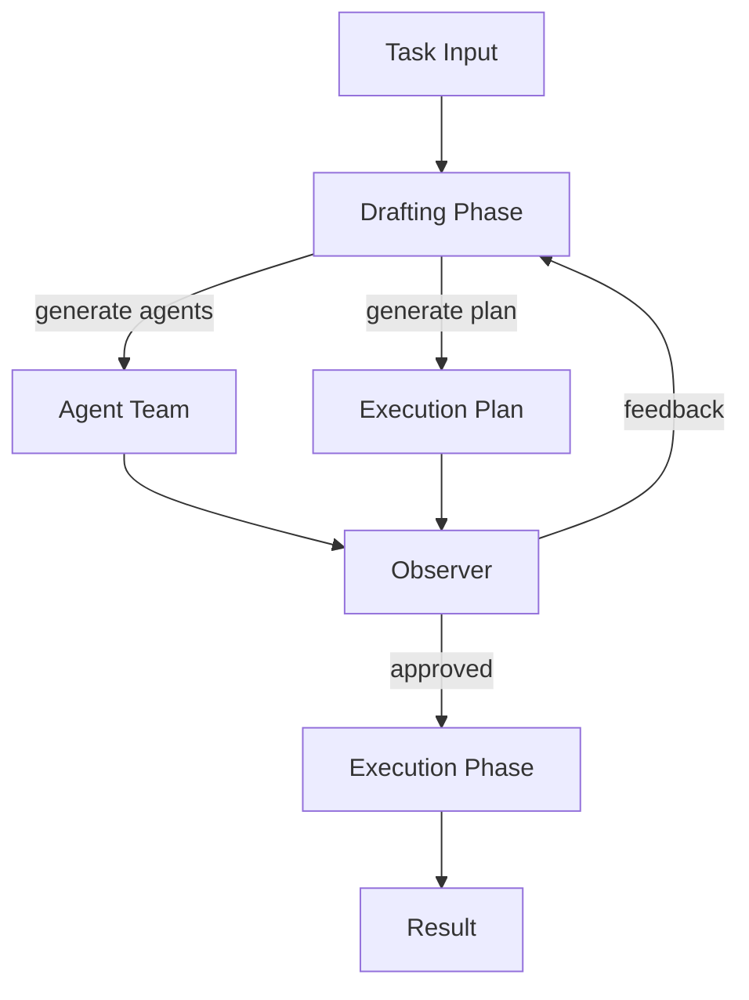
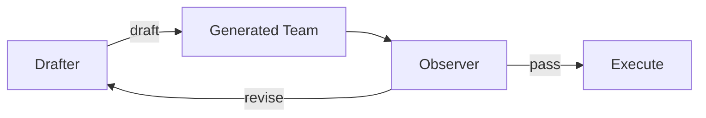

## 論文概要（Abstract）

本記事は [arXiv:2309.17288「AutoAgents: A Framework for Automatic Agent Generation」](https://arxiv.org/abs/2309.17288)（IJCAI 2024採択）の解説記事です。

著者ら（Guangyao Chen, Siwei Dong, Yu Shu, Ge Zhang, Jaward Sesay, Börje F. Karlsson, Jie Fu, Yemin Shi）は、LLMベースのマルチエージェントシステムにおいて、**タスクの内容に応じてエージェントチームを動的に生成する**フレームワーク「AutoAgents」を提案しています。

従来のフレームワーク（ChatDev、MetaGPTなど）は事前に定義された固定のエージェント構成を使用しますが、AutoAgentsでは**Drafterエージェント**がタスクを分析してチーム構成を生成し、**Observerエージェント**が生成されたチームの品質をフィードバックする2段階の設計を採用しています。これにより、ソフトウェア開発タスクではプログラマーとテスターを、創作タスクではライターと編集者を自動的に生成するといった適応的な動作が可能になります。

この記事は [Zenn記事: LangGraph v1.2でステートマシン設計――5つの分岐パターンと本番運用](https://zenn.dev/0h_n0/articles/fa2c321db68933) の深掘りです。

## 情報源

- **会議名**: IJCAI 2024（International Joint Conference on Artificial Intelligence）
- **年**: 2024
- **URL**: [https://arxiv.org/abs/2309.17288](https://arxiv.org/abs/2309.17288)
- **著者**: Guangyao Chen, Siwei Dong, Yu Shu, Ge Zhang, Jaward Sesay, Börje F. Karlsson, Jie Fu, Yemin Shi
- **コード**: [https://github.com/Link-AGI/AutoAgents](https://github.com/Link-AGI/AutoAgents)

## カンファレンス情報

**IJCAI（International Joint Conference on Artificial Intelligence）について**:
IJCAIは人工知能分野で最も歴史のある国際会議の1つで、1969年に初回が開催されました。2024年の採択率は約15%程度であり、厳しい査読プロセスを経た論文です。

## 技術的詳細（Technical Details）

### AutoAgentsの全体アーキテクチャ

AutoAgentsは大きく2つのフェーズで構成されます。



**Phase 1: Drafting（チーム構成生成）**

DrafterがタスクをAnalysisして、必要なエージェントの役割・能力・実行計画を生成します。Observerが生成結果を評価し、不足している役割の追加や冗長なエージェントの削除をフィードバックします。このDrafter-Observerのやりとりは複数ラウンド繰り返されます。

**Phase 2: Execution（タスク実行）**

Draftingフェーズで生成されたエージェントチームが実行計画に従ってタスクを実行します。各エージェントは自身の役割に特化したプロンプトで動作します。

### Drafterの設計

Drafterは以下の3つの出力を生成します。

1. **Expert Agents**: 各エージェントの名前、役割説明、使用するプロンプトテンプレート
2. **Execution Plan**: エージェントの実行順序とタスク分割
3. **Dependencies**: エージェント間の依存関係グラフ

```python
class AgentSpec:
    """Drafterが生成するエージェント仕様"""
    name: str
    role: str
    description: str
    prompt_template: str
    tools: list[str]
    dependencies: list[str]

class DraftResult:
    """Drafterの出力"""
    agents: list[AgentSpec]
    execution_plan: list[str]
    task_decomposition: dict[str, str]
```

著者らは、Drafterの生成品質を以下の3つの基準で評価しています（論文Section 4.2より）。

- **Completeness（完全性）**: タスクに必要な全ての役割がカバーされているか
- **Non-redundancy（非冗長性）**: 同じ機能を持つ重複エージェントがないか
- **Coherence（一貫性）**: エージェント間の依存関係が矛盾していないか

### Observer機構

Observer機構はAutoAgentsの設計の重要な貢献です。著者らは、LLMが一度の生成で完璧なチーム構成を出力することは困難であると指摘し、生成結果を評価・改善するフィードバックループを導入しています。



Observerは以下の観点でチーム構成をレビューします。

1. **役割の網羅性**: タスクに必要な専門知識がチームにカバーされているか
2. **計画の実行可能性**: 生成された実行計画が論理的に矛盾していないか
3. **エージェント数の妥当性**: 過剰なエージェントや不足しているエージェントがないか

この機構は、LangGraphのパターン2（リトライループ）と概念的に一致します。Observerがリトライ条件の判定を行い、品質基準を満たすまでDraftingを繰り返す構造です。

### LangGraphとの対応関係

AutoAgentsのアーキテクチャは、LangGraphの複数パターンを組み合わせた設計として表現できます。

| AutoAgents要素 | LangGraphパターン | 対応関係 |
|---------------|------------------|----------|
| Drafter | Node | エージェント仕様を生成するノード |
| Observer | 条件分岐（パターン1） + リトライループ（パターン2） | 品質判定 + フィードバック |
| Agent Team生成 | Send API（パターン3） | 動的に決まる並列タスク |
| 階層実行 | サブグラフ（パターン4） | 生成されたチームをサブグラフとして実行 |

LangGraphで概念的に再現する場合の擬似コードを示します。

```python
from typing import Annotated, Literal
from langgraph.graph import StateGraph, END
from langgraph.types import Send
from pydantic import BaseModel


class AutoAgentsState(BaseModel):
    task: str
    agent_specs: list[dict] = []
    execution_plan: list[str] = []
    observer_feedback: str = ""
    draft_round: int = 0
    max_rounds: int = 3
    results: Annotated[list[str], lambda a, b: a + b] = []


def drafter_node(state: AutoAgentsState) -> dict:
    """タスクに応じてエージェント構成を動的生成"""
    prompt = f"""
    タスク: {state.task}
    前回のフィードバック: {state.observer_feedback}
    必要なエージェントチームと実行計画を生成してください。
    """
    result = llm.invoke(prompt)
    return {
        "agent_specs": parse_agent_specs(result),
        "execution_plan": parse_plan(result),
        "draft_round": state.draft_round + 1,
    }


def observer_node(state: AutoAgentsState) -> dict:
    """生成されたチーム構成の品質を評価"""
    prompt = f"""
    タスク: {state.task}
    生成されたエージェント: {state.agent_specs}
    実行計画: {state.execution_plan}
    完全性・非冗長性・一貫性の観点で評価してください。
    """
    feedback = llm.invoke(prompt)
    return {"observer_feedback": feedback}


def observer_router(state: AutoAgentsState) -> Literal["drafter", "execute"]:
    """Observer判定: 再生成 or 実行開始"""
    if state.draft_round >= state.max_rounds:
        return "execute"
    if "approved" in state.observer_feedback.lower():
        return "execute"
    return "drafter"


def dispatch_agents(state: AutoAgentsState) -> list[Send]:
    """生成されたエージェント仕様に基づいて動的に並列タスクを生成"""
    return [
        Send("agent_executor", {"spec": spec, "task": state.task})
        for spec in state.agent_specs
    ]


graph = StateGraph(AutoAgentsState)
graph.add_node("drafter", drafter_node)
graph.add_node("observer", observer_node)
graph.add_node("agent_executor", agent_executor_node)
graph.set_entry_point("drafter")
graph.add_edge("drafter", "observer")
graph.add_conditional_edges("observer", observer_router)
graph.add_conditional_edges("execute", dispatch_agents)
```

この実装では以下のLangGraphパターンを組み合わせています。

- **パターン1（条件分岐）**: `observer_router`による再生成/実行の判定
- **パターン2（リトライループ）**: Observer → Drafter のフィードバックループ（`max_rounds`制約付き）
- **パターン3（Send API）**: `dispatch_agents`による動的エージェント並列実行

## 実験結果（Results）

著者らは、ソフトウェア開発タスク（HumanEval、MBPP）と創作タスク（Creative Writing）で評価を行っています。

**主要な結果**（論文Table 2/Table 3より）:

- **HumanEvalベンチマーク**: AutoAgentsは固定エージェント構成（ChatDev、MetaGPT）と比較して、Pass@1スコアが向上したと報告されています。著者らは動的チーム生成により、テストエージェントやデバッグエージェントが必要に応じて追加されることが改善の要因であると分析しています。

- **創作タスク**: 固定構成ではプログラマーやテスターが不要に呼び出されるのに対し、AutoAgentsではライターと編集者のみが生成され、効率的な処理が可能になったと報告されています。

- **Observer機構の効果**: Observer機構を除外したアブレーション実験（論文Table 4より）では、Observerなしの場合に冗長なエージェントが生成される頻度が増加し、実行効率が低下したと報告されています。

**エージェント数の動的変化**: タスクの複雑さに応じて生成されるエージェント数が自動的に調整されます。著者らは「simple coding tasks generated 2-3 agents while complex system design tasks generated 5-7 agents」と報告しています。

## 実運用への応用（Practical Applications）

AutoAgentsの設計パターンをLangGraphで実用化する際のポイントを整理します。

**1. Send APIによる動的チーム構成**:

Zenn記事のパターン3（Send API並列）は、AutoAgentsの動的エージェント生成と直接対応します。Send APIを使えば、実行時に決定されるエージェント数と種類に基づいて並列処理を開始できます。

**2. Observer機構のリトライパターン化**:

Observer機構はパターン2（リトライループ）として実装できます。`draft_round`カウンタで無限ループを防ぎつつ、品質基準を満たすまでフィードバックを繰り返す設計は、実務でもコード生成やドキュメント作成の品質保証に有用です。

**3. サブグラフによる階層実行**:

生成されたエージェントチームの実行は、パターン4（サブグラフ構成）として実装できます。Draftingフェーズが親グラフ、実行フェーズが子グラフ（サブグラフ）となる2層構造です。

**4. チェックポイントの活用**:

AutoAgentsのDraftingフェーズは複数ラウンドのやりとりを含むため、各ラウンドでチェックポイントを保存することで、障害時にDraftingの途中から再開できます。Zenn記事で紹介されている`PostgresSaver`がこの用途に適合します。

## 関連研究（Related Work）

- **ChatDev (Qian et al., 2023)**: 固定的なソフトウェア開発ワークフロー。AutoAgentsとの差分は、エージェント構成が静的か動的かの違い。
- **MetaGPT (Hong et al., 2023)**: 構造化された中間成果物（SRS、設計書）でエージェントを連携させるフレームワーク。エージェント構成は固定。
- **AgentVerse (Chen et al., 2023)**: 動的グループ構成の先行研究。AutoAgentsとの差分は、AgentVerseがエージェントの入れ替えを行うのに対し、AutoAgentsはゼロからチーム全体を生成する点。
- **DyLAN (Liu et al., 2024)**: 動的エージェント選択のフレームワーク。ヒューリスティクスベースでエージェントを選択するのに対し、AutoAgentsはLLMベースで生成する。

## まとめと今後の展望

IJCAI 2024に採択された本論文は、マルチエージェントLLMシステムのエージェント構成をタスクに応じて動的に生成する「AutoAgents」フレームワークを提案しています。

**主要な貢献**: Drafter-Observerの2段階設計により、タスクの複雑さに応じた適応的なエージェントチーム生成を実現。Observer機構が品質保証のフィードバックループとして機能する設計は、LangGraphのリトライパターンと直接対応します。

**LangGraphへの示唆**: AutoAgentsの動的チーム生成は、LangGraphのSend API（パターン3）で実装可能です。実行時にエージェント数と種類を決定し、並列処理を行う設計は、固定的なグラフ構成よりも柔軟性が高く、多様なタスクに適応できます。

**今後の方向**: 著者らのコードは [GitHub](https://github.com/Link-AGI/AutoAgents) で公開されており、LangGraphへの統合や、Observer機構の更なる高度化（自動評価指標の導入など）が今後の研究課題として挙げられます。

## 参考文献

- **arXiv URL**: [https://arxiv.org/abs/2309.17288](https://arxiv.org/abs/2309.17288)
- **Code**: [https://github.com/Link-AGI/AutoAgents](https://github.com/Link-AGI/AutoAgents)
- **Conference**: IJCAI 2024
- **Related Zenn article**: [LangGraph v1.2でステートマシン設計――5つの分岐パターンと本番運用](https://zenn.dev/0h_n0/articles/fa2c321db68933)
