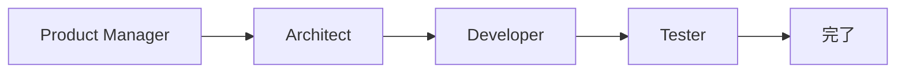
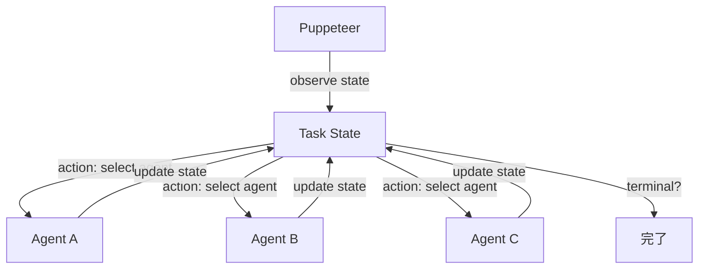

## 論文概要（Abstract）

本記事は [arXiv:2505.19591「Multi-Agent Collaboration via Evolving Orchestration」](https://arxiv.org/abs/2505.19591)（NeurIPS 2025採択）の解説記事です。

著者らは、マルチエージェントLLMシステムにおけるエージェント間の協調を**中央集権型オーケストレーター（「Puppeteer」）**が動的に制御する新たなパラダイムを提案しています。従来のマルチエージェントフレームワーク（ChatDevの固定ワークフロー、AutoGenの静的トポロジーなど）では、エージェント間のやりとりの順序や回数が事前に固定されていました。本論文では、オーケストレーターを強化学習（RL）で訓練し、タスクの進行状況に応じてエージェントの呼び出し順序・頻度・ループ構造を適応的に変化させることで、性能向上とコスト削減を同時に達成しています。

この記事は [Zenn記事: LangGraph v1.2でステートマシン設計――5つの分岐パターンと本番運用](https://zenn.dev/0h_n0/articles/fa2c321db68933) の深掘りです。

## 情報源

- **会議名**: NeurIPS 2025（Neural Information Processing Systems）
- **年**: 2025
- **URL**: [https://arxiv.org/abs/2505.19591](https://arxiv.org/abs/2505.19591)
- **著者**: Yufan Dang, Chen Qian, Xueheng Luo, Jingru Fan, Zihao Xie, Ruijie Shi, Weize Chen, Cheng Yang, Xiaoyin Che, Ye Tian, Xuantang Xiong, Lei Han, Zhiyuan Liu, Maosong Sun
- **発表形式**: Poster

## カンファレンス情報

**NeurIPS（Neural Information Processing Systems）について**:
NeurIPSは機械学習・人工知能分野の最高峰国際会議の1つです。2025年の採択率は約25%程度と推定され、厳しい査読プロセスを経て採択された論文です。本論文はChatDevチーム（清華大学）からの提出であり、マルチエージェントLLMシステムの実践的な研究として注目されています。

## 技術的詳細（Technical Details）

### Puppeteerパラダイムの設計

著者らが提案する「Puppeteer（人形遣い）」パラダイムは、マルチエージェントシステムのオーケストレーションを以下のように定式化しています。

**従来のアプローチ（固定ワークフロー）**:



エージェントの呼び出し順序は静的に定義され、タスクの複雑さや進行状況に応じた適応はありません。

**Puppeteerアプローチ（進化的オーケストレーション）**:



Puppeteerはタスクの現在の状態を観測し、次に呼び出すエージェントを動的に決定します。この決定は強化学習によって最適化されます。

### 強化学習による最適化

オーケストレーションを**マルコフ決定過程（MDP）**として定式化しています。

$$
\mathcal{M} = (\mathcal{S}, \mathcal{A}, P, R, \gamma)
$$

ここで、
- $\mathcal{S}$: 状態空間（タスクの進行状態、各エージェントの出力履歴）
- $\mathcal{A}$: 行動空間（呼び出し可能なエージェントの集合）
- $P$: 遷移確率（エージェント呼び出し後の状態遷移）
- $R$: 報酬関数（タスク完了品質 - 呼び出しコスト）
- $\gamma$: 割引率

**報酬関数の設計**:

$$
R(s, a) = \alpha \cdot Q(s') - \beta \cdot C(a)
$$

ここで、$Q(s')$はエージェント呼び出し後のタスク品質スコア、$C(a)$はエージェント$a$の呼び出しコスト（トークン消費量に比例）、$\alpha$と$\beta$は品質とコストのトレードオフを制御するハイパーパラメータです。

この定式化により、Puppeteerは「品質を維持しながらエージェント呼び出し回数を最小化する」方向に学習します。

### コンパクトな循環構造の創発

著者らは「key improvements consistently stem from the emergence of more compact, cyclic reasoning structures（主要な改善は、よりコンパクトで循環的な推論構造の創発から一貫して生じる）」と報告しています。

これはLangGraphのステートマシン設計の文脈で重要な知見です。Zenn記事で紹介されている5つの分岐パターンのうち、パターン2（リトライループ）とパターン3（Send API並列）は循環的な構造を持ちます。Puppeteerの学習結果は、これらの循環パターンが固定的に設計されるよりも、タスクに応じて動的に形成された方が効率的であることを示唆しています。

### LangGraphとの対応関係

Puppeteerパラダイムの各要素は、LangGraphの設計要素と以下のように対応します。

| Puppeteer | LangGraph | 対応関係 |
|-----------|-----------|----------|
| Task State | State (TypedDict/Pydantic) | グラフ全体の共有状態 |
| Puppeteer | conditional_edges + ルーター関数 | 次のノードを決定するロジック |
| Agent呼び出し | Node実行 | 処理の実行単位 |
| エピソード終了 | ENDノード到達 | ワークフロー完了 |
| 報酬信号 | なし（手動設計） | LangGraphには学習機構がない |

LangGraphのルーター関数（パターン1: 条件分岐ルーター）は人手で設計されるのに対し、Puppeteerは強化学習で自動的にルーティングポリシーを獲得します。ただし、LangGraphのルーター関数は純粋関数であるためテスト容易性が高く、Puppeteerの学習済みポリシーはブラックボックスである点がトレードオフです。

## 実装のポイント（Implementation）

著者らはChatDevのコードベース上にPuppeteerを実装しています。以下は論文の記述に基づく概念的な擬似コードです。

```python
from dataclasses import dataclass, field


@dataclass
class TaskState:
    """Puppeteerが観測するタスク状態"""

    task_description: str
    agent_outputs: list[str] = field(default_factory=list)
    current_step: int = 0
    max_steps: int = 30

    @property
    def is_terminal(self) -> bool:
        return self.current_step >= self.max_steps

    def last_k_outputs(self, k: int = 5) -> list[str]:
        """最新k回分の出力のみを返す（コンテキスト長制約への対応）"""
        return self.agent_outputs[-k:]


class Puppeteer:
    """強化学習ベースのオーケストレーター（概念的な擬似コード）"""

    def __init__(self, agents: list[Agent], policy: Policy):
        self.agents = agents
        self.policy = policy

    def orchestrate(self, task: str) -> str:
        state = TaskState(task_description=task)

        while not state.is_terminal:
            valid_mask = self._get_valid_actions(state)
            agent_idx = self.policy.select_action(state, mask=valid_mask)
            agent = self.agents[agent_idx]
            output = agent.execute(state)
            state.agent_outputs.append(output)
            state.current_step += 1

        return self._extract_result(state)

    def _get_valid_actions(self, state: TaskState) -> list[bool]:
        """状態に応じて呼び出し可能なエージェントをマスク"""
        return [agent.is_available(state) for agent in self.agents]
```

**LangGraphでの対応実装**:

上記のPuppeteerのオーケストレーションループは、LangGraphのStateGraphとして以下のように表現できます。

```python
from typing import Annotated, Literal
from langgraph.graph import StateGraph, END
from pydantic import BaseModel


class OrchestratorState(BaseModel):
    task: str
    outputs: Annotated[list[str], lambda a, b: a + b] = []
    step_count: int = 0


def router(state: OrchestratorState) -> Literal["agent_a", "agent_b", "agent_c", "__end__"]:
    """Puppeteerのポリシーに相当するルーター関数（手動設計版）"""
    if state.step_count >= 10:
        return END
    if not state.outputs:
        return "agent_a"
    last_output = state.outputs[-1]
    if "error" in last_output:
        return "agent_b"
    if "review_needed" in last_output:
        return "agent_c"
    return END


graph = StateGraph(OrchestratorState)
graph.add_node("agent_a", agent_a_fn)
graph.add_node("agent_b", agent_b_fn)
graph.add_node("agent_c", agent_c_fn)
graph.add_conditional_edges("agent_a", router)
graph.add_conditional_edges("agent_b", router)
graph.add_conditional_edges("agent_c", router)
graph.set_entry_point("agent_a")
```

このLangGraph実装では`router`関数がPuppeteerのRLポリシーに相当しますが、ルーティングロジックは手動で設計する必要があります。Puppeteerの貢献は、この`router`関数を人手で書く代わりに強化学習で自動獲得できることを示した点にあります。

**実装上の注意点**:

1. **状態表現の設計**: タスク状態はエージェントの出力履歴を含むため、長いタスクではコンテキスト長の制約に注意が必要です。著者らは最新$k$回分の出力のみを状態に含める截断を採用しています。LangGraphでは`State`のreducerで同様の制約を実装できます。

2. **行動空間の制約**: すべてのエージェントがすべての状態で呼び出し可能ではありません。著者らは無効な行動をマスクする手法を使用しています。LangGraphではルーター関数の返り値で制御できます。

3. **報酬の遅延**: タスク完了品質は最終出力でのみ評価できるため、中間ステップの報酬設計が課題です。著者らはエピソード終了時に一括で報酬を割り当てるモンテカルロ法を基本としています。

4. **学習の安定性**: 著者らはPPO（Proximal Policy Optimization）を使用してポリシーを最適化していると記述しています。エージェントの出力が確率的であるため、同一タスクでも異なる軌跡が生成され、学習にはノイズが含まれます。

## 実験結果（Results）

著者らは複数のソフトウェアエンジニアリングタスクで評価を行っています。

**主要な結果**（著者らの報告による）:

- 固定ワークフロー（ChatDevデフォルト）と比較して、タスク完了品質が向上
- エージェント呼び出し回数が削減され、LLMトークンコストが低下
- 学習されたオーケストレーションパターンは、タスクの複雑さに応じて動的に変化

著者らは「よりコンパクトで循環的な推論構造の創発」が性能改善の鍵であると分析しています。これは、不要なエージェント呼び出しをスキップし、必要な場合にのみリトライやレビューの循環を形成することで、効率と品質の両方が改善されることを意味しています。

**Zenn記事との関連**:

Zenn記事のパターン2（リトライループ）では、リトライ回数をStateのカウンタで制御する設計が紹介されています。Puppeteerの学習結果は、このリトライの「必要十分な回数」がタスクによって大きく異なることを示唆しており、固定回数のリトライ上限（例: `retry_count < 3`）よりも動的な判断が有効な場合があることを示しています。

## 実運用への応用（Practical Applications）

Puppeteerパラダイムの知見をLangGraphでの実装に活かす方法を考察します。

**1. 動的ルーティングの設計指針**:

Puppeteerの学習結果は、条件分岐ルーター（パターン1）の設計において「どのエージェントをどの順序で呼ぶか」の判断基準を提供します。RL的な報酬設計の発想を取り入れ、ルーター関数に品質スコアとコストの両方を考慮するロジックを実装できます。

```python
def cost_aware_router(state: AgentState) -> str:
    """品質とコストのトレードオフを考慮したルーター"""
    quality = estimate_quality(state.current_output)
    token_budget_remaining = state.max_tokens - state.tokens_used

    if quality >= 0.9:
        return END
    if token_budget_remaining < 1000:
        return END
    if quality < 0.5:
        return "reviewer"
    return "refiner"
```

**2. Send APIの動的制御**:

パターン3（Send API並列）で並列ブランチの数を動的に決定する場合、Puppeteerの「不要なブランチをスキップする」知見が参考になります。例えば、ドキュメント要約タスクで50件中実際に要約が必要なのは30件だけ、という判断をルーター関数で行えます。Puppeteerの学習結果では、並列ブランチを無制限に増やすよりも、必要なブランチに絞った方がトークンコストと品質の両面で効率的であることが示されています。

**3. サブグラフのネスト深度最適化**:

パターン4（サブグラフ構成）でネストが深くなると、チェックポイントサイズとレイテンシが増大します。Puppeteerの「コンパクトな構造への収束」は、不要なサブグラフ呼び出しを省略する設計が有効であることを示唆しています。

**4. Human-in-the-Loopとの組み合わせ**:

パターン5（Human-in-the-Loop）では、人間の介入タイミングが重要です。Puppeteerの知見は、すべてのステップで人間の確認を求めるのではなく、品質スコアが閾値を下回った場合にのみ`interrupt()`を発火させる設計が効率的であることを示唆しています。これにより、人間の負担を最小化しつつ、重要な判断ポイントでの品質保証を実現できます。

## 関連研究（Related Work）

- **ChatDev (Qian et al., 2023)**: 本論文のベースラインとなるソフトウェア開発用マルチエージェントフレームワーク。固定ワークフロー（Waterfall型）でエージェントを連携させる。Puppeteerはこの固定構造を動的に最適化する。
- **AutoGen (Wu et al., 2023)**: Microsoftが開発したマルチエージェント会話フレームワーク。GroupChatやNestedChatなどのトポロジーを提供するが、トポロジー選択は人手で行う。
- **DyLAN (Liu et al., 2024)**: 動的エージェント選択の先行研究。Puppeteerとの差分は、DyLANがエージェント選択にヒューリスティクスを使用するのに対し、Puppeteerは強化学習で最適化する点。

## まとめと今後の展望

NeurIPS 2025に採択された本論文は、マルチエージェントLLMシステムのオーケストレーションを強化学習で自動最適化する「Puppeteer」パラダイムを提案しています。

**主要な成果**: 固定ワークフローよりもコンパクトで効率的な循環構造が自動的に学習され、品質向上とコスト削減を同時に達成

**実務への示唆**: LangGraphのルーター関数やSend APIの設計において、「必要十分なエージェント呼び出し」を判断するロジックの重要性が示されています。現時点ではLangGraphに強化学習の仕組みは組み込まれていませんが、ルーター関数の設計指針として本論文の知見は有用です。

**今後の方向**: 著者らのコードはChatDevのpuppeteerブランチで公開されており、LangGraphなど他のフレームワークへの移植が今後の研究課題として期待されます。

## 参考文献

- **Conference URL**: [https://arxiv.org/abs/2505.19591](https://arxiv.org/abs/2505.19591)
- **Code**: [https://github.com/OpenBMB/ChatDev](https://github.com/OpenBMB/ChatDev) (puppeteerブランチ)
- **Related Zenn article**: [LangGraph v1.2でステートマシン設計――5つの分岐パターンと本番運用](https://zenn.dev/0h_n0/articles/fa2c321db68933)
- **NeurIPS 2025**: [https://neurips.cc/virtual/2025/poster/118584](https://neurips.cc/virtual/2025/poster/118584)
