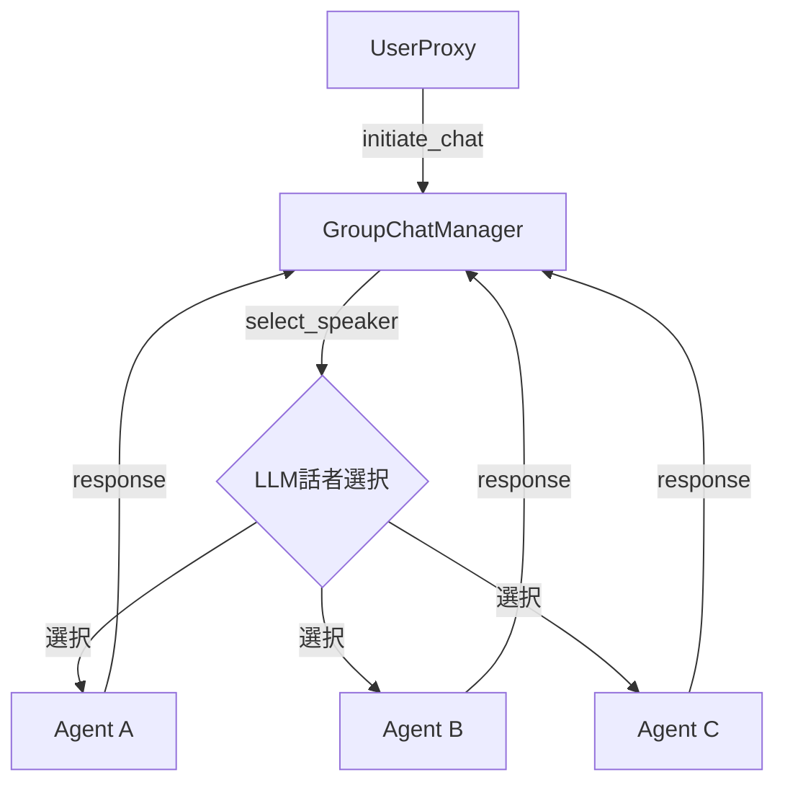

本記事は [AutoGen: Enabling Next-Gen LLM Applications via Multi-Agent Conversation](https://arxiv.org/abs/2308.08155) の解説記事です。

## 論文概要（Abstract）

AutoGenは、複数のエージェントが相互に会話することでタスクを達成するオープンソースフレームワークである。著者らは、LLM・人間・ツールの任意の組み合わせで動作するカスタマイズ可能な「ConversableAgent」を提案し、数学問題解決・コーディング・意思決定ゲーム等の6つのアプリケーションで有効性を示している。

この記事は [Zenn記事: Semantic Kernel → Microsoft Agent Framework 1.0移行ガイド](https://zenn.dev/0h_n0/articles/f18d562b6f7d52) の深掘りです。

## 情報源

- **arXiv ID**: 2308.08155
- **URL**: https://arxiv.org/abs/2308.08155
- **著者**: Qingyun Wu, Gagan Bansal, Jieyu Zhang et al.（Microsoft Research, Penn State University, University of Washington）
- **発表年**: 2023
- **分野**: cs.AI

## 背景と動機（Background & Motivation）

2023年時点で、LLMを使ったアプリケーション開発は単一エージェント+プロンプトエンジニアリングが主流だった。しかし、複雑なタスク（数学の定理証明、複数ファイルにまたがるコード生成、多段階の意思決定など）では、単一エージェントの能力限界が顕在化していた。

従来のアプローチには以下の課題があった。第一に、LLMが生成したコードを検証する仕組みがプロンプト内に収まらない。第二に、人間のフィードバックをワークフローに自然に組み込む標準的な方法がない。第三に、異なる専門性を持つ複数のLLMを協調させる抽象レイヤーが存在しなかった。

AutoGenは、これらの課題に対して「会話（conversation）」を基本プリミティブとするマルチエージェントフレームワークを提案することで解決を試みている。

## 主要な貢献（Key Contributions）

- **ConversableAgent抽象**: LLM・人間・ツールの任意の組み合わせで動作する統一エージェントインターフェースの設計
- **会話プログラミングパラダイム**: エージェント間の自然言語会話をプログラムの制御フローとして利用する新しいパラダイムの提案
- **6つの実証アプリケーション**: 数学問題解決、コード生成、対話型チェス、Webスクレイピング等での有効性の実証

## 技術的詳細（Technical Details）

### ConversableAgentアーキテクチャ

AutoGenの中核は`ConversableAgent`クラスである。各エージェントは以下の3つの構成要素を持つ。

1. **LLMバックエンド**: GPT-4等のLLMを使った応答生成
2. **コード実行エンジン**: Dockerサンドボックス内でのコード検証
3. **ヒューマンインプットモード**: 人間のフィードバックを会話に注入

エージェント間の通信は、`send()`と`receive()`メソッドによるメッセージパッシングで実現される。受信側エージェントは、メッセージを受け取ると自身の構成に基づいて応答を生成し、送信側に返す。

```python
from autogen import ConversableAgent

assistant = ConversableAgent(
    name="assistant",
    llm_config={"model": "gpt-4"},
    system_message="You are a helpful AI assistant.",
)

user_proxy = ConversableAgent(
    name="user_proxy",
    human_input_mode="NEVER",
    code_execution_config={"work_dir": "coding", "use_docker": True},
)

user_proxy.initiate_chat(
    assistant,
    message="Plot a chart of NVIDIA stock price YTD.",
    max_turns=10,
)
```

### 会話パターンの設計

著者らは、2つの基本的な会話パターンを定義している。

**二者間会話（Two-Agent Chat）**: 最もシンプルなパターン。1つのエージェントが`initiate_chat()`を呼び出し、相手エージェントと交互にメッセージを交換する。ターン数の上限（`max_turns`）または終了条件（`is_termination_msg`）で会話が終了する。

**グループチャット（GroupChat）**: 3者以上のエージェントが参加する会話パターン。`GroupChatManager`が次の話者をLLMに選択させる。話者選択の手法として、(1) LLMベースの選択、(2) ラウンドロビン、(3) ランダム選択の3方式を提供している。



### ヒューマンインプットモードの設計

AutoGenは3つのヒューマンインプットモードを提供する。

| モード | 動作 | 用途 |
|--------|------|------|
| `ALWAYS` | 毎ターン人間に入力を求める | デバッグ、教育用途 |
| `TERMINATE` | 終了条件到達時のみ入力を求める | 承認フロー |
| `NEVER` | 人間の入力を一切求めない | 完全自動化 |

この設計により、同一のエージェント定義をデバッグ時（ALWAYS）から本番運用（NEVER）まで切り替えられる。

## 実装のポイント（Implementation）

AutoGenの実装において注意すべき点がいくつかある。

**コード実行のセキュリティ**: `code_execution_config`でDockerコンテナを指定することが推奨される。ローカル実行モードも存在するが、LLMが生成した任意のコードを実行するリスクがある。

**トークン消費の管理**: GroupChatでは全参加エージェントの会話履歴が共有されるため、エージェント数×ターン数に比例してトークン消費が増大する。著者らは、会話履歴の要約機能（`summary_method`）による緩和を提案している。

**話者選択の精度**: GroupChatManagerのLLMベース話者選択は非決定的であり、不適切なエージェントが選択される場合がある。`allowed_or_disallowed_speaker_transitions`による遷移制約の設定が実用上重要である。

```python
from autogen import GroupChat, GroupChatManager

groupchat = GroupChat(
    agents=[user_proxy, coder, reviewer],
    messages=[],
    max_round=12,
    speaker_selection_method="auto",
    allowed_or_disallowed_speaker_transitions={
        user_proxy: [coder],
        coder: [reviewer],
        reviewer: [coder, user_proxy],
    },
    speaker_transitions_type="allowed",
)
```

## 実験結果（Results）

著者らは6つのアプリケーションで評価を実施している。

| アプリケーション | ベースライン（GPT-4単体） | AutoGen | 改善 |
|-----------------|------------------------|---------|------|
| MATH（数学問題） | 69.7% | 76.2% | +6.5pt |
| HumanEval（コード生成） | 68.9% | 89.0% | +20.1pt |

（論文Table 1より）

MATH benchmarkでは、AssistantAgentがコードを生成し、UserProxyAgentがコードを実行して結果を検証するという2エージェント構成が、GPT-4の単独利用より6.5ポイント高い正答率を達成している。HumanEvalでは、コード実行+自動修正ループにより20ポイント以上の改善が報告されている。

ただし、著者らも認めているように、これらの評価はタスク固有の構成で行われており、汎用的なベンチマークではない点に留意が必要である。

## 実運用への応用（Practical Applications）

AutoGenの設計は、2026年4月にGAとなったMicrosoft Agent Framework (MAF) 1.0の基盤となっている。具体的には以下の対応関係がある。

| AutoGen | MAF 1.0 |
|---------|---------|
| `ConversableAgent` | `Agent`（統一クラス） |
| `GroupChatManager` | Group Chat Orchestration |
| `initiate_chat()` | `agent.run()` |
| `code_execution_config` | ツールとして統合 |
| `human_input_mode` | Human-in-the-Loop承認フロー |

AutoGenの「会話をプログラムの制御フローとする」設計思想は、MAFのHandoffパターンに直接継承されている。一方で、AutoGenのGroupChatにおける非決定的な話者選択は、MAFでは開発者が定義するトポロジーグラフによる制約付きルーティングに改良されている。

## 関連研究（Related Work）

- **CAMEL (2023)**: ロールプレイによる2エージェント会話フレームワーク。AutoGenとの違いは、CAMELがロール割り当てに特化している点
- **MetaGPT (2023)**: SOP（標準操作手順）に基づくマルチエージェント協調。AutoGenが会話ベースなのに対し、MetaGPTはアーティファクト受け渡しベース
- **LangChain/LangGraph**: グラフベースのワークフロー制御。AutoGenが自然言語会話で制御するのに対し、LangGraphは明示的な状態遷移グラフを使用

## まとめと今後の展望

AutoGenの主要な成果は、マルチエージェント会話という抽象によって、LLMアプリケーションの構築を簡素化したことである。ConversableAgentの設計は、Microsoft Agent Framework 1.0の`Agent`クラスとして進化し、7プロバイダー対応・MCP統合・5種類のオーケストレーションパターンを備えた本番運用可能なフレームワークとなった。

今後の研究方向として、著者らは(1)より効率的なトークン管理、(2)エージェント間の信頼性検証、(3)大規模マルチエージェントシステムのスケーラビリティを挙げている。

### AutoGenからMAF 1.0への概念マッピング詳細

Semantic Kernel → MAF 1.0の移行を検討する開発者にとって、AutoGenの設計理解はMAFの内部動作を理解する上で有益である。具体的な概念マッピングを補足する。

**会話フローの制御**: AutoGenの`is_termination_msg`はMAFの`termination_condition(callable)`に対応する。AutoGenではラムダ関数で終了条件を指定するが、MAFではより宣言的な条件指定が可能になっている。

**ツール実行の安全性**: AutoGenの`code_execution_config`（Docker必須）は、MAFではツールのサンドボックス実行ポリシーとして再設計されている。MCPサーバー経由のツール呼び出しでは、ツール注釈（`readOnlyHint`等）による安全性制御が利用可能になった。

## Production Deployment Guide

### AWS実装パターン（コスト最適化重視）

AutoGenベースのマルチエージェントシステムをAWS上にデプロイする場合、トラフィック量に応じた構成が推奨される。

| 規模 | 月間リクエスト | 推奨構成 | 月額コスト | 主要サービス |
|------|--------------|---------|-----------|------------|
| **Small** | ~3,000 (100/日) | Serverless | $50-150 | Lambda + Bedrock + DynamoDB |
| **Medium** | ~30,000 (1,000/日) | Hybrid | $300-800 | Lambda + ECS Fargate + ElastiCache |
| **Large** | 300,000+ (10,000/日) | Container | $2,000-5,000 | EKS + Karpenter + EC2 Spot |

**Small構成の詳細** (月額$50-150):
- **Lambda**: 1GB RAM, 60秒タイムアウト（マルチターン会話対応） ($25/月)
- **Bedrock**: Claude 3.5 Haiku（エージェント間会話用、Prompt Caching有効） ($80/月)
- **DynamoDB**: On-Demand、会話履歴の永続化 ($10/月)
- **Step Functions**: エージェント間のフロー制御 ($5/月)

AutoGenのGroupChat機能は複数のLLM呼び出しを連鎖させるため、Lambda の60秒タイムアウトでは不足する場合がある。その場合はStep Functionsでエージェント間のフローを制御し、各ステップを個別のLambda呼び出しとして実行する構成が適している。

**コスト削減テクニック**:
- Bedrock Prompt Caching: システムプロンプト（エージェントのinstructions）をキャッシュすることで、マルチターン会話のコストを30-90%削減
- Spot Instances（Large構成）: EKS + Karpenterで最大90%のコスト削減
- Bedrock Batch API: 非リアルタイム処理（バッチ分析等）で50%割引

**コスト試算の注意事項**:
- 上記は2026年6月時点のAWS ap-northeast-1（東京）リージョン料金に基づく概算値です
- 実際のコストはトラフィックパターン、エージェント数、会話ターン数により変動します
- 最新料金は [AWS料金計算ツール](https://calculator.aws/) で確認してください

### コスト最適化チェックリスト

**アーキテクチャ選択（トラフィック量で判断）**:
- [ ] ~100 req/日 → Lambda + Bedrock + Step Functions (Serverless) - $50-150/月
- [ ] ~1000 req/日 → ECS Fargate + Bedrock (Hybrid) - $300-800/月
- [ ] 10000+ req/日 → EKS + Spot Instances (Container) - $2,000-5,000/月

**LLMコスト削減**:
- [ ] Bedrock Prompt Caching有効化（エージェントinstructionsのキャッシュ）
- [ ] Bedrock Batch API使用（非リアルタイム処理）
- [ ] モデル選択ロジック: 話者選択にはHaiku、本文生成にはSonnetを使い分け
- [ ] max_tokens設定: GroupChatの各ターンで生成トークン数を制限

**監視・アラート**:
- [ ] AWS Budgets: 月額予算設定（80%で警告）
- [ ] CloudWatch: Bedrockトークン使用量スパイク検知
- [ ] Step Functions: 実行失敗率の監視
- [ ] Cost Anomaly Detection: 自動異常検知

## 参考文献

- **arXiv**: https://arxiv.org/abs/2308.08155
- **Code**: https://github.com/microsoft/autogen
- **Related Zenn article**: https://zenn.dev/0h_n0/articles/f18d562b6f7d52
