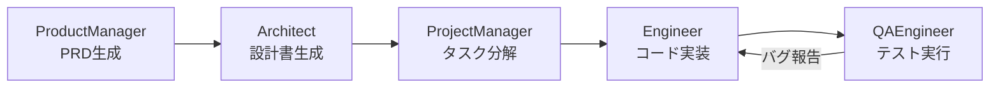

本記事は [MetaGPT: Meta Programming for A Multi-Agent Collaborative Framework](https://arxiv.org/abs/2402.18679) の解説記事です。

## 論文概要（Abstract）

MetaGPTは、Standard Operating Procedures（SOP: 標準操作手順）をプロンプトにエンコードすることでLLMベースのマルチエージェント協調を構造化するフレームワークである。著者らは、ProductManager・Architect・Engineer等のソフトウェア開発ロールを定義し、PRD→設計書→コードというアーティファクトの順次受け渡しにより、コード生成の品質を向上させている。HumanEvalでpass@1 87.7%を達成し、ChatDevやCAMEL等の先行フレームワークを上回ったと報告されている。

この記事は [Zenn記事: Semantic Kernel → Microsoft Agent Framework 1.0移行ガイド](https://zenn.dev/0h_n0/articles/f18d562b6f7d52) の深掘りです。

## 情報源

- **arXiv ID**: 2402.18679
- **URL**: https://arxiv.org/abs/2402.18679
- **著者**: Sirui Hong, Mingchen Zhuge, Jonathan Chen et al.
- **発表年**: 2024（arXiv v3）
- **分野**: cs.AI, cs.MA, cs.SE

## 背景と動機（Background & Motivation）

2023-2024年にかけて、LLMベースのマルチエージェントシステムが急速に発展した。しかし、初期のフレームワーク（CAMEL, ChatDev等）にはいくつかの課題があった。

第一に、エージェント間のフリーフォーム会話が目的から逸脱しやすい問題がある。著者らは「hallucination cascades（ハルシネーションの連鎖）」と呼ぶ現象を指摘している。1つのエージェントの誤った出力が、後続のエージェントに伝播し、最終成果物の品質を著しく低下させる。

第二に、エージェントのロール定義が曖昧な場合、責任範囲の重複や欠落が発生する。例えば、コーディングエージェントと設計エージェントの境界が不明確だと、設計判断がコーディング段階で上書きされるケースがある。

MetaGPTは、人間の組織がSOPを用いて役割分担と情報フローを管理するのと同様に、マルチエージェントシステムにSOPの概念を導入することで、これらの課題の解決を試みている。

## 主要な貢献（Key Contributions）

- **SOP駆動アーキテクチャ**: 人間の組織運営で用いられるSOPをプロンプトにエンコードし、エージェントの行動を構造化する手法の提案
- **共有メッセージプール**: 全エージェントがアクセス可能な情報共有メカニズムにより、情報の透明性を確保
- **実行可能なアーティファクト駆動フロー**: 自然言語会話ではなく、PRD・設計書・コードという実行可能なアーティファクトの受け渡しでフローを制御

## 技術的詳細（Technical Details）

### SOPに基づくロール設計

MetaGPTは、ソフトウェア開発プロセスを5つのロールに分解する。

| ロール | 入力 | 出力 | SOP |
|--------|------|------|-----|
| **ProductManager** | ユーザー要求 | PRD（製品要求仕様書） | 要件分析SOP |
| **Architect** | PRD | システム設計書 + APIインターフェース定義 | アーキテクチャSOP |
| **ProjectManager** | 設計書 | タスク分解リスト | プロジェクト管理SOP |
| **Engineer** | タスクリスト + API定義 | 実装コード | コーディングSOP |
| **QAEngineer** | 実装コード | テストケース + テスト実行結果 | テストSOP |

各ロールのSOPは、プロンプト内に「あなたは{Role}です。以下の手順に従って{Input}から{Output}を生成してください」という形式でエンコードされる。



### Roleクラスの実装

MetaGPTの各ロールは`Role`クラスを継承して実装される。

```python
from metagpt.roles import Role
from metagpt.actions import Action

class Architect(Role):
    name: str = "Architect"
    profile: str = "システムアーキテクト"
    goal: str = "PRDからシステム設計書を生成する"

    def __init__(self, **kwargs):
        super().__init__(**kwargs)
        self._init_actions([WriteDesign])
        self._watch([WritePRD])

    async def _act(self) -> Message:
        prd = self.get_memories(k=1)[0]
        design = await WriteDesign().run(prd.content)
        return Message(content=design, role=self.profile)
```

`_watch()`メソッドにより、このロールがどのActionの出力をトリガーとして動作するかを宣言する。`_act()`メソッドが実際の処理を実行し、結果をMessageとして共有メッセージプールに公開する。

### 共有メッセージプール（Environment）

MetaGPTの情報共有メカニズムは「Environment」と呼ばれる共有メッセージプールで実現される。

$$
\text{Environment} = \{m_1, m_2, \ldots, m_n\} \quad \text{where } m_i = (\text{content}_i, \text{role}_i, \text{cause\_by}_i)
$$

ここで、
- $\text{content}_i$: メッセージの内容（PRD、設計書、コード等）
- $\text{role}_i$: メッセージの送信者ロール
- $\text{cause\_by}_i$: メッセージを生成したActionの型

各ロールは`_watch()`で指定したAction型でフィルタリングされたメッセージのみを受信する。これにより、全メッセージを読む必要がなく、トークン消費を抑制できる。

AutoGenのGroupChatでは全エージェントが全メッセージを共有するため、$O(n^2)$のトークン消費が発生する。MetaGPTのPublish-Subscribeモデルでは、各ロールが必要なメッセージのみを購読するため、トークン消費が$O(n)$に抑えられる。

### アーティファクト駆動フロー vs 会話駆動フロー

MetaGPTとAutoGenの根本的な違いは、フローの制御メカニズムにある。

| 特性 | AutoGen（会話駆動） | MetaGPT（アーティファクト駆動） |
|------|---------------------|-------------------------------|
| 制御フロー | 自然言語会話 | 構造化アーティファクトの受け渡し |
| ルーティング | LLMによる話者選択 | SOPに基づく静的フロー |
| 情報共有 | 全員が全メッセージを参照 | Publish-Subscribe（選択的） |
| 柔軟性 | 高（動的な分岐可能） | 中（SOPで事前定義） |
| 再現性 | 低（非決定的） | 高（決定的フロー） |
| トークン効率 | 低（$O(n^2)$） | 高（$O(n)$） |

## 実装のポイント（Implementation）

MetaGPTの実装において注意すべき点は以下の通り。

**SOPの設計コスト**: 各ロールのSOPを事前に設計する必要がある。ソフトウェア開発以外のドメインに適用する場合、ドメイン固有のSOPを新規に設計しなければならない。

**アーティファクトの品質検証**: 各段階で生成されるアーティファクト（PRD、設計書等）の品質がフロー全体の品質を決定する。上流の品質不良が下流に伝播する「garbage in, garbage out」問題は、SOPによる構造化で軽減されるが完全には解消されない。

**コスト効率**: 著者らは、1つのソフトウェアプロジェクト生成あたり平均$1未満（GPT-4使用時）のコストを報告している。これはフリーフォーム会話ベースのフレームワークよりトークン効率が高いことを示している。

```python
from metagpt.software_company import SoftwareCompany

async def main():
    company = SoftwareCompany()
    company.hire([
        ProductManager(),
        Architect(),
        ProjectManager(),
        Engineer(n_borg=5),
        QAEngineer(),
    ])
    company.invest(investment=3.0)
    company.start_project("Create a CLI tool for batch image resizing")
    await company.run(n_round=5)
```

## 実験結果（Results）

著者らは複数のベンチマークで評価を実施している（論文Table 1, Table 2より）。

| ベンチマーク | ChatDev | CAMEL | MetaGPT | 改善 |
|-------------|---------|-------|---------|------|
| HumanEval (pass@1) | 61.8% | 41.3% | **87.7%** | +25.9pt vs ChatDev |
| MBPP (pass@1) | 52.4% | 38.7% | **82.3%** | +29.9pt vs ChatDev |
| ソフトウェアプロジェクト実行成功率 | 36.4% | 22.1% | **61.2%** | +24.8pt vs ChatDev |

著者らは、HumanEvalでのpass@1 87.7%はGPT-4単体（67.0%）を20ポイント以上上回り、マルチエージェント協調によるコード品質向上の有効性を示す結果であると主張している。

ただし、これらの結果はGPT-4をバックエンドとした評価であり、他のLLM（Claude、Gemini等）での再現性は論文中で検証されていない点に留意が必要である。

## 実運用への応用（Practical Applications）

MetaGPTの設計思想は、Microsoft Agent Framework 1.0のオーケストレーションパターンと対比することで、実務での適用指針を得られる。

**MetaGPTが適するケース**: プロセスが明確に定義されている場合（ソフトウェア開発、技術文書生成、データ分析報告書等）。SOPに基づく静的フローが再現性と品質の安定性を保証する。

**MAF Handoffが適するケース**: プロセスが動的に変化する場合（カスタマーサポート、ヘルプデスク等）。LLMによる柔軟なルーティングが、事前に予測できない分岐パターンに対応する。

**ハイブリッドアプローチ**: MAF 1.0のSequentialパターンでMetaGPT的なアーティファクト駆動フローを実装し、Handoffパターンで例外処理や人間のフィードバックを扱うという組み合わせが考えられる。

### スケーリングの考慮

MetaGPTの逐次処理アーキテクチャ（PM → Architect → PM → Engineer → QA）は、各段階が前段階の完了を待つため、並列化が困難である。MAF 1.0のConcurrentパターンとの組み合わせにより、独立したモジュールの実装を並列化することで、全体のレイテンシを改善できる可能性がある。

## 関連研究（Related Work）

- **ChatDev (Qian et al., 2023)**: チャットベースのソフトウェア開発マルチエージェントシステム。MetaGPTとの違いは、ChatDevがロール間のフリーフォーム会話に依存する点。MetaGPTはSOPで構造化することで品質を向上させている
- **AutoGen (Wu et al., 2023)**: 会話型マルチエージェントフレームワーク。MetaGPTがアーティファクト駆動なのに対し、AutoGenは会話駆動。両者はトレードオフの関係にあり、MAF 1.0は両方のパラダイムを統合している
- **AgentScope (Gao et al., 2024)**: フォールトトレランスを重視したマルチエージェントプラットフォーム。MetaGPTが品質に焦点を当てているのに対し、AgentScopeは大規模分散環境での信頼性に焦点

## まとめと今後の展望

MetaGPTの主要な成果は、SOPという人間組織の知見をマルチエージェントシステムに導入し、コード生成品質を大幅に向上させたことである。HumanEvalでのpass@1 87.7%は、構造化されたエージェント間協調の有効性を示す結果である。

一方で、SOPの事前設計コスト、ソフトウェア開発ドメインへの特化、逐次処理によるレイテンシといった課題も残る。Microsoft Agent Framework 1.0は、AutoGenの会話駆動アプローチとMetaGPTのアーティファクト駆動アプローチの双方の長所を取り入れた統合フレームワークとして位置づけられ、今後のマルチエージェント開発の方向性を示している。

## Production Deployment Guide

### AWS実装パターン（コスト最適化重視）

MetaGPTの逐次処理パイプライン（PM → Architect → PM → Engineer → QA）は、各ステージの完了を待って次に進むため、AWS Step Functionsとの親和性が高い。

| 規模 | 月間プロジェクト | 推奨構成 | 月額コスト | 主要サービス |
|------|--------------|---------|-----------|------------|
| **Small** | ~100 | Serverless | $100-300 | Step Functions + Lambda + Bedrock + S3 |
| **Medium** | ~1,000 | Container | $500-1,500 | ECS Fargate + Step Functions + Bedrock |
| **Large** | 10,000+ | Kubernetes | $3,000-10,000 | EKS + Step Functions Express + EC2 Spot |

**Small構成の詳細** (月額$100-300):
- **Step Functions Standard**: 5ロール×各1ステップ = 5ステート遷移/プロジェクト ($10/月)
- **Lambda**: 各ロール（PM, Architect等）を個別Lambda関数で実装 ($20/月)
- **Bedrock**: Claude 3.5 Sonnet（Engineer/Architect）+ Haiku（PM/QA） ($200/月)
- **S3**: 各ステージのアーティファクト（PRD, 設計書, コード）をバージョン管理 ($5/月)

**MetaGPT固有の考慮事項**:
- MetaGPTの共有メッセージプール（Environment）をDynamoDBで実装し、`cause_by`フィールドでフィルタリング
- 各ロールの`_watch()`に相当するフィルタをStep Functionsの入力変換で実現
- Engineer → QA → Engineer のバグ修正ループをStep FunctionsのChoice + Loop構造で表現

**コスト試算の注意事項**:
- 上記は2026年6月時点のAWS ap-northeast-1（東京）リージョン料金に基づく概算値
- 実際のコストはプロジェクト規模、ロール数、LLM呼び出し回数により変動
- 最新料金は [AWS料金計算ツール](https://calculator.aws/) で確認してください

### コスト最適化チェックリスト

**アーキテクチャ選択**:
- [ ] ~100 プロジェクト/月 → Step Functions + Lambda (Serverless) - $100-300/月
- [ ] ~1,000 プロジェクト/月 → ECS Fargate + Step Functions (Container) - $500-1,500/月
- [ ] 10,000+ プロジェクト/月 → EKS + Express Workflows (Kubernetes) - $3,000-10,000/月

**LLMコスト削減**:
- [ ] ロールごとにモデルを使い分け（PM/QA → Haiku、Architect/Engineer → Sonnet）
- [ ] Bedrock Prompt Caching（各ロールのSOPプロンプトをキャッシュ）
- [ ] アーティファクト生成結果をS3にキャッシュし、同一要件の重複生成を回避

**監視・アラート**:
- [ ] Step Functions: 実行失敗率・各ステージのレイテンシ監視
- [ ] CloudWatch Metrics: ロールごとのLLMトークン消費量
- [ ] AWS Budgets: 月額予算設定（80%で警告）

## 参考文献

- **arXiv**: https://arxiv.org/abs/2402.18679
- **Code**: https://github.com/geekan/MetaGPT
- **Related Papers**: https://arxiv.org/abs/2308.08155 (AutoGen)
- **Related Zenn article**: https://zenn.dev/0h_n0/articles/f18d562b6f7d52
