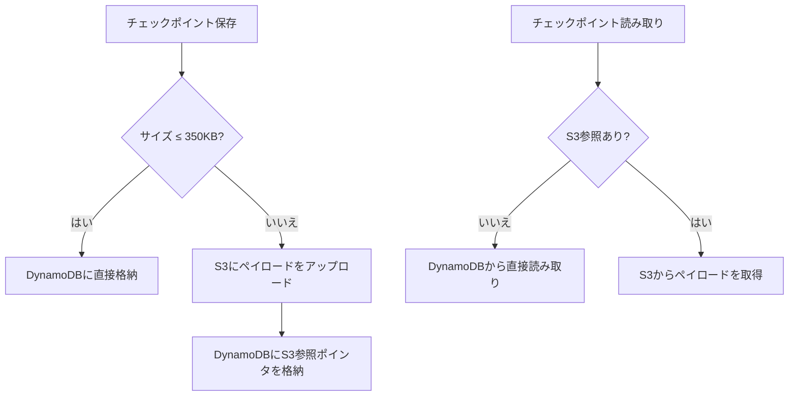

## ブログ概要（Summary）

本記事は [AWS Database Blog「Build durable AI agents with LangGraph and Amazon DynamoDB」](https://aws.amazon.com/blogs/database/build-durable-ai-agents-with-langgraph-and-amazon-dynamodb/)（2026年1月13日公開、著者: Lee Hannigan）の解説記事です。

LangGraphのステートマシンモデルでは、チェックポインターがグラフの各ステップでState（状態）をスナップショットとして保存します。Zenn記事では`MemorySaver`（プロセス再起動で消失）と`AsyncPostgresSaver`（本番用）が紹介されていますが、このブログではAWSネイティブな選択肢として**DynamoDBSaver**を紹介しています。DynamoDBSaverは350KB以下のチェックポイントをDynamoDBに直接格納し、それを超えるペイロードをS3に自動オフロードする「インテリジェントペイロードルーティング」を実装しており、チェックポイントサイズを意識することなくスケーラブルな永続化が可能です。TTLによる自動有効期限設定やチェックポイント圧縮も提供され、コスト最適化と運用簡素化を両立しています。

この記事は [Zenn記事: LangGraph v1.2でステートマシン設計――5つの分岐パターンと本番運用](https://zenn.dev/0h_n0/articles/fa2c321db68933) の深掘りです。

## 情報源

- **種別**: 企業テックブログ（AWS公式）
- **URL**: [https://aws.amazon.com/blogs/database/build-durable-ai-agents-with-langgraph-and-amazon-dynamodb/](https://aws.amazon.com/blogs/database/build-durable-ai-agents-with-langgraph-and-amazon-dynamodb/)
- **組織**: Amazon Web Services
- **著者**: Lee Hannigan
- **発表日**: 2026年1月13日

## 技術的背景（Technical Background）

LangGraphのステートマシンモデルでは、グラフの各「スーパーステップ」（ノードの実行単位）が完了するたびにチェックポイントが保存されます。このチェックポイントはStateの完全なスナップショットであり、Human-in-the-loopによるワークフロー一時停止、障害からの復旧、タイムトラベルデバッグなどの機能の基盤となります。

Zenn記事の「落とし穴1: SqliteSaverのwrite lock」で指摘されているように、本番環境ではチェックポインターの選択がスループットとスケーラビリティに直結します。`SqliteSaver`はデータベースレベルのwrite lockにより並行リクエストのボトルネックとなり、`MemorySaver`はプロセス再起動で全状態が消失します。

DynamoDBは以下の特性を持つため、LangGraphのチェックポインターとして適しています。

- **シングルミリ秒レイテンシ**: チェックポイントの読み書きが高速
- **サーバーレス**: 容量プロビジョニングが不要（On-Demandモード）
- **スケーラビリティ**: 秒間数百万リクエストに対応
- **TTL**: チェックポイントの自動有効期限設定
- **耐久性**: 3つのAZに自動レプリケーション

## 実装アーキテクチャ（Architecture）

### DynamoDBSaverの初期化

ブログでは`langgraph-checkpoint-aws`パッケージを使用したDynamoDBSaverの初期化方法が示されています。

```python
from langgraph_checkpoint_aws import DynamoDBSaver

checkpointer = DynamoDBSaver(
    table_name="langgraph-checkpoints",
    region_name="ap-northeast-1",
    ttl_seconds=86400 * 30,              # 30日間保持
    enable_checkpoint_compression=True,    # 圧縮有効化
    s3_offload_config={
        "bucket_name": "langgraph-checkpoint-overflow"
    },
)
```

### DynamoDBテーブルスキーマ

ブログによると、チェックポイントテーブルには以下のスキーマが必要です。

| 属性 | 型 | 役割 |
|------|-----|------|
| **PK** (Partition Key) | String | `thread_id`ベースのパーティションキー |
| **SK** (Sort Key) | String | `checkpoint_id`ベースのソートキー |
| **expire_at** (TTL) | Number | 自動削除のためのUNIXタイムスタンプ |

Partition Keyに`thread_id`を使用することで、同一スレッドのチェックポイントが同じパーティションに格納されます。これによりクエリの効率が最大化されます。Sort Keyに`checkpoint_id`を使用することで、時系列順のチェックポイント取得が可能になります。

### インテリジェントペイロードルーティング

DynamoDBの項目サイズ上限は400KBであるため、大きなチェックポイントを直接格納できません。ブログでは「350KB以下はDynamoDBに直接格納、それを超えるペイロードはS3にオフロード」するインテリジェントルーティングが説明されています。



この350KBの閾値はDynamoDBの400KB項目サイズ上限にメタデータ（thread_id, checkpoint_id, タイムスタンプなど）分の余裕を持たせた設計です。読み取り時にはDynamoDBのメタデータを確認し、S3参照が含まれている場合は自動的にS3からペイロードを取得します。この透過的な処理により、呼び出し元はストレージの切り替えを意識する必要がありません。

### コスト最適化機能

**TTL（Time To Live）**: `ttl_seconds`パラメータにより、チェックポイントに自動有効期限を設定できます。短期タスク（チャットボットのセッションなど）では24時間、長期ワークフロー（承認フローなど）では30日間といった使い分けが可能です。TTLによる削除はDynamoDBの書き込みコストを消費しません。

**チェックポイント圧縮**: `enable_checkpoint_compression=True`を設定すると、チェックポイントのシリアライゼーションと圧縮が有効になります。LLMのメッセージ履歴は繰り返しの多いテキストデータであるため、圧縮による効果が大きいと考えられます。

### IAM権限設定

ブログでは、DynamoDBSaverの運用に必要な最小権限のIAMポリシーが示されています。

**DynamoDB権限**: `GetItem`, `PutItem`, `Query`, `BatchGetItem`, `BatchWriteItem`
**S3権限**（オフロード使用時）: `PutObject`, `GetObject`, `DeleteObject`, `PutObjectTagging`

Zenn記事で強調されている「本番環境でのセキュリティ」の観点から、IAMロールは最小権限の原則に従い、リソースARNを明示的に指定することが推奨されます。

### 本番利用パターン

ブログでは3つの本番利用パターンが紹介されています。

**1. Human-in-the-loopワークフロー**: Zenn記事のパターン5（interrupt + Command）で一時停止されたワークフローの状態をDynamoDBに永続化し、数時間〜数日後に再開するケースです。

**2. 障害復旧**: ノード実行中にプロセスがクラッシュした場合、最後に成功したチェックポイントからワークフローを再開できます。DynamoDBの耐久性（3AZ自動レプリケーション）により、チェックポイント自体の消失リスクは極めて低いです。

**3. 長期間の会話**: チャットボットやカスタマーサポートエージェントなど、セッションが数日にわたるケースです。TTLを適切に設定することで、古いセッションの自動クリーンアップが可能です。

### 移行パス

ブログでは、開発段階から本番環境への移行パスとして以下の手順が推奨されています。

1. **プロトタイプ**: `InMemorySaver`で開発（コードの変更なしで他のチェックポインターに差し替え可能）
2. **ステージング**: `DynamoDBSaver`に切り替え（チェックポインターのインスタンスを差し替えるだけ）
3. **本番**: TTL・圧縮・S3オフロードを有効化

この移行パスは、Zenn記事で指摘されている「SqliteSaverを中間段階として使わない」という推奨事項と一致しています。DynamoDBSaverはサーバーレスであるため、ステージングと本番で同じコードをそのまま使用できます。

## Production Deployment Guide

### AWS実装パターン（コスト最適化重視）

DynamoDBSaverを中心としたLangGraphエージェントのAWSデプロイ構成を示します。

**トラフィック量別の推奨構成**:

| 規模 | 月間リクエスト | 推奨構成 | 月額コスト | 主要サービス |
|------|--------------|---------|-----------|------------|
| **Small** | ~3,000 (100/日) | Serverless | $40-120 | Lambda + Bedrock + DynamoDB |
| **Medium** | ~30,000 (1,000/日) | Hybrid | $250-700 | Lambda + ECS Fargate + DynamoDB |
| **Large** | 300,000+ (10,000/日) | Container | $1,800-4,500 | EKS + DynamoDB + S3 |

**Small構成の詳細** (月額$40-120):
- **Lambda**: 1GB RAM, 60秒タイムアウト ($20/月)
- **Bedrock**: Claude 3.5 Haiku ($60/月)
- **DynamoDB**: On-Demand、TTL 7日 ($5/月)
- **CloudWatch**: 基本監視 ($5/月)

**Medium構成の詳細** (月額$250-700):
- **Lambda**: イベントトリガー ($30/月)
- **ECS Fargate**: 0.5 vCPU × 2タスク ($120/月)
- **DynamoDB**: On-Demand、TTL 30日 ($20/月)
- **S3**: チェックポイントオフロード ($10/月)
- **Bedrock**: Claude 3.5 Sonnet ($400/月)

**Large構成の詳細** (月額$1,800-4,500):
- **EKS**: コントロールプレーン ($72/月)
- **EC2 Spot**: m6i.xlarge × 2-4台 ($400/月)
- **DynamoDB**: Provisioned、Auto Scaling ($100/月)
- **S3**: チェックポイントオフロード + ライフサイクルポリシー ($30/月)
- **Bedrock Batch**: 50%割引 ($1,500/月)

**コスト試算の注意事項**:
- 上記は2026年6月時点のAWS ap-northeast-1（東京）リージョン料金に基づく概算値です
- DynamoDB On-Demandの読み取り/書き込みコストはチェックポイント頻度に依存します
- 最新料金は [AWS料金計算ツール](https://calculator.aws/) で確認してください

### Terraformインフラコード

**DynamoDBSaver用の完全なTerraform構成**:

```hcl
resource "aws_dynamodb_table" "langgraph_checkpoints" {
  name         = "langgraph-checkpoints"
  billing_mode = "PAY_PER_REQUEST"
  hash_key     = "PK"
  range_key    = "SK"

  attribute {
    name = "PK"
    type = "S"
  }

  attribute {
    name = "SK"
    type = "S"
  }

  ttl {
    attribute_name = "expire_at"
    enabled        = true
  }

  server_side_encryption {
    enabled = true
  }

  point_in_time_recovery {
    enabled = true
  }
}

resource "aws_s3_bucket" "checkpoint_overflow" {
  bucket = "langgraph-checkpoint-overflow"
}

resource "aws_s3_bucket_lifecycle_configuration" "checkpoint_cleanup" {
  bucket = aws_s3_bucket.checkpoint_overflow.id

  rule {
    id     = "expire-old-checkpoints"
    status = "Enabled"

    expiration {
      days = 30
    }

    filter {
      prefix = "checkpoints/"
    }
  }
}

resource "aws_s3_bucket_server_side_encryption_configuration" "checkpoint" {
  bucket = aws_s3_bucket.checkpoint_overflow.id

  rule {
    apply_server_side_encryption_by_default {
      sse_algorithm = "aws:kms"
    }
  }
}

resource "aws_iam_role" "langgraph_agent" {
  name = "langgraph-agent-role"

  assume_role_policy = jsonencode({
    Version = "2012-10-17"
    Statement = [{
      Action    = "sts:AssumeRole"
      Effect    = "Allow"
      Principal = { Service = "lambda.amazonaws.com" }
    }]
  })
}

resource "aws_iam_role_policy" "dynamodb_checkpointer" {
  role = aws_iam_role.langgraph_agent.id

  policy = jsonencode({
    Version = "2012-10-17"
    Statement = [
      {
        Effect = "Allow"
        Action = [
          "dynamodb:GetItem",
          "dynamodb:PutItem",
          "dynamodb:Query",
          "dynamodb:BatchGetItem",
          "dynamodb:BatchWriteItem"
        ]
        Resource = aws_dynamodb_table.langgraph_checkpoints.arn
      },
      {
        Effect = "Allow"
        Action = [
          "s3:PutObject",
          "s3:GetObject",
          "s3:DeleteObject"
        ]
        Resource = "${aws_s3_bucket.checkpoint_overflow.arn}/*"
      }
    ]
  })
}
```

### 運用・監視設定

**CloudWatch Logs Insights クエリ**:

```sql
-- チェックポイントサイズの分布
fields @timestamp, checkpoint_size_bytes, thread_id
| stats avg(checkpoint_size_bytes) as avg_size,
        max(checkpoint_size_bytes) as max_size,
        count(*) as checkpoint_count
  by bin(1h)

-- S3オフロード発生頻度
fields @timestamp, storage_type
| filter storage_type = "s3_offload"
| stats count(*) as offload_count by bin(1h)
```

**DynamoDB容量監視**:

```python
import boto3

cloudwatch = boto3.client('cloudwatch')

cloudwatch.put_metric_alarm(
    AlarmName='dynamodb-checkpoint-throttle',
    ComparisonOperator='GreaterThanThreshold',
    EvaluationPeriods=2,
    MetricName='ThrottledRequests',
    Namespace='AWS/DynamoDB',
    Period=300,
    Statistic='Sum',
    Threshold=5,
    AlarmDescription='DynamoDBチェックポイント書き込みスロットリング検知',
    Dimensions=[{
        'Name': 'TableName',
        'Value': 'langgraph-checkpoints'
    }]
)
```

### コスト最適化チェックリスト

**DynamoDB最適化**:
- [ ] On-Demandモード選択（低〜中トラフィック）
- [ ] Provisioned + Auto Scaling（高トラフィック・予測可能）
- [ ] TTL設定で古いチェックポイント自動削除
- [ ] チェックポイント圧縮有効化
- [ ] 読み取り整合性: Eventually Consistentで十分な場合はコスト半減

**S3最適化**:
- [ ] ライフサイクルポリシーでオフロードデータ自動削除
- [ ] S3 Intelligent-Tieringで長期保存コスト削減
- [ ] KMS暗号化（コンプライアンス要件時）

**LLMコスト削減**:
- [ ] Bedrock Batch API: 50%割引
- [ ] Prompt Caching: 30-90%削減
- [ ] モデル選択ロジック: Haiku/Sonnet使い分け
- [ ] トークン数制限: max_tokens設定

**監視・アラート**:
- [ ] DynamoDBスロットリングアラーム
- [ ] S3オフロード頻度監視
- [ ] チェックポイントサイズ異常検知
- [ ] AWS Budgets月額予算設定

**リソース管理**:
- [ ] タグ戦略（環境・プロジェクト別）
- [ ] DynamoDB Point-in-Time Recovery設定
- [ ] S3バージョニング無効化（チェックポイントは冪等）
- [ ] 開発環境のTTLを短く設定（1日）

## パフォーマンス最適化（Performance）

**DynamoDBのレイテンシ特性**: DynamoDBのシングルミリ秒レイテンシにより、各スーパーステップでのチェックポイント書き込みオーバーヘッドは1-5ms程度です。LLMの推論レイテンシ（通常1-30秒）と比較すると無視できるレベルです。

**S3オフロードのレイテンシ**: S3への書き込みは50-200ms程度の追加レイテンシが発生しますが、350KBを超えるチェックポイントは長時間実行ワークフローで発生するため、相対的な影響は小さいです。

**圧縮のトレードオフ**: チェックポイント圧縮はCPU時間を消費しますが、ネットワーク転送量とストレージコストを削減します。メッセージ履歴が長い場合（100ターン以上）は圧縮率が高く、パフォーマンスの利点が大きくなります。

## 運用での学び（Production Lessons）

**教訓1: thread_idの設計とチェックポイントの粒度**

Zenn記事で指摘されている「thread_idの設計ミス」は、DynamoDBSaverの場合にコスト面でも影響します。thread_idが粗いと、1つのパーティションキーに大量のチェックポイントが蓄積され、DynamoDBのホットパーティション問題を引き起こす可能性があります。`user_id + session_id`の組み合わせが推奨される理由は、パーティション分散の観点からも合理的です。

**教訓2: TTLの設定は用途に応じて差別化する**

すべてのワークフローに同じTTLを設定するのではなく、ワークフローの特性に応じて差別化します。例えば、チャットセッションは24時間、承認フローは7日、監査対象ワークフローは90日といった設定が考えられます。

**教訓3: DynamoDBからPostgreSQLへの移行は不要**

Zenn記事では`AsyncPostgresSaver`が本番環境で推奨されていますが、AWSネイティブな環境ではDynamoDBSaverが同等以上の選択肢です。サーバーレスでの運用、自動スケーリング、TTLによる自動クリーンアップなど、PostgreSQLにはない利点があります。ただし、既にRDSやAurora PostgreSQLを使用しているチームは`AsyncPostgresSaver`の方が運用コストが低い場合もあります。

## 学術研究との関連（Academic Connection）

チェックポイントの概念はHPCやデータベースの分野で長い歴史を持ちます。

**WAL（Write-Ahead Logging）**: DynamoDBSaverのチェックポイント戦略は、データベースのWALと類似しています。各スーパーステップの完了時にStateの完全なスナップショットを保存する点は、データベースのフルチェックポイントに対応します。

**差分チェックポイント**: Zenn記事で紹介されているDeltaChannel（beta）は差分のみを保存する最適化で、これはデータベースの増分バックアップやHPCの増分チェックポイントと同じ概念です。DynamoDBSaverとDeltaChannelの組み合わせにより、ストレージコストとネットワーク転送量をさらに削減できる可能性があります。

## まとめと実践への示唆

AWS Database Blogで紹介されているDynamoDBSaverは、LangGraphのチェックポインターとしてAWSネイティブなスケーラブルな選択肢を提供しています。

**実践への示唆**:

1. **AWS環境ならDynamoDBSaverを検討**: PostgreSQLを使っていないAWS環境では、サーバーレスで運用コストが低いDynamoDBSaverが有力な選択肢
2. **TTLと圧縮でコスト制御**: チェックポイントの自動有効期限と圧縮を有効にし、ストレージコストを抑制
3. **S3オフロードは透過的**: 大きなチェックポイントは自動的にS3に退避されるため、明示的な対応は不要

## 参考文献

- **Blog URL**: [Build durable AI agents with LangGraph and Amazon DynamoDB](https://aws.amazon.com/blogs/database/build-durable-ai-agents-with-langgraph-and-amazon-dynamodb/)
- **langgraph-checkpoint-aws**: [PyPI](https://pypi.org/project/langgraph-checkpoint-aws/)
- **Related Zenn article**: [LangGraph v1.2でステートマシン設計――5つの分岐パターンと本番運用](https://zenn.dev/0h_n0/articles/fa2c321db68933)
