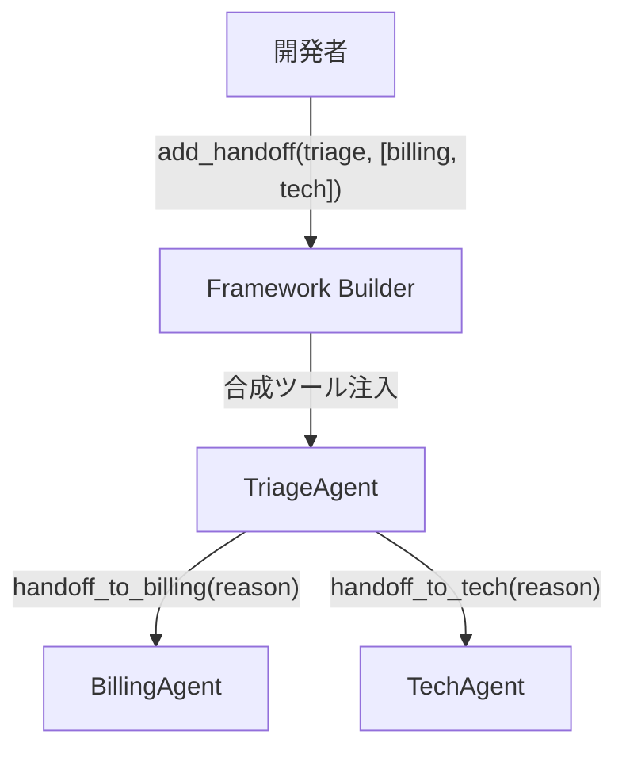
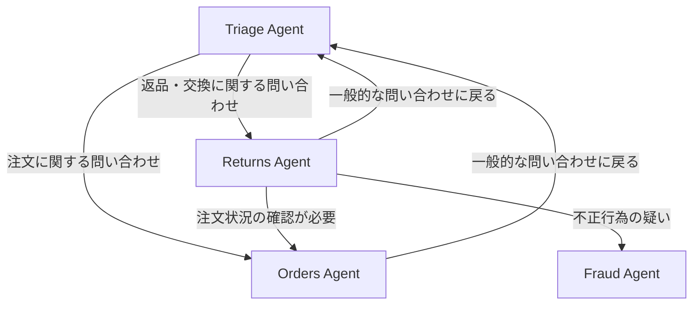

本記事は [A Tour of Handoff Orchestration Pattern](https://devblogs.microsoft.com/agent-framework/a-tour-of-handoff-orchestration-pattern/) の解説記事です。

## ブログ概要（Summary）

Microsoft Agent Framework 1.0のHandoff Orchestration Patternは、開発者が定義するトポロジーグラフ内で、エージェント自身がルーティング判断を行う分散型マルチエージェントオーケストレーションである。公式ブログでは、パターンの内部メカニズム（合成ツールの自動注入、トポロジー強制、自然な終了条件）と、Python/.NETでの実装方法が詳述されている。

この記事は [Zenn記事: Semantic Kernel → Microsoft Agent Framework 1.0移行ガイド](https://zenn.dev/0h_n0/articles/f18d562b6f7d52) の深掘りです。

## 情報源

- **種別**: 企業テックブログ（Microsoft公式）
- **URL**: https://devblogs.microsoft.com/agent-framework/a-tour-of-handoff-orchestration-pattern/
- **組織**: Microsoft Agent Framework Team
- **発表日**: 2026年（Agent Framework 1.0 GA前後）

## 技術的背景（Technical Background）

マルチエージェントシステムにおけるオーケストレーション（エージェント間の制御フロー管理）は、大きく3つのアプローチに分類される。

**集中型ルーター**: 中央のルーターがすべてのリクエストを振り分ける。実装がシンプルだが、ルーターがボトルネックになりやすく、文脈情報の損失が発生する。

**固定パイプライン**: 事前に定義された順序でエージェントを実行する。決定論的だが柔軟性に欠け、動的な分岐やバックトラッキングが困難。

**分散型ルーティング（Handoff）**: エージェント自身がルーティング判断を行い、トポロジーグラフの制約内で次のエージェントに制御を移譲する。公式ブログではこれを「開発者がトポロジーとガードレールを宣言し、エージェントがその境界内でルーティング判断を行う」と表現している。

## 実装アーキテクチャ（Architecture）

### 3つの基本特性

公式ブログが明示する、Handoffパターンの3つの基本特性は以下の通り。

**1. 統一された会話コンテキスト**

すべてのエージェントが完全なメッセージ履歴にアクセスする。ブログの表現を借りると「会話は1つの共有トランスクリプトであり、独立したスレッドのファンアウトではない」。次のエージェントは前のエージェントの発言を参照できる。

**2. トポロジー強制**

エージェントは、開発者が宣言したエッジにのみルーティングできる。不正なルーティングはワークフローレベルで防止される。これにより、エージェントのプロンプトにガードレールを書く必要がなくなる。

**3. 自然な終了**

アクティブなエージェントがhandoffツールを呼び出さずにターンを完了した場合、ワークフローが終了する。ユーザーへの応答は最後のアクティブエージェントの出力となる。

### 合成ツール（Synthetic Tool）の仕組み

Handoffパターンの内部動作の核心は「合成ツール」である。フレームワークは、宣言されたエッジに基づいて、各エージェントにhandoff用のツールを自動注入する。



各合成ツールは以下の情報を含む。

| 要素 | 説明 |
|------|------|
| `name` | `handoff_to_{target_name}` |
| `description` | 開発者が指定したhandoff理由（LLMが判断に使用） |
| `parameters` | 任意のreason文字列（転送理由をログに残す） |

LLMはこれらの合成ツールを通常のツールと同様に扱い、会話の文脈に基づいてhandoffを呼び出すか、応答を返すかを自律的に判断する。

### トポロジー設計のパターン

公式ブログでは、ECサポートシステムを例にトポロジー設計を解説している。



このトポロジーには以下の特徴がある。

- **バックエッジ**: Returns → Triage（一般問い合わせに戻る）
- **サイドエッジ**: Returns → Orders（注文状況確認）
- **ターミナルノード**: Fraud（一方通行、終了ノード）
- **カスタムhandoff理由**: 各エッジに「なぜ転送するか」の説明を付与

## Python APIの詳細

### HandoffBuilderによるトポロジー構築

```python
from agent_framework import Agent
from agent_framework.openai import OpenAIChatClient
from agent_framework.orchestrations import HandoffBuilder

client = OpenAIChatClient(model="gpt-4o")

triage = Agent(
    client=client,
    name="TriageAgent",
    instructions=(
        "カスタマーサポートの受付担当です。"
        "問い合わせ内容を判断し、適切な専門エージェントに転送してください。"
    ),
)

billing = Agent(
    client=client,
    name="BillingAgent",
    instructions="請求・決済の専門担当です。",
)

tech = Agent(
    client=client,
    name="TechAgent",
    instructions="技術サポートの専門担当です。",
)

workflow = (
    HandoffBuilder(
        name="support_workflow",
        participants=[triage, billing, tech],
    )
    .with_start_agent(triage)
    .add_handoff(triage, [billing, tech])
    .add_handoff(billing, [triage], description="請求以外の問い合わせの場合")
    .add_handoff(tech, [triage], description="技術以外の問い合わせの場合")
    .build()
)
```

### Python固有の設計

公式ブログによると、Python APIは.NET APIと以下の点で異なる。

| 機能 | .NET | Python |
|------|------|--------|
| デフォルトトポロジー | 明示的エッジのみ | フルメッシュ（全対全） |
| `with_start_agent()` | 必須 | 設定するとreturn-to-previousが自動有効化 |
| 自律モード | なし | `.with_autonomous_mode(turn_limits={agent: N})` |
| 終了条件 | ターミナルノードのみ | ターミナルノード + `termination_condition(callable)` |

**フルメッシュのデフォルト**: Python APIでは、`participants`に渡したエージェント間でデフォルトで全対全のhandoffが可能になる。`add_handoff()`で明示的にエッジを追加すると、そのソースエージェントのデフォルトメッシュが上書きされる。

**自律モード**: `with_autonomous_mode()`を設定すると、handoff先のエージェントが応答を返した後、自動的にワークフローが次のユーザーメッセージを待たずに続行する。`turn_limits`パラメータで各エージェントの最大ターン数を制限できる。

### イベントベースのストリーミングAPI

Handoffワークフローの実行は、`run_stream()`によるイベントベースのAPIで行う。

```python
from agent_framework import WorkflowEvent
from agent_framework.orchestrations import HandoffAgentUserRequest

async for event in workflow.run_stream(
    "ソフトウェアのインストールが途中で止まります"
):
    if event.type == "request_info" and isinstance(
        event.data, HandoffAgentUserRequest
    ):
        for msg in event.data.agent_response.messages[-2:]:
            print(f"{msg.author_name}: {msg.text}")
```

`run_stream()`は`WorkflowEvent`を非同期に生成する。`request_info`イベントが発生すると、ワークフローがユーザー入力を待機する。開発者は`event.data.agent_response`から直前のエージェントの応答を取得し、ユーザーに表示できる。

### EnableReturnToPreviousの動作

公式ブログが強調しているのが`EnableReturnToPrevious`（Python: `with_start_agent()`設定時に自動有効化）の動作である。

**無効の場合**: ユーザーの新しいメッセージは常にルートエージェントに送られる。専門エージェントとの対話が一方通行になる。

**有効の場合**: ユーザーのフォローアップメッセージは、最後にアクティブだった専門エージェントに直接送られる。これにより、ユーザーと専門エージェントの自然な対話が実現する。

Human-in-the-Loopのシナリオでは、この設定が必要不可欠である。例えば、TechAgentが「OSのバージョンを教えてください」と質問した場合、ユーザーの回答がTriageAgent（ルート）に送られてしまっては会話が成立しない。

## 他のオーケストレーションパターンとの比較

MAF 1.0が標準搭載する5つのオーケストレーションパターンの使い分けを整理する。

| パターン | 制御フロー | ルーティング判断 | 適用シーン |
|----------|-----------|----------------|----------|
| **Sequential** | 固定順序 | 開発者（事前定義） | データ処理パイプライン |
| **Concurrent** | 並列実行 | なし（全員実行） | 独立した分析の並列実行 |
| **Handoff** | 動的分岐 | エージェント（LLM） | カスタマーサポート |
| **Group Chat** | ターンベース | マネージャー（LLM） | ブレインストーミング |
| **Magentic-One** | タスク分解 | オーケストレーター（LLM） | 複雑な自律タスク |

公式ブログの表現を借りると、Handoffパターンは「固定パイプラインから自然に進化するパス」であり、ワークフローが固定順序を超えて動的な分岐を必要とするようになった段階で採用すべきパターンである。

## パフォーマンス最適化（Performance）

### レイテンシの考慮

Handoffパターンでは、各handoff発生時にLLMの追加呼び出しが発生する。ツール呼び出し（handoff判断）+ 転送先エージェントの応答生成で、最低2回のLLM呼び出しがhandoffごとに必要となる。

**最適化のポイント**:
- handoff理由（description）を具体的に記述し、LLMのルーティング精度を向上させることで、不要なhandoffの往復を減らす
- トポロジーのエッジ数を必要最小限に抑える（フルメッシュを避ける）
- エージェントの`instructions`にルーティング条件を明記し、曖昧さを排除する

### トークン消費の管理

統一会話トランスクリプトを全エージェントが共有するため、会話が長くなるとトークン消費が増大する。公式ブログではこの課題への直接的な解決策は示されていないが、MAF 1.0のメモリアーキテクチャ（会話履歴の要約機能）が緩和策として利用可能である。

## 運用での学び（Production Lessons）

### handoff理由の記述が精度を決める

公式ブログが繰り返し強調しているのが、`add_handoff()`の`description`パラメータの重要性である。この文字列がLLMのルーティング判断に使われるツール説明になるため、曖昧な記述はルーティング精度の低下に直結する。

```python
# 悪い例: 曖昧
.add_handoff(billing, [triage], description="他の問い合わせ")

# 良い例: 具体的
.add_handoff(billing, [triage], description="請求・決済以外の問い合わせ（技術的な質問、一般的な問い合わせ、アカウント設定等）の場合")
```

### ターミナルノードの設計

Fraudエージェントのような一方通行のhandoffは、ターミナルノードとして設計する。ターミナルノードからは他のエージェントへのhandoffが存在しないため、フローが自然に終了する。不正行為の疑いがある場合にTriageに戻るべきではない、というビジネスルールをトポロジーレベルで強制できる。

## 学術研究との関連（Academic Connection）

Handoffパターンの設計は、以下の研究と関連している。

- **AutoGen GroupChat (Wu et al., 2023)**: LLMベースの話者選択メカニズムの原型。Handoffはこれを「開発者定義のトポロジーグラフ」で制約することで、精度と予測可能性を向上させている
- **ReAct (Yao et al., 2022)**: 推論と行動の交互実行パターン。Handoffのエージェントは各ターンで「応答するか転送するか」をReActライクに判断している
- **Tool Use研究**: 合成ツールとしてhandoffを実装するアプローチは、LLMのtool use能力を制御フローに転用した新しい応用形態である

## まとめと実践への示唆

Handoff Orchestration Patternは、トポロジーグラフによるガバナンスとLLMによる柔軟なルーティング判断を組み合わせた、実用的なマルチエージェントオーケストレーション手法である。固定パイプラインでは対応できない動的な分岐が必要なシナリオ（カスタマーサポート、ヘルプデスク、ワークフロー自動化等）に適している。

実装上の最重要ポイントは、(1) handoff理由の具体的な記述、(2) EnableReturnToPreviousの適切な設定、(3) トポロジーのエッジ数の最小化、の3点である。

## 参考文献

- **Blog URL**: https://devblogs.microsoft.com/agent-framework/a-tour-of-handoff-orchestration-pattern/
- **Agent Framework Overview**: https://learn.microsoft.com/en-us/agent-framework/overview/
- **Related Papers**: https://arxiv.org/abs/2308.08155 (AutoGen)
- **Related Zenn article**: https://zenn.dev/0h_n0/articles/f18d562b6f7d52
