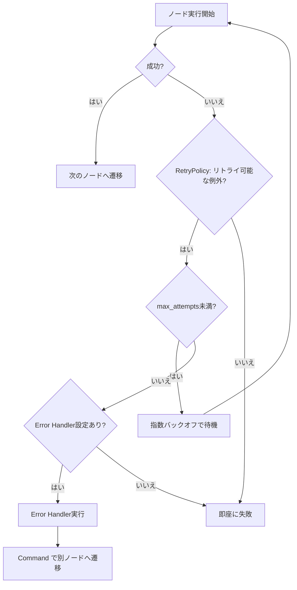

## ブログ概要（Summary）

本記事は [LangChain公式ブログ「Fault Tolerance in LangGraph: Retries, Timeouts and Error Handlers」](https://www.langchain.com/blog/fault-tolerance-in-langgraph)（2026年6月4日公開、著者: Quanzheng Long, Sydney Runkle）の解説記事です。

LangGraphのステートマシンモデルでエージェントワークフローを構築する際、外部API呼び出しやLLM推論といったノードは一時的な障害で失敗する可能性があります。このブログでは、LangGraph v1.2で導入された3つの耐障害性プリミティブ——**RetryPolicy**（指数バックオフによる自動リトライ）、**TimeoutPolicy**（実行時間とアイドル時間の二重制御）、**Error Handler**（リトライ上限超過後の補償ロジック）——の設計思想と実装パターンが解説されています。特に、航空券予約の**SAGAパターン**を使った補償トランザクションの実装例が示されており、分散システムの耐障害性設計をLangGraphのグラフ定義に組み込む具体的な手法が紹介されています。

この記事は [Zenn記事: LangGraph v1.2でステートマシン設計――5つの分岐パターンと本番運用](https://zenn.dev/0h_n0/articles/fa2c321db68933) の深掘りです。

## 情報源

- **種別**: 企業テックブログ（LangChain公式）
- **URL**: [https://www.langchain.com/blog/fault-tolerance-in-langgraph](https://www.langchain.com/blog/fault-tolerance-in-langgraph)
- **組織**: LangChain Inc.
- **著者**: Quanzheng Long, Sydney Runkle
- **発表日**: 2026年6月4日

## 技術的背景（Technical Background）

LLMエージェントが本番環境で動作する際、外部API呼び出し・データベースアクセス・LLM推論といった各ノードは、ネットワーク障害・レート制限・プロバイダー側の一時的エラーなど多様な障害に直面します。従来のLangGraphでは、ノード関数内部で`try/except`やカスタムリトライロジックを実装する必要がありました。これはノードのビジネスロジックと耐障害性ロジックが密結合し、テスト容易性と可読性を損なう原因となっていました。

Zenn記事で解説されている「パターン2: リトライループ」では、Stateにカウンタを持たせてリトライを制御する方法が紹介されています。この方法はグラフのトポロジーとして明示的にリトライフローを設計できる利点がありますが、すべてのノードにリトライロジックを組み込むとグラフが複雑化します。

LangGraph v1.2の耐障害性プリミティブは、このリトライロジックを**グラフ定義レベルに引き上げ**、ノード関数はビジネスロジックのみに集中できるようにする設計です。これは分散システム設計における「関心の分離（Separation of Concerns）」原則をグラフベースのエージェントフレームワークに適用したものと位置づけられます。

## 実装アーキテクチャ（Architecture）

### 3つの耐障害性プリミティブの階層構造

ブログでは、LangGraphの耐障害性を3層の階層構造として説明しています。



### 第1層: RetryPolicy — 一時的障害の自動回復

`RetryPolicy`は指数バックオフ（exponential backoff）による自動リトライを提供します。ブログによると、以下のパラメータで制御されます。

```python
from langgraph.types import RetryPolicy

retry = RetryPolicy(
    initial_interval=1.0,    # 初回リトライまでの待機秒数
    backoff_factor=2.0,      # バックオフ倍率（1→2→4→8秒）
    max_interval=30.0,       # 最大待機秒数の上限
    max_attempts=4,          # 最大リトライ回数（初回含む）
    jitter=True,             # ランダム化（thundering herd防止）
    retry_on=(ConnectionError, TimeoutError),  # リトライ対象の例外
)
```

ブログでは「RetryPolicyはプログラミングエラー（ValueError, TypeError）をリトライしない」と明記されています。これは、一時的な障害（transient failure）と永続的な障害（permanent failure）を区別する設計判断です。`retry_on`パラメータにより、`ConnectionError`、`TimeoutError`、HTTP 5xxレスポンスなどの一時的障害のみがリトライ対象となります。

リトライ間隔の計算式は以下のとおりです。

$$
t_n = \min\left(\text{initial\_interval} \times \text{backoff\_factor}^{n-1},\ \text{max\_interval}\right) + \epsilon
$$

ここで、$t_n$は$n$回目のリトライ前の待機時間、$\epsilon$は`jitter=True`の場合に加算されるランダム値（$0 \leq \epsilon < t_n \times 0.5$程度）です。ジッタを加えることで、複数のノードが同時にリトライした際のthundering herd問題（一斉再試行による過負荷）を緩和します。

### 第2層: TimeoutPolicy — 実行時間とアイドル時間の二重制御

`TimeoutPolicy`は2種類のタイムアウトを提供します。

```python
from langgraph.types import TimeoutPolicy

timeout = TimeoutPolicy(
    run_timeout=30.0,   # 実行全体の壁時間上限（秒）
    idle_timeout=5.0,   # 無活動検知のタイムアウト（秒）
)
```

ブログでは、`run_timeout`を「単一試行の壁時間のハードキャップ」と表現しています。これはノードの実行が無限にハングすることを防ぎます。一方、`idle_timeout`はチャネル書き込み・ストリーミングチャンク・コールバックイベントなどの「進捗シグナル」を監視し、活動が検知されるとタイマーがリセットされます。これにより、処理自体は進行しているが応答が遅い場合と、完全にフリーズした場合を区別できます。

タイムアウト超過時は`NodeTimeoutError`が送出され、この例外はRetryPolicyによってリトライ可能な例外として扱われます。つまり、TimeoutPolicyとRetryPolicyは組み合わせて使用することが想定されています。

### 第3層: Error Handler — リトライ上限超過後の補償ロジック

Error Handlerは、すべてのリトライが失敗した後に実行される最終的な回復ロジックです。

```python
from langgraph.errors import NodeError
from langgraph.types import Command


def handle_model_failure(state: AgentState, error: NodeError) -> Command:
    """LLM呼び出し失敗時の回復ハンドラ"""
    return Command(
        update={"error": f"{error.node}: {error.error}"},
        goto="fallback_node",
    )
```

ブログによると、Error Handlerは以下の特性を持ちます。

1. **リトライ上限超過後にのみ起動**: RetryPolicyの`max_attempts`を超えた場合にのみ呼ばれる
2. **障害コンテキストの注入**: `NodeError`パラメータにノード名と例外の詳細が含まれる
3. **アトミック実行**: 同じ実行サイクル内で実行され、チェックポイントが書き込まれてからハンドラがスケジュールされる
4. **ネスト不可**: Error Handler自体にError Handlerを設定することはできない

Error Handlerが`Command`を返すことで、状態の更新（`update`）とルーティング（`goto`）を同時に行えます。これは、Zenn記事で解説されているCommand APIの応用例です。

### ノード定義への統合

3つのプリミティブは`add_node`の引数として統一的に設定します。

```python
from langgraph.graph import StateGraph

builder = StateGraph(AgentState)
builder.add_node(
    "call_llm",
    call_llm,
    retry_policy=RetryPolicy(max_attempts=4, backoff_factor=2.0),
    timeout=TimeoutPolicy(run_timeout=30, idle_timeout=5),
    error_handler=handle_model_failure,
)
```

ブログでは、`set_node_defaults()`によるデフォルトポリシーの設定も紹介されています。グラフ全体に共通のリトライポリシーを設定し、特定のノードのみ上書きする運用が推奨されています。

## SAGAパターンによる補償トランザクション

ブログの実装例として特に注目すべきは、分散システムの**SAGAパターン**をLangGraphのError Handlerで実装する方法です。

### 問題設定

航空券予約ワークフローは3つの逐次ステップで構成されます。

1. **座席予約**（reserve seat）
2. **決済処理**（process payment）
3. **チケット発行**（issue ticket）

決済処理で障害が発生した場合、既に完了した座席予約を取り消す必要があります。これは分散トランザクションの古典的な問題です。

### LangGraphでの実装

```python
from typing import TypedDict


class BookingState(TypedDict):
    booking_id: str
    completed: list[str]  # 完了したステップの記録
    error: str | None


def to_compensate(state: BookingState, error: NodeError) -> Command:
    """障害時に補償ノードへ遷移するError Handler"""
    return Command(
        update={"completed": [f"FAILED:{error.node}"]},
        goto="compensate",
    )


def compensate(state: BookingState) -> dict:
    """完了済みステップを逆順に取り消す補償ノード"""
    for step in reversed(state["completed"]):
        if step == "seat_reserved":
            cancel_seat_reservation(state["booking_id"])
        elif step == "payment_processed":
            refund_payment(state["booking_id"])
    return {"error": "Booking cancelled due to failure"}
```

ポイントは、Error Handlerが`Command(goto="compensate")`で補償ノードへルーティングする設計です。補償ノードはStateの`completed`リストを逆順にたどり、実行済みのステップのみを取り消します。これにより、どのステップで障害が発生しても正確なロールバックが可能になります。

## Production Deployment Guide

### AWS実装パターン（コスト最適化重視）

LangGraphの耐障害性プリミティブを活用したエージェントワークフローをAWS上にデプロイする際の推奨構成を示します。

**トラフィック量別の推奨構成**:

| 規模 | 月間リクエスト | 推奨構成 | 月額コスト | 主要サービス |
|------|--------------|---------|-----------|------------|
| **Small** | ~3,000 (100/日) | Serverless | $50-150 | Lambda + Bedrock + DynamoDB |
| **Medium** | ~30,000 (1,000/日) | Hybrid | $300-800 | Lambda + ECS Fargate + ElastiCache |
| **Large** | 300,000+ (10,000/日) | Container | $2,000-5,000 | EKS + Karpenter + EC2 Spot |

**Small構成の詳細** (月額$50-150):
- **Lambda**: 1GB RAM, 60秒タイムアウト ($20/月) — RetryPolicyのバックオフ時間を考慮し、通常の30秒より長めに設定
- **Bedrock**: Claude 3.5 Haiku, Prompt Caching有効 ($80/月)
- **DynamoDB**: On-Demand ($10/月) — チェックポイント永続化
- **CloudWatch**: 基本監視 ($5/月)
- **API Gateway**: REST API ($5/月)

**Medium構成の詳細** (月額$300-800):
- **Lambda**: イベント処理 ($50/月)
- **ECS Fargate**: 0.5 vCPU, 1GB RAM × 2タスク ($120/月) — 長時間実行ワークフロー用
- **Bedrock**: Claude 3.5 Sonnet, Batch API活用 ($400/月)
- **ElastiCache Redis**: cache.t3.micro ($15/月) — ワークフロー状態キャッシュ
- **Application Load Balancer**: ($20/月)

**Large構成の詳細** (月額$2,000-5,000):
- **EKS**: コントロールプレーン ($72/月)
- **EC2 Spot Instances**: g5.xlarge × 2-4台 (平均$800/月)
- **Karpenter**: 自動スケーリング（追加コストなし）
- **Bedrock Batch**: 50%割引活用 ($2,000/月)
- **S3**: プロンプトキャッシュストレージ ($20/月)
- **CloudWatch + X-Ray**: 詳細監視 ($100/月)

**コスト削減テクニック**:
- Spot Instances使用で最大90%削減（EKS + Karpenter）
- Reserved Instances購入で最大72%削減（1年コミット）
- Bedrock Batch API使用で50%削減
- Prompt Caching有効化で30-90%削減

**コスト試算の注意事項**:
- 上記は2026年6月時点のAWS ap-northeast-1（東京）リージョン料金に基づく概算値です
- 実際のコストはトラフィックパターン、リージョン、バースト使用量により変動します
- 最新料金は [AWS料金計算ツール](https://calculator.aws/) で確認してください

### Terraformインフラコード

**Small構成 (Serverless): Lambda + Bedrock + DynamoDB**

```hcl
module "vpc" {
  source  = "terraform-aws-modules/vpc/aws"
  version = "~> 5.0"

  name = "langgraph-fault-tolerant-vpc"
  cidr = "10.0.0.0/16"
  azs  = ["ap-northeast-1a", "ap-northeast-1c"]
  private_subnets = ["10.0.1.0/24", "10.0.2.0/24"]

  enable_nat_gateway   = false
  enable_dns_hostnames = true
}

resource "aws_iam_role" "lambda_bedrock" {
  name = "langgraph-lambda-bedrock-role"

  assume_role_policy = jsonencode({
    Version = "2012-10-17"
    Statement = [{
      Action = "sts:AssumeRole"
      Effect = "Allow"
      Principal = { Service = "lambda.amazonaws.com" }
    }]
  })
}

resource "aws_iam_role_policy" "bedrock_invoke" {
  role = aws_iam_role.lambda_bedrock.id

  policy = jsonencode({
    Version = "2012-10-17"
    Statement = [{
      Effect   = "Allow"
      Action   = ["bedrock:InvokeModel", "bedrock:InvokeModelWithResponseStream"]
      Resource = "arn:aws:bedrock:ap-northeast-1::foundation-model/anthropic.claude-3-5-haiku*"
    }]
  })
}

resource "aws_lambda_function" "langgraph_handler" {
  filename      = "lambda.zip"
  function_name = "langgraph-fault-tolerant-handler"
  role          = aws_iam_role.lambda_bedrock.arn
  handler       = "index.handler"
  runtime       = "python3.12"
  timeout       = 60
  memory_size   = 1024

  environment {
    variables = {
      BEDROCK_MODEL_ID    = "anthropic.claude-3-5-haiku-20241022-v1:0"
      DYNAMODB_TABLE      = aws_dynamodb_table.checkpoints.name
      RETRY_MAX_ATTEMPTS  = "4"
      RETRY_BACKOFF       = "2.0"
      RUN_TIMEOUT         = "30"
    }
  }
}

resource "aws_dynamodb_table" "checkpoints" {
  name         = "langgraph-checkpoints"
  billing_mode = "PAY_PER_REQUEST"
  hash_key     = "PK"
  range_key    = "SK"

  attribute {
    name = "PK"
    type = "S"
  }

  attribute {
    name = "SK"
    type = "S"
  }

  ttl {
    attribute_name = "expire_at"
    enabled        = true
  }
}

resource "aws_cloudwatch_metric_alarm" "lambda_errors" {
  alarm_name          = "langgraph-error-rate"
  comparison_operator = "GreaterThanThreshold"
  evaluation_periods  = 2
  metric_name         = "Errors"
  namespace           = "AWS/Lambda"
  period              = 300
  statistic           = "Sum"
  threshold           = 5
  alarm_description   = "LangGraphノードのError Handler起動回数が閾値超過"

  dimensions = {
    FunctionName = aws_lambda_function.langgraph_handler.function_name
  }
}
```

**Large構成 (Container): EKS + Karpenter + Spot Instances**

```hcl
module "eks" {
  source  = "terraform-aws-modules/eks/aws"
  version = "~> 20.0"

  cluster_name    = "langgraph-fault-tolerant-cluster"
  cluster_version = "1.31"

  vpc_id     = module.vpc.vpc_id
  subnet_ids = module.vpc.private_subnets

  cluster_endpoint_public_access = true
  enable_cluster_creator_admin_permissions = true
}

resource "kubectl_manifest" "karpenter_provisioner" {
  yaml_body = <<-YAML
    apiVersion: karpenter.sh/v1
    kind: NodePool
    metadata:
      name: spot-nodepool
    spec:
      template:
        spec:
          requirements:
            - key: karpenter.sh/capacity-type
              operator: In
              values: ["spot"]
            - key: node.kubernetes.io/instance-type
              operator: In
              values: ["m6i.xlarge", "m6i.2xlarge"]
          nodeClassRef:
            group: karpenter.k8s.aws
            kind: EC2NodeClass
            name: default
      limits:
        cpu: "32"
        memory: "128Gi"
      disruption:
        consolidationPolicy: WhenEmptyOrUnderutilized
        consolidateAfter: 30s
  YAML
}

resource "aws_budgets_budget" "monthly" {
  name         = "langgraph-monthly-budget"
  budget_type  = "COST"
  limit_amount = "5000"
  limit_unit   = "USD"
  time_unit    = "MONTHLY"

  notification {
    comparison_operator       = "GREATER_THAN"
    threshold                 = 80
    threshold_type            = "PERCENTAGE"
    notification_type         = "ACTUAL"
    subscriber_email_addresses = ["ops@example.com"]
  }
}
```

### 運用・監視設定

**CloudWatch Logs Insights クエリ**:

```sql
-- RetryPolicy起動回数の追跡
fields @timestamp, node_name, retry_attempt, error_type
| filter retry_attempt > 0
| stats count(*) as retry_count by node_name, error_type, bin(1h)
| sort retry_count desc

-- Error Handler起動のレイテンシ分析
fields @timestamp, node_name, duration_ms, handler_type
| filter handler_type = "error_handler"
| stats pct(duration_ms, 95) as p95, pct(duration_ms, 99) as p99 by bin(5m)
```

**CloudWatch アラーム設定**:

```python
import boto3

cloudwatch = boto3.client('cloudwatch')

cloudwatch.put_metric_alarm(
    AlarmName='langgraph-retry-exhaustion',
    ComparisonOperator='GreaterThanThreshold',
    EvaluationPeriods=1,
    MetricName='RetryExhaustion',
    Namespace='LangGraph/FaultTolerance',
    Period=3600,
    Statistic='Sum',
    Threshold=10,
    ActionsEnabled=True,
    AlarmActions=['arn:aws:sns:ap-northeast-1:123456789:langgraph-alerts'],
    AlarmDescription='RetryPolicy上限超過が10件/時間を超過'
)
```

**X-Ray トレーシング設定**:

```python
from aws_xray_sdk.core import xray_recorder, patch_all

patch_all()

@xray_recorder.capture('langgraph_node_execution')
def execute_node_with_tracing(node_name: str, state: dict) -> dict:
    xray_recorder.put_annotation('node_name', node_name)
    xray_recorder.put_annotation('retry_count', state.get('retry_count', 0))
    xray_recorder.put_metadata('state_keys', list(state.keys()))

    result = graph.invoke(state)

    xray_recorder.put_metadata('output_keys', list(result.keys()))
    return result
```

### コスト最適化チェックリスト

**アーキテクチャ選択**:
- [ ] ~100 req/日 → Lambda + Bedrock (Serverless) - $50-150/月
- [ ] ~1000 req/日 → ECS Fargate + Bedrock (Hybrid) - $300-800/月
- [ ] 10000+ req/日 → EKS + Spot Instances (Container) - $2,000-5,000/月

**リソース最適化**:
- [ ] EC2: Spot Instances優先（最大90%削減、Karpenter自動管理）
- [ ] Reserved Instances: 1年コミットで72%削減（予測可能な負荷）
- [ ] Savings Plans: Compute Savings Plans検討
- [ ] Lambda: メモリサイズ最適化（CloudWatch Insights分析）
- [ ] ECS/EKS: アイドルタイムのスケールダウン（夜間0台）

**LLMコスト削減**:
- [ ] Bedrock Batch API: 50%割引（非リアルタイム処理）
- [ ] Prompt Caching: 30-90%削減（システムプロンプト固定）
- [ ] モデル選択: 開発はHaiku ($0.25/MTok)、本番複雑タスクはSonnet ($3/MTok)
- [ ] トークン数制限: max_tokens設定で過剰生成防止

**監視・アラート**:
- [ ] AWS Budgets: 月額予算設定（80%で警告、100%でアラート）
- [ ] CloudWatch アラーム: リトライ上限超過スパイク検知
- [ ] Cost Anomaly Detection: 自動異常検知
- [ ] 日次コストレポート: SNS/Slackへ自動送信

**リソース管理**:
- [ ] 未使用リソース削除: Lambda Insights, Trusted Advisor活用
- [ ] タグ戦略: 環境別（dev/staging/prod）でコスト可視化
- [ ] ライフサイクルポリシー: DynamoDBチェックポイントのTTL設定
- [ ] 開発環境: 夜間停止（ECS/EKS Auto Stop）

## パフォーマンス最適化（Performance）

ブログでは具体的なベンチマーク数値は示されていませんが、耐障害性プリミティブの設計から以下のパフォーマンス特性を読み取ることができます。

**RetryPolicyのオーバーヘッド**: 正常系では追加コストはゼロです。例外が発生した場合のみバックオフタイマーが起動するため、正常なノード実行のレイテンシには影響しません。

**TimeoutPolicyの監視コスト**: `idle_timeout`はチャネル書き込みやコールバックイベントを監視するため、微小なオーバーヘッドが発生します。ブログでは「進捗シグナル」として扱われるイベントの種類が限定されており、監視コストは最小限に設計されていると述べられています。

**Error Handlerのアトミック性**: Error Handlerはチェックポイント書き込み後にスケジュールされるため、障害発生時でもStateの一貫性が保証されます。これはチェックポイントの書き込みレイテンシ（DynamoDBの場合は通常1-5ms）が追加されることを意味します。

**チューニング指針**:
- `initial_interval`: 外部APIのレート制限に合わせて設定（例: OpenAI APIなら1-2秒）
- `max_attempts`: コスト影響を考慮（LLM呼び出しのリトライはトークンコストが累積）
- `run_timeout`: ノードの平均実行時間の3-5倍を設定
- `idle_timeout`: ストリーミング応答の場合は長めに設定（10-30秒）

## 運用での学び（Production Lessons）

ブログで示されているSAGAパターンの実装から、以下の運用上の教訓を読み取ることができます。

**教訓1: Error Handlerは「最後の砦」として設計する**

Error Handlerはリトライが尽きた後にのみ起動するため、正常系のフローで使用すべきではありません。ブログでは「クリーンアップ・アラート・補償ロジック」の3つが主要なユースケースとして挙げられています。

**教訓2: Stateに完了済みステップを記録する**

SAGAパターンの実装では、`completed`リストに各ステップの完了状態を記録しています。これにより、補償ノードはどのステップまで成功したかを正確に把握し、必要な取り消し処理のみを実行できます。Zenn記事のStateスキーマ設計（TypedDictやPydantic BaseModel）と組み合わせることで、型安全な補償フローが実現できます。

**教訓3: TimeoutPolicyのidle_timeoutを活用する**

`run_timeout`だけでなく`idle_timeout`を設定することで、「実行中だが進捗がない」状態を早期に検知できます。LLM推論ではストリーミング応答中にプロバイダー側でハングするケースがあり、`idle_timeout`がこの問題を解決します。

## 学術研究との関連（Academic Connection）

LangGraphの耐障害性設計は、分散システムの研究に根ざしています。

**SAGAパターン**: Hector Garcia-Molinaらが1987年に提唱したSAGAパターン（"Sagas", ACM SIGMOD 1987）は、長時間トランザクションを補償可能なサブトランザクションに分割する手法です。LangGraphのError Handler + Commandによる補償フローは、この古典的なパターンのLLMエージェント版といえます。

**指数バックオフ**: RetryPolicyの指数バックオフとジッタは、AWSのアーキテクチャブログで推奨されている"Exponential Backoff and Jitter"パターンに準拠しています。分散システムにおけるリトライの標準的手法です。

**サーキットブレーカー**: ブログでは直接言及されていませんが、`max_attempts`による上限設定はサーキットブレーカーパターンの簡易版と解釈できます。Martin Fowlerが提唱するCircuit Breakerパターンと比較すると、LangGraphの実装はノード単位での制御に特化している点が特徴です。

## まとめと実践への示唆

LangChain公式ブログで解説されているFault Toleranceプリミティブは、LangGraphのステートマシンモデルに耐障害性を組み込むための3層設計（RetryPolicy → TimeoutPolicy → Error Handler）を提供しています。

**実践への示唆**:

1. **段階的導入**: まず`RetryPolicy`のみをグラフ全体のデフォルトに設定し、障害パターンを観測してから`TimeoutPolicy`と`Error Handler`を追加する
2. **SAGAパターンの適用判断**: 複数の外部システムを逐次呼び出すワークフローでは、補償トランザクションの設計を事前に検討する
3. **Zenn記事のパターン2との使い分け**: 単純なリトライにはRetryPolicy、ビジネスロジックを含むリトライにはパターン2（Stateカウンタ）を使用する

## 参考文献

- **Blog URL**: [Fault Tolerance in LangGraph: Retries, Timeouts and Error Handlers](https://www.langchain.com/blog/fault-tolerance-in-langgraph)
- **Related Zenn article**: [LangGraph v1.2でステートマシン設計――5つの分岐パターンと本番運用](https://zenn.dev/0h_n0/articles/fa2c321db68933)
- **LangGraph公式ドキュメント**: [https://docs.langchain.com/oss/python/langgraph/](https://docs.langchain.com/oss/python/langgraph/)
- **SAGAパターン原論文**: Garcia-Molina, H. and Salem, K. (1987). "Sagas". ACM SIGMOD Record.
