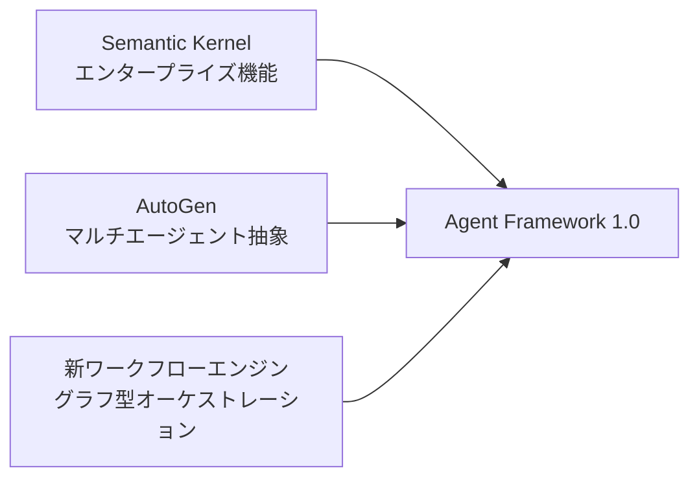

本記事は [Microsoft Agent Framework Version 1.0](https://devblogs.microsoft.com/agent-framework/microsoft-agent-framework-version-1-0/) の解説記事です。

## ブログ概要（Summary）

2026年4月3日、MicrosoftはAgent Framework 1.0のGA（General Availability）リリースを発表した。本フレームワークは、Semantic KernelのエンタープライズAI基盤とAutoGenのマルチエージェント会話抽象を統合し、.NETとPythonの両方で本番運用可能なエージェント開発基盤を提供する。7つのLLMプロバイダーのネイティブサポート、5種類のオーケストレーションパターン、MCP/A2Aプロトコル対応を特徴とする。

この記事は [Zenn記事: Semantic Kernel → Microsoft Agent Framework 1.0移行ガイド](https://zenn.dev/0h_n0/articles/f18d562b6f7d52) の深掘りです。

## 情報源

- **種別**: 企業テックブログ（Microsoft公式）
- **URL**: https://devblogs.microsoft.com/agent-framework/microsoft-agent-framework-version-1-0/
- **組織**: Microsoft Agent Framework Team
- **発表日**: 2026年4月3日

## 技術的背景（Technical Background）

### なぜ統合が必要だったのか

2025年以前、Microsoftは2つの独立したAIエージェントフレームワークを並行開発していた。

**Semantic Kernel**: 2023年にリリースされたエンタープライズAI SDK。Kernel/Plugin/KernelFunctionの3層抽象でLLMアプリケーションを構築する。テレメトリ、フィルター、セッション管理等のエンタープライズ機能が充実している一方、マルチエージェント機能は後付けの拡張であり、設計上の制約があった。

**AutoGen**: Microsoft Researchが開発したマルチエージェント会話フレームワーク。ConversableAgentによる柔軟なエージェント定義とGroupChatによる多者間会話が強みだが、エンタープライズ向けの機能（認証、監査ログ、コンプライアンス）が不足していた。

公式ブログによると、「Agent Framework は、Semantic Kernelのエンタープライズ基盤とAutoGenのシンプルなエージェント抽象を統合し、さらに新しいワークフローエンジンを追加したもの」と位置づけられている。



## 実装アーキテクチャ（Architecture）

### Agent型の統一

MAF 1.0の最も大きなアーキテクチャ変更は、Agent型の統一である。

| Semantic Kernel | 用途 | MAF 1.0 |
|----------------|------|---------|
| `ChatCompletionAgent` | チャット型エージェント | `Agent` |
| `AzureAIAgent` | Azure AI Studio連携 | `Agent` |
| `OpenAIAssistantAgent` | OpenAI Assistants API | `Agent` |

すべてのエージェントが単一の`Agent`クラスに統合され、プロバイダーの違いは`client`引数で吸収される。

```python
from agent_framework import Agent
from agent_framework.openai import OpenAIChatClient
from agent_framework.anthropic import AnthropicClient
from agent_framework.foundry import FoundryChatClient

openai_agent = Agent(client=OpenAIChatClient(model="gpt-4o"), name="A")
claude_agent = Agent(client=AnthropicClient(model="claude-sonnet-4-6"), name="B")
foundry_agent = Agent(client=FoundryChatClient(
    project_endpoint="https://...", model="gpt-4o"
), name="C")
```

### ツール登録の簡素化

Semantic Kernelでは`@kernel_function`デコレータ → `Plugin`クラス → `Kernel`インスタンスという3段階の登録が必要だった。MAF 1.0では素のPython関数をそのまま渡せる。

```python
from typing import Annotated

def search_docs(
    query: Annotated[str, "検索クエリ"]
) -> str:
    """ドキュメントを検索して結果を返します。"""
    return f"'{query}' の検索結果: ..."

agent = Agent(
    client=OpenAIChatClient(model="gpt-4o"),
    name="SearchAgent",
    instructions="ドキュメント検索アシスタント",
)

result = await agent.run("Pythonのasync/awaitについて", tools=[search_docs])
```

関数のDocstringがツールの説明として使われ、`Annotated`型ヒントがパラメータの説明になる。`@kernel_function`デコレータは不要である。

### 7プロバイダーのネイティブサポート

公式ブログで明記されている対応プロバイダーは以下の通り。

| プロバイダー | クライアントクラス | 環境変数 |
|-------------|-------------------|---------|
| Microsoft Foundry | `FoundryChatClient` | Azure CLI認証 |
| Azure OpenAI | `AzureOpenAIChatClient` | `AZURE_OPENAI_*` |
| OpenAI | `OpenAIChatClient` | `OPENAI_API_KEY` |
| Anthropic Claude | `AnthropicClient` | `ANTHROPIC_API_KEY` |
| Amazon Bedrock | `BedrockChatClient` | AWS認証情報 |
| Google Gemini | `GeminiChatClient` | `GOOGLE_API_KEY` |
| Ollama | `OllamaChatClient` | ローカル接続 |

### ミドルウェアパイプライン

MAF 1.0はASP.NETのミドルウェアパイプラインに着想を得た拡張機構を持つ。エージェントの動作をインターセプト・変換・拡張できる。

用途として公式ブログで挙げられているのは、コンテンツフィルタリング（不適切な出力の検閲）、構造化ログの出力（OpenTelemetry連携）、コンプライアンスポリシーの適用（PII除去等）である。

### メモリアーキテクチャ

3種類のメモリを標準サポートしている。

1. **会話履歴**: セッション内のメッセージ履歴
2. **Key-Value状態**: エージェント間で共有する構造化データ
3. **ベクトル検索**: RAG用のベクトルストア連携

バックエンドとして、Foundry Agent Service、Mem0、Redis、Neo4j、カスタムストアが利用可能である。

### 宣言的エージェント定義（YAML）

MAF 1.0では、エージェントの設定をYAMLファイルで宣言的に定義できる。

```yaml
name: CustomerSupportAgent
instructions: |
  あなたはカスタマーサポートのエージェントです。
  丁寧に日本語で対応してください。
client:
  provider: openai
  model: gpt-4o
tools:
  - search_faq
  - create_ticket
memory:
  type: redis
  ttl: 3600
```

YAMLファイルをバージョン管理に含めることで、エージェントの設定変更を追跡・レビューできる。

## パフォーマンス最適化（Performance）

公式ブログでは具体的なベンチマーク数値は公開されていないが、以下のアーキテクチャ上の最適化が言及されている。

**チェックポイント&ハイドレーション**: ワークフローの途中状態を永続化し、再開可能にする機構。長時間実行されるワークフロー（人間の承認待ち等）で、プロセス再起動後も途中から再開できる。

**並列実行**: ワークフローエンジンがグラフの独立したノードを並列実行し、レイテンシを削減する。

**ストリーミング**: `agent.run(input, stream=True)`で逐次トークン出力に対応。ユーザー体感のレイテンシを低減する。

## 運用での学び（Production Lessons）

公式ブログおよびMicrosoft Learnの移行ガイドから得られる運用上の知見は以下の通り。

**段階的移行の推奨**: Microsoftは、Semantic Kernel v1.xをMAF 1.0 GAから少なくとも1年間サポートすると表明している。新規プロジェクトにはMAFが推奨されるが、既存プロジェクトの移行は段階的に進めることが可能である。

**互換レイヤー**: Semantic Kernel v1.38以降に追加された`.as_agent_framework_tool()`メソッドにより、既存の`KernelFunction`をMAFのツールとしてそのまま利用できる。

**プロバイダー非依存の設計**: `Agent`クラスがプロバイダーに依存しないため、開発時はOllama（ローカルLLM）、本番はAzure OpenAIという切り替えが1行で完了する。

**.envの非自動読み込み**: MAFは`.env`ファイルを自動読み込みしない。`python-dotenv`の`load_dotenv()`を明示的に呼び出す必要がある点に注意が必要である。

## 学術研究との関連（Academic Connection）

MAF 1.0の設計は、以下の学術研究に基づいている。

- **AutoGen (Wu et al., 2023)**: ConversableAgentの会話型マルチエージェント抽象 → MAFの`Agent`クラスとオーケストレーションパターンの基盤
- **Magentic-One (Fourney et al., 2024)**: タスク分解と動的エージェント割り当てのアーキテクチャ → MAFのMagentic-Oneオーケストレーションパターンとして統合
- **MCP (Anthropic, 2024)**: LLMとツールの接続標準プロトコル → MAFのネイティブMCPサポート

## まとめと実践への示唆

Microsoft Agent Framework 1.0は、エンタープライズAIエージェント開発の新しいスタンダードとなる可能性がある。Agent型の統一・ツール登録の簡素化・宣言的YAML定義により、開発者の認知負荷が大幅に低減されている。

既存のSemantic Kernelユーザーにとっては、互換レイヤーを活用した段階的移行が最もリスクの低いアプローチである。新規プロジェクトでは、MAF 1.0をベースに設計し、7プロバイダー対応とMCP統合の恩恵を受けることが推奨される。

## Production Deployment Guide

### AWS実装パターン（コスト最適化重視）

MAF 1.0をAWS上にデプロイする場合、7プロバイダーネイティブ対応を活かしたマルチモデル構成が有効である。

| 規模 | 月間リクエスト | 推奨構成 | 月額コスト | 主要サービス |
|------|--------------|---------|-----------|------------|
| **Small** | ~3,000 (100/日) | Serverless | $80-200 | Lambda + Bedrock + DynamoDB |
| **Medium** | ~30,000 (1,000/日) | Container | $400-1,200 | ECS Fargate + Bedrock + ElastiCache |
| **Large** | 300,000+ (10,000/日) | Kubernetes | $3,000-8,000 | EKS + Karpenter + EC2 Spot |

**Small構成の詳細** (月額$80-200):
- **Lambda**: Python 3.12, 512MB RAM, 30秒タイムアウト ($15/月)
- **Bedrock**: Claude 3.5 Haiku（メインエージェント）+ Llama 3.1（軽量タスク） ($100/月)
- **DynamoDB**: On-Demand、Key-Value状態永続化 ($10/月)
- **S3**: YAML定義ファイルのバージョン管理 ($5/月)

**MAF固有の考慮事項**:
- MAFの宣言的YAML定義をS3に格納し、Lambda起動時に読み込む構成により、エージェント設定変更をデプロイなしで反映可能
- Bedrockの`AnthropicClient`とOpenAIの`OpenAIChatClient`をエージェントごとに切り替えることで、コスト/精度のバランスを最適化
- ミドルウェアパイプラインでOpenTelemetry → CloudWatch Logs連携を設定し、エージェントの推論プロセスを可視化

**コスト試算の注意事項**:
- 上記は2026年6月時点のAWS ap-northeast-1（東京）リージョン料金に基づく概算値
- 実際のコストはエージェント数、ターン数、LLMプロバイダー選択により変動
- 最新料金は [AWS料金計算ツール](https://calculator.aws/) で確認してください

### コスト最適化チェックリスト

**アーキテクチャ選択**:
- [ ] ~100 req/日 → Lambda + Bedrock (Serverless) - $80-200/月
- [ ] ~1,000 req/日 → ECS Fargate + Bedrock (Container) - $400-1,200/月
- [ ] 10,000+ req/日 → EKS + Spot (Kubernetes) - $3,000-8,000/月

**LLMコスト削減**:
- [ ] エージェントごとにモデルティアを最適化（ルーティング → Haiku、本文生成 → Sonnet）
- [ ] Bedrock Prompt Caching有効化（instructions部分をキャッシュ）
- [ ] Bedrock Batch API使用（非リアルタイム処理）

**監視・アラート**:
- [ ] OpenTelemetry → CloudWatch連携（ミドルウェアパイプライン経由）
- [ ] AWS Budgets: 月額予算設定（80%で警告）
- [ ] Bedrockトークン使用量のダッシュボード

## 参考文献

- **Blog URL**: https://devblogs.microsoft.com/agent-framework/microsoft-agent-framework-version-1-0/
- **Migration Guide**: https://learn.microsoft.com/en-us/agent-framework/migration-guide/from-semantic-kernel/
- **GitHub**: https://github.com/microsoft/agent-framework
- **Related Zenn article**: https://zenn.dev/0h_n0/articles/f18d562b6f7d52
