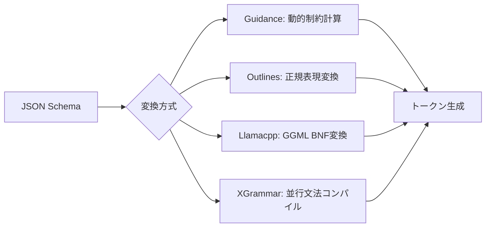

本記事は [JSONSchemaBench: A Rigorous Benchmark of Structured Outputs for Language Models](https://arxiv.org/abs/2501.10868)（Geng et al., 2025年1月）の解説記事です。

## 論文概要（Abstract）

LLMからの構造化出力生成において、JSON Schemaに基づく制約付きデコーディング（Constrained Decoding）は広く採用されているが、体系的な評価は不十分であった。本論文は10,000件の実世界JSONスキーマからなるベンチマーク「JSONSchemaBench」を構築し、6つの最先端フレームワーク（Guidance、Outlines、Llamacpp、XGrammar、OpenAI、Gemini）を「効率」「網羅性」「出力品質」の3軸で評価している。結果として、制約付きデコーディングが生成速度を最大50%向上させつつタスク精度を最大4%改善できることを実証した。

この記事は [Zenn記事: Function Callingスキーマ設計パターン：3社APIで堅牢なツール定義を構築する](https://zenn.dev/0h_n0/articles/f89e983139d00a) の深掘りです。

## 情報源

- **arXiv ID**: 2501.10868
- **URL**: https://arxiv.org/abs/2501.10868
- **著者**: Saibo Geng, Hudson Cooper, Michał Moskal, et al.
- **発表年**: 2025
- **分野**: cs.CL, cs.AI

## 背景と動機（Background & Motivation）

Function Callingにおいてstrict mode（OpenAI）やgrammar-constrained sampling（Claude）が提供する「スキーマへの100%準拠保証」は、制約付きデコーディングの技術に基づいている。しかし、各フレームワークの実装品質には大きな差があり、以下の課題が存在した：

- どのフレームワークがどの複雑度のスキーマを正しく処理できるのか定量的に不明
- 「スキーマを受け付ける（declared coverage）」ことと「実際に正しい出力を生成する（empirical coverage）」ことの乖離が未測定
- 制約付きデコーディングのオーバーヘッド（コンパイル時間、トークン生成速度）の比較が不在

この問題は、Zenn記事で解説した「strict modeを有効にすればスキーマ準拠100%」という前提の裏側にある実装の現実を明らかにするものである。

## 主要な貢献（Key Contributions）

- **貢献1**: 10,000件の実世界JSONスキーマを複雑度別に分類したベンチマーク「JSONSchemaBench」の構築
- **貢献2**: 効率（Efficiency）・網羅性（Coverage）・品質（Quality）の3軸による体系的評価フレームワーク
- **貢献3**: 6つのフレームワークの詳細比較と、実務者向けの選択ガイドラインの提供

## 技術的詳細（Technical Details）

### 制約付きデコーディングの原理

制約付きデコーディングは、LLMのトークン生成過程にJSON Schemaの制約を統合する手法である。基本的なメカニズムは以下のロジットマスキングで表現される：

$$
p'(t_i | t_{<i}) = \begin{cases} \frac{p(t_i | t_{<i})}{\sum_{t_j \in \mathcal{V}_{\text{valid}}} p(t_j | t_{<j})} & \text{if } t_i \in \mathcal{V}_{\text{valid}} \\ 0 & \text{otherwise} \end{cases}
$$

ここで：
- $p(t_i | t_{<i})$: モデルの元のトークン確率
- $\mathcal{V}_{\text{valid}}$: 現在の状態でスキーマ違反にならないトークンの集合
- $p'(t_i | t_{<i})$: マスキング後の正規化確率

各ステップでスキーマの状態を追跡し、次に生成可能なトークンのみを許可する。これにより**生成段階でスキーマ違反が物理的に不可能**となる。

### ベンチマーク構成

JSONSchemaBenchは9,558件のスキーマを以下の複雑度層に分類している：

| データセット | 件数 | 複雑度 | 特徴 |
|:---|:---|:---|:---|
| GlaiveAI-2K | 1,707 | 低〜中 | Function Callingの関数シグネチャ |
| GitHub-Easy | 1,943 | 低 | 10-30フィールド |
| GitHub-Medium | 1,976 | 中 | 30-100フィールド |
| GitHub-Hard | 1,240 | 高 | 100-500フィールド |
| Kubernetes | 1,064 | 高 | 階層的設定ファイル |
| JSONSchemaStore | 492 | 非常に高 | 多様な実世界用途 |

重要なのは**GlaiveAI-2K**がFunction Callingの関数定義スキーマを含む点である。strict modeが実際に処理するスキーマの多くはこの複雑度に相当する。

### 3軸の評価メトリクス

#### 軸1: 効率（Efficiency）

3つのメトリクスで測定：

- **Grammar Compilation Time (GCT)**: スキーマから文法へのコンパイル時間（1回限り）
- **Time to First Token (TTFT)**: 最初のトークン出力までのレイテンシ
- **Time Per Output Token (TPOT)**: トークンあたりの生成時間

#### 軸2: 網羅性（Coverage）

3段階のカバレッジを区別する：

$$
\text{Compliance Rate} = \frac{\text{Empirical Coverage}}{\text{Declared Coverage}}
$$

- **Declared Coverage**: フレームワークがスキーマをクラッシュなしに受理する割合
- **Empirical Coverage**: 生成された出力が実際にスキーマに合格する割合
- **Compliance Rate**: 「受理したら正しく生成できるか」の信頼度

この区別は極めて重要である。フレームワークがスキーマを「対応済み」と報告しても、実際の出力がバリデーションを通らないケースが多数存在するためである。

#### 軸3: 出力品質（Quality）

制約付きデコーディングがタスク精度に与える影響を以下のタスクで測定：
- Last Letter: 文字列操作（推論+構造化出力）
- Shuffle Objects: 多肢選択（選択+構造化出力）
- GSM8K: 算術推論（計算+構造化出力）

### 評価対象フレームワーク

#### オープンソース



| フレームワーク | 変換方式 | コンパイル時間 | 特徴 |
|:---|:---|:---|:---|
| Guidance | 動的制約計算 | ~0.00秒 | Token-healing実装、最速 |
| Outlines | 正規表現変換 | 3-13秒 | 事前に完全変換、高オーバーヘッド |
| Llamacpp | GGML BNF変換 | ~0.05秒 | 動的制約更新、中程度 |
| XGrammar | 並行文法コンパイル | ~0.02秒 | プロンプトprefill中に並行処理 |

#### クローズドソースAPI

- **OpenAI**: 保守的実装。対応するJSON Schemaの機能は限定的だが、対応した場合の準拠率は97%以上
- **Gemini**: 同様に保守的。極めて限定的なスキーマのみ対応（GitHub-Easyで7%の実効カバレッジ）

### 主要な実験結果

#### 効率の比較（Llama-3.1-8B、GlaiveAIデータセット）

論文Table 3より：

| フレームワーク | GCT | TTFT | TPOT | 制約なし比 |
|:---|:---|:---|:---|:---|
| LM-only (制約なし) | N/A | 0.10秒 | 15.40ms | 基準 |
| **Guidance** | 0.00秒 | 0.24秒 | **6.37ms** | **2.4倍高速** |
| Llamacpp | 0.05秒 | 0.20秒 | 29.98ms | 1.9倍低速 |
| Outlines | 3.48秒 | 3.65秒 | 30.33ms | 2.0倍低速 |
| XGrammar | 0.02秒 | 0.18秒 | 36.92ms | 2.4倍低速 |

注目すべき結果：Guidanceは制約なし生成よりも**2.4倍高速**にトークンを生成する。これはGuidance独自の「guidance acceleration」技術により、制約によって探索空間が狭まることでサンプリングが効率化されるためである。

#### 網羅性の比較（Llama-3.2-1B）

論文Table 5より、GitHub-Easyデータセットでの結果：

| フレームワーク | Declared | Empirical | Compliance Rate |
|:---|:---|:---|:---|
| **Guidance** | 90% | **86%** | **96%** |
| Llamacpp | 85% | 75% | 88% |
| XGrammar | 91% | 79% | 87% |
| Outlines | 71% | 59% | 83% |
| OpenAI | 30% | 29% | 97% |
| Gemini | 8% | 7% | 88% |

GitHub-Hardデータセット（100-500フィールド）での結果：

| フレームワーク | Empirical Coverage |
|:---|:---|
| Guidance | 41% |
| Llamacpp | 39% |
| XGrammar | 28% |
| Outlines | 3%（タイムアウト多発） |

#### 品質への影響（Llama-3.1-8B）

論文Table 7より：

| タスク | LM-only | Guidance | Llamacpp | XGrammar |
|:---|:---|:---|:---|:---|
| Last Letter | 50.7% | **54.0%** (+3.3) | 52.0% | 51.2% |
| Shuffle Objects | 52.6% | **55.9%** (+3.3) | 52.6% | 52.7% |
| GSM8K | 80.1% | **83.8%** (+3.7) | 82.4% | 83.7% |

制約付きデコーディングはフォーマット保証だけでなく、**タスク精度自体を3-4%向上させる**。この効果は、モデルが「JSONの閉じ括弧を忘れる」などのフォーマットエラーに費やすトークンを節約し、推論に集中できるようになるためと著者らは分析している。

### 失敗パターンの分類

著者らはフレームワークの失敗を3タイプに分類している：

1. **コンパイルエラー**: スキーマを文法に変換できない（Outlines: 42カテゴリ、Llamacpp: 37カテゴリ）
2. **過剰制約（Over-constrained）**: 本来有効な出力を拒否する（Outlines: 16カテゴリ）
3. **過少制約（Under-constrained）**: 無効な出力を許可する（XGrammar: 38カテゴリ）

```python
# 過剰制約と過少制約のトレードオフを示すコード例
from jsonschema import validate, ValidationError

schema = {
    "type": "object",
    "properties": {
        "name": {"type": "string", "minLength": 1},
        "age": {"type": "integer", "minimum": 0}
    },
    "required": ["name", "age"],
    "additionalProperties": False
}

# Over-constrained: 有効なJSONなのにフレームワークが拒否
valid_output = {"name": "Alice", "age": 30}
# → OutlinesがminLength制約の処理でタイムアウト

# Under-constrained: 無効なJSONなのにフレームワークが許可
invalid_output = {"name": "", "age": -1}
# → XGrammarがminLength/minimum制約を無視して生成
```

この「過剰制約 vs 過少制約」のトレードオフは、Zenn記事で解説したstrict modeの実装の核心に関わる問題である。OpenAI/Claudeが「全フィールドrequired + additionalProperties: false」を要求するのは、過少制約を防ぐための設計判断であることが本論文から理解できる。

## 実装のポイント

### Function Callingスキーマへの示唆

本論文の知見をFunction Callingスキーマ設計に適用すると：

```python
from typing import Any

# ベンチマーク結果に基づくスキーマ複雑度ガイドライン
SCHEMA_COMPLEXITY_GUIDELINES = {
    "safe_features": [
        "type", "properties", "required",
        "enum", "const", "additionalProperties",
    ],
    "moderate_features": [
        "oneOf", "anyOf", "allOf",
        "items", "prefixItems",
    ],
    "risky_features": [
        "pattern", "format",
        "minItems", "maxItems",
        "minLength", "maxLength",
        "minimum", "maximum",
    ],
}


def assess_schema_compatibility(schema: dict[str, Any]) -> dict[str, Any]:
    """スキーマのフレームワーク互換性を評価する
    
    JSONSchemaBenchの結果に基づき、使用する機能ごとの
    サポート率を推定する。
    """
    used_features = extract_features(schema)
    
    safe_count = sum(
        1 for f in used_features
        if f in SCHEMA_COMPLEXITY_GUIDELINES["safe_features"]
    )
    risky_count = sum(
        1 for f in used_features
        if f in SCHEMA_COMPLEXITY_GUIDELINES["risky_features"]
    )
    
    # 論文の結果: safe_featuresのみなら95%+のカバレッジ
    # risky_featuresを含むと50%以下に低下する可能性
    estimated_coverage = max(0.3, 0.95 - risky_count * 0.15)
    
    return {
        "estimated_coverage": estimated_coverage,
        "safe_features_used": safe_count,
        "risky_features_used": risky_count,
        "recommendation": (
            "strict mode安全" if risky_count == 0
            else "バリデーション併用推奨"
        ),
    }


def extract_features(schema: dict[str, Any]) -> list[str]:
    """スキーマから使用されているJSON Schema機能を抽出"""
    features = []
    for key in schema:
        if key in ("type", "properties", "required", "enum",
                   "const", "additionalProperties", "oneOf",
                   "anyOf", "allOf", "items", "prefixItems",
                   "pattern", "format", "minItems", "maxItems",
                   "minLength", "maxLength", "minimum", "maximum"):
            features.append(key)
    if "properties" in schema:
        for prop_schema in schema["properties"].values():
            if isinstance(prop_schema, dict):
                features.extend(extract_features(prop_schema))
    return features
```

### 実務者向けフレームワーク選択ガイド

論文の結果に基づく選択基準：

| 要件 | 推奨フレームワーク | 根拠 |
|:---|:---|:---|
| 本番環境で速度重視 | Guidance | TPOT 6.37ms（制約なしより高速） |
| 準拠率重視 | OpenAI API / Guidance | 97% / 96% compliance |
| 複雑スキーマ対応 | Guidance > Llamacpp | GitHub-Hardで41% / 39% |
| コスト最小化 | Llamacpp | 無料、中程度の性能 |
| 信頼性＋簡易スキーマ | OpenAI/Claude strict mode | 対応範囲内なら100%保証 |

## 実験結果の詳細分析

### OpenAI/Claudeのstrict modeの位置付け

本論文が明らかにした重要な事実：OpenAI・GeminiのAPIは「対応するスキーマ」を厳しく制限することで、高い準拠率（97%+）を達成している。つまり、Zenn記事で解説した「全フィールドrequired + additionalProperties: false」という制約は、**過少制約を防ぐためのAPI設計判断**であり、技術的制約ではない。

```python
# OpenAI strict modeが要求する制約の技術的根拠
# JSONSchemaBenchの結果から:
#
# 1. additionalProperties: false → 過少制約防止（XGrammarの38カテゴリ失敗を回避）
# 2. 全フィールドrequired → 生成の確定性向上（optional処理のバグを回避）
# 3. nullable型でoptional表現 → スキーマ構造の単純化（パーサーの複雑度低減）

strict_mode_constraints = {
    "additionalProperties": False,   # 未定義フィールド生成を物理的に防止
    "all_fields_required": True,     # 状態遷移の確定性を保証
    "nullable_for_optional": True,   # ["string", "null"]でoptionalを表現
}
```

### 制約付きデコーディングが品質を向上させるメカニズム

論文の品質実験で制約付きデコーディングがタスク精度を3-4%向上させる理由について、著者らは以下のメカニズムを仮説として提示している：

1. **トークン節約効果**: フォーマット制御に使うトークンが不要になり、推論に集中できる
2. **構造的ガイド効果**: 「まずreasoningフィールドを埋め、次にanswerフィールドを埋める」という構造が思考の整理を促進
3. **エラー回復不要効果**: JSONの閉じ括弧忘れやカンマ漏れなどの回復コストがゼロ

## 関連研究

- **Outlines**（Willard & Louf, 2023）: 正規表現ベースの制約付きデコーディングの先駆的研究。本論文はOutlinesの限界（タイムアウト、コンパイル遅延）を定量化
- **XGrammar**（Li et al., 2024）: BNF文法ベースの高速制約付きデコーディング。本論文はXGrammarの過少制約問題（38カテゴリ）を特定
- **OpenAI Structured Outputs**（OpenAI, 2024）: strict modeの公式実装。本論文はその保守的設計の合理性を実証
- **SGLang**（Zheng et al., 2024）: 構造化生成を統合したLLMサービングフレームワーク

## まとめ

JSONSchemaBenchは、Function Callingのstrict modeを支える制約付きデコーディング技術の実態を明らかにした重要なベンチマークである。主な知見：

1. 制約付きデコーディングは速度向上（Guidanceで2.4倍高速）と品質向上（+3-4%精度）を同時に達成できる
2. 「スキーマを受理する」ことと「正しく生成する」ことには最大14%のギャップが存在する（Llamacpp: 85%宣言 vs 75%実効）
3. OpenAI/Claudeの「全フィールドrequired + additionalProperties: false」制約は、過少制約を防ぐための合理的な設計判断
4. 複雑なスキーマ（100フィールド以上）では全フレームワークのカバレッジが41%以下に低下する
5. pattern、format、minItems等の「リスキーな機能」はカバレッジを大幅に低下させるため、Function Callingスキーマでは避けることが推奨される

スキーマ設計においては、「safe features」（type、properties、required、enum、additionalProperties）のみを使用することで、95%以上のフレームワーク互換性を確保できる。
