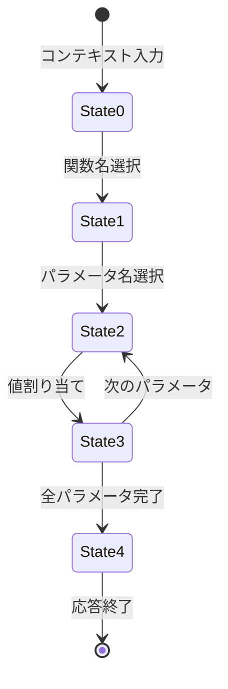

本記事は [ToolPRM: Fine-Grained Inference Scaling of Structured Outputs for Function Calling](https://arxiv.org/abs/2510.14703)（Lin et al., 2025年10月、ACL 2026 採択）の解説記事です。

## 論文概要（Abstract）

推論時スケーリング（test-time compute scaling）は数学的推論タスクで成功を収めてきたが、Function Callingの構造化出力には適用されていなかった。本論文は、関数呼び出しの内部ステップ（関数名選択、パラメータ名特定、値割り当て）を細粒度で評価するプロセス報酬モデル「ToolPRM」を提案する。関数マスキングによるステップレベルアノテーションデータセットを構築し、ビームサーチと組み合わせることで、既存の粗粒度手法を上回る精度を達成した。構造化出力特有の「explore more but retain less（広く探索し、少なく残す）」原則を実証している。

この記事は [Zenn記事: Function Callingスキーマ設計パターン：3社APIで堅牢なツール定義を構築する](https://zenn.dev/0h_n0/articles/f89e983139d00a) の深掘りです。

## 情報源

- **arXiv ID**: 2510.14703
- **URL**: https://arxiv.org/abs/2510.14703
- **著者**: Jianghao Lin, Yuanyuan Shi, Xin Peng, et al.
- **発表年**: 2025（ACL 2026 採択）
- **分野**: cs.CL, cs.AI

## 背景と動機（Background & Motivation）

Function Callingの出力は構造化されたJSON形式であるため、数学的推論とは根本的に異なる性質を持つ：

**構造化出力の不可逆性**: 数学的推論では中間ステップのエラーが後で修正される可能性があるが、JSON出力では**早期のエラーが軌道全体を無効化する**。例えば、関数名を間違えた時点で、後続のパラメータがすべて無意味になる。

この不可逆性は、Zenn記事で解説した以下の設計パターンの理論的根拠を提供する：
- **strict modeの価値**: 不正な関数名・パラメータ名の生成を物理的に防止することで、不可逆エラーの発生を根本的に排除
- **enum制約の重要性**: 選択肢を限定することで、早期エラーの確率を低減
- **description設計の3原則**: 正確なdescriptionにより、関数名選択ステップでのエラーを防止

## 主要な貢献（Key Contributions）

- **貢献1**: Function Callingを5つの細粒度状態（関数名選択、パラメータ選択、値割り当て、パラメータ完了、全体完了）に分解し、各ステップを独立に評価するプロセス報酬モデル
- **貢献2**: 関数マスキング（Function Masking）によるステップレベルアノテーションの自動生成手法
- **貢献3**: 構造化出力における「広く探索し、少なく残す（explore more but retain less）」原則の発見と実証

## 技術的詳細（Technical Details）

### Function Callingの5状態分解

ToolPRMは、従来「不可分の単位」として扱われていたFunction Callを5つの意思決定ステップに分解する：



| 状態 | アノテーションタグ | 評価内容 |
|:---|:---|:---|
| State #0 | (入力) | マスク済み関数候補のコンテキスト |
| State #1 | `<FUNC_NAME>` | 関数名の正否 |
| State #2 | `<ARG_VALUE>` | パラメータ名-値ペアの正否（繰り返し可能） |
| State #3 | `<PARAM_FINISH>` | 全パラメータの正否 |
| State #4 | `<FUNC_FINISH>` / `<TOTAL_FINISH>` | 関数呼び出し/全体の正否 |

### プロセス報酬モデルの定式化

各ステップ$(s_t, a_t)$に対して報酬$r_t$を予測する生成的報酬モデル：

$$
\mathcal{L} = -\mathbb{E}\left[\log p_\theta(r_t | s_t, a_t)\right]
$$

ここで：
- $s_t$: ステップ$t$での状態（これまでの生成履歴）
- $a_t$: ステップ$t$でのアクション（生成されたトークン列）
- $r_t \in \{+, -\}$: バイナリ報酬トークン
- $\theta$: 報酬モデルのパラメータ

スコアリング関数は報酬トークンのロジットから計算：

$$
\text{score}(s_t, a_t) = \frac{e^{s_+}}{e^{s_+} + e^{s_-}}
$$

$s_+$, $s_-$はそれぞれ「+」「-」トークンのロジット値である。

### 関数マスキング（Function Masking）

汎化能力を向上させるため、訓練データの関数名とパラメータ名をランダム文字列に置換する：

```python
# 関数マスキングの概念的実装
import random
import string


def mask_function_call(tool_definition: dict) -> dict:
    """関数名・パラメータ名をランダム文字列に置換
    
    目的: モデルが関数名を「暗記」するのではなく、
    コンテキスト（description）から正しい関数を選択する能力を学習させる
    """
    # ランダムな関数名を生成
    masked_name = "".join(
        random.choices(string.ascii_lowercase, k=8)
    )
    
    # パラメータ名もマスク
    masked_params = {}
    param_mapping = {}
    for param_name, param_schema in tool_definition["parameters"]["properties"].items():
        masked_param = "".join(
            random.choices(string.ascii_lowercase, k=6)
        )
        param_mapping[param_name] = masked_param
        masked_params[masked_param] = param_schema
    
    return {
        "name": masked_name,
        "description": tool_definition["description"],  # descriptionは保持
        "parameters": {
            "type": "object",
            "properties": masked_params,
        },
        "original_mapping": {
            "name": tool_definition["name"],
            "params": param_mapping,
        },
    }
```

この手法により、モデルは関数名の文字列パターンではなく、**descriptionの意味的内容**から正しい関数を選択する能力を獲得する。これはZenn記事で強調した「description設計の重要性」を報酬モデルの訓練レベルで裏付ける知見である。

### ビームサーチとの統合

ToolPRMをビームサーチに統合する際の重要な発見が「explore more but retain less」原則である：

$$
\text{Score}(\tau) = \sum_{t=1}^{T} \text{score}(s_t, a_t)
$$

ビームサーチのパラメータ：
- $N$: 保持するビーム数（retain）
- $M$: 各ビームから展開する候補数（explore）

**構造化出力の特殊性**:

| タスク | 最適設定 | 理由 |
|:---|:---|:---|
| 数学的推論 | 大きいN, 小さいM | 多様な推論パスを長く保持する価値がある |
| **Function Calling** | **小さいN, 大きいM** | 早期エラーは不可逆なので、広く探索して最良のパスのみを早期に絞る |

```python
# ToolPRMビームサーチの概念的実装
def toolprm_beam_search(
    model,
    reward_model,
    prompt: str,
    tools: list[dict],
    beam_width_n: int = 2,     # 小さいN: 少なく残す
    expansion_m: int = 8,       # 大きいM: 広く探索
) -> str:
    """ToolPRMによるビームサーチ付きFunction Call生成"""
    
    # 初期ビーム
    beams = [{"tokens": [], "score": 0.0}]
    
    for step in ["func_name", "param_name", "param_value", "finish"]:
        candidates = []
        
        for beam in beams:
            # 各ビームからM個の候補を生成
            expansions = model.generate_candidates(
                prompt + "".join(beam["tokens"]),
                num_candidates=expansion_m,
                step_type=step,
            )
            
            for expansion in expansions:
                # ToolPRMでステップレベルのスコアを計算
                step_score = reward_model.score(
                    context=prompt + "".join(beam["tokens"]),
                    action=expansion,
                )
                candidates.append({
                    "tokens": beam["tokens"] + [expansion],
                    "score": beam["score"] + step_score,
                })
        
        # 上位N個のみ保持（積極的プルーニング）
        candidates.sort(key=lambda c: c["score"], reverse=True)
        beams = candidates[:beam_width_n]
    
    return "".join(beams[0]["tokens"])
```

### 訓練データの構成

| 項目 | 数値 |
|:---|:---|
| ステップレベルサンプル（訓練） | 5,111,988 |
| 軌道レベルサンプル（訓練） | 594,434 |
| ステップレベルサンプル（テスト） | 569,977 |
| 軌道レベルサンプル（テスト） | 66,049 |
| サンプルあたり平均アノテーション数 | 6.25 |
| 総アノテーション済みサンプル | 192,061 |

データソースはxlam-function-calling-60kおよびxlam-irrelevance-7.5kデータセット。関数マスキングにより4-5倍に拡張。

### アーキテクチャと訓練設定

- **バックボーン**: Hammer2.1-3B（報酬モデル）
- **訓練**: SFT、5エポック
- **バッチサイズ**: 1,024
- **学習率**: 1e-3（ウォームアップ率0.008、線形減衰）
- **推論**: Temperature 0.8

## 実験結果

### ベンチマーク性能（論文Table 3より）

#### BFCL（Berkeley Function Calling Leaderboard）

| モデル | ベースライン | +ToolPRM | 改善 |
|:---|:---|:---|:---|
| Hammer2.1-1.5B | 82.79% | **85.61%** | +2.82 |
| Hammer2.1-3B | 86.86% | **88.88%** | +2.02 |
| Hammer2.1-7B | 88.65% | **89.52%** | +0.87 |

**小型モデルほど改善幅が大きい**（1.5B: +2.82 vs 7B: +0.87）。これは大型モデルほど内部的な判断が既に良好であることを示す。

#### BFCLサブタスク別（Hammer2.1-7B）

| サブタスク | ベースライン | +ToolPRM |
|:---|:---|:---|
| Simple（単一関数呼び出し） | 79.08% | 80.25% |
| Multiple（複数候補から選択） | 95.50% | 95.75% |
| Parallel（並列呼び出し） | 94.50% | 94.75% |
| Multiple-Parallel | 89.00% | 89.50% |

#### ToolAlpaca

| モデル | F1-Avg (Base) | F1-Avg (+ToolPRM) | 改善 |
|:---|:---|:---|:---|
| Hammer2.1-7B | 72.77% | **73.36%** | +0.59 |
| (F1-API) | 81.42% | 81.85% | +0.43 |
| (F1-Args) | 65.30% | 66.12% | +0.82 |

パラメータの値割り当て（F1-Args: +0.82）が関数名選択（F1-API: +0.43）より大きく改善されている。

### 報酬モデルの比較（論文Table 2より）

| 報酬モデル | 損失 | ステップ精度 | 軌道精度 |
|:---|:---|:---|:---|
| ORM（結果ベース） | 0.0536 | 98.39% | 98.39% |
| C-PRM（粗粒度プロセス） | 0.0371 | 98.87% | 99.06% |
| **ToolPRM（細粒度プロセス）** | **0.0286** | **99.11%** | **99.38%** |

ToolPRMは結果ベース（ORM）比でテスト損失を47%削減し、軌道精度で+1%の改善を達成。

### ビーム設定のアブレーション

| N (retain) | M (explore) | BFCL精度 | 推論コスト |
|:---|:---|:---|:---|
| 1 | 1 | 88.65% | 1× |
| 2 | 4 | 89.12% | 8× |
| 2 | 8 | **89.52%** | 16× |
| 4 | 4 | 89.01% | 16× |
| 8 | 2 | 88.78% | 16× |

同じ計算予算（16×）で比較すると、N=2, M=8（広く探索、少なく残す）がN=8, M=2（多く残す、狭く探索）を+0.74%上回る。これが「explore more but retain less」原則の定量的根拠である。

## 実装のポイント

### Function Callingスキーマ設計への示唆

ToolPRMの知見は、スキーマ設計に以下の実務的示唆を提供する：

1. **関数名が最も重要な決定点**: ToolPRMの状態分解において、State #1（関数名選択）のエラーは後続すべてを無効化する。Zenn記事の「description設計の3原則（What/When/When-Not）」は、この最重要ステップの精度を最大化する

2. **enum制約の効果**: State #3（値割り当て）でenumを使用することは、ビーム空間を制限することと等価。M=8で探索しても全候補がenum内に収まるため、確実に正しい値が選択される

3. **小型モデルほどスキーマ品質が重要**: ToolPRMの結果（小型モデルで+2.82%改善）は、小型モデルほどスキーマの品質（description、enum、型定義）に依存することを示す

```python
# ToolPRMの知見に基づくスキーマ品質スコアリング
def estimate_call_success_rate(schema: dict) -> dict[str, float]:
    """スキーマ設計からFunction Call成功率を推定
    
    ToolPRM論文の知見:
    - 関数名エラーは不可逆 → descriptionの品質が最重要
    - パラメータ値エラーは部分的に許容 → enum/型制約で軽減可能
    """
    scores = {}
    
    # State 1: 関数名選択の成功率推定
    desc = schema.get("description", "")
    has_what = len(desc) > 20
    has_when = "場合" in desc or "when" in desc.lower()
    has_when_not = "使用しない" in desc or "not" in desc.lower()
    scores["func_name_accuracy"] = 0.7 + (
        0.1 * has_what + 0.1 * has_when + 0.1 * has_when_not
    )
    
    # State 2-3: パラメータ割り当ての成功率推定
    params = schema.get("parameters", {}).get("properties", {})
    param_scores = []
    for param_name, param_schema in params.items():
        p_score = 0.7
        if "enum" in param_schema:
            p_score += 0.25  # enumで選択肢限定 → 確実に正しい値
        if "description" in param_schema:
            p_score += 0.05  # パラメータ説明あり
        param_scores.append(min(p_score, 1.0))
    
    scores["param_accuracy"] = (
        sum(param_scores) / len(param_scores) if param_scores else 0.5
    )
    
    # 全体の成功率（不可逆性を考慮: 各ステップの積）
    scores["overall"] = (
        scores["func_name_accuracy"] * scores["param_accuracy"]
    )
    
    return scores
```

### Zenn記事との関連

| Zenn記事の設計パターン | ToolPRMの裏付け |
|:---|:---|
| description「What/When/When-Not」 | State #1（関数名選択）の精度を最大化 |
| enum制約 | State #3（値割り当て）のビーム空間を制限 |
| required + additionalProperties: false | 状態遷移の確定性を保証（不要なステップを排除） |
| nullable型でoptional表現 | State #2-3の決定木を単純化 |
| 20ツール制限 | State #1のビーム展開数を実用的に抑制 |

## 関連研究

- **Process Reward Models (PRM)**（Lightman et al., 2023）: 数学的推論のステップレベル報酬。ToolPRMはこれをFunction Callingに初めて適用
- **Berkeley Function Calling Leaderboard (BFCL)**: Function Calling精度の標準ベンチマーク。ToolPRMの主要評価対象
- **Inference Scaling Laws**（Snell et al., 2024）: 推論時計算量の最適配分。ToolPRMは構造化出力における最適ビーム設定を特定
- **Hammer2.1**（Lin et al., 2025）: Function Calling特化モデル。ToolPRMのバックボーンおよびポリシーモデル

## まとめ

ToolPRM論文は、Function Callingの精度向上における以下の重要な知見を提供する：

1. Function Callは5つの細粒度状態（関数名選択→パラメータ選択→値割り当て→完了判定→全体完了）に分解でき、各ステップの評価が全体精度を改善する
2. **早期エラーの不可逆性**: 関数名の選択ミスは軌道全体を無効化する。strict modeはこの不可逆エラーを物理的に防止する機構である
3. 構造化出力では「広く探索し、少なく残す（explore more but retain less）」が最適戦略。同じ計算予算でN=2,M=8がN=8,M=2を+0.74%上回る
4. 関数マスキング訓練により、モデルはdescriptionの意味的内容から関数を選択する能力を獲得する — スキーマ設計の品質が成功率を直接決定する
5. 小型モデルほどToolPRMの効果が大きい（1.5B: +2.82% vs 7B: +0.87%）— スキーマ品質への依存度がモデルサイズに反比例する

Function Callingのスキーマ設計において、description品質の最大化とenum制約の活用は、ToolPRMが示す「各ステップの正解確率を個別に最大化する」アプローチと整合する。
