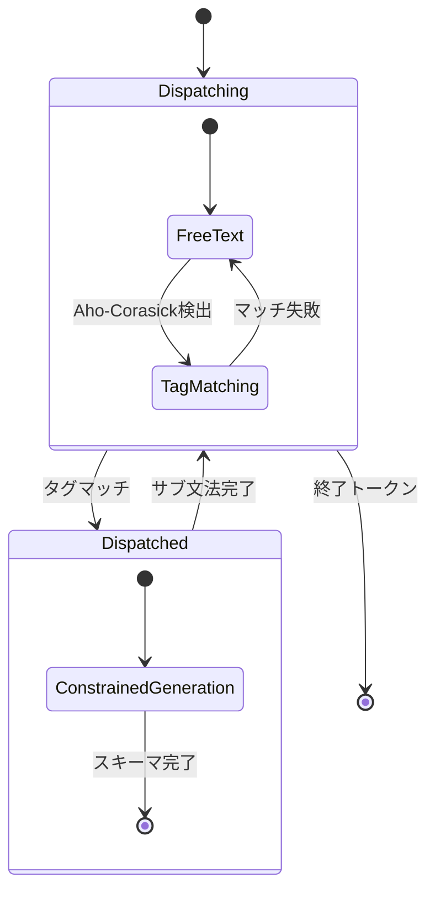

本記事は [XGrammar-2: Efficient Dynamic Structured Generation Engine for Agentic LLMs](https://arxiv.org/abs/2601.04426)（Li et al., 2026年1月、ACM CAIS 26）の解説記事です。

## 論文概要（Abstract）

現代のLLMエージェントはツール呼び出し（Function Calling）において動的な構造化生成を必要とする。出力構造はリクエスト間（ツールセットが異なる）とリクエスト内（ツール名の生成がスキーマを決定する）の両方で変化する。既存のエンジンは静的構造を前提としており、この動的性に対応できない。本論文はTagDispatch（動的構造ディスパッチ）とCross-Grammar Cache（部分構造キャッシュ再利用）を中核とするXGrammar-2を提案し、従来比6倍のコンパイル高速化とほぼゼロのエンドツーエンドオーバーヘッドを実現している。

この記事は [Zenn記事: Function Callingスキーマ設計パターン：3社APIで堅牢なツール定義を構築する](https://zenn.dev/0h_n0/articles/f89e983139d00a) の深掘りです。

## 情報源

- **arXiv ID**: 2601.04426
- **URL**: https://arxiv.org/abs/2601.04426
- **著者**: Linzhang Li, Yixin Dong, Guanjie Wang, et al.
- **発表年**: 2026（ACM CAIS 26 採択）
- **分野**: cs.CL, cs.PL

## 背景と動機（Background & Motivation）

Zenn記事で解説したstrict modeの内部実装は、制約付きデコーディング（Constrained Decoding）に基づいている。しかし、従来の制約付きデコーディングエンジンには、Function Callingの実運用において2つの根本的課題が存在した。

**課題1: リクエスト間の動的性（Inter-request dynamism）**

各APIリクエストが異なるツールセットを公開する場合、利用可能な文法の組み合わせ空間は組み合わせ的に爆発する。従来手法はリクエスト単位でキャッシュするため、ツールセットが変わるたびに高コストな前処理が必要になり、Time-to-First-Token（TTFT）が増大する。

**課題2: リクエスト内の動的性（Intra-request dynamism）**

ツール名の生成がその後のJSON引数のスキーマを決定する。例えば `<function=get_weather>` というプレフィックスが生成されると、以降の出力は `get_weather` の引数スキーマに制約される。この動的ディスパッチをBNF文法で表現すると冗長かつ非効率になる。

これはZenn記事の「20ツール制限」と直結する問題である。ツール数が増えるほど文法空間が爆発し、制約付きデコーディングのオーバーヘッドが増大するため、実用的にツール数を制限する必要がある。

## 主要な貢献（Key Contributions）

- **貢献1**: TagDispatch — Aho-Corasickオートマトンによるタグベースの動的構造ディスパッチ機構
- **貢献2**: Cross-Grammar Cache — 階層的ハッシュによる部分構造レベルのキャッシュ再利用
- **貢献3**: Earleyパーサーベースの適応的トークンマスクキャッシュとJITコンパイル
- **貢献4**: 反復状態圧縮によるスキーマサイズの定数倍制約

## 技術的詳細（Technical Details）

### TagDispatch: 動的構造ディスパッチ

TagDispatchは、自由テキスト生成と制約付き生成を動的に切り替える第一級文法構成要素である。

#### 動作モード



1. **Dispatchingモード**: 自由テキストを受け付けつつ、Aho-Corasickオートマトンで登録タグのインクリメンタルマッチングを実行
2. **Dispatchedモード**: タグがマッチすると、関連するサブ文法（ツールのJSONスキーマ）に切り替えて制約付きデコーディングを実行。完了後はDispatchingモードに復帰

#### 具体例: Function Callingでの動作

```python
# TagDispatchの概念的実装
# 実際のツール呼び出しフォーマット例:
# <function=get_weather>{"city": "Tokyo", "unit": "celsius"}</function>

# 登録されたタグ（ツール名→スキーマのマッピング）
tags = {
    "<function=get_weather>": weather_json_schema,
    "<function=search_products>": products_json_schema,
    "<function=get_order_status>": order_json_schema,
}

# Aho-Corasickオートマトンを構築
# → 全タグを同時にインクリメンタルマッチング
# → O(テキスト長)でどのタグにもマッチ可能
automaton = build_aho_corasick(tags.keys())
```

この設計により、20個のツールが登録されていても、生成されるツール名に応じて正しいスキーマに動的にディスパッチされる。従来のBNF方式では20個のスキーマすべてを1つの巨大文法にエンコードする必要があったが、TagDispatchでは各スキーマを独立に管理できる。

### Cross-Grammar Cache: 部分構造キャッシュ再利用

異なるツールのスキーマ間で共有される部分構造（例: 共通の型定義、enumパターン）を検出し、キャッシュを再利用する。

#### 階層的ハッシュアルゴリズム

各有限状態マシン（FSM）に構造的ハッシュを付与する：

$$
h(F) = \text{Hash}\left(\text{LocalStructure}(F) \oplus \bigoplus_{F' \in \text{Refs}(F)} h(F')\right)
$$

ここで：
- $F$: FSM（文法の部分構造）
- $\text{LocalStructure}(F)$: ローカルな状態遷移構造
- $\text{Refs}(F)$: $F$が参照する他のFSM
- $\oplus$: ハッシュ結合演算

循環参照に対しては、仮ハッシュを割り当てた後にサイクルハッシュ精製を行う。

#### 2段階キャッシュヒット

1. **完全ヒット**: 同一FSM + 同一先読みアサーション → トークンマスクキャッシュを直接再利用
2. **部分ヒット**: 同一FSM + 異なる先読み → 不確定トークンのみ再チェック

論文の測定結果によると、動的ワークロードでは：
- **完全文法レベル**のキャッシュ再利用: 0%（ツールセットが毎回異なるため）
- **部分構造レベル**のキャッシュ再利用: 25.2%-95.6%

この差が、Cross-Grammar Cacheの価値を如実に示している。

### Earleyパーサーベースの適応的トークンマスク

従来のPDA（プッシュダウンオートマトン）ベースのパーサーの代わりに、Earleyパーサーを採用する。

#### トークンの3分類

各状態で語彙中のトークンを3つに分類する：

$$
\mathcal{V} = \mathcal{V}_{\text{accept}} \cup \mathcal{V}_{\text{reject}} \cup \mathcal{V}_{\text{context-dep}}
$$

- $\mathcal{V}_{\text{accept}}$: 常に受理可能（スキャン可能状態から到達可能）
- $\mathcal{V}_{\text{reject}}$: 常に拒否（どの文脈でも不正）
- $\mathcal{V}_{\text{context-dep}}$: 文脈依存（完全なEarley文脈で判定が必要）

実行時は $\mathcal{V}_{\text{accept}}$ と $\mathcal{V}_{\text{reject}}$ をキャッシュから取得し、$\mathcal{V}_{\text{context-dep}}$ のみをフルパース履歴で検証する。

### JITコンパイル

前処理のコンパイルオーバーヘッドを実行時に分散させる：

$$
T_{\text{effective}} = T_{\text{prefill}} - T_{\text{jit\_compile}}
$$

LLMのプロンプトprefill処理中に、最も計算コストの高い$K$個のトークンマスクを事前計算する。prefillとコンパイルをオーバーラップさせることで、ユーザーから見たレイテンシ増加をゼロに近づける。

パラメータ$K$はコンパイルコストとテールレイテンシのトレードオフを制御する：
- $K=0$: JITなし（完全にオンデマンド）
- $K=5$: 中程度（論文推奨値）
- $K=10$: 積極的事前計算

### 反復状態圧縮

JSON Schemaの `minLength`、`maxLength`、`minItems`、`maxItems` は文法内で反復構造を生成する。例えば `"minItems": 100` は100回の繰り返し規則を展開する必要がある。

規則 $R\{l, r\}$（$l$回以上$r$回以下の繰り返し）に対して3つの圧縮戦略を適用：

1. **$r$が小さい場合**: そのまま展開（通常通り）
2. **$l$, $r$が大きい場合**: $R\{l-t, r-t\}$ + $t$回の固定繰り返しに変換
3. **$l$が小さい場合**: $R\{l, t\}$ と $R\{t, r\}$ に分割

これにより文法サイズが定数倍に抑えられ、反復の多いスキーマでの前処理が99.6倍改善される。

## 実験結果

### コンパイル速度（論文Table 2より）

| エンジン | コンパイル時間 | XGrammar-2比 |
|:---|:---|:---|
| **XGrammar-2** | ~10ms | 1.0× |
| XGrammar-1 | >1000ms | 100× 遅い |
| Outlines | 3000-13000ms | 300-1300× 遅い |

### トークン生成オーバーヘッド

| エンジン | トークンあたりオーバーヘッド |
|:---|:---|
| **XGrammar-2** | ~12.7μs |
| Guidance | 250-1000+μs |
| XGrammar-1 | ~40μs |

XGrammar-2の12.7μsは、LLMの推論時間（通常10-50ms/token）に対して0.03-0.13%のオーバーヘッドであり、事実上ゼロである。

### エンドツーエンドスループット（tokens/sec）

| モデル | バッチサイズ | XGrammar-2 | XGrammar-1 | 改善率 |
|:---|:---|:---|:---|:---|
| Llama-3.1-8B | 16 | 920 | 525 | 1.75× |
| Llama-3.2-3B | 16 | 1655 | 597 | 2.77× |

制約なし生成との差は最大6%以内に収まっている。

### Function Callingタスク（BFCL-v3ベンチマーク）

| モデル | スキーマ準拠率（制約なし） | スキーマ準拠率（XGrammar-2） |
|:---|:---|:---|
| Llama-3.2-1B | 22.07% | **100%** |
| Llama-3.2-3B | 40.70% | **100%** |

制約付きデコーディングにより、小型モデルでも**スキーマ準拠率100%**が達成される。これがZenn記事で解説したstrict modeの「100%準拠保証」の技術的実体である。

### Cross-Grammar Cacheの効果

| ワークロード | 完全文法キャッシュヒット率 | 部分構造キャッシュヒット率 |
|:---|:---|:---|
| Llamaフォーマット | 0% | **71.43%** |
| Harmonyフォーマット | 0% | **47.21%** |

動的なツールセットでは完全文法のキャッシュは効かないが、部分構造レベルでは47-71%の再利用が可能である。

### アブレーション研究（JSONSchemaBench上）

| 最適化手法 | 前処理改善 | マスク生成改善 |
|:---|:---|:---|
| JITのみ | 8.1× | 15.9× |
| Cross-Grammar Cache追加 | +1.1× | 追加改善 |
| 反復圧縮追加 | **99.6×**（反復スキーマ） | - |

## 実装のポイント

### Function Callingシステムへの統合

XGrammar-2はvLLM、SGLang、Azure AI Foundry Agent Serviceに統合されている。Function Callingシステムを構築する際の統合パターン：

```python
# SGLang統合での使用例（概念的コード）
from sglang import Runtime

runtime = Runtime(
    model_path="meta-llama/Llama-3.1-8B-Instruct",
    structured_generation_backend="xgrammar2",
)

# ツール定義（Zenn記事のstrict modeパターン）
tools = [
    {
        "name": "get_weather",
        "parameters": {
            "type": "object",
            "properties": {
                "city": {"type": "string"},
                "unit": {"type": "string", "enum": ["celsius", "fahrenheit"]},
            },
            "required": ["city", "unit"],
            "additionalProperties": False,
        },
    },
    {
        "name": "search_products",
        "parameters": {
            "type": "object",
            "properties": {
                "query": {"type": "string"},
                "category": {"type": "string", "enum": ["electronics", "clothing"]},
            },
            "required": ["query", "category"],
            "additionalProperties": False,
        },
    },
]

# XGrammar-2が内部で実行する処理:
# 1. 各ツールのスキーマをFSMに変換
# 2. TagDispatch用のAho-Corasickオートマトンを構築
# 3. Cross-Grammar Cacheで共通部分構造を検出
# 4. JITでprefill中にトークンマスクを事前計算
# 5. 生成時はツール名→スキーマの動的ディスパッチ
```

### Zenn記事との関連

本論文は、Zenn記事の以下の設計パターンの技術的基盤を提供する：

1. **strict modeの「100%準拠保証」**: XGrammar-2のようなエンジンがトークン生成レベルで不正出力を物理的に防止する
2. **additionalProperties: false の必要性**: FSMの状態遷移を確定的にするため、追加フィールドの禁止が必須
3. **20ツール制限**: 文法空間の爆発を抑えるため。ただしCross-Grammar Cacheにより部分的に緩和可能
4. **enum制約の有効性**: 有限選択肢のFSMは状態数が少なく、キャッシュヒット率が高い

## 関連研究

- **XGrammar (v1)**（Li et al., 2024）: 本論文の前身。静的文法に特化しており、動的ツール呼び出しには前処理のやり直しが必要だった
- **Outlines**（Willard & Louf, 2023）: 正規表現ベース。JSONSchemaBenchで3-13秒のコンパイル時間が問題
- **Guidance/llguidance**（Microsoft, 2024）: 動的生成に対応するが250-1000+μsのオーバーヘッド
- **SGLang**（Zheng et al., 2024）: XGrammar-2の主要統合先。構造化生成をサービングフレームワークに組み込む

## まとめ

XGrammar-2は、Function Callingのstrict modeを支える制約付きデコーディングの「次世代エンジン」として以下を実現した：

1. TagDispatchにより、ツール名の生成が動的にスキーマを決定する「intra-request dynamism」を効率的に処理
2. Cross-Grammar Cacheにより、異なるツールセット間でも47-71%の部分構造キャッシュ再利用を達成
3. コンパイル時間を従来比6倍高速化（10ms vs 1000ms+）し、トークンあたりオーバーヘッドを12.7μs（事実上ゼロ）に
4. 小型モデル（Llama-3.2-1B/3B）でもスキーマ準拠率100%を実現

Function Callingシステムの設計者にとって、「strict modeのオーバーヘッドはほぼゼロ」であることが本論文によって定量的に裏付けられている。スキーマ設計では `additionalProperties: false` と `enum` の活用がエンジンの効率を最大化する。
