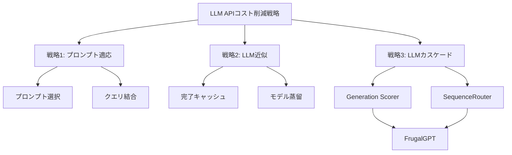
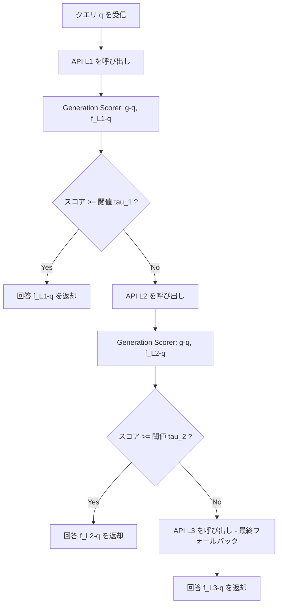
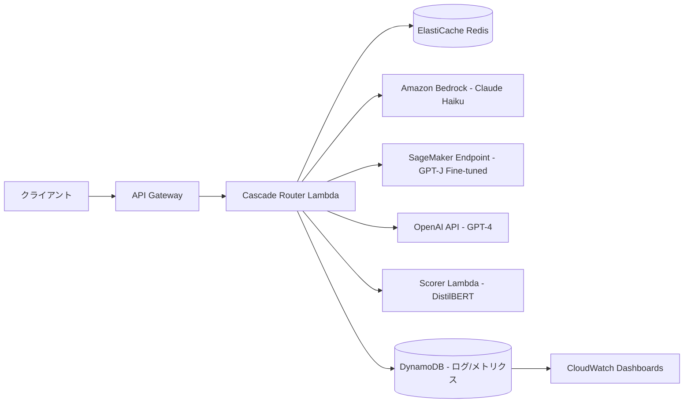

## 論文概要（Abstract）

本記事は [FrugalGPT: How to Use Large Language Models While Reducing Cost and Improving Performance](https://arxiv.org/abs/2305.05176) の解説記事です。

FrugalGPTは、LLM APIの推論コスト削減と性能向上を同時に追求するフレームワークである。著者らは、LLM APIの料金が最大2桁の差があることに着目し、プロンプト適応・LLM近似・LLMカスケードの3戦略を体系化した。特にLLMカスケードの実装であるFrugalGPTは、クエリごとに最適なLLMの組み合わせを学習し、GPT-4と同等の性能を最大98%のコスト削減で達成、もしくは同コストでGPT-4を4%上回る精度を実現したと報告されている。

この記事は [Zenn記事: LLMアプリのトークンコスト削減ロードマップ](https://zenn.dev/0h_n0/articles/d028379c95b3c3) の深掘りです。

## 情報源

- **arXiv ID**: 2305.05176
- **URL**: [arXiv:2305.05176](https://arxiv.org/abs/2305.05176)
- **著者**: Lingjiao Chen, Matei Zaharia, James Zou
- **発表年**: 2023年5月
- **分野**: Machine Learning (cs.LG), Artificial Intelligence (cs.AI), Computation and Language (cs.CL), Software Engineering (cs.SE)

## 背景と動機（Background）

### LLM API市場の料金格差

2023年3月時点で、主要なLLM APIの料金には最大100倍の差がある。著者らは12のLLM APIを5つのプロバイダ（OpenAI, AI21, Cohere, Textsynth, ForeFrontAI）から調査し、以下の料金構造を明らかにした（論文Table 1より）。

| プロバイダ | API | 入力コスト(/10Mトークン) | 出力コスト(/10Mトークン) |
|-----------|-----|-------------------------|-------------------------|
| OpenAI | GPT-4 | $30 | $60 |
| OpenAI | GPT-3 | $20 | $20 |
| OpenAI | ChatGPT | $2 | $2 |
| AI21 | J1-Jumbo | 固定$0.005/req | $250 |
| AI21 | J1-Grande | 固定$0.0008/req | $80 |
| AI21 | J1-Large | 固定$0.0003/req | $30 |
| Cohere | Xlarge | $10 | $10 |
| Textsynth | GPT-J | $0.2 | $5 |

GPT-4の入力トークンあたりコストはGPT-Jの150倍に達する。しかし、高価なモデルが常に最良の回答を返すわけではない。著者らは「安価なモデルが高価なモデルの誤りを補完する」ケースが少なくないことを実証している。

### 実務上のインパクト

論文では、カスタマーサービスへの応用例として、月間36万クエリをGPT-4で処理すると約$21,200/月のコストが発生すると試算している。このコストをいかに削減しつつ品質を維持するかが、本研究の中心的な問いである。

## 主要な貢献（Key Contributions）

1. **LLM APIコスト削減戦略の体系化**: プロンプト適応・LLM近似・LLMカスケードの3カテゴリに整理し、各手法の特性と適用場面を明確化
2. **LLMカスケードの数学的定式化**: コスト制約付き最適化問題として定式化し、探索空間の効率的な枝刈り手法を提案
3. **FrugalGPTの設計と実装**: Generation Scorer（回答品質の自動評価）とSequenceRouter（最適なLLMカスケード順序の決定）を組み合わせたフレームワーク
4. **実証的検証**: 3つのベンチマーク（HEADLINES, OVERRULING, COQA）で、最大98.3%のコスト削減もしくは同コストでの精度向上を実証
5. **LLM間の補完性の発見**: 安価なモデルが高価なモデルの誤答を正しく解く事例が体系的に存在することを示した

## 技術的詳細（Technical Details）

### 3つの戦略の全体像



### 戦略1: プロンプト適応（Prompt Adaptation）

プロンプト適応は、LLMに送信するプロンプト自体を最適化することでコストを削減する手法である。

**プロンプト選択（Prompt Selection）**: Few-shotプロンプトに含めるIn-context examplesの数を必要最小限に絞る。全ての例を送信するのではなく、タスクに最も関連性の高い部分集合を選択することで、入力トークン数を削減する。

**クエリ結合（Query Concatenation）**: 複数のクエリを1つのプロンプトにまとめて送信する。プロンプトの共通部分（システムメッセージやIn-context examples）を1度だけ送信し、複数のクエリと回答を一括処理する。これにより、プロンプトの冗長な再送信を防ぐ。

### 戦略2: LLM近似（LLM Approximation）

LLM近似は、高価なLLMの動作を安価に再現する手法である。

**完了キャッシュ（Completion Cache）**: LLMの回答をローカルに保存し、類似クエリに対してはキャッシュから回答を返す。新規クエリが既存キャッシュと十分に類似している場合、APIコールを完全にスキップできる。

**モデル蒸留（Model Fine-tuning）**: (1) 高性能だが高価なLLM（教師モデル）で一定量のクエリに回答を生成し、(2) その回答をデータセットとして安価で小型のモデル（生徒モデル）をファインチューニングし、(3) 本番では生徒モデルで推論する。知識蒸留の応用である。

### 戦略3: LLMカスケード（LLM Cascade）

LLMカスケードは本論文の核心的貢献であり、FrugalGPTとして実装されている。複数のLLM APIを順番に呼び出し、十分な品質の回答が得られた時点で早期終了する戦略である。

#### カスケードの数学的定式化

LLMカスケードは以下のコスト制約付き最適化問題として定式化される。

まず、LLM API $i$ のコスト関数を定義する。プロンプト $p$ に対して：

$$
c_i(p) = \tilde{c}_{i,2} \| f_i(p) \| + \tilde{c}_{i,1} \| p \| + \tilde{c}_{i,0}
$$

ここで：
- $\tilde{c}_{i,2}$: 出力トークンあたりのコスト係数
- $\tilde{c}_{i,1}$: 入力トークンあたりのコスト係数
- $\tilde{c}_{i,0}$: 固定リクエストコスト（AI21の課金モデルなどに対応）
- $f_i(p)$: API $i$ の出力
- $\| \cdot \|$: トークン数

カスケード戦略は、LLMの呼び出し順序 $\boldsymbol{L} = (L_1, L_2, \ldots, L_m)$ と受理閾値ベクトル $\boldsymbol{\tau} = (\tau_1, \tau_2, \ldots, \tau_m)$ で定義される。最適化問題は：

$$
\max_{\boldsymbol{L}, \boldsymbol{\tau}} \mathbb{E}\left[ r\left(a, f_{L_z}(q)\right) \right]
$$

$$
\text{subject to} \quad \mathbb{E}\left[ \sum_{i=1}^{z} \left( \tilde{c}_{L_i,2} \| f_{L_i}(q) \| + \tilde{c}_{L_i,1} \| q \| + \tilde{c}_{L_i,0} \right) \right] \leq b
$$

$$
z = \arg\min_{i} \; g(q, f_{L_i}(q)) \geq \tau_i
$$

ここで：
- $z$: カスケードが終了するAPIのインデックス
- $r(a, \hat{a})$: 回答品質を測る報酬関数
- $b$: 予算制約
- $g(q, f_{L_i}(q))$: Generation Scorerによるスコア（$[0, 1]$の信頼度）

この問題は混合整数最適化であり、計算コストが高い。著者らは、LLMリスト間の回答不一致率が小さい組み合わせを枝刈りし、少数サンプルでの補間により目的関数を近似する手法を提案している。

#### Generation Scorer

Generation Scorerは、クエリ $q$ とLLMの回答 $a$ のペアを入力とし、その回答が正しいかどうかの信頼度スコア $g(q, a) \in [0, 1]$ を出力する回帰モデルである。

実験ではDistilBERTをベースモデルとして使用している。学習データは「クエリ・回答・正誤ラベル」の三つ組で、少量のラベル付きデータから訓練される。このScorerがカスケードの早期終了判定を担う。

#### SequenceRouter

SequenceRouterは、利用可能なLLM APIの中から最適なカスケード順序 $\boldsymbol{L}$ と閾値ベクトル $\boldsymbol{\tau}$ を決定するコンポーネントである。予算制約 $b$ のもとで、精度を最大化するカスケード構成を学習する。

### FrugalGPTのアルゴリズムフロー



HEADLINESデータセットの例では、予算$6.5（GPT-4コストの1/5）で以下のカスケードが学習された（論文より）：

1. **GPT-J**（最安）に問い合わせ → Scorerの閾値 $\tau_1 = 0.96$
2. スコアが0.96未満なら **J1-L** に問い合わせ → 閾値 $\tau_2 = 0.37$
3. スコアが0.37未満なら **GPT-4**（最終フォールバック）に問い合わせ

## アルゴリズム: FrugalGPT式カスケードの実装パターン

以下は、FrugalGPTの論文に基づくLLMカスケードの実装パターンを示すPythonコードである。

```python
"""FrugalGPT-style LLM cascade implementation pattern.

論文 arXiv:2305.05176 のLLMカスケード戦略を
実装パターンとして示す。実際の学習済みScorer/Routerは
タスク固有のデータで訓練する必要がある。
"""

from dataclasses import dataclass
from typing import Protocol


@dataclass(frozen=True)
class LLMResponse:
    """LLM APIからの応答を表す値オブジェクト。"""

    text: str
    model_name: str
    input_tokens: int
    output_tokens: int


@dataclass(frozen=True)
class CascadeResult:
    """カスケード全体の結果。"""

    response: LLMResponse
    total_cost: float
    apis_called: int


class LLMClient(Protocol):
    """LLM APIクライアントのインターフェース。"""

    def query(self, prompt: str) -> LLMResponse:
        """プロンプトを送信し応答を取得する。"""
        ...

    @property
    def cost_per_input_token(self) -> float:
        """入力トークンあたりのコスト（USD）。"""
        ...

    @property
    def cost_per_output_token(self) -> float:
        """出力トークンあたりのコスト（USD）。"""
        ...


class GenerationScorer(Protocol):
    """Generation Scorer: 回答品質の信頼度を推定する。

    論文ではDistilBERTベースの回帰モデルとして実装。
    クエリと回答のペアから[0, 1]のスコアを出力する。
    """

    def score(self, query: str, answer: str) -> float:
        """回答の信頼度スコアを返す（0.0-1.0）。"""
        ...


@dataclass(frozen=True)
class CascadeStep:
    """カスケードの各ステップを定義する。

    Attributes:
        client: LLM APIクライアント
        threshold: 受理閾値（スコアがこれ以上なら回答を採用）
    """

    client: LLMClient
    threshold: float


def compute_cost(client: LLMClient, response: LLMResponse) -> float:
    """APIコールのコストを計算する。

    論文の式: c_i(p) = c_{i,2} * ||f_i(p)|| + c_{i,1} * ||p|| + c_{i,0}

    Args:
        client: LLM APIクライアント
        response: APIからの応答

    Returns:
        コスト（USD）
    """
    return (
        client.cost_per_input_token * response.input_tokens
        + client.cost_per_output_token * response.output_tokens
    )


def frugal_cascade(
    query: str,
    steps: list[CascadeStep],
    scorer: GenerationScorer,
    budget: float | None = None,
) -> CascadeResult:
    """FrugalGPT式カスケードを実行する。

    安価なモデルから順に問い合わせ、Generation Scorerが
    十分な信頼度と判定した時点で早期終了する。

    Args:
        query: ユーザーのクエリ
        steps: カスケードステップのリスト（安価順）
        scorer: 回答品質を評価するScorer
        budget: 予算上限（USD）。Noneの場合は制限なし

    Returns:
        カスケードの実行結果

    Raises:
        RuntimeError: 全APIが予算超過の場合
    """
    total_cost = 0.0

    for i, step in enumerate(steps):
        is_last = i == len(steps) - 1

        response = step.client.query(query)
        call_cost = compute_cost(step.client, response)
        total_cost += call_cost

        # 予算チェック
        if budget is not None and total_cost > budget:
            return CascadeResult(
                response=response,
                total_cost=total_cost,
                apis_called=i + 1,
            )

        # 最終ステップは無条件で採用
        if is_last:
            return CascadeResult(
                response=response,
                total_cost=total_cost,
                apis_called=i + 1,
            )

        # Generation Scorerで回答品質を評価
        confidence = scorer.score(query, response.text)
        if confidence >= step.threshold:
            return CascadeResult(
                response=response,
                total_cost=total_cost,
                apis_called=i + 1,
            )

    # ここには到達しないが型安全のため
    msg = "Cascade exhausted without producing a result"
    raise RuntimeError(msg)


# --- 使用例 ---
# 論文のHEADLINESデータセットにおけるカスケード構成例:
#
# steps = [
#     CascadeStep(client=gpt_j_client, threshold=0.96),    # 最安
#     CascadeStep(client=j1_large_client, threshold=0.37), # 中間
#     CascadeStep(client=gpt4_client, threshold=0.0),      # フォールバック
# ]
# result = frugal_cascade(query, steps, scorer, budget=6.5)
```

## 実装のポイント（Implementation Notes）

FrugalGPTを実運用に適用する際の重要な考慮点を整理する。

**Generation Scorerの訓練**: Scorerはタスク固有のラベル付きデータで訓練する必要がある。論文ではDistilBERTを使用しており、比較的少量のデータ（数百〜数千サンプル）で有効なScorerを構築できると報告されている。Scorerの推論コスト自体は、LLM APIコールに比べて無視できる程度に小さい。

**カスケード順序の設計**: 安価なモデルを先頭に、高価なモデルを末尾に配置する。SequenceRouterは予算制約 $b$ のもとで最適な順序と閾値を学習するが、実装上は各モデルの性能プロファイルを事前に評価し、タスクごとに異なるカスケード構成を用意することが推奨される。

**閾値チューニング**: 閾値 $\tau_i$ は精度とコストのトレードオフを直接制御する。閾値を上げると、より多くのクエリが次段のモデルにエスカレーションされ、コストは増加するが精度は向上する。バリデーションセットでの精度・コスト曲線を描き、ビジネス要件に合致する動作点を選択する。

**キャッシュとの併用**: 完了キャッシュ（戦略2）とカスケード（戦略3）は直交する戦略であり、併用可能である。キャッシュヒット時はカスケードを完全にスキップし、コスト0で回答を返すことができる。

## Production Deployment Guide

FrugalGPT式カスケードを本番環境に展開するためのAWS実装パターンを解説する。

### アーキテクチャ概要



### Terraform構成

以下に、カスケードルーターの中核となるLambda関数とキャッシュ層のTerraform構成を示す。

```hcl
# FrugalGPT Cascade Router - Terraform Configuration
# カスケードルーターとキャッシュ層の構成

# --- ElastiCache (完了キャッシュ) ---
resource "aws_elasticache_cluster" "completion_cache" {
  cluster_id           = "frugalgpt-completion-cache"
  engine               = "redis"
  node_type            = "cache.r6g.large"
  num_cache_nodes      = 1
  parameter_group_name = "default.redis7"
  port                 = 6379
  subnet_group_name    = aws_elasticache_subnet_group.main.name
  security_group_ids   = [aws_security_group.cache_sg.id]

  tags = {
    Service = "frugalgpt-cascade"
    Purpose = "completion-cache"
  }
}

# --- Cascade Router Lambda ---
resource "aws_lambda_function" "cascade_router" {
  function_name = "frugalgpt-cascade-router"
  runtime       = "python3.12"
  handler       = "handler.lambda_handler"
  timeout       = 120
  memory_size   = 512

  filename         = data.archive_file.lambda_zip.output_path
  source_code_hash = data.archive_file.lambda_zip.output_base64sha256
  role             = aws_iam_role.lambda_role.arn

  environment {
    variables = {
      CACHE_ENDPOINT         = aws_elasticache_cluster.completion_cache.cache_nodes[0].address
      SCORER_ENDPOINT        = aws_lambda_function.scorer.function_name
      SAGEMAKER_ENDPOINT     = aws_sagemaker_endpoint.gptj_finetuned.name
      BEDROCK_MODEL_ID       = "anthropic.claude-3-haiku-20240307-v1:0"
      OPENAI_API_KEY_SECRET  = aws_secretsmanager_secret.openai_key.arn
      CASCADE_CONFIG_TABLE   = aws_dynamodb_table.cascade_config.name
      METRICS_TABLE          = aws_dynamodb_table.metrics.name
    }
  }

  vpc_config {
    subnet_ids         = var.private_subnet_ids
    security_group_ids = [aws_security_group.lambda_sg.id]
  }

  tags = {
    Service = "frugalgpt-cascade"
  }
}

# --- Generation Scorer Lambda ---
resource "aws_lambda_function" "scorer" {
  function_name = "frugalgpt-generation-scorer"
  runtime       = "python3.12"
  handler       = "scorer.lambda_handler"
  timeout       = 30
  memory_size   = 1024

  filename         = data.archive_file.scorer_zip.output_path
  source_code_hash = data.archive_file.scorer_zip.output_base64sha256
  role             = aws_iam_role.lambda_role.arn

  environment {
    variables = {
      MODEL_PATH = "/opt/distilbert-scorer"
    }
  }

  layers = [aws_lambda_layer_version.scorer_model.arn]

  tags = {
    Service = "frugalgpt-cascade"
    Purpose = "generation-scorer"
  }
}

# --- DynamoDB (メトリクス記録) ---
resource "aws_dynamodb_table" "metrics" {
  name         = "frugalgpt-cascade-metrics"
  billing_mode = "PAY_PER_REQUEST"
  hash_key     = "request_id"
  range_key    = "timestamp"

  attribute {
    name = "request_id"
    type = "S"
  }

  attribute {
    name = "timestamp"
    type = "N"
  }

  ttl {
    attribute_name = "expires_at"
    enabled        = true
  }

  tags = {
    Service = "frugalgpt-cascade"
  }
}

# --- API Gateway ---
resource "aws_apigatewayv2_api" "cascade_api" {
  name          = "frugalgpt-cascade-api"
  protocol_type = "HTTP"
}

resource "aws_apigatewayv2_integration" "lambda_integration" {
  api_id             = aws_apigatewayv2_api.cascade_api.id
  integration_type   = "AWS_PROXY"
  integration_uri    = aws_lambda_function.cascade_router.invoke_arn
  payload_format_version = "2.0"
}

resource "aws_apigatewayv2_route" "post_query" {
  api_id    = aws_apigatewayv2_api.cascade_api.id
  route_key = "POST /query"
  target    = "integrations/${aws_apigatewayv2_integration.lambda_integration.id}"
}
```

### カスケードルーターの実装（Lambda）

```python
"""FrugalGPT Cascade Router - AWS Lambda handler.

完了キャッシュ → 安価モデル → 高価モデルの順にカスケードし、
Generation Scorerの信頼度に基づいて早期終了する。
"""

import hashlib
import json
import os
import time
from typing import Any

import boto3
import redis

# AWS clients
bedrock = boto3.client("bedrock-runtime")
sagemaker = boto3.client("sagemaker-runtime")
lambda_client = boto3.client("lambda")
dynamodb = boto3.resource("dynamodb")
secrets = boto3.client("secretsmanager")

# Configuration
CACHE_ENDPOINT = os.environ["CACHE_ENDPOINT"]
SCORER_ENDPOINT = os.environ["SCORER_ENDPOINT"]
METRICS_TABLE = os.environ["METRICS_TABLE"]

cache = redis.Redis(host=CACHE_ENDPOINT, port=6379, decode_responses=True)
metrics_table = dynamodb.Table(METRICS_TABLE)


def _cache_key(query: str) -> str:
    """クエリからキャッシュキーを生成する。"""
    return f"completion:{hashlib.sha256(query.encode()).hexdigest()}"


def _invoke_scorer(query: str, answer: str) -> float:
    """Generation Scorer Lambdaを呼び出し信頼度スコアを取得する。"""
    payload = json.dumps({"query": query, "answer": answer})
    response = lambda_client.invoke(
        FunctionName=SCORER_ENDPOINT,
        InvocationType="RequestResponse",
        Payload=payload,
    )
    result = json.loads(response["Payload"].read())
    return float(result["score"])


def _invoke_bedrock_haiku(query: str) -> dict[str, Any]:
    """Amazon Bedrock Claude Haikuを呼び出す。"""
    body = json.dumps({
        "anthropic_version": "bedrock-2023-05-31",
        "max_tokens": 512,
        "messages": [{"role": "user", "content": query}],
    })
    response = bedrock.invoke_model(
        modelId=os.environ["BEDROCK_MODEL_ID"],
        body=body,
    )
    result = json.loads(response["body"].read())
    return {
        "text": result["content"][0]["text"],
        "model": "claude-3-haiku",
        "input_tokens": result["usage"]["input_tokens"],
        "output_tokens": result["usage"]["output_tokens"],
    }


def _record_metrics(
    request_id: str,
    model_used: str,
    apis_called: int,
    cost: float,
    latency_ms: int,
    cache_hit: bool,
) -> None:
    """メトリクスをDynamoDBに記録する。"""
    metrics_table.put_item(
        Item={
            "request_id": request_id,
            "timestamp": int(time.time()),
            "model_used": model_used,
            "apis_called": apis_called,
            "cost_usd": str(cost),
            "latency_ms": latency_ms,
            "cache_hit": cache_hit,
            "expires_at": int(time.time()) + 86400 * 30,
        }
    )


def lambda_handler(event: dict[str, Any], context: Any) -> dict[str, Any]:
    """カスケードルーターのエントリポイント。

    1. 完了キャッシュを確認
    2. Bedrock Haiku → Scorer評価
    3. 閾値未満ならOpenAI GPT-4にフォールバック
    """
    start = time.monotonic()
    body = json.loads(event.get("body", "{}"))
    query = body.get("query", "")
    request_id = context.aws_request_id

    # Step 0: キャッシュ確認
    cached = cache.get(_cache_key(query))
    if cached is not None:
        _record_metrics(request_id, "cache", 0, 0.0, 0, cache_hit=True)
        return {"statusCode": 200, "body": cached}

    # Step 1: Bedrock Haiku（安価モデル）
    haiku_result = _invoke_bedrock_haiku(query)
    score = _invoke_scorer(query, haiku_result["text"])

    if score >= 0.85:  # 閾値はDynamoDB cascade_configから動的取得も可
        cache.setex(_cache_key(query), 3600, haiku_result["text"])
        elapsed = int((time.monotonic() - start) * 1000)
        _record_metrics(request_id, "haiku", 1, 0.0003, elapsed, False)
        return {
            "statusCode": 200,
            "body": json.dumps({
                "answer": haiku_result["text"],
                "model": "claude-3-haiku",
                "cascade_depth": 1,
            }),
        }

    # Step 2: OpenAI GPT-4（フォールバック）
    # 省略: OpenAI APIコールの実装
    # ...

    elapsed = int((time.monotonic() - start) * 1000)
    return {"statusCode": 200, "body": json.dumps({"answer": "...", "cascade_depth": 2})}
```

### 運用監視

CloudWatch Metricsで以下の指標を追跡する。

| メトリクス | 意味 | アラート閾値 |
|-----------|------|------------|
| `cascade_depth_avg` | 平均カスケード深度 | > 2.5 (フォールバック過多) |
| `cache_hit_rate` | キャッシュヒット率 | < 20% (キャッシュ効果低下) |
| `scorer_latency_p99` | Scorer推論レイテンシ | > 500ms |
| `total_cost_per_hour` | 時間あたり総コスト | 予算の120%超過 |
| `fallback_rate` | 最終モデルへのフォールバック率 | > 30% |

### コスト最適化チェックリスト

1. **キャッシュTTLの調整**: 回答の鮮度要件に応じて1時間〜24時間で設定
2. **Scorerモデルのサイズ**: DistilBERTで十分な精度が得られるか検証。過剰に大きなモデルはレイテンシを悪化させる
3. **閾値の定期再校正**: データ分布の変化に応じて月次で閾値を再評価
4. **SageMaker Serverless Inference**: 低トラフィック時のコスト削減にServerless推論を検討
5. **Reserved Capacityの活用**: Bedrockの予約スループットで安定稼働時のコスト最適化
6. **リクエストバッチング**: プロンプト適応（戦略1）のクエリ結合を併用し、API呼び出し回数を削減

## 実験結果（Experimental Results）

### ベンチマークデータセット

著者らは3つのデータセットで評価を行っている（論文Table 2より）。

| データセット | ドメイン | サイズ | In-context例数 |
|------------|---------|-------|---------------|
| HEADLINES | 金融ニュース | 10,000 | 8 |
| OVERRULING | 法律文書 | 2,400 | 5 |
| COQA | 読解問題 | 7,982 | 2 |

### コスト削減の実証

最も優れた単一LLMと同等の精度を維持した場合のコスト比較（論文Table 3より）：

| データセット | 最良LLM | 最良LLMコスト | FrugalGPTコスト | コスト削減率 |
|------------|---------|-------------|----------------|------------|
| HEADLINES | GPT-4 | $33.1 | $0.6 | **98.3%** |
| OVERRULING | GPT-4 | $9.7 | $2.6 | **73.3%** |
| COQA | GPT-3 | $72.5 | $29.6 | **59.2%** |

HEADLINESでの98.3%削減は特に顕著である。これは、金融ニュースの見出し判定タスクにおいて、大半のクエリがGPT-JやJ1-Lで十分に回答でき、GPT-4が必要なケースは少数であることを示している。

### 精度向上の実証

同コストでの精度比較においても、FrugalGPTは最良の単一LLMを上回る結果が報告されている。HEADLINESデータセットでは、GPT-4のコストの20%（$6.5）の予算で、GPT-4を約1.5%上回る精度を達成している。

### LLM間の補完性（MPI分析）

著者らはMaximum Performance Improvement（MPI）分析を通じて、LLM間の補完性を定量化している。HEADLINESデータセットでは、GPT-4が不正解の約6%のクエリに対して、GPT-JやJ1-L、GPT-Curieが正解を返すことが確認されている。COQAデータセットでは、GPT-4が不正解のクエリの13%をGPT-3が正しく回答している。

この補完性こそがカスケード戦略の有効性の根拠であり、単に「安いモデルから試す」だけでなく、異なるモデルの得意・不得意を活用できる点がFrugalGPTの強みである。

## 実運用への応用（Practical Applications）

FrugalGPTの知見は、2026年現在のLLMアプリケーション開発においても直接的に応用可能である。

**モデルカスケードの普及**: 論文発表以降、Claude 3.5 Haiku → Claude 3.5 Sonnet → Claude Opus 4のような階層的なモデル選択は多くのプロダクションシステムで採用されている。FrugalGPTはこの設計パターンの理論的基盤を提供した。

**Routerサービスの台頭**: Martian、Unify、Portkey等のLLMルーティングサービスは、FrugalGPTのカスケードやルーティングの考え方を商用実装したものである。

**コスト意識の設計**: 関連するZenn記事で解説されている「7戦略で月額費用を80%圧縮」のうち、戦略3「モデルカスケード」はまさにFrugalGPTの実践的適用である。プロンプトキャッシュ（戦略1）やセマンティックキャッシュ（戦略2）もFrugalGPTの完了キャッシュと同じ発想に基づく。

**評価関数の重要性**: Generation Scorerに相当する「回答品質の自動評価」は、LLM-as-a-Judgeやconfidence scoringとして発展し、カスケード判定だけでなくハルシネーション検出やガードレール実装にも応用されている。

## 関連研究（Related Work）

1. **FrugalML** (Chen et al., 2020): 分類タスク向けのML-as-a-Service最適化フレームワーク。FrugalGPTの直接的な前身であるが、固定ラベル集合を持つ分類APIに限定されていた。FrugalGPTは自由形式テキスト生成への拡張である。

2. **Prompt Engineering研究**: Few-shot learning (Brown et al., 2020)、Chain-of-Thought (Wei et al., 2022)、知識拡張プロンプティング等。これらはプロンプト適応戦略と関連するが、コスト最適化を明示的な目的としていない。

3. **モデルアンサンブル**: 複数モデルの出力を統合する伝統的手法。教師あり・教師なしアンサンブルがあるが、いずれもモデルの内部パラメータ（ホワイトボックス）へのアクセスを前提とする。FrugalGPTはAPIアクセスのみ（ブラックボックス）で動作する点が異なる。

4. **システム最適化**: ポストトレーニング量子化、パイプライン並列化、ハードウェアアウェアプルーニング等。これらはモデル提供者側の最適化であり、API利用者の視点からのコスト削減とは相補的な関係にある。

5. **AutoMix** (Madaan et al., 2023): FrugalGPTと同時期に提案された、自己検証に基づくLLMカスケード手法。自身の回答を検証するメタ認知的アプローチを取る点で、外部Scorerを用いるFrugalGPTと対照的である。

## まとめと今後の展望（Summary and Future Directions）

FrugalGPTは、LLM APIのコスト最適化を体系的に扱った先駆的研究である。プロンプト適応・LLM近似・LLMカスケードの3戦略は、2026年現在でもLLMアプリケーションのコスト設計における基本フレームワークとして有効である。

今後の方向性として、著者らは以下を挙げている。(1) 対話型タスクや長文生成への拡張、(2) LLMの性能・料金の動的変化への適応、(3) 複数のコスト削減戦略の統合的な最適化。特に、2026年現在のマルチモーダルモデル（テキスト・画像・音声の統合処理）環境では、モダリティごとに異なるコスト構造を持つAPIのカスケードという新たな研究課題が生まれている。

## 参考文献

- Chen, L., Zaharia, M., & Zou, J. (2023). FrugalGPT: How to Use Large Language Models While Reducing Cost and Improving Performance. *arXiv:2305.05176*. [https://arxiv.org/abs/2305.05176](https://arxiv.org/abs/2305.05176)
- Chen, L., Zaharia, M., & Zou, J. (2020). FrugalML: How to Use ML Prediction APIs More Accurately and Cheaply. *NeurIPS 2020*.
- Brown, T. et al. (2020). Language Models are Few-Shot Learners. *NeurIPS 2020*.
- Wei, J. et al. (2022). Chain-of-Thought Prompting Elicits Reasoning in Large Language Models. *NeurIPS 2022*.
- Madaan, A. et al. (2023). AutoMix: Automatically Mixing Language Models. *arXiv:2310.12963*.

---

*本記事はAIによって生成されました。論文の内容は著者らの報告に基づいており、本記事の著者が独自に実験を行ったものではありません。*
