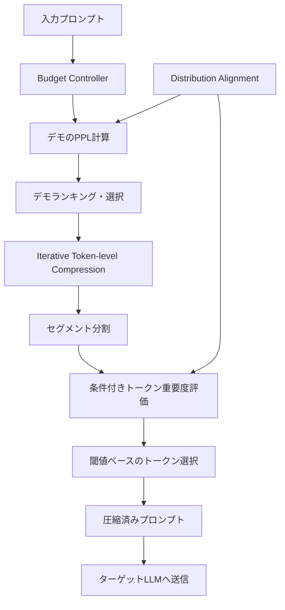
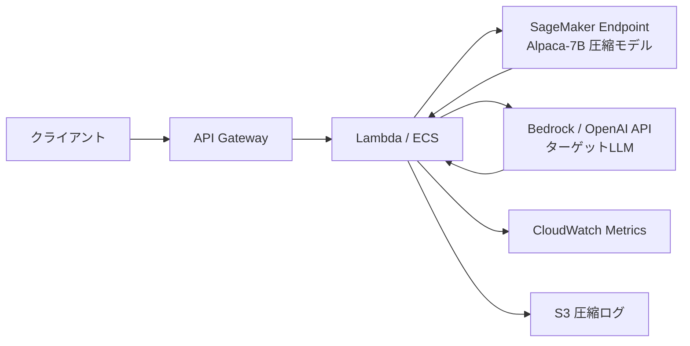

## 論文概要

本記事は [LLMLingua: Compressing Prompts for Accelerated Inference of Large Language Models](https://arxiv.org/abs/2310.05736) の解説記事です。

LLMLinguaは、小型言語モデル（LLaMA-7B / Alpaca-7B等）を圧縮器として活用し、大規模言語モデル（GPT-3.5/GPT-4等）への入力プロンプトを最大20倍に圧縮する手法である。著者らは、粗粒度のデモンストレーション選択（Budget Controller）、細粒度の反復的トークンレベル圧縮（Iterative Token-level Prompt Compression）、および分布整合のための指示チューニング（Distribution Alignment）の3段階アプローチを提案している。GSM8K、BBH、ShareGPT、Arxiv-March23の4つのベンチマークで評価を行い、20倍圧縮でも性能低下をわずか1.5ポイント程度に抑えることに成功したと報告されている。

この記事は [Zenn記事: LLMアプリのトークンコスト削減ロードマップ](https://zenn.dev/0h_n0/articles/d028379c95b3c3) の深掘りです。Zenn記事の「戦略5: プロンプト圧縮で入力トークンを削減する」で紹介されている手法の原論文を、数式・アルゴリズム・実装レベルで解説する。

## 情報源

| 項目 | 内容 |
|------|------|
| **タイトル** | LLMLingua: Compressing Prompts for Accelerated Inference of Large Language Models |
| **著者** | Huiqiang Jiang, Qianhui Wu, Chin-Yew Lin, Yuqing Yang, Lili Qiu (Microsoft Corporation) |
| **arXiv ID** | [2310.05736](https://arxiv.org/abs/2310.05736) |
| **発表年** | 2023年 |
| **分野** | cs.CL, cs.LG |
| **会議** | EMNLP 2023 |

## カンファレンス情報

EMNLP（Conference on Empirical Methods in Natural Language Processing）は、自然言語処理分野における最上位カンファレンスの一つである。2023年はシンガポールで開催され、プロンプトエンジニアリング、大規模言語モデルの効率化、多言語処理などが主要トピックとなった。LLMLinguaはメインカンファレンスに採択されており、プロンプト圧縮という当時新興の研究領域における先駆的な貢献として高く評価された。

## 背景と動機

大規模言語モデル（LLM）の推論コストは、入力トークン数に大きく依存する。特にIn-Context Learning（ICL）やRetrieval-Augmented Generation（RAG）などのパラダイムでは、Few-shotデモンストレーションや検索文書をプロンプトに含めるため、入力トークン数が数千から数万に膨れ上がる。これは推論コストの増大だけでなく、レイテンシの増加、コンテキストウィンドウの制約超過といった問題を引き起こす。

著者らは、自然言語のプロンプトには本質的に冗長性が含まれており、人間が理解できる自然な表現を維持しなくても、LLMはトークンの部分集合から元の意味を復元できるという仮説に基づいている。実際、GPT-4に圧縮済みプロンプトを復元させる実験では、元の文脈を高精度に再構成できることが確認されている（論文 Section 4.4）。この知見は、LLMが人間とは異なるテキスト理解メカニズムを持つ可能性を示唆しており、トークンレベルの情報量に基づく選択的圧縮が有効であることの根拠となっている。

## 主要な貢献

1. **Budget Controller**: デモンストレーション単位の粗粒度圧縮。パープレキシティに基づくデモの重要度ランキングにより、情報量の高いデモを優先的に保持する
2. **Iterative Token-level Prompt Compression（ITPC）**: セグメント間の相互依存性を考慮した反復的なトークンレベル圧縮。従来手法の独立圧縮による情報損失を軽減する
3. **Distribution Alignment**: 指示チューニングにより、小型圧縮モデルとターゲットLLMの間の分布ギャップを縮小し、圧縮品質を向上させる
4. **大規模実証評価**: 4つのデータセット・複数のLLM（GPT-3.5-Turbo、Claude-v1.3）で最大20倍の圧縮を達成し、既存手法（Selective-Context）を大幅に上回る性能を実証

## 技術的詳細

### Budget Controller（粗粒度圧縮）

プロンプトは通常、指示（instruction）、デモンストレーション（demonstrations）、質問（question）の3要素で構成される。Budget Controllerは、全体の目標圧縮率 $\tau$ を各要素に配分する。デモンストレーション部分の圧縮率は以下の式で決定される。

$$\tau_{\text{dems}} = \frac{\tau \cdot L - (\tau_{\text{ins}} \cdot L_{\text{ins}} + \tau_{\text{que}} \cdot L_{\text{que}})}{L_{\text{dems}}}$$

ここで、$L$ は元のプロンプト全体のトークン数、$L_{\text{ins}}$, $L_{\text{que}}$, $L_{\text{dems}}$ はそれぞれ指示・質問・デモンストレーション部分のトークン数である。$\tau_{\text{ins}}$, $\tau_{\text{que}}$ は指示・質問部分の圧縮率で、通常これらの要素は圧縮しない（$\tau_{\text{ins}} = \tau_{\text{que}} = 1.0$）か、軽度の圧縮に留める。

各デモンストレーション $d_k$ の重要度は、小型言語モデル $M_s$ によるパープレキシティで評価される。

$$\text{PPL}(d_k) = \exp\left(-\frac{1}{N_k} \sum_{i=1}^{N_k} \log p_{M_s}(x_i \mid x_{<i})\right)$$

パープレキシティが高いデモンストレーションほど、モデルにとって「予測困難」であり、情報量が多いと解釈される。著者らはパープレキシティの降順にデモンストレーションをランキングし、トークン予算を超過しない範囲で上位デモを選択する。

### Iterative Token-level Prompt Compression（ITPC）

Budget Controllerでデモが選択された後、ITPC がトークンレベルの細粒度圧縮を行う。従来手法（Selective-Context等）はトークンを独立に評価していたが、LLMLinguaはプロンプトを複数セグメントに分割し、前のセグメントの圧縮結果を条件として次のセグメントを圧縮する反復的アプローチを取る。

具体的には、プロンプトを $S$ 個のセグメントに分割し、第 $j$ セグメント内の各トークン $x_i$ の重要度を条件付きパープレキシティで評価する。

$$s(x_i) = -\log p_{M_s}(x_i \mid \tilde{x}_{<j}, x_{<i}^{(j)})$$

ここで $\tilde{x}_{<j}$ は前のセグメントまでの圧縮済みトークン列、$x_{<i}^{(j)}$ は現在のセグメント内でのコンテキストである。重要度スコア $s(x_i)$ が閾値 $\gamma_j$ を超えるトークンのみを保持する。

$$\tilde{x}_i = \begin{cases} x_i & \text{if } s(x_i) \geq \gamma_j \\ \emptyset & \text{otherwise} \end{cases}$$

閾値 $\gamma_j$ は各セグメントの目標圧縮率に基づいて動的に決定される。この反復的な条件付き評価により、セグメント間の文脈的依存関係を保持しながらトークンを除去できる。

### Distribution Alignment（分布整合）

小型言語モデル $M_s$（例: LLaMA-7B）とターゲットLLM（例: GPT-3.5-Turbo）の間にはトークン化手法や学習データの違いから分布ギャップが存在する。この差を縮小するため、著者らはターゲットLLMで生成した指示チューニングデータを用いて $M_s$ を微調整する。

$$\min_{\theta_s} \mathbb{E}\left[\frac{1}{N}\sum_{i=1}^{N}\mathcal{L}(x_i, y_{i,\text{LLM}}; \theta_{M_s})\right]$$

ここで $y_{i,\text{LLM}}$ はターゲットLLMが生成した応答、$\theta_{M_s}$ は小型モデルのパラメータである。この微調整により、小型モデルのパープレキシティ評価がターゲットLLMの「重要度感覚」に近づくと著者らは報告している。



## アルゴリズム: トークン圧縮パイプライン

以下は、LLMLinguaの圧縮パイプラインを概念的に再現したPython実装例である。実際のLLMLinguaライブラリ（[microsoft/LLMLingua](https://github.com/microsoft/LLMLingua)）はより最適化されたコードを使用している。

```python
"""LLMLingua式トークン圧縮パイプラインの概念的実装.

Note: 本コードはアルゴリズムの理解を目的とした簡略版であり、
実運用にはmicrosoft/LLMLinguaライブラリの使用を推奨する。
"""

from dataclasses import dataclass
import math
from typing import Optional

import torch
from transformers import AutoModelForCausalLM, AutoTokenizer


@dataclass
class CompressionConfig:
    """圧縮パイプラインの設定."""

    target_ratio: float = 0.2  # 目標圧縮率（保持するトークンの割合）
    instruction_ratio: float = 1.0  # 指示部分の保持率（通常は圧縮しない）
    question_ratio: float = 1.0  # 質問部分の保持率
    num_segments: int = 5  # ITPCのセグメント数


@dataclass
class CompressedPrompt:
    """圧縮結果を格納するデータクラス."""

    text: str
    original_token_count: int
    compressed_token_count: int
    compression_ratio: float


def compute_token_perplexity(
    model: AutoModelForCausalLM,
    tokenizer: AutoTokenizer,
    text: str,
    context: Optional[str] = None,
) -> list[float]:
    """各トークンの条件付きパープレキシティ（負の対数尤度）を計算する.

    Args:
        model: 小型言語モデル（例: Alpaca-7B）
        tokenizer: 対応するトークナイザ
        text: パープレキシティを計算する対象テキスト
        context: 条件付けに使用する先行テキスト（ITPCの圧縮済みセグメント）

    Returns:
        各トークンの負の対数尤度スコアのリスト
    """
    full_text = f"{context} {text}" if context else text
    inputs = tokenizer(full_text, return_tensors="pt")
    input_ids = inputs["input_ids"]

    with torch.no_grad():
        outputs = model(**inputs)
        logits = outputs.logits

    # コンテキスト部分のオフセットを計算
    if context:
        context_len = len(tokenizer.encode(context))
    else:
        context_len = 0

    scores: list[float] = []
    for i in range(context_len, input_ids.shape[1] - 1):
        log_prob = torch.log_softmax(logits[0, i, :], dim=-1)
        token_id = input_ids[0, i + 1]
        nll = -log_prob[token_id].item()
        scores.append(nll)

    return scores


def rank_demonstrations_by_ppl(
    model: AutoModelForCausalLM,
    tokenizer: AutoTokenizer,
    demonstrations: list[str],
) -> list[tuple[int, float]]:
    """デモンストレーションをパープレキシティの降順にランキングする.

    Args:
        model: 小型言語モデル
        tokenizer: 対応するトークナイザ
        demonstrations: デモンストレーション文字列のリスト

    Returns:
        (インデックス, パープレキシティ)のタプルリスト（降順）
    """
    ppl_scores: list[tuple[int, float]] = []
    for idx, demo in enumerate(demonstrations):
        token_scores = compute_token_perplexity(model, tokenizer, demo)
        if token_scores:
            avg_nll = sum(token_scores) / len(token_scores)
            ppl = math.exp(avg_nll)
        else:
            ppl = 0.0
        ppl_scores.append((idx, ppl))

    # パープレキシティ降順でソート（情報量が多い順）
    ppl_scores.sort(key=lambda x: x[1], reverse=True)
    return ppl_scores


def iterative_token_compression(
    model: AutoModelForCausalLM,
    tokenizer: AutoTokenizer,
    text: str,
    target_ratio: float,
    num_segments: int = 5,
) -> str:
    """反復的トークンレベル圧縮（ITPC）を実行する.

    Args:
        model: 小型言語モデル
        tokenizer: 対応するトークナイザ
        text: 圧縮対象テキスト
        target_ratio: 目標保持率（0.0-1.0）
        num_segments: セグメント分割数

    Returns:
        圧縮後のテキスト
    """
    tokens = tokenizer.encode(text)
    segment_size = max(1, len(tokens) // num_segments)
    segments = [
        tokens[i : i + segment_size]
        for i in range(0, len(tokens), segment_size)
    ]

    compressed_tokens: list[int] = []
    for segment in segments:
        segment_text = tokenizer.decode(segment, skip_special_tokens=True)
        context_text = tokenizer.decode(
            compressed_tokens, skip_special_tokens=True
        ) if compressed_tokens else None

        scores = compute_token_perplexity(
            model, tokenizer, segment_text, context_text
        )

        # 動的閾値: 上位 target_ratio 割合のトークンを保持
        if scores:
            sorted_scores = sorted(scores, reverse=True)
            cutoff_idx = max(1, int(len(sorted_scores) * target_ratio))
            threshold = sorted_scores[min(cutoff_idx, len(sorted_scores) - 1)]

            for token, score in zip(segment, scores):
                if score >= threshold:
                    compressed_tokens.append(token)
        else:
            compressed_tokens.extend(segment)

    return tokenizer.decode(compressed_tokens, skip_special_tokens=True)


def compress_prompt(
    model: AutoModelForCausalLM,
    tokenizer: AutoTokenizer,
    instruction: str,
    demonstrations: list[str],
    question: str,
    config: CompressionConfig,
) -> CompressedPrompt:
    """LLMLingua式のプロンプト圧縮パイプラインを実行する.

    Args:
        model: 小型言語モデル（Alpaca-7B推奨）
        tokenizer: 対応するトークナイザ
        instruction: タスク指示文
        demonstrations: Few-shotデモンストレーションのリスト
        question: 入力質問文
        config: 圧縮設定

    Returns:
        圧縮結果を含むCompressedPromptオブジェクト
    """
    # 元のトークン数を計算
    full_prompt = instruction + "\n" + "\n".join(demonstrations) + "\n" + question
    original_count = len(tokenizer.encode(full_prompt))

    # Step 1: Budget Controller - デモンストレーションのランキングと選択
    ranked_demos = rank_demonstrations_by_ppl(model, tokenizer, demonstrations)

    # トークン予算を計算
    inst_tokens = len(tokenizer.encode(instruction))
    que_tokens = len(tokenizer.encode(question))
    demo_budget = int(
        config.target_ratio * original_count
        - config.instruction_ratio * inst_tokens
        - config.question_ratio * que_tokens
    )

    # 予算内でデモを選択
    selected_demos: list[str] = []
    current_tokens = 0
    for idx, _ppl in ranked_demos:
        demo_tokens = len(tokenizer.encode(demonstrations[idx]))
        if current_tokens + demo_tokens <= demo_budget:
            selected_demos.append(demonstrations[idx])
            current_tokens += demo_tokens

    # Step 2: ITPC - 選択されたデモのトークンレベル圧縮
    demo_ratio = config.target_ratio / max(config.target_ratio, 0.01)
    compressed_demos = [
        iterative_token_compression(
            model, tokenizer, demo, demo_ratio, config.num_segments
        )
        for demo in selected_demos
    ]

    # Step 3: 圧縮プロンプトの組み立て
    compressed_text = (
        instruction + "\n" + "\n".join(compressed_demos) + "\n" + question
    )
    compressed_count = len(tokenizer.encode(compressed_text))

    return CompressedPrompt(
        text=compressed_text,
        original_token_count=original_count,
        compressed_token_count=compressed_count,
        compression_ratio=original_count / max(compressed_count, 1),
    )
```

## 実装のポイント

LLMLinguaを実運用に導入する際の重要な考慮事項を以下に整理する。

**圧縮モデルの選択**: 著者らはAlpaca-7B（LLaMA-7Bをalpacaデータセットで微調整したモデル）を主要な圧縮モデルとして使用している。GPT-2ベースのモデル（GPT-2-Alpaca）でも動作するが、性能が約2ポイント低下すると報告されている（論文 Table 5）。モデルサイズと圧縮品質のトレードオフは、デプロイ環境のGPUメモリに応じて検討する必要がある。

**セグメント分割の粒度**: ITPCのセグメント数は圧縮品質に影響する。セグメントが細かすぎると計算コストが増加し、粗すぎるとセグメント間の依存関係を十分にモデリングできない。論文では概ね5-10セグメントが推奨されている。

**圧縮オーバーヘッド**: 圧縮処理自体に小型モデルの推論が必要であるため、プロンプトが短い場合や単発のリクエストではオーバーヘッドが圧縮による削減を上回る可能性がある。著者らは圧縮コストを $c \approx 0.264 \cdot L \cdot c_{M_s}$（5倍圧縮時）と見積もっており、$c_{M_s} \ll c_{\text{LLM}}$ である限りコスト削減効果が得られる。

**公式ライブラリ**: Microsoftが公開している [microsoft/LLMLingua](https://github.com/microsoft/LLMLingua) ライブラリは、本論文の手法を最適化して実装している。`pip install llmlingua` でインストール可能であり、HuggingFace Transformersとのインテグレーションも提供されている。

## Production Deployment Guide

### AWS上での実装パターン

LLMLinguaを本番環境にデプロイする場合、圧縮モデル（Alpaca-7B）のホスティングとターゲットLLM APIへのリクエストフローを設計する必要がある。以下にAWSを用いた典型的な構成を示す。

#### アーキテクチャ概要



圧縮モデルはSageMaker Real-time Endpointにデプロイし、アプリケーションロジック（圧縮パイプラインの実行、APIルーティング）をECS FargateまたはLambdaで処理する構成が標準的である。

#### Terraformによるインフラ定義

以下はSageMaker Endpointを含む最小構成のTerraform定義である。

```hcl
# SageMaker Endpoint for compression model (Alpaca-7B)
resource "aws_sagemaker_model" "llmlingua_compressor" {
  name               = "llmlingua-compressor"
  execution_role_arn = aws_iam_role.sagemaker_execution.arn

  primary_container {
    image          = "763104351884.dkr.ecr.ap-northeast-1.amazonaws.com/huggingface-pytorch-inference:2.1.0-transformers4.36.0-gpu-py310-cu121-ubuntu22.04"
    model_data_url = "s3://${aws_s3_bucket.models.bucket}/alpaca-7b/model.tar.gz"
    environment = {
      HF_MODEL_ID             = "chavinlo/alpaca-native"
      HF_TASK                 = "text-generation"
      SAGEMAKER_PROGRAM       = "inference.py"
      SM_NUM_GPUS             = "1"
    }
  }
}

resource "aws_sagemaker_endpoint_configuration" "llmlingua" {
  name = "llmlingua-compressor-config"

  production_variants {
    variant_name           = "primary"
    model_name             = aws_sagemaker_model.llmlingua_compressor.name
    initial_instance_count = 1
    instance_type          = "ml.g5.xlarge"  # A10G GPU, コスト効率が高い
  }
}

resource "aws_sagemaker_endpoint" "llmlingua" {
  name                 = "llmlingua-compressor"
  endpoint_config_name = aws_sagemaker_endpoint_configuration.llmlingua.name
}

# Auto Scaling for SageMaker Endpoint
resource "aws_appautoscaling_target" "llmlingua" {
  max_capacity       = 4
  min_capacity       = 1
  resource_id        = "endpoint/${aws_sagemaker_endpoint.llmlingua.name}/variant/primary"
  scalable_dimension = "sagemaker:variant:DesiredInstanceCount"
  service_namespace  = "sagemaker"
}

resource "aws_appautoscaling_policy" "llmlingua_scaling" {
  name               = "llmlingua-invocations-scaling"
  policy_type        = "TargetTrackingScaling"
  resource_id        = aws_appautoscaling_target.llmlingua.resource_id
  scalable_dimension = aws_appautoscaling_target.llmlingua.scalable_dimension
  service_namespace  = aws_appautoscaling_target.llmlingua.service_namespace

  target_tracking_scaling_policy_configuration {
    predefined_metric_specification {
      predefined_metric_type = "SageMakerVariantInvocationsPerInstance"
    }
    target_value = 100  # 1インスタンスあたり100 invocations/min
  }
}
```

#### 圧縮サービスの実装

```python
"""LLMLingua圧縮サービスのECS/Lambda向け実装例.

SageMaker Endpointの圧縮モデルとBedrock/OpenAI APIを連携し、
圧縮 -> 推論 -> レスポンスのパイプラインを処理する。
"""

import json
import logging
import time
from dataclasses import dataclass, field

import boto3

logger = logging.getLogger(__name__)


@dataclass
class CompressionMetrics:
    """圧縮処理のメトリクスを記録するデータクラス."""

    original_tokens: int = 0
    compressed_tokens: int = 0
    compression_ratio: float = 1.0
    compression_latency_ms: float = 0.0
    inference_latency_ms: float = 0.0
    estimated_cost_saving_usd: float = 0.0


@dataclass
class CompressionService:
    """SageMaker + Bedrock/OpenAI を連携した圧縮パイプライン."""

    sagemaker_endpoint: str
    region: str = "ap-northeast-1"
    target_compression_ratio: float = 0.2
    _sagemaker_client: object = field(init=False, repr=False)
    _cloudwatch_client: object = field(init=False, repr=False)

    def __post_init__(self) -> None:
        """AWS クライアントを初期化する."""
        self._sagemaker_client = boto3.client(
            "sagemaker-runtime", region_name=self.region
        )
        self._cloudwatch_client = boto3.client(
            "cloudwatch", region_name=self.region
        )

    def compress_and_infer(
        self,
        prompt: str,
        model_id: str = "anthropic.claude-sonnet-4-20250514",
    ) -> dict:
        """プロンプトを圧縮してからターゲットLLMで推論する.

        Args:
            prompt: 元のプロンプト文字列
            model_id: Bedrock モデルID

        Returns:
            圧縮メトリクスと推論結果を含む辞書
        """
        metrics = CompressionMetrics()

        # Step 1: 圧縮
        start = time.monotonic()
        compressed = self._compress_via_sagemaker(prompt)
        metrics.compression_latency_ms = (time.monotonic() - start) * 1000
        metrics.original_tokens = compressed["original_tokens"]
        metrics.compressed_tokens = compressed["compressed_tokens"]
        metrics.compression_ratio = (
            metrics.original_tokens / max(metrics.compressed_tokens, 1)
        )

        # Step 2: 推論
        start = time.monotonic()
        bedrock = boto3.client("bedrock-runtime", region_name=self.region)
        response = bedrock.invoke_model(
            modelId=model_id,
            body=json.dumps({
                "anthropic_version": "bedrock-2023-05-31",
                "max_tokens": 1024,
                "messages": [
                    {"role": "user", "content": compressed["text"]}
                ],
            }),
        )
        metrics.inference_latency_ms = (time.monotonic() - start) * 1000

        # Step 3: メトリクス送信
        self._publish_metrics(metrics)

        result = json.loads(response["body"].read())
        return {
            "response": result,
            "metrics": {
                "original_tokens": metrics.original_tokens,
                "compressed_tokens": metrics.compressed_tokens,
                "compression_ratio": round(metrics.compression_ratio, 2),
                "compression_latency_ms": round(
                    metrics.compression_latency_ms, 1
                ),
                "inference_latency_ms": round(
                    metrics.inference_latency_ms, 1
                ),
            },
        }

    def _compress_via_sagemaker(self, prompt: str) -> dict:
        """SageMaker Endpointで圧縮を実行する."""
        response = self._sagemaker_client.invoke_endpoint(
            EndpointName=self.sagemaker_endpoint,
            ContentType="application/json",
            Body=json.dumps({
                "text": prompt,
                "target_ratio": self.target_compression_ratio,
            }),
        )
        return json.loads(response["Body"].read())

    def _publish_metrics(self, metrics: CompressionMetrics) -> None:
        """CloudWatchにカスタムメトリクスを送信する."""
        self._cloudwatch_client.put_metric_data(
            Namespace="LLMLingua/Compression",
            MetricData=[
                {
                    "MetricName": "CompressionRatio",
                    "Value": metrics.compression_ratio,
                    "Unit": "None",
                },
                {
                    "MetricName": "CompressionLatencyMs",
                    "Value": metrics.compression_latency_ms,
                    "Unit": "Milliseconds",
                },
                {
                    "MetricName": "TokensSaved",
                    "Value": metrics.original_tokens - metrics.compressed_tokens,
                    "Unit": "Count",
                },
            ],
        )
```

#### 運用監視

CloudWatchダッシュボードで以下のメトリクスを監視することを推奨する。

| メトリクス | 閾値 | アラート条件 |
|-----------|------|------------|
| CompressionRatio | < 2.0 | 圧縮効果が低い場合、プロンプト構造の見直しを検討 |
| CompressionLatencyMs | > 500ms | SageMaker Endpointのスケールアウトを検討 |
| TokensSaved | 定期集計 | 日次・週次でコスト削減額を算出 |
| SageMaker InvocationErrors | > 0 | エンドポイント健全性の確認 |
| Bedrock ThrottlingCount | > 0 | レート制限の調整またはリクエスト平滑化 |

#### コスト最適化チェックリスト

- **SageMaker Savings Plans**: 1年/3年のコミットメントで最大64%割引。安定的なトラフィックが見込める場合は有効
- **Spot Instance**: SageMaker Managed Spotを活用し、開発・テスト環境では最大90%のコスト削減が可能
- **インスタンスタイプ選択**: Alpaca-7Bはml.g5.xlarge（A10G, 24GB VRAM）で動作可能。GPT-2ベースの軽量モデルに切り替えればml.g5.large（16GB）でも十分
- **バッチ推論**: 即時性が不要なユースケース（バッチ処理、定期レポート生成）ではSageMaker Batch Transformで大幅にコスト削減可能
- **圧縮のキャッシング**: 同一プロンプトテンプレートを繰り返し使う場合、圧縮結果をElastiCache（Redis）にキャッシュし、圧縮モデルの呼び出しを削減
- **段階的導入**: まず圧縮率2-5倍から開始し、品質を監視しながら段階的に圧縮率を上げることで、品質劣化リスクを最小化

## 実験結果

著者らは4つのベンチマークで包括的な評価を行っている。以下に主要な結果を示す（論文 Table 1, Table 2 より）。

### GSM8K（数学的推論）

| 設定 | 圧縮率 | EM（Exact Match） | 比較 |
|------|--------|-------------------|------|
| Full（非圧縮） | 1x | 78.85 | ベースライン |
| LLMLingua 1-shot | 5x | 79.08 | +0.23 |
| LLMLingua half-shot | 14x | 77.41 | -1.44 |
| LLMLingua quarter-shot | 20x | 77.33 | -1.52 |
| Selective-Context 1-shot | 5x | 46.2 | -32.65 |

特筆すべきは、5倍圧縮時にベースラインを上回る性能を達成している点である。著者らは、圧縮により冗長なデモが除去され、重要な推論パターンが凝縮された結果と解釈している。

### BBH（BIG-Bench Hard）

| 設定 | 圧縮率 | EM |
|------|--------|----|
| Full | 1x | 67.55 |
| LLMLingua 1-shot | 3x | 70.11 |
| LLMLingua half-shot | 5x | 61.60 |
| LLMLingua quarter-shot | 7x | 56.85 |

### コスト削減効果（GPT-3.5-Turbo、論文 Table 3 より）

| データセット | 非圧縮コスト | 圧縮後コスト | 削減率 |
|-------------|-------------|-------------|--------|
| GSM8K | $5.2 | $0.5 | 90.4% |
| BBH | $12.8 | $4.8 | 62.5% |
| ShareGPT | $0.7 | $0.3 | 57.1% |
| Arxiv | $1.3 | $0.2 | 84.6% |

### レイテンシ改善

著者らによれば、2倍圧縮で1.7倍、5倍圧縮で3.3倍、10倍圧縮で5.7倍のエンドツーエンドレイテンシ改善が確認されている（論文 Section 4.3）。

### アブレーション分析（論文 Table 5 より）

GSM8Kでの各コンポーネントの寄与度は以下の通りである。

| 除去コンポーネント | EM低下 |
|------------------|--------|
| Iterative Compression除去 | -6.15 |
| Budget Controller除去 | -5.46 |
| 動的圧縮率除去 | -1.82 |
| Distribution Alignment除去 | -0.56 |

反復的圧縮とBudget Controllerが最も大きな性能寄与を持つことが確認されている。

## 実運用への応用

LLMLinguaは以下のユースケースで特に有効であると考えられる。

**RAGパイプラインの最適化**: 検索結果として取得した文書群をLLMに渡す前に圧縮することで、コンテキストウィンドウの有効活用とコスト削減を同時に達成できる。特に、検索文書が冗長な場合（法的文書、技術マニュアル等）に効果が大きい。

**Few-shot推論の効率化**: 大量のデモンストレーションを使用するICLタスクでは、Budget Controllerによるデモ選択だけでも大幅なトークン削減が見込める。著者らの実験では、8-shotの全デモ非圧縮よりも、LLMLinguaで圧縮した8-shot（20倍圧縮）の方が2.43ポイント高い性能を達成している（論文 Section 4.4）。

**会話履歴の圧縮**: ShareGPTデータセットでの実験結果は、マルチターン会話の履歴圧縮にもLLMLinguaが有効であることを示している。長期のカスタマーサポートセッションやチャットボットの会話履歴を圧縮することで、コンテキストウィンドウの制約を緩和できる。

**バッチ処理のコスト最適化**: 大量のドキュメントを一括処理するワークロード（要約、分類、情報抽出等）では、圧縮によるトークン削減の累積効果が顕著である。GSM8Kの例では90.4%のコスト削減が報告されている。

## 関連研究

### Selective-Context（Li et al., EMNLP 2023）

Selective-Contextは、LLMLinguaと同じEMNLP 2023で発表された手法で、各語彙単位（文・フレーズ・トークン）の自己情報量（negative log probability）に基づいてプロンプトを圧縮する。しかし、トークン間の相互依存性を考慮しない独立評価のため、LLMLinguaの反復的アプローチに比べて推論タスクでの性能低下が顕著である。GSM8Kの5倍圧縮では、Selective-ContextがEM 46.2であるのに対し、LLMLinguaは79.08を達成している。

### LongLLMLingua（Jiang et al., 2023）

[LongLLMLingua](https://arxiv.org/abs/2310.06839)は、LLMLinguaを長文コンテキスト向けに拡張した手法である。質問に対する関連性を考慮した圧縮、コンテキスト中間部の情報損失軽減（"Lost in the Middle"問題への対応）、適応的粒度制御の4つの改善を導入している。NaturalQuestionsベンチマークでは、4倍のトークン削減で21.4%の性能向上を達成したと報告されている。

### LLMLingua-2（Jiang et al., ACL 2024）

[LLMLingua-2](https://arxiv.org/abs/2403.12968)は、LLMLinguaの設計を根本的に再考した後継手法である。GPT-4によるデータ蒸留でトークン分類データセットを構築し、BERTベースの分類器でトークンの保持/除去を二値分類する。これにより、自己回帰モデルによるパープレキシティ計算を不要とし、圧縮速度を大幅に向上させた。2-5倍の圧縮率でエンドツーエンドレイテンシを最大2.9倍改善したと報告されている。タスク非依存の設計により、LLMLinguaよりも汎化性能が高い。

### その他の関連手法

- **Gist Token**（Mu et al., 2023）: プロンプトを仮想的な「gist token」に蒸留する手法。トレーニングが必要だが、最大26倍の圧縮を達成
- **AutoCompressor**（Chevalier et al., 2023）: 長文書を要約トークンに圧縮する手法。再帰的な要約により任意長のコンテキストを処理可能

## まとめと今後の展望

LLMLinguaは、パープレキシティベースの情報量評価と反復的圧縮という明快なアイデアで、プロンプト圧縮の有効性を大規模に実証した先駆的研究である。最大20倍の圧縮で性能低下をわずか1.5ポイントに抑えた結果は、プロンプトの冗長性に関する重要な知見を提供している。

後続のLongLLMLingua、LLMLingua-2への発展が示すように、プロンプト圧縮は活発な研究領域として成長を続けている。実運用においては、圧縮モデルのデプロイコストと推論コスト削減のバランスを見極めつつ、RAGやFew-shot ICLなどの高トークン消費ユースケースから段階的に導入することが現実的なアプローチであると考えられる。

## 参考文献

1. Jiang, H., Wu, Q., Lin, C.-Y., Yang, Y., & Qiu, L. (2023). LLMLingua: Compressing Prompts for Accelerated Inference of Large Language Models. *EMNLP 2023*. [arXiv:2310.05736](https://arxiv.org/abs/2310.05736)
2. Jiang, H., Wu, Q., Luo, X., Li, D., Lin, C.-Y., Yang, Y., & Qiu, L. (2023). LongLLMLingua: Accelerating and Enhancing LLMs in Long Context Scenarios via Prompt Compression. [arXiv:2310.06839](https://arxiv.org/abs/2310.06839)
3. Jiang, H., Wu, Q., & Lin, C.-Y. (2024). LLMLingua-2: Data Distillation for Efficient and Faithful Task-Agnostic Prompt Compression. *Findings of ACL 2024*. [arXiv:2403.12968](https://arxiv.org/abs/2403.12968)
4. Li, Y., Dong, B., Guerin, F., & Lin, C. (2023). Compressing Context to Enhance Inference Efficiency of Large Language Models. *EMNLP 2023*. (Selective-Context)
5. Mu, J., Li, X. L., & Goodman, N. (2023). Learning to Compress Prompts with Gist Tokens. *NeurIPS 2023*.
6. Chevalier, A., Wettig, A., Ajith, A., & Chen, D. (2023). Adapting Language Models to Compress Contexts. *EMNLP 2023*. (AutoCompressor)
7. Microsoft LLMLingua GitHub Repository. [https://github.com/microsoft/LLMLingua](https://github.com/microsoft/LLMLingua)

---

*本記事はAIによって生成されました。内容の正確性には注意を払っていますが、最新情報は原論文および公式リポジトリをご確認ください。*
