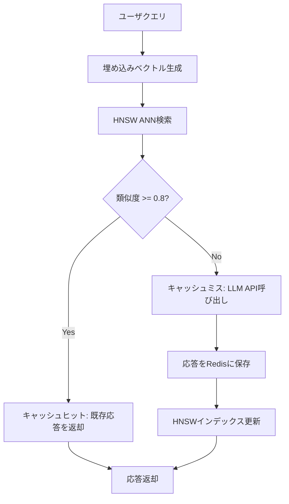

## 論文概要（Abstract）

本記事は [GPT Semantic Cache: Reducing LLM Costs and Latency via Semantic Embedding Caching](https://arxiv.org/abs/2411.05276) の解説記事です。

著者らは、LLM APIへの冗長な問い合わせを削減するために、Redis上にクエリ埋め込みをキャッシュし、意味的に類似したクエリに対して過去の応答を再利用するセマンティックキャッシュシステムを提案している。HNSW（Hierarchical Navigable Small World）グラフによる近似最近傍探索を用い、4カテゴリ計2,000件のテストクエリに対してキャッシュヒット率61.6%--68.8%、正のヒット率（キャッシュヒットが適切な応答を返す率）97%超を達成したと報告されている。

この記事は [Zenn記事: LLMアプリのトークンコスト削減ロードマップ：7戦略で月額費用を80%圧縮する](https://zenn.dev/0h_n0/articles/d028379c95b3c3) の深掘りです。Zenn記事の戦略4「セマンティックキャッシュで推論呼び出し自体を省く」を学術的に裏付ける内容として位置付けられる。

## 情報源

- **arXiv ID**: 2411.05276
- **URL**: [https://arxiv.org/abs/2411.05276](https://arxiv.org/abs/2411.05276)
- **著者**: Sajal Regmi, Chetan Phakami Pun
- **発表年**: 2024（初版: 2024年11月8日、改訂: 2024年12月9日）
- **分野**: cs.LG（Machine Learning）

## 背景と動機（Background & Motivation）

LLMのAPI呼び出しはトークン単位の課金であり、カスタマーサポートやFAQ対応のように同種のクエリが繰り返されるユースケースでは、意味的に同一の質問に対して毎回APIを呼び出すことがコスト面・レイテンシ面の双方で非効率となる。例えば「Pythonでリストをソートするには？」と「Pythonでのリストソート方法を教えてください」は文字列としては異なるが、意味的にはほぼ同一であり、同じ応答を返しても問題ない。

従来の完全一致キャッシュ（exact match cache）では、文字列が一文字でも異なればキャッシュミスとなるため、こうした表現の揺れに対応できない。この構造的課題を解決するために、著者らはクエリを埋め込みベクトルに変換し、ベクトル空間上のコサイン類似度に基づいてキャッシュヒット判定を行うセマンティックキャッシュを提案している。

## 主要な貢献（Key Contributions）

- **セマンティックキャッシュアーキテクチャの設計と実装**: 埋め込み生成、Redisインメモリストレージ、HNSW近似最近傍探索を統合した3コンポーネントの実用的システムを構築
- **コサイン類似度閾値の体系的評価**: 0.6--0.9の範囲で0.05刻みの閾値を比較し、0.8が精度とヒット率のバランス点であることを実験的に特定
- **4ドメインにわたるベンチマーク**: Python プログラミング、ネットワークサポート、注文/配送、ショッピングQAの4カテゴリでキャッシュ性能を定量評価
- **GPT-4o Miniによるヒット品質検証**: キャッシュヒットが返した応答の意味的妥当性を別のLLMで検証する品質保証プロセスを導入
- **npmパッケージとして公開**: `gpt-semantic-cache`としてオープンソース化

## 技術的詳細（Technical Details）

### セマンティックキャッシュのアーキテクチャ

本システムは以下の3コンポーネントから構成される。



**1. 埋め込み生成**: ユーザクエリをSentence-Transformersの`all-MiniLM-L6-v2`（384次元）で密ベクトルに変換する。OpenAIの`text-embedding-ada-002`（1,536次元）も利用可能であり、システムはONNX互換モデルを柔軟に差し替えられる設計となっている。

**2. Redisインメモリストレージ**: 生成された埋め込みベクトルと対応するLLM応答のペアをRedis上に保存する。データは埋め込み次元数ごとにパーティショニングされ、各エントリにはTTL（Time-To-Live）が設定される。TTLにより一定期間経過後にエントリが自動削除され、キャッシュの鮮度とメモリ使用量が管理される。

**3. HNSW近似最近傍探索**: 新規クエリの埋め込みに対して、保存済みベクトルから最も類似度の高いエントリをHNSWグラフで高速検索する。

### コサイン類似度とキャッシュヒット判定

2つのベクトル$\mathbf{u}$と$\mathbf{v}$のコサイン類似度は以下で定義される：

$$
\text{cosine\_similarity}(\mathbf{u}, \mathbf{v}) = \frac{\mathbf{u} \cdot \mathbf{v}}{\|\mathbf{u}\| \, \|\mathbf{v}\|}
$$

ここで、
- $\mathbf{u} \cdot \mathbf{v} = \sum_{i=1}^{d} u_i v_i$ : ベクトルの内積
- $\|\mathbf{u}\| = \sqrt{\sum_{i=1}^{d} u_i^2}$ : ユークリッドノルム
- $d$ : 埋め込みの次元数（all-MiniLM-L6-v2の場合 $d = 384$）

キャッシュヒット判定は閾値$\tau$を用いて：

$$
\text{hit}(q, q_{\text{cached}}) =
\begin{cases}
1 & \text{if } \text{cosine\_similarity}(\mathbf{e}_q, \mathbf{e}_{q_{\text{cached}}}) \geq \tau \\
0 & \text{otherwise}
\end{cases}
$$

ここで$\mathbf{e}_q$はクエリ$q$の埋め込みベクトル、$\tau = 0.8$が著者らの実験で最適と判定された閾値である。

### 閾値設定と偽陽性/偽陰性のトレードオフ

著者らは閾値$\tau$を0.6から0.9まで0.05刻みで評価し、以下のトレードオフを報告している：

- **$\tau < 0.8$**: キャッシュヒット率は上昇するが、意味的に異なるクエリにも誤って既存応答を返す偽陽性が増加し、応答品質が低下する
- **$\tau > 0.8$**: 偽陽性は減少するが、本来キャッシュから応答可能なクエリも見逃す偽陰性が増加し、LLM API呼び出しコストの削減幅が縮小する
- **$\tau = 0.8$**: 精度とコスト削減の均衡点であり、正のヒット率97%超を維持しつつ61.6%--68.8%のキャッシュヒット率を達成

### HNSWアルゴリズム

HNSW（Hierarchical Navigable Small World）は、多層グラフ構造によりベクトル検索を$O(\log n)$に高速化する近似最近傍探索アルゴリズムである。グラフ$G = (V, E)$において$V$は埋め込みベクトルの集合、$E$は近接ベクトル間のエッジを表す。

探索時にはグラフの最上位層（疎な層）から開始し、各層で最近傍方向にグラフを走査しながら下位層（密な層）に降りていく。この階層的走査により、全数探索の$O(n)$から$O(\log n)$へ計算量を削減しつつ、高いRecallを維持する。

$k$-最近傍の結果集合は以下で定義される：

$$
\text{result\_set} = \arg \text{top-}k \left( \text{cosine\_similarity}(\mathbf{e}_q, \mathbf{e}_i) \right), \quad \mathbf{e}_i \in V
$$

本システムでは`hnswlib-node`ライブラリを使用し、データ増加に伴うインデックスの動的リサイズと定期的なグラフ再構築が行われる。

## アルゴリズム（Pythonによるセマンティックキャッシュ実装）

以下は、本論文のアーキテクチャをPythonで再実装した場合の参考コードである。論文の実装はTypeScript（npm: `gpt-semantic-cache`）だが、理解のためにPythonで示す。

```python
import hashlib
import json
from typing import Optional

import numpy as np
import redis
from sentence_transformers import SentenceTransformer


class SemanticCache:
    """Redis + Sentence-Transformers によるセマンティックキャッシュ

    論文 arXiv:2411.05276 のアーキテクチャをPythonで再現した実装例。
    キャッシュヒット判定にコサイン類似度を使用し、
    閾値以上の類似度を持つ既存応答を返却する。

    Args:
        redis_url: Redis接続URL
        model_name: Sentence-Transformerモデル名
        similarity_threshold: キャッシュヒット判定の閾値（論文推奨: 0.8）
        ttl_seconds: キャッシュエントリのTTL（秒）
    """

    def __init__(
        self,
        redis_url: str = "redis://localhost:6379",
        model_name: str = "all-MiniLM-L6-v2",
        similarity_threshold: float = 0.8,
        ttl_seconds: int = 3600,
    ) -> None:
        self.client = redis.from_url(redis_url)
        self.model = SentenceTransformer(model_name)
        self.threshold = similarity_threshold
        self.ttl = ttl_seconds
        self.dimension = self.model.get_sentence_embedding_dimension()

    def _embed(self, text: str) -> np.ndarray:
        """テキストを埋め込みベクトルに変換する

        Args:
            text: 埋め込み対象のテキスト

        Returns:
            正規化済みの埋め込みベクトル（shape: (d,)）
        """
        embedding: np.ndarray = self.model.encode(
            text, normalize_embeddings=True
        )
        return embedding

    def _cosine_similarity(
        self, u: np.ndarray, v: np.ndarray
    ) -> float:
        """コサイン類似度を計算する

        正規化済みベクトルの場合は内積と一致する。

        Args:
            u: ベクトル1
            v: ベクトル2

        Returns:
            コサイン類似度（-1.0 ~ 1.0）
        """
        return float(np.dot(u, v))

    def _cache_key(self, query: str) -> str:
        """クエリのハッシュキーを生成する"""
        return f"sem_cache:{hashlib.sha256(query.encode()).hexdigest()[:16]}"

    def lookup(self, query: str) -> Optional[str]:
        """セマンティックキャッシュを検索する

        1. クエリを埋め込みベクトルに変換
        2. Redis上の全エントリと類似度を計算
        3. 閾値以上かつ最大類似度のエントリを返却

        Args:
            query: ユーザクエリ

        Returns:
            キャッシュヒット時は既存応答、ミス時はNone
        """
        query_embedding = self._embed(query)
        best_score = -1.0
        best_response: Optional[str] = None

        # Redis上の全キャッシュエントリを走査
        # 本番環境ではRedisVLやHNSWインデックスを使用すべき
        for key in self.client.scan_iter(match="sem_cache:*"):
            data = self.client.get(key)
            if data is None:
                continue
            entry = json.loads(data)
            cached_embedding = np.array(entry["embedding"])
            score = self._cosine_similarity(
                query_embedding, cached_embedding
            )
            if score >= self.threshold and score > best_score:
                best_score = score
                best_response = entry["response"]

        return best_response

    def store(self, query: str, response: str) -> None:
        """クエリと応答のペアをキャッシュに保存する

        Args:
            query: ユーザクエリ
            response: LLMの応答
        """
        embedding = self._embed(query)
        key = self._cache_key(query)
        entry = {
            "query": query,
            "embedding": embedding.tolist(),
            "response": response,
        }
        self.client.setex(key, self.ttl, json.dumps(entry))
```

上記は理解のための簡略版であり、論文の実装では`hnswlib-node`によるANNインデックスを使用している点に注意されたい。本番環境では全エントリの線形走査ではなく、HNSWインデックスやRedisVLの`VectorQuery`を用いた$O(\log n)$の検索が必須となる。

## 実装のポイント（Implementation）

**埋め込みモデルの選択**: `all-MiniLM-L6-v2`は384次元で軽量かつ高速だが、ドメイン固有の意味理解が求められる場合はファインチューニング済みモデルの使用が推奨される。OpenAIの`text-embedding-ada-002`（1,536次元）は精度が高いが、埋め込み生成自体にAPI呼び出しが必要となりコストが発生する。

**閾値のドメイン依存性**: 著者らは閾値0.8を推奨しているが、これは実験対象の4カテゴリに対する最適値であり、異なるドメインでは調整が必要となる可能性がある。専門用語の多い技術文書やニュアンスの違いが重要な法律文書では、閾値を0.85--0.90に引き上げることで偽陽性を抑制できる。

**TTL戦略**: TTLは固定値で設定されているが、実運用ではクエリ頻度やコンテンツの鮮度に応じた動的TTLが望ましい。高頻度クエリには長いTTL、時事的な質問には短いTTLを設定する適応的アプローチが考えられる。

**HNSWパラメータチューニング**: Redis上でHNSWインデックスを使用する場合の主要パラメータとして、`M`（グラフの接続数、推奨: 16）、`EF_CONSTRUCTION`（構築時の探索幅、推奨: 200）、`EF_RUNTIME`（検索時の探索幅、推奨: 10--200）がある。`M`を大きくするとRecallが向上するがメモリ消費が増加し、`EF_RUNTIME`を大きくすると精度が向上するがレイテンシが増加するトレードオフがある。

## Production Deployment Guide

### AWS実装パターン（コスト最適化重視）

セマンティックキャッシュシステムをAWS上にデプロイする場合のトラフィック量別推奨構成を示す。以下のコスト試算は記事生成時点（2026年6月）のAWS ap-northeast-1（東京）リージョン料金に基づく概算値であり、実際のコストはトラフィックパターンやバースト使用量により変動する。最新料金はAWS料金計算ツールで確認を推奨する。

| 構成 | トラフィック | アーキテクチャ | 月額概算 |
|------|-------------|---------------|---------|
| Small | ~100 req/日 | Lambda + ElastiCache Serverless + Bedrock | $50--150 |
| Medium | ~1,000 req/日 | ECS Fargate + ElastiCache (r7g.large) + Bedrock | $300--800 |
| Large | 10,000+ req/日 | EKS + ElastiCache Cluster (r7g.xlarge x3) + Bedrock Batch | $2,000--5,000 |

**Small構成の内訳**:
- Lambda（512MB, 平均200ms/実行）: ~$3/月
- ElastiCache Serverless (Redis OSS): ~$30/月（データ量依存）
- Bedrock（Claude 3.5 Haiku, キャッシュミス分のみ）: ~$15--100/月
- CloudWatch Logs: ~$5/月

**Large構成のコスト削減テクニック**:
- Spot Instancesをワーカーノードに活用で最大90%削減（EKS Karpenter経由）
- ElastiCache Reserved Nodesで最大55%削減（1年コミット）
- Bedrock Batch APIで非リアルタイム処理を50%削減

### Terraformインフラコード

#### Small構成（Serverless: Lambda + ElastiCache Serverless）

```hcl
# --- VPC基盤 ---
module "vpc" {
  source  = "terraform-aws-modules/vpc/aws"
  version = "~> 5.0"

  name = "semantic-cache-vpc"
  cidr = "10.0.0.0/16"

  azs             = ["ap-northeast-1a", "ap-northeast-1c"]
  private_subnets = ["10.0.1.0/24", "10.0.2.0/24"]
  # NAT Gateway不使用でコスト削減（VPCエンドポイント経由）
  enable_nat_gateway = false
}

# --- ElastiCache Serverless (Redis OSS) ---
resource "aws_elasticache_serverless_cache" "semantic_cache" {
  engine = "redis"
  name   = "semantic-cache"

  cache_usage_limits {
    data_storage {
      maximum = 5  # GB: 埋め込み384次元 x 10万エントリで約0.3GB
      unit    = "GB"
    }
    ecpu_per_second {
      maximum = 5000
    }
  }

  subnet_ids         = module.vpc.private_subnets
  security_group_ids = [aws_security_group.cache_sg.id]
}

# --- Lambda関数 ---
resource "aws_lambda_function" "cache_handler" {
  function_name = "semantic-cache-handler"
  runtime       = "python3.12"
  handler       = "handler.lambda_handler"
  timeout       = 30
  memory_size   = 512  # 埋め込みモデルロード用

  environment {
    variables = {
      REDIS_ENDPOINT       = aws_elasticache_serverless_cache.semantic_cache.endpoint[0].address
      SIMILARITY_THRESHOLD = "0.8"
      CACHE_TTL_SECONDS    = "3600"
      BEDROCK_MODEL_ID     = "anthropic.claude-3-5-haiku-20241022-v1:0"
    }
  }

  role = aws_iam_role.lambda_role.arn
}

# --- IAMロール（最小権限） ---
resource "aws_iam_role" "lambda_role" {
  name = "semantic-cache-lambda-role"
  assume_role_policy = jsonencode({
    Version = "2012-10-17"
    Statement = [{
      Action    = "sts:AssumeRole"
      Effect    = "Allow"
      Principal = { Service = "lambda.amazonaws.com" }
    }]
  })
}

resource "aws_iam_role_policy" "lambda_policy" {
  role = aws_iam_role.lambda_role.id
  policy = jsonencode({
    Version = "2012-10-17"
    Statement = [
      {
        Effect   = "Allow"
        Action   = ["bedrock:InvokeModel"]
        Resource = "arn:aws:bedrock:ap-northeast-1::foundation-model/anthropic.claude-*"
      },
      {
        Effect   = "Allow"
        Action   = ["elasticache:Connect"]
        Resource = aws_elasticache_serverless_cache.semantic_cache.arn
      },
      {
        Effect = "Allow"
        Action = [
          "logs:CreateLogGroup",
          "logs:CreateLogStream",
          "logs:PutLogEvents"
        ]
        Resource = "arn:aws:logs:*:*:*"
      }
    ]
  })
}

# --- CloudWatchアラーム（コスト監視） ---
resource "aws_cloudwatch_metric_alarm" "lambda_cost" {
  alarm_name          = "semantic-cache-invocation-spike"
  comparison_operator = "GreaterThanThreshold"
  evaluation_periods  = 1
  metric_name         = "Invocations"
  namespace           = "AWS/Lambda"
  period              = 3600
  statistic           = "Sum"
  threshold           = 500
  alarm_description   = "Lambda invocations exceeded 500/hour"
  dimensions = {
    FunctionName = aws_lambda_function.cache_handler.function_name
  }
}

# --- セキュリティグループ ---
resource "aws_security_group" "cache_sg" {
  name_prefix = "semantic-cache-"
  vpc_id      = module.vpc.vpc_id

  ingress {
    from_port       = 6379
    to_port         = 6379
    protocol        = "tcp"
    security_groups = [] # Lambda用SGから許可
  }
}
```

#### Large構成（Container: EKS + ElastiCache Cluster）

```hcl
# --- EKSクラスタ ---
module "eks" {
  source  = "terraform-aws-modules/eks/aws"
  version = "~> 20.0"

  cluster_name    = "semantic-cache-cluster"
  cluster_version = "1.31"

  vpc_id     = module.vpc.vpc_id
  subnet_ids = module.vpc.private_subnets

  eks_managed_node_groups = {
    workers = {
      instance_types = ["m7i.large"]
      capacity_type  = "SPOT"  # Spot優先で最大90%削減
      min_size       = 2
      max_size       = 10
      desired_size   = 3
    }
  }
}

# --- Karpenter Provisioner（Spot優先） ---
resource "kubectl_manifest" "karpenter_nodepool" {
  yaml_body = <<-YAML
    apiVersion: karpenter.sh/v1
    kind: NodePool
    metadata:
      name: semantic-cache-pool
    spec:
      template:
        spec:
          requirements:
            - key: karpenter.sh/capacity-type
              operator: In
              values: ["spot", "on-demand"]
            - key: node.kubernetes.io/instance-type
              operator: In
              values: ["m7i.large", "m7i.xlarge", "m6i.large"]
          nodeClassRef:
            group: karpenter.k8s.aws
            kind: EC2NodeClass
            name: default
      limits:
        cpu: "40"
        memory: 80Gi
      disruption:
        consolidationPolicy: WhenEmptyOrUnderutilized
  YAML
}

# --- ElastiCache Cluster（3ノードReplication Group） ---
resource "aws_elasticache_replication_group" "semantic_cache" {
  replication_group_id = "semantic-cache-rg"
  description          = "Semantic cache Redis cluster"
  node_type            = "cache.r7g.xlarge"
  num_cache_clusters   = 3
  engine               = "redis"
  engine_version       = "7.1"

  at_rest_encryption_enabled = true  # KMS暗号化
  transit_encryption_enabled = true
  subnet_group_name          = aws_elasticache_subnet_group.cache.name
  security_group_ids         = [aws_security_group.cache_sg.id]
}

# --- AWS Budgets（予算アラート） ---
resource "aws_budgets_budget" "monthly" {
  name         = "semantic-cache-monthly"
  budget_type  = "COST"
  limit_amount = "5000"
  limit_unit   = "USD"
  time_unit    = "MONTHLY"

  notification {
    comparison_operator       = "GREATER_THAN"
    threshold                 = 80
    threshold_type            = "PERCENTAGE"
    notification_type         = "ACTUAL"
    subscriber_email_addresses = ["ops@example.com"]
  }
}
```

### 運用・監視設定

#### CloudWatch Logs Insights クエリ

```
# キャッシュヒット率の1時間ごとの推移
fields @timestamp, cache_hit, similarity_score
| stats count(*) as total,
        sum(cache_hit) as hits,
        (sum(cache_hit) * 100.0 / count(*)) as hit_rate_pct,
        avg(similarity_score) as avg_similarity
  by bin(1h) as hour
| sort hour desc

# コスト異常検知: Bedrock APIコール急増
fields @timestamp, event_type
| filter event_type = "bedrock_invoke"
| stats count(*) as api_calls by bin(1h) as hour
| filter api_calls > 200
| sort hour desc
```

#### CloudWatch アラーム設定コード（Python）

```python
import boto3


def create_cache_alarms(function_name: str, sns_topic_arn: str) -> None:
    """セマンティックキャッシュ用のCloudWatchアラームを作成する

    Args:
        function_name: Lambda関数名
        sns_topic_arn: 通知先SNSトピックARN
    """
    cw = boto3.client("cloudwatch", region_name="ap-northeast-1")

    # Bedrock APIコール数スパイク検知
    cw.put_metric_alarm(
        AlarmName="semantic-cache-bedrock-spike",
        MetricName="CacheMissCount",
        Namespace="SemanticCache/Custom",
        Statistic="Sum",
        Period=3600,
        EvaluationPeriods=1,
        Threshold=500,
        ComparisonOperator="GreaterThanThreshold",
        AlarmActions=[sns_topic_arn],
        AlarmDescription="Cache miss rate spike detected",
    )

    # Lambda実行時間異常検知
    cw.put_metric_alarm(
        AlarmName="semantic-cache-latency-p99",
        MetricName="Duration",
        Namespace="AWS/Lambda",
        ExtendedStatistic="p99",
        Period=300,
        EvaluationPeriods=3,
        Threshold=10000,
        ComparisonOperator="GreaterThanThreshold",
        Dimensions=[
            {"Name": "FunctionName", "Value": function_name}
        ],
        AlarmActions=[sns_topic_arn],
        AlarmDescription="Lambda P99 latency > 10s",
    )
```

#### X-Ray トレーシング設定コード（Python）

```python
from aws_xray_sdk.core import patch_all, xray_recorder

# boto3自動計装
patch_all()


@xray_recorder.capture("semantic_cache_lookup")
def handle_query(query: str) -> dict:
    """X-Rayトレース付きクエリ処理

    Args:
        query: ユーザクエリ

    Returns:
        応答とメタデータ
    """
    subsegment = xray_recorder.current_subsegment()
    subsegment.put_annotation("query_length", len(query))

    # キャッシュ検索
    cached = cache.lookup(query)
    subsegment.put_metadata("cache_hit", cached is not None)

    if cached:
        subsegment.put_annotation("cache_hit", True)
        return {"response": cached, "source": "cache"}

    # LLM呼び出し
    response = invoke_bedrock(query)
    cache.store(query, response)
    subsegment.put_annotation("cache_hit", False)
    return {"response": response, "source": "llm"}
```

#### Cost Explorer 自動レポート（Python）

```python
import datetime
import json

import boto3


def daily_cost_report(sns_topic_arn: str) -> None:
    """日次コストレポートを取得しSNS通知する

    Args:
        sns_topic_arn: 通知先SNSトピックARN
    """
    ce = boto3.client("ce", region_name="us-east-1")
    sns = boto3.client("sns", region_name="ap-northeast-1")

    today = datetime.date.today()
    yesterday = today - datetime.timedelta(days=1)

    response = ce.get_cost_and_usage(
        TimePeriod={
            "Start": yesterday.isoformat(),
            "End": today.isoformat(),
        },
        Granularity="DAILY",
        Metrics=["UnblendedCost"],
        Filter={
            "Or": [
                {"Dimensions": {"Key": "SERVICE", "Values": ["Amazon Bedrock"]}},
                {"Dimensions": {"Key": "SERVICE", "Values": ["Amazon ElastiCache"]}},
                {"Dimensions": {"Key": "SERVICE", "Values": ["AWS Lambda"]}},
            ]
        },
        GroupBy=[{"Type": "DIMENSION", "Key": "SERVICE"}],
    )

    total = sum(
        float(g["Metrics"]["UnblendedCost"]["Amount"])
        for r in response["ResultsByTime"]
        for g in r["Groups"]
    )

    # $100/日超過でアラート
    if total > 100:
        sns.publish(
            TopicArn=sns_topic_arn,
            Subject="[ALERT] Semantic Cache daily cost exceeded $100",
            Message=json.dumps(
                {"date": yesterday.isoformat(), "total_cost": f"${total:.2f}"},
                indent=2,
            ),
        )
```

### コスト最適化チェックリスト

**アーキテクチャ選択**:
- [ ] トラフィック量に応じた構成を選択（~100 req/日: Serverless、~1,000: Hybrid、10,000+: Container）
- [ ] キャッシュヒット率60%以上が見込めるユースケースか確認

**リソース最適化**:
- [ ] EKSワーカーノードでSpot Instancesを優先設定（最大90%削減）
- [ ] ElastiCache Reserved Nodesを1年コミットで購入検討（最大55%削減）
- [ ] Savings Plansの適用対象を確認
- [ ] Lambda メモリサイズを埋め込みモデルに合わせて最適化（512MB--1024MB）
- [ ] ElastiCache ノードサイズをベクトル数に基づき適正化

**LLMコスト削減**:
- [ ] Bedrock Batch APIを非同期処理に使用（50%削減）
- [ ] Bedrock Prompt Cachingを長いシステムプロンプトに有効化（最大90%削減）
- [ ] キャッシュミス時のモデル選択ロジック（軽量→重量のフォールバック）
- [ ] 最大トークン数を用途に応じて制限

**監視・アラート**:
- [ ] AWS Budgets で月額上限アラートを設定
- [ ] CloudWatch アラームでキャッシュミス率急増を検知
- [ ] Cost Anomaly Detection を有効化
- [ ] 日次コストレポートをSNS/Slack通知

**リソース管理**:
- [ ] 未使用のElastiCacheスナップショットを定期削除
- [ ] コストタグ戦略（環境/チーム/プロジェクト単位）
- [ ] CloudWatch Logsのライフサイクルポリシー（30日保持）
- [ ] 開発環境のElastiCache/EKSを夜間・休日に停止
- [ ] 不要なVPCエンドポイントを削除

## 実験結果（Results）

著者らは8,000件のQ&Aペアでキャッシュを構築し、4カテゴリ各500件、計2,000件のテストクエリで評価を行っている。以下は論文Table 1より抜粋した結果である。

| カテゴリ | テスト数 | キャッシュヒット | 正のヒット | ヒット率 | 正のヒット率 |
|---------|---------|---------------|-----------|---------|------------|
| Python Programming | 500 | 335 | 310 | 67.0% | 92.5% |
| Network Support | 500 | 335 | 326 | 67.0% | 97.3% |
| Order/Shipping | 500 | 344 | 331 | 68.8% | 96.2% |
| Shopping QA | 500 | 308 | 298 | 61.6% | 96.8% |
| **合計** | **2,000** | **1,322** | **1,265** | **66.1%** | **95.7%** |

**キャッシュヒット率**: 4カテゴリ全体で66.1%であり、Order/Shippingが68.8%で最も高く、Shopping QAが61.6%で最も低い。著者らは、Order/Shippingカテゴリは定型的な問い合わせが多いためヒット率が高く、Shopping QAは商品名やブランドの多様性によりヒット率が低下したと分析している。

**正のヒット率**: キャッシュヒットのうち、GPT-4o Miniによる評価で意味的に適切と判定された割合は全体で95.7%であり、Network Supportカテゴリでは97.3%に達する。

**API呼び出し削減**: キャッシュヒット分のLLM APIコールが不要となるため、最大68.8%（Order/Shipping）のAPIコスト削減が見込める。

## 実運用への応用（Practical Applications）

**カスタマーサポート**: 本論文で評価された4カテゴリはいずれもカスタマーサポートの典型的なドメインであり、定型的な問い合わせが多い環境ではキャッシュヒット率60--70%が期待できる。Zenn記事で紹介されている「月額費用80%圧縮」のロードマップにおいて、セマンティックキャッシュは他の戦略（プロンプト圧縮、モデルルーティング等）と組み合わせることで相乗効果を発揮する。

**FAQ・ヘルプデスク**: 質問パターンが限定的なFAQシステムでは、キャッシュを事前にウォームアップ（典型的なQ&Aペアを投入）することで、初期段階から高いヒット率を達成できる。

**マルチテナント環境での注意点**: テナントごとにキャッシュを分離しないと、あるテナント固有のコンテキストが別テナントのクエリに誤って返却されるリスクがある。Redisのキー名にテナントIDをプレフィックスとして付与するか、データベース番号で分離する設計が必要となる。

**スケーリングの限界**: 著者らは数百万エントリ規模でHNSWのメンテナンスオーバーヘッドが増大すると指摘しており、大規模環境ではRedis Clusterによるシャーディングや、定期的な低頻度エントリのパージが必要となる。

## 関連研究（Related Work）

- **GPTCache** (Bang, 2023, [ACL NLP-OSS 2023](https://aclanthology.org/2023.nlposs-1.24/)): LLM応答のセマンティックキャッシュを実現するオープンソースPythonライブラリ。GPT Semantic Cacheと同様にベクトル類似度によるヒット判定を行うが、GPTCacheはより汎用的な設計で複数のストレージバックエンド（SQLite, MySQL, Redis等）をサポートしている。本論文はRedisに特化することでインメモリ検索のレイテンシ優位性を追求している点が差別化ポイントとなる
- **MeanCache** (Gupta et al., 2024, [arXiv:2403.02694](https://arxiv.org/abs/2403.02694)): ユーザ側にキャッシュを配置するプライバシー重視のセマンティックキャッシュ。クエリと応答がユーザデバイス外に保存されない設計で、コンテキストチェーン（会話履歴）をエンコードする機構を持つ。F-scoreで約17%、精度で約20%の向上を報告しており、マルチターン対話への対応で本論文を補完する位置づけにある
- **vCache** (2025, [arXiv:2502.03771](https://arxiv.org/abs/2502.03771)): 静的閾値の限界に着目し、キャッシュ済みプロンプトごとにオンライン学習で最適閾値を推定する手法。本論文が固定閾値0.8を採用しているのに対し、vCacheはユーザ定義のエラー率保証を提供する点で発展的な研究と位置付けられる

## まとめと今後の展望

本論文は、LLM APIのコスト削減手法としてセマンティックキャッシュの有効性を実証した。Redis上のHNSWインデックスとコサイン類似度閾値0.8の組み合わせにより、キャッシュヒット率61.6%--68.8%を達成しつつ、正のヒット率97%超の応答品質を維持している。

今後の研究方向として、著者らはドメインやクエリ特性に応じた動的閾値調整、分散キャッシュによるフォールトトレランス向上、マルチターン対話への対応を挙げている。実務的には、vCacheで提案されているプロンプトごとの適応的閾値設定や、MeanCacheのプライバシー保護アプローチとの統合が有望と考えられる。

## 参考文献

- **arXiv**: [https://arxiv.org/abs/2411.05276](https://arxiv.org/abs/2411.05276)
- **npm Package**: [gpt-semantic-cache](https://www.npmjs.com/package/gpt-semantic-cache)
- **GPTCache (ACL NLP-OSS 2023)**: [https://aclanthology.org/2023.nlposs-1.24/](https://aclanthology.org/2023.nlposs-1.24/)
- **MeanCache (arXiv:2403.02694)**: [https://arxiv.org/abs/2403.02694](https://arxiv.org/abs/2403.02694)
- **vCache (arXiv:2502.03771)**: [https://arxiv.org/abs/2502.03771](https://arxiv.org/abs/2502.03771)
- **Related Zenn article**: [https://zenn.dev/0h_n0/articles/d028379c95b3c3](https://zenn.dev/0h_n0/articles/d028379c95b3c3)
