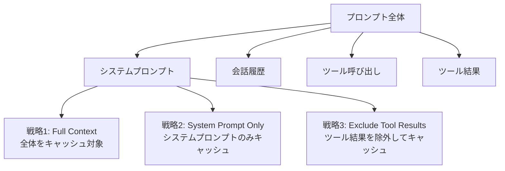
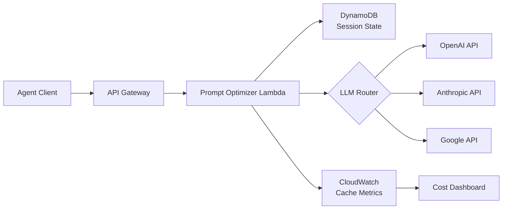

## 論文概要

本記事は [Don't Break the Cache: An Evaluation of Prompt Caching for Long-Horizon Agentic Tasks](https://arxiv.org/abs/2601.06007) の解説記事です。

Lumer ら（2026）は、OpenAI・Anthropic・Google の 3 プロバイダが提供するプロンプトキャッシュ機構を、マルチターンのエージェントタスクで体系的に評価した。DeepResearch Bench（100 問、22 分野）を用いた 500 以上のエージェントセッションでテストした結果、プロンプトキャッシュにより API コストを 41--80% 削減し、最初のトークンまでの応答時間（TTFT）を 13--31% 改善できることを示した。さらに、動的コンテンツの配置戦略によってキャッシュ効率が大きく変わることを明らかにした。

---

**この記事は [Zenn記事: LLMアプリのトークンコスト削減ロードマップ：7戦略で月額費用を80%圧縮する](https://zenn.dev/0h_n0/articles/d028379c95b3c3) の深掘りです。** Zenn 記事で取り上げた「戦略2: プロンプトキャッシュを活用する」について、本論文の実験結果に基づいて詳細に解説します。

---

## 情報源

| 項目 | 内容 |
|------|------|
| タイトル | Don't Break the Cache: An Evaluation of Prompt Caching for Long-Horizon Agentic Tasks |
| 著者 | Elias Lumer, Faheem Nizar, Akshaya Jangiti, Kevin Frank, Anmol Gulati, Mandar Phadate, Vamse Kumar Subbiah |
| arXiv ID | [2601.06007](https://arxiv.org/abs/2601.06007) |
| 初回投稿 | 2026年1月9日（改訂: 2026年1月31日） |
| 分野 | cs.CL（計算言語学） |
| ページ数 | 16ページ、9図 |
| ライセンス | CC BY 4.0 |

---

## 背景と動機

LLM エージェントシステムでは、ツール呼び出しのたびにプロンプト全体が再送されるため、セッションが長期化するほど入力トークン量が累積的に増加する。主要プロバイダはプロンプトキャッシュを提供しているが、実装方式は異なり（自動 vs 明示的、最小トークン閾値、TTL の違い）、エージェントタスクでの効果は体系的に検証されていなかった。

本論文は「キャッシュ戦略の選択がコストと応答速度にどう影響するか」に答えることを目的とし、プロンプト内のキャッシュ境界配置が性能を大きく左右することを実験的に示した。

---

## 主要な貢献

著者らは以下の 5 点を主要な貢献として報告している。

1. **3 プロバイダ横断の体系的評価**: OpenAI（GPT-4o, GPT-5.2）、Anthropic（Claude Sonnet 4.5）、Google（Gemini 2.5 Pro）の 4 モデルを同一条件で比較した初めての研究
2. **3 つのキャッシュ戦略の定義と比較**: Full Context、System Prompt Only、Exclude Tool Results の 3 戦略を定義し、それぞれの効果を定量化
3. **コスト 41--80% 削減の実証**: 戦略的キャッシュ配置により、全モデルで一貫したコスト削減を確認（論文 Table 1 より）
4. **TTFT 改善と逆効果の発見**: Full Context キャッシュは TTFT を悪化させる場合がある一方、戦略的配置は 13--31% の改善を達成
5. **スケーラビリティの検証**: プロンプトサイズ 500--50,000 トークン、ツール呼び出し 3--50 回の範囲で線形的な効果を確認

---

## 技術的詳細

### 3つのキャッシュ戦略

著者らは、キャッシュ境界の配置方法に基づいて 3 つの戦略を定義している。



**戦略1: Full Context Caching（全コンテキストキャッシュ）**

UUID などの境界マーカーを挿入せず、プロバイダの自動キャッシュ機構にすべてを委ねる方式。ツール呼び出し結果を含むプロンプト全体がキャッシュ対象となる。実装は最も単純だが、動的なツール結果がキャッシュされることでキャッシュ書き込みオーバーヘッドが増加する問題がある。

**戦略2: System Prompt Only Caching（システムプロンプトのみキャッシュ）**

システムプロンプトの末尾に UUID を付加してキャッシュ境界を設定する。安定したシステムプロンプト部分のみがキャッシュ対象となり、会話履歴やツール結果は毎回再計算される。

**戦略3: Exclude Tool Results Caching（ツール結果除外キャッシュ）**

システムプロンプトの末尾と各ツール結果の後ろにそれぞれ UUID を付加する二重境界方式。セッション固有のツール出力がキャッシュに混入するのを防ぎつつ、ツール呼び出しの定義部分はキャッシュに含める。

### 各プロバイダのキャッシュ実装の違い

各プロバイダはキャッシュの仕組みが根本的に異なる（論文 Table 3, Table 4 より）。

| 項目 | OpenAI | Anthropic | Google |
|------|--------|-----------|--------|
| キャッシュ方式 | 自動（prefix matching） | 明示的（cache_control マーカー） | 暗黙的 + 明示的の併用 |
| 最小トークン閾値 | 1,024 | 1,024 | 4,096 |
| キャッシュ読み取りコスト | 入力単価の 10% | 入力単価の 10% | 入力単価の 10% |
| TTL | 5--10 分 | 5 分 | 最大 24 時間 |
| キャッシュ書き込みコスト | なし（入力と同額） | 入力単価の 125% | なし |

特筆すべきは Anthropic の「書き込みコスト」である。Anthropic ではキャッシュ書き込み時に通常入力の 125% の料金が発生するため、キャッシュヒット率が低い場合はコスト増になるリスクがある。一方、OpenAI と Google では書き込み時の追加料金は発生しない。

### プロンプト構造とキャッシュヒット率の関係

プロンプトキャッシュは prefix matching（先頭一致）に基づくため、プロンプトの先頭から一致する部分のみがキャッシュヒットする。したがって、動的コンテンツ（タイムスタンプ、セッション ID、ツール結果など）をプロンプトの先頭付近に配置すると、それ以降すべてのキャッシュが無効化される。

著者らは次の設計原則を提唱している。

> 「動的な値をシステムプロンプト内に含めることを避けるべきである。タイムスタンプ、日時文字列、セッション識別子、ユーザー固有の情報をシステムプロンプトに埋め込むパターンはキャッシュを意図せず破壊する。動的情報が必要な場合は、キャッシュ可能な prefix を最大化するためにシステムプロンプトの末尾に配置すべきである。」（論文 Section 5 より）

### コスト計算の定式化

API レスポンスで報告されるトークン数に基づき、コストは以下のように計算される。

$$
C_{\text{total}} = n_{\text{standard}} \cdot p_{\text{input}} + n_{\text{cached}} \cdot p_{\text{cache\_read}} + n_{\text{write}} \cdot p_{\text{cache\_write}} + n_{\text{output}} \cdot p_{\text{output}}
$$

ここで、

- $n_{\text{standard}}$: 標準入力トークン数
- $n_{\text{cached}}$: キャッシュ読み取りトークン数
- $n_{\text{write}}$: キャッシュ書き込みトークン数
- $p_{\text{input}}$, $p_{\text{cache\_read}}$, $p_{\text{cache\_write}}$, $p_{\text{output}}$: 各トークン種別の単価

コスト削減率は、キャッシュなしの場合のコスト $C_{\text{baseline}}$ との比較で算出される。

$$
\text{Cost Reduction (\%)} = \frac{C_{\text{baseline}} - C_{\text{cached}}}{C_{\text{baseline}}} \times 100
$$

キャッシュ読み取り単価が入力単価の 10% である場合、キャッシュヒット率 $h$ に対するコスト削減の理論上限は以下で近似できる。

$$
\text{Max Reduction} \approx h \times 0.9 \times \frac{n_{\text{input}}}{n_{\text{input}} + n_{\text{output}}}
$$

---

## アルゴリズム: 戦略的プロンプト構造化によるキャッシュ最適化

以下は、論文の戦略的キャッシュ配置を Python で実装した例である。Anthropic の明示的キャッシュ制御と OpenAI の自動キャッシュの両方に対応する。

```python
"""戦略的プロンプト構造化によるキャッシュ最適化の実装例."""

from dataclasses import dataclass, field
from typing import Any


@dataclass
class CacheOptimizedPrompt:
    """キャッシュ最適化を意識したプロンプトビルダー."""

    system_prompt_static: str
    tool_definitions: list[dict[str, Any]] = field(default_factory=list)
    conversation_history: list[dict[str, str]] = field(default_factory=list)
    dynamic_context: dict[str, str] = field(default_factory=dict)

    def build_for_anthropic(self, strategy: str = "system_prompt_only") -> dict[str, Any]:
        """Anthropic API 用のキャッシュ最適化リクエストを構築する."""
        # 静的システムプロンプトにキャッシュブレークポイントを設定
        system_content: list[dict[str, Any]] = [
            {"type": "text", "text": self.system_prompt_static,
             "cache_control": {"type": "ephemeral"}},
        ]
        # 動的コンテキストはキャッシュ対象外（末尾に配置）
        if self.dynamic_context:
            dynamic_text = "\n".join(f"{k}: {v}" for k, v in self.dynamic_context.items())
            system_content.append({"type": "text", "text": dynamic_text})

        messages = []
        for msg_item in self.conversation_history:
            content: str | list[dict[str, Any]] = msg_item["content"]
            # exclude_tool_results 戦略: ツール結果にキャッシュ境界を挿入
            if strategy == "exclude_tool_results" and msg_item.get("role") == "tool":
                content = [
                    {"type": "text", "text": msg_item["content"]},
                    {"type": "text", "text": "", "cache_control": {"type": "ephemeral"}},
                ]
            messages.append({"role": msg_item["role"], "content": content})

        return {"model": "claude-sonnet-4-5-20250514", "system": system_content,
                "messages": messages, "tools": self.tool_definitions}

    def build_for_openai(self) -> dict[str, Any]:
        """OpenAI API 用（自動キャッシュ: 先頭を安定させるだけ）."""
        messages: list[dict[str, str]] = [
            {"role": "system", "content": self.system_prompt_static},
        ]
        if self.dynamic_context:
            dynamic_text = "\n".join(f"{k}: {v}" for k, v in self.dynamic_context.items())
            messages.append({"role": "system", "content": dynamic_text})
        messages.extend(self.conversation_history)
        return {"model": "gpt-5.2", "messages": messages, "tools": self.tool_definitions}


def estimate_cost_savings(
    total_input_tokens: int, cache_hit_tokens: int, cache_write_tokens: int,
    input_price_per_m: float, cache_read_price_per_m: float, cache_write_price_per_m: float,
) -> dict[str, float]:
    """キャッシュによるコスト削減率を推定する."""
    standard = total_input_tokens - cache_hit_tokens - cache_write_tokens
    baseline = total_input_tokens * input_price_per_m / 1_000_000
    cached = (standard * input_price_per_m + cache_hit_tokens * cache_read_price_per_m
              + cache_write_tokens * cache_write_price_per_m) / 1_000_000
    return {"baseline_cost_usd": baseline, "cached_cost_usd": cached,
            "savings_usd": baseline - cached,
            "reduction_percent": (baseline - cached) / baseline * 100 if baseline > 0 else 0.0}
```

---

## 実装のポイント

**1. 動的コンテンツの分離**: システムプロンプトにタイムスタンプやセッション ID を直接埋め込まず、別メッセージとして末尾に配置する。この変更だけでキャッシュヒット率が大幅に向上する。

**2. ツール定義の安定化**: ツール定義はセッション間で変更されないことが多いためキャッシュ対象に含めるべきである。動的にツールを切り替える設計ではキャッシュが破壊される。著者らはコード生成優先の設計を推奨している。

**3. 最小トークン閾値**: Google Gemini は 4,096 トークン、OpenAI/Anthropic は 1,024 トークン。500 トークン条件では TTFT が 10--18% 悪化する（論文 Figure 4 より）。

**4. Anthropic の書き込みコスト**: 書き込み時に入力単価の 125% が課金されるため、キャッシュヒット率が低いワークロードではコスト増のリスクがある。TTL 5 分以内の連続セッションを前提とした設計が求められる。

---

## Production Deployment Guide

### AWS 実装パターン: エージェントキャッシュ最適化基盤

本論文の知見をプロダクション環境に適用するための AWS アーキテクチャパターンを示す。API Gateway + Lambda によるプロンプト最適化ミドルウェアを配置し、DynamoDB でセッション状態を管理、CloudWatch でキャッシュメトリクスを監視する構成である。



#### 主要 AWS リソース構成

| リソース | 用途 | 設定ポイント |
|---------|------|-------------|
| Lambda (`prompt-cache-optimizer`) | プロンプト構造を最適化して LLM API に転送 | `CACHE_STRATEGY` 環境変数で戦略切り替え |
| DynamoDB (`agent-sessions`) | セッション状態管理（静的システムプロンプトの保持） | TTL 付き、PAY_PER_REQUEST |
| CloudWatch Alarm | TTFT p95 劣化の検知 | 閾値超過時に SNS 通知 |
| CloudWatch Dashboard | キャッシュヒット率・コスト削減率の可視化 | プロバイダ別メトリクス表示 |

Lambda ハンドラの中核ロジックは以下の通りである。

```python
"""プロンプトキャッシュ最適化 Lambda ハンドラ（中核部分）."""

import json
import time
from typing import Any

import boto3

cloudwatch = boto3.client("cloudwatch")


def lambda_handler(event: dict[str, Any], context: Any) -> dict[str, Any]:
    """プロンプトを最適化して LLM API にルーティングする."""
    body = json.loads(event["body"])

    # 動的コンテンツを末尾に分離（キャッシュヒット率最大化）
    optimized_system = body["system_prompt"]
    if dynamic := body.get("dynamic_context"):
        optimized_system += "\n---\n" + "\n".join(
            f"{k}: {v}" for k, v in dynamic.items()
        )

    start = time.time()
    response = _call_llm_api(body["provider"], optimized_system, body["messages"])
    ttft_ms = (time.time() - start) * 1000

    # キャッシュメトリクスを CloudWatch に送信
    usage = response.get("usage", {})
    total_input = usage.get("prompt_tokens", 1)
    hit_rate = usage.get("cached_tokens", 0) / total_input

    cloudwatch.put_metric_data(
        Namespace="PromptCache",
        MetricData=[
            {"MetricName": "CacheHitRate", "Value": hit_rate, "Unit": "None",
             "Dimensions": [{"Name": "Provider", "Value": body["provider"]}]},
            {"MetricName": "TTFTMs", "Value": ttft_ms, "Unit": "Milliseconds",
             "Dimensions": [{"Name": "Provider", "Value": body["provider"]}]},
        ],
    )
    return {"statusCode": 200, "body": json.dumps(response)}
```

#### 運用監視チェックリスト

| チェック項目 | 確認頻度 | 判定基準 | 対応策 |
|-------------|---------|---------|--------|
| キャッシュヒット率 | 日次 | > 60% | プロンプト構造の動的要素を確認 |
| コスト削減率 | 週次 | > 40% | 戦略の切り替えを検討 |
| TTFT p95 | リアルタイム | < 5s | Full Context から戦略的配置に切り替え |
| キャッシュ書き込みコスト（Anthropic） | 週次 | 書き込み < 読み取りの 20% | TTL 内の再利用頻度を確認 |
| 最小トークン閾値の充足 | デプロイ時 | システムプロンプト > 閾値 | Google は 4,096 トークン以上を確保 |

#### コスト最適化チェックリスト

1. **プロバイダ選定**: コスト最優先なら GPT-5.2（79.6% 削減）、制御性重視なら Anthropic、長時間キャッシュなら Google（TTL 最大 24 時間）
2. **戦略選択**: 一般的なエージェントタスクには System Prompt Only が安全。ツール呼び出しが多い場合は Exclude Tool Results を検証
3. **プロンプト設計**: 静的部分を最大化し、最小トークン閾値を超えるシステムプロンプトを確保
4. **動的要素の隔離**: タイムスタンプ、セッション ID、ユーザー情報を末尾に配置
5. **メトリクス駆動**: キャッシュヒット率とコスト削減率を継続的に監視し、閾値アラートを設定

---

## 実験結果

### DeepResearch Bench での評価

著者らは DeepResearch Bench（100 問、22 分野の PhD レベル研究質問）を用いて、4 モデル x 3 戦略 = 12 条件のベンチマークを実施した。各条件につき 40 セッション（計 500 以上）を実行し、独立標本 t 検定（$\alpha = 0.05$）で有意性を検証している。

**コスト削減結果**（論文 Table 1 より）:

| モデル | Full Context | System Prompt Only | Exclude Tool Results |
|--------|-------------|-------------------|---------------------|
| GPT-5.2 | 71.2% | 78.3% | **79.6%** |
| Claude Sonnet 4.5 | 72.1% | **78.5%** | 76.9% |
| Gemini 2.5 Pro | 27.8% | **41.4%** | 39.7% |
| GPT-4o | 38.6% | **45.9%** | 44.2% |

**TTFT 改善結果**（論文 Table 2 より）:

| モデル | Full Context | System Prompt Only | Exclude Tool Results |
|--------|-------------|-------------------|---------------------|
| GPT-5.2 | -8.8% | 10.2% | **13.0%** |
| Claude Sonnet 4.5 | 3.1% | **22.9%** | 19.4% |
| Gemini 2.5 Pro | -2.3% | **6.1%** | 4.8% |
| GPT-4o | 16.4% | 28.7% | **30.9%** |

注目すべき点として、Full Context 戦略は GPT-5.2 で TTFT を 8.8% **悪化**させている。著者らはこの原因を「動的なツール呼び出しとその結果に対するキャッシュ書き込みオーバーヘッドが、キャッシュ読み取りの利益を相殺している」と分析している（論文 Section 4.2 より）。

### スケーラビリティ評価

アブレーション実験（論文 Figure 4, 5 より）の結果、コスト削減率は 500--50,000 トークンの範囲で線形的に増加する一方、ツール呼び出し数（3--50 回）の影響は約 10 ポイント以内にとどまり、システムプロンプトサイズが支配的な要因であることが確認された。

---

## 実運用への応用

**1. エージェントフレームワークへの組み込み**: LangChain、CrewAI 等のフレームワークで、システムプロンプトとツール定義を先頭に固定し動的コンテキストを末尾に自動配置する設計が有効である。

**2. マルチプロバイダ運用**: 短いセッション間隔（5 分以内）では OpenAI/Anthropic、長時間バッチ処理では Google（TTL 最大 24 時間）が適している。

**3. コスト監視**: API レスポンスの `cached_tokens` を活用しキャッシュヒット率を監視すべきである。System Prompt Only 戦略で 40% 以上のコスト削減が未達の場合、プロンプト構造に問題がある可能性が高い。

**4. セキュリティ考慮**: マルチテナント環境でキャッシュが共有される場合、応答時間の差分から他ユーザーのプロンプト内容が推測されるタイミングサイドチャネル攻撃のリスクがある（Gu et al., 2025）。機密ワークロードではキャッシュの分離を検討すべきである。

---

## 関連研究

1. **Gu et al. (2025)**, "Auditing Prompt Caching in Language Model APIs" ([arXiv:2502.07776](https://arxiv.org/abs/2502.07776)): 7 つの API プロバイダでキャッシュ共有を検出し、タイミングサイドチャネルによるプロンプト漏洩リスクを実証。

2. **DeepResearch Bench** ([arXiv:2506.11763](https://arxiv.org/abs/2506.11763)): 本論文で使用されたベンチマーク。100 問の PhD レベル研究課題を 22 分野にわたって収録。

3. **KV-Cache Side-Channel Mitigation** ([arXiv:2508.08438](https://arxiv.org/abs/2508.08438)): KV-Cache 共有に起因するタイミングサイドチャネルを軽減する選択的キャッシュ共有手法を提案。

---

## まとめと今後の展望

本論文は、プロンプトキャッシュが LLM エージェントタスクにおいて「使い方次第で効果が大きく変わる」ことを 500 以上のセッションで実証した。戦略的キャッシュ配置がコスト削減（最大 79.6%）と TTFT 改善（最大 30.9%）の両面で全コンテキストキャッシュを上回る。

著者らは API 応答時間の自然変動を制限事項として挙げ、実務者には自身のワークロードでの検証を推奨している。キャッシュ効率とプライバシー保護の両立が今後の課題である。

---

## 参考文献

- Lumer, E., Nizar, F., Jangiti, A., Frank, K., Gulati, A., Phadate, M., & Subbiah, V. K. (2026). Don't Break the Cache: An Evaluation of Prompt Caching for Long-Horizon Agentic Tasks. *arXiv preprint arXiv:2601.06007*. [https://arxiv.org/abs/2601.06007](https://arxiv.org/abs/2601.06007)
- Gu, T., & Li, Y. (2025). Auditing Prompt Caching in Language Model APIs. *arXiv preprint arXiv:2502.07776*. [https://arxiv.org/abs/2502.07776](https://arxiv.org/abs/2502.07776)
- DeepResearch Bench. (2025). A Comprehensive Benchmark for Deep Research Agents. *arXiv preprint arXiv:2506.11763*. [https://arxiv.org/abs/2506.11763](https://arxiv.org/abs/2506.11763)
- Selective KV-Cache Sharing to Mitigate Timing Side-Channels in LLM Inference. (2025). *arXiv preprint arXiv:2508.08438*. [https://arxiv.org/abs/2508.08438](https://arxiv.org/abs/2508.08438)

---

*本記事は AI によって生成されました。内容の正確性については原論文を参照してください。*
