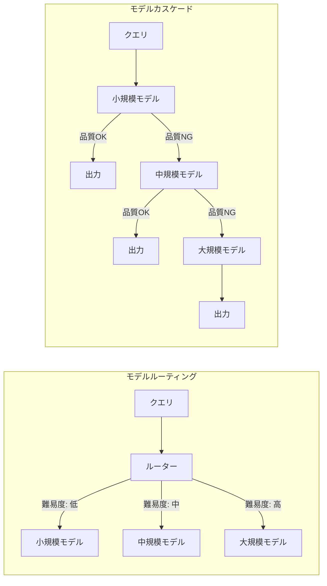
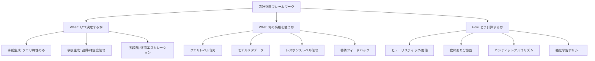
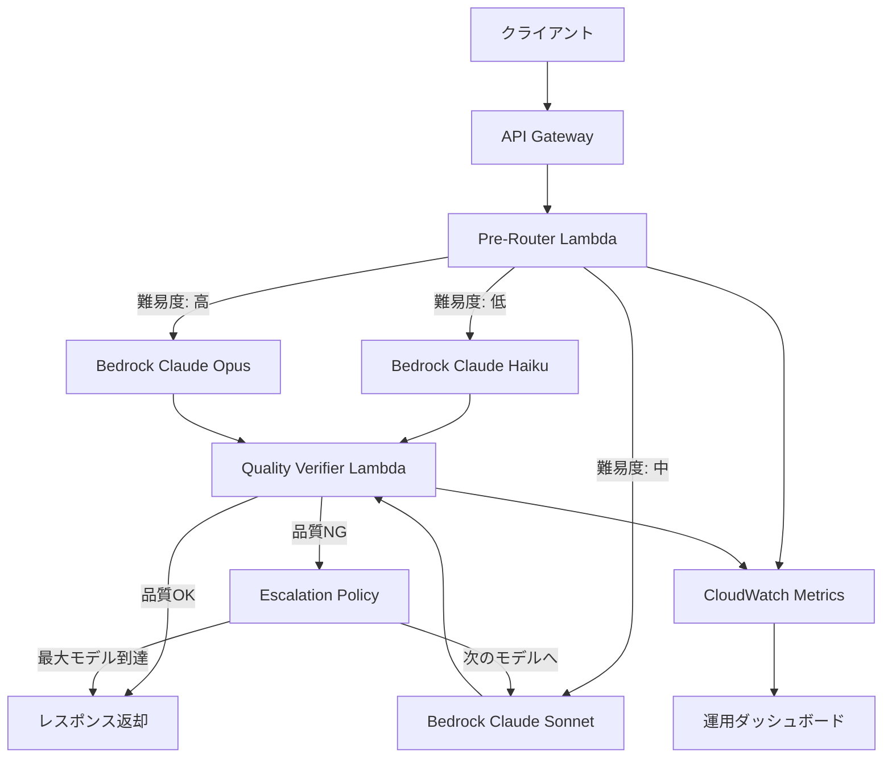

## 論文概要（Abstract）

本記事は [Dynamic Model Routing and Cascading for Efficient LLM Inference: A Survey](https://arxiv.org/abs/2603.04445) の解説記事です。

本サーベイ論文は、LLM推論時に複数モデルから動的にモデルを選択する「ルーティング」と「カスケード」のアプローチを体系的に整理したものです。著者らは、クエリ難易度推定、人間の嗜好データ、クラスタリング、不確実性定量化、強化学習、カスケードの6つのパラダイムに分類し、各手法の設計空間を「いつ・何を・どのように」の3軸で特徴づけています。適切に設計されたルーティングシステムは、最も強力な個別モデルを上回るパレートフロンティアを達成可能であると報告されています。

この記事は [Zenn記事: LLMアプリのトークンコスト削減ロードマップ：7戦略で月額費用を80%圧縮する](https://zenn.dev/0h_n0/articles/d028379c95b3c3) の深掘りです。

## 情報源

- **arXiv ID**: 2603.04445
- **URL**: [arXiv:2603.04445](https://arxiv.org/abs/2603.04445)
- **著者**: Yasmin Moslem, John D. Kelleher（ADAPT Centre, Trinity College Dublin）
- **発表年**: 2026年2月（改訂: 2026年4月）
- **分野**: Networking and Internet Architecture (cs.NI), Computation and Language (cs.CL), Performance (cs.PF)

## 背景と動機（Background）

### LLMの多様化とコスト問題

2024年以降、GPT-4o、Claude 3.5 Sonnet、Gemini 1.5 Pro、Llama 3.1、Mistral Largeなど、多種多様なLLMが利用可能になりました。しかし、すべてのクエリに最大モデルを使用する戦略は、以下の理由で現実的ではありません。

1. **コストの非線形性**: GPT-4クラスのモデルはGPT-3.5 Turboの10-30倍の推論コストがかかる
2. **品質の過剰供給**: 簡単な質問（例: 「東京の天気は?」）にGPT-4を使うのはコストに見合わない
3. **レイテンシ制約**: 大規模モデルほどTime to First Token（TTFT）が長い
4. **エネルギー消費**: 大規模モデルの推論はGPU電力消費が大きく、環境負荷も増大する

著者らは、このような課題に対して「クエリの特性に応じてモデルを動的に選択する」ルーティング・カスケード手法が有効であると主張しています。特にMixLLMの例では、GPT-4の品質の97.25%を維持しながらコストを24.18%に削減できたと報告されています（論文Section 4.4より）。

### ルーティング vs カスケードの違い

本サーベイが扱う2つの主要アプローチには明確な違いがあります。



**ルーティング**は入力を分析し、事前に1つのモデルを選択します。一方**カスケード**は、まず小規模・低コストなモデルで推論を試み、出力品質が不十分な場合にのみ大規模モデルへエスカレーションする逐次的アプローチです。

## 主要な貢献（Key Contributions）

著者らは以下の貢献を報告しています。

1. **6つのルーティングパラダイムの体系的分類**: クエリ難易度、人間の嗜好、クラスタリング、強化学習、不確実性定量化、カスケードの6軸で既存手法を網羅的に整理
2. **3次元の設計空間フレームワーク**: 「いつ決定するか（When）」「何の情報を使うか（What）」「どう計算するか（How）」の3軸で全手法を特徴づける概念的フレームワークを提案
3. **本番環境向けの合成パイプライン設計**: 単一パラダイムではなく、pre-router / post-generation verifier / escalation policyの3段階を組み合わせた本番志向のアーキテクチャを提示
4. **マルチモーダル拡張の課題整理**: テキストのみならず、視覚言語モデルへのルーティング拡張における技術的課題を明確化
5. **評価ベンチマークの比較**: RouterBench、RouterEval、MixInstruct、LLMRouterBenchの4つの主要ベンチマークを比較分析

## 技術的詳細（Technical Details）

### 6つのルーティングパラダイム

#### 1. 難易度認識ルーティング（Difficulty-Aware Routing）

クエリの複雑さを推定し、適切なモデルに振り分けるアプローチです。BEST-RouteはDeBERTa-v3-smallを用いてクエリ難易度を推定し、best-of-nサンプリングで最適モデルを選択します。RouteLMTは小規模翻訳モデルの中間表現をLoRAアダプテーションでプローブし、外部モデルなしでルーティングを実現しています。

#### 2. 人間嗜好アラインメントルーティング（Human Preference-Aligned Routing）

Chatbot Arenaのようなユーザー嗜好データを活用します。**RouteLLM**は、強いモデルと弱いモデルの二値選択を勝率予測モデルとして定式化し、Chatbot Arenaデータと合成的なLLMジャッジラベルで最適化しています。Eagleはトレーニング不要のELOランキングシステムを用い、グローバルとローカルの専門性評価を組み合わせます。

#### 3. クラスタリングベースルーティング

教師なし学習でクエリをグルーピングするアプローチです。**UniRoute**はK-meansクラスタリングでセントロイドを特定し、バリデーションセットをクラスタに分割、各クラスタでのLLM性能を評価した上で、コスト調整済みエラーが最小のモデルにルーティングします。

#### 4. 強化学習ルーティング

ポリシー最適化とバンディットベースの2つのサブカテゴリがあります。

- **Router-R1**: 内部推論とモデル割り当てアクションを交互に実行し、PPOで訓練。最大4ステップのルーティングをサポート
- **R2-Reasoner**: タスクをサブタスクに分解し、GRPOで訓練されたポリシーで適切なモデルに割り当て。APIコスト84.46%削減を達成と報告
- **MetaLLM**: ルーティングを多腕バンディット問題として定式化し、正解を出す最も安価なLLMを選択
- **PILOT**: オフラインの人間嗜好とオンラインの評価フィードバックをLinUCBで統合し、コストをオンライン多選択ナップサック問題としてモデル化

#### 5. 不確実性ベースルーティング

モデルの確信度を用いて判断するアプローチです。訓練済み分類器を隠れ状態に適用する手法は、モデルの自己申告による確信度を上回る性能を示すと報告されています。**CP-Router**は適合予測（Conformal Prediction）を用いて、標準LLMとLarge Reasoning Modelの間でロジットの不確実性に基づくルーティングを実現しています。

#### 6. カスケードシステム

逐次的にモデルを試行し、品質信号に基づいてエスカレーションするアプローチです。

### カスケードの数学的定式化

カスケードシステムにおける最適停止問題は、以下のように定式化できます。モデル集合 $$\mathcal{M} = \{m_1, m_2, \ldots, m_K\}$$ がコスト昇順 $$c_1 \leq c_2 \leq \cdots \leq c_K$$ で並んでいるとき、クエリ $$q$$ に対する期待コストは以下で表現されます。

$$
\text{Cost}(q) = \sum_{k=1}^{K} c_k \cdot \prod_{j=1}^{k-1}(1 - s_j(q))
$$

ここで $$s_j(q) \in \{0, 1\}$$ はモデル $$m_j$$ の出力が品質閾値 $$\tau$$ を満たすかどうかの停止判定関数です。最適化目標は、品質制約のもとで期待コストを最小化することです。

$$
\min_{\tau} \mathbb{E}_q[\text{Cost}(q)] \quad \text{s.t.} \quad \mathbb{E}_q[\text{Quality}(q)] \geq Q_{\min}
$$

**AutoMix**はこのルーティングをPOMDP（部分観測マルコフ決定過程）としてモデル化し、few-shotによる自己検証を確信度信号として活用しています。**Self-REF**は専用の確信度トークンを軽量なファインチューニングで導入し、ルーティングと棄却タスクの両方でベースラインを上回る性能を達成したと報告されています。

### 代表的手法の比較

| 手法 | パラダイム | 決定タイミング | 主な特徴 |
|------|----------|-------------|---------|
| **FrugalGPT** | カスケード | 事後（Post） | LLMルーター + DistilBERT品質推定 + 閾値ベース停止判定 |
| **RouteLLM** | 嗜好アライン | 事前（Pre） | Chatbot Arenaデータ + 合成LLMジャッジラベルで勝率予測 |
| **AutoMix** | カスケード | 事後（Post） | POMDPモデル化、few-shot自己検証、ファインチューニング不要 |
| **UniRoute** | クラスタリング | 事前（Pre） | K-meansクラスタリング + コスト調整済みエラー最小化 |
| **Router-R1** | 強化学習 | 事前（Pre） | PPO訓練、最大4ステップ推論、再訓練不要の汎化 |
| **CP-Router** | 不確実性 | 事後（Post） | Conformal Prediction、標準LLM vs 推論LLMの動的選択 |
| **MixLLM** | 強化学習 | 事前（Pre） | コンテキストバンディット + ポリシー勾配、オンライン学習 |

### 3次元設計空間フレームワーク

著者らが提案する設計空間は、以下の3軸で全手法を特徴づけます。



本番システムでは、これらの軸の複数カテゴリを同時に活性化する合成的なパイプラインが主流であると著者らは指摘しています。

## アルゴリズム: モデルカスケードの実装パターン

以下は、本サーベイで議論されているカスケードパターンをPythonで実装した例です。

```python
"""
モデルカスケードの実装パターン.

FrugalGPT（論文Section 5.6）のアーキテクチャを参考に、
品質推定器 + 閾値ベース停止判定を組み合わせた
カスケードシステムの簡易実装。
"""

from dataclasses import dataclass
from typing import Protocol


@dataclass(frozen=True)
class ModelConfig:
    """モデル構成情報."""

    name: str
    cost_per_token: float  # USD per 1K tokens
    avg_latency_ms: float


@dataclass(frozen=True)
class InferenceResult:
    """推論結果."""

    text: str
    confidence: float  # 0.0 - 1.0
    model_name: str
    cost: float
    latency_ms: float


class LLMClient(Protocol):
    """LLMクライアントのインターフェース."""

    def generate(self, prompt: str, model: str) -> InferenceResult:
        """プロンプトに対する推論を実行する."""
        ...


class QualityEstimator(Protocol):
    """品質推定器のインターフェース."""

    def estimate(self, prompt: str, response: str) -> float:
        """レスポンスの品質スコアを推定する（0.0-1.0）."""
        ...


@dataclass
class CascadeRouter:
    """
    カスケードルーター.

    コスト昇順に並んだモデルリストを逐次試行し、
    品質閾値を満たした時点で停止する。
    FrugalGPT（Chen et al., 2023）の設計を参考にした実装。

    Attributes:
        models: コスト昇順のモデルリスト
        quality_estimator: 品質推定器
        quality_threshold: 停止判定の品質閾値（デフォルト: 0.7）
    """

    models: list[ModelConfig]
    quality_estimator: QualityEstimator
    quality_threshold: float = 0.7

    def route(self, prompt: str, client: LLMClient) -> InferenceResult:
        """
        カスケードルーティングを実行する.

        Args:
            prompt: 入力プロンプト
            client: LLMクライアント

        Returns:
            品質閾値を満たした最初のモデルの推論結果。
            全モデルが閾値未満の場合は最終モデルの結果を返す。
        """
        total_cost = 0.0

        for i, model in enumerate(self.models):
            result = client.generate(prompt, model.name)
            total_cost += result.cost

            quality_score = self.quality_estimator.estimate(
                prompt, result.text
            )

            is_last_model = i == len(self.models) - 1
            if quality_score >= self.quality_threshold or is_last_model:
                return InferenceResult(
                    text=result.text,
                    confidence=quality_score,
                    model_name=model.name,
                    cost=total_cost,
                    latency_ms=result.latency_ms,
                )

        # 型チェッカー用: ここには到達しない
        raise RuntimeError("Unreachable: models list is empty")


@dataclass
class DifficultyAwareRouter:
    """
    難易度認識ルーター.

    クエリの難易度を推定し、適切なモデルに直接ルーティングする。
    BEST-Route（論文Section 4.1）の設計を参考にした実装。

    Attributes:
        models: 難易度レベル別のモデルマッピング
        difficulty_thresholds: 難易度の閾値リスト（昇順）
    """

    models: dict[str, ModelConfig]  # "easy", "medium", "hard"
    difficulty_thresholds: list[float]  # e.g., [0.3, 0.7]

    def estimate_difficulty(self, prompt: str) -> float:
        """
        クエリの難易度を推定する（0.0-1.0）.

        本番環境ではDeBERTa等の分類器を使用する。
        ここでは簡易的なヒューリスティックを使用。

        Args:
            prompt: 入力プロンプト

        Returns:
            難易度スコア（0.0 = 最も簡単、1.0 = 最も難しい）
        """
        complexity_signals = [
            len(prompt) > 500,           # 長いプロンプト
            "explain" in prompt.lower(),  # 説明要求
            "compare" in prompt.lower(),  # 比較要求
            "code" in prompt.lower(),     # コード生成
            prompt.count("?") > 2,        # 複数の質問
        ]
        return sum(complexity_signals) / len(complexity_signals)

    def route(self, prompt: str, client: LLMClient) -> InferenceResult:
        """
        難易度ベースルーティングを実行する.

        Args:
            prompt: 入力プロンプト
            client: LLMクライアント

        Returns:
            選択されたモデルの推論結果
        """
        difficulty = self.estimate_difficulty(prompt)

        if difficulty < self.difficulty_thresholds[0]:
            level = "easy"
        elif difficulty < self.difficulty_thresholds[1]:
            level = "medium"
        else:
            level = "hard"

        model = self.models[level]
        return client.generate(prompt, model.name)
```

## 実装のポイント（Implementation Notes）

本サーベイの知見を実装に落とし込む際の重要なポイントを整理します。

### ルーター自体のコスト

ルーティングの判断にもコストが発生します。DeBERTa-v3-smallのような軽量分類器をルーターに使用すれば推論コストは無視できますが、LLM-as-a-Judgeでルーティングすると、ルーター自体のコストが本末転倒になる可能性があります。著者らは、本番システムでは軽量な事前ルーター（pre-router）と事後検証器（post-generation verifier）を分離する合成パイプラインを推奨しています。

### 汎化性の課題

多くのルーティング手法は固定のLLMセットで評価されており、新しいモデルが追加された際に再訓練が必要になります。Router-R1やSCOPEのように、モデル記述子や行動フィンガープリントを用いて再訓練不要の汎化を実現する手法が注目されています。

### 評価メトリクスの選択

ルーティングの評価には、単純な精度だけでなく、コスト予算全体にわたるAUC（Area Under Curve）が重要です。RouterBenchは405,000件以上の事前計算済み出力を提供し、11モデル x 7タスクの組み合わせで体系的な評価を可能にしています（論文Section 7より）。

### 不確実性推定の信頼性

モデルの自己申告による確信度（self-reported confidence）は信頼性が低いことが報告されています。訓練済みプローブを隠れ状態に適用する手法が、自己申告を大幅に上回る性能を示すと著者らは指摘しています。

## Production Deployment Guide

本サーベイの知見を実運用に適用するための具体的なAWSアーキテクチャパターンを示します。

### アーキテクチャ概要



### Terraform構成

以下は、カスケードルーターをAWS Lambda + Amazon Bedrockで実装するTerraform構成です。

```hcl
# カスケードルーター用 Lambda関数
resource "aws_lambda_function" "cascade_router" {
  function_name = "llm-cascade-router"
  runtime       = "python3.12"
  handler       = "handler.lambda_handler"
  timeout       = 120
  memory_size   = 512

  environment {
    variables = {
      QUALITY_THRESHOLD     = "0.7"
      MODEL_CHAIN           = "anthropic.claude-3-haiku-20240307-v1:0,anthropic.claude-3-5-sonnet-20241022-v2:0,anthropic.claude-3-opus-20240229-v1:0"
      CLOUDWATCH_NAMESPACE  = "LLMCascade"
    }
  }

  filename         = "lambda_package.zip"
  source_code_hash = filebase64sha256("lambda_package.zip")
  role             = aws_iam_role.lambda_role.arn

  tags = {
    Project = "llm-cascade-router"
  }
}

# Bedrock呼び出し用IAMロール
resource "aws_iam_role" "lambda_role" {
  name = "llm-cascade-router-role"

  assume_role_policy = jsonencode({
    Version = "2012-10-17"
    Statement = [
      {
        Action = "sts:AssumeRole"
        Effect = "Allow"
        Principal = {
          Service = "lambda.amazonaws.com"
        }
      }
    ]
  })
}

resource "aws_iam_role_policy" "bedrock_policy" {
  name = "bedrock-invoke-policy"
  role = aws_iam_role.lambda_role.id

  policy = jsonencode({
    Version = "2012-10-17"
    Statement = [
      {
        Effect = "Allow"
        Action = [
          "bedrock:InvokeModel",
          "bedrock:InvokeModelWithResponseStream"
        ]
        Resource = "arn:aws:bedrock:*::foundation-model/*"
      },
      {
        Effect = "Allow"
        Action = [
          "cloudwatch:PutMetricData"
        ]
        Resource = "*"
      }
    ]
  })
}

# API Gateway
resource "aws_apigatewayv2_api" "cascade_api" {
  name          = "llm-cascade-api"
  protocol_type = "HTTP"
}

resource "aws_apigatewayv2_integration" "lambda_integration" {
  api_id                 = aws_apigatewayv2_api.cascade_api.id
  integration_type       = "AWS_PROXY"
  integration_uri        = aws_lambda_function.cascade_router.invoke_arn
  payload_format_version = "2.0"
}

resource "aws_apigatewayv2_route" "inference_route" {
  api_id    = aws_apigatewayv2_api.cascade_api.id
  route_key = "POST /inference"
  target    = "integrations/${aws_apigatewayv2_integration.lambda_integration.id}"
}

# CloudWatch ダッシュボード
resource "aws_cloudwatch_dashboard" "cascade_dashboard" {
  dashboard_name = "LLM-Cascade-Monitoring"

  dashboard_body = jsonencode({
    widgets = [
      {
        type   = "metric"
        x      = 0
        y      = 0
        width  = 12
        height = 6
        properties = {
          title   = "Model Selection Distribution"
          metrics = [
            ["LLMCascade", "ModelSelected", "ModelName", "haiku"],
            ["LLMCascade", "ModelSelected", "ModelName", "sonnet"],
            ["LLMCascade", "ModelSelected", "ModelName", "opus"]
          ]
          period = 300
          stat   = "Sum"
          view   = "bar"
        }
      },
      {
        type   = "metric"
        x      = 12
        y      = 0
        width  = 12
        height = 6
        properties = {
          title   = "Average Cost per Request"
          metrics = [
            ["LLMCascade", "RequestCost"]
          ]
          period = 300
          stat   = "Average"
        }
      },
      {
        type   = "metric"
        x      = 0
        y      = 6
        width  = 12
        height = 6
        properties = {
          title   = "Escalation Rate"
          metrics = [
            ["LLMCascade", "EscalationCount"]
          ]
          period = 300
          stat   = "Sum"
        }
      }
    ]
  })
}
```

### Lambda ハンドラー実装

```python
"""
AWS Lambda カスケードルーターハンドラー.

Amazon Bedrock上の複数モデルを逐次試行し、
品質閾値を満たした時点で停止するカスケードシステム。
"""

import json
import os
import time
from typing import Any

import boto3


bedrock = boto3.client("bedrock-runtime")
cloudwatch = boto3.client("cloudwatch")

QUALITY_THRESHOLD = float(os.environ.get("QUALITY_THRESHOLD", "0.7"))
MODEL_CHAIN = os.environ.get("MODEL_CHAIN", "").split(",")
CW_NAMESPACE = os.environ.get("CLOUDWATCH_NAMESPACE", "LLMCascade")


def estimate_quality(prompt: str, response: str) -> float:
    """
    レスポンス品質を簡易推定する.

    本番環境ではファインチューニング済み分類器やCross-Encoderを使用する。
    ここでは応答長とプロンプトとの関連性の簡易ヒューリスティック。

    Args:
        prompt: 入力プロンプト
        response: モデルの応答テキスト

    Returns:
        品質スコア（0.0-1.0）
    """
    if not response.strip():
        return 0.0

    length_score = min(len(response) / max(len(prompt) * 2, 100), 1.0)
    has_structure = any(
        marker in response
        for marker in ["1.", "- ", "```", "##"]
    )
    structure_score = 0.3 if has_structure else 0.0

    return min(length_score * 0.7 + structure_score, 1.0)


def invoke_model(model_id: str, prompt: str) -> dict[str, Any]:
    """
    Bedrockモデルを呼び出す.

    Args:
        model_id: Bedrockモデル識別子
        prompt: 入力プロンプト

    Returns:
        応答テキストとレイテンシ情報を含む辞書
    """
    start = time.time()
    body = json.dumps({
        "anthropic_version": "bedrock-2023-05-31",
        "max_tokens": 4096,
        "messages": [{"role": "user", "content": prompt}],
    })

    response = bedrock.invoke_model(
        modelId=model_id,
        contentType="application/json",
        accept="application/json",
        body=body,
    )

    result = json.loads(response["body"].read())
    latency_ms = (time.time() - start) * 1000

    return {
        "text": result["content"][0]["text"],
        "latency_ms": latency_ms,
        "input_tokens": result["usage"]["input_tokens"],
        "output_tokens": result["usage"]["output_tokens"],
    }


def put_metrics(model_name: str, cost: float, escalated: bool) -> None:
    """CloudWatchにカスタムメトリクスを送信する."""
    cloudwatch.put_metric_data(
        Namespace=CW_NAMESPACE,
        MetricData=[
            {
                "MetricName": "ModelSelected",
                "Dimensions": [
                    {"Name": "ModelName", "Value": model_name}
                ],
                "Value": 1,
                "Unit": "Count",
            },
            {
                "MetricName": "RequestCost",
                "Value": cost,
                "Unit": "None",
            },
            {
                "MetricName": "EscalationCount",
                "Value": 1 if escalated else 0,
                "Unit": "Count",
            },
        ],
    )


def lambda_handler(
    event: dict[str, Any], context: Any
) -> dict[str, Any]:
    """
    カスケードルーティングのLambdaエントリポイント.

    Args:
        event: API Gatewayイベント
        context: Lambda実行コンテキスト

    Returns:
        API Gatewayレスポンス
    """
    body = json.loads(event.get("body", "{}"))
    prompt = body.get("prompt", "")

    if not prompt:
        return {
            "statusCode": 400,
            "body": json.dumps({"error": "prompt is required"}),
        }

    total_cost = 0.0
    escalated = False

    for i, model_id in enumerate(MODEL_CHAIN):
        result = invoke_model(model_id, prompt)

        # コスト概算（USD per 1K tokens, Bedrock料金表ベース）
        cost_rates = {
            "haiku": {"input": 0.00025, "output": 0.00125},
            "sonnet": {"input": 0.003, "output": 0.015},
            "opus": {"input": 0.015, "output": 0.075},
        }
        model_tier = (
            "haiku" if "haiku" in model_id
            else "sonnet" if "sonnet" in model_id
            else "opus"
        )
        rates = cost_rates[model_tier]
        step_cost = (
            result["input_tokens"] * rates["input"]
            + result["output_tokens"] * rates["output"]
        ) / 1000
        total_cost += step_cost

        quality = estimate_quality(prompt, result["text"])
        is_last = i == len(MODEL_CHAIN) - 1

        if quality >= QUALITY_THRESHOLD or is_last:
            model_short = model_id.split(".")[-1].split("-")[0]
            put_metrics(model_short, total_cost, escalated)

            return {
                "statusCode": 200,
                "body": json.dumps({
                    "response": result["text"],
                    "model_used": model_id,
                    "quality_score": quality,
                    "total_cost_usd": total_cost,
                    "latency_ms": result["latency_ms"],
                    "escalated": escalated,
                }),
            }

        escalated = True

    # 型チェッカー用: ここには到達しない
    return {"statusCode": 500, "body": "Unreachable"}
```

### 運用監視の設計

カスケードルーターの運用では、以下のメトリクスを継続的に監視する必要があります。

| メトリクス | 目標値 | アラート条件 |
|-----------|--------|------------|
| Haiku解決率 | 60-70% | 50%未満が1時間継続 |
| エスカレーション率 | 30-40% | 50%超が30分継続 |
| 平均コスト/リクエスト | $0.002以下 | $0.005超が15分継続 |
| P99レイテンシ | 5秒以下 | 10秒超 |
| 品質スコア平均 | 0.75以上 | 0.6未満が1時間継続 |

### コスト最適化チェックリスト

本サーベイの知見を踏まえた、本番運用前のチェックリストです。

- [ ] **モデルチェーンの順序**: コスト昇順に並んでいるか確認
- [ ] **品質閾値のキャリブレーション**: バリデーションセットで閾値を最適化したか
- [ ] **ルーター自体のコスト**: ルーティング判断のオーバーヘッドが節約コストを上回っていないか
- [ ] **フォールバック戦略**: 全モデルがタイムアウトした場合の処理を定義しているか
- [ ] **A/Bテスト設計**: カスケードあり/なしの比較実験を計画しているか
- [ ] **モデル更新ポリシー**: 新モデル追加時のルーター再評価手順を定めているか
- [ ] **コスト上限設定**: 1リクエストあたりの最大コストを設定しているか
- [ ] **メトリクス収集**: モデル選択分布、エスカレーション率、コスト推移を記録しているか
- [ ] **Provisioned Throughput**: 高頻度モデルにはBedrockのProvisioned Throughputを検討したか
- [ ] **リージョン選択**: Bedrock利用可能リージョンでコスト最安のリージョンを選択しているか

## 実験結果（Experimental Results）

本論文はサーベイであるため、著者らが独自に実験を行ったものではありません。以下は、サーベイ内で引用されている各手法の報告値です。

### コスト削減効果の比較

サーベイ内で引用されている代表的な結果を整理します。

| 手法 | 報告されたコスト削減 | 品質維持率 | 出典 |
|------|-------------------|-----------|------|
| **MixLLM** | 75.82%削減 | GPT-4の97.25% | 論文Section 4.4 |
| **R2-Reasoner** | 84.46%削減 | - | 論文Section 4.4 |
| **FrugalGPT** | 最大98%削減 | 同等以上 | 論文Section 5.6 |
| **RouteLLM** | - | 強/弱モデル選択最適化 | 論文Section 4.2 |

著者らは、これらの結果から「適切に設計されたルーティングシステムは、最も強力な個別モデルのパフォーマンスを上回るパレートフロンティアを確立できる」と結論づけています。

### ベンチマーク比較

サーベイでは4つの主要ベンチマークが比較分析されています。

| ベンチマーク | データ規模 | モデル数 | 特徴 |
|------------|----------|---------|------|
| **RouterBench** | 405K+出力 | 11 | 7タスク、事前計算済み出力 |
| **RouterEval** | 200M+レコード | 8,500+ | m-way分類（m=3~1000）|
| **MixInstruct** | 110K例 | - | オラクル嗜好ペア付き |
| **LLMRouterBench** | 400K+インスタンス | 33 | 21データセット、10ベースライン |

RouterEvalの8,500+モデルという規模は、現実のモデル選択問題の複雑さを反映しており、既存手法のスケーラビリティを評価する上で重要な貢献です。

## 実運用への応用（Practical Applications）

### コスト削減への直接的な適用

Zenn記事で紹介した「モデルカスケードで適材適所に振り分ける」戦略は、本サーベイの知見を直接活用できます。具体的には以下のシナリオが考えられます。

1. **カスタマーサポートBot**: FAQ的な質問はHaikuクラス、複雑な技術質問はSonnetクラス、クレーム対応はOpusクラスに振り分け
2. **コード生成パイプライン**: 定型的なボイラープレートは小規模モデル、アルゴリズム設計は大規模モデルへ
3. **多言語翻訳**: 品質推定（QE）スコアが閾値未満のセグメントのみ大規模モデルで再翻訳するカスケード

### 段階的導入の推奨

著者らの合成パイプライン設計を踏まえると、以下の段階的な導入が現実的です。

1. **Phase 1**: 全クエリのログ収集とコスト分析（1-2週間）
2. **Phase 2**: 簡易的な閾値ベースルーティングの導入（ルール: プロンプト長 + キーワード）
3. **Phase 3**: 品質推定器の導入とカスケードシステムへの移行
4. **Phase 4**: バンディットアルゴリズムによるオンライン最適化

## 関連研究（Related Work）

- **Mixture of Experts (MoE)**: 本サーベイが扱うルーティングは、独立に訓練された複数のLLM間での選択であり、単一モデル内でのMoEルーティング（Shazeerら、2017）とは明確に区別されている
- **LLM-as-a-Judge**: LLMを品質判定に使う手法は、ルーティングの事後検証段階で広く活用されているが、自己検証の信頼性には課題がある（論文Section 5.5より）
- **Speculative Decoding**: 小規模モデルのドラフトトークンを大規模モデルが検証する手法は、カスケードと類似のコスト削減哲学を共有するが、同一タスク内でのトークンレベル最適化である点が異なる
- **ReLope（マルチモーダルルーティング）**: 視覚言語モデルへのルーティング拡張において、視覚トークンが隠れ状態の正確性信号を弱めるという課題に対し、Attention ProbeとKL正則化LoRAプローブを組み合わせたアプローチを提案（論文Section 6より）

## まとめと今後の展望

本サーベイは、LLM推論コストの最適化において「単一の最強モデルにすべてを任せる」アプローチが最適ではないことを体系的に示しています。6つのルーティングパラダイムと3次元の設計空間フレームワークは、実務者がシステムを設計する際の有用な指針となります。

著者らが指摘する今後の課題として、(1) 新規モデル追加時の再訓練不要な汎化、(2) 単一段階を超えた多段階カスケードの実用化、(3) マルチモーダルタスクへの拡張の3点が挙げられます。LLMの種類が増え続ける現状において、ルーティング・カスケード技術は推論コスト最適化の中核技術としてますます重要性を増していくと考えられます。

## 参考文献

1. Moslem, Y., & Kelleher, J. D. (2026). Dynamic Model Routing and Cascading for Efficient LLM Inference: A Survey. arXiv:2603.04445.
2. Chen, L., Zaharia, M., & Zou, J. (2023). FrugalGPT: How to Use Large Language Models While Reducing Cost and Improving Performance. arXiv:2305.05176.
3. Ong, I., et al. (2024). RouteLLM: Learning to Route LLMs with Preference Data. arXiv:2406.18665.
4. Dong, D., et al. (2024). AutoMix: Automatically Mixing Language Models. arXiv:2310.12963.
5. Hu, S., et al. (2024). Router-R1: Learning to Route with Reinforcement Learning. (論文Section 4.4で引用)
6. Shnitzer, T., et al. (2023). Large Language Model Routing with Benchmark Datasets. arXiv:2309.15789.

---

**免責事項**: 本記事はarXiv論文 [2603.04445](https://arxiv.org/abs/2603.04445) の内容を解説したものであり、筆者が独自に実験を行ったものではありません。数値やベンチマーク結果は全て原論文からの引用です。コード例は論文の概念を説明するための実装パターンであり、原論文のコードではありません。

*この記事はAIによって生成されました。*
