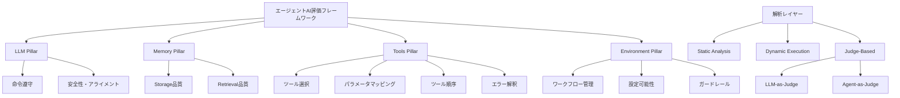
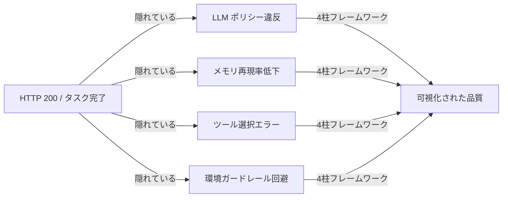

## 論文概要

本記事は [https://arxiv.org/abs/2512.12791](https://arxiv.org/abs/2512.12791) の解説記事です。

Akshathala ら（2025）は、エージェント型AIシステムの評価においてタスク完了率（Task Completion Rate）のみに依存することの限界を指摘し、4つの評価柱（LLM・メモリ・ツール・環境）と3つの解析レイヤー（静的解析・動的実行・判定ベース）から構成される包括的評価フレームワークを提案した。著者らはこのフレームワークをMontyCloud Inc.の本番CloudOpsシステムで検証し、タスク完了率が高い場合でもポリシー遵守率が33%に留まるケースや、メモリ再現率がわずか13.1%という重大な障害が隠蔽されることを報告している。

---

**この記事は [Zenn記事: 分散AIエージェントのSLO設計とメトリクス戦略：信頼性を定量化する](https://zenn.dev/0h_n0/articles/f66f067f80e840) の深掘りです。** Zenn記事で取り上げた「タスク完了率を超えた品質指標の設計」「SLOとしてのHuman Escalation Rate（HER）」について、本論文の実験結果に基づいて詳細に解説します。

---

## 情報源

| 項目 | 内容 |
|------|------|
| タイトル | Beyond Task Completion: An Assessment Framework for Evaluating Agentic AI Systems |
| 著者 | Sreemaee Akshathala, Bassam Adnan, Mahisha Ramesh, Karthik Vaidhyanathan, Basil Muhammed, Kannan Parthasarathy |
| arXiv ID | [2512.12791](https://arxiv.org/abs/2512.12791) |
| 初回投稿 | 2025年12月14日（v2: 2025年12月16日） |
| 分野 | cs.MA, cs.AI, cs.SE |
| 検証環境 | MontyCloud Inc. 本番CloudOpsシステム |

---

## 背景と動機

クラウドインフラの自動化やITオペレーションにLLMエージェントを活用する動きが加速する中、評価指標の設計が実用上の最重要課題となっている。従来のエージェント評価では「タスクが完了したか否か」という二値的な指標が広く用いられてきた。しかし著者らは、この単純な指標が根本的に不十分であることを指摘する。

たとえばCloudOps領域では、コスト最適化タスクで100%のツール呼び出し順序が達成されても、セキュリティポリシーへの遵守率が33%に留まる事象が観測された（論文Section 5.1より）。タスクは「完了」しているが、本番環境にデプロイすれば重大なセキュリティインシデントを引き起こす可能性がある状態だ。

著者らはこの問題を「表面的成功と深層的失敗の乖離」と定義し、LLM・メモリ・ツール・環境という4つの異なる障害源を個別に可視化できる評価フレームワークの必要性を論じている。

---

## 主要な貢献

著者らが論文で述べている主な貢献は以下の通りである。

1. **4柱評価フレームワークの提案**: LLM、メモリ、ツール、環境という4次元でエージェントの品質を独立して評価する体系的手法
2. **3レイヤー解析アーキテクチャ**: 静的ログ解析・動的実行監視・LLM-as-Judge/Agent-as-Judgeを組み合わせた多層評価手法
3. **本番環境での検証**: MontyCloud Inc.のCloudOpsシステムでの3シナリオ（コスト最適化・セキュリティインシデント対応・マルチエージェントRCA）による実証
4. **コスト比較の提示**: Agent-as-JudgeがLLM-as-Judgeの約16倍のコストを要することの定量的報告（論文Section 5.3より）

---

## 技術的詳細

### 4つの評価柱（Evaluation Pillars）



#### 第1柱: LLM Pillar

著者らはLLM Pillarを「エージェントのコア推論能力とポリシー遵守の評価」と定義している。具体的には以下の2つの側面を評価する。

**命令遵守（Instruction Following）**: システムプロンプトで定義されたルール・制約への適合率を測定する。著者らはこれを静的ポリシールックアップ（事前定義ルールとの照合）と動的実行監視（実行時の振る舞い追跡）の組み合わせで評価することを提案している。

**安全性とアライメント（Safety & Alignment）**: ハルシネーション検出、有害な出力のフィルタリング、意図せぬポリシー違反の検出を行う。著者らはLLM-as-Judgeを主要な評価手法として位置づけている。

#### 第2柱: Memory Pillar

Memory Pillarは「ストレージ品質」と「リトリーバル品質」の2次元で評価される。

**ストレージ品質の評価指標（論文Section 3.2より）**:
- 更新正確性（Update Accuracy）: 状態変化が正しく記録されるか
- 書き込みレイテンシ（Write Latency）: メモリ更新の応答時間
- 重複排除率（Deduplication Rate）: 冪等性の確保

**リトリーバル品質の評価指標**:

$$\text{Precision} = \frac{|\text{Retrieved} \cap \text{Relevant}|}{|\text{Retrieved}|}$$

$$\text{Recall} = \frac{|\text{Retrieved} \cap \text{Relevant}|}{|\text{Relevant}|}$$

$$F_1 = \frac{2 \cdot \text{Precision} \cdot \text{Recall}}{\text{Precision} + \text{Recall}}$$

著者らは特に「マルチホップ検索」「時系列依存検索」「オープンドメイン検索」という3種類の複雑なリトリーバルシナリオを定義し、単純なシングルホップ検索のみでは不十分であることを強調している。

#### 第3柱: Tools Pillar

著者らはTools Pillarを最も障害率が高い評価次元として報告しており、平均障害スコアは7.67（RQ1の結果より）であった。評価軸は4つある。

**ツール選択（Tool Selection）**: 与えられたタスクに対して最適なツールを選択できるか。誤ったツールの選択は連鎖的な障害を引き起こす。

**パラメータマッピング（Parameter Mapping）**: 選択したツールに適切なパラメータを渡せるか。型エラー・必須パラメータの欠落・値の範囲逸脱を検出する。

**ツール順序（Tool Sequencing）**: 複数ツールを依存関係を考慮した順序で実行できるか。著者らはコスト最適化シナリオで100%の正しい順序実行が達成されたことを報告している（論文Section 5.1より）。

**エラー解釈（Error Interpretation）**: ツール実行エラーを正しく解釈し、適切なリカバリ動作を取れるか。

#### 第4柱: Environment Pillar

Environment Pillarは「エージェントが操作する外部環境との相互作用」を評価する。

**ワークフロー管理（Workflows）**: 長期的なタスク実行における状態管理と進捗追跡

**設定可能性（Configurability）**: 環境パラメータの動的変更への適応能力

**ガードレール（Guardrails）**: 危険な操作（本番データの削除・認証バイパスなど）を防止する安全機構。著者らはガードレール違反がマルチエージェントシナリオでのみ観測されたことを報告している（論文Section 5.3より）。

---

### 3つの解析レイヤー

#### レイヤー1: 静的解析（Static Analysis）

グラウンドトゥルース（期待される出力・動作）との照合を行う決定論的解析。著者らはログデータとの比較による評価を提案しており、実行コストが低く大量評価に適している。

**特性**: 高速・低コスト・再現可能だが、意味論的な正誤判定が困難

#### レイヤー2: 動的実行監視（Dynamic Execution）

ランタイムの振る舞いを監視し、実行トレースを解析する。ツールの呼び出し順序・パラメータの実際の値・エラー発生パターンをリアルタイムで収集する。

**特性**: 実際の実行コンテキストを捉えられるが、監視オーバーヘッドが生じる

#### レイヤー3: 判定ベース評価（Judge-Based Evaluation）

LLMを審査者として用いる評価手法。著者らは2種類を区別している。

**LLM-as-Judge**: 単一LLMが出力品質を評価する。著者らが測定した平均コストは$0.0593/評価（論文Section 5.3より）

**Agent-as-Judge**: エージェントシステム全体が評価を行う。より深い品質評価が可能だが、著者らは平均コストを$0.9572/評価と報告しており、LLM-as-Judgeの約16倍のコストを要する。

---

## アルゴリズム: 4柱評価フレームワークのPython実装

以下は論文のフレームワーク概念に基づいた実装例である。

```python
from __future__ import annotations

import time
from dataclasses import dataclass, field
from enum import Enum
from typing import Any

from pydantic import BaseModel, Field


class AnalysisLayer(Enum):
    STATIC = "static"
    DYNAMIC = "dynamic"
    JUDGE = "judge"


class JudgeType(Enum):
    LLM = "llm"
    AGENT = "agent"


@dataclass
class EvaluationResult:
    """評価結果を保持するデータクラス。"""
    pillar: str
    score: float  # 0.0 - 10.0（障害スコア、高いほど障害が多い）
    failures: list[str] = field(default_factory=list)
    metadata: dict[str, Any] = field(default_factory=dict)


class MemoryMetrics(BaseModel):
    """Memory Pillar の評価指標。"""
    retrieved_docs: list[str] = Field(description="取得されたドキュメントID一覧")
    relevant_docs: list[str] = Field(description="正解ドキュメントID一覧")

    @property
    def precision(self) -> float:
        """適合率を計算する。"""
        if not self.retrieved_docs:
            return 0.0
        retrieved_set = set(self.retrieved_docs)
        relevant_set = set(self.relevant_docs)
        return len(retrieved_set & relevant_set) / len(retrieved_set)

    @property
    def recall(self) -> float:
        """再現率を計算する。"""
        if not self.relevant_docs:
            return 0.0
        retrieved_set = set(self.retrieved_docs)
        relevant_set = set(self.relevant_docs)
        return len(retrieved_set & relevant_set) / len(relevant_set)

    @property
    def f1(self) -> float:
        """F1スコアを計算する。"""
        p, r = self.precision, self.recall
        if p + r == 0:
            return 0.0
        return 2 * p * r / (p + r)


class LLMPillarEvaluator:
    """LLM Pillar: 命令遵守と安全性を評価する。"""

    def __init__(self, policies: list[str]) -> None:
        self.policies = policies

    def evaluate_static(
        self,
        agent_output: str,
        ground_truth: str,
    ) -> EvaluationResult:
        """静的ポリシールックアップによる評価。"""
        failures = []
        violated_policies = [
            p for p in self.policies
            if not self._check_policy(agent_output, p)
        ]
        if violated_policies:
            failures.extend([f"Policy violation: {p}" for p in violated_policies])

        score = len(violated_policies) / max(len(self.policies), 1) * 10.0
        return EvaluationResult(
            pillar="llm",
            score=score,
            failures=failures,
            metadata={"policy_count": len(self.policies)},
        )

    def _check_policy(self, output: str, policy: str) -> bool:
        """ポリシー遵守を確認する（実装はドメイン依存）。"""
        # 本番実装では LLM-as-Judge や正規表現等を組み合わせる
        return policy.lower() not in output.lower()


class MemoryPillarEvaluator:
    """Memory Pillar: Storage品質とRetrieval品質を評価する。"""

    def evaluate_retrieval(
        self,
        retrieved_docs: list[str],
        relevant_docs: list[str],
        retrieval_type: str = "single_hop",
    ) -> EvaluationResult:
        """リトリーバル品質を評価する。"""
        metrics = MemoryMetrics(
            retrieved_docs=retrieved_docs,
            relevant_docs=relevant_docs,
        )
        # 再現率が低いほど障害スコアを高くする
        failure_score = (1.0 - metrics.recall) * 10.0
        failures = []
        if metrics.recall < 0.5:
            failures.append(
                f"Low recall ({metrics.recall:.2%}) in {retrieval_type} retrieval"
            )
        return EvaluationResult(
            pillar="memory",
            score=failure_score,
            failures=failures,
            metadata={
                "precision": metrics.precision,
                "recall": metrics.recall,
                "f1": metrics.f1,
                "retrieval_type": retrieval_type,
            },
        )


class ToolsPillarEvaluator:
    """Tools Pillar: ツール選択・パラメータ・順序・エラー解釈を評価する。"""

    def evaluate_sequencing(
        self,
        executed_sequence: list[str],
        expected_sequence: list[str],
    ) -> EvaluationResult:
        """ツール実行順序の正確性を評価する。"""
        if executed_sequence == expected_sequence:
            return EvaluationResult(pillar="tools", score=0.0)

        # 正しく実行されたステップの割合を計算
        correct_steps = sum(
            1 for a, b in zip(executed_sequence, expected_sequence) if a == b
        )
        total_steps = max(len(expected_sequence), 1)
        error_rate = 1.0 - correct_steps / total_steps
        return EvaluationResult(
            pillar="tools",
            score=error_rate * 10.0,
            failures=[
                f"Sequencing error: expected {expected_sequence}, got {executed_sequence}"
            ],
            metadata={
                "correct_steps": correct_steps,
                "total_steps": total_steps,
            },
        )


class AgentEvaluationFramework:
    """4柱評価フレームワークの統合クラス。"""

    def __init__(self, policies: list[str]) -> None:
        self.llm_evaluator = LLMPillarEvaluator(policies)
        self.memory_evaluator = MemoryPillarEvaluator()
        self.tools_evaluator = ToolsPillarEvaluator()

    def evaluate(
        self,
        agent_output: str,
        ground_truth: str,
        retrieved_docs: list[str],
        relevant_docs: list[str],
        executed_tools: list[str],
        expected_tools: list[str],
    ) -> dict[str, EvaluationResult]:
        """全4柱を評価し結果を返す。"""
        start_ts = time.monotonic()

        results = {
            "llm": self.llm_evaluator.evaluate_static(agent_output, ground_truth),
            "memory": self.memory_evaluator.evaluate_retrieval(
                retrieved_docs, relevant_docs
            ),
            "tools": self.tools_evaluator.evaluate_sequencing(
                executed_tools, expected_tools
            ),
        }

        elapsed_ms = (time.monotonic() - start_ts) * 1000
        total_score = sum(r.score for r in results.values()) / len(results)
        all_failures = [f for r in results.values() for f in r.failures]

        print(
            f"Evaluation complete | "
            f"avg_failure_score={total_score:.2f} | "
            f"failures={len(all_failures)} | "
            f"elapsed_ms={elapsed_ms:.1f}"
        )
        return results
```

---

## 実装のポイント

### 評価コストの管理

著者らが報告したコスト差（Agent-as-Judge: $0.9572 vs LLM-as-Judge: $0.0593）は、評価戦略の選択に直接影響する。実運用では以下の階層的アプローチが有効である。

**フィルタリング評価（低コスト）**: 静的解析と単純なルールベース評価で全トレースをスクリーニングし、疑わしいケースのみを次のレイヤーに渡す。

**サンプリング評価（中コスト）**: LLM-as-Judgeによる評価を全体の10〜20%のサンプルに適用し、統計的な品質推定を行う。

**深層評価（高コスト）**: Agent-as-Judgeは重大なインシデントや定期的なベンチマーク測定に限定する。

### メモリ障害の早期検出

著者らはメモリ障害が複雑性とともに増加する（障害スコア: 0.67 → 3.67）ことを報告している（RQ1の結果より）。これはシングルホップから複合シナリオへの移行で急増することを意味する。

実装上の対応策として、リトリーバル時には再現率の閾値アラートを設けることが重要である。著者らが報告した13.1%という低い再現率（セキュリティインシデント対応シナリオ、論文Section 5.2より）は、メモリシステムの設計欠陥を示す深刻なシグナルである。

```python
MEMORY_RECALL_ALERT_THRESHOLD = 0.5  # 50%未満で警告

def check_memory_health(recall: float, scenario: str) -> None:
    """メモリ再現率の健全性チェック。"""
    if recall < MEMORY_RECALL_ALERT_THRESHOLD:
        import logging
        logging.warning(
            "Low memory recall detected",
            extra={
                "event": "memory_recall_alert",
                "recall": recall,
                "scenario": scenario,
                "threshold": MEMORY_RECALL_ALERT_THRESHOLD,
            }
        )
```

### マルチエージェントシナリオの特別考慮

著者らはガードレール違反がマルチエージェントシナリオでのみ観測されたことを報告している。これは単一エージェントテストが十分でないことを示しており、本番デプロイ前に必ずマルチエージェントシナリオでのEnvironment Pillar評価を実施すべきである。

---

## Production Deployment Guide

### フェーズ1: 評価基盤の構築

本番CloudOps環境への評価フレームワーク導入にあたり、まず評価データパイプラインを構築する必要がある。著者らのMontyCloud実装を参考にすると、以下のコンポーネントが必要となる。

**トレース収集レイヤー**

エージェントの全実行トレース（ツール呼び出し・メモリアクセス・LLM応答）をOpenTelemetryスパンとして記録する。各スパンには以下の属性を付与する。

```python
from opentelemetry import trace
from opentelemetry.trace import Span

def instrument_agent_execution(
    span: Span,
    pillar: str,
    tool_name: str | None = None,
    policy_checked: str | None = None,
) -> None:
    """エージェント実行にOTelスパン属性を付与する。"""
    span.set_attribute("agent.pillar", pillar)
    span.set_attribute("agent.scenario", "cloudops")
    if tool_name:
        span.set_attribute("agent.tool.name", tool_name)
    if policy_checked:
        span.set_attribute("agent.policy.id", policy_checked)
```

**グラウンドトゥルースの管理**

著者らのフレームワークでは、各シナリオに対する期待動作（グラウンドトゥルース）の事前定義が前提となる。CloudOps領域では以下を定義する。

| 評価柱 | グラウンドトゥルースの内容 |
|--------|--------------------------|
| LLM | コンプライアンスポリシーリスト、禁止操作リスト |
| Memory | 正解ドキュメントID、時系列の依存関係グラフ |
| Tools | 正しいツール実行順序、許可パラメータ範囲 |
| Environment | ガードレールトリガー条件、ワークフロー完了条件 |

### フェーズ2: 段階的な評価レイヤー適用

**ステージ1: 開発環境での静的解析**

CIパイプラインに静的解析を組み込み、コミットごとにツール選択の一貫性とポリシー定義の完全性を検証する。実行コストは$0/評価（ルールベース）であり、全コミットに適用可能である。

```yaml
# .github/workflows/agent-static-eval.yml
name: Agent Static Evaluation
on: [push, pull_request]
jobs:
  static-eval:
    runs-on: ubuntu-latest
    steps:
      - uses: actions/checkout@v4
      - name: Run static pillar analysis
        run: |
          uv run python -m eval.static_analyzer \
            --config config/agent_policies.yaml \
            --traces tests/fixtures/traces/ \
            --output reports/static_eval.json
      - name: Assert no policy violations
        run: |
          uv run python -m eval.assert_clean \
            --report reports/static_eval.json \
            --max-violations 0
```

**ステージ2: ステージング環境での動的実行監視**

本番と同等のシナリオをステージング環境で実行し、動的実行監視を適用する。著者らが測定した平均レスポンスタイム（160〜203秒）を参考に、タイムアウト閾値を設定する（論文Section 5より）。

```python
import asyncio
from contextlib import asynccontextmanager
from typing import AsyncGenerator

AGENT_RESPONSE_TIMEOUT_S = 300  # 論文実測値の上限 203s に余裕を持たせた値

@asynccontextmanager
async def monitored_agent_execution(
    scenario: str,
) -> AsyncGenerator[dict[str, Any], None]:
    """動的実行監視付きエージェント実行コンテキスト。"""
    execution_trace: dict[str, Any] = {
        "scenario": scenario,
        "start_time": time.time(),
        "tool_calls": [],
        "memory_accesses": [],
        "policy_checks": [],
    }
    try:
        async with asyncio.timeout(AGENT_RESPONSE_TIMEOUT_S):
            yield execution_trace
    except TimeoutError:
        execution_trace["timeout"] = True
        raise
    finally:
        execution_trace["end_time"] = time.time()
        execution_trace["duration_s"] = (
            execution_trace["end_time"] - execution_trace["start_time"]
        )
```

**ステージ3: 本番環境でのサンプリング評価**

本番トラフィックの10〜20%をLLM-as-Judge評価の対象とする。著者らのコスト試算（$0.0593/評価）を用いると、月間10万リクエストに対してサンプリング率10%では月額約$590の評価コストとなる。

```python
import random

JUDGE_SAMPLING_RATE = 0.10  # 10%サンプリング

def should_apply_judge_evaluation(request_id: str) -> bool:
    """リクエストIDベースの決定論的サンプリング。"""
    # 再現性のためrandom.seedではなくハッシュベースで判定
    hash_value = int(request_id[-8:], 16) if len(request_id) >= 8 else 0
    return (hash_value % 100) < int(JUDGE_SAMPLING_RATE * 100)
```

### フェーズ3: 4柱ダッシュボードの構築

各評価柱の障害スコアをPrometheusメトリクスとして公開し、Grafanaで可視化する。著者らの報告した障害スコア（Tools: 7.67、Memory: 0.67〜3.67）をSLOの参考値として活用できる。

```python
from prometheus_client import Gauge, Counter, Histogram

# 4柱障害スコアのゲージ
PILLAR_FAILURE_SCORE = Gauge(
    "agent_pillar_failure_score",
    "Failure score per evaluation pillar (0-10, higher is worse)",
    labelnames=["pillar", "scenario"],
)

# メモリ再現率ヒストグラム
MEMORY_RECALL = Histogram(
    "agent_memory_recall",
    "Memory retrieval recall rate",
    labelnames=["retrieval_type"],
    buckets=[0.1, 0.2, 0.3, 0.5, 0.7, 0.9, 1.0],
)

# ポリシー違反カウンター
POLICY_VIOLATIONS = Counter(
    "agent_policy_violations_total",
    "Total number of policy violations detected",
    labelnames=["policy_id", "pillar"],
)

def record_evaluation_metrics(
    results: dict[str, EvaluationResult],
    scenario: str,
) -> None:
    """評価結果をPrometheusメトリクスに記録する。"""
    for pillar, result in results.items():
        PILLAR_FAILURE_SCORE.labels(pillar=pillar, scenario=scenario).set(
            result.score
        )
        for failure in result.failures:
            POLICY_VIOLATIONS.labels(
                policy_id=failure[:50], pillar=pillar
            ).inc()
```

### フェーズ4: インシデント対応プレイブック

著者らがセキュリティインシデント対応シナリオで観測したメモリ再現率13.1%（論文Section 5.2より）のような重大障害に対するプレイブックを準備する。

**Level 1 アラート（Memory Recall < 30%）**:
- オンコール担当者への自動通知
- 影響を受けたエージェントセッションの特定
- メモリストアの整合性確認

**Level 2 アラート（Tools Failure Score > 8.0）**:
- エージェントの本番トラフィックからの切り離し
- フォールバック手動オペレーションへの切り替え
- 根本原因分析の開始（最大2時間のRTOを設定）

**Level 3 アラート（Environment Guardrail Violation）**:
- 即座のエージェント停止
- 全トランザクションのロールバック検討
- セキュリティチームへのエスカレーション

---

## 実験結果

著者らはMontyCloud Inc.のCloudOpsシステムで3つのシナリオを評価した。評価コストとレスポンスタイムの平均値も論文Section 5で報告されている（平均実行コスト: $0.0621、レスポンスタイム: 160〜203秒）。

### シナリオ1: コスト最適化（Cost Optimization）

著者らは、コスト最適化タスクにおいてツール順序は完璧（100%）であったにもかかわらず、ポリシー遵守率が33%に留まったことを報告している（論文Section 5.1より）。

| 評価柱 | 指標 | 結果 |
|--------|------|------|
| LLM | ポリシー遵守率 | **33%**（重大な問題） |
| Memory | リトリーバル再現率 | 報告なし |
| Tools | ツール順序正確率 | **100%** |
| Environment | ガードレール違反 | 0件 |

タスク完了率だけを見れば「成功」と判定されるが、LLM Pillarの評価によりポリシー遵守の深刻な欠落が露呈する事例である。

### シナリオ2: セキュリティインシデント対応（Security Incident Response）

著者らは、このシナリオにおいてメモリ再現率が13.1%という極めて低い値を示したことを報告している（論文Section 5.2より）。これはセキュリティ対応に必要なインシデント履歴の87%近くが取得できなかったことを意味する。

| 評価柱 | 指標 | 結果 |
|--------|------|------|
| LLM | 安全性スコア | 通過 |
| Memory | リトリーバル再現率 | **13.1%**（重大な問題） |
| Tools | エラー解釈精度 | 中程度 |
| Environment | ガードレール違反 | 0件 |

Memory Pillarの評価なしにはタスク完了率から問題を検知することは不可能であったと著者らは論じている。

### シナリオ3: マルチエージェントRCA（Root Cause Analysis）

著者らは、マルチエージェントシナリオでのみEnvironment Pillarのガードレール違反が観測されたことを報告している（論文Section 5.3より）。単一エージェントでは正常に動作するガードレールが、エージェント間の相互作用によって回避された。

| 評価柱 | 指標 | 結果 |
|--------|------|------|
| LLM | 命令遵守率 | 正常 |
| Memory | メモリ障害スコア | 3.67（複合シナリオ） |
| Tools | ツール選択精度 | 正常 |
| Environment | ガードレール違反 | **違反検出**（マルチエージェント固有） |

### 障害スコアのサマリー（RQ1の結果より）

| 評価柱 | 平均障害スコア | 傾向 |
|--------|--------------|------|
| LLM | 測定値なし（一覧より） | シナリオ依存 |
| Memory | 0.67 → 3.67 | 複雑性で増加 |
| Tools | **7.67** | 最も高い障害率 |
| Environment | シナリオ依存 | マルチエージェントで顕在化 |

---

## 実運用への応用：SLO設計との統合

本論文の4柱評価フレームワークは、[Zenn記事: 分散AIエージェントのSLO設計とメトリクス戦略](https://zenn.dev/0h_n0/articles/f66f067f80e840)で論じたSLO設計と直接対応する。

### HER（Human Escalation Rate）とポリシー遵守率の対応

Zenn記事で定義したHER（Human Escalation Rate）は、エージェントが自律的に処理できなかった割合を示すSLI（サービスレベル指標）である。本論文のLLM Pillarにおけるポリシー遵守率と直接対応する。

コスト最適化シナリオでポリシー遵守率が33%だったということは、67%のタスクで何らかのポリシー問題が潜在しており、HERの観点では「見えない人間介入の必要性」が67%存在することを意味する。

### Decision Confidence と Memory Recall の関係

Zenn記事の「Decision Confidence（意思決定信頼度）」は、Memory PillarのRetrievalメトリクスと密接に関連する。セキュリティインシデント対応でのMemory Recall 13.1%という値は、エージェントが87%近くの関連コンテキストなしに意思決定していることを示す。この状態でのDecision Confidenceは構造的に低くなる。

**推奨SLO設計**（本論文の知見に基づく）:

| SLI | SLO閾値 | 対応評価柱 |
|-----|---------|-----------|
| メモリ再現率（F1） | ≥ 0.80 | Memory Pillar |
| ポリシー遵守率 | ≥ 0.90 | LLM Pillar |
| ツール順序正確率 | ≥ 0.95 | Tools Pillar |
| ガードレール違反率 | ≤ 0.01% | Environment Pillar |
| HER（人間エスカレーション率） | ≤ 10% | LLM + Memory複合 |

### Beyond HTTP 200: 品質の可視化

Zenn記事で述べた「HTTP 200だけでは不十分」という原則は、本論文の核心的主張と一致する。著者らが論じる「タスク完了率だけでは見えない障害」とは、まさにHTTP 200に相当する表面的成功指標の限界を示している。

4柱フレームワークの導入により、以下のような「見えない品質」が可視化される。



---

## 関連研究

本論文が参照・比較している主要な関連研究を整理する。

**エージェント評価ベンチマーク**: WebArena（web タスク）、ALFWorld（具体化タスク）、AgentBench（一般的な評価フレームワーク）等の既存ベンチマークは特定ドメインや特定タスクに特化しており、複合的な本番環境での評価を目的としていない。著者らのフレームワークはこれらの限界を補完することを意図している。

**LLM-as-Judge**: Zheng ら（2023）のMT-Benchで確立されたLLM-as-Judge手法を著者らは採用しつつ、エージェント固有の複雑性（ツール呼び出し・メモリアクセス・環境相互作用）に対応するAgent-as-Judgeを新たに提案している。

**CloudOps・AIOps**: MontyCloud Inc.を検証環境として選択した背景には、CloudOps領域がエージェント評価の複雑性（ポリシー遵守・マルチステップ実行・安全性制約）を最も包括的に含む領域であるという著者らの判断がある。

**RAGとメモリシステム**: メモリPillarの評価指標（Precision/Recall/F1）は情報検索分野の標準指標を踏襲しているが、著者らはエージェント特有の「時系列依存検索」「マルチホップ検索」を追加している点が特徴的である。

---

## まとめと今後の展望

著者らが提案した4柱評価フレームワーク（LLM・Memory・Tools・Environment）は、タスク完了率という単一指標の限界を超えてエージェントAIシステムの品質を多次元的に評価する体系的手法である。

本番CloudOps環境での検証により、著者らは以下の重要な知見を報告している。

1. **ツール障害率の高さ**: 平均障害スコア7.67（RQ1より）は、ツール選択・パラメータマッピングが最も失敗しやすい側面であることを示している
2. **メモリ障害の複雑性依存**: 障害スコアが0.67から3.67へ増加することは、シングルホップから複合シナリオへの移行でメモリシステムが急速に劣化することを示している
3. **マルチエージェント固有のリスク**: 単一エージェントテストではEnvironment Pillarのガードレール違反が検出されず、マルチエージェントシナリオでのみ顕在化した
4. **評価コストのトレードオフ**: Agent-as-JudgeはLLM-as-Judgeの16倍のコストを要するため、用途に応じた階層的評価戦略が必要

今後の展望として著者らは、自動ベンチマーク生成、評価フレームワークのオープンソース化、ドメイン特化型グラウンドトゥルース構築の自動化を挙げている。特にCloudOps以外のドメイン（医療・法律・金融）への適用可能性の検証が今後の重要な研究課題であると著者らは述べている。

---

## 参考文献

| # | 文献 |
|---|------|
| 1 | Akshathala, S., Adnan, B., Ramesh, M., Vaidhyanathan, K., Muhammed, B., & Parthasarathy, K. (2025). Beyond Task Completion: An Assessment Framework for Evaluating Agentic AI Systems. arXiv:2512.12791 |
| 2 | Zheng, L., et al. (2023). Judging LLM-as-a-Judge with MT-Bench and Chatbot Arena. NeurIPS 2023. |
| 3 | Liu, X., et al. (2023). AgentBench: Evaluating LLMs as Agents. arXiv:2308.03688 |
| 4 | Wang, P., et al. (2023). WebArena: A Realistic Web Environment for Building Autonomous Agents. arXiv:2307.13854 |
| 5 | Shridhar, M., et al. (2020). ALFWorld: Aligning Text and Embodied Environments for Interactive Learning. arXiv:2010.03768 |

---

*本記事は arXiv:2512.12791 の内容を忠実に解説することを目的としており、論文著者らの見解・報告を「著者らは〜と報告している」の形式で引用しています。数値データはすべて論文中の記載に基づきます。*
