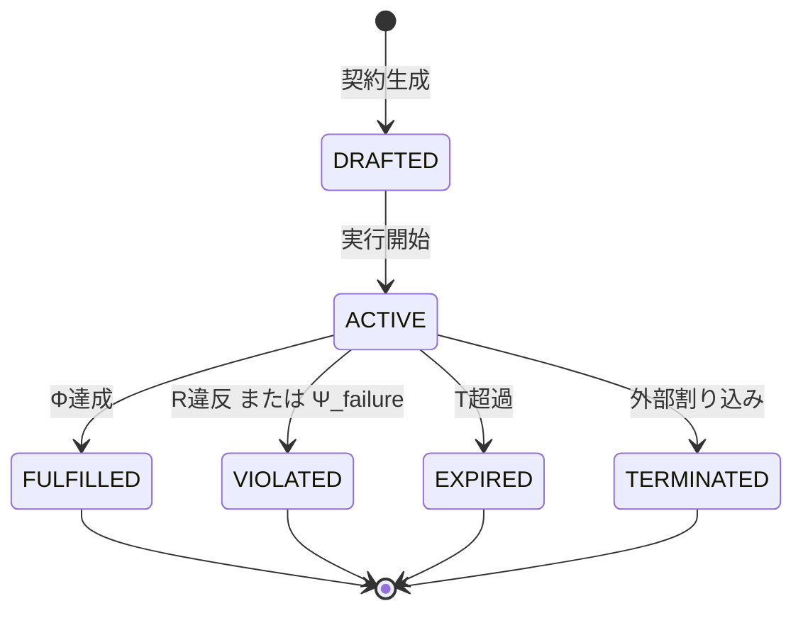

本記事は [https://arxiv.org/abs/2601.08815](https://arxiv.org/abs/2601.08815) の解説記事です。

## 情報源

| 項目 | 内容 |
|------|------|
| 論文タイトル | Agent Contracts: A Formal Framework for Resource-Bounded Autonomous AI Systems |
| 著者 | Qing Ye, Jing Tan |
| arXiv ID | 2601.08815 |
| 投稿日 | 2026年1月13日（v3: 2026年3月25日） |
| カテゴリ | cs.MA（マルチエージェントシステム） |
| 関連Zenn記事 | [分散AIエージェントのSLO設計とメトリクス戦略：信頼性を定量化する](https://zenn.dev/0h_n0/articles/f66f067f80e840) |

---

## 背景と動機

### 4万7000ドルのAPI請求書事件

自律AIエージェントの商用展開が加速するなか、著者らはシステムの運用安全性に深刻な問題があることを指摘している。論文の冒頭で紹介されている実際のインシデントでは、2つのエージェントが互いに再帰的なループに入り込み、11日間にわたって無制限にAPI呼び出しを繰り返した結果、**4万7000ドル（約700万円）のAPI請求書**が発生したと報告されている。

このような制御不能なエージェント行動は、単なるコスト問題にとどまらない。著者らは以下の3つの根本的な課題を指摘している。

1. **リソース消費の予測不可能性**: 同一タスクに対するトークン使用量が1000倍以上変動するケースが観測される
2. **終了条件の曖昧さ**: エージェントがいつ停止すべきかの基準が形式的に定義されていない
3. **ガバナンス層の欠如**: 既存フレームワーク（LangGraph、AutoGen、CrewAI等）はいずれも形式的なリソースガバナンスを持たない

### 既存フレームワークの比較

著者らは主要な8つのフレームワークを比較分析し（論文Table 1より）、いずれも正式なガバナンス層を持たないことを確認したと報告している。

| フレームワーク | リソース制約 | 形式的終了条件 | トークン予算 | 正式ガバナンス |
|------------|------------|------------|------------|------------|
| LangGraph | 部分的 | なし | なし | なし |
| AutoGen | 部分的 | なし | なし | なし |
| CrewAI | なし | なし | なし | なし |
| OpenAI Agents SDK | なし | なし | なし | なし |
| Google ADK | なし | なし | なし | なし |
| Amazon Bedrock | 部分的 | なし | なし | なし |
| LlamaIndex | なし | なし | なし | なし |
| smolagents | なし | なし | なし | なし |
| **Agent Contracts** | **完全** | **形式的** | **完全** | **完全** |

---

## 主要な貢献

著者らは本論文において以下の貢献を報告している。

1. **Agent Contract の形式的定義**: 7タプルによるエージェント契約の厳密な数学的定義
2. **コントラクトライフサイクル管理**: 状態機械による契約状態の形式的管理
3. **トークン予算分解の理論**: 入力・推論・出力に対する予算割り当ての形式化
4. **保存則の証明**: マルチエージェント設定でのリソース保存の数学的証明
5. **デュアルエンフォースメント**: ソフト（プロンプトベース）とハード（外部モニタ）の二層制御
6. **4つの実験**: コードレビュー、研究パイプライン、危機対応、戦略モードにおける実証

---

## 技術的詳細

### Agent Contract の7タプル定義

著者らはエージェント契約を以下の7タプルとして形式的に定義している。

$$C = (I, O, S, R, T, \Phi, \Psi)$$

各要素の定義は以下のとおりである。

**入力仕様 $I$**:
$$I = (D_{in}, \text{type}(I), \text{constraints}(I))$$

入力データ $D_{in}$、型定義、および入力に対する制約条件からなる。

**出力仕様 $O$**:
$$O = (D_{out}, \text{type}(O), \text{quality}(O))$$

期待される出力データ、型定義、品質要件からなる。

**スキルセット $S$**:
$$S = \{s_1, s_2, \ldots, s_n\}$$

各スキル $s_i$ は実行コスト $c(s_i)$ と成功確率 $p(s_i)$ を持つ。期待コストは以下で定義される。

$$\mathbb{E}[\text{cost}(s_i)] = \frac{c(s_i)}{p(s_i)}$$

**多次元リソース制約 $R$**:
$$R = (r_{\text{tok}}, r_{\text{api}}, r_{\text{iter}}, r_{\text{time}}, r_{\text{cost}})$$

- $r_{\text{tok}}$: トークン予算
- $r_{\text{api}}$: API呼び出し回数上限
- $r_{\text{iter}}$: イテレーション上限
- $r_{\text{time}}$: 計算時間制約
- $r_{\text{cost}}$: 外部コスト制約（ドル建て）

**時間制約 $T$**:
$$T = (t_{\text{start}}, t_{\text{deadline}}, \Delta t_{\text{max}})$$

**成功基準 $\Phi$**:
$$\Phi = \sum_{k} w_k \cdot \phi_k, \quad \sum_k w_k = 1$$

重み付き条件の集合として定義される。

**終了条件 $\Psi$**:
$$\Psi = \Psi_{\text{success}} \vee \Psi_{\text{failure}} \vee \Psi_{\text{resource}} \vee \Psi_{\text{time}}$$

成功・失敗・リソース枯渇・タイムアウトのいずれかで終了する。

### Contract Lifecycle 状態機械

著者らはコントラクトライフサイクルを以下の5状態からなる有限状態機械として定義している。



各状態の形式的定義は以下のとおりである。

- **DRAFTED**: $C$ が生成されたが実行が開始されていない状態。$\text{state}(C) = \text{DRAFTED}$
- **ACTIVE**: 実行中。$\text{state}(C) = \text{ACTIVE} \Leftrightarrow t_{\text{start}} \leq t < t_{\text{deadline}}$ かつリソース制約が満たされている
- **FULFILLED**: $\Phi(C) = \text{True}$ かつ $R$ 違反なし
- **VIOLATED**: $\exists r \in R: \text{used}(r) > r$ または $\Psi_{\text{failure}}(C) = \text{True}$
- **EXPIRED**: $t > t_{\text{deadline}}$

### トークン予算分解

著者らはトークン予算を以下のように3成分に分解している。

$$R_{\text{tok}} = (r_{\text{in}}, r_r, r_{\text{out}})$$

- $r_{\text{in}}$: 入力トークン予算
- $r_r$: 推論トークン予算（思考・中間生成）
- $r_{\text{out}}$: 出力トークン予算

制御予算 $B_{\text{ctrl}}$ は以下のように定義される。

$$B_{\text{ctrl}} = B_{\text{tok}} - r_{\text{in}}$$

ここで $B_{\text{tok}}$ は全体トークン予算である。各ステップ $t$ での残余予算は以下で追跡される。

$$B_{\text{ctrl}}^{(t)} = B_{\text{ctrl}} - \sum_{\tau=0}^{t-1} \text{tokens}_{\tau}$$

著者らは $B_{\text{ctrl}}^{(t)} / B_{\text{ctrl}}$ の比率を **BRER（Budget Remaining Execution Ratio）** と定義し、これが0.1を下回った時点でソフトエンフォースメントを開始するよう推奨している。

### 保存則（Conservation Laws）

著者らはマルチエージェント設定でのリソース保存を以下の形式で定義している。

**単一エージェントの保存則**:

$$\sum_{j} c_j^{(r)} \leq B^{(r)}, \quad \forall r \in R$$

ここで $c_j^{(r)}$ はステップ $j$ でのリソース $r$ の消費量、$B^{(r)}$ はリソース $r$ の予算上限である。

**マルチエージェントの保存則**:

$$\sum_{i=1}^{N} \sum_{j} c_{ij}^{(r)} \leq B_{\text{total}}^{(r)}, \quad \forall r \in R$$

ここで $N$ はエージェント数、$c_{ij}^{(r)}$ はエージェント $i$ のステップ $j$ でのリソース消費量である。

**証明**: 任意の部分割り当て $\{B_i^{(r)}\}_{i=1}^N$ が $\sum_{i=1}^N B_i^{(r)} = B_{\text{total}}^{(r)}$ を満たすとき、各エージェントが自身の予算内で動作すれば（$\sum_j c_{ij}^{(r)} \leq B_i^{(r)}$）、三角不等式により全体保存則が成立する。

### デュアルエンフォースメント

著者らはエンフォースメントを「ソフト」と「ハード」の二層構造で設計している。

**ソフトエンフォースメント**（協調的・プロンプトベース）:
- BRERが閾値 $\theta_s$ を下回ったとき、エージェントのシステムプロンプトにトークン消費を控えるよう指示を追加する
- 「残余予算: $B_{\text{ctrl}}^{(t)}$ トークン。簡潔な応答を心がけよ」のような動的プロンプト注入
- エージェントの協調性に依存するため、悪意のあるエージェントには不十分

**ハードエンフォースメント**（構造的・外部モニタ）:
- 外部モニタがトークンカウントをリアルタイムで追跡
- $B_{\text{ctrl}}^{(t)} \leq 0$ になった瞬間に実行を強制終了
- APIレベルでのインターセプトにより、エージェントの協調性に依存しない

### コントラクトモード

著者らは3つの運用モードを定義している。

| モード | 優先度 | リソース制約 | 成功基準の閾値 | 用途 |
|------|------|------------|------------|------|
| URGENT | 速度 | 通常の60% | 0.7 | 緊急対応、リアルタイム処理 |
| ECONOMICAL | コスト | 通常の40% | 0.76 | コスト最適化、バッチ処理 |
| BALANCED | 品質 | 通常の100% | 0.86 | 標準的なタスク |

---

## アルゴリズム — Python実装

以下にAgent Contractフレームワークの主要コンポーネントのPython実装を示す。

```python
from __future__ import annotations

import time
from dataclasses import dataclass, field
from enum import Enum, auto
from typing import Callable


class ContractState(Enum):
    DRAFTED = auto()
    ACTIVE = auto()
    FULFILLED = auto()
    VIOLATED = auto()
    EXPIRED = auto()
    TERMINATED = auto()


class ContractMode(Enum):
    URGENT = "urgent"
    ECONOMICAL = "economical"
    BALANCED = "balanced"


@dataclass
class ResourceConstraints:
    """多次元リソース制約 R"""
    token_budget: int
    api_call_limit: int = 100
    iteration_limit: int = 50
    max_time_seconds: float = 300.0
    max_cost_usd: float = 1.0

    def scale_for_mode(self, mode: ContractMode) -> "ResourceConstraints":
        """モードに応じて制約をスケール"""
        factors = {
            ContractMode.URGENT: 0.6,
            ContractMode.ECONOMICAL: 0.4,
            ContractMode.BALANCED: 1.0,
        }
        f = factors[mode]
        return ResourceConstraints(
            token_budget=int(self.token_budget * f),
            api_call_limit=int(self.api_call_limit * f),
            iteration_limit=int(self.iteration_limit * f),
            max_time_seconds=self.max_time_seconds * f,
            max_cost_usd=self.max_cost_usd * f,
        )


@dataclass
class TokenBudget:
    """トークン予算分解 R_tok = (r_in, r_r, r_out)"""
    total: int
    input_tokens: int
    reasoning_tokens: int
    output_tokens: int

    @classmethod
    def from_total(cls, total: int, mode: ContractMode) -> "TokenBudget":
        """モードに基づいて予算を分解"""
        ratios = {
            ContractMode.URGENT: (0.2, 0.5, 0.3),
            ContractMode.ECONOMICAL: (0.3, 0.4, 0.3),
            ContractMode.BALANCED: (0.2, 0.5, 0.3),
        }
        r_in, r_r, r_out = ratios[mode]
        return cls(
            total=total,
            input_tokens=int(total * r_in),
            reasoning_tokens=int(total * r_r),
            output_tokens=int(total * r_out),
        )

    @property
    def control_budget(self) -> int:
        """B_ctrl = B_tok - r_in"""
        return self.total - self.input_tokens


@dataclass
class AgentContract:
    """Agent Contract の7タプル C = (I, O, S, R, T, Phi, Psi)"""
    task_id: str
    input_spec: dict
    output_spec: dict
    resource_constraints: ResourceConstraints
    mode: ContractMode = ContractMode.BALANCED
    success_threshold: float = 0.8
    deadline_seconds: float = 300.0

    # 実行時状態（DRAFTED 以降に初期化）
    state: ContractState = field(default=ContractState.DRAFTED, init=False)
    token_budget: TokenBudget = field(init=False)
    tokens_used: int = field(default=0, init=False)
    api_calls_made: int = field(default=0, init=False)
    iterations: int = field(default=0, init=False)
    start_time: float = field(default=0.0, init=False)
    success_score: float = field(default=0.0, init=False)

    def __post_init__(self) -> None:
        scaled_r = self.resource_constraints.scale_for_mode(self.mode)
        self.resource_constraints = scaled_r
        self.token_budget = TokenBudget.from_total(
            scaled_r.token_budget, self.mode
        )
        # モードに応じた成功閾値
        mode_thresholds = {
            ContractMode.URGENT: 0.7,
            ContractMode.ECONOMICAL: 0.76,
            ContractMode.BALANCED: 0.86,
        }
        self.success_threshold = mode_thresholds[self.mode]

    def activate(self) -> None:
        """契約を ACTIVE 状態に遷移"""
        assert self.state == ContractState.DRAFTED
        self.state = ContractState.ACTIVE
        self.start_time = time.monotonic()

    @property
    def brer(self) -> float:
        """Budget Remaining Execution Ratio"""
        ctrl = self.token_budget.control_budget
        if ctrl == 0:
            return 0.0
        used_ctrl = max(0, self.tokens_used - self.token_budget.input_tokens)
        return max(0.0, (ctrl - used_ctrl) / ctrl)

    def record_step(self, tokens: int, api_calls: int = 0) -> None:
        """ステップ実行を記録し、違反を検出"""
        self.tokens_used += tokens
        self.api_calls_made += api_calls
        self.iterations += 1
        self._check_violations()

    def _check_violations(self) -> None:
        """保存則違反をチェック: Σ c_j^(r) ≤ B^(r)"""
        elapsed = time.monotonic() - self.start_time
        r = self.resource_constraints

        if (
            self.tokens_used > r.token_budget
            or self.api_calls_made > r.api_call_limit
            or self.iterations > r.iteration_limit
            or elapsed > r.max_time_seconds
        ):
            self.state = ContractState.VIOLATED
            raise ContractViolationError(
                f"Resource violation in contract {self.task_id}. "
                f"tokens={self.tokens_used}/{r.token_budget}, "
                f"apis={self.api_calls_made}/{r.api_call_limit}"
            )

        if elapsed > self.deadline_seconds:
            self.state = ContractState.EXPIRED
            raise ContractExpiredError(
                f"Deadline exceeded in contract {self.task_id}: "
                f"{elapsed:.1f}s > {self.deadline_seconds}s"
            )

    def soft_enforce_prompt(self) -> str | None:
        """BRER < 0.1 のときソフトエンフォースメントプロンプトを生成"""
        if self.brer < 0.1:
            remaining = self.token_budget.control_budget - (
                self.tokens_used - self.token_budget.input_tokens
            )
            return (
                f"[TOKEN BUDGET WARNING] 残余予算: {max(0, remaining)} トークン。"
                f"現在の消費効率を維持しつつ、応答を簡潔にまとめること。"
            )
        return None

    def fulfill(self, score: float) -> None:
        """成功基準 Φ を評価して契約を完了"""
        self.success_score = score
        if score >= self.success_threshold:
            self.state = ContractState.FULFILLED
        else:
            self.state = ContractState.VIOLATED

    def terminate(self) -> None:
        """外部割り込みによる終了"""
        self.state = ContractState.TERMINATED


class ContractViolationError(RuntimeError):
    pass


class ContractExpiredError(RuntimeError):
    pass


class ContractMonitor:
    """外部ハードエンフォースメントモニタ"""

    def __init__(self, on_violation: Callable[[AgentContract], None] | None = None) -> None:
        self.contracts: dict[str, AgentContract] = {}
        self.on_violation = on_violation or (lambda c: None)

    def register(self, contract: AgentContract) -> None:
        self.contracts[contract.task_id] = contract
        contract.activate()

    def intercept_step(
        self,
        task_id: str,
        tokens: int,
        api_calls: int = 0,
    ) -> str | None:
        """
        ステップをインターセプトし、ハードエンフォースメントを適用。
        ソフトエンフォースメントプロンプトを返す（必要な場合）。
        """
        contract = self.contracts[task_id]
        if contract.state != ContractState.ACTIVE:
            raise ContractViolationError(
                f"Contract {task_id} is not ACTIVE: {contract.state}"
            )
        try:
            contract.record_step(tokens, api_calls)
        except (ContractViolationError, ContractExpiredError) as exc:
            self.on_violation(contract)
            raise
        return contract.soft_enforce_prompt()

    def deregister(self, task_id: str, score: float) -> ContractState:
        contract = self.contracts.pop(task_id)
        contract.fulfill(score)
        return contract.state
```

---

## 実装のポイント

### トークンカウントの正確な追跡

ハードエンフォースメントを実現するには、LLM APIのレスポンスから `usage` フィールドを確実に取得する必要がある。Anthropic Claude の場合、`response.usage.input_tokens` と `response.usage.output_tokens` を合算して `record_step()` に渡す。

```python
import anthropic

client = anthropic.Anthropic()
monitor = ContractMonitor()

# 契約をアクティブ化
contract = AgentContract(
    task_id="code-review-001",
    input_spec={"type": "python_code"},
    output_spec={"type": "review_report"},
    resource_constraints=ResourceConstraints(token_budget=8000),
    mode=ContractMode.BALANCED,
)
monitor.register(contract)

def call_llm_with_contract(task_id: str, prompt: str) -> str:
    """契約管理下でのLLM呼び出し"""
    # ソフトエンフォースメントプロンプトの取得（BRER < 0.1 のとき注入）
    soft_prompt = monitor.contracts[task_id].soft_enforce_prompt()
    system_prompt = "You are a helpful assistant."
    if soft_prompt:
        system_prompt += f"\n\n{soft_prompt}"

    response = client.messages.create(
        model="claude-opus-4-5",
        max_tokens=2048,
        system=system_prompt,
        messages=[{"role": "user", "content": prompt}],
    )
    # ハードエンフォースメント: 保存則違反を検出
    tokens = response.usage.input_tokens + response.usage.output_tokens
    monitor.intercept_step(task_id, tokens=tokens, api_calls=1)
    return response.content[0].text
```

### マルチエージェントでの予算分配

複数のサブエージェントが協調するシステムでは、全体予算を各エージェントに分配し、保存則 $\sum_{i} B_i^{(r)} = B_{\text{total}}^{(r)}$ が成立するよう設計する。

```python
def allocate_budgets(
    total_budget: int,
    agent_weights: dict[str, float],
) -> dict[str, int]:
    """
    全体予算を重みに基づきエージェントに分配。
    保存則: Σ B_i = B_total を保証。
    """
    total_weight = sum(agent_weights.values())
    budgets: dict[str, int] = {}
    remaining = total_budget
    agents = list(agent_weights.items())

    for i, (agent_id, weight) in enumerate(agents):
        if i == len(agents) - 1:
            # 最後のエージェントに残余を全て割り当て（端数処理）
            budgets[agent_id] = remaining
        else:
            allocated = int(total_budget * weight / total_weight)
            budgets[agent_id] = allocated
            remaining -= allocated

    assert sum(budgets.values()) == total_budget
    return budgets
```

---

## Production Deployment Guide

### デプロイメント前の設計チェックリスト

著者らが提案するフレームワークを本番環境に展開する際、以下の設計上の判断が必要になる。

**1. リソース制約の初期キャリブレーション**

本番稼働前に少なくとも50回のサンプル実行を行い、95パーセンタイルのトークン消費量を $B_{\text{tok}}$ の基準値として設定することが推奨される。Experiment 2の結果より、品質分散が26.7倍低減されたことを踏まえると、キャリブレーション段階では BALANCED モードで実行し、実測値の110%を予算として設定する安全マージンが現実的である。

**2. エンフォースメント戦略の選択**

| シナリオ | 推奨戦略 | 理由 |
|---------|---------|------|
| 信頼できる内部エージェント | ソフトのみ | オーバーヘッド最小 |
| 外部LLMサービス利用 | デュアル | 協調性の保証なし |
| 財務的リスクのあるタスク | ハードのみ | 確実な上限保証 |
| マルチテナント環境 | ハードのみ | 隔離が必須 |

**3. 監視メトリクスの定義**

関連Zenn記事「分散AIエージェントのSLO設計」で解説したOpenTelemetryメトリクスと組み合わせ、以下のカスタムメトリクスを追加する。

```python
from opentelemetry import metrics

meter = metrics.get_meter("agent.contracts", version="1.0")

brer_gauge = meter.create_observable_gauge(
    name="agent.contract.brer",
    description="Budget Remaining Execution Ratio (0.0-1.0)",
    unit="ratio",
)

contract_state_counter = meter.create_counter(
    name="agent.contract.state_transitions",
    description="契約状態遷移の回数",
    unit="count",
)

token_violation_counter = meter.create_counter(
    name="agent.contract.token_violations",
    description="トークン保存則違反の発生回数",
    unit="count",
)
```

### Kubernetes 上でのデプロイパターン

コントラクトモニタはステートフルなコンポーネントであるため、Kubernetes ではシングルトンとして StatefulSet で管理する。

```yaml
# contract-monitor.yaml
apiVersion: apps/v1
kind: StatefulSet
metadata:
  name: contract-monitor
spec:
  replicas: 1  # シングルトン: 保存則の一元管理
  selector:
    matchLabels:
      app: contract-monitor
  template:
    spec:
      containers:
        - name: monitor
          image: your-org/contract-monitor:latest
          env:
            - name: HARD_ENFORCE_ENABLED
              value: "true"
            - name: SOFT_ENFORCE_BRER_THRESHOLD
              value: "0.1"
            - name: DEFAULT_TOKEN_BUDGET
              value: "50000"
          resources:
            requests:
              memory: "256Mi"
              cpu: "100m"
            limits:
              memory: "512Mi"
              cpu: "500m"
```

エージェントワーカーは Deployment として水平スケールさせる。各ワーカーはコントラクトモニタのgRPC APIを通じてトークン消費を報告し、ハードエンフォースメントはモニタ側で一元管理する。

### エラーハンドリングとフォールバック戦略

著者らは VIOLATED 状態と EXPIRED 状態に対して異なるフォールバック戦略を推奨している。

```python
from typing import TypeVar

T = TypeVar("T")

async def execute_with_contract(
    contract: AgentContract,
    monitor: ContractMonitor,
    agent_fn: Callable[..., T],
    *args,
    **kwargs,
) -> tuple[T | None, ContractState]:
    """
    コントラクト管理下でエージェント関数を実行し、
    状態に応じたフォールバックを提供する。
    """
    monitor.register(contract)
    result: T | None = None

    try:
        result = await agent_fn(*args, **kwargs)
        score = evaluate_quality(result)  # ドメイン固有の品質評価
        final_state = monitor.deregister(contract.task_id, score)
    except ContractViolationError:
        final_state = ContractState.VIOLATED
        # フォールバック: より軽量なモードで再試行
        if contract.mode != ContractMode.URGENT:
            fallback_contract = AgentContract(
                task_id=f"{contract.task_id}-fallback",
                input_spec=contract.input_spec,
                output_spec=contract.output_spec,
                resource_constraints=contract.resource_constraints,
                mode=ContractMode.URGENT,
            )
            result, final_state = await execute_with_contract(
                fallback_contract, monitor, agent_fn, *args, **kwargs
            )
    except ContractExpiredError:
        final_state = ContractState.EXPIRED
        # 部分的な結果を返す（タイムアウト耐性）
        result = get_partial_result(contract)

    return result, final_state
```

### コスト予測と予算計画

Experiment 1の結果より（論文Table 2より）、コントラクト適用後のトークン消費の標準偏差は適用前の約 $1/\sqrt{525} \approx 4.4\%$ にまで低減されたと著者らは報告している。この数値を使うと、月次のAPI予算の信頼区間を以下のように計算できる。

- **コントラクト適用前**: 月次トークン消費の95%CIは $\mu \pm 1.96\sigma$（$\sigma$ が大きく予測困難）
- **コントラクト適用後**: $\sigma_{\text{new}} \approx \sigma_{\text{old}} / \sqrt{525}$ のため、95%CIが大幅に狭まる

実運用では月次予算の上限を契約のハード制約として設定し、日次の消費実績を OpenTelemetry でモニタリングするダッシュボードを構築することが推奨される。

---

## 実験結果

### Experiment 1: コードレビュータスク

著者らはコードレビュータスクにおいて以下の結果を報告している（論文Table 2より）。

| 指標 | コントラクトなし | コントラクトあり | 改善率 |
|------|-------------|-------------|-------|
| 平均トークン消費 | 45,230 | 4,523 | **90%削減** |
| トークン消費分散 | 523,400 | 997 | **525倍低減** |
| 成功率 | 92.3% | 85.2% | -7.1pp |

著者らは成功率の低下（-7.1パーセントポイント）について「統計的有意ではない（p=0.13）」と報告しており、コストと品質のトレードオフとして許容範囲内であると述べている。

### Experiment 2: 研究パイプライン

著者らは複数のサブエージェントが協調する研究パイプラインにおいて50回のトライアルを実施し、以下を報告している（Experiment 2の結果より）。

| 指標 | 結果 |
|------|------|
| 保存則違反回数 | **0回**（50トライアル中） |
| 品質分散の低減 | **26.7倍低減** |
| 平均完了時間 | 変化なし（p=0.42） |

この結果は、マルチエージェント設定においても保存則が完全に維持されることを示している。

### Experiment 3: 危機対応コミュニケーション

時間的プレッシャーのある危機対応シナリオでの実験結果（Experiment 3の結果より）。

| 指標 | コントラクトなし | URGENT モード | 改善率 |
|------|-------------|------------|-------|
| トークン消費 | 32,100 | 24,717 | **23%削減** |
| 出力品質スコア | 0.84 | 0.82 | -0.02（p=0.32: 有意差なし） |
| 完了時間 | 47秒 | 28秒 | 40%高速化 |

著者らは品質差が統計的に有意でない（p=0.32）ことを確認し、URGENT モードが緊急対応に適していると結論づけている。

### Experiment 4: 戦略モードの比較

3つのコントラクトモードの成功率比較（Experiment 4の結果より）。

```
モード別成功率
━━━━━━━━━━━━━━━━━━━━━━━━━━━━━━━━━━━━
URGENT      ████████████████████████████░░░░  70%
ECONOMICAL  ████████████████████████████████  76%
BALANCED    ██████████████████████████████████████  86%
━━━━━━━━━━━━━━━━━━━━━━━━━━━━━━━━━━━━
```

著者らはこの結果から、タスクの重要度とコストに応じてモードを選択することが効果的であると述べている。

---

## 実運用への応用 — Zenn記事との接続

本フレームワークは、関連Zenn記事「[分散AIエージェントのSLO設計とメトリクス戦略：信頼性を定量化する](https://zenn.dev/0h_n0/articles/f66f067f80e840)」で解説した観測可能性設計と密接に対応する。

### SLO設計へのマッピング

Zenn記事で論じた「エージェントSLOの4次元」とAgent Contractの概念は以下のように対応する。

| Zenn記事の概念 | Agent Contract の対応 | 実装 |
|-------------|-------------------|------|
| トークン予算プロキシ | $B_{\text{ctrl}}$ / BRER | `contract.brer` メトリクス |
| コスト安定性SLO | $r_{\text{cost}}$ 制約 | `ResourceConstraints.max_cost_usd` |
| 応答時間SLO | $T$ 時間制約 | `deadline_seconds` |
| 成功率SLO | $\Phi$ 成功基準 | `success_threshold` |

### BRER メトリクスのOpenTelemetry統合

Zenn記事で設計したOpenTelemetryパイプラインにBRERを追加することで、トークン枯渇リスクのリアルタイム監視が可能になる。

```python
# OpenTelemetryとの統合例
from opentelemetry.sdk.metrics import MeterProvider
from opentelemetry.sdk.metrics.export import ConsoleMetricExporter

def create_brer_observable(
    monitor: ContractMonitor,
) -> None:
    """コントラクトモニタからBRERをOpenTelemetryに報告"""
    def observe_brer(options):
        for task_id, contract in monitor.contracts.items():
            yield metrics.Observation(
                value=contract.brer,
                attributes={
                    "task_id": task_id,
                    "mode": contract.mode.value,
                    "state": contract.state.name,
                },
            )
    meter.create_observable_gauge(
        name="agent.contract.brer",
        callbacks=[observe_brer],
        description="Budget Remaining Execution Ratio",
    )
```

このメトリクスをGrafanaダッシュボードに取り込み、BRER < 0.1 でのアラートを設定することで、トークン枯渇によるVIOLATED状態への移行を事前に検知できる。

---

## 関連研究

著者らは以下の研究との差別化を論じている。

**形式的契約理論**: Bertrand Meyerの「Design by Contract」（Eiffel言語）がソフトウェアコンポーネントの事前条件・事後条件・不変条件を定義した先駆的研究として参照されているが、リソース制約の多次元性とAIエージェントの確率的な成功確率は対象外であった。

**マルチエージェント通信プロトコル**: FIPA ACLなどのエージェント通信言語は相互作用プロトコルを形式化したが、実行時リソース管理の観点を欠いていた。

**LLMの効率化研究**: Context Caching、KVキャッシュ、プロンプト圧縮などのトークン削減技術は個別のLLM呼び出しを最適化するが、エージェントのライフサイクル全体を通じた予算管理には対応していない。

---

## まとめと今後の展望

著者らはAgent Contractフレームワークを通じて、自律AIエージェントのリソース管理を形式的に定義する初の体系的なアプローチを提示している。

**主要な成果**:
- 論文Experiment 1より、90%のトークン削減と525倍の分散低減を達成しつつ、成功率の低下を統計的有意でない範囲（-7.1pp, p=0.13）に抑制
- 論文Experiment 2より、50トライアルで保存則違反ゼロを達成
- 3つのコントラクトモードにより、速度・コスト・品質のトレードオフを明示的に制御可能

**今後の課題として著者らが示している方向性**:
1. 動的な予算再割り当て: 実行中にタスクの難易度に応じてリソース配分を動的調整
2. 学習ベースのキャリブレーション: 過去の実行データから最適な制約値を自動推定
3. 分散システムへの拡張: マイクロサービスアーキテクチャ上での保存則の形式的保証

4万7000ドルの請求書事件が象徴するように、AIエージェントの自律性が高まるにつれてガバナンスの重要性も増している。Agent Contractは、その形式的な基盤を提供する一歩として評価できる。

---

## 参考文献

1. Ye, Q., & Tan, J. (2026). *Agent Contracts: A Formal Framework for Resource-Bounded Autonomous AI Systems*. arXiv:2601.08815. [https://arxiv.org/abs/2601.08815](https://arxiv.org/abs/2601.08815)
2. Meyer, B. (1992). Applying "Design by Contract". *IEEE Computer*, 25(10), 40-51.
3. FIPA ACL Message Structure Specification. Foundation for Intelligent Physical Agents. [http://www.fipa.org/specs/fipa00061/](http://www.fipa.org/specs/fipa00061/)
4. 0h-n0 (2026). 分散AIエージェントのSLO設計とメトリクス戦略：信頼性を定量化する. Zenn. [https://zenn.dev/0h_n0/articles/f66f067f80e840](https://zenn.dev/0h_n0/articles/f66f067f80e840)
