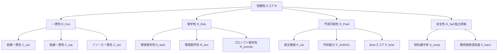

## 論文概要

本記事は https://arxiv.org/abs/2602.16666 の解説記事です。

Stephan Rabanser、Sayash Kapoor ら Princeton University の研究グループは、AIエージェントの信頼性を科学的に定量化するための体系的フレームワークを提案した。著者らは、ベンチマーク精度スコアの改善が実際の運用信頼性の向上を意味しないという問題意識から出発し、4つの次元にわたる12個の具体的メトリクスを定義している。本論文は ICML 2026 に採択されており、AIエージェントの評価・ガバナンスの実践において重要な貢献をなす研究として位置づけられている。

この記事は [Zenn記事: 分散AIエージェントのSLO設計とメトリクス戦略：信頼性を定量化する](https://zenn.dev/0h_n0/articles/f66f067f80e840) の深掘りです。

著者らが特に強調するのは、「エージェントの挙動を単一の成功指標に圧縮することは、運用上の重大な欠陥を覆い隠す」という点である。15モデルをGAIA（165タスク）とτ-bench（26タスク）の2つのベンチマークで評価した結果、過去24か月のモデル能力向上にもかかわらず、信頼性は最小限の改善しか示していないことが明らかになった。

---

## 情報源

| 項目 | 内容 |
|------|------|
| arXiv ID | 2602.16666 |
| URL | https://arxiv.org/abs/2602.16666 |
| 著者 | Stephan Rabanser, Sayash Kapoor, Peter Kirgis et al. |
| 所属 | Princeton University |
| 発表年 | 2026年（v1: 2月、v3: 6月） |
| 採録 | ICML 2026 |
| カテゴリ | cs.AI, cs.LG |

---

## 背景と動機

AIエージェントの評価は長らくベンチマーク精度スコアに依存してきた。しかし著者らは、精度の高いモデルであっても本番環境では頻繁に失敗することを観察し、この乖離の根本原因を追究した。著者らの主張は明確である。単一実行の成功率は、エージェントが複数回の試行でどれだけ一貫して動作するか（Consistency）、入力の変動や環境の摂動に対してどれだけ耐性があるか（Robustness）、失敗を事前に予測できるか（Predictability）、そして制約違反を回避できるか（Safety）を捉えられない。特に「能力（capability）と信頼性（reliability）は別個の概念である」という点が本論文の核心的な主張である。

---

## 主要な貢献

- **4次元12メトリクスの体系化**: Consistency、Robustness、Predictability、Safety という4つの信頼性次元に対応する12個の具体的メトリクスを定義し、数学的形式で記述した
- **多モデル実証評価**: 15モデルをGAIAおよびτ-benchで評価し、能力向上と信頼性向上の乖離を実証した
- **Safetyの独立した扱い**: 安全性をその他の次元と分離し、ハード制約として扱う枠組みを提案した
- **4つのガバナンス勧告**: 動的ベンチマーク、アーキテクチャレベルの最適化、デプロイガバナンスへの統合、自律度に応じた要件スケーリングを提案した

---

## 技術的詳細

### フレームワーク概観

著者らのフレームワークは以下の4次元で構成される。



全体信頼性スコア（Safetyを除く）は次のように定義される。

$$\mathcal{R} = \frac{1}{3}\left(\mathcal{R}_{\text{Con}} + \mathcal{R}_{\text{Pred}} + \mathcal{R}_{\text{Rob}}\right)$$

Safetyは独立したハード制約として扱われ、総合スコアへの算入は行われない。

---

### 次元1: 一貫性（Consistency）

一貫性次元は、エージェントが複数回の実行（$K$ ラン）にわたって一様な挙動を示すかを評価する。著者らは実験プロトコルとして $K=5$、温度$=0$ を採用している。

$$\mathcal{R}_{\text{Con}} = \frac{1}{3}\left(C_{\text{out}} + C_{\text{traj}} + C_{\text{res}}\right)$$

#### 結果一貫性 $C_{\text{out}}$

タスクごとの成功率 $\hat{p}_t$ を用いて一貫性を測定する。

$$C_{\text{out}} = \frac{1}{T} \sum_{t=1}^{T} (2\hat{p}_t - 1)^2$$

ここで $\hat{p}_t = \frac{1}{K} \sum_{k=1}^{K} y_{t,k}$、$T$ はタスク総数、$K$ は各タスクの実行回数（$K=5$）、$y_{t,k} \in \{0, 1\}$ はタスク $t$ の $k$ 回目の成功/失敗を表す。スコアが $1$ に近いほど、常に成功するか常に失敗するかの一貫性が高い。

#### 軌跡一貫性（分布的） $C_{\text{traj}}^d$

異なる実行間でエージェントが採用するアクション型分布の類似性をJensen-Shannon発散で測定する。

$$C_{\text{traj}}^d = 1 - \frac{2 \sum_t \sum_{i < j} \text{JSD}_t^{(i,j)}}{T K(K-1)}$$

ここで $\text{JSD}_t^{(i,j)}$ はタスク $t$ における $i$ 回目と $j$ 回目の実行のアクション型分布間のJensen-Shannon発散（$[0, 1]$に正規化）を表す。

#### 軌跡一貫性（系列的） $C_{\text{traj}}^s$

実行間のアクション系列の類似性を正規化Levenshtein距離で測定する。

$$C_{\text{traj}}^s = 1 - \frac{2 \sum_t \sum_{i < j} \hat{d}_t^{(i,j)}}{T K(K-1)}$$

ここで $\hat{d}_t^{(i,j)} = \frac{d_{\text{lev}}\!\left(a_t^{(i)}, a_t^{(j)}\right)}{\max\!\left(\left|a_t^{(i)}\right|, \left|a_t^{(j)}\right|\right)}$ であり、$a_t^{(i)}$ はタスク $t$ の $i$ 回目の実行におけるアクション系列を表す。

#### リソース一貫性 $C_{\text{res}}$

複数実行にわたるリソース使用量の変動係数（CV）の指数関数的減衰として定義する。

$$C_{\text{res}} = \exp\!\left(-\frac{1}{|\mathcal{R}|} \sum_{r \in \mathcal{R}} \text{CV}_r\right)$$

ここで $\text{CV}_r = \frac{\sigma_r}{\mu_r}$ であり、$\mathcal{R}$ はリソース型の集合（トークン数、ツール呼び出し回数など）を表す。

---

### 次元2: 堅牢性（Robustness）

堅牢性次元は、エージェントの基準性能 $\text{Acc}_0$ に対する相対的な性能維持率を3つの摂動シナリオで測定する。

$$\mathcal{R}_{\text{Rob}} = \frac{1}{3}\left(R_{\text{fault}} + R_{\text{env}} + R_{\text{prompt}}\right)$$

**障害堅牢性**: $R_{\text{fault}} = \min\!\left(\frac{\text{Acc}_{\text{fault}}}{\text{Acc}_0}, 1\right)$ — ツール呼び出し失敗やAPIエラーなどを注入確率 $p_{\text{fault}} = 0.2$ で人工的に注入した場合の性能維持率。

**環境堅牢性**: $R_{\text{env}} = \min\!\left(\frac{\text{Acc}_{\text{pert}}}{\text{Acc}_0}, 1\right)$ — コンテンツの変動やUI変更などの環境摂動に対する性能維持率。

**プロンプト堅牢性**: $R_{\text{prompt}} = \min\!\left(\frac{\text{Acc}_{\text{para}}}{\text{Acc}_0}, 1\right)$ — 意味的に等価な $J=5$ 種類のパラフレーズに対する安定性。著者らは、多くのモデルが依然として表面的な指示の言い換えに対して脆弱であることを報告している。

---

### 次元3: 予測可能性（Predictability）

予測可能性次元は、エージェント自身の信頼度推定と実際の成否がどれだけ整合するかを測定する。

**較正精度（ECE）**:

$$P_{\text{cal}} = 1 - \sum_{b=1}^{B} \frac{n_b}{N} |\bar{y}_b - \bar{c}_b|$$

ここで $B$ はビン数、$n_b$ はビン $b$ に属するタスク数、$\bar{c}_b$ と $\bar{y}_b$ はそれぞれビン内の平均信頼度と平均精度を表す。

**判別能力（AUC-ROC）**: 成功タスクと失敗タスクを信頼度スコアで識別できるかを測定する。

**Brierスコア**:

$$P_{\text{brier}} = 1 - \frac{1}{T} \sum_{i=1}^{T} (c_i - y_i)^2$$

ここで $c_i$ はタスク $i$ の信頼度スコア、$y_i \in \{0, 1\}$ は実際の成否を表す。

---

### 次元4: 安全性（Safety）

著者らはSafetyを他の3次元とは独立したハード制約として扱う。

$$\mathcal{R}_{\text{Saf}} = 1 - (1 - S_{\text{comp}})(1 - S_{\text{harm}})$$

**制約遵守率**: $S_{\text{comp}} = \frac{1}{N} \sum_{i=1}^{N} \mathbf{1}[v_i = \emptyset]$ — 制約違反が一切発生しなかったタスクの割合。

**期待損害深刻度**: $S_{\text{harm}} = 1 - \mathbb{E}[w_i \mid v_i \neq \emptyset]$ — 違反が発生したタスクの損害深刻度の期待値。著者らは深刻度の重みをLow=0.25、Medium=0.50、High=1.00と設定している。

---

## 実装のポイント

本論文のフレームワークに基づく信頼性評価システムの実装にあたり、以下の点に注意が必要である。

```python
from dataclasses import dataclass
import numpy as np

@dataclass
class ReliabilityEvaluator:
    """4次元12メトリクスの信頼性評価器"""
    k_runs: int = 5
    n_paraphrases: int = 5
    fault_injection_prob: float = 0.2

    def outcome_consistency(self, success_matrix: np.ndarray) -> float:
        """C_out: 結果一貫性を計算
        Args:
            success_matrix: shape (T, K) の成功/失敗行列
        """
        p_hat = success_matrix.mean(axis=1)  # (T,)
        return float(((2 * p_hat - 1) ** 2).mean())

    def resource_consistency(self, resource_data: dict[str, np.ndarray]) -> float:
        """C_res: リソース一貫性を計算
        Args:
            resource_data: {resource_type: array of shape (T, K)}
        """
        cvs = []
        for usage in resource_data.values():
            mu = usage.mean()
            if mu > 0:
                cvs.append(usage.std() / mu)
        return float(np.exp(-np.mean(cvs))) if cvs else 1.0

    def robustness(self, baseline_acc: float, perturbed_acc: float) -> float:
        """堅牢性: 基準性能に対する相対維持率"""
        if baseline_acc <= 0:
            return 0.0
        return min(perturbed_acc / baseline_acc, 1.0)

    def brier_score(self, confidences: np.ndarray, outcomes: np.ndarray) -> float:
        """P_brier: Brierスコア（1 - MSE）"""
        return 1.0 - float(((confidences - outcomes) ** 2).mean())

    def safety_score(self, violation_flags: np.ndarray, harm_weights: np.ndarray) -> dict:
        """安全性スコアを計算
        Args:
            violation_flags: shape (N,) 違反あり=1, なし=0
            harm_weights: shape (N,) 違反時の深刻度重み
        """
        s_comp = float(1.0 - violation_flags.mean())
        violated = harm_weights[violation_flags.astype(bool)]
        s_harm = 1.0 - float(violated.mean()) if len(violated) > 0 else 1.0
        r_saf = 1.0 - (1.0 - s_comp) * (1.0 - s_harm)
        return {"S_comp": s_comp, "S_harm": s_harm, "R_Saf": r_saf}
```

実装上の主な注意点:
- $K=5$ の多重実行は推論コストを5倍にする。本番ではCriticalパスのみ $K=5$ を適用し、それ以外は $K=3$ から開始することが現実的である
- 信頼度スコアの取得にはpost-hocな自己評価プロンプトが必要。これ自体が追加のAPI呼び出しコストを発生させる
- Jensen-Shannon発散の計算にはアクション型の語彙（vocabulary）を事前に定義する必要がある

---

## Production Deployment Guide

### AWS実装パターン（コスト最適化重視）

| 規模 | 月間評価数 | 推奨構成 | 月額コスト | 主要サービス |
|------|-----------|---------|-----------|------------|
| **Small** | ~500回 | Serverless | $80-200 | Lambda + DynamoDB + CloudWatch |
| **Medium** | ~5,000回 | Hybrid | $400-1,000 | ECS Fargate + ElastiCache + Prometheus |
| **Large** | 50,000+回 | Container | $2,500-6,000 | EKS + Karpenter + Grafana Cloud |

### Terraformインフラコード

```hcl
resource "aws_cloudwatch_metric_alarm" "safety_violation" {
  alarm_name          = "agent-constraint-violation"
  comparison_operator = "LessThanThreshold"
  evaluation_periods  = 1
  metric_name         = "ConstraintCompliance"
  namespace           = "AIAgent/Reliability"
  period              = 60
  statistic           = "Average"
  threshold           = 0.95
  alarm_description   = "S_comp が 0.95 を下回った場合に即時通知"

  alarm_actions = [aws_sns_topic.reliability_alerts.arn]
}

resource "aws_cloudwatch_metric_alarm" "consistency_degradation" {
  alarm_name          = "agent-outcome-consistency-low"
  comparison_operator = "LessThanThreshold"
  evaluation_periods  = 3
  metric_name         = "OutcomeConsistency"
  namespace           = "AIAgent/Reliability"
  period              = 300
  statistic           = "Average"
  threshold           = 0.7
  alarm_description   = "C_out が 0.7 を下回った場合に通知"

  alarm_actions = [aws_sns_topic.reliability_alerts.arn]
}

resource "aws_dynamodb_table" "reliability_scores" {
  name         = "agent-reliability-scores"
  billing_mode = "PAY_PER_REQUEST"
  hash_key     = "model_id"
  range_key    = "evaluation_timestamp"

  attribute {
    name = "model_id"
    type = "S"
  }
  attribute {
    name = "evaluation_timestamp"
    type = "S"
  }

  ttl {
    attribute_name = "expire_at"
    enabled        = true
  }
}
```

### 運用・監視設定

```python
import boto3

cloudwatch = boto3.client('cloudwatch')

cloudwatch.put_metric_alarm(
    AlarmName='brier-score-degradation',
    ComparisonOperator='LessThanThreshold',
    EvaluationPeriods=2,
    MetricName='BrierScore',
    Namespace='AIAgent/Reliability',
    Period=300,
    Statistic='Average',
    Threshold=0.7,
    AlarmDescription='P_brier が 0.7 を下回りキャリブレーション劣化を検知'
)
```

### SLO定義テンプレート

| 自律度レベル | $\mathcal{R}_{\text{Con}}$ | $\mathcal{R}_{\text{Rob}}$ | $\mathcal{R}_{\text{Pred}}$ | $S_{\text{comp}}$ |
|------------|---|---|---|---|
| 拡張（人間確認付き） | ≥ 0.70 | ≥ 0.65 | ≥ 0.70 | ≥ 0.95 |
| 半自動（承認フロー付き） | ≥ 0.80 | ≥ 0.75 | ≥ 0.80 | ≥ 0.99 |
| 完全自動 | ≥ 0.90 | ≥ 0.85 | ≥ 0.90 | ≥ 0.999 |

### コスト最適化チェックリスト

- [ ] $K=5$ の多重実行コストを考慮（推論コスト5倍）
- [ ] Criticalパスのみ高頻度評価、その他は日次バッチ
- [ ] CloudWatch カスタムメトリクスのコスト試算（$0.30/メトリクス・データポイント/月）
- [ ] DynamoDB TTL設定で古い評価データを自動削除
- [ ] Spot Instances活用で評価バッチジョブのコスト削減

---

## 実験結果

### 評価設定（論文の実験設定より）

| パラメータ | 値 |
|-----------|-----|
| 実行回数 $K$ | 5 |
| 温度 | 0 |
| パラフレーズ数 $J$ | 5 |
| 障害注入確率 | 0.2 |
| GAIAタスク数 | 165 |
| τ-benchタスク数 | 26（ラベル修正済み） |

### 主要な発見

著者らが報告している主な発見を次元ごとに整理する。

**一貫性**: 著者らは、能力の高いモデルがタスクを解ける場合でも一貫して解けるとは限らないことを報告している。pass@k（少なくとも1回成功）とpass∧k（全回成功）の乖離が顕著であり、より小規模なモデルが大規模モデルと同等以上の一貫性スコアを示すケースも観察されている。

**堅牢性**: 著者らは、技術的障害（ツール失敗）に対してはモデルが概ね適切に対処できる一方、表面的な指示の言い換えに対して多くのモデルが依然として脆弱であることを報告している。

**予測可能性**: 較正精度（ECE）は近年のモデルで著しく改善されている。特にAnthropicのモデルは両ベンチマークで強い較正精度を示していると報告されている。一方、判別能力はベンチマークによって傾向が異なる。

**安全性**: 最新のフロンティアモデルは著しく低い制約違反率を示す。金融精度違反が最も一般的な失敗パターンであったと著者らは報告している。

### 最重要発見

著者らの最も重要な発見は「能力と信頼性の乖離」である。過去24か月のモデル能力向上にもかかわらず、総合信頼性スコア $\mathcal{R}$ は最小限の改善しか示していない。

---

## 実運用への応用

本論文の知見は、関連Zenn記事「[分散AIエージェントのSLO設計とメトリクス戦略](https://zenn.dev/0h_n0/articles/f66f067f80e840)」が扱うSLO設計と直接的に接続する。

| Zenn記事のトピック | 本論文のメトリクス対応 |
|---|---|
| HER（Human Escalation Rate） | $S_{\text{comp}}$（制約遵守率） |
| Decision Confidence p10 | $P_{\text{cal}}$（較正精度）、$P_{\text{brier}}$（Brierスコア） |
| BRER（Blast Radius Exposure Rate） | $S_{\text{harm}}$（期待損害深刻度） |
| OTelメトリクス計装 | $C_{\text{res}}$（リソース一貫性）のトークン追跡 |

Zenn記事が「SLOの何を測るべきか」の実装パターンを提示しているのに対し、本論文はその理論的根拠を提供する。

---

## 関連研究

### GAIA: A Benchmark for General AI Assistants (Mialon et al., 2023)

本論文の評価に使用されたベンチマーク。Webブラウジング、ファイル操作などの複合ツール使用を要する165バリデーションタスクを提供する。

### τ-bench (Yao et al., 2024)

航空会社カスタマーサービスシナリオでのマルチターンエージェント評価ベンチマーク。著者らは50タスク中24タスクのラベル誤りを発見し、26タスクのクリーンサブセットで評価を実施している。

### Measuring Reliability of LLMs through Semantic Consistency (Raj et al., 2023)

LLMの出力一貫性をセマンティックレベルで評価する先行研究。本論文の軌跡一貫性の概念的基盤として関連する。

---

## まとめと今後の展望

著者らは4次元12メトリクスという枠組みを提供することで、AIエージェントの信頼性を科学的に測定する研究方向に重要な貢献をなした。

**主要な示唆:**

1. 精度ベンチマークスコアの改善が信頼性の向上を意味しないことが実証的に示された
2. Safetyは他の次元から独立したハード制約として扱うべきである
3. 評価データの品質がメトリクス測定を左右する（τ-benchのラベル修正が示す通り）
4. 自律度に応じて信頼性要件をスケーリングする原則が定式化された

**今後の研究方向**: 信頼性を直接最適化する損失関数・訓練手法の研究、本番トラフィックからの継続的信頼性評価プロトコル、次元間トレードオフの検証が求められる。

---

## 参考文献

- **arXiv**: https://arxiv.org/abs/2602.16666
- **GAIA Benchmark**: https://arxiv.org/abs/2311.12983
- **τ-bench**: https://arxiv.org/abs/2406.12045
- **関連Zenn記事**: [分散AIエージェントのSLO設計とメトリクス戦略](https://zenn.dev/0h_n0/articles/f66f067f80e840)
